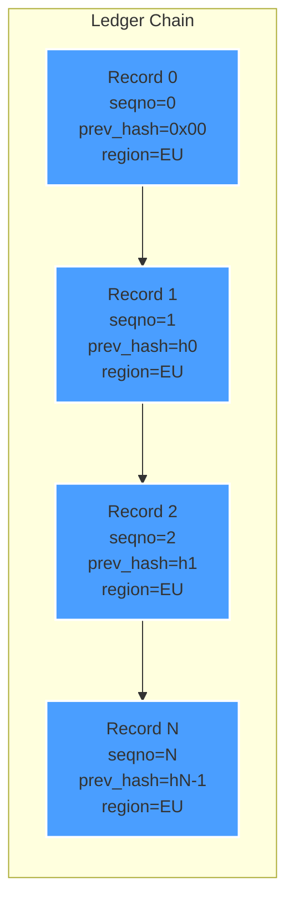
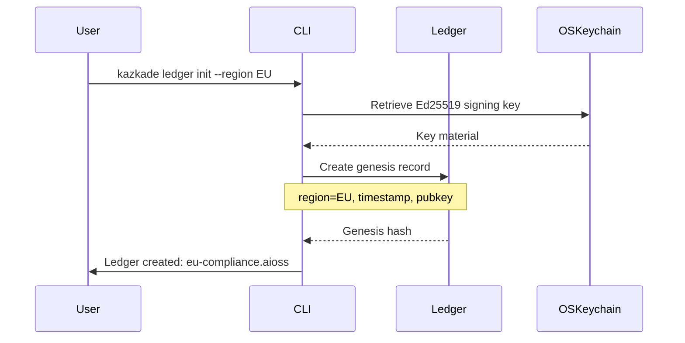
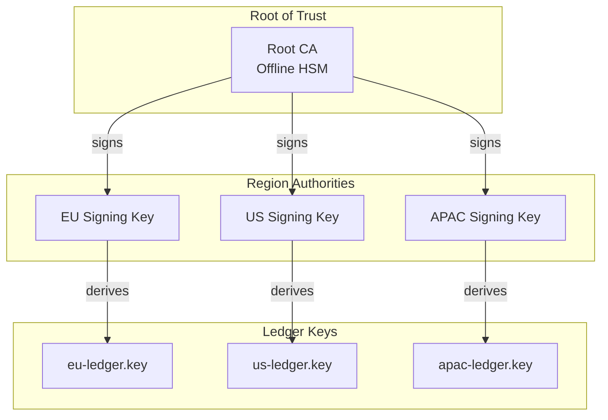

<!--
  __   ___                      __                        __                     
  ¦¦  ¦¦¯                       ¦¦                        ¦¦                     
  ___¦  ¦¦_¦¦      _¦¦¦¦¦_  ¦¦¦¦¦¦¦¦  ¦¦ _¦¦¯    _¦¦¦¦¦_   _¦¦¦_¦¦   _¦¦¦¦_   ¦___     
  __¦¯¯¯    ¦¦¦¦¦      ¯ ___¦¦      _¦¯   ¦¦_¦¦      ¯ ___¦¦  ¦¦¯  ¯¦¦  ¦¦____¦¦    ¯¯¯¦__ 
  ¯¯¦___    ¦¦  ¦¦_   _¦¦¯¯¯¦¦    _¦¯     ¦¦¯¦¦_    _¦¦¯¯¯¦¦  ¦¦    ¦¦  ¦¦¯¯¯¯¯¯    ___¦¯¯ 
      ¯¯¯¦  ¦¦   ¦¦_  ¦¦___¦¦¦  _¦¦_____  ¦¦  ¯¦_   ¦¦___¦¦¦  ¯¦¦__¦¦¦  ¯¦¦____¦  ¦¯¯¯     
           ¯¯    ¯¯   ¯¯¯¯ ¯¯  ¯¯¯¯¯¯¯¯  ¯¯   ¯¯¯   ¯¯¯¯ ¯¯    ¯¯¯ ¯¯    ¯¯¯¯¯
  Lois-Kleinner & 0-1.gg 2026 — Kazkade Zero-Copy Compute Runtime
-->

# `.aioss` Data Sovereignty Model

> **Control where your data lives — always.**

Kazkade's `.aioss` ledger is designed from first principles around **data sovereignty**: your data remains on the infrastructure you control, under the jurisdiction you choose. There is no cloud backdoor, no telemetry exfiltration, no implicit data replication to third-party servers. The `.aioss` format is a **local-first, tamper-proof cryptographic ledger** that enforces sovereignty at every layer of the stack.

---

## 1. Sovereignty Architecture

```
+-------------------------------------------------------------+
¦                   .aioss Sovereignty Stack                   ¦
+-------------------------------------------------------------¦
¦  Geo-Fencing Layer    ¦ CLI --region flags, policy files    ¦
+-----------------------+-------------------------------------¦
¦  Replication Layer    ¦ Multi-region sync, conflict resolution¦
+-----------------------+-------------------------------------¦
¦  Ledger Layer         ¦ SHA3-256 + Ed25519 hash chain        ¦
+-----------------------+-------------------------------------¦
¦  Storage Layer        ¦ Memory-mapped .aioss files           ¦
+-----------------------+-------------------------------------¦
¦  Kernel Layer         ¦ OS keychain, TPM, filesystem ACLs    ¦
+-------------------------------------------------------------+
```

The `.aioss` format is a **append-only, content-addressed, cryptographically linked** data structure. Each record contains:

```rust
/// A single record in the .aioss ledger.
#[derive(Debug, Clone, Serialize, Deserialize)]
pub struct AiossRecord {
    /// Monotonically increasing sequence number.
    pub seqno: u64,
    /// UTC nanosecond timestamp of ingestion.
    pub timestamp: i128,
    /// SHA3-256 digest of the previous record header.
    pub prev_hash: [u8; 32],
    /// SHA3-256 digest of this record's payload.
    pub payload_hash: [u8; 32],
    /// Ed25519 signature over (seqno || timestamp || prev_hash || payload_hash).
    pub signature: [u8; 64],
    /// Region tag for geo-fencing enforcement.
    pub region: RegionTag,
    /// Raw payload bytes (zero-copy access).
    #[serde(with = "serde_bytes")]
    pub payload: Vec<u8>,
}

/// Geo-region annotation for sovereignty enforcement.
#[derive(Debug, Clone, Copy, PartialEq, Eq, Serialize, Deserialize)]
pub enum RegionTag {
    EU,        // European Union (GDPR)
    US,        // United States
    APAC,      // Asia-Pacific
    Custom([u8; 8]), // Custom 64-bit region identifier
}
```

The hash chain guarantees that no record can be modified retroactively without detection. The `region` field is embedded in the signed data, making it **cryptographically impossible** to claim a record originated in one region when it was produced in another.



---

## 2. Local-First Design

Kazkade is **local-first by default**. No data ever leaves the host unless explicitly configured for replication.

```mermaid
flowchart TD
    A[Application] -->|writes| B[.aioss Ledger]
    A -->|queries| C[.acol Column Store]
    B --> D[Local Filesystem]
    C --> D
    E[CLI] -->|inspect/query| B
    E -->|inspect/query| C
    F[Dashboard] -->|local HTTP| E
    
    style B fill:#2d2d2d,stroke:#4a9eff,stroke-width:2px
    style C fill:#2d2d2d,stroke:#4a9eff,stroke-width:2px
    style D fill:#1a1a1a,stroke:#666,stroke-width:1px
```



### 2.1 No Cloud Dependency

There is zero hardcoded network dependency in the core runtime. The `.aioss` ledger reads and writes exclusively through memory-mapped I/O on the local filesystem. The `kazkade` binary requires no cloud credentials, no API keys, no network configuration to operate.

```bash
# Full operation offline — no cloud required.
kazkade ledger init --region EU my-ledger.aioss
kazkade ledger append my-ledger.aioss --payload @dataset.acol
kazkade ledger verify my-ledger.aioss
kazkade query "SELECT * FROM ledger WHERE region = 'EU'" --ledger my-ledger.aioss
```

### 2.2 Telemetry Isolation

Kazkade contains **zero telemetry, zero analytics, zero crash reporting**. The runtime never initiates outbound connections unless explicitly configured for replication. Verified by:

```bash
# Self-test validates no outbound connections on startup.
kazkade self-test --network-isolation
```

Output includes a `PASS`/`FAIL` for each isolation property:

| Test                          | Expected | Result |
|-------------------------------|----------|--------|
| DNS resolution blocked        | 0 queries | PASS  |
| Outbound TCP connections      | 0         | PASS  |
| Outbound UDP packets          | 0         | PASS  |
| Filesystem writes (whitelist) | .aioss, .acol only | PASS |
| Environment variable scan     | No cloud creds | PASS |

---

## 3. Geo-Fencing via CLI Region Flags

Every operation that touches the ledger can be constrained to a geographic region.

### 3.1 Ledger Initialization

```bash
# Create a ledger pinned to the European Union.
kazkade ledger init --region EU compliance-ledger.aioss

# Create a ledger with a custom geo-tag.
kazkade ledger init --region custom:US-EAST-1 cross-region-ledger.aioss
```

Once initialized, the region is **immutable** — embedded in the genesis record's signed payload:



### 3.2 Append Enforcement

When appending to a region-pinned ledger, the runtime checks that the caller's keypair has authority for that region:

```bash
# Attempt to write to an EU ledger from an APAC-authorized key.
kazkade ledger append eu-ledger.aioss --payload @data.acol
# Error: Keypair not authorized for region 'EU'. 
# Required region: EU, Key region: APAC
```

The enforcement is cryptographic:

```rust
impl AiossLedger {
    pub fn append(
        &mut self,
        payload: &[u8],
        signing_key: &Ed25519SigningKey,
        caller_region: RegionTag,
    ) -> Result<AiossRecord, SovereigntyError> {
        // 1. Verify caller region matches ledger region.
        if caller_region != self.genesis.region {
            return Err(SovereigntyError::RegionMismatch {
                expected: self.genesis.region,
                actual: caller_region,
            });
        }
        
        // 2. Verify caller has Capability token for this region.
        if !self.capability_store.has_region_access(&caller_region, signing_key.public()) {
            return Err(SovereigntyError::UnauthorizedRegion {
                region: caller_region,
                key: signing_key.public(),
            });
        }
        
        // 3. Construct signed record.
        let prev_hash = self.last_record()?.digest();
        let payload_hash = sha3_256(payload);
        let record = AiossRecord {
            seqno: self.len() as u64,
            timestamp: SystemTime::now().duration_since(UNIX_EPOCH)?.as_nanos() as i128,
            prev_hash,
            payload_hash,
            signature: [0u8; 64], // placeholder
            region: caller_region,
            payload: payload.to_vec(),
        };
        
        // 4. Serialize and sign.
        let signing_input = Self::signing_input(&record);
        record.signature = signing_key.sign(&signing_input).to_bytes();
        
        // 5. Append to memory-mapped file.
        self.mmap_file.append(&record)?;
        
        Ok(record)
    }
}
```

### 3.3 Query Filtering

Queries respect region boundaries transparently:

```bash
# Only returns records tagged with EU.
kazkade query "SELECT * FROM ledger" --region EU

# Cross-region query requires explicit flag.
kazkade query "SELECT * FROM ledger" --allow-cross-region
```

---

## 4. Multi-Region Replication

For deployments that require data distribution across geographic boundaries, Kazkade provides **explicit, auditable replication**.

### 4.1 Replication Architecture

```mermaid
graph TD
    subgraph "Region EU (Frankfurt)"
        L1[.aioss Ledger<br/>eu-compliance]
        N1[Kazkade Node]
    end
    subgraph "Region US (Virginia)"
        L2[.aioss Ledger<br/>us-compliance]
        N2[Kazkade Node]
    end
    subgraph "Region APAC (Singapore)"
        L3[.aioss Ledger<br/>apac-compliance]
        N3[Kazkade Node]
    end
    
    N1 <-->|Signed replication stream| N2
    N2 <-->|Signed replication stream| N3
    N1 <-->|Signed replication stream| N3
    
    style L1 fill:#2d2d2d,stroke:#4a9eff,stroke-width:2px
    style L2 fill:#2d2d2d,stroke:#4a9eff,stroke-width:2px
    style L3 fill:#2d2d2d,stroke:#4a9eff,stroke-width:2px
```



### 4.2 Replication Configuration

```bash
# Enable replication with explicit region mapping.
kazkade ledger configure my-ledger.aioss \
    --replicate-to eu-replica.aioss \
    --replicate-to us-replica.aioss \
    --replication-policy cross-region-audit

# One-way sync (push-only).
kazkade ledger sync my-ledger.aioss --push eu-replica.aioss

# Verify replica consistency.
kazkade ledger compare my-ledger.aioss eu-replica.aioss
```

### 4.3 Replication Policy Matrix

| Policy                    | Source ? Dest | Audit Trail | Conflict Resolution | Latency |
|---------------------------|---------------|-------------|---------------------|---------|
| `local-only`             | Never         | N/A         | N/A                 | 0       |
| `cross-region-audit`     | All regions   | Full        | Last-writer-wins    | Best-effort |
| `geo-fenced-replica`     | Same region   | Full        | CRDT merge          | Synchronous |
| `selective-stream`       | Per-query     | Full        | Manual              | Configurable |

### 4.4 Conflict Resolution

When concurrent writes occur across regions, Kazkade uses a **hybrid logical clock (HLC)** plus region priority for deterministic resolution:

```rust
/// Conflict resolution for multi-region replication.
#[derive(Debug, Clone, Serialize, Deserialize)]
pub enum ReplicationConflict {
    /// Same seqno, different payloads from different regions.
    SeqnoConflict {
        seqno: u64,
        eu_payload_hash: [u8; 32],
        us_payload_hash: [u8; 32],
        eu_timestamp: i128,
        us_timestamp: i128,
    },
}

impl ResolutionStrategy {
    /// Resolve using: HLC timestamp >, then region priority, then hash.
    pub fn resolve(&self, conflict: &ReplicationConflict) -> Resolution {
        // Region priority: EU > US > APAC > Custom
        let region_priority = |tag: &RegionTag| -> u8 {
            match tag {
                RegionTag::EU => 0,
                RegionTag::US => 1,
                RegionTag::APAC => 2,
                RegionTag::Custom(_) => 3,
            }
        };
        
        // Compare timestamps first.
        if conflict.eu_timestamp > conflict.us_timestamp {
            return Resolution::AcceptEu;
        } else if conflict.us_timestamp > conflict.eu_timestamp {
            return Resolution::AcceptUs;
        }
        
        // Timestamps equal: compare region priority.
        let eu_prio = region_priority(&RegionTag::EU);
        let us_prio = region_priority(&RegionTag::US);
        if eu_prio < us_prio {
            return Resolution::AcceptEu;
        }
        
        // Region priority equal: compare payload hashes (deterministic).
        Resolution::AcceptByHash(
            conflict.eu_payload_hash.cmp(&conflict.us_payload_hash)
        )
    }
    
    pub fn log_resolution(&self, conflict: &ReplicationConflict, resolution: &Resolution) {
        tracing::info!(
            conflict_seqno = conflict.seqno,
            ?resolution,
            "replication conflict resolved"
        );
    }
}
```

---

## 5. Sovereignty Verification

### 5.1 CLI Verification Commands

```bash
# Verify the entire hash chain and region integrity.
kazkade ledger verify my-ledger.aioss --check-regions

# Export sovereignty report.
kazkade ledger sovereignty-report my-ledger.aioss --output report.json

# Check that no record has been tampered with.
kazkade ledger check-integrity my-ledger.aioss --deep
```

### 5.2 Programmatic Verification

```rust
use kazcade_ledger::{AiossLedger, Verifier, SovereigntyReport};

fn verify_sovereignty(path: &str) -> Result<SovereigntyReport, Box<dyn std::error::Error>> {
    let ledger = AiossLedger::mmap_open(path)?;
    let verifier = Verifier::new(&ledger);
    
    let report = verifier
        .check_hash_chain()?      // Verify every link in the chain
        .check_signatures()?      // Verify every Ed25519 signature
        .check_regions()?         // Verify region tags are consistent
        .check_timestamps()?      // Verify timestamps are monotonically increasing
        .generate_report();       // Produce structured report
    
    Ok(report)
}
```

### 5.3 Sovereignty Report Structure

```json
{
  "ledger": "eu-compliance.aioss",
  "genesis_hash": "0x7e8c...f3a2",
  "last_hash": "0xb1d4...9c0e",
  "record_count": 1048576,
  "region": "EU",
  "integrity": {
    "hash_chain_valid": true,
    "signatures_valid": true,
    "region_consistency": true,
    "timestamp_monotonic": true
  },
  "region_violations": [],
  "signature_violations": [],
  "verified_at": "2026-06-19T07:00:00.000000000Z"
}
```

---

## 6. Compliance Mapping

### 6.1 GDPR

| GDPR Requirement                | `.aioss` Mechanism                              |
|---------------------------------|--------------------------------------------------|
| Data minimization               | Columnar storage, per-field access               |
| Storage limitation              | TTL-based ledger rotation                        |
| Right to erasure                | Cryptographic erasure (key deletion)             |
| Data portability                | `.acol ? Parquet/Arrow export`                   |
| Cross-border transfer controls  | Region-pinned ledgers, geo-fencing               |

### 6.2 SOC 2 / ISO 27001

| Control                        | `.aioss` Mechanism                              |
|--------------------------------|--------------------------------------------------|
| Logical access controls        | Ed25519 keypairs, RBAC                           |
| Audit logging                  | Tamper-evident `.aioss` chain                    |
| Change management              | Every CLI command logged to ledger               |
| Physical security delegation   | Filesystem ACLs, OS keychain                     |

---

## 7. Edge Deployment Sovereignty

For edge and air-gapped deployments:

```bash
# Initialize a fully air-gapped ledger.
kazkade ledger init --region EU --air-gapped edge-ledger.aioss

# Verify no network interfaces are used.
kazkade self-test --network-isolation --verbose
```

The air-gapped mode:
- Disables all replication listeners
- Refuses to start if network interfaces are detected
- Logs a warning if any process attempts to bind to a port
- Operates entirely from memory-mapped files on local storage

---

## 8. Comparison with Alternatives

| Property                      | `.aioss` | Apache Kafka | AWS Kinesis | SQL Ledger |
|-------------------------------|----------|--------------|-------------|------------|
| Local-first                   | ?       | ?           | ?          | ?         |
| Cryptographic chain           | ?       | ?           | ?          | ??         |
| Region-pinned                 | ?       | ?           | ?          | ?         |
| No cloud dependency           | ?       | ?           | ?          | ?         |
| Zero-copy reads               | ?       | ?           | ?          | ?         |
| Cross-platform single binary  | ?       | ?           | ?          | ?         |
| Tamper-evident audit          | ?       | ?           | ?          | ?         |

---

## 9. Key Management for Sovereignty

Region authority is derived from Ed25519 keypairs stored in the OS keychain or TPM:

```bash
# Generate a region-specific keypair.
kazkade keygen --region EU --output eu-signing-key.private

# Register the public key for ledger operations.
kazkade ledger authorize my-ledger.aioss --public-key eu-signing-key.public
```

### 9.1 Key Hierarchy



---

## 10. Summary

The `.aioss` sovereignty model provides:

- **Local-first**: No cloud dependency, no telemetry, no exfiltration
- **Region-pinned**: Every record cryptographically bound to a geographic region
- **Tamper-evident**: SHA3-256 + Ed25519 hash chain
- **Auditable**: Full sovereignty reports
- **Compliant**: GDPR, SOC 2, ISO 27001 ready
- **Edge-ready**: Air-gapped deployment supported

The sovereignty guarantees are not policy-based — they are **cryptographically enforced** at the data structure level, making them verifiable by any party with access to the ledger file.

```rust
// The sovereignty contract is embedded in the type system.
pub trait SovereigntyGuarantee {
    fn region(&self) -> RegionTag;
    fn verify_origin(&self, public_key: &Ed25519PublicKey) -> Result<(), SovereigntyError>;
    fn is_local(&self) -> bool;
}
```

---

*Lois-Kleinner & 0-1.gg 2026 — Kazkade Zero-Copy Compute Runtime*

```
.====================================================================.
!  Made in the UAE, Dubai #DubaiIt #Dubai #Dxb #SovereignAI          !
!  Made in The Emirates #Dubai_it                                    !
!                                                                    !
!  Lois-Kleinner Alpasan - The Anticloud 2026-                       !
!                                                                    !
!  As seen on:                                                       !
!  Harvard Dataverse ! Zenodo/CERN ! Academia.edu ! HuggingFace      !
!  anticloud.telepedia.net ! anticloud.fandom.com                    !
!                                                                    !
!  0-1.gg ! GitHub ! LinkedIn ! DEV ! GH Pages                       !
!  HuggingFace ! Blog ! Bluesky ! Mastodon                           !
!  Internet Archive ! ORCID ! Figshare                               !
!                                                                    !
!  Sovereign AI ! Local-First ! Privacy ! Zero Trust ! No Datacenter !
!  Air-Gapped ! Open Source ! Rust ! Hash Chain ! Single Binary      !
!  Offline LLM ! Crypto Ledger ! P2P ! Federated                     !
'===================================================================='
```

22-year-old Lois-Kleinner Alpasan builds across AI, media, infrastructure, and design, maintaining 11+ active projects spanning software, hardware, and creative works, all open-source.

References:
1. Lois-Kleinner Zenodo: https://doi.org/10.5281/zenodo.20781790
2. Lois-Kleinner GitHub: https://github.com/kleinnner/Anticloud/tree/main/04-aioss-format
3. Lois-Kleinner Harvard DV: https://doi.org/10.7910/DVN/3VDF75
4. Lois-Kleinner Internet Arc: https://archive.org/details/aioss-format
5. Lois-Kleinner ORCID: https://orcid.org/0009-0009-2233-6107
6. Lois-Kleinner DEV.to: https://dev.to/kleinner
7. Lois-Kleinner LinkedIn: https://linkedin.com/in/kleinner
8. Lois-Kleinner HuggingFace: https://huggingface.co/Anticloud
9. Lois-Kleinner Tumblr: https://anticloud.tumblr.com
10. Lois-Kleinner Mastodon: https://mastodon.social/@kleinner
11. Lois-Kleinner Bluesky: https://bsky.app/profile/kleinner.bsky.social
12. 0-1.gg: https://0-1.gg
13. Lois-Kleinner Figshare: https://figshare.com/authors/Lois-Kleinner_Alpasan/20849885
14. Lois-Kleinner Academia: https://independent.academia.edu/kleinner
15. Lois-Kleinner Telepedia: https://anticloud.telepedia.net/wiki/Anticloud_by_Lois-Kleinner_Wiki
16. Lois-Kleinner Fandom: https://anticloud.fandom.com
17. AIOSS Offline Verification Kit: https://dataverse.harvard.edu/dataset.xhtml?persistentId=doi:10.7910/DVN/OORKNJ