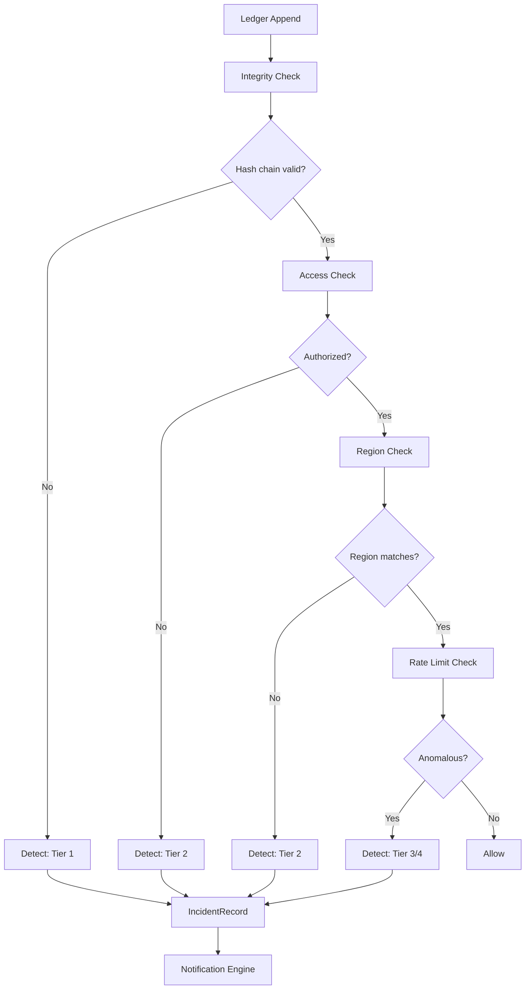
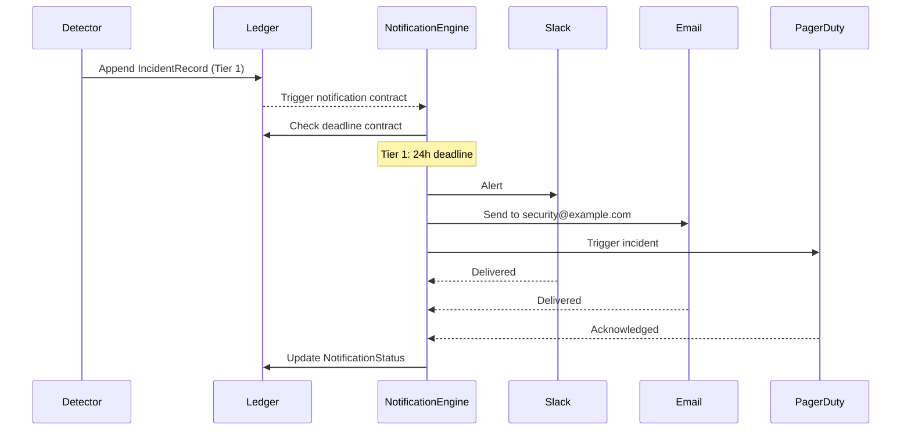

<!--
  __   ___                      __                        __                     
  ¦¦  ¦¦¯                       ¦¦                        ¦¦                     
  ___¦  ¦¦_¦¦      _¦¦¦¦¦_  ¦¦¦¦¦¦¦¦  ¦¦ _¦¦¯    _¦¦¦¦¦_   _¦¦¦_¦¦   _¦¦¦¦_   ¦___     
  __¦¯¯¯    ¦¦¦¦¦      ¯ ___¦¦      _¦¯   ¦¦_¦¦      ¯ ___¦¦  ¦¦¯  ¯¦¦  ¦¦____¦¦    ¯¯¯¦__ 
  ¯¯¦___    ¦¦  ¦¦_   _¦¦¯¯¯¦¦    _¦¯     ¦¦¯¦¦_    _¦¦¯¯¯¦¦  ¦¦    ¦¦  ¦¦¯¯¯¯¯¯    ___¦¯¯ 
      ¯¯¯¦  ¦¦   ¦¦_  ¦¦___¦¦¦  _¦¦_____  ¦¦  ¯¦_   ¦¦___¦¦¦  ¯¦¦__¦¦¦  ¯¦¦____¦  ¦¯¯¯     
           ¯¯    ¯¯   ¯¯¯¯ ¯¯  ¯¯¯¯¯¯¯¯  ¯¯   ¯¯¯   ¯¯¯¯ ¯¯    ¯¯¯ ¯¯    ¯¯¯¯¯
  Lois-Kleinner & 0-1.gg 2026 — Kazkade Zero-Copy Compute Runtime
-->

# Breach Notification

> **Detect. Classify. Notify. In time.**

Kazkade provides an automated breach notification system integrated directly into the `.aioss` ledger. When an incident is detected — whether through audit log analysis, hash chain verification failure, or access control violation — the system classifies, timestamps, and notifies stakeholders automatically. Notification timelines are enforced by on-ledger smart contracts.

---

## 1. Incident Classification Framework

### 1.1 Tier Classification

| Tier   | Name              | Description                                      | Examples                                      |
|--------|-------------------|--------------------------------------------------|-----------------------------------------------|
| Tier 1 | Critical          | Active data exfiltration, chain compromise       | Hash chain break, unauthorized admin access    |
| Tier 2 | High              | Potential data access, extended access violation | Repeated access denials, region violation      |
| Tier 3 | Medium            | Policy violation, configuration drift            | Retention policy not met, weak key rotation     |
| Tier 4 | Low               | Suspicious activity, minor policy deviation      | Unusual query pattern, off-hours access        |

```rust
/// Incident severity classification.
#[derive(Debug, Clone, Serialize, Deserialize, PartialEq, Eq, PartialOrd, Ord)]
pub enum IncidentTier {
    Tier1Critical,
    Tier2High,
    Tier3Medium,
    Tier4Low,
}

impl IncidentTier {
    pub fn max_notification_hours(&self) -> u32 {
        match self {
            IncidentTier::Tier1Critical => 24,   // GDPR Art. 33: 72h max, we target 24h
            IncidentTier::Tier2High => 48,
            IncidentTier::Tier3Medium => 72,
            IncidentTier::Tier4Low => 168,       // 7 days
        }
    }
    
    pub fn requires_regulatory_notification(&self) -> bool {
        matches!(self, IncidentTier::Tier1Critical | IncidentTier::Tier2High)
    }
}
```

### 1.2 Incident Record

Every detected incident is recorded as a signed record in the `.aioss` ledger:

```rust
/// A security incident recorded in the .aioss ledger.
#[derive(Debug, Clone, Serialize, Deserialize)]
pub struct IncidentRecord {
    pub seqno: u64,
    pub incident_id: Uuid,
    pub tier: IncidentTier,
    pub timestamp: i128,           // When incident was detected
    pub event_timestamp: i128,     // When the triggering event occurred
    pub detection_source: DetectionSource,
    pub description: String,
    pub affected_resources: Vec<String>,
    pub affected_region: Option<RegionTag>,
    pub notification_status: NotificationStatus,
    pub mitigation_steps: Option<Vec<String>>,
    pub prev_hash: [u8; 32],
    pub signature: [u8; 64],
}

#[derive(Debug, Clone, Serialize, Deserialize)]
pub enum DetectionSource {
    HashChainVerification,
    AccessControlViolation,
    RegionViolation,
    AuditAnalysis,
    IntegrityCheck,
    ManualReport,
    ExternalTool,
}

#[derive(Debug, Clone, Serialize, Deserialize, PartialEq, Eq)]
pub enum NotificationStatus {
    Pending,
    Notifying,
    Notified { at: i128, channels: Vec<NotificationChannel> },
    Escalated { at: i128, reason: String },
    Acknowledged { at: i128, by: String },
    Resolved { at: i128, resolution: String },
}
```

---

## 2. Automated Detection

### 2.1 Detection Pipeline



### 2.2 Automated Detection Configuration

```bash
# Enable automated incident detection.
kazkade breach detect enable \
    --check-hash-chain \
    --check-access-violations \
    --check-region-violations \
    --check-rate-limits

# Configure sensitivity.
kazkade breach detect configure \
    --rate-limit-threshold 1000 \
    --rate-limit-window 60 \
    --access-denial-threshold 5 \
    --access-denial-window 300
```

### 2.3 Detection Rules (WASM)

Custom detection rules can be compiled to WASM and loaded into the policy engine:

```rust
// detection_rule.wasm
#[no_mangle]
pub extern "C" fn evaluate_incident(
    audit_record_ptr: *const u8,
    audit_record_len: u32,
) -> u32 {
    let audit_slice = unsafe { std::slice::from_raw_parts(audit_record_ptr, audit_record_len as usize) };
    let record: AuditRecord = bincode::deserialize(audit_slice).unwrap();
    
    // Custom rule: flag queries between 2-4 AM returning > 10000 rows.
    let hour = (record.timestamp / 3_600_000_000_000) % 24;
    if hour >= 2 && hour <= 4 {
        if let AuditEvent::CliQuery { rows_returned, .. } = &record.event {
            if *rows_returned > 10000 {
                return 1; // Flag as suspicious
            }
        }
    }
    
    0 // No incident
}
```

```bash
# Load custom detection rule.
kazkade breach rule load --wasm detection_rule.wasm
```

---

## 3. Notification Timelines

### 3.1 Enforcement via `.aioss` Smart Contracts

Notification timelines are enforced by smart contracts embedded in ledger records:

```rust
/// Smart contract enforcing notification deadlines.
#[derive(Debug, Clone, Serialize, Deserialize)]
pub struct NotificationContract {
    pub contract_id: Uuid,
    pub tier: IncidentTier,
    pub max_hours: u32,
    pub escalation_hours: u32,
    pub penalty_policy: PenaltyPolicy,
    pub notification_channels: Vec<NotificationChannel>,
}

impl NotificationContract {
    pub fn check_deadline(&self, incident: &IncidentRecord) -> Result<DeadlineStatus, ContractError> {
        let now = now_nanos();
        let elapsed_hours = (now - incident.timestamp) as f64 / 3_600_000_000_000.0;
        
        if elapsed_hours > self.max_hours as f64 {
            // Violation: notification not sent within deadline.
            let violation = DeadlineViolation {
                incident_id: incident.incident_id,
                contract_id: self.contract_id,
                max_hours: self.max_hours,
                elapsed_hours: elapsed_hours as u32,
                penalty: self.penalty_policy.calculate(elapsed_hours as u32),
            };
            
            // Log violation to ledger.
            self.log_violation(&violation)?;
            
            return Err(ContractError::DeadlineExceeded(violation));
        }
        
        Ok(DeadlineStatus::Compliant {
            remaining_hours: self.max_hours - elapsed_hours as u32,
        })
    }
}
```

### 3.2 Notification Escalation Matrix

```mermaid
graph TD
    subgraph "Tier 1 - Critical"
        T1_0[0h: Incident detected]
        T1_1[4h: Security team notified]
        T1_12[12h: DPO notified]
        T1_24[24h: Regulatory notification<br/>DEADLINE]
        T1_E[25h: Escalation to CISO]
        
        T1_0 --> T1_1 --> T1_12 --> T1_24 --> T1_E
    end
    
    subgraph "Tier 2 - High"
        T2_0[0h: Incident detected]
        T2_8[8h: Security team notified]
        T2_24[24h: DPO notified]
        T2_48[48h: Notification DEADLINE]
        
        T2_0 --> T2_8 --> T2_24 --> T2_48
    end
    
    subgraph "Tier 3 - Medium"
        T3_0[0h: Incident detected]
        T3_24[24h: Team notified]
        T3_72[72h: Resolution expected]
        
        T3_0 --> T3_24 --> T3_72
    end
    
    subgraph "Tier 4 - Low"
        T4_0[0h: Incident detected]
        T4_168[168h: Review deadline]
        
        T4_0 --> T4_168
    end
```



---

## 4. Stakeholder Notification

### 4.1 Notification Channels

```rust
#[derive(Debug, Clone, Serialize, Deserialize)]
pub enum NotificationChannel {
    Email {
        to: Vec<String>,
        cc: Option<Vec<String>>,
        template: String,
    },
    Slack {
        webhook_url: String,
        channel: String,
        mention: Option<String>,
    },
    PagerDuty {
        routing_key: String,
        severity: String,
    },
    Webhook {
        url: String,
        headers: Vec<(String, String)>,
    },
    SMS {
        to: Vec<String>,
        provider: SmsProvider,
    },
}

#[derive(Debug, Clone, Serialize, Deserialize)]
pub enum SmsProvider {
    Twilio { account_sid: String, auth_token: String, from: String },
    AwsSns { topic_arn: String },
}
```

### 4.2 Notification Templates

```bash
# Configure notification templates.
kazkade breach notify configure \
    --email-template incident-email.hbs \
    --slack-template incident-slack.json \
    --pagerduty-template incident-pagerduty.json

# Test notification.
kazkade breach notify test \
    --channel email \
    --to security@example.com
```

### 4.3 Template Example (Handlebars)

```handlebars
{{!-- incident-email.hbs --}}
Subject: [{{tier}}] Security Incident {{incident_id}} - {{description}}

Severity: {{tier}}
Detected at: {{detected_at}}
Incident ID: {{incident_id}}

Description:
{{description}}

Affected Resources:
{{#each affected_resources}}
- {{this}}
{{/each}}

Notification Deadline: {{deadline}}

Required Actions:
{{#each required_actions}}
- {{this}}
{{/each}}

View full details: {{dashboard_url}}/incidents/{{incident_id}}
```

---

## 5. Automated Stakeholder Alerting

### 5.1 Stakeholder Configuration

```bash
# Define stakeholders and their notification preferences.
kazkade breach stakeholders define \
    --name "Security Team" \
    --email security@example.com \
    --slack #security-alerts \
    --pagerduty routing-key-abc \
    --incident-tiers Tier1,Tier2

kazkade breach stakeholders define \
    --name "DPO" \
    --email dpo@example.com \
    --sms +1234567890 \
    --incident-tiers Tier1

# Define on-call schedule.
kazkade breach stakeholders schedule \
    --team "Security Team" \
    --rotation weekly \
    --file oncall-schedule.yaml
```

### 5.2 Automated Notification Flow



---

## 6. Post-Incident Analysis

### 6.1 Incident Timeline

```bash
# View the full timeline of an incident.
kazkade breach timeline --incident-id inc_abc123

2026-06-19 01:23:45.000Z  Event: Hash chain verification failed
2026-06-19 01:23:45.001Z  Detection: Tier 1 Critical
2026-06-19 01:23:45.050Z  Record: IncidentRecord written to ledger
2026-06-19 01:23:46.000Z  Notify: Slack #security-alerts
2026-06-19 01:23:47.500Z  Notify: Email security@example.com
2026-06-19 01:23:49.000Z  Notify: PagerDuty incident PD-12345
2026-06-19 01:25:00.000Z  Ack: Alice (Security Lead)
2026-06-19 02:15:00.000Z  Mitigation: Key rotation initiated
2026-06-19 02:45:00.000Z  Resolution: Compromised key revoked
```

### 6.2 Post-Mortem Generation

```bash
# Generate a post-mortem report.
kazkade breach post-mortem \
    --incident-id inc_abc123 \
    --output post-mortem-2026-06-19.md
```

---

## 7. Compliance and Regulatory Reporting

### 7.1 Regulatory Notification

```bash
# Generate a GDPR breach notification report.
kazkade breach regulatory-report \
    --framework gdpr \
    --incident-id inc_abc123 \
    --output gdpr-breach-notification.pdf
```

### 7.2 Regulatory Notification Content

| Field                    | GDPR Art. 33 | Kazkade Mapping            |
|--------------------------|--------------|----------------------------|
| Nature of breach         | Required     | `description` field        |
| Categories of data       | Required     | `affected_resources`       |
| Approximate data subjects| Required     | Computed from ledger       |
| Contact details          | Required     | Stakeholder configuration  |
| Consequences             | Required     | Impact analysis field      |
| Measures taken           | Required     | `mitigation_steps`         |

---

## 8. Incident Response Automation

### 8.1 Automated Mitigation

```bash
# Configure automated response actions.
kazkade breach response configure \
    --incident-tier Tier1 \
    --action "revoke-all-sessions" \
    --action "rotate-keys" \
    --action "enable-enhanced-logging" \
    --action "notify-stakeholders"

# Enable automated response.
kazkade breach response enable
```

### 8.2 Response Scripts

```rust
/// Automated response action.
#[async_trait]
pub trait ResponseAction: Send + Sync {
    async fn execute(&self, incident: &IncidentRecord) -> Result<ActionResult, ResponseError>;
}

pub struct RevokeAllSessions;
pub struct RotateKeys;
pub struct EnableEnhancedLogging;

#[async_trait]
impl ResponseAction for RevokeAllSessions {
    async fn execute(&self, incident: &IncidentRecord) -> Result<ActionResult, ResponseError> {
        // Revoke all active sessions.
        let sessions = session_store::list_active_sessions().await?;
        for session in sessions {
            session_store::revoke_session(&session.id).await?;
            tracing::info!("Revoked session {}", session.id);
        }
        
        Ok(ActionResult {
            action: "revoke-all-sessions".to_string(),
            success: true,
            details: format!("Revoked {} sessions", sessions.len()),
        })
    }
}
```

---

## 9. Testing and Drills

### 9.1 Breach Simulation

```bash
# Simulate a breach for testing.
kazkade breach simulate \
    --tier Tier1 \
    --description "Simulated hash chain violation" \
    --affected-resources compliance-eu.aioss

# Run a full incident response drill.
kazkade breach drill \
    --scenario hash-chain-compromise \
    --notify-stakeholders false
```

### 9.2 Test Results

```bash
# Review drill results.
kazkade breach drill report --last

Drill ID: drill_2026_06_19_001
Scenario: Hash chain compromise
Started: 2026-06-19T02:00:00Z
Completed: 2026-06-19T02:03:45Z
Duration: 225 seconds
Stages:
  ? Detection: 0.5s
  ? Classification: 0.2s
  ? Notification (Slack): 1.5s
  ? Notification (Email): 2.0s
  ? PagerDuty trigger: 0.8s
  ? First acknowledgment: 45s
  ? Full resolution: 225s
```

---

## 10. Summary

- **Automated detection**: Hash chain, access, region, rate-limit monitoring
- **Four-tier classification**: Critical ? Low with defined timelines
- **Contract-enforced deadlines**: `.aioss` smart contracts enforce notification SLAs
- **Multi-channel notification**: Email, Slack, PagerDuty, SMS, Webhook
- **Escalation chains**: Automatic escalation on missed deadlines
- **Regulatory compliance**: GDPR Art. 33 notification built-in
- **Automated mitigation**: Key rotation, session revocation
- **Forensic-ready**: Full incident timeline in the tamper-evident ledger
- **Testable**: Simulated drills without production impact

---

*Lois-Kleinner & 0-1.gg 2026 — Kazkade Zero-Copy Compute Runtime*

```
.====================================================================.
!  Made in the UAE, Dubai #DubaiIt #Dubai #Dxb #SovereignAI          !
!  Made in The Emirates #Dubai_it                                    !
!                                                                    !
!  Lois-Kleinner Alpasan - The Anticloud 2026-                       !
!                                                                    !
!  As seen on:                                                       !
!  Harvard Dataverse ! Zenodo/CERN ! Academia.edu ! HuggingFace      !
!  anticloud.telepedia.net ! anticloud.fandom.com                    !
!                                                                    !
!  0-1.gg ! GitHub ! LinkedIn ! DEV ! GH Pages                       !
!  HuggingFace ! Blog ! Bluesky ! Mastodon                           !
!  Internet Archive ! ORCID ! Figshare                               !
!                                                                    !
!  Sovereign AI ! Local-First ! Privacy ! Zero Trust ! No Datacenter !
!  Air-Gapped ! Open Source ! Rust ! Hash Chain ! Single Binary      !
!  Offline LLM ! Crypto Ledger ! P2P ! Federated                     !
'===================================================================='
```

Lois-Kleinner Alpasan, 22, has served executive roles spanning technology, operations, finance, and product across 20+ organizations. His cross-functional work combines architecture, business, and AI strategy.

References:
1. Lois-Kleinner Zenodo: https://doi.org/10.5281/zenodo.20781790
2. Lois-Kleinner GitHub: https://github.com/kleinnner/Anticloud/tree/main/04-aioss-format
3. Lois-Kleinner Harvard DV: https://doi.org/10.7910/DVN/GKUDHE
4. Lois-Kleinner Internet Arc: https://archive.org/details/aioss-format
5. Lois-Kleinner ORCID: https://orcid.org/0009-0009-2233-6107
6. Lois-Kleinner DEV.to: https://dev.to/kleinner
7. Lois-Kleinner LinkedIn: https://linkedin.com/in/kleinner
8. Lois-Kleinner HuggingFace: https://huggingface.co/Anticloud
9. Lois-Kleinner Tumblr: https://anticloud.tumblr.com
10. Lois-Kleinner Mastodon: https://mastodon.social/@kleinner
11. Lois-Kleinner Bluesky: https://bsky.app/profile/kleinner.bsky.social
12. 0-1.gg: https://0-1.gg
13. Lois-Kleinner Figshare: https://figshare.com/authors/Lois-Kleinner_Alpasan/20849885
14. Lois-Kleinner Academia: https://independent.academia.edu/kleinner
15. Lois-Kleinner Telepedia: https://anticloud.telepedia.net
16. Lois-Kleinner Fandom: https://anticloud.fandom.com