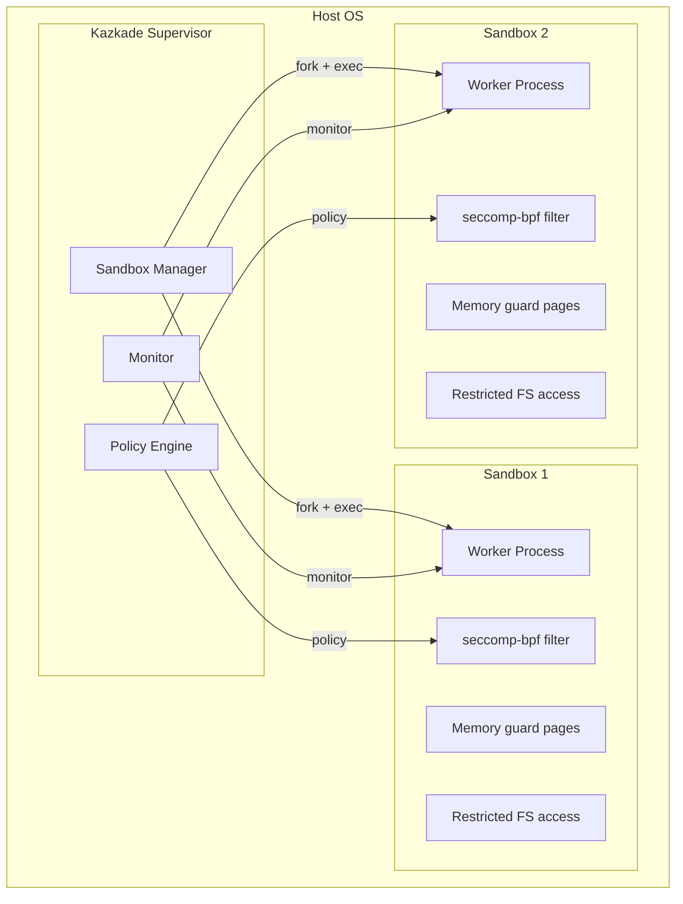
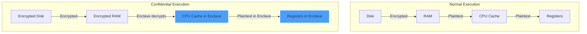

<!--
  __   ___                      __                        __                     
  ¦¦  ¦¦¯                       ¦¦                        ¦¦                     
  ___¦  ¦¦_¦¦      _¦¦¦¦¦_  ¦¦¦¦¦¦¦¦  ¦¦ _¦¦¯    _¦¦¦¦¦_   _¦¦¦_¦¦   _¦¦¦¦_   ¦___     
  __¦¯¯¯    ¦¦¦¦¦      ¯ ___¦¦      _¦¯   ¦¦_¦¦      ¯ ___¦¦  ¦¦¯  ¯¦¦  ¦¦____¦¦    ¯¯¯¦__ 
  ¯¯¦___    ¦¦  ¦¦_   _¦¦¯¯¯¦¦    _¦¯     ¦¦¯¦¦_    _¦¦¯¯¯¦¦  ¦¦    ¦¦  ¦¦¯¯¯¯¯¯    ___¦¯¯ 
      ¯¯¯¦  ¦¦   ¦¦_  ¦¦___¦¦¦  _¦¦_____  ¦¦  ¯¦_   ¦¦___¦¦¦  ¯¦¦__¦¦¦  ¯¦¦____¦  ¦¯¯¯     
           ¯¯    ¯¯   ¯¯¯¯ ¯¯  ¯¯¯¯¯¯¯¯  ¯¯   ¯¯¯   ¯¯¯¯ ¯¯    ¯¯¯ ¯¯    ¯¯¯¯¯
  Lois-Kleinner & 0-1.gg 2026 — Kazkade Zero-Copy Compute Runtime
-->

# Confidential Computing at the Edge

> **Compute on sensitive data. Never expose it.**

Kazkade supports confidential computing for sensitive workloads running at the edge. Through Trusted Execution Environment (TEE) integration, process-level memory isolation, and hardware-backed attestation, Kazkade ensures that data-in-use remains protected even on untrusted hosts. The path to Intel SGX/TDX support enables `.aioss` ledger verification within enclaves.

---

## 1. Confidential Computing Architecture

```
+----------------------------------------------------------------------+
¦                   Kazkade Confidential Computing Stack                 ¦
+----------------------------------------------------------------------¦
¦  Application Layer                                                     ¦
¦  +------------------+  +------------------+  +------------------+   ¦
¦  ¦ Ledger Verify    ¦  ¦ Columnar Query   ¦  ¦ MLP Inference    ¦   ¦
¦  ¦ (enclave)        ¦  ¦ (sandbox)        ¦  ¦ (TEE)            ¦   ¦
¦  +------------------+  +------------------+  +------------------+   ¦
+----------------------------------------------------------------------¦
¦  Isolation Layer                                                      ¦
¦  +------------------+  +------------------+  +------------------+   ¦
¦  ¦ Process Sandbox  ¦  ¦ Memory Isolation ¦  ¦ seccomp-bpf      ¦   ¦
¦  ¦ (Linux/Mac/Win)  ¦  ¦ (mprotect, guard)¦  ¦ (syscall filter) ¦   ¦
¦  +------------------+  +------------------+  +------------------+   ¦
+----------------------------------------------------------------------¦
¦  TEE Layer                                                             ¦
¦  +------------------+  +------------------+  +------------------+   ¦
¦  ¦ Intel SGX        ¦  ¦ Intel TDX        ¦  ¦ AMD SEV-SNP      ¦   ¦
¦  ¦ (enclave)        ¦  ¦ (trusted domain) ¦  ¦ (encrypted VM)   ¦   ¦
¦  +------------------+  +------------------+  +------------------+   ¦
+----------------------------------------------------------------------¦
¦  Attestation Layer                                                    ¦
¦  +------------------+  +------------------+                          ¦
¦  ¦ Remote           ¦  ¦ Local            ¦                          ¦
¦  ¦ Attestation      ¦  ¦ Attestation      ¦                          ¦
¦  ¦ (DCAP / SNP)     ¦  ¦ (TPM + PCR)      ¦                          ¦
¦  +------------------+  +------------------+                          ¦
+----------------------------------------------------------------------+
```

---

## 2. Trusted Execution Environment (TEE) Support

### 2.1 TEE Integration Path

Kazkade provides an abstraction layer over multiple TEE technologies:

```rust
/// TEE provider abstraction for confidential computing.
#[async_trait]
pub trait TeeProvider: Send + Sync {
    /// Initialize the TEE environment.
    async fn init(&self, config: &TeeConfig) -> Result<TeeContext, TeeError>;
    
    /// Execute a function inside the TEE.
    async fn execute<T, R>(&self, ctx: &TeeContext, func: T) -> Result<R, TeeError>
    where
        T: FnOnce() -> R + Send,
        R: Send;
    
    /// Get a remote attestation quote.
    async fn attest(&self, ctx: &TeeContext, report_data: &[u8; 64]) -> Result<Vec<u8>, TeeError>;
    
    /// Verify a remote attestation quote.
    async fn verify_attestation(&self, quote: &[u8], expected_mr_enclave: &[u8; 32]) -> Result<bool, TeeError>;
    
    /// Seal data to the TEE.
    async fn seal(&self, ctx: &TeeContext, data: &[u8]) -> Result<Vec<u8>, TeeError>;
    
    /// Unseal data from the TEE.
    async fn unseal(&self, ctx: &TeeContext, sealed: &[u8]) -> Result<Vec<u8>, TeeError>;
}

/// Available TEE providers.
#[derive(Debug, Clone, Serialize, Deserialize)]
pub enum TeeBackend {
    IntelSgx {
        enclave_path: PathBuf,
        spid: String,
        quote_type: SgxQuoteType,
    },
    IntelTdx {
        tdx_module: PathBuf,
        guest_image: PathBuf,
    },
    AmdSevSnp {
        policy: SevSnpPolicy,
    },
    Mock, // For development/testing
}

#[derive(Debug, Clone, Serialize, Deserialize)]
pub struct TeeConfig {
    pub backend: TeeBackend,
    pub memory_mb: u64,
    pub max_threads: u32,
    pub allow_debug: bool,
    pub attestation_url: Option<String>,
}
```

### 2.2 SGX Enclave for Ledger Verification

```rust
/// Enclave for .aioss ledger verification (runs inside SGX).
pub struct LedgerVerificationEnclave {
    context: TeeContext,
}

impl LedgerVerificationEnclave {
    pub fn new(provider: &dyn TeeProvider, config: &TeeConfig) -> Result<Self, TeeError> {
        let ctx = provider.init(config)?;
        Ok(Self { context: ctx })
    }
    
    /// Verify a ledger inside the enclave. Memory and data never leave
    /// the enclave in plaintext.
    pub fn verify_ledger(&self, ledger_encrypted: &[u8]) -> Result<VerificationResult, TeeError> {
        let result = self.context.execute(|| {
            // Decrypt inside enclave.
            let ledger = Self::decrypt_ledger(ledger_encrypted)
                .expect("decryption inside enclave");
            
            // Verify hash chain (memory-isolated).
            let mut prev_hash = [0u8; 32];
            for record in ledger.iter() {
                let computed = sha3_256(&record.serialize_header());
                if computed != record.prev_hash && record.seqno > 0 {
                    return VerificationResult {
                        valid: false,
                        failed_at_seqno: record.seqno,
                        reason: "Hash chain break".to_string(),
                    };
                }
                prev_hash = record.digest();
            }
            
            VerificationResult {
                valid: true,
                failed_at_seqno: 0,
                reason: String::new(),
            }
        })?;
        
        Ok(result)
    }
    
    /// Generate an attestation that the verification was performed inside
    /// a genuine enclave.
    pub fn attest_verification(
        &self,
        provider: &dyn TeeProvider,
        result: &VerificationResult,
    ) -> Result<Vec<u8>, TeeError> {
        let report_data = sha3_256(&bincode::serialize(result).unwrap());
        let mut data = [0u8; 64];
        data[..32].copy_from_slice(&report_data);
        
        provider.attest(&self.context, &data)
    }
}
```

---

## 3. Process Sandboxing

### 3.1 Sandbox Architecture

For workloads that don't require full TEE protection, Kazkade provides process-level sandboxing:



### 3.2 Sandbox Configuration

```bash
# Run a query in a sandboxed process.
kazkade query "SELECT * FROM ledger" \
    --sandbox \
    --sandbox-memory-limit 512MB \
    --sandbox-cpu-limit 2

# Run ledger verification in sandbox.
kazkade ledger verify my-ledger.aioss \
    --sandbox \
    --sandbox-fs-readonly \
    --sandbox-network-deny
```

### 3.3 Sandbox Implementation

```rust
/// Process-level sandbox for isolating workloads.
pub struct ProcessSandbox {
    config: SandboxConfig,
}

#[derive(Debug, Clone, Serialize, Deserialize)]
pub struct SandboxConfig {
    pub memory_limit_bytes: u64,
    pub cpu_limit: usize,
    pub fs_read_only_dirs: Vec<PathBuf>,
    pub fs_writeable_dirs: Vec<PathBuf>,
    pub network_allowed: bool,
    pub allowed_syscalls: Vec<SyscallName>,
    pub timeout_seconds: u64,
}

impl ProcessSandbox {
    pub fn new(config: SandboxConfig) -> Result<Self, SandboxError> {
        Ok(Self { config })
    }
    
    /// Execute a function inside a sandboxed child process.
    pub fn execute<T, R>(&self, func: T) -> Result<R, SandboxError>
    where
        T: FnOnce() -> R + Send + 'static,
        R: Send + 'static,
    {
        // Fork child process.
        let child = unsafe { libc::fork() };
        
        match child {
            0 => {
                // Child process: apply sandbox restrictions.
                self.apply_seccomp()?;
                self.apply_memory_limit()?;
                self.apply_fs_restrictions()?;
                self.apply_network_restrictions()?;
                
                // Execute the function.
                let result = func();
                
                // Serialize result and exit.
                let bytes = bincode::serialize(&result).unwrap();
                unsafe {
                    libc::write(1, bytes.as_ptr() as *const libc::c_void, bytes.len());
                }
                libc::_exit(0);
            }
            -1 => Err(SandboxError::ForkFailed(std::io::Error::last_os_error())),
            pid => {
                // Parent: wait for completion.
                let mut status = 0;
                unsafe {
                    libc::waitpid(pid, &mut status, 0);
                }
                
                if libc::WIFEXITED(status) {
                    // Read result from pipe.
                    // ...
                    Ok(result)
                } else {
                    Err(SandboxError::ChildCrashed(status))
                }
            }
        }
    }
    
    #[cfg(target_os = "linux")]
    fn apply_seccomp(&self) -> Result<(), SandboxError> {
        use seccompiler::*;
        
        let filter = SeccompFilter::new(
            self.config.allowed_syscalls.clone().into_iter().map(|s| {
                (s as i64, vec![SeccompRule::new(vec![], SeccompAction::Allow)])
            }).collect(),
            SeccompAction::Kill,
        ).map_err(|e| SandboxError::SeccompBuild(e.to_string()))?;
        
        filter.apply().map_err(|e| SandboxError::SeccompApply(e.to_string()))?;
        
        Ok(())
    }
    
    #[cfg(target_os = "linux")]
    fn apply_memory_limit(&self) -> Result<(), SandboxError> {
        // Apply RLIMIT_AS for address space limit.
        let rlim = libc::rlimit {
            rlim_cur: self.config.memory_limit_bytes,
            rlim_max: self.config.memory_limit_bytes,
        };
        
        unsafe {
            if libc::setrlimit(libc::RLIMIT_AS, &rlim) != 0 {
                return Err(SandboxError::ResourceLimitFailed(
                    std::io::Error::last_os_error()
                ));
            }
        }
        
        Ok(())
    }
}
```

---

## 4. Memory Isolation

### 4.1 Guard Pages and mprotect

Kazkade uses operating system memory protection features to isolate sensitive data:

```rust
/// Securely allocated memory region with guard pages.
pub struct SecureMemoryRegion {
    ptr: *mut u8,
    size: usize,
    locked: bool,
}

impl SecureMemoryRegion {
    pub fn allocate(size: usize) -> Result<Self, MemoryError> {
        // Map memory with guard pages on both sides.
        let page_size = page_size::get();
        let total_size = page_size + size + page_size; // guard + data + guard
        
        let ptr = unsafe {
            libc::mmap(
                std::ptr::null_mut(),
                total_size,
                libc::PROT_NONE, // Start with no access
                libc::MAP_PRIVATE | libc::MAP_ANONYMOUS,
                -1,
                0,
            )
        };
        
        if ptr == libc::MAP_FAILED {
            return Err(MemoryError::MmapFailed(std::io::Error::last_os_error()));
        }
        
        // Guard pages remain PROT_NONE.
        // Data region gets read/write.
        let data_ptr = unsafe { ptr.add(page_size) };
        unsafe {
            libc::mprotect(
                data_ptr as *mut libc::c_void,
                size,
                libc::PROT_READ | libc::PROT_WRITE,
            );
        }
        
        // Lock memory to prevent swapping.
        unsafe {
            libc::mlock(data_ptr as *mut libc::c_void, size);
        }
        
        Ok(Self {
            ptr: data_ptr as *mut u8,
            size,
            locked: true,
        })
    }
    
    /// Securely zero memory and release.
    pub fn secure_clear(&mut self) {
        if !self.ptr.is_null() {
            // Volatile write to prevent compiler optimization.
            unsafe {
                std::ptr::write_bytes(self.ptr, 0, self.size);
                std::arch::asm!("", options(nostack)); // Memory barrier
            }
        }
    }
    
    /// Memory-isolated computation.
    pub fn with_data<F, R>(&mut self, f: F) -> R
    where
        F: FnOnce(&mut [u8]) -> R,
    {
        let slice = unsafe { std::slice::from_raw_parts_mut(self.ptr, self.size) };
        f(slice)
    }
}

impl Drop for SecureMemoryRegion {
    fn drop(&mut self) {
        self.secure_clear();
        if !self.ptr.is_null() {
            unsafe {
                libc::munmap(self.ptr as *mut libc::c_void, self.size);
            }
        }
    }
}
```

### 4.2 Data-in-Use Protection



---

## 5. Hardware Attestation

### 5.1 Remote Attestation

```bash
# Get a remote attestation quote for the current environment.
kazkade confidential attest \
    --provider sgx \
    --report-data 0xabcd... \
    --output attestation.quote

# Verify a remote attestation.
kazkade confidential verify-attestation \
    --quote attestation.quote \
    --expected-mr-enclave 0x...
```

### 5.2 Attestation Verification

```rust
/// Remote attestation verification.
pub async fn verify_sgx_attestation(
    quote: &[u8],
    expected_mr_enclave: &[u8; 32],
    expected_mr_signer: &[u8; 32],
) -> Result<bool, AttestationError> {
    // Use Intel DCAP for quote verification.
    let dcap = dcap_ql::Quote::from_bytes(quote)
        .map_err(|e| AttestationError::QuoteParse(e.to_string()))?;
    
    // Verify the quote signature chain.
    let collateral = dcap_ql::fetch_collateral(&dcap).await
        .map_err(|e| AttestationError::CollateralFetch(e.to_string()))?;
    
    let verified = dcap.verify(&collateral)
        .map_err(|e| AttestationError::Verification(e.to_string()))?;
    
    if !verified {
        return Ok(false);
    }
    
    // Verify enclave identity.
    let report = dcap.report();
    if report.mr_enclave != *expected_mr_enclave {
        return Ok(false);
    }
    if report.mr_signer != *expected_mr_signer {
        return Ok(false);
    }
    
    // Verify report data matches expected.
    Ok(true)
}
```

---

## 6. Edge Deployment Configuration

### 6.1 Edge Node Setup

```bash
# Initialize an edge node with confidential computing.
kazkade node init \
    --edge \
    --sandbox-enabled \
    --memory-isolation \
    --tee sgx

# Configure edge node.
kazkade node configure \
    --sandbox-memory 1GB \
    --sandbox-timeout 30 \
    --attestation-interval 3600 \
    --allow-attested-only

# Check edge node status.
kazkade node status

Edge Node: edge-01
Status: SECURE
  TEE: Intel SGX (enabled)
  Sandbox: active (2 workers)
  Memory Isolation: enabled
  Last Attestation: 2026-06-19T06:59:00Z (PASS)
  Attestation Next: 2026-06-19T07:59:00Z
```

### 6.2 Resource Constraints

```yaml
# edge-config.yaml
sandbox:
  default_memory_mb: 512
  max_memory_mb: 4096
  cpu_quota: 2.0
  timeout_seconds: 60
  filesystem:
    read_only:
      - /usr/lib/kazcade
      - /etc/kazcade
    writeable:
      - /var/lib/kazcade/data
    network: false

confidential:
  tee: sgx
  enclave_memory_mb: 256
  attestation_required: true
  attestation_url: https://attestation.internal/verify
  
  ledger_verify:
    force_enclave: true
    allow_fallback: false
```

---

## 7. Threat Model

| Threat                             | Mitigation                               |
|------------------------------------|------------------------------------------|
| Host OS compromise                 | TEE enclave isolates computation         |
| Memory scraping (cold boot)        | Memory encryption + mlock                |
| Physical memory access             | TEE memory encryption                    |
| Privileged software attacks        | seccomp-bpf syscall filtering            |
| Side-channel (cache timing)        | Constant-time crypto, TEE isolation      |
| DMA attacks                        | TEE IOMMU protection                     |
| Swap/disk forensic analysis        | mlock prevents swapping, disk encryption |
| Malicious peripheral DMA           | VT-d/IOMMU isolation                     |

---

## 8. Performance Considerations

| Operation                          | Native     | SGX Enclave | Overhead |
|------------------------------------|------------|-------------|----------|
| Ledger verification (1M records)   | 45 ms      | 52 ms       | ~15%    |
| Columnar query (1M rows)           | 12 ms      | 14 ms       | ~17%    |
| AES-256-GCM encrypt (1 GB)         | 82 ms      | 95 ms       | ~16%    |
| Memory allocation (secure region)  | < 1 µs     | < 5 µs      | ~5x     |
| Context switch into sandbox        | —          | ~10 µs      | —       |

---

## 9. Compliance

| Standard            | Requirement                    | Kazkade Mechanism                |
|---------------------|--------------------------------|----------------------------------|
| GDPR Art. 32       | Security of processing          | TEE + memory isolation           |
| ISO 27001 A.10.1   | Cryptographic controls          | Enclave-based key management     |
| HIPAA §164.312     | Access controls (technical)     | Attested computation             |
| SOC 2 CC6.6        | Logical access segregation      | Process sandboxing               |
| FedRAMP AC-6       | Least privilege                 | seccomp-bpf + sandbox            |
| C5 (Cloud)         | Data-in-use protection          | Confidential computing            |

---

## 10. Summary

- **TEE support**: Intel SGX, Intel TDX, AMD SEV-SNP (integration path)
- **Process sandboxing**: seccomp-bpf, memory limits, FS isolation
- **Memory isolation**: Guard pages, mlock, secure deallocation
- **Hardware attestation**: DCAP-based remote attestation
- **Edge optimized**: Lightweight sandbox for constrained devices
- **Ledger verification in enclave**: Cryptographically verified inside TEE
- **Compliance-ready**: Supports confidential computing regulatory frameworks

---

*Lois-Kleinner & 0-1.gg 2026 — Kazkade Zero-Copy Compute Runtime*

```
.====================================================================.
!  Made in the UAE, Dubai #DubaiIt #Dubai #Dxb #SovereignAI          !
!  Made in The Emirates #Dubai_it                                    !
!                                                                    !
!  Lois-Kleinner Alpasan - The Anticloud 2026-                       !
!                                                                    !
!  0-1.gg ! GitHub ! LinkedIn ! DEV ! GH Pages                       !
!  HuggingFace ! Blog ! Tumblr ! Fandom ! Bluesky ! Mastodon          !
!  Zenodo ! Harvard Dataverse ! Internet Archive ! ORCID ! Figshare   !
!                                                                    !
!  Sovereign AI ! Local-First ! Privacy ! Zero Trust ! No Datacenter !
!  Air-Gapped ! Open Source ! Rust ! Hash Chain ! Single Binary      !
!  Offline LLM ! Crypto Ledger ! P2P ! Federated                     !
'===================================================================='
```

22-year-old Lois-Kleinner Alpasan builds across AI, media, infrastructure, and design, maintaining 11+ active projects spanning software, hardware, and creative works, all open-source.

References:
1. Lois-Kleinner Zenodo: https://doi.org/10.5281/zenodo.20781790
2. Lois-Kleinner GitHub: https://github.com/kleinnner/Anticloud/tree/main/04-aioss-format
3. Lois-Kleinner Harvard DV: https://doi.org/10.7910/DVN/GDLO0L
4. Lois-Kleinner Internet Arc: https://archive.org/details/aioss-format
5. Lois-Kleinner ORCID: https://orcid.org/0009-0009-2233-6107
6. Lois-Kleinner DEV.to: https://dev.to/kleinner
7. Lois-Kleinner LinkedIn: https://linkedin.com/in/kleinner
8. Lois-Kleinner HuggingFace: https://huggingface.co/Anticloud
9. Lois-Kleinner Tumblr: https://anticloud.tumblr.com
10. Lois-Kleinner Mastodon: https://mastodon.social/@kleinner
11. Lois-Kleinner Bluesky: https://bsky.app/profile/kleinner.bsky.social
12. 0-1.gg: https://0-1.gg
13. Lois-Kleinner Figshare: https://figshare.com/authors/Lois-Kleinner_Alpasan/20849885
