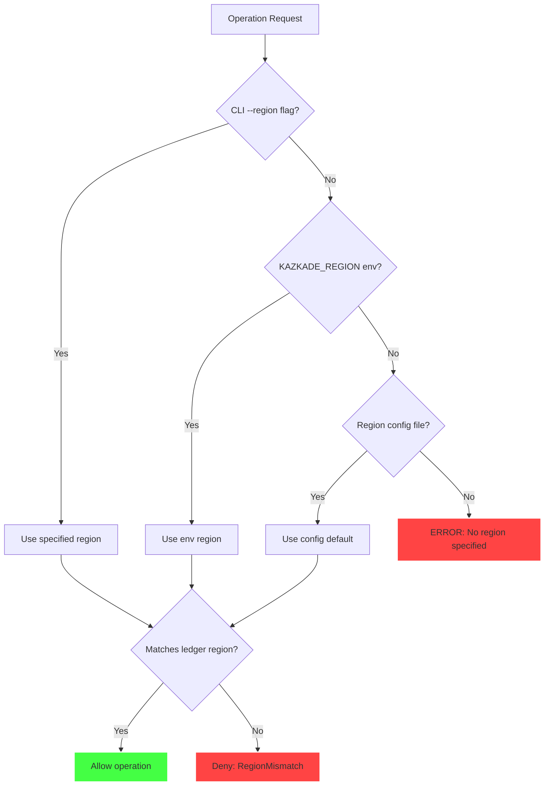

<!--
  __   ___                      __                        __                     
  ¦¦  ¦¦¯                       ¦¦                        ¦¦                     
  ___¦  ¦¦_¦¦      _¦¦¦¦¦_  ¦¦¦¦¦¦¦¦  ¦¦ _¦¦¯    _¦¦¦¦¦_   _¦¦¦_¦¦   _¦¦¦¦_   ¦___     
  __¦¯¯¯    ¦¦¦¦¦      ¯ ___¦¦      _¦¯   ¦¦_¦¦      ¯ ___¦¦  ¦¦¯  ¯¦¦  ¦¦____¦¦    ¯¯¯¦__ 
  ¯¯¦___    ¦¦  ¦¦_   _¦¦¯¯¯¦¦    _¦¯     ¦¦¯¦¦_    _¦¦¯¯¯¦¦  ¦¦    ¦¦  ¦¦¯¯¯¯¯¯    ___¦¯¯ 
      ¯¯¯¦  ¦¦   ¦¦_  ¦¦___¦¦¦  _¦¦_____  ¦¦  ¯¦_   ¦¦___¦¦¦  ¯¦¦__¦¦¦  ¯¦¦____¦  ¦¯¯¯     
           ¯¯    ¯¯   ¯¯¯¯ ¯¯  ¯¯¯¯¯¯¯¯  ¯¯   ¯¯¯   ¯¯¯¯ ¯¯    ¯¯¯ ¯¯    ¯¯¯¯¯
  Lois-Kleinner & 0-1.gg 2026 — Kazkade Zero-Copy Compute Runtime
-->

# Data Residency Controls

> **Your data obeys the laws you choose.**

Kazkade provides first-class data residency controls that bind data to specific geographic or legal jurisdictions. Unlike conventional systems that layer geo-restrictions on top of a globally-distributed storage layer, Kazkade's `.aioss` ledger and `.acol` column store are **region-aware at the data structure level**.

---

## 1. Region-Pinned Ledgers

Every `.aioss` ledger is initialized with an immutable region tag. This tag is:
- Embedded in the genesis (first) record of the hash chain
- Signed by the ledger's Ed25519 keypair
- Verified on every subsequent append operation
- Cryptographically bound to all records in the chain

### 1.1 Region Initialization

```bash
# Create a GDPR-compliant ledger pinned to the European Union.
kazkade ledger init \
    --region EU \
    --region-policy gdpr \
    compliance-eu.aioss

# Create a ledger for US Health Insurance Portability (HIPAA).
kazkade ledger init \
    --region US \
    --region-policy hipaa \
    health-us.aioss

# Create a ledger with a custom regulatory zone.
kazkade ledger init \
    --region custom:US-CALIFORNIA \
    --region-policy ccpa \
    ccpa-compliance.aioss
```

### 1.2 Genesis Record Structure

```rust
/// The first record in every .aioss ledger, establishing the region.
#[derive(Debug, Clone, Serialize, Deserialize)]
pub struct GenesisRecord {
    /// Kazkade format version.
    pub version: (u16, u16, u16),
    /// UTC nanosecond of genesis.
    pub created_at: i128,
    /// The immutable region tag for this ledger.
    pub region: RegionTag,
    /// Regulatory policy identifier (e.g., "gdpr", "hipaa", "ccpa").
    pub region_policy: Option<String>,
    /// Ed25519 public key that signed this genesis.
    pub public_key: [u8; 32],
    /// Ed25519 signature over all preceding fields.
    pub signature: [u8; 64],
    /// SHA3-256 of the genesis record (used as prev_hash for record 0).
    pub genesis_hash: [u8; 32],
}
```

Once written, the region is **irreversible**:

```rust
impl AiossLedger {
    pub fn assert_region_immutable(&self) -> Result<(), ResidencyError> {
        let genesis = self.genesis_record()?;
        
        // Verify the genesis region matches the stored region.
        if genesis.region != self.header.region {
            return Err(ResidencyError::RegionMismatch {
                header_region: self.header.region,
                genesis_region: genesis.region,
            });
        }
        
        // Verify the genesis signature.
        let signing_input = bincode::serialize(&(
            &genesis.version,
            &genesis.created_at,
            &genesis.region,
            &genesis.region_policy,
            &genesis.public_key,
        ))?;
        
        let public_key = ed25519_dalek::VerifyingKey::from_bytes(&genesis.public_key)?;
        public_key.verify_strict(&signing_input, &ed25519_dalek::Signature::from_bytes(&genesis.signature))?;
        
        Ok(())
    }
}
```

---

## 2. Geo-Aware Deployment

### 2.1 Region Configuration File

Kazkade supports a YAML-based region configuration file for complex multi-region deployments:

```yaml
# region-config.yaml
regions:
  eu-frankfurt:
    region: EU
    subregion: frankfurt
    policy: gdpr
    data_center: aws-eu-central-1
    allowed_ledger_types: [compliance, audit, operational]
    
  us-virginia:
    region: US
    subregion: virginia
    policy: hipaa
    data_center: aws-us-east-1
    allowed_ledger_types: [health, operational]
    
  apac-singapore:
    region: APAC
    subregion: singapore
    policy: default
    data_center: aws-ap-southeast-1
    allowed_ledger_types: [operational, cache]

default_region: eu-frankfurt
enforce_strict_residency: true
cross_region_replication_allowed: false
```

```bash
# Apply region configuration.
kazkade configure apply region-config.yaml

# Validate region configuration.
kazkade configure validate region-config.yaml
```

### 2.2 Deployment Mapping

```mermaid
graph TD
    subgraph "EU (Frankfurt)"
        L1[GDPR Ledger]
        N1[Node eu-1]
        S1[.acol Store]
    end
    subgraph "US (Virginia)"
        L2[HIPAA Ledger]
        N2[Node us-1]
        S2[.acol Store]
    end
    subgraph "APAC (Singapore)"
        L3[Operational Ledger]
        N3[Node apac-1]
        S3[.acol Store]
    end
    
    N1 -.->|Read-only audit| N2
    N1 -.->|Read-only audit| N3
    
    style L1 fill:#2d2d2d,stroke:#4a9eff,stroke-width:2px
    style L2 fill:#2d2d2d,stroke:#4a9eff,stroke-width:2px
    style L3 fill:#2d2d2d,stroke:#4a9eff,stroke-width:2px
```



---

## 3. CLI Region Enforcement

### 3.1 Region Flag on All Commands

The `--region` flag is a first-class citizen across the CLI:

```bash
# Query only records in EU region.
kazkade query "SELECT * FROM ledger" --region EU

# Append to ledger, asserting EU region.
kazkade ledger append compliance-eu.aioss \
    --payload @new-data.acol \
    --region EU

# Compare ledgers across regions.
kazkade ledger compare \
    --ledger-a eu-compliance.aioss \
    --ledger-b us-health.aioss \
    --cross-region-audit
```

### 3.2 Environment Variable Configuration

For headless or containerized deployments:

```bash
# Set via environment variable.
$env:KAZKADE_REGION = "EU"
$env:KAZKADE_REGION_POLICY = "gdpr"
$env:KAZKADE_KEYCHAIN = "tpm"

kazkade ledger init my-ledger.aioss
# Uses KAzkADE_REGION automatically.
```

### 3.3 Enforcement Priority



---

## 4. Cross-Region Audit

When cross-region access is required (e.g., a global compliance audit), Kazkade provides a controlled audit mechanism.

### 4.1 Audit-Only Replication

```bash
# Grant read-only audit access from US to EU ledger.
kazkade ledger grant-audit \
    --source eu-compliance.aioss \
    --auditor us-auditor.public \
    --expires 2027-01-01T00:00:00Z

# Perform cross-region audit.
kazkade ledger verify \
    --ledger eu-compliance.aioss \
    --auditor-key us-auditor.private \
    --cross-region
```

### 4.2 Auditable Access Log

Every cross-region access is recorded as a special audit record in the `.aioss` chain:

```rust
#[derive(Debug, Clone, Serialize, Deserialize)]
pub struct AccessAuditRecord {
    pub seqno: u64,
    pub timestamp: i128,
    pub access_type: AccessType,
    pub requesting_region: RegionTag,
    pub target_region: RegionTag,
    pub requesting_key: [u8; 32],
    pub reason: String,
    pub granted: bool,
    pub audit_hash_chain_link: [u8; 32],
}

#[derive(Debug, Clone, Serialize, Deserialize)]
pub enum AccessType {
    ReadOnlyQuery,
    Replication,
    LedgerVerify,
    Export,
}
```

### 4.3 Cross-Region Verification

The `kazkade ledger verify` command can validate a ledger without requiring local decryption keys — it verifies the hash chain and region integrity independently:

```bash
# Remote verification across regions.
kazkade ledger verify \
    --remote https://eu-node.internal:8443 \
    --ledger compliance.aioss \
    --verify-regions
```

---

## 5. Residency Policy Enforcement

### 5.1 Policy-as-Code

Residency policies are expressed as WASM-compiled rules that run within Kazkade's policy engine:

```rust
/// A residency policy implemented as a WASM module.
pub trait ResidencyPolicy {
    /// Validate that an operation respects residency rules.
    fn check(
        &self,
        operation: &Operation,
        ledger_region: RegionTag,
        caller_region: RegionTag,
        caller_roles: &[Role],
    ) -> Result<PolicyDecision, PolicyError>;
}

/// Policy decision outcomes.
pub enum PolicyDecision {
    Allow,
    Deny(String),
    RequireApproval { approver_role: Role },
    LogOnly,
}
```

### 5.2 Built-In Policies

| Policy      | Region Binding | Cross-Region Read | Export Control | Retention |
|-------------|----------------|-------------------|----------------|-----------|
| `gdpr`      | EU only        | Conditional       | Full           | Right to erasure |
| `hipaa`     | US only        | BAA required      | PHI masked     | 6 years   |
| `ccpa`      | Custom         | Opt-in required   | Full           | Right to delete |
| `sox`       | US only        | Audit only        | Full audit     | 7 years   |
| `default`   | Any            | Allowed           | Full           | Configurable |

---

## 6. Data Residency for Columnar Data

While `.acol` files do not carry a region tag in their internal structure, they are bound to a region through their parent `.aioss` ledger:

```mermaid
flowchart LR
    subgraph "Filesystem"
        L[.aioss Ledger<br/>region: EU]
        A1[.acol page 1]
        A2[.acol page 2]
        A3[.acol page N]
    end
    
    L -->|references| A1
    L -->|references| A2
    L -->|references| A3
    A1 -->|file system ACL| FS[Region-pinned<br/>filesystem]
    
    style L fill:#2d2d2d,stroke:#4a9eff,stroke-width:2px
    style FS fill:#1a1a1a,stroke:#666,stroke-width:1px
```



### 6.1 Column Store Region Binding

```bash
# Create a region-bound column store.
kazkade column init \
    --ledger compliance-eu.aioss \
    --region EU \
    data.acol

# Import data with residency enforcement.
kazkade column import \
    --ledger compliance-eu.aioss \
    --region EU \
    data.acol \
    --from source.parquet
```

---

## 7. Legal Jurisdiction Mapping

kazkade includes a built-in jurisdiction database that maps regions to legal frameworks:

```rust
/// Legal framework metadata for a region.
#[derive(Debug, Clone, Serialize, Deserialize)]
pub struct JurisdictionInfo {
    pub region: RegionTag,
    pub framework_name: String,
    pub framework_version: String,
    pub effective_date: chrono::NaiveDate,
    pub authority: String,
    pub requirements: Vec<RegulatoryRequirement>,
}

#[derive(Debug, Clone, Serialize, Deserialize)]
pub enum RegulatoryRequirement {
    DataLocalization,
    RightToErasure,
    DataPortability,
    BreachNotification { max_hours: u32 },
    AuditLogging { retention_days: u32 },
    ConsentManagement,
    CrossBorderTransferMechanism,
}
```

```bash
# Query jurisdiction for a region.
kazkade residency jurisdiction --region EU

Region: EU
Framework: General Data Protection Regulation (GDPR)
Version: 2016/679
Effective: 2018-05-25
Authority: European Data Protection Board
Requirements:
  - DataLocalization
  - RightToErasure
  - DataPortability
  - BreachNotification (max 72 hours)
  - AuditLogging (retention 365 days)
  - ConsentManagement
```

---

## 8. Monitoring and Alerting

### 8.1 Residency Violation Detection

```bash
# Watch for residency violations in real-time.
kazkade residency watch --alert-on-violation

# Generate residency compliance report.
kazkade residency report \
    --ledger-dir ./ledgers/ \
    --output residency-report.json
```

### 8.2 Violation Alert Example

```json
{
  "alert": "RESIDENCY_VIOLATION",
  "severity": "CRITICAL",
  "timestamp": "2026-06-19T07:00:00Z",
  "ledger": "compliance-eu.aioss",
  "expected_region": "EU",
  "observed_region": "US",
  "operation": "LEDGER_APPEND",
  "caller_key": "0xabcd...ef01",
  "action_taken": "BLOCKED",
  "audit_record": 1048577
}
```

---

## 9. Disaster Recovery with Residency

Cross-region disaster recovery is supported while maintaining residency constraints:

```bash
# Configure DR with region preservation.
kazkade ledger dr-configure \
    --primary eu-compliance.aioss \
    --dr-site us-dr-site \
    --dr-policy encrypted-only \
    --region-preserve strict

# Perform DR failover (encrypted replica only, no plaintext cross-border).
kazkade ledger dr-failover \
    --dr-site us-dr-site \
    --decrypt-only-in-primary-region
```

### 9.1 DR Policy Matrix

| Policy              | Cross-Region Copy | Encryption | Activation Condition     |
|---------------------|-------------------|------------|--------------------------|
| `encrypted-only`    | Encrypted blobs   | AES-256    | Declared disaster        |
| `metadata-only`     | Headers + hashes  | N/A        | Any time                 |
| `full-replica`      | Full data         | Per-treaty | Bilateral agreement      |
| `none`              | Never             | N/A        | N/A                      |

---

## 10. Compliance Report Generation

```bash
# Generate a GDPR-specific compliance report.
kazkade residency compliance-report \
    --framework gdpr \
    --ledger-dir ./ledgers/ \
    --output gdpr-compliance-2026.pdf

# Generate a HIPAA-specific compliance report.
kazkade residency compliance-report \
    --framework hipaa \
    --ledger-dir ./ledgers/health/ \
    --output hipaa-compliance-2026.pdf
```

### 10.1 Report Contents

| Section                     | Description                                    |
|-----------------------------|------------------------------------------------|
| Ledger Inventory            | All ledgers, their regions, and policies       |
| Residency Enforcement       | Verification that region pins are active       |
| Cross-Region Access Log     | All cross-region operations                    |
| Data Flow Map               | Where data resides and flows                   |
| Key Management Status       | Encryption key locations and rotation status   |
| Audit Trail Integrity       | Hash chain verification results                |
| Policy Compliance           | Per-requirement pass/fail                      |

---

*Lois-Kleinner & 0-1.gg 2026 — Kazkade Zero-Copy Compute Runtime*

```
.====================================================================.
!  Made in the UAE, Dubai #DubaiIt #Dubai #Dxb #SovereignAI          !
!  Made in The Emirates #Dubai_it                                    !
!                                                                    !
!  Lois-Kleinner Alpasan - The Anticloud 2026-                       !
!                                                                    !
!  0-1.gg ! GitHub ! LinkedIn ! DEV ! GH Pages                       !
!  HuggingFace ! Blog ! Tumblr ! Fandom ! Bluesky ! Mastodon          !
!  Zenodo ! Harvard Dataverse ! Internet Archive ! ORCID ! Figshare   !
!                                                                    !
!  Sovereign AI ! Local-First ! Privacy ! Zero Trust ! No Datacenter !
!  Air-Gapped ! Open Source ! Rust ! Hash Chain ! Single Binary      !
!  Offline LLM ! Crypto Ledger ! P2P ! Federated                     !
'===================================================================='
```

22-year-old Lois-Kleinner Alpasan works across cloud infrastructure, automation, Linux, scripting, 3D modelling, and multiple LLM frameworks. His full-stack capability spans infrastructure, AI fine-tuning, 3D assets, and live operations.

References:
1. Lois-Kleinner Zenodo: https://doi.org/10.5281/zenodo.20781790
2. Lois-Kleinner GitHub: https://github.com/kleinnner/Anticloud/tree/main/04-aioss-format
3. Lois-Kleinner Harvard DV: https://doi.org/10.7910/DVN/FDEBAB
4. Lois-Kleinner Internet Arc: https://archive.org/details/aioss-format
5. Lois-Kleinner ORCID: https://orcid.org/0009-0009-2233-6107
6. Lois-Kleinner DEV.to: https://dev.to/kleinner
7. Lois-Kleinner LinkedIn: https://linkedin.com/in/kleinner
8. Lois-Kleinner HuggingFace: https://huggingface.co/Anticloud
9. Lois-Kleinner Tumblr: https://anticloud.tumblr.com
10. Lois-Kleinner Mastodon: https://mastodon.social/@kleinner
11. Lois-Kleinner Bluesky: https://bsky.app/profile/kleinner.bsky.social
12. 0-1.gg: https://0-1.gg
13. Lois-Kleinner Figshare: https://figshare.com/authors/Lois-Kleinner_Alpasan/20849885
