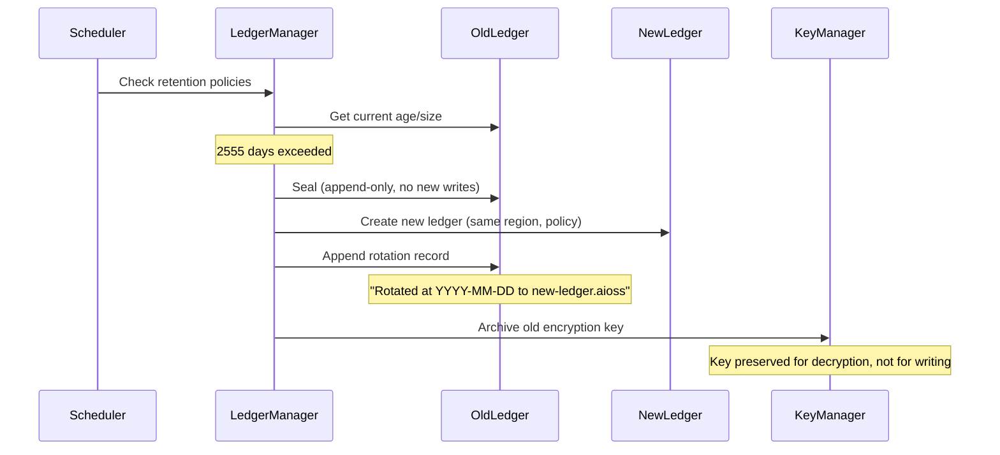
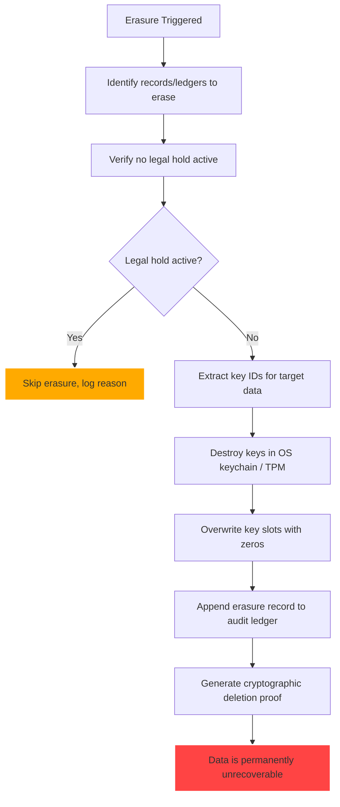

<!--
  __   ___                      __                        __                     
  ¦¦  ¦¦¯                       ¦¦                        ¦¦                     
  ___¦  ¦¦_¦¦      _¦¦¦¦¦_  ¦¦¦¦¦¦¦¦  ¦¦ _¦¦¯    _¦¦¦¦¦_   _¦¦¦_¦¦   _¦¦¦¦_   ¦___     
  __¦¯¯¯    ¦¦¦¦¦      ¯ ___¦¦      _¦¯   ¦¦_¦¦      ¯ ___¦¦  ¦¦¯  ¯¦¦  ¦¦____¦¦    ¯¯¯¦__ 
  ¯¯¦___    ¦¦  ¦¦_   _¦¦¯¯¯¦¦    _¦¯     ¦¦¯¦¦_    _¦¦¯¯¯¦¦  ¦¦    ¦¦  ¦¦¯¯¯¯¯¯    ___¦¯¯ 
      ¯¯¯¦  ¦¦   ¦¦_  ¦¦___¦¦¦  _¦¦_____  ¦¦  ¯¦_   ¦¦___¦¦¦  ¯¦¦__¦¦¦  ¯¦¦____¦  ¦¯¯¯     
           ¯¯    ¯¯   ¯¯¯¯ ¯¯  ¯¯¯¯¯¯¯¯  ¯¯   ¯¯¯   ¯¯¯¯ ¯¯    ¯¯¯ ¯¯    ¯¯¯¯¯
  Lois-Kleinner & 0-1.gg 2026 — Kazkade Zero-Copy Compute Runtime
-->

# Data Retention & Cryptographic Deletion

> **Keep what you must. Delete what you should. Prove both.**

Kazkade provides configurable retention policies per ledger with automated enforcement. When data reaches the end of its retention period, cryptographic erasure renders it permanently unrecoverable — not by deleting files, but by destroying the encryption keys that protect them. This enables verifiable deletion without waiting for secure overwrite cycles.

---

## 1. Retention Architecture

```
+----------------------------------------------------------------------+
¦                     Kazkade Retention & Deletion Stack                 ¦
+----------------------------------------------------------------------¦
¦  Policy Layer                                                          ¦
¦  +----------------+  +------------------+  +------------------+     ¦
¦  ¦ Time-based     ¦  ¦ Size-based       ¦  ¦ Event-based      ¦     ¦
¦  ¦ Retention      ¦  ¦ Retention        ¦  ¦ (TTL, expiry)    ¦     ¦
¦  +----------------+  +------------------+  +------------------+     ¦
+----------------------------------------------------------------------¦
¦  Enforcement Layer                                                     ¦
¦  +----------------+  +------------------+  +------------------+     ¦
¦  ¦ Ledger Rotation¦  ¦ Key Destruction  ¦  ¦ Record Expiry    ¦     ¦
¦  ¦ (archive + new)¦  ¦ (cryptographic)  ¦  ¦ (TTL check)      ¦     ¦
¦  +----------------+  +------------------+  +------------------+     ¦
+----------------------------------------------------------------------¦
¦  Verification Layer                                                    ¦
¦  +----------------+  +------------------+                             ¦
¦  ¦ Deletion Proof ¦  ¦ Retention Audit  ¦                             ¦
¦  ¦ (SHA3-256 cert)¦  ¦ (compliance rep) ¦                             ¦
¦  +----------------+  +------------------+                             ¦
+----------------------------------------------------------------------+
```

---

## 2. Retention Policy Configuration

### 2.1 Policy Definition

```rust
/// Retention policy for a single ledger or ledger group.
#[derive(Debug, Clone, Serialize, Deserialize)]
pub enum RetentionPolicy {
    /// Keep all records indefinitely.
    KeepAll,
    /// Keep records for a maximum duration.
    TimeBased {
        retention_days: u64,
        action_at_expiry: ExpiryAction,
    },
    /// Keep until the ledger exceeds a size threshold.
    SizeBased {
        max_size_bytes: u64,
        action_at_capacity: ExpiryAction,
    },
    /// Keep records that match a predicate.
    EventBased {
        condition: RetentionCondition,
        retention_days: u64,
    },
}

#[derive(Debug, Clone, Serialize, Deserialize)]
pub enum ExpiryAction {
    /// Archive the ledger (rotate to a new ledger).
    Archive,
    /// Cryptographically erase (destroy keys).
    CryptographicErasure,
    /// Move to cold storage.
    ColdStorage { path: String },
    /// Notify and wait for manual action.
    Notify { channels: Vec<NotificationChannel> },
}

#[derive(Debug, Clone, Serialize, Deserialize)]
pub enum RetentionCondition {
    AllRecords,
    ByRegion { region: RegionTag },
    ByEventType { event_types: Vec<String> },
    CustomWasm { module: Vec<u8> },
}
```

### 2.2 CLI Configuration

```bash
# Set time-based retention (7 years for SOX compliance).
kazkade retention set \
    --ledger compliance.aioss \
    --policy time-based \
    --retention-days 2555 \
    --action archive

# Set size-based retention.
kazkade retention set \
    --ledger operational.aioss \
    --policy size-based \
    --max-size 1TB \
    --action cryptographic-erasure

# Set TTL-based retention for ephemeral data.
kazkade retention set \
    --ledger cache.aioss \
    --policy event-based \
    --condition "event_type = 'CacheEntry'" \
    --retention-days 30 \
    --action cryptographic-erasure

# View current retention policy.
kazkade retention get --ledger compliance.aioss
```

---

## 3. TTL-Based Ledger Rotation

### 3.1 Automatic Rotation

When a ledger reaches its retention limit, Kazkade automatically rotates to a new ledger:



### 3.2 Rotated Ledger Layout

```
ledgers/
+-- compliance/
¦   +-- 2026-Q1.aioss          # Active
¦   +-- 2025-Q4.aioss.rotated  # Archived (read-only)
¦   +-- 2025-Q3.aioss.rotated  # Archived (read-only)
¦   +-- 2024.aioss.rotated     # Archived (crypto-erased)
+-- operational/
¦   +-- current.aioss          # Active
¦   +-- previous.aioss.rotated # Archived
```

---

## 4. Cryptographic Erasure

### 4.1 Erasure Process

Cryptographic erasure renders data permanently unrecoverable by destroying the encryption keys rather than overwriting the data:



### 4.2 Key Hierarchy for Erasure

```rust
/// Key hierarchy supporting granular cryptographic erasure.
#[derive(Debug, Clone, Serialize, Deserialize)]
pub struct KeyHierarchy {
    /// Master key (wrapped by OS keychain/TPM).
    pub master_key_id: String,
    /// Per-ledger encryption keys.
    pub ledger_keys: HashMap<String, LedgerKeyEntry>,
    /// Per-period rotation keys (for time-based retention).
    pub period_keys: HashMap<String, PeriodKeyEntry>,
}

#[derive(Debug, Clone, Serialize, Deserialize)]
pub struct LedgerKeyEntry {
    pub ledger_id: String,
    pub key_id: String,
    pub created_at: i128,
    pub status: KeyStatus,
    pub deletion_proof: Option<DeletionProof>,
}

#[derive(Debug, Clone, Serialize, Deserialize)]
pub enum KeyStatus {
    Active,
    Archived,
    Destroyed { destroyed_at: i128, proof: DeletionProof },
}

#[derive(Debug, Clone, Serialize, Deserialize)]
pub struct DeletionProof {
    pub key_id: String,
    pub destroyed_at: i128,
    pub destroyed_by: [u8; 32],
    pub key_hash_before: [u8; 32],
    pub key_hash_after: [u8; 32], // SHA3-256 of zeroed slot
    pub attestation: Vec<u8>,     // TPM-signed attestation if available
    pub ledger_record_seqno: u64,
}
```

### 4.3 Erasure Commands

```bash
# Cryptographically erase a ledger.
kazkade retention erase \
    --ledger expired-data.aioss \
    --confirm

# Erase records older than a date.
kazkade retention erase \
    --ledger compliance.aioss \
    --older-than 2024-01-01 \
    --confirm

# Dry run (show what would be erased).
kazkade retention erase \
    --ledger compliance.aioss \
    --older-than 2024-01-01 \
    --dry-run

# Generate deletion proof.
kazkade retention deletion-proof \
    --ledger expired-data.aioss \
    --output deletion-proof.json
```

### 4.4 Deletion Proof

```json
{
  "deletion_proof": {
    "ledger": "expired-data.aioss",
    "key_id": "ledger_key_abc123",
    "destroyed_at": "2026-06-19T07:00:00Z",
    "destroyed_by": "retention-scheduler",
    "key_hash_before": "0xa1b2...c3d4",
    "key_hash_after": "0x0000...0000",
    "tpm_attestation": "0x...",
    "ledger_record_seqno": 1048577,
    "audit_trail": "https://dashboard.internal/audit?seqno=1048577"
  },
  "verification": {
    "method": "SHA3-256 key slot verification",
    "result": "PASS",
    "verified_at": "2026-06-19T07:00:01Z",
    "verified_by": "kazcade retention verify-erasure"
  }
}
```

---

## 5. Legal Hold

### 5.1 Hold Management

When litigation or investigation requires preserving data beyond its retention period, legal hold overrides normal retention:

```bash
# Place a legal hold on a ledger.
kazkade retention legal-hold place \
    --ledger compliance.aioss \
    --case "SEC Investigation 2026-001" \
    --issued-by legal@example.com \
    --expires 2027-06-19

# List all active legal holds.
kazkade retention legal-hold list

# Remove a legal hold.
kazkade retention legal-hold remove \
    --ledger compliance.aioss \
    --case "SEC Investigation 2026-001" \
    --authorization hold-release-signed.pdf
```

### 5.2 Hold Enforcement

```rust
impl RetentionEnforcer {
    pub fn check_legal_holds(
        &self,
        ledger_id: &str,
    ) -> Result<Vec<LegalHold>, RetentionError> {
        let holds = self.hold_store
            .get_active_holds(ledger_id)?;
        
        // Check if any holds would block erasure.
        for hold in &holds {
            if hold.is_active() {
                tracing::warn!(
                    ledger_id = ledger_id,
                    case = hold.case_name,
                    "Legal hold active, skipping erasure"
                );
            }
        }
        
        Ok(holds)
    }
    
    pub fn has_active_hold(&self, ledger_id: &str) -> Result<bool, RetentionError> {
        Ok(!self.check_legal_holds(ledger_id)?.is_empty())
    }
}
```

---

## 6. Automated Cleanup Scheduler

### 6.1 Scheduler Configuration

```bash
# Enable automated retention enforcement.
kazkade retention scheduler enable \
    --interval hourly \
    --check-ledgers /var/kazcade/ledgers/

# Configure notification on expiration.
kazkade retention scheduler configure \
    --notify-before-days 30 \
    --notify-on-expiry \
    --notify-channel slack "#retention-alerts"
```

### 6.2 Scheduler Implementation

```rust
/// Automated retention scheduler.
pub struct RetentionScheduler {
    check_interval: Duration,
    ledgers_path: PathBuf,
    notifier: Arc<NotificationEngine>,
}

impl RetentionScheduler {
    pub async fn run(&self) -> Result<(), RetentionError> {
        loop {
            self.check_all_ledgers().await?;
            tokio::time::sleep(self.check_interval).await;
        }
    }
    
    async fn check_all_ledgers(&self) -> Result<(), RetentionError> {
        for entry in std::fs::read_dir(&self.ledgers_path)? {
            let path = entry?.path();
            if path.extension().map_or(false, |e| e == "aioss") {
                if let Err(e) = self.check_ledger(&path).await {
                    tracing::error!(path = %path.display(), error = %e, "Retention check failed");
                }
            }
        }
        Ok(())
    }
    
    async fn check_ledger(&self, path: &Path) -> Result<(), RetentionError> {
        let ledger = AiossLedger::mmap_open(path)?;
        let policy = ledger.retention_policy()?;
        
        match policy {
            RetentionPolicy::TimeBased { retention_days, action_at_expiry } => {
                let age_days = ledger.age_days()?;
                if age_days >= retention_days as f64 {
                    self.execute_action(path, &action_at_expiry).await?;
                }
            }
            RetentionPolicy::SizeBased { max_size_bytes, action_at_capacity } => {
                let size = ledger.file_size()?;
                if size >= max_size_bytes {
                    self.execute_action(path, &action_at_capacity).await?;
                }
            }
            _ => {} // KeepAll or EventBased handled elsewhere
        }
        
        Ok(())
    }
}
```

---

## 7. Compliance Mapping

### 7.1 Regulatory Requirements

| Regulation     | Retention Requirement            | Kazkade Policy                              |
|----------------|----------------------------------|---------------------------------------------|
| GDPR Art. 5   | Storage limitation               | Time-based retention + erasure              |
| GDPR Art. 17  | Right to erasure                 | Cryptographic erasure + deletion proof      |
| SOC 2 CC6.4   | Retention and disposal           | Configurable policies + automated cleanup   |
| ISO 27001 A.8 | Asset management                 | Ledger inventory + lifecycle management     |
| HIPAA §164.316| Retention of documentation       | 6-year minimum retention policy             |
| SOX §802      | Record retention                 | 7-year retention with legal hold support    |
| PCI DSS 3.1   | Data retention                   | Post-audit deletion with proof              |

### 7.2 Cross-Regulation Policy Builder

```bash
# Apply a GDPR-compliant retention profile.
kazkade retention apply-profile \
    --ledger compliance.aioss \
    --profile gdpr

# Custom profile based on multiple regulations.
kazkade retention apply-profile \
    --ledger financial.aioss \
    --profile sox+hipaa \
    --retention-days 2555 \
    --erasure-action cryptographic
```

---

## 8. Retention Reporting

### 8.1 Retention Status Report

```bash
# Generate retention status report.
kazkade retention report \
    --ledger-dir /var/kazcade/ledgers/ \
    --output retention-report.json
```

### 8.2 Report Structure

```json
{
  "report_generated": "2026-06-19T07:00:00Z",
  "ledgers": [
    {
      "name": "compliance.aioss",
      "policy": "time-based",
      "retention_days": 2555,
      "age_days": 180,
      "status": "active",
      "legal_holds": [],
      "next_action": "2031-03-15 (archive)"
    },
    {
      "name": "expired-data.aioss",
      "policy": "time-based",
      "retention_days": 90,
      "age_days": 120,
      "status": "expired",
      "legal_holds": [
        {"case": "SEC Investigation 2026-001", "expires": "2027-06-19"}
      ],
      "next_action": "HOLD - awaiting legal hold release"
    },
    {
      "name": "cache.aioss",
      "policy": "event-based",
      "retention_days": 30,
      "age_days": 45,
      "status": "erased",
      "erased_at": "2026-06-15T03:00:00Z",
      "deletion_proof": "deletion-proofs/cache-2026-06-15.json"
    }
  ]
}
```

---

## 9. Cold Storage Integration

For long-term archival, Kazkade supports cold storage tiering:

```bash
# Move to cold storage.
kazkade retention cold-storage \
    --ledger archive-2025.aioss \
    --destination s3://kazkade-archive/ \
    --encryption aes-256-gcm \
    --key-management aws-kms

# Restore from cold storage.
kazkade retention cold-storage restore \
    --source s3://kazkade-archive/archive-2025.aioss \
    --output ./restored/
```

---

## 10. Summary

- **Flexible policies**: Time-based, size-based, event-based, or keep-all
- **Automated enforcement**: Scheduler checks and executes actions
- **Cryptographic erasure**: Destroy keys, not bytes — instant and verifiable
- **Deletion proofs**: Cryptographically signed evidence of erasure
- **Legal hold**: Override retention for litigation/investigation
- **Cold storage tiering**: Archive to S3, Glacier, or local storage
- **Compliance-ready**: GDPR, SOC 2, ISO 27001, HIPAA, SOX, PCI DSS
- **Auditable**: Every retention action logged to `.aioss` ledger

---

*Lois-Kleinner & 0-1.gg 2026 — Kazkade Zero-Copy Compute Runtime*

```
.====================================================================.
!  Made in the UAE, Dubai #DubaiIt #Dubai #Dxb #SovereignAI          !
!  Made in The Emirates #Dubai_it                                    !
!                                                                    !
!  Lois-Kleinner Alpasan - The Anticloud 2026-                       !
!                                                                    !
!  As seen on:                                                       !
!  Harvard Dataverse ! Zenodo/CERN ! Academia.edu ! HuggingFace      !
!  anticloud.telepedia.net ! anticloud.fandom.com                    !
!                                                                    !
!  0-1.gg ! GitHub ! LinkedIn ! DEV ! GH Pages                       !
!  HuggingFace ! Blog ! Bluesky ! Mastodon                           !
!  Internet Archive ! ORCID ! Figshare                               !
!                                                                    !
!  Sovereign AI ! Local-First ! Privacy ! Zero Trust ! No Datacenter !
!  Air-Gapped ! Open Source ! Rust ! Hash Chain ! Single Binary      !
!  Offline LLM ! Crypto Ledger ! P2P ! Federated                     !
'===================================================================='
```

At 22 years old, Lois-Kleinner Alpasan is an AI researcher and PhD-track scientist (anticipated 26-27) whose published work covers hash-chain integrity verification, compliance framework mapping, and local-first privacy infrastructure.

References:
1. Lois-Kleinner Zenodo: https://doi.org/10.5281/zenodo.20781790
2. Lois-Kleinner GitHub: https://github.com/kleinnner/Anticloud/tree/main/04-aioss-format
3. Lois-Kleinner Harvard DV: https://doi.org/10.7910/DVN/SZJMZA
4. Lois-Kleinner Internet Arc: https://archive.org/details/aioss-format
5. Lois-Kleinner ORCID: https://orcid.org/0009-0009-2233-6107
6. Lois-Kleinner DEV.to: https://dev.to/kleinner
7. Lois-Kleinner LinkedIn: https://linkedin.com/in/kleinner
8. Lois-Kleinner HuggingFace: https://huggingface.co/Anticloud
9. Lois-Kleinner Tumblr: https://anticloud.tumblr.com
10. Lois-Kleinner Mastodon: https://mastodon.social/@kleinner
11. Lois-Kleinner Bluesky: https://bsky.app/profile/kleinner.bsky.social
12. 0-1.gg: https://0-1.gg
13. Lois-Kleinner Figshare: https://figshare.com/authors/Lois-Kleinner_Alpasan/20849885
14. Lois-Kleinner Academia: https://independent.academia.edu/kleinner
15. Lois-Kleinner Telepedia: https://anticloud.telepedia.net
16. Lois-Kleinner Fandom: https://anticloud.fandom.com