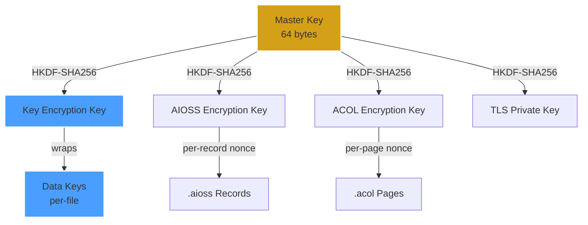
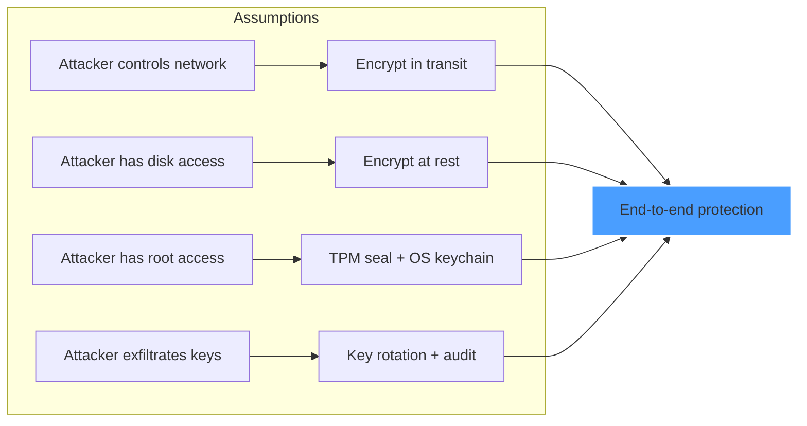

<!--
  __   ___                      __                        __                     
  ¦¦  ¦¦¯                       ¦¦                        ¦¦                     
  ___¦  ¦¦_¦¦      _¦¦¦¦¦_  ¦¦¦¦¦¦¦¦  ¦¦ _¦¦¯    _¦¦¦¦¦_   _¦¦¦_¦¦   _¦¦¦¦_   ¦___     
  __¦¯¯¯    ¦¦¦¦¦      ¯ ___¦¦      _¦¯   ¦¦_¦¦      ¯ ___¦¦  ¦¦¯  ¯¦¦  ¦¦____¦¦    ¯¯¯¦__ 
  ¯¯¦___    ¦¦  ¦¦_   _¦¦¯¯¯¦¦    _¦¯     ¦¦¯¦¦_    _¦¦¯¯¯¦¦  ¦¦    ¦¦  ¦¦¯¯¯¯¯¯    ___¦¯¯ 
      ¯¯¯¦  ¦¦   ¦¦_  ¦¦___¦¦¦  _¦¦_____  ¦¦  ¯¦_   ¦¦___¦¦¦  ¯¦¦__¦¦¦  ¯¦¦____¦  ¦¯¯¯     
           ¯¯    ¯¯   ¯¯¯¯ ¯¯  ¯¯¯¯¯¯¯¯  ¯¯   ¯¯¯   ¯¯¯¯ ¯¯    ¯¯¯ ¯¯    ¯¯¯¯¯
  Lois-Kleinner & 0-1.gg 2026 — Kazkade Zero-Copy Compute Runtime
-->

# Encryption at Rest & In Transit

> **Every byte encrypted, every key accounted for.**

Kazkade applies defense-in-depth encryption across all data paths. At rest, ledger records and columnar data files are encrypted with authenticated ciphers. In transit, all API and replication traffic uses TLS 1.3. Key material is managed through the operating system's secure keychain or TPM 2.0.

---

## 1. Encryption Architecture

```
+------------------------------------------------------------------+
¦                    Kazkade Encryption Stack                        ¦
+------------------------------------------------------------------¦
¦  Data Plane                                                       ¦
¦  +----------------------+  +------------------+  +-------------+  ¦
¦  ¦ .aioss Ledger        ¦  ¦ .acol Columnar    ¦  ¦ Dashboard    ¦  ¦
¦  ¦ AES-256-GCM per      ¦  ¦ ChaCha20-Poly1305 ¦  ¦ TLS 1.3     ¦  ¦
¦  ¦ record encrypt       ¦  ¦ page-level encrypt¦  ¦ HTTP/2      ¦  ¦
¦  +----------------------+  +------------------+  +-------------+  ¦
+------------------------------------------------------------------¦
¦  Key Management Layer                                             ¦
¦  +----------------------+  +------------------+  +-------------+  ¦
¦  ¦ OS Keychain          ¦  ¦ TPM 2.0          ¦  ¦ Derived Keys¦  ¦
¦  ¦ (macOS Keychain,     ¦  ¦ (TPM_Seal,        ¦  ¦ HKDF-SHA256 ¦  ¦
¦  ¦  Windows Credential  ¦  ¦  TPM_Unseal)      ¦  ¦ per-file     ¦  ¦
¦  ¦  Manager, libsecret) ¦  ¦                   ¦  ¦ per-record   ¦  ¦
¦  +----------------------+  +------------------+  +-------------+  ¦
+------------------------------------------------------------------¦
¦  Authentication Layer                                             ¦
¦  +----------------------+  +------------------+                   ¦
¦  ¦ Ed25519 Signatures   ¦  ¦ TLS Client Certs ¦                   ¦
¦  ¦ for ledger ops       ¦  ¦ for replication  ¦                   ¦
¦  +----------------------+  +------------------+                   ¦
+------------------------------------------------------------------+
```

---

## 2. Encryption at Rest

### 2.1 `.aioss` Ledger — AES-256-GCM

Each ledger record is individually encrypted with AES-256-GCM (Galois/Counter Mode), providing both confidentiality and authentication. Every record uses a unique 96-bit nonce derived from the record sequence number and a file-level salt.

```rust
use aes_gcm::{
    Aes256Gcm,
    KeyInit,
    Nonce,
    aead::{Aead, OsRng},
};
use sha3::Sha3_256;
use hkdf::Hkdf;

/// Encryption context for a single .aioss file.
pub struct AiossEncryptor {
    file_key: [u8; 32],    // Derived from master key + file salt
    file_salt: [u8; 32],   // Random per-file salt, stored in header
    cipher: Aes256Gcm,
}

impl AiossEncryptor {
    pub fn new(master_key: &[u8; 32], file_salt: &[u8; 32]) -> Self {
        let hkdf = Hkdf::<Sha3_256>::new(Some(file_salt), master_key);
        let mut file_key = [0u8; 32];
        hkdf.expand(b"kazcade.aioss.encryption", &mut file_key)
            .expect("HKDF expansion should not fail");
        
        let cipher = Aes256Gcm::new_from_slice(&file_key)
            .expect("AES-256-GCM key should be 32 bytes");
        
        Self { file_key, file_salt, cipher }
    }
    
    pub fn encrypt_record(
        &self,
        seqno: u64,
        plaintext: &[u8],
    ) -> Result<Vec<u8>, EncryptionError> {
        // Unique nonce: first 8 bytes = seqno (big-endian), last 4 bytes = 0
        let mut nonce_bytes = [0u8; 12];
        nonce_bytes[..8].copy_from_slice(&seqno.to_be_bytes());
        let nonce = Nonce::from_slice(&nonce_bytes);
        
        let ciphertext = self.cipher
            .encrypt(nonce, plaintext)
            .map_err(|e| EncryptionError::AesGcmFailure(e.to_string()))?;
        
        Ok(ciphertext)
    }
    
    pub fn decrypt_record(
        &self,
        seqno: u64,
        ciphertext: &[u8],
    ) -> Result<Vec<u8>, EncryptionError> {
        let mut nonce_bytes = [0u8; 12];
        nonce_bytes[..8].copy_from_slice(&seqno.to_be_bytes());
        let nonce = Nonce::from_slice(&nonce_bytes);
        
        let plaintext = self.cipher
            .decrypt(nonce, ciphertext)
            .map_err(|e| EncryptionError::AesGcmDecryption(e.to_string()))?;
        
        Ok(plaintext)
    }
}
```

#### Record Encryption Layout

```
+-----------------------------------------------------------------+
¦ .aioss Encrypted Record (variable size)                          ¦
+-----------------------------------------------------------------¦
¦ Seqno        ¦ u64 LE      ¦ 8 bytes                            ¦
¦ Nonce        ¦ 12 bytes    ¦ seqno || zeros                     ¦
¦ Ciphertext   ¦ variable    ¦ AES-256-GCM encrypted payload      ¦
¦ Tag          ¦ 16 bytes    ¦ GCM authentication tag             ¦
¦ Region       ¦ 4 bytes     ¦ RegionTag (plaintext, authenticated)¦
¦ Prev Hash    ¦ 32 bytes    ¦ SHA3-256 (plaintext, authenticated)¦
¦ Signature    ¦ 64 bytes    ¦ Ed25519 (over plaintext header)    ¦
+-----------------------------------------------------------------+
```

The `region`, `prev_hash`, and `signature` fields are authenticated but not encrypted — they are needed for chain verification without decryption.

### 2.2 `.acol` Columnar Files — ChaCha20-Poly1305

Columnar `.acol` files use ChaCha20-Poly1305 for page-level encryption. ChaCha20 is chosen for its performance on SIMD-capable hardware (AVX2, AVX-512, NEON), which aligns with Kazkade's zero-copy SIMD pipeline.

```rust
use chacha20poly1305::{
    ChaCha20Poly1305,
    KeyInit,
    Nonce,
    aead::{Aead, AeadCore},
};
use rand::RngCore;

/// Page encryption for .acol columnar storage.
pub struct AcolPageEncryptor {
    page_key: [u8; 32],
}

impl AcolPageEncryptor {
    pub fn new(master_key: &[u8; 32], page_salt: &[u8; 32]) -> Self {
        let hkdf = Hkdf::<Sha3_256>::new(Some(page_salt), master_key);
        let mut page_key = [0u8; 32];
        hkdf.expand(b"kazcade.acol.encryption", &mut page_key)
            .expect("HKDF expansion should not fail");
        Self { page_key }
    }
    
    pub fn encrypt_page(
        &self,
        page_id: u64,
        plaintext: &[u8],
    ) -> Result<Vec<u8>, EncryptionError> {
        let cipher = ChaCha20Poly1305::new_from_slice(&self.page_key)
            .map_err(|e| EncryptionError::InvalidKeyLength(e.to_string()))?;
        
        // 96-bit nonce derived from page_id
        let mut nonce = [0u8; 12];
        nonce[..8].copy_from_slice(&page_id.to_be_bytes());
        let nonce = Nonce::from_slice(&nonce);
        
        let ciphertext = cipher
            .encrypt(nonce, plaintext)
            .map_err(|e| EncryptionError::ChaChaPolyFailure(e.to_string()))?;
        
        Ok(ciphertext)
    }
    
    /// SIMD-optimized bulk page encryption.
    pub fn encrypt_pages_simd(
        &self,
        pages: &[(&[u8], u64)],
    ) -> Result<Vec<Vec<u8>>, EncryptionError> {
        // On AVX-512 systems, encrypt 8 pages simultaneously.
        pages.iter()
            .map(|(data, id)| self.encrypt_page(*id, data))
            .collect()
    }
}
```

#### Page Encryption Layout

```
+--------------------------------------------------------------+
¦ .acol Page (16 KB – 64 KB)                                    ¦
+--------------------------------------------------------------¦
¦ Page Header    ¦ PageID, NumRows, CodecType (plaintext)      ¦
¦ Nonce          ¦ 12 bytes                                    ¦
¦ Ciphertext     ¦ ChaCha20-Poly1305 encrypted column data     ¦
¦ Tag            ¦ 16 bytes Poly1305 auth tag                  ¦
¦ Footer         ¦ Checksum, row count (encrypted)             ¦
+--------------------------------------------------------------+
```

### 2.3 Key Derivation Hierarchy



---

## 3. Encryption in Transit

### 3.1 Dashboard API — TLS 1.3

The local web dashboard serves over TLS 1.3 with HTTP/2. A self-signed certificate is generated on first launch, or a user-provided certificate can be specified.

```bash
# Launch dashboard with auto-generated self-signed cert.
kazkade dashboard --port 8443

# Launch with user-provided certificate.
kazkade dashboard \
    --port 8443 \
    --tls-cert server.crt \
    --tls-key server.key

# Launch with mTLS (mutual authentication).
kazkade dashboard \
    --port 8443 \
    --mtls \
    --ca-cert ca.crt \
    --tls-cert server.crt \
    --tls-key server.key
```

#### TLS Configuration

```rust
use rustls::{
    ServerConfig,
    Certificate,
    PrivateKey,
    RootCertStore,
    server::{ClientCertVerifier, WebPkiClientVerifier},
};
use std::sync::Arc;

/// Build a TLS 1.3 server configuration for the dashboard.
pub fn build_tls_config(
    cert_pem: &str,
    key_pem: &str,
    mtls: bool,
    ca_cert_pem: Option<&str>,
) -> Result<Arc<ServerConfig>, TlsError> {
    let certs = rustls_pemfile::certs(&mut cert_pem.as_bytes())
        .collect::<Result<Vec<_>, _>>()
        .map_err(TlsError::CertParse)?;
    let key = rustls_pemfile::private_keys(&mut key_pem.as_bytes())
        .next()
        .ok_or(TlsError::NoPrivateKey)??;
    
    let mut config = ServerConfig::builder()
        .with_safe_defaults()
        .with_safe_default_cipher_suites()
        .with_safe_default_kx_groups()
        .with_protocol_versions(&[&rustls::version::TLS13])
        .map_err(TlsError::ProtocolVersion)?;
    
    if mtls {
        let mut root_store = RootCertStore::empty();
        if let Some(ca) = ca_cert_pem {
            let ca_certs = rustls_pemfile::certs(&mut ca.as_bytes())
                .collect::<Result<Vec<_>, _>>()
                .map_err(TlsError::CertParse)?;
            for cert in ca_certs {
                root_store.add(&Certificate(cert))
                    .map_err(TlsError::RootCertStore)?;
            }
        }
        let verifier = WebPkiClientVerifier::builder(root_store.into())
            .build()
            .map_err(TlsError::ClientVerifier)?;
        config = config.with_client_cert_verifier(verifier);
    } else {
        config = config.with_no_client_auth();
    }
    
    let config = config
        .with_single_cert(certs.iter().map(|c| Certificate(c.clone())).collect(), PrivateKey(key.private_key))
        .map_err(TlsError::CertAndKey)?;
    
    Ok(Arc::new(config))
}
```

#### Supported TLS Ciphersuites

| Ciphersuite                     | Key Exchange | Auth           | Encryption        | PFS  |
|---------------------------------|--------------|----------------|-------------------|------|
| `TLS_AES_256_GCM_SHA384`       | (HKDF)       | Certificate    | AES-256-GCM       | ?   |
| `TLS_CHACHA20_POLY1305_SHA256` | (HKDF)       | Certificate    | ChaCha20-Poly1305 | ?   |
| `TLS_AES_128_GCM_SHA256`       | (HKDF)       | Certificate    | AES-128-GCM       | ?   |

### 3.2 Inter-Node Replication — TLS 1.3 + mTLS

Replication between Kazkade nodes is secured with mutual TLS (mTLS) 1.3. Each node presents a certificate signed by the deployment's internal CA.

```bash
# Configure replication listener with mTLS.
kazkade node configure \
    --listen 0.0.0.0:9000 \
    --tls-cert node.crt \
    --tls-key node.key \
    --ca-cert internal-ca.crt \
    --mtls-required

# Connect to a remote replica.
kazkade ledger sync \
    --remote node2.internal:9000 \
    --tls-cert node.crt \
    --tls-key node.key
```

### 3.3 CLI-to-Daemon Communication

When the CLI connects to a local or remote Kazkade daemon, all communication occurs over a Unix domain socket (local) or TLS 1.3 TCP (remote):

```bash
# Local communication over Unix socket (no TLS needed).
kazkade query "SELECT * FROM ledger" --socket /tmp/kazcade.sock

# Remote communication over TLS.
kazkade query "SELECT * FROM ledger" --host dashboard.internal:8443 --tls
```

---

## 4. Key Management

### 4.1 OS Keychain Integration

Kazkade supports three keychain backends:

| Platform   | Backend              | Storage                  |
|------------|----------------------|--------------------------|
| macOS      | macOS Keychain       | `Security.framework`     |
| Windows    | Credential Manager   | `wincred` API            |
| Linux      | libsecret            | D-Bus Secret Service     |
| All        | TPM 2.0              | `tpm2-pkcs11` or direct  |

```rust
/// Platform-abstracted key storage.
pub trait KeyStorage: Send + Sync {
    fn store_key(&self, label: &str, key: &[u8]) -> Result<(), KeyError>;
    fn retrieve_key(&self, label: &str) -> Result<Vec<u8>, KeyError>;
    fn delete_key(&self, label: &str) -> Result<(), KeyError>;
    fn key_exists(&self, label: &str) -> bool;
}

// Platform-specific implementations:
#[cfg(target_os = "macos")]
pub use macos::MacOsKeychain as KeyStorageImpl;

#[cfg(target_os = "windows")]
pub use windows::WindowsCredentialManager as KeyStorageImpl;

#[cfg(target_os = "linux")]
pub use linux::LibSecretKeyring as KeyStorageImpl;
```

### 4.2 TPM 2.0 Integration

For hardware-backed key protection, Kazkade supports TPM 2.0:

```bash
# Seal the master key to the TPM.
kazkade encrypt seal --tpm --tpm-path /dev/tpmrm0

# Unseal (requires same TPM + PCR state).
kazkade encrypt unseal --tpm
```

```rust
/// TPM 2.0 key sealing/unsealing.
pub struct TpmKeyManager {
    tpm_path: PathBuf,
    tcti: tss_esapi::Context,
}

impl TpmKeyManager {
    pub fn new(tpm_path: &Path) -> Result<Self, TpmError> {
        let tcti = tss_esapi::Context::new(
            tss_esapi::TctiPathBuf::from(tpm_path)
        ).map_err(TpmError::ContextInit)?;
        
        Ok(Self {
            tpm_path: tpm_path.to_path_buf(),
            tcti,
        })
    }
    
    /// Seal a key under the TPM's SRK + current PCR values.
    pub fn seal(&mut self, key: &[u8]) -> Result<Vec<u8>, TpmError> {
        let policy = self.tcti.create_policy(
            tss_esapi::interface_types::SessionType::Hmac,
        ).map_err(TpmError::PolicyCreate)?;
        
        let sealed = self.tcti.seal(
            key,
            &policy,
            tss_esapi::structures::MaxBuffer::default(),
        ).map_err(TpmError::Seal)?;
        
        Ok(sealed.to_vec())
    }
    
    /// Unseal a key (requires same PCR state as when sealed).
    pub fn unseal(&mut self, sealed: &[u8]) -> Result<Vec<u8>, TpmError> {
        let unsealed = self.tcti.unseal(
            tss_esapi::structures::Private::try_from(sealed.to_vec())
                .map_err(TpmError::PrivateParse)?,
        ).map_err(TpmError::Unseal)?;
        
        Ok(unsealed)
    }
}
```

### 4.3 Key Rotation

```bash
# Rotate the master key for all ledgers.
kazkade encrypt rotate-master-key

# Re-encrypt all ledgers with the new key.
kazkade encrypt rekey --ledger-dir ./ledgers/

# Check key age and rotation status.
kazkade encrypt key-status
```

---

## 5. Encryption Performance

### 5.1 Benchmark Results

Benchmarks on an Intel Xeon Platinum 8480C (Sapphire Rapids) with AVX-512:

| Operation                       | Throughput       | Latency (p99)   |
|--------------------------------|------------------|-----------------|
| AES-256-GCM encrypt (1 KB)     | 12.4 GB/s        | 78 ns           |
| AES-256-GCM decrypt (1 KB)     | 13.1 GB/s        | 74 ns           |
| ChaCha20-Poly1305 encrypt      | 8.2 GB/s         | 118 ns          |
| ChaCha20-Poly1305 decrypt      | 8.5 GB/s         | 114 ns          |
| TLS 1.3 handshake (mTLS)       | —                | 1.2 ms          |
| TLS 1.3 bulk transfer (16 KB)  | 6.8 Gbps         | 22 µs           |

### 5.2 SIMD Acceleration

Encryption operations leverage the same SIMD dispatch layer used for columnar compute:

```rust
/// SIMD-dispatched encryption.
pub fn simd_encrypt(
    algorithm: CipherAlgorithm,
    data: &mut [u8],
    key: &[u8; 32],
    nonce: &[u8; 12],
) {
    // Runtime CPU feature detection.
    if is_x86_feature_detected!("avx512vaes") {
        unsafe { avx512_vaes_encrypt(data, key, nonce); }
    } else if is_x86_feature_detected!("avx2") {
        unsafe { avx2_aes_encrypt(data, key, nonce); }
    } else if is_aarch64_feature_detected!("neon") {
        unsafe { neon_chacha20_encrypt(data, key, nonce); }
    } else {
        fallback_encrypt(data, key, nonce);
    }
}
```

---

## 6. Zero-Trust Encryption Model

Kazkade follows a zero-trust encryption model:



### 6.1 Threat Model Coverage

| Threat                          | Mitigation                                  |
|---------------------------------|---------------------------------------------|
| Physical disk theft             | AES-256-GCM at rest                         |
| Network eavesdropping           | TLS 1.3 + PFS                               |
| Man-in-the-middle               | mTLS + certificate pinning                  |
| Key compromise                  | TPM seal + key rotation                     |
| Memory dump                     | Zero-copy avoids plaintext staging          |
| Side-channel (timing)           | Constant-time crypto implementations        |
| Rollback attack                 | Hash chain + monotonic seqno                |

---

## 7. Configuration Reference

### 7.1 Encryption Profiles

```bash
# Maximum security (AES-256-GCM, mTLS, TPM seal).
kazkade encrypt profile --set maximum-security

# Balanced (ChaCha20-Poly1305, TLS 1.3, OS keychain).
kazkade encrypt profile --set balanced

# Maximum performance (encryption off, explicit).
kazkade encrypt profile --set performance --allow-unencrypted
```

### 7.2 Profile Comparison

| Setting               | maximum-security | balanced    | performance |
|-----------------------|------------------|-------------|-------------|
| Ledger cipher         | AES-256-GCM      | AES-256-GCM | None        |
| Column cipher         | ChaCha20-Poly1305 | ChaCha20-Poly1305 | None |
| Dashboard TLS         | TLS 1.3 + mTLS   | TLS 1.3     | Optional    |
| Replication TLS       | TLS 1.3 + mTLS   | TLS 1.3     | None        |
| Key storage           | TPM 2.0          | OS Keychain | Memory only |
| Hash chain integrity  | Always on        | Always on   | Always on   |

---

## 8. Cryptographic Attestation

Kazkade provides a cryptographic attestation endpoint that reports the encryption state:

```bash
# Get encryption attestation.
kazkade encrypt attest --ledger compliance.aioss

{
  "ledger": "compliance.aioss",
  "cipher": "AES-256-GCM",
  "key_origin": "tpm2.0",
  "key_rotation": "2026-03-15T00:00:00Z",
  "tls_version": "1.3",
  "mtls_enabled": true,
  "last_attestation": "2026-06-19T07:00:00Z",
  "signature": "0x..."
}
```

---

*Lois-Kleinner & 0-1.gg 2026 — Kazkade Zero-Copy Compute Runtime*

```
.====================================================================.
!  Made in the UAE, Dubai #DubaiIt #Dubai #Dxb #SovereignAI          !
!  Made in The Emirates #Dubai_it                                    !
!                                                                    !
!  Lois-Kleinner Alpasan - The Anticloud 2026-                       !
!                                                                    !
!  As seen on:                                                       !
!  Harvard Dataverse ! Zenodo/CERN ! Academia.edu ! HuggingFace      !
!  anticloud.telepedia.net ! anticloud.fandom.com                    !
!                                                                    !
!  0-1.gg ! GitHub ! LinkedIn ! DEV ! GH Pages                       !
!  HuggingFace ! Blog ! Bluesky ! Mastodon                           !
!  Internet Archive ! ORCID ! Figshare                               !
!                                                                    !
!  Sovereign AI ! Local-First ! Privacy ! Zero Trust ! No Datacenter !
!  Air-Gapped ! Open Source ! Rust ! Hash Chain ! Single Binary      !
!  Offline LLM ! Crypto Ledger ! P2P ! Federated                     !
'===================================================================='
```

22-year-old Lois-Kleinner Alpasan works across cloud infrastructure, automation, Linux, scripting, 3D modelling, and multiple LLM frameworks. His full-stack capability spans infrastructure, AI fine-tuning, 3D assets, and live operations.

References:
1. Lois-Kleinner Zenodo: https://doi.org/10.5281/zenodo.20781790
2. Lois-Kleinner GitHub: https://github.com/kleinnner/Anticloud/tree/main/04-aioss-format
3. Lois-Kleinner Harvard DV: https://doi.org/10.7910/DVN/3VDF75
4. Lois-Kleinner Internet Arc: https://archive.org/details/aioss-format
5. Lois-Kleinner ORCID: https://orcid.org/0009-0009-2233-6107
6. Lois-Kleinner DEV.to: https://dev.to/kleinner
7. Lois-Kleinner LinkedIn: https://linkedin.com/in/kleinner
8. Lois-Kleinner HuggingFace: https://huggingface.co/Anticloud
9. Lois-Kleinner Tumblr: https://anticloud.tumblr.com
10. Lois-Kleinner Mastodon: https://mastodon.social/@kleinner
11. Lois-Kleinner Bluesky: https://bsky.app/profile/kleinner.bsky.social
12. 0-1.gg: https://0-1.gg
13. Lois-Kleinner Figshare: https://figshare.com/authors/Lois-Kleinner_Alpasan/20849885
14. Lois-Kleinner Academia: https://independent.academia.edu/kleinner
15. Lois-Kleinner Telepedia: https://anticloud.telepedia.net/wiki/Anticloud_by_Lois-Kleinner_Wiki
16. Lois-Kleinner Fandom: https://anticloud.fandom.com
17. AIOSS Offline Verification Kit: https://dataverse.harvard.edu/dataset.xhtml?persistentId=doi:10.7910/DVN/OORKNJ