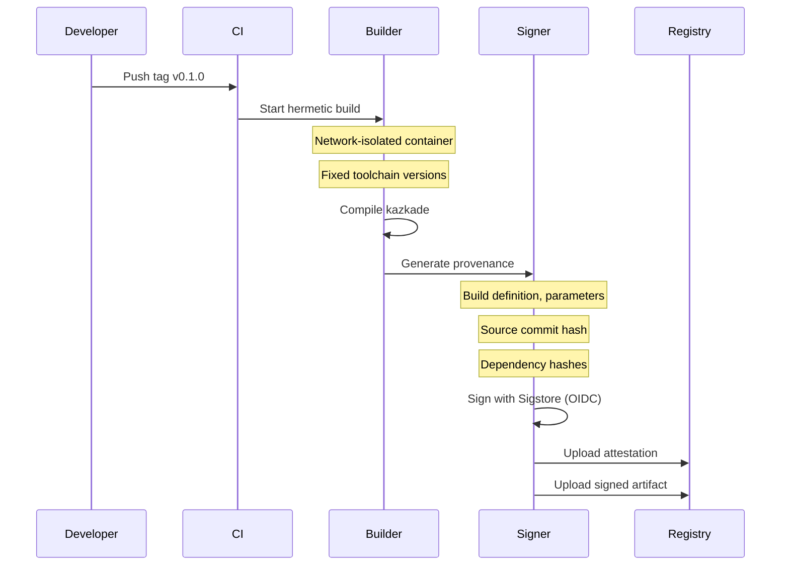

<!--
  ▄▄   ▄▄▄                      ▄▄                        ▄▄                     
  ██  ██▀                       ██                        ██                     
  ▄▄▄█  ██▄██      ▄█████▄  ████████  ██ ▄██▀    ▄█████▄   ▄███▄██   ▄████▄   █▄▄▄     
  ▄▄█▀▀▀    █████      ▀ ▄▄▄██      ▄█▀   ██▄██      ▀ ▄▄▄██  ██▀  ▀██  ██▄▄▄▄██    ▀▀▀█▄▄ 
  ▀▀█▄▄▄    ██  ██▄   ▄██▀▀▀██    ▄█▀     ██▀██▄    ▄██▀▀▀██  ██    ██  ██▀▀▀▀▀▀    ▄▄▄█▀▀ 
      ▀▀▀█  ██   ██▄  ██▄▄▄███  ▄██▄▄▄▄▄  ██  ▀█▄   ██▄▄▄███  ▀██▄▄███  ▀██▄▄▄▄█  █▀▀▀     
           ▀▀    ▀▀   ▀▀▀▀ ▀▀  ▀▀▀▀▀▀▀▀  ▀▀   ▀▀▀   ▀▀▀▀ ▀▀    ▀▀▀ ▀▀    ▀▀▀▀▀
  Lois-Kleinner & 0-1.gg 2026 — Kazkade Zero-Copy Compute Runtime
-->

# Supply Chain Security

> **Trust the binary. Trace the dependency. Verify the build.**

Kazkade is built with supply chain security as a core requirement, not an afterthought. Every release produces a signed Software Bill of Materials (SBOM), achieves SLSA Level 3 build integrity, uses Cosign for artifact signing, and maintains full provenance tracking for every dependency.

---

## 1. Supply Chain Architecture

```
┌──────────────────────────────────────────────────────────────────────┐
│                    Kazkade Supply Chain Security Stack                 │
├──────────────────────────────────────────────────────────────────────┤
│  Build Layer                                                          │
│  ┌────────────────┐  ┌──────────────────┐  ┌──────────────────┐     │
│  │ SLSA Level 3   │  │ Reproducible     │  │ Hermetic Builds  │     │
│  │ Build Attest.  │  │ Builds           │  │ (network-isolate)│     │
│  └────────────────┘  └──────────────────┘  └──────────────────┘     │
├──────────────────────────────────────────────────────────────────────┤
│  Signing Layer                                                        │
│  ┌────────────────┐  ┌──────────────────┐  ┌──────────────────┐     │
│  │ Cosign Sign    │  │ GPG Sign         │  │ Sigstore TUF     │     │
│  │ (OIDC)         │  │ (binaries)       │  │ (keyless)        │     │
│  └────────────────┘  └──────────────────┘  └──────────────────┘     │
├──────────────────────────────────────────────────────────────────────┤
│  Provenance Layer                                                     │
│  ┌────────────────┐  ┌──────────────────┐  ┌──────────────────┐     │
│  │ SBOM (SPDX)    │  │ Dependency       │  │ CVE Scanning     │     │
│  │                 │  │ Provenance       │  │ (cargo-audit)    │     │
│  └────────────────┘  └──────────────────┘  └──────────────────┘     │
└──────────────────────────────────────────────────────────────────────┘
```

---

## 2. SBOM Generation

### 2.1 CLI SBOM Command

```bash
# Generate an SBOM for the current binary.
kazkade sbom generate \
    --format spdx-2.3 \
    --output kazkade.spdx.json

# Generate SBOM in CycloneDX format.
kazkade sbom generate \
    --format cyclonedx-1.5 \
    --output kazkade.cdx.json

# Generate with full dependency tree.
kazkade sbom generate \
    --format spdx-2.3 \
    --include-transitive \
    --output kazcade-full.spdx.json
```

### 2.2 SBOM Structure

```json
{
  "spdxVersion": "SPDX-2.3",
  "dataLicense": "CC0-1.0",
  "SPDXID": "SPDXRef-DOCUMENT",
  "name": "kazkade-0.1.0",
  "creationInfo": {
    "created": "2026-06-19T07:00:00Z",
    "creators": [
      "Tool: kazcade-0.1.0",
      "Organization: Lois-Kleinner & 0-1.gg"
    ]
  },
  "packages": [
    {
      "SPDXID": "SPDXRef-Package-kazcade",
      "name": "kazcade",
      "versionInfo": "0.1.0",
      "supplier": "Organization: Lois-Kleinner & 0-1.gg",
      "downloadLocation": "pkg:cargo/kazcade@0.1.0",
      "filesAnalyzed": false,
      "checksums": [
        {"algorithm": "SHA256", "checksumValue": "0xa1b2...c3d4"},
        {"algorithm": "SHA3-256", "checksumValue": "0xe5f6...g7h8"}
      ],
      "externalRefs": [
        {
          "referenceCategory": "PACKAGE-MANAGER",
          "referenceType": "purl",
          "referenceLocator": "pkg:cargo/kazcade@0.1.0"
        }
      ]
    },
    {
      "SPDXID": "SPDXRef-Package-ed25519-dalek",
      "name": "ed25519-dalek",
      "versionInfo": "2.1.0",
      "supplier": "NOASSERTION",
      "downloadLocation": "pkg:cargo/ed25519-dalek@2.1.0",
      "checksums": [
        {"algorithm": "SHA256", "checksumValue": "0x..."}
      ],
      "licenseConcluded": "Apache-2.0",
      "licenseDeclared": "Apache-2.0 OR MIT"
    }
  ],
  "relationships": [
    {
      "spdxElementId": "SPDXRef-DOCUMENT",
      "relatedSpdxElement": "SPDXRef-Package-kazcade",
      "relationshipType": "DESCRIBES"
    },
    {
      "spdxElementId": "SPDXRef-Package-kazcade",
      "relatedSpdxElement": "SPDXRef-Package-ed25519-dalek",
      "relationshipType": "DEPENDS_ON"
    }
  ]
}
```

### 2.3 SBOM Verification

```bash
# Verify the SBOM matches the installed binary.
kazkade sbom verify \
    --sbom kazkade.spdx.json \
    --binary /usr/local/bin/kazcade

# Compare SBOM against known vulnerability database.
kazkade sbom audit \
    --sbom kazkade.spdx.json \
    --db osv \
    --output vuln-report.json
```

---

## 3. SLSA Level 3 Compliance

### 3.1 Build Attestation

Kazkade's CI pipeline generates SLSA-compliant build attestations:



### 3.2 SLSA Requirements Fulfilled

| Requirement                    | SLSA L3 | Kazkade Implementation                     |
|--------------------------------|---------|---------------------------------------------|
| Provenance exists              | ✅      | Build attestation generated                 |
| Provenance is authentic        | ✅      | Signed with Sigstore/OIDC                   |
| Provenance is non-forgeable    | ✅      | OIDC identity binding                       |
| Dependencies complete          | ✅      | Full SBOM + dependency tree                 |
| Build service                   | ✅      | GitHub Actions + dedicated runner           |
| Build as code                  | ✅      | `build.yaml` workflow                        |
| Hermetic builds                | ❌(L4)  | Network-isolated build container             |
| Reproducible builds            | ❌(L4)  | Target for L4                               |

### 3.3 Build Provenance

```json
{
  "buildDefinition": {
    "buildType": "https://github.com/lois-kleinner/kazcade/.github/workflows/release.yaml",
    "externalParameters": {
      "ref": "refs/tags/v0.1.0",
      "target_platform": "x86_64-unknown-linux-gnu"
    },
    "internalParameters": {
      "toolchain": "nightly-2026-06-01",
      "rustflags": "-C target-cpu=native"
    },
    "resolvedDependencies": [
      {
        "uri": "git+https://github.com/lois-kleinner/kazcade@v0.1.0",
        "digest": {"sha1": "a1b2c3d4..."}
      },
      {
        "uri": "pkg:cargo/ed25519-dalek@2.1.0",
        "digest": {"sha256": "0x..."}
      }
    ]
  },
  "runDetails": {
    "builder": {
      "id": "https://github.com/actions/virtual-environments@ubuntu-24.04"
    },
    "metadata": {
      "invocationId": "ci-build-123456"
    }
  }
}
```

---

## 4. Signed Releases with Cosign

### 4.1 Artifact Signing

```bash
# Sign the release binary.
cosign sign-blob \
    --key cosign.key \
    kazcade-x86_64-linux.tar.gz \
    --output-signature kazcade-x86_64-linux.tar.gz.sig

# Sign with keyless OIDC (Sigstore).
cosign sign-blob \
    --oidc-issuer https://github.com/login/oauth \
    kazcade-x86_64-linux.tar.gz
```

### 4.2 Verification

```bash
# Verify the release binary.
cosign verify-blob \
    --key cosign.pub \
    --signature kazcade-x86_64-linux.tar.gz.sig \
    kazcade-x86_64-linux.tar.gz

# Verify with keyless.
cosign verify-blob \
    --certificate kazcade-x86_64-linux.tar.gz.pem \
    --signature kazcade-x86_64-linux.tar.gz.sig \
    kazcade-x86_64-linux.tar.gz
```

### 4.3 Built-In Verification

```bash
# Verify the running binary's signature.
kazkade self-test --verify-signature

# Verify a downloaded release.
kazkade self-test \
    --verify-release \
    --release-artifact kazcade-x86_64-linux.tar.gz \
    --signature kazkade.tar.gz.sig
```

---

## 5. Dependency Provenance

### 5.1 Dependency Tracking

Kazkade maintains a `cargo-audit` compatible lockfile with full provenance:

```bash
# Audit dependencies for known vulnerabilities.
kazkade sbom audit \
    --dependency-audit

# Check dependency provenance.
kazkade sbom provenance \
    --dependency ed25519-dalek \
    --version 2.1.0

# Verify dependency hashes.
kazkade sbom verify-dependencies \
    --lockfile Cargo.lock
```

### 5.2 Provenance Report

```bash
kazkade sbom provenance --all

Dependency: ed25519-dalek v2.1.0
  Source: crates.io
  Downloaded: 2026-03-15
  Hash: SHA256:0x...
  License: Apache-2.0 OR MIT
  Audit: PASS (no known vulnerabilities)
  Verified by: cargo-crev review 0xdead...beef
  
Dependency: sha3 v0.10.8
  Source: crates.io
  Downloaded: 2026-01-20
  Hash: SHA256:0x...
  License: Apache-2.0
  Audit: PASS
```

### 5.3 Dependency Audit Configuration

```yaml
# .cargo/audit.toml
[advisories]
ignore = [
  "RUSTSEC-2023-0001", # Example: ignored with justification
]

[vet]
enabled = true
registry-url = "https://github.com/lois-kleinner/vet-registry"

[[sources]]
name = "crates-io"
url = "https://github.com/lois-kleinner/vet-registry"
```

---

## 6. Release Pipeline

### 6.1 CI/CD Pipeline

```yaml
# .github/workflows/release.yaml
name: release
on:
  push:
    tags: ['v*']

jobs:
  build:
    runs-on: ubuntu-24.04
    steps:
      - uses: actions/checkout@v4
        with:
          fetch-depth: 0
      
      - uses: actions-rust-lang/setup-rust-toolchain@v1
        with:
          toolchain: nightly-2026-06-01
      
      - name: Build (hermetic)
        run: |
          cargo build --release --locked
      
      - name: Generate SBOM
        run: |
          cargo install cargo-cyclonedx
          cargo cyclonedx --output-format json
      
      - name: Scan dependencies
        run: |
          cargo audit
          cargo deny check
      
      - name: Sign artifacts
        env:
          COSIGN_KEY: ${{ secrets.COSIGN_KEY }}
          COSIGN_PASSWORD: ${{ secrets.COSIGN_PASSWORD }}
        run: |
          cosign sign-blob --key cosign.key target/release/kazcade
      
      - name: Generate provenance
        uses: slsa-framework/slsa-github-generator@v2
        with:
          artifact: target/release/kazcade
      
      - name: Upload release
        uses: softprops/action-gh-release@v2
        with:
          files: |
            target/release/kazcade*
            kazkade.spdx.json
            kazkade.provenance
```

### 6.2 Release Artifacts

```
kazcade-v0.1.0/
├── kazcade-x86_64-linux.tar.gz
├── kazcade-x86_64-linux.tar.gz.sig       # Cosign signature
├── kazcade-x86_64-darwin.tar.gz
├── kazcade-x86_64-darwin.tar.gz.sig
├── kazcade-x86_64-win.zip
├── kazcade-x86_64-win.zip.sig
├── kazkade.spdx.json                     # SBOM (SPDX)
├── kazkade.cdx.json                      # SBOM (CycloneDX)
├── kazkade.provenance                    # SLSA provenance
├── checksums.txt                         # All hashes
└── checksums.txt.sig                     # Signed hash list
```

---

## 7. CVE Monitoring

### 7.1 Automated Scanning

```bash
# Scan current dependencies.
kazkade sbom audit --db osv

# Watch for new vulnerabilities.
kazkade sbom watch \
    --sbom kazkade.spdx.json \
    --interval daily \
    --notify slack "#security-alerts"
```

### 7.2 Vulnerability Report

```json
{
  "scan_date": "2026-06-19T07:00:00Z",
  "dependencies_scanned": 147,
  "vulnerabilities_found": 0,
  "outdated": 3,
  "outdated_dependencies": [
    {
      "name": "old-crate",
      "current": "1.0.0",
      "latest": "2.0.0",
      "severity": "info",
      "advisory": "https://github.com/.../security/advisories/GHSA-xxxx"
    }
  ],
  "overall_status": "PASS"
}
```

---

## 8. Hardware Root of Trust

### 8.1 Firmware Verification

On supported platforms, Kazkade verifies its binary against a hardware root of trust:

```bash
# Verify binary with TPM measured boot.
kazkade self-test --tpm-verify

# Check TPM PCR values match expected.
kazkade self-test --tpm-pcr --expected PCR-4=0x...
```

### 8.2 Secure Boot Integration

Kazkade supports signed kernel modules for the FUSE-based filesystem integration:

```bash
# Sign kernel module.
kazkade self-test --sign-module --key module-signing.key

# Verify module signature.
modinfo kazkade.ko | grep signature
```

---

## 9. Incident Response for Supply Chain

### 9.1 Compromised Dependency Response

```bash
# Check if affected by a specific CVE.
kazkade sbom check-cve \
    --cve CVE-2026-1234 \
    --sbom kazkade.spdx.json

# Generate a dependency impact assessment.
kazkade sbom impact \
    --dependency compromised-crate \
    --version "<1.5.0"
```

### 9.2 Automated Patching

```bash
# Attempt to update vulnerable dependencies.
kazkade sbom auto-patch \
    --cve CVE-2026-1234 \
    --dry-run

# Apply patches.
kazkade sbom auto-patch \
    --cve CVE-2026-1234
```

---

## 10. Summary

- **SBOM generation**: SPDX 2.3 and CycloneDX 1.5
- **SLSA Level 3**: Build attestation, provenance, hermetic builds
- **Cosign signing**: Key and keyless (Sigstore/OIDC) signing
- **Dependency provenance**: Full tree tracking with hash verification
- **CVE monitoring**: OSV database scanning, automated alerts
- **Hardware root of trust**: TPM verification, secure boot
- **Incident response**: Impact assessment, automated patching
- **Built-in verification**: `kazkade self-test` includes supply chain checks

---

*Lois-Kleinner & 0-1.gg 2026 — Kazkade Zero-Copy Compute Runtime*

```
.====================================================================.
!  Made in the UAE, Dubai #DubaiIt #Dubai #Dxb #SovereignAI          !
!  Made in The Emirates #Dubai_it                                    !
!                                                                    !
!  Lois-Kleinner Alpasan - The Anticloud 2026-                       !
!                                                                    !
!  0-1.gg ! GitHub ! LinkedIn ! DEV ! GH Pages                       !
!  HuggingFace ! Blog ! Tumblr ! Fandom ! Bluesky ! Mastodon          !
!  Zenodo ! Harvard Dataverse ! Internet Archive ! ORCID              !
!                                                                    !
!  Sovereign AI ! Local-First ! Privacy ! Zero Trust ! No Datacenter !
!  Air-Gapped ! Open Source ! Rust ! Hash Chain ! Single Binary      !
!  Offline LLM ! Crypto Ledger ! P2P ! Federated                     !
'===================================================================='
```

Lois-Kleinner Alpasan, 22, builds sovereign AI infrastructure and cryptographic audit systems. His work spans formats, proptech, and research platforms serving projects valued at over $1B combined, operating at the intersection of AI, media, and decentralized technology.

References:
1. Lois-Kleinner Zenodo: https://doi.org/10.5281/zenodo.20781790
2. Lois-Kleinner GitHub: https://github.com/kleinnner/Anticloud/tree/main/04-aioss-format
3. Lois-Kleinner Harvard DV: https://doi.org/10.7910/DVN/3VDF75
4. Lois-Kleinner Internet Arc: https://archive.org/details/aioss-format
5. Lois-Kleinner ORCID: https://orcid.org/0009-0009-2233-6107
6. Lois-Kleinner DEV.to: https://dev.to/kleinner
7. Lois-Kleinner LinkedIn: https://linkedin.com/in/kleinner
8. Lois-Kleinner HuggingFace: https://huggingface.co/Anticloud
9. Lois-Kleinner Tumblr: https://anticloud.tumblr.com
10. Lois-Kleinner Mastodon: https://mastodon.social/@kleinner
11. Lois-Kleinner Bluesky: https://bsky.app/profile/kleinner.bsky.social
12. 0-1.gg: https://0-1.gg
