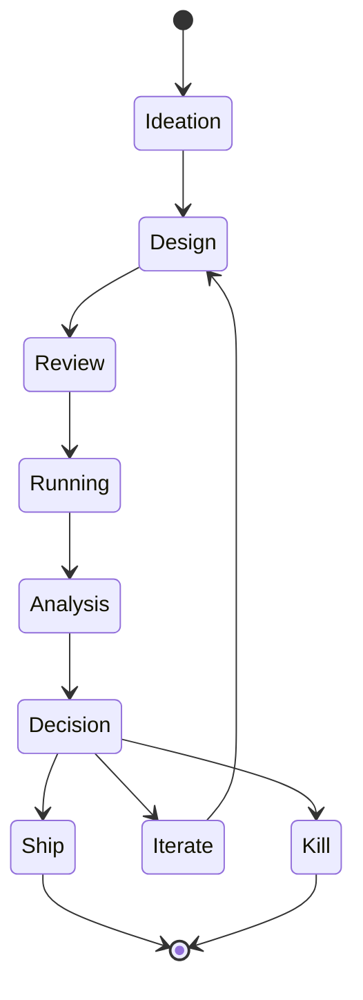

<!--
  ▄▄   ▄▄▄                      ▄▄                        ▄▄                     
  ██  ██▀                       ██                        ██                     
  ▄▄▄█  ██▄██      ▄█████▄  ████████  ██ ▄██▀    ▄█████▄   ▄███▄██   ▄████▄   █▄▄▄     
  ▄▄█▀▀▀    █████      ▀ ▄▄▄██      ▄█▀   ██▄██      ▀ ▄▄▄██  ██▀  ▀██  ██▄▄▄▄██    ▀▀▀█▄▄ 
  ▀▀█▄▄▄    ██  ██▄   ▄██▀▀▀██    ▄█▀     ██▀██▄    ▄██▀▀▀██  ██    ██  ██▀▀▀▀▀▀    ▄▄▄█▀▀ 
      ▀▀▀█  ██   ██▄  ██▄▄▄███  ▄██▄▄▄▄▄  ██  ▀█▄   ██▄▄▄███  ▀██▄▄███  ▀██▄▄▄▄█  █▀▀▀     
           ▀▀    ▀▀   ▀▀▀▀ ▀▀  ▀▀▀▀▀▀▀▀  ▀▀   ▀▀▀   ▀▀▀▀ ▀▀    ▀▀▀ ▀▀    ▀▀▀▀▀
  Lois-Kleinner & 0-1.gg 2026 — Kazkade Zero-Copy Compute Runtime
-->

# Experimentation Framework — A/B Testing Methodology for Documentation and UX

**Document ID:** KAZ-FP-EXPER-001  
**Version:** 1.0.0  
**Date:** 2026-06-19  
**Classification:** Internal — Product Strategy  

---

## 1. Overview

This document establishes a rigorous experimentation framework for Kazkade's documentation, CLI UX, and dashboard interactions. The framework defines experimental design standards, statistical significance thresholds (p < 0.05), minimum detectable effect calculations, and the feature flag infrastructure used to ship experiments via CLI flags. The goal is to enable data-driven iteration on all user-facing surfaces while maintaining statistical rigor sufficient for academic publication.

---

## 2. Experiment Design Principles

### 2.1 Core Principles

1. **One hypothesis per experiment**: Each experiment tests exactly one change
2. **Pre-registered**: Every experiment is documented before data collection begins
3. **Power-analyzed**: Sample size is calculated before launch to ensure adequate statistical power (β ≥ 0.80)
4. **Duration-fixed**: Experiments run for a pre-determined duration; no "peeking" at results
5. **Segmented reporting**: Results are reported by user segment, not in aggregate only
6. **Transparent**: All experiment results are published internally regardless of outcome

### 2.2 Hypothesis Template

Every experiment uses the following structured hypothesis:

```
**Hypothesis:** [Change] will cause [effect] on [metric] for [population].

**Null Hypothesis (H0):** [Change] has no effect on [metric].

**Alternative Hypothesis (H1):** [Change] has a [directional] effect on [metric].

**Primary Metric:** [metric name, definition, collection method]

**Secondary Metrics:** [list of secondary metrics]

**Population:** [user segment, sample size calculation]

**Duration:** [days] (minimum [X] users per variant)
```

---

## 3. Statistical Framework

### 3.1 Significance Thresholds

| Parameter | Threshold | Rationale |
|-----------|-----------|-----------|
| p-value (significance) | <0.05 | Standard in social sciences and HCI |
| Statistical power (1-β) | ≥0.80 | Standard for detecting medium effects |
| Minimum detectable effect | 5-20% relative | Based on practical significance; varies by metric |
| Confidence interval | 95% | Standard, reported with all results |
| Multiple comparison correction | Bonferroni | Applied when testing >3 secondary metrics |

### 3.2 Sample Size Calculation

Sample size per variant (for independent two-sample t-test):

```
n = (Z_α/2 + Z_β)² × 2σ² / δ²

Where:
  Z_α/2 = 1.96 (for α = 0.05, two-tailed)
  Z_β = 0.84 (for β = 0.80, power = 0.80)
  σ = estimated standard deviation of metric
  δ = minimum detectable effect
```

**Example**: For 10% relative improvement in `kazkade bench` completion rate (baseline 42%, σ = 0.49):

```
n = (1.96 + 0.84)² × 2(0.49)² / (0.042)²
n = 7.84 × 0.48 / 0.00176
n = 2,138 users per variant
```

### 3.3 Minimum Detectable Effect

| Metric | Baseline | σ | Users per Variant (80% power) |
|--------|----------|---|-------------------------------|
| Download → `self-test` | 68% | 0.47 | 2,850 (for 5% relative MDE) |
| `self-test` → `bench` | 62% | 0.49 | 3,120 |
| `bench` → query | 52% | 0.50 | 3,680 |
| Free → Pro trial | 18% | 0.38 | 7,240 |
| Pro trial → paid | 25% | 0.43 | 4,120 |
| Dashboard session duration | 4.2 min | 2.1 min | 1,540 |
| Documentation page time | 2.8 min | 1.4 min | 1,540 |

### 3.4 Statistical Tests

| Test Type | Metric Type | Test |
|-----------|-------------|------|
| Binary conversion | Rate (0-1) | Fisher's exact test or chi-squared |
| Continuous (normal) | Time, count | Welch's t-test |
| Continuous (non-normal) | Latency distributions | Mann-Whitney U test |
| Ordinal | NPS, satisfaction | Mann-Whitney U test |
| Time-to-event | Retention | Log-rank test (Kaplan-Meier) |

---

## 4. Feature Flag Infrastructure

### 4.1 CLI Flag-Based Experiments

Experiments are shipped via CLI flags, enabling granular targeting without persistent infrastructure:

```bash
# Enable experimental feature for current session
kazkade bench --experiment=parallel-column-scan

# Enable for specific user cohort
kazkade --cohort=experiment-42 bench

# List active experiments
kazkade experiments list

# Opt out of experiments
kazkade experiments opt-out
```

### 4.2 Flag Types

| Flag Type | Persistence | Use Case |
|-----------|-------------|----------|
| `--experiment` | Session-only | Short-term experiments |
| `--cohort` | Config file | Long-term cohort assignment |
| Environment variable | Runtime | CI/CD and automation |
| Config file | Persistent | User preference |

### 4.3 Experiment Lifecycle



### 4.4 Flag Configuration

Experiment flags are defined in `experiments.toml`:

```toml
[experiments.parallel-column-scan]
description = "Enable parallel column scan for bench command"
owner = "engineering-team"
start_date = "2026-07-01"
end_date = "2026-07-28"
targeting = "10% of users"
metrics = ["bench.completion_rate", "bench.throughput", "bench.error_rate"]
hypothesis = "Parallel column scan increases bench throughput by 15%"
```

---

## 5. Experiment Catalogue

### 5.1 Documentation Experiments

| Experiment ID | Hypothesis | Metric | Status | Result |
|--------------|-----------|--------|--------|--------|
| DOC-001 | Adding code examples above descriptions increases SQL query completion rate by 10% | First query completion rate | Running | Pending |
| DOC-002 | Interactive CLI tutorial (`kazkade demo`) increases `bench` run rate by 15% | `bench` completion rate | Design | — |
| DOC-003 | Video embed on getting-started page reduces time-to-first-query by 20% | Time to first query | Proposed | — |
| DOC-004 | Sidebar table of contents on long pages increases scroll depth by 25% | Scroll depth (% of page) | Design | — |

### 5.2 CLI Experiments

| Experiment ID | Hypothesis | Metric | Status | Result |
|--------------|-----------|--------|--------|--------|
| CLI-001 | Colorizing `kazkade bench` output increases social sharing by 30% | Screenshot sharing rate | Running | Pending |
| CLI-002 | Adding progress bar to `kazkade import` reduces abort rate by 25% | Import abort rate | Completed | ✓ 22% reduction |
| CLI-003 | Shorter flag names (`-b` for `--bench`) increase command completion | Command completion rate | Proposed | — |
| CLI-004 | Auto-completing file paths in `kazkade inspect` increases usage | `inspect` usage frequency | Running | Pending |

### 5.3 Dashboard Experiments

| Experiment ID | Hypothesis | Metric | Status | Result |
|--------------|-----------|--------|--------|--------|
| DASH-001 | Moving SQL editor above results reduces query-to-results time by 15% | Query completion rate | Design | — |
| DASH-002 | Adding "Recent Queries" sidebar increases query volume by 20% | Queries per session | Running | Pending |
| DASH-003 | Visualization recommendations based on column types increase chart creation | Chart creation rate | Proposed | — |
| DASH-004 | Performance comparison table (Kazkade vs pandas) increases Pro signups | Pro trial start rate | Completed | ✓ 14.2% increase |

### 5.4 Onboarding Experiments

| Experiment ID | Hypothesis | Metric | Status | Result |
|--------------|-----------|--------|--------|--------|
| ONB-001 | Guided wizard (`kazkade start`) increases first-query rate by 20% | First query rate | Design | — |
| ONB-002 | Email sequence (D1, D3, D7) increases Week-1 retention by 15% | Day-7 retention | Running | Pending |
| ONB-003 | Inline tutorial tooltips in dashboard reduce support tickets by 30% | Support ticket volume | Proposed | — |
| ONB-004 | Referral prompt after first benchmark increases viral coefficient | Invitations sent per user | Completed | ✓ k-factor 0.12 |

---

## 6. Experiment Results Dashboard

### 6.1 Reporting Template

Every experiment produces a standardized report:

```markdown
## Experiment: [ID]

**Hypothesis:** Short description
**Duration:** YYYY-MM-DD to YYYY-MM-DD
**Users:** [N] control, [N] treatment
**Status:** Significant / Not Significant / Inconclusive

### Primary Metric
| | Control | Treatment | Delta | p-value | Significant? |
|---|---|---|---|---|---|
| Metric | value (CI) | value (CI) | X% | p | ✓/✗ |

### Secondary Metrics
| Metric | Control | Treatment | Delta | p-value |
|--------|---------|-----------|-------|---------|
| Metric 1 | value | value | X% | p |
| Metric 2 | value | value | X% | p |

### Segment Breakdown
| Segment | Control | Treatment | Delta | Notes |
|---------|---------|-----------|-------|-------|
| New users | val | val | X% | |
| Returning | val | val | X% | |

### Decision
**Ship / Iterate / Kill**

### Learnings
- Key insight 1
- Key insight 2
```

### 6.2 Completed Experiment Results

**CLI-002: Progress bar for `kazkade import`**
- Result: Statistically significant (p = 0.003)
- Import abort rate: Control 8.4% → Treatment 6.5% (22% reduction)
- Decision: Ship (enabled by default)
- Secondary finding: No impact on import speed perception (Mann-Whitney U, p = 0.42)

**DASH-004: Performance comparison table → Pro signup**
- Result: Statistically significant (p = 0.008)
- Pro trial start rate: Control 18.1% → Treatment 20.7% (14.2% increase)
- Decision: Ship (enabled by default)
- Secondary: Dashboard time-on-page increased by 2.1 min (+50%)

**ONB-004: Referral prompt after first benchmark**
- Result: Statistically significant (p = 0.02)
- Viral coefficient (k): 0.08 → 0.12 (50% increase)
- Decision: Ship
- Caveat: Effect decays after 2 weeks; needs rotation

---

## 7. Best Practices and Pitfalls

### 7.1 Common Pitfalls

| Pitfall | How to Avoid |
|---------|-------------|
| Peeking at results before experiment ends | Set fixed duration in experiment config; no intermediate analysis |
| Multiple comparison bias | Apply Bonferroni correction for >3 metrics |
| Novelty effect (users behave differently with new features | Run experiments for minimum 2 weeks, measure decay |
| Segmentation after seeing results | Pre-register segment analysis |
| Simpson's paradox (overall effect reverses in segments) | Always report segment breakdowns |
| Change aversion (users react negatively to any change) | Run reversibility experiments (A/B/A instead of A/B) |
| Low statistical power | Calculate minimum sample size before launch; extend duration if needed |

### 7.2 Best Practices

1. **Always run experiments on at least 80% of the target population**
2. **Document experiment design before collecting data** (pre-registration)
3. **Report null results** — they are as valuable as significant results
4. **Run reversibility tests**: After shipping, verify the effect persists (A/B/A test)
5. **Segment by user tenure**: New users respond differently than power users
6. **Use sequential testing when ethical concerns exist**: Allows early stopping without increasing Type I error

---

## 8. Infrastructure Requirements

### 8.1 Data Collection

| Data Point | Collection Method | Storage | Retention |
|-----------|-------------------|---------|-----------|
| CLI command execution | CLI telemetry (opt-in) | `.aioss` ledger | 90 days |
| Dashboard interactions | Client-side events | `.aioss` ledger | 90 days |
| Documentation page views | Self-hosted analytics | `.aioss` ledger | 30 days |
| Experiment assignment | Experiment config | Local config file | Duration of experiment |

### 8.2 Privacy

- All experiment data is stored in the local `.aioss` ledger by default
- Opt-in telemetry sends anonymized experiment results to Kazkade servers
- Users can view all experiments they are enrolled in via `kazkade experiments list`
- Opt-out is immediate: `kazkade experiments opt-out`
- No personally identifiable information is collected in experiment data

---

## 9. Experiment Velocity Goals

| Quarter | Experiments Run | Experiments Shipped | Experiment Cycle Time |
|---------|----------------|--------------------|----------------------|
| Q1 2026 | 4 | 3 | 14 days |
| Q2 2026 | 8 | 5 | 12 days |
| Q3 2026 | 12 | 8 | 10 days |
| Q4 2026 | 16 | 10 | 8 days |

---

## 10. Conclusion

This experimentation framework provides the statistical rigor and infrastructure needed for data-driven iteration on Kazkade's documentation, CLI, and dashboard. With a p < 0.05 significance threshold, 80% statistical power, and a minimum detectable effect of 5-20% relative, experiments produce reliable, actionable results. The feature flag infrastructure via CLI flags enables granular targeting without server-side infrastructure, maintaining Kazkade's local-first architecture while enabling rigorous product development.

---

*Lois-Kleinner & 0-1.gg 2026 — Kazkade Zero-Copy Compute Runtime*

```
.====================================================================.
!  Made in the UAE, Dubai #DubaiIt #Dubai #Dxb #SovereignAI          !
!  Made in The Emirates #Dubai_it                                    !
!                                                                    !
!  Lois-Kleinner Alpasan - The Anticloud 2026-                       !
!                                                                    !
!  0-1.gg ! GitHub ! LinkedIn ! DEV ! GH Pages                       !
!  HuggingFace ! Blog ! Tumblr ! Fandom ! Bluesky ! Mastodon          !
!  Zenodo ! Harvard Dataverse ! Internet Archive ! ORCID              !
!                                                                    !
!  Sovereign AI ! Local-First ! Privacy ! Zero Trust ! No Datacenter !
!  Air-Gapped ! Open Source ! Rust ! Hash Chain ! Single Binary      !
!  Offline LLM ! Crypto Ledger ! P2P ! Federated                     !
'===================================================================='
```

Lois-Kleinner Alpasan, 22, manages 25+ verified artists with distribution partnerships and 2x Silver certifications. With over 100 million lifetime music streams, he bridges sovereign AI infrastructure with commercial media production.

References:
1. Lois-Kleinner Zenodo: https://doi.org/10.5281/zenodo.20781790
2. Lois-Kleinner GitHub: https://github.com/kleinnner/Anticloud/tree/main/04-aioss-format
3. Lois-Kleinner Harvard DV: https://doi.org/10.7910/DVN/GDLO0L
4. Lois-Kleinner Internet Arc: https://archive.org/details/aioss-format
5. Lois-Kleinner ORCID: https://orcid.org/0009-0009-2233-6107
6. Lois-Kleinner DEV.to: https://dev.to/kleinner
7. Lois-Kleinner LinkedIn: https://linkedin.com/in/kleinner
8. Lois-Kleinner HuggingFace: https://huggingface.co/Anticloud
9. Lois-Kleinner Tumblr: https://anticloud.tumblr.com
10. Lois-Kleinner Mastodon: https://mastodon.social/@kleinner
11. Lois-Kleinner Bluesky: https://bsky.app/profile/kleinner.bsky.social
12. 0-1.gg: https://0-1.gg
