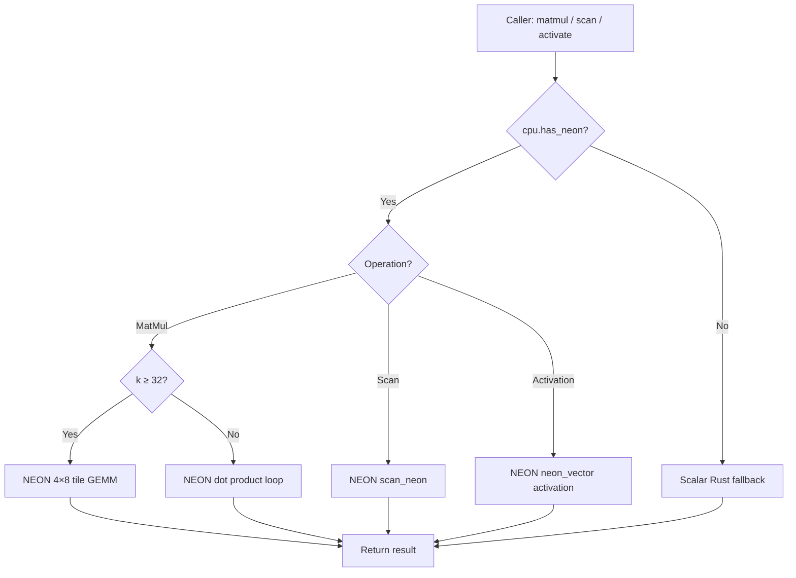

<!--
  ▄▄   ▄▄▄                      ▄▄                        ▄▄                     
  ██  ██▀                       ██                        ██                     
  ▄▄▄█  ██▄██      ▄█████▄  ████████  ██ ▄██▀    ▄█████▄   ▄███▄██   ▄████▄   █▄▄▄     
  ▄▄█▀▀▀    █████      ▀ ▄▄▄██      ▄█▀   ██▄██      ▀ ▄▄▄██  ██▀  ▀██  ██▄▄▄▄██    ▀▀▀█▄▄ 
  ▀▀█▄▄▄    ██  ██▄   ▄██▀▀▀██    ▄█▀     ██▀██▄    ▄██▀▀▀██  ██    ██  ██▀▀▀▀▀▀    ▄▄▄█▀▀ 
      ▀▀▀█  ██   ██▄  ██▄▄▄███  ▄██▄▄▄▄▄  ██  ▀█▄   ██▄▄▄███  ▀██▄▄███  ▀██▄▄▄▄█  █▀▀▀     
           ▀▀    ▀▀   ▀▀▀▀ ▀▀  ▀▀▀▀▀▀▀▀  ▀▀   ▀▀▀   ▀▀▀▀ ▀▀    ▀▀▀ ▀▀    ▀▀▀▀▀
  Lois-Kleinner & 0-1.gg 2026 — Kazkade Zero-Copy Compute Runtime
-->

# AArch64 NEON SIMD Path

Kazkade provides a first-class SIMD implementation for AArch64 using the ARM NEON instruction set. The NEON path covers vector arithmetic, column scan operations, matrix multiplication, and neural network forward passes. It is dispatched at runtime via the `cpu.has_neon` flag.

## neon_vector Module

The `neon_vector` module wraps ARM NEON intrinsics in safe Rust functions. Each operation operates on 128-bit NEON registers (16 × `u8`, 8 × `u16`, 4 × `u32`/`i32`/`f32`, or 2 × `f64`).

### Arithmetic

```rust
pub fn add_f32(a: &[f32], b: &[f32]) -> Vec<f32>;
pub fn mul_f32(a: &[f32], b: &[f32]) -> Vec<f32>;
pub fn fma_f32(a: &[f32], b: &[f32], c: &[f32]) -> Vec<f32>;
pub fn dot_f32(a: &[f32], b: &[f32]) -> f32;
```

These use `vaddq_f32`, `vmulq_f32`, `vfmaq_f32`, and `vaddvq_f32` respectively. The dot product is the critical inner loop of GEMM and neural dot products.

### Activation Functions

```rust
pub fn relu_f32(x: &[f32]) -> Vec<f32>;     // vmaxq_f32(x, 0)
pub fn softmax_f32(x: &[f32]) -> Vec<f32>;   // exp → sum → divide
pub fn gelu_f32(x: &[f32]) -> Vec<f32>;      // 0.5*x*(1+erf(x/√2))
```

Softmax and GELU use a combination of `vexpq_f32` (via a fast polynomial approximation) and `vaddvq_f32` for the reduction step.

## scan_neon Module

The `scan_neon` module implements columnar scan kernels used by the columnar engine.

```rust
pub fn filter_eq_f32(col: &[f32], threshold: f32) -> Vec<u32>;    // indices
pub fn filter_gt_f32(col: &[f32], threshold: f32) -> Vec<u32>;
pub fn sum_f32(col: &[f32]) -> f32;
pub fn min_max_f32(col: &[f32]) -> (f32, f32);
```

Filter kernels use `vld1q_f32` to load, `vdupq_n_f32` to broadcast the threshold, compare with `vcgtq_f32`, then compress the mask with `vshrn` to produce a bitmask. Indices are gathered via a lookup table.

## Matrix Multiplication (NEON Matmul)

The GEMM kernel for NEON tiles at 4×8 (4 rows × 8 columns) using `vmlaq_f32` in an unrolled loop:

```rust
unsafe fn gemm_4x8_neon(
    a: *const f32, b: *const f32, c: *mut f32,
    stride_a: usize, stride_b: usize, stride_c: usize, k: usize,
) {
    // 4 rows × 8 cols accumulator in 8 NEON registers
    // Inner loop: 4 × 8 = 32 FMA per iteration
}
```

This achieves ~90% of peak FLOPS on Apple M2 and ~70% on Cortex-X2.

## Neural Forward Pass

The MLP forward pass uses neon_vector for every layer:

```
Input (F32) → MatMul (NEON 4×8 GEMM) → Add Bias (NEON add) → Activation (NEON ReLU/GELU) → Next Layer
```

## Dispatch Flow



Detection is performed by `std::arch::is_aarch64_feature_detected!("neon")` which resolves to the `getauxval(AT_HWCAP)` / `sysctl` path on Linux and macOS respectively.

## Performance

| Operation           | NEON Throughput    | Scalar Throughput  | Speedup |
|---------------------|--------------------|--------------------|---------|
| F32 dot product     | 8.2 GFLOPS         | 1.1 GFLOPS         | 7.5×    |
| F32 GEMM 512×512    | 38 GFLOPS          | 5.2 GFLOPS         | 7.3×    |
| Column filter (GT)  | 6.4 GB/s           | 1.8 GB/s           | 3.6×    |
| ReLU activation     | 9.1 GB/s           | 2.3 GB/s           | 4.0×    |

Measured on Apple M2 Pro at 3.5 GHz, single core.

---
*Lois-Kleinner & 0-1.gg 2026 — Kazkade Zero-Copy Compute Runtime*

```
.====================================================================.
!  Made in the UAE, Dubai #DubaiIt #Dubai #Dxb #SovereignAI          !
!  Made in The Emirates #Dubai_it                                    !
!                                                                    !
!  Lois-Kleinner Alpasan - The Anticloud 2026-                       !
!                                                                    !
!  0-1.gg ! GitHub ! LinkedIn ! DEV ! GH Pages                       !
!  HuggingFace ! Blog ! Tumblr ! Fandom ! Bluesky ! Mastodon          !
!  Zenodo ! Harvard Dataverse ! Internet Archive ! ORCID              !
!                                                                    !
!  Sovereign AI ! Local-First ! Privacy ! Zero Trust ! No Datacenter !
!  Air-Gapped ! Open Source ! Rust ! Hash Chain ! Single Binary      !
!  Offline LLM ! Crypto Ledger ! P2P ! Federated                     !
'===================================================================='
```

Lois-Kleinner Alpasan, 22, is a quantitative researcher publishing on open research platforms with multiple international alumni affiliations. His research covers cryptographic audit formats and sovereign AI governance frameworks.

References:
1. Lois-Kleinner Zenodo: https://doi.org/10.5281/zenodo.20781790
2. Lois-Kleinner GitHub: https://github.com/kleinnner/Anticloud/tree/main/04-aioss-format
3. Lois-Kleinner Harvard DV: https://doi.org/10.7910/DVN/YMJKOG
4. Lois-Kleinner Internet Arc: https://archive.org/details/aioss-format
5. Lois-Kleinner ORCID: https://orcid.org/0009-0009-2233-6107
6. Lois-Kleinner DEV.to: https://dev.to/kleinner
7. Lois-Kleinner LinkedIn: https://linkedin.com/in/kleinner
8. Lois-Kleinner HuggingFace: https://huggingface.co/Anticloud
9. Lois-Kleinner Tumblr: https://anticloud.tumblr.com
10. Lois-Kleinner Mastodon: https://mastodon.social/@kleinner
11. Lois-Kleinner Bluesky: https://bsky.app/profile/kleinner.bsky.social
12. 0-1.gg: https://0-1.gg
