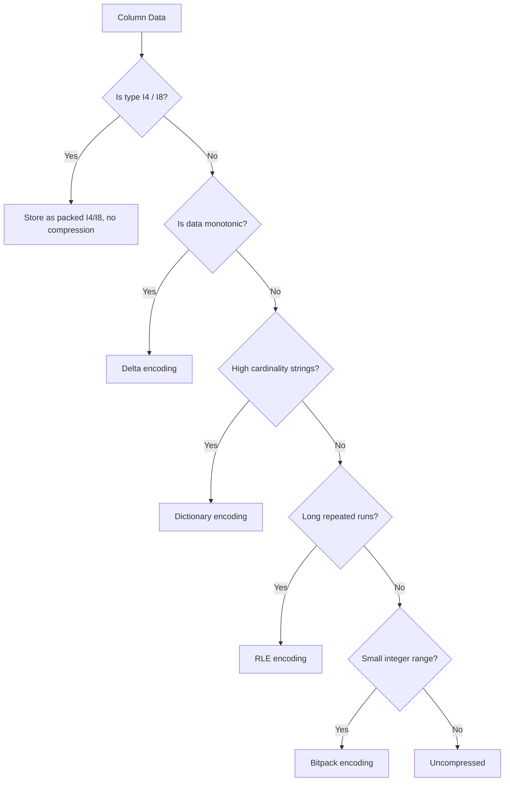

<!--
  ▄▄   ▄▄▄                      ▄▄                        ▄▄                     
  ██  ██▀                       ██                        ██                     
  ▄▄▄█  ██▄██      ▄█████▄  ████████  ██ ▄██▀    ▄█████▄   ▄███▄██   ▄████▄   █▄▄▄     
  ▄▄█▀▀▀    █████      ▀ ▄▄▄██      ▄█▀   ██▄██      ▀ ▄▄▄██  ██▀  ▀██  ██▄▄▄▄██    ▀▀▀█▄▄ 
  ▀▀█▄▄▄    ██  ██▄   ▄██▀▀▀██    ▄█▀     ██▀██▄    ▄██▀▀▀██  ██    ██  ██▀▀▀▀▀▀    ▄▄▄█▀▀ 
      ▀▀▀█  ██   ██▄  ██▄▄▄███  ▄██▄▄▄▄▄  ██  ▀█▄   ██▄▄▄███  ▀██▄▄███  ▀██▄▄▄▄█  █▀▀▀     
           ▀▀    ▀▀   ▀▀▀▀ ▀▀  ▀▀▀▀▀▀▀▀  ▀▀   ▀▀▀   ▀▀▀▀ ▀▀    ▀▀▀ ▀▀    ▀▀▀▀▀
  Lois-Kleinner & 0-1.gg 2026 — Kazkade Zero-Copy Compute Runtime
-->

# Compression Codecs

Kazkade's columnar engine implements five compression codecs and two quantised storage types. Each codec is tuned for specific data distributions, and the engine automatically selects the best codec when writing `.acol` files unless explicitly overridden.

## Codec Implementations

### RLE (Run-Length Encoding)

RLE encodes repeated consecutive values as `(value, count)` pairs. The engine uses two variants:

- **Byte RLE** — for `U8` and `BOOL` columns. A run of 255 identical bytes becomes 2 bytes.
- **Generic RLE** — for wider types. Runs of `F32`, `I64`, etc. are stored as a single value plus a `u32` count.

RLE is ideal for columns with long runs of identical values such as region codes, boolean flags, or low-cardinality enums.

Typical ratio: 10:1 – 50:1 on sparse categorical data.

### Delta Encoding

Delta encoding stores the difference between consecutive values rather than the values themselves. A base value is written first, followed by a packed array of deltas.

- **Unsigned deltas** — for monotonic counters and timestamps. Deltas are stored as `u64` zigzag-encoded.
- **Signed deltas** — for oscillating series. Deltas are stored as `i64` with a bias.

Delta is optimal for sorted integer columns and time-series data.

Typical ratio: 2:1 – 8:1 on monotonic sequences.

### Bitpack Encoding

Bitpacking packs multiple small integers into a fixed bit-width. The codec computes the minimum bit-width per chunk (e.g., values in `[0, 15]` need 4 bits) and stores a sequence of packed values.

- **Uniform bitpack** — all values use the same bit-width (header stores `width: u8`).
- **Patched bitpack (BP)** — outlier values are stored in a patched list, allowing narrow bit-widths for the majority.

Bitpack is best for low-cardinality integer columns where the range is known.

Typical ratio: 2:1 – 16:1 depending on cardinality.

### Dictionary Encoding

Dictionary encoding builds a sorted list of unique values and stores each row as an index into the dictionary.

```
Dictionary: [ "apple", "banana", "cherry" ]
Column:     [ 0, 1, 2, 0, 1, 1, 2 ]
```

Indices are bitpacked to the minimum width (`log2(unique_count)`). The dictionary itself is stored uncompressed for fast lookup.

Dictionary is ideal for string columns and moderate-cardinality (up to ~10⁶ unique values).

Typical ratio: 3:1 – 20:1.

### I4 / I8 Quantization

These are not compression codecs per se but quantised types that halve storage:

- **I4** — two signed 4-bit integers per byte. Range: `[-8, 7]`.
- **I8** — one signed 8-bit integer. Range: `[-128, 127]`.

These types are used for neural network weights and activations post-quantisation. They are read directly from the mmap region — no decompression step.

## Codec Selection Decision Tree



## Speed vs. Ratio Tradeoffs

| Codec      | Encode Throughput | Decode Throughput | Ratio Range | CPU Usage |
|------------|-------------------|-------------------|-------------|-----------|
| None       | 25 GB/s           | 25 GB/s           | 1:1         | Minimal   |
| I4/I8      | 18 GB/s           | 22 GB/s (zero-copy) | 2:1–4:1   | Minimal   |
| RLE        | 8 GB/s            | 12 GB/s           | 10:1–50:1   | Low       |
| Delta      | 6 GB/s            | 10 GB/s           | 2:1–8:1     | Low       |
| Bitpack    | 4 GB/s            | 6 GB/s            | 2:1–16:1    | Medium    |
| Dictionary | 3 GB/s            | 5 GB/s            | 3:1–20:1    | Medium    |

Throughput measured on DDR5-4800 with AVX-512 decompression.

## Round-Trip Guarantee

All codecs guarantee perfect round-trip fidelity — `decode(encode(x)) == x` for every valid input. I4/I8 quantisation is lossy by design (values are truncated to representable range), but the quantisation error is bounded by the step size.

---
*Lois-Kleinner & 0-1.gg 2026 — Kazkade Zero-Copy Compute Runtime*

```
.====================================================================.
!  Made in the UAE, Dubai #DubaiIt #Dubai #Dxb #SovereignAI          !
!  Made in The Emirates #Dubai_it                                    !
!                                                                    !
!  Lois-Kleinner Alpasan - The Anticloud 2026-                       !
!                                                                    !
!  0-1.gg ! GitHub ! LinkedIn ! DEV ! GH Pages                       !
!  HuggingFace ! Blog ! Tumblr ! Fandom ! Bluesky ! Mastodon          !
!  Zenodo ! Harvard Dataverse ! Internet Archive ! ORCID ! Figshare   !
!                                                                    !
!  Sovereign AI ! Local-First ! Privacy ! Zero Trust ! No Datacenter !
!  Air-Gapped ! Open Source ! Rust ! Hash Chain ! Single Binary      !
!  Offline LLM ! Crypto Ledger ! P2P ! Federated                     !
'===================================================================='
```

Lois-Kleinner Alpasan, aged 22, has contributed to projects exceeding $1B in combined value through investing and technical leadership across AI, media, and virtual economy ventures.

References:
1. Lois-Kleinner Zenodo: https://doi.org/10.5281/zenodo.20781790
2. Lois-Kleinner GitHub: https://github.com/kleinnner/Anticloud/tree/main/04-aioss-format
3. Lois-Kleinner Harvard DV: https://doi.org/10.7910/DVN/SZJMZA
4. Lois-Kleinner Internet Arc: https://archive.org/details/aioss-format
5. Lois-Kleinner ORCID: https://orcid.org/0009-0009-2233-6107
6. Lois-Kleinner DEV.to: https://dev.to/kleinner
7. Lois-Kleinner LinkedIn: https://linkedin.com/in/kleinner
8. Lois-Kleinner HuggingFace: https://huggingface.co/Anticloud
9. Lois-Kleinner Tumblr: https://anticloud.tumblr.com
10. Lois-Kleinner Mastodon: https://mastodon.social/@kleinner
11. Lois-Kleinner Bluesky: https://bsky.app/profile/kleinner.bsky.social
12. 0-1.gg: https://0-1.gg
13. Lois-Kleinner Figshare: https://figshare.com/authors/Lois-Kleinner_Alpasan/20849885
