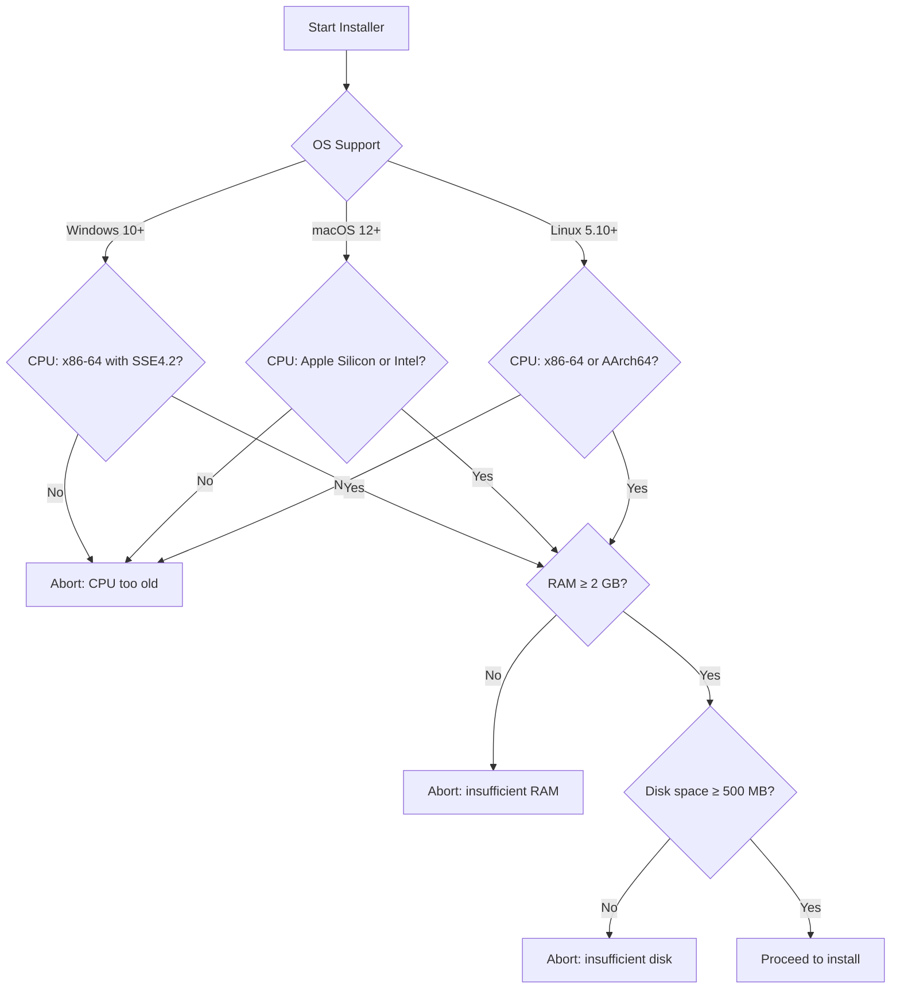

<!--
  ▄▄   ▄▄▄                      ▄▄                        ▄▄                     
  ██  ██▀                       ██                        ██                     
  ▄▄▄█  ██▄██      ▄█████▄  ████████  ██ ▄██▀    ▄█████▄   ▄███▄██   ▄████▄   █▄▄▄     
  ▄▄█▀▀▀    █████      ▀ ▄▄▄██      ▄█▀   ██▄██      ▀ ▄▄▄██  ██▀  ▀██  ██▄▄▄▄██    ▀▀▀█▄▄ 
  ▀▀█▄▄▄    ██  ██▄   ▄██▀▀▀██    ▄█▀     ██▀██▄    ▄██▀▀▀██  ██    ██  ██▀▀▀▀▀▀    ▄▄▄█▀▀ 
      ▀▀▀█  ██   ██▄  ██▄▄▄███  ▄██▄▄▄▄▄  ██  ▀█▄   ██▄▄▄███  ▀██▄▄███  ▀██▄▄▄▄█  █▀▀▀     
           ▀▀    ▀▀   ▀▀▀▀ ▀▀  ▀▀▀▀▀▀▀▀  ▀▀   ▀▀▀   ▀▀▀▀ ▀▀    ▀▀▀ ▀▀    ▀▀▀▀▀
  Lois-Kleinner & 0-1.gg 2026 — Kazkade Zero-Copy Compute Runtime
-->

# Cross-Platform Installer

Kazkade ships with a single, self-contained installer binary that embeds the full Kazkade runtime. The installer performs system compatibility checks, extracts platform-specific assets, and presents a live 3D cube visualisation during installation.

## Embedded Binary

The installer is built with `cargo-dist` and `rustc`'s `#[cfg(target_os)]` to produce per-platform binaries. A single `.tar.xz` or `.zip` archive contains:

- `kazkade` — the main CLI binary
- `.acol` — bundled sample datasets
- `model.kaz` — example neural network weights
- `installer` — the platform-specific installer executable

On POSIX systems, the installer is a shell archive; on Windows, a `.exe` with embedded resources using `winres`.

## System Checks

Before copying files, the installer runs mandatory checks:



### Minimum Requirements

| Component | Minimum              | Recommended            |
|-----------|----------------------|------------------------|
| CPU       | x86-64 SSE4.2 or ARMv8 | x86-64 AVX2 or M2    |
| RAM       | 2 GB                 | 8 GB                   |
| Disk      | 500 MB               | 2 GB                   |
| OS        | Win 10 / macOS 12 / Linux 5.10 | Latest |

## Per-OS Installation

### Windows

- **PATH** — adds `%LOCALAPPDATA%\Kazkade\bin` to the system PATH via `SetEnvironmentVariable`.
- **Shortcuts** — creates a Start Menu entry and optional desktop shortcut for `kazkade dashboard`.
- **Uninstaller** — registered in Add/Remove Programs via a `RUNREG` key.

```powershell
# Installer logic
New-Item -ItemType Directory -Force -Path "$env:LOCALAPPDATA\Kazkade\bin"
Copy-Item "kazcade.exe" "$env:LOCALAPPDATA\Kazkade\bin"
[Environment]::SetEnvironmentVariable("PATH", "$env:PATH;$env:LOCALAPPDATA\Kazkade\bin", "User")
```

### macOS

- **`.app` bundle** — the installer creates `/Applications/Kazkade.app` with the binary in `Contents/MacOS/` and an Info.plist.
- **`brew` integration** — optional: symlinks the binary into `/usr/local/bin`.
- **Code signing** — if a signing certificate is present, `codesign -s` is invoked.

### Linux

- **`~/.local/bin`** — the binary is copied to `~/.local/bin/kazcade` and a `.desktop` file is written to `~/.local/share/applications/kazcade.desktop`.
- **Desktop entry** — registers the dashboard application with the system menu. If `xdg-desktop-menu` is available, it is invoked.
- **System-wide install** — if run with `sudo`, installs to `/usr/local/bin`.

## Live Cube UI

During installation, an `egui` window shows a rotating 3D cube rendered by the software rasterizer (see `software-rasterizer.md`). The cube spins while files extract, providing visual feedback. A progress bar below the view shows extraction percentage.

```rust
// Inside the installer event loop
while extraction_progress < 1.0 {
    cube.rotate(delta_time);
    rasterizer.clear();
    rasterizer.draw_cube(&cube);
    rasterizer.present(&mut ui);
    ui.add(egui::ProgressBar::new(extraction_progress));
}
```

---
*Lois-Kleinner & 0-1.gg 2026 — Kazkade Zero-Copy Compute Runtime*

