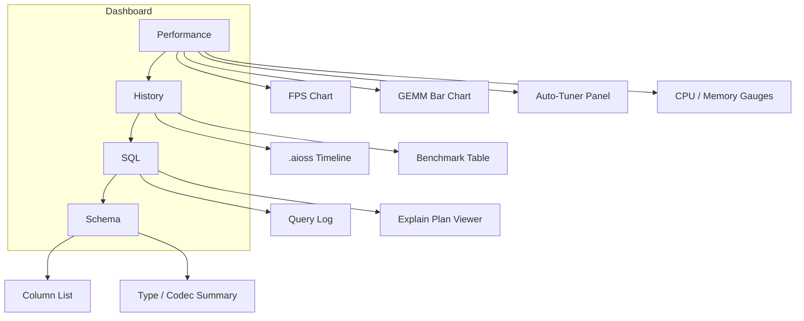
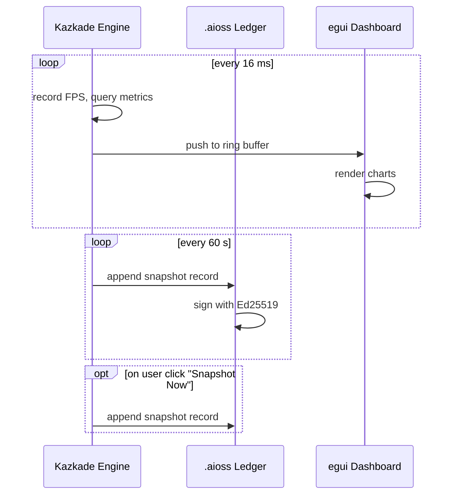

<!--
  ▄▄   ▄▄▄                      ▄▄                        ▄▄                     
  ██  ██▀                       ██                        ██                     
  ▄▄▄█  ██▄██      ▄█████▄  ████████  ██ ▄██▀    ▄█████▄   ▄███▄██   ▄████▄   █▄▄▄     
  ▄▄█▀▀▀    █████      ▀ ▄▄▄██      ▄█▀   ██▄██      ▀ ▄▄▄██  ██▀  ▀██  ██▄▄▄▄██    ▀▀▀█▄▄ 
  ▀▀█▄▄▄    ██  ██▄   ▄██▀▀▀██    ▄█▀     ██▀██▄    ▄██▀▀▀██  ██    ██  ██▀▀▀▀▀▀    ▄▄▄█▀▀ 
      ▀▀▀█  ██   ██▄  ██▄▄▄███  ▄██▄▄▄▄▄  ██  ▀█▄   ██▄▄▄███  ▀██▄▄███  ▀██▄▄▄▄█  █▀▀▀     
           ▀▀    ▀▀   ▀▀▀▀ ▀▀  ▀▀▀▀▀▀▀▀  ▀▀   ▀▀▀   ▀▀▀▀ ▀▀    ▀▀▀ ▀▀    ▀▀▀▀▀
  Lois-Kleinner & 0-1.gg 2026 — Kazkade Zero-Copy Compute Runtime
-->

# Diagnostics Dashboard — Live `egui` Monitoring

The Kazkade diagnostics dashboard is an `egui`-based real-time monitoring UI that displays internal performance metrics, history, SQL query profiles, and schema information. It is built with `eframe` (native window) and can optionally be embedded into the installer's rasterizer view.

## Tab Layout



## 1. Performance Tab

The default view shows four panels:

- **FPS Chart** — a sparkline plotting framerate over the last 10 seconds. Sampled every frame via `std::time::Instant`.
- **GEMM Bar Chart** — throughput in GFLOPS for each GEMM tile size tested by the auto-tuner. Updated whenever `kazkade bench --neural` runs.
- **Auto-Tuner Panel** — lists the current tile configuration (AVX2 8×8, AVX‑512 16×16, etc.) and the last benchmark latency.
- **CPU / Memory Gauges** — real‑time utilisation via `sysinfo` crate; updated at 1 Hz.

```rust
// Each gauge is a simple egui `ProgressBar` styled as a gauge.
ui.add(
    egui::widgets::ProgressBar::new(cpu_usage / 100.0)
        .animate(true)
        .text(format!("CPU {:.1}%", cpu_usage)),
);
```

## 2. History Tab

The History tab reads the `.aioss` ledger (see `aioss-ledger.md`) and renders:

- A timeline view (vertical scroll, left‑to‑right) showing each record as a dot coloured by entry type. Clicking expands the record JSON.
- A benchmark summary table: columns for timestamp, GEMM GFLOPS, scan bandwidth, rasterizer FPS. Sorted by time descending.

History is persisted across sessions by appending a new record every 60 seconds or on explicit snapshot (triggered by the "Snapshot Now" button).

## 3. SQL Tab

Displays recent SQL queries executed through the `kazkade query` CLI or programmatic API. Each row shows:

- Query text (truncated to 120 chars)
- Duration (µs)
- Rows scanned
- Scan method (SIMD/scalar)

A second panel shows the `EXPLAIN` plan for the selected query, decoded from the columnar engine's query planner.

## 4. Schema Tab

Lists every column across all loaded `.acol` datasets. For each column:

- **Name** and **logical type**
- **Physical codec** and compression ratio
- **Nullable** flag
- **Cardinality** estimate (hyperloglog sketch)

## Data Flow



## Integration with .aioss

The dashboard's History tab depends on the `.aioss` ledger. When the dashboard starts, it calls `AiossLedger::open()` on the default ledger path (`~/.kazcade/ledger.aioss`). New snapshots are appended via `ledger.append(0x02, snapshot_json, &key)`. The user can export the ledger at any time as proof of benchmark integrity.

---
*Lois-Kleinner & 0-1.gg 2026 — Kazkade Zero-Copy Compute Runtime*

