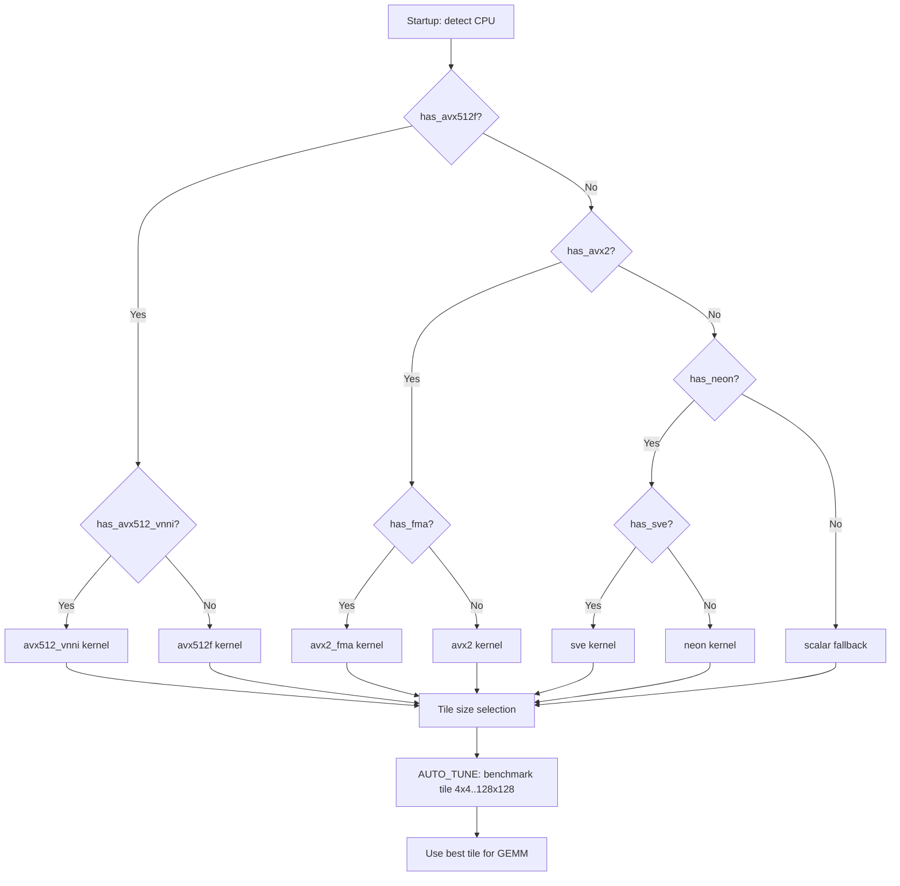

<!--
  ▄▄   ▄▄▄                      ▄▄                        ▄▄                     
  ██  ██▀                       ██                        ██                     
  ▄▄▄█  ██▄██      ▄█████▄  ████████  ██ ▄██▀    ▄█████▄   ▄███▄██   ▄████▄   █▄▄▄     
  ▄▄█▀▀▀    █████      ▀ ▄▄▄██      ▄█▀   ██▄██      ▀ ▄▄▄██  ██▀  ▀██  ██▄▄▄▄██    ▀▀▀█▄▄ 
  ▀▀█▄▄▄    ██  ██▄   ▄██▀▀▀██    ▄█▀     ██▀██▄    ▄██▀▀▀██  ██    ██  ██▀▀▀▀▀▀    ▄▄▄█▀▀ 
      ▀▀▀█  ██   ██▄  ██▄▄▄███  ▄██▄▄▄▄▄  ██  ▀█▄   ██▄▄▄███  ▀██▄▄███  ▀██▄▄▄▄█  █▀▀▀     
           ▀▀    ▀▀   ▀▀▀▀ ▀▀  ▀▀▀▀▀▀▀▀  ▀▀   ▀▀▀   ▀▀▀▀ ▀▀    ▀▀▀ ▀▀    ▀▀▀▀▀
  Lois-Kleinner & 0-1.gg 2026 — Kazkade Zero-Copy Compute Runtime
-->

# Runtime SIMD Dispatch

Kazkade's SIMD dispatch layer provides a single code path that selects the optimal vector instruction set at startup. The system supports x86‑64 (AVX2, AVX‑512) and AArch64 (NEON, SVE) backends, with a scalar fallback for unsupported processors.

## CPU Feature Detection

On x86‑64, detection uses the `std::is_x86_feature_detected!` macro which expands to CPUID checks. On Linux/AArch64, `/proc/cpuinfo` flags are parsed; on macOS and Windows, vendor‑specific sysctl or `IsProcessorFeaturePresent` calls are used.

The detected capabilities are cached in a global bitmask:

```rust
pub struct CpuFeatures {
    pub has_avx2: bool,
    pub has_avx512f: bool,
    pub has_avx512_vnni: bool,
    pub has_avx512_bf16: bool,
    pub has_neon: bool,
    pub has_sve: bool,
    pub has_fma: bool,
    pub has_popcnt: bool,
}
```

These flags are exported as `cpu.has_avx2`, `cpu.has_avx512`, `cpu.has_neon`, etc. and are queried by every hot path before dispatching.

## Dispatch Decision Tree



## Auto-Tuning GEMM Tile Sizes

The GEMM (General Matrix Multiply) kernel is the backbone of neural inference and SQL aggregation. At process start, the auto-tuner runs a micro-benchmark over tile dimensions `MxNxK` ranging from 4×4×4 to 128×128×128. Each candidate is executed 1000 iterations and the fastest is recorded.

Tile selection is influenced by:
- **Vector width** — AVX‑512 (64 bytes) favours larger tiles than AVX2 (32 bytes).
- **L1 cache size** — tiles must not evict the working set.
- **Matrix dimensions** — thin matrices (e.g. 1×N) switch to a dedicated GEMV kernel.

The best tile is stored in a global `OnceLock<GemmConfig>` and reused for all subsequent calls.

## Kernel Registration

Backends register via the `simd_dispatch::register!` macro:

```rust
register!(avx2_fma, gemm_8x8, gemm_8x8_avx2_fma);
register!(avx512, gemm_16x16, gemm_16x16_avx512);
```

At runtime, `dispatch_gemm(a, b, c)` walks the registration table from highest to lowest priority and calls the first matching entry.

## Scalar Fallback

When no SIMD is available, all operations fall back to portable Rust loops compiled with `-C target-feature=+sse2` (the x86_64 baseline) which guarantees at least 128‑bit SSE2 on every x86‑64 processor manufactured in the last two decades.

---
*Lois-Kleinner & 0-1.gg 2026 — Kazkade Zero-Copy Compute Runtime*

```
.====================================================================.
!  Made in the UAE, Dubai #DubaiIt #Dubai #Dxb #SovereignAI          !
!  Made in The Emirates #Dubai_it                                    !
!                                                                    !
!  Lois-Kleinner Alpasan - The Anticloud 2026-                       !
!                                                                    !
!  As seen on:                                                       !
!  Harvard Dataverse ! Zenodo/CERN ! Academia.edu ! HuggingFace      !
!  anticloud.telepedia.net ! anticloud.fandom.com                    !
!                                                                    !
!  0-1.gg ! GitHub ! LinkedIn ! DEV ! GH Pages                       !
!  HuggingFace ! Blog ! Bluesky ! Mastodon                           !
!  Internet Archive ! ORCID ! Figshare                               !
!                                                                    !
!  Sovereign AI ! Local-First ! Privacy ! Zero Trust ! No Datacenter !
!  Air-Gapped ! Open Source ! Rust ! Hash Chain ! Single Binary      !
!  Offline LLM ! Crypto Ledger ! P2P ! Federated                     !
'===================================================================='
```

Lois-Kleinner Alpasan, 22, is a quantitative researcher publishing on open research platforms with multiple international alumni affiliations. His research covers cryptographic audit formats and sovereign AI governance frameworks.

References:
1. Lois-Kleinner Zenodo: https://doi.org/10.5281/zenodo.20781790
2. Lois-Kleinner GitHub: https://github.com/kleinnner/Anticloud/tree/main/04-aioss-format
3. Lois-Kleinner Harvard DV: https://doi.org/10.7910/DVN/KFK12Y
4. Lois-Kleinner Internet Arc: https://archive.org/details/aioss-format
5. Lois-Kleinner ORCID: https://orcid.org/0009-0009-2233-6107
6. Lois-Kleinner DEV.to: https://dev.to/kleinner
7. Lois-Kleinner LinkedIn: https://linkedin.com/in/kleinner
8. Lois-Kleinner HuggingFace: https://huggingface.co/Anticloud
9. Lois-Kleinner Tumblr: https://anticloud.tumblr.com
10. Lois-Kleinner Mastodon: https://mastodon.social/@kleinner
11. Lois-Kleinner Bluesky: https://bsky.app/profile/kleinner.bsky.social
12. 0-1.gg: https://0-1.gg
13. Lois-Kleinner Figshare: https://figshare.com/authors/Lois-Kleinner_Alpasan/20849885
14. Lois-Kleinner Academia: https://independent.academia.edu/kleinner
15. Lois-Kleinner Telepedia: https://anticloud.telepedia.net/wiki/Anticloud_by_Lois-Kleinner_Wiki
16. Lois-Kleinner Fandom: https://anticloud.fandom.com
17. AIOSS Offline Verification Kit: https://dataverse.harvard.edu/dataset.xhtml?persistentId=doi:10.7910/DVN/OORKNJ