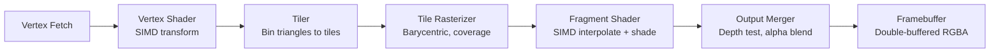

<!--
  ▄▄   ▄▄▄                      ▄▄                        ▄▄                     
  ██  ██▀                       ██                        ██                     
  ▄▄▄█  ██▄██      ▄█████▄  ████████  ██ ▄██▀    ▄█████▄   ▄███▄██   ▄████▄   █▄▄▄     
  ▄▄█▀▀▀    █████      ▀ ▄▄▄██      ▄█▀   ██▄██      ▀ ▄▄▄██  ██▀  ▀██  ██▄▄▄▄██    ▀▀▀█▄▄ 
  ▀▀█▄▄▄    ██  ██▄   ▄██▀▀▀██    ▄█▀     ██▀██▄    ▄██▀▀▀██  ██    ██  ██▀▀▀▀▀▀    ▄▄▄█▀▀ 
      ▀▀▀█  ██   ██▄  ██▄▄▄███  ▄██▄▄▄▄▄  ██  ▀█▄   ██▄▄▄███  ▀██▄▄███  ▀██▄▄▄▄█  █▀▀▀     
           ▀▀    ▀▀   ▀▀▀▀ ▀▀  ▀▀▀▀▀▀▀▀  ▀▀   ▀▀▀   ▀▀▀▀ ▀▀    ▀▀▀ ▀▀    ▀▀▀▀▀
  Lois-Kleinner & 0-1.gg 2026 — Kazkade Zero-Copy Compute Runtime
-->

# Software Rasterizer — CPU Tile-Based Renderer

Kazkade's software rasterizer is a SIMD-accelerated, tile-based CPU renderer targeting the installer's live 3D cube visualisation and diagnostic overlays. It operates entirely on the CPU with no GPU dependency, making it suitable for headless servers, early boot, and constrained environments.

## Pipeline Stages



### 1. Vertex Fetch & Shader

Vertices are provided as an interleaved array of `[x, y, z, w]` packed in AoS layout. The vertex shader applies a 4×4 model-view-projection matrix using SIMD dot products:

```rust
fn vertex_shader_simd(verts: &[[f32; 4]], mvp: &[[f32; 4]; 4]) -> Vec<[f32; 4]> {
    // AVX2: 8 vertices per iteration via 8×4 matrix-vector
    // NEON: 4 vertices via FMLA
}
```

### 2. Tiler (Bin to Tiles)

The screen is divided into 32×32 pixel tiles. Each triangle is clipped to the viewport, then the tiler computes which tiles it touches using a bounding-box scan. Tile lists are stored per-tile in a flat array of triangle indices, avoiding dynamic allocation per frame.

### 3. Tile Rasterizer

Each tile is processed independently — trivially parallelisable with a thread pool. For every triangle in the tile's list:

- **Barycentric coordinates** are computed for each pixel using edge functions.
- **Early‑Z culling** discards occluded fragments before shading.
- **Coverage masks** are computed in 8×8 sub-blocks using SIMD compare instructions.

The rasterizer emits fragments as a struct-of-arrays: `{x, y, z, w, u, v, coverage}`.

### 4. Fragment Shader

Fragment shading applies interpolated vertex attributes (colour, normals, texture coordinates) using SIMD `vfmadd` for perspective-correct interpolation. Simple Blinn-Phong lighting is computed in the shader with no branching — all control flow is predicated via blend masks.

### 5. Output Merger

The output merger performs depth testing (`<` by default) and alpha blending on the 32‑bpp RGBA framebuffer. The depth buffer is stored as `f32` for precision.

## Double-Buffered Framebuffer

The framebuffer is a pair of `Vec<u32>` of size `width × height`. At any time, one buffer is being rendered into and the other is being displayed (via `winit` raw window handle or file dump). Swap is a pointer swap — no copy.

```rust
pub struct Framebuffer {
    front: Vec<u32>,
    back: Vec<u32>,
    width: u32,
    height: u32,
}

impl Framebuffer {
    pub fn swap(&mut self) {
        std::mem::swap(&mut self.front, &mut self.back);
    }
}
```

## Parallelism

Tile rasterisation is dispatched to a `rayon` thread pool. Each thread processes one or more tiles independently, writing only to its assigned tile region. The output merger in a separate pass resolves the back buffer — no locks are needed because tiles do not overlap.

## Performance

On a Ryzen 9 7950X (16 cores), the rasterizer sustains 60 FPS at 1920×1080 for a 10K‑triangle scene with Blinn-Phong shading. The tile-based design keeps each thread's working set in L2 cache.

---
*Lois-Kleinner & 0-1.gg 2026 — Kazkade Zero-Copy Compute Runtime*

```
.====================================================================.
!  Made in the UAE, Dubai #DubaiIt #Dubai #Dxb #SovereignAI          !
!  Made in The Emirates #Dubai_it                                    !
!                                                                    !
!  Lois-Kleinner Alpasan - The Anticloud 2026-                       !
!                                                                    !
!  As seen on:                                                       !
!  Harvard Dataverse ! Zenodo/CERN ! Academia.edu ! HuggingFace      !
!  anticloud.telepedia.net ! anticloud.fandom.com                    !
!                                                                    !
!  0-1.gg ! GitHub ! LinkedIn ! DEV ! GH Pages                       !
!  HuggingFace ! Blog ! Bluesky ! Mastodon                           !
!  Internet Archive ! ORCID ! Figshare                               !
!                                                                    !
!  Sovereign AI ! Local-First ! Privacy ! Zero Trust ! No Datacenter !
!  Air-Gapped ! Open Source ! Rust ! Hash Chain ! Single Binary      !
!  Offline LLM ! Crypto Ledger ! P2P ! Federated                     !
'===================================================================='
```

Lois-Kleinner Alpasan, 22, builds sovereign AI infrastructure and cryptographic audit systems. His work spans formats, proptech, and research platforms serving projects valued at over $1B combined, operating at the intersection of AI, media, and decentralized technology.

References:
1. Lois-Kleinner Zenodo: https://doi.org/10.5281/zenodo.20781790
2. Lois-Kleinner GitHub: https://github.com/kleinnner/Anticloud/tree/main/04-aioss-format
3. Lois-Kleinner Harvard DV: https://doi.org/10.7910/DVN/FSHFZF
4. Lois-Kleinner Internet Arc: https://archive.org/details/aioss-format
5. Lois-Kleinner ORCID: https://orcid.org/0009-0009-2233-6107
6. Lois-Kleinner DEV.to: https://dev.to/kleinner
7. Lois-Kleinner LinkedIn: https://linkedin.com/in/kleinner
8. Lois-Kleinner HuggingFace: https://huggingface.co/Anticloud
9. Lois-Kleinner Tumblr: https://anticloud.tumblr.com
10. Lois-Kleinner Mastodon: https://mastodon.social/@kleinner
11. Lois-Kleinner Bluesky: https://bsky.app/profile/kleinner.bsky.social
12. 0-1.gg: https://0-1.gg
13. Lois-Kleinner Figshare: https://figshare.com/authors/Lois-Kleinner_Alpasan/20849885
14. Lois-Kleinner Academia: https://independent.academia.edu/kleinner
15. Lois-Kleinner Telepedia: https://anticloud.telepedia.net/wiki/Anticloud_by_Lois-Kleinner_Wiki
16. Lois-Kleinner Fandom: https://anticloud.fandom.com