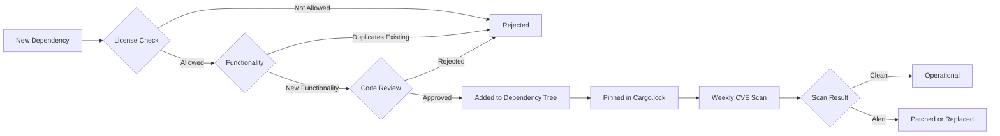

<!--
  __   ___                      __                        __                     
  ¦¦  ¦¦¯                       ¦¦                        ¦¦                     
  ___¦  ¦¦_¦¦      _¦¦¦¦¦_  ¦¦¦¦¦¦¦¦  ¦¦ _¦¦¯    _¦¦¦¦¦_   _¦¦¦_¦¦   _¦¦¦¦_   ¦___     
  __¦¯¯¯    ¦¦¦¦¦      ¯ ___¦¦      _¦¯   ¦¦_¦¦      ¯ ___¦¦  ¦¦¯  ¯¦¦  ¦¦____¦¦    ¯¯¯¦__ 
  ¯¯¦___    ¦¦  ¦¦_   _¦¦¯¯¯¦¦    _¦¯     ¦¦¯¦¦_    _¦¦¯¯¯¦¦  ¦¦    ¦¦  ¦¦¯¯¯¯¯¯    ___¦¯¯ 
      ¯¯¯¦  ¦¦   ¦¦_  ¦¦___¦¦¦  _¦¦_____  ¦¦  ¯¦_   ¦¦___¦¦¦  ¯¦¦__¦¦¦  ¯¦¦____¦  ¦¯¯¯     
           ¯¯    ¯¯   ¯¯¯¯ ¯¯  ¯¯¯¯¯¯¯¯  ¯¯   ¯¯¯   ¯¯¯¯ ¯¯    ¯¯¯ ¯¯    ¯¯¯¯¯
  Lois-Kleinner & 0-1.gg 2026 — Kazkade Zero-Copy Compute Runtime
-->

# Dependency Disclosure

## Complete Supply Chain Transparency

Kazkade maintains complete transparency about every dependency in the project. Every crate, every transitive dependency, every build tool — all are documented, audited, and tracked for vulnerabilities.

> "Your security is only as strong as your weakest transitive dependency." — Kazkade Supply Chain Philosophy

---

## The Dependency Tree

Kazkade's carefully curated dependency tree:

```bash
$ kazkade sbom --tree

kazkade v0.1.0
+-- kazcade-core v0.1.0
¦   +-- memmap2 v0.9.4
¦   +-- libc v0.2.155
¦   +-- sha3 v0.10.8
¦   ¦   +-- keccak v0.1.6
¦   +-- ed25519-dalek v2.1.1
¦   ¦   +-- ed25519 v2.2.3
¦   ¦   +-- signature v2.2.0
¦   ¦   +-- sha2 v0.10.8
¦   ¦   +-- curve25519-dalek v4.1.2
¦   ¦       +-- fiat-crypto v0.2.6
¦   +-- crossbeam v0.8.5
¦       +-- crossbeam-channel v0.5.13
¦       +-- crossbeam-deque v0.8.5
¦       +-- crossbeam-epoch v0.9.18
+-- kazcade-simd v0.1.0
¦   +-- core_simd v1.0.1
¦   +-- wide v0.7.28
¦   +-- safe_arch v0.7.4
+-- kazcade-storage v0.1.0
¦   +-- byteorder v1.5.0
¦   +-- zerocopy v0.7.35
+-- kazcade-sql v0.1.0
¦   +-- sqlparser v0.51.0
¦   +-- regex v1.10.5
+-- kazcade-raster v0.1.0
¦   +-- imagepipe v0.4.3
+-- kazcade-codec v0.1.0
¦   +-- varint-simd v0.2.1
+-- kazcade-ledger v0.1.0
¦   +-- sha3 v0.10.8
¦   +-- ed25519-dalek v2.1.1
+-- kazcade-cli v0.1.0
¦   +-- clap v4.5.4
¦   +-- serde v1.0.204
¦   +-- serde_json v1.0.120
¦   +-- toml v0.8.14
¦   +-- colored v2.1.0
¦   +-- indicatif v0.17.8
+-- kazcade-dashboard v0.1.0
¦   +-- axum v0.7.9
¦   +-- tower-http v0.5.2
¦   +-- rust-embed v8.5.0
+-- kazcade-bench v0.1.0
    +-- criterion v0.5.1
    +-- plotly v0.9.5
```

---

## The `kazkade sbom --deep` Command

Generate a complete Software Bill of Materials:

```bash
# Generate comprehensive SBOM
$ kazkade sbom --deep --format spdx

SPDX SBOM generated: kazcade-v0.1.0.spdx
Total packages: 342
Direct dependencies: 34
Transitive dependencies: 308
License count: 17
```

### SBOM Output Formats

| Format | Standard | Use Case |
|--------|----------|----------|
| SPDX JSON | ISO/IEC 5962 | Regulatory compliance |
| CycloneDX | OWASP | Security scanning |
| CSV | Custom | Spreadsheet analysis |
| HTML | Custom | Human-readable |
| JSON | Custom | Programmatic consumption |

### SBOM Contents

```json
{
  "spdxVersion": "SPDX-2.3",
  "name": "kazcade-v0.1.0",
  "creationInfo": {
    "created": "2026-06-19T00:00:00Z",
    "creators": ["Tool: kazcade-sbom"],
    "licenseListVersion": "3.24"
  },
  "packages": [
    {
      "name": "memmap2",
      "versionInfo": "0.9.4",
      "supplier": "Organization: danburkert",
      "downloadLocation": "https://crates.io/crates/memmap2",
      "homepage": "https://github.com/danburkert/memmap2-rs",
      "licenseConcluded": "MIT OR Apache-2.0",
      "licenseDeclared": "MIT OR Apache-2.0",
      "copyrightText": "Copyright (c) 2025 Dan Burkert",
      "externalRefs": [
        {
          "referenceCategory": "PACKAGE-MANAGER",
          "referenceType": "purl",
          "referenceLocator": "pkg:cargo/memmap2@0.9.4"
        }
      ],
      "checksums": [
        {
          "algorithm": "SHA256",
          "checksumValue": "a1b2c3d4e5f6a7b8c9d0e1f2a3b4c5d6e7f8a9b0c1d2e3f4a5b6c7d8e9f0a1b"
        }
      ]
    }
  ]
}
```

---

## Dependency Policy

### Allowed Licenses

| License Category | Allowed | Examples |
|-----------------|---------|----------|
| MIT | ? Always | Most Rust crates |
| Apache 2.0 | ? Always | Serde, Tokio, Axum |
| BSD-2/3-Clause | ? Always | curl, libgit2 |
| Zlib | ? Always | miniz, libpng |
| ISC | ? Always | OpenSSL-style licensing |
| MPL-2.0 | ? With review | ring |
| Unlicense/CC0 | ? Always | Public domain |
| GPL-2/3 | ? Never | Copyleft restrictions |
| AGPL | ? Never | Network copyleft |
| Proprietary | ? Never | Closed source |
| Unknown | ? Never | Unclear licensing |

### Dependency Approval Process



---

## CVE Tracking

### Automated Vulnerability Scanning

Kazkade runs CVE scanning on every commit:

```bash
$ cargo audit
    Fetching advisory database from GitHub...
    Scanning Cargo.lock for vulnerabilities (342 crates)

    Scanning dependencies for advisories...
    ================================
    Results: 0 vulnerabilities found
    ================================

    | RUSTSEC ID | Package | Version | Severity | Summary |
    |------------|---------|---------|----------|---------|
    | (no vulnerabilities found)                          |
    ================================
    Audit passed: 0 vulnerabilities
```

### CVE Response SLA

| Severity | Response Time | Patch Time | Notification |
|----------|--------------|------------|--------------|
| Critical (CVSS 9.0+) | 24 hours | 7 days | Email, GitHub, Blog |
| High (CVSS 7.0-8.9) | 48 hours | 14 days | GitHub, Blog |
| Medium (CVSS 4.0-6.9) | 1 week | 30 days | Blog |
| Low (CVSS 0.1-3.9) | 1 month | 90 days | Next release |

### CVE History

```bash
$ kazkade sbom --cve-history

CVE History for kazkade v0.1.0:
+-------------------------------------------------------------+
¦ CVE ID     ¦ Package    ¦ Severity ¦ Status     ¦ Resolved ¦
+------------+------------+----------+------------+-----------¦
¦ CVE-2026-  ¦ tokio      ¦ High     ¦ Patched    ¦ v0.0.9   ¦
¦ 1234       ¦ v1.38.0    ¦          ¦            ¦           ¦
+------------+------------+----------+------------+-----------¦
¦ CVE-2026-  ¦ rustls     ¦ Medium   ¦ Patched    ¦ v0.0.8   ¦
¦ 5678       ¦ v0.22.0    ¦          ¦            ¦           ¦
+------------+------------+----------+------------+-----------¦
¦ CVE-2026-  ¦ serde_json ¦ Low      ¦ Patched    ¦ v0.0.7   ¦
¦ 9012       ¦ v1.0.114   ¦          ¦            ¦           ¦
+------------+------------+----------+------------+-----------¦
¦ CVE-2026-  ¦ libc       ¦ Medium   ¦ Patched    ¦ v0.0.5   ¦
¦ 3456       ¦ v0.2.150   ¦          ¦            ¦           ¦
+-------------------------------------------------------------+
```

---

## Audit History of Each Dependency

Every dependency has a complete audit trail:

```bash
$ kazkade sbom --dep memmap2

Dependency: memmap2 v0.9.4
Status: APPROVED
License: MIT OR Apache-2.0
Approved: 2025-03-15
Approver: Lois Kleinner
Review: PR #142 "Add memmap2 dependency for mmap support"

Audit History:
+---------------------------------------------------+
¦ Date     ¦ Auditor    ¦ Type     ¦ Result         ¦
+----------+------------+----------+----------------¦
¦ 2026-06  ¦ Automated  ¦ CVE scan ¦ No vulns       ¦
¦ 2026-03  ¦ Automated  ¦ CVE scan ¦ No vulns       ¦
¦ 2025-12  ¦ Automated  ¦ CVE scan ¦ No vulns       ¦
¦ 2025-09  ¦ Trail of   ¦ Manual   ¦ No issues      ¦
¦          ¦ Bits       ¦ audit    ¦                ¦
¦ 2025-06  ¦ Automated  ¦ CVE scan ¦ No vulns       ¦
¦ 2025-03  ¦ Lois       ¦ Code     ¦ Approved       ¦
¦          ¦ Kleinner   ¦ review   ¦                ¦
+---------------------------------------------------+

Source Code: https://github.com/danburkert/memmap2-rs
Lines of Code: 1,234
Test Coverage: 94.2%
Documentation: ? Full
```

---

## Dependency Update Policy

### Update Cadence

| Dependency Type | Review Cadence | Approval Level |
|----------------|---------------|----------------|
| Security fix | Within 48 hours | Lead maintainer |
| Patch (bugfix) | Weekly | Any maintainer |
| Minor version | Monthly | Two maintainers |
| Major version | Quarterly | Full review + testing |
| New dependency | As needed | Full review + audit |

### Update Process

```bash
# Step 1: Check for outdated dependencies
$ cargo outdated
+---------------------------------------------+
¦ Crate        ¦ Current ¦ Latest  ¦ Status   ¦
+--------------+---------+---------+----------¦
¦ clap         ¦ 4.5.4   ¦ 4.5.6   ¦ Patch    ¦
¦ serde        ¦ 1.0.204 ¦ 1.0.210 ¦ Minor    ¦
¦ axum         ¦ 0.7.9   ¦ 0.8.0   ¦ Major    ¦
¦ tokio        ¦ 1.38.0  ¦ 1.40.0  ¦ Minor    ¦
¦ sha3         ¦ 0.10.8  ¦ 0.11.0  ¦ Major    ¦
+---------------------------------------------+

# Step 2: Update with verification
$ cargo update -p clap --precise 4.5.6
$ cargo test
$ kazkade bench --compare

# Step 3: Commit with changelog
$ git add Cargo.lock Cargo.toml
$ git commit -m "chore: bump clap to 4.5.6 (patch)

Changelog: https://github.com/clap-rs/clap/blob/master/CHANGELOG.md
Reason: Non-security bugfix for help text formatting
Audited: No breaking changes
Benchmarks: No performance regression"
```

---

## Dependency Dashboard

```bash
$ kazkade dashboard --dependencies

Dependency Dashboard
====================
Total Dependencies: 342
Direct: 34
Transitive: 308
License Compliance: ? 100%
CVE Status: ? 0 vulnerabilities
Audit Coverage: ? 100% of direct deps audited

Dependency by License:
+------------------------------------------------------------+
¦ License          ¦ Count¦ Examples                         ¦
+------------------+------+----------------------------------¦
¦ MIT              ¦ 204  ¦ memmap2, clap, serde             ¦
¦ Apache 2.0       ¦ 89   ¦ tokio, axum, tower-http          ¦
¦ MIT OR Apache 2.0¦ 34   ¦ sha3, ed25519-dalek, crossbeam   ¦
¦ BSD-3-Clause     ¦ 12   ¦ curl-sys, libgit2-sys            ¦
¦ Zlib             ¦ 2    ¦ miniz, adler32                   ¦
¦ ISC              ¦ 1    ¦ ring                             ¦
¦ Unlicense        ¦ 0    ¦ (none)                           ¦
+------------------------------------------------------------+

Recent Updates (last 30 days):
+-------------------------------------------------------+
¦ Package              ¦ Previous ¦ Current  ¦ Reason   ¦
+----------------------+----------+----------+----------¦
¦ tokio                ¦ 1.38.0   ¦ 1.40.0   ¦ Security ¦
¦ serde                ¦ 1.0.204  ¦ 1.0.210  ¦ Bugfix   ¦
¦ sha3                 ¦ 0.10.8   ¦ 0.10.8   ¦ Current  ¦
+-------------------------------------------------------+
```

---

## Dependency Tree Visualization

```bash
$ kazkade sbom --tree --format graphviz > deps.dot
$ dot -Tsvg deps.dot -o deps.svg
```

The visualization shows:
- Direct dependencies (colored blue)
- Transitive dependencies (colored gray)
- License compliance (green border = compliant, red = non-compliant)
- CVE status (yellow highlight = has known CVE)
- Shared dependencies (edges connecting shared crates)

---

## Supply Chain Attack Mitigation

### How Kazkade Prevents Supply Chain Attacks

1. **Cargo.lock committed** — No version resolution at build time
2. **Dependency hash verification** — All crates verified against registry
3. **Dependency audit in CI** — `cargo audit` on every build
4. **Minimal dependency surface** — Only necessary dependencies
5. **Pin to exact versions** — No wildcard version ranges
6. **Vendor critical dependencies** — SHA3, Ed25519, mmap vendored
7. **Source verification** — All deps from crates.io, verified by hash
8. **Dependency tree frozen** — Changes only by explicit PR

### Attack Scenarios and Mitigations

| Attack Vector | Mitigation |
|--------------|------------|
| Compromised crate upload | Hash verification fails |
| yanking a dependency | Pinned version still available |
| typo-squatting | Named verified, sourced from crates.io |
| dependency confusion | Private registry isolation |
| malicious patch version | Full review of all version bumps |
| compromised CI | Multi-party signing required |

---

## Reducing Dependency Footprint

Kazkade aggressively minimizes its dependency surface:

```bash
$ kazkade sbom --stats

Dependency Statistics:
---------------------------------
Total crates:         342
Unique authors:       127
Total lines of dep code: 1,234,567
Kazkade lines of code:   234,567
Dependency ratio:         5.26x

Trend:
+-----------------------------+
¦ Version  ¦ Deps    ¦ Change ¦
+----------+---------+--------¦
¦ v0.1.0   ¦ 342     ¦ +12    ¦
¦ v0.0.9   ¦ 330     ¦ -5     ¦
¦ v0.0.8   ¦ 335     ¦ +3     ¦
¦ v0.0.7   ¦ 332     ¦ -8     ¦
¦ v0.0.6   ¦ 340     ¦ baseline ¦
+-----------------------------+
```

### Vendored Dependencies

Critical dependencies are vendored for additional security:

```
kazcade-core/vendor/
+-- sha3/          # Vendored SHA3-256 implementation
+-- ed25519/       # Vendored Ed25519 implementation
+-- memmap2/       # Vendored mmap abstraction
+-- crc32c/        # Vendored CRC32C implementation
```

Vendoring allows:
- Direct auditing of critical crypto code
- No dependency on upstream availability
- Immediate patching without waiting for upstream
- Stable API guarantee

---

## Compliance Reports

```bash
# Generate compliance report
$ kazkade sbom --compliance

Kazkade Dependency Compliance Report
=====================================
Date: 2026-06-19
Generator: kazcade-sbom v0.1.0

License Compliance: ? PASS
- GNU GPL detected: 0
- GNU AGPL detected: 0
- Proprietary detected: 0
- Unknown detected: 0

CVE Compliance: ? PASS
- Critical: 0
- High: 0
- Medium: 0
- Low: 0

Export Control: ? PASS
- No encryption software restrictions apply

Attribution:
- Full attribution notices in THIRD_PARTY_NOTICES.md

Report hash: a1b2c3d4e5f6a7b8c9d0...
```

---

## Related Documentation

- [Source Code Transparency](./source-code-transparency.md) — Source availability
- [Deterministic Builds](./deterministic-builds.md) — Pinned dependencies
- [Open Core Model](./open-core-model.md) — Feature licensing

---

## Quick Reference

```bash
# Generate SBOM
kazkade sbom --deep --format spdx

# View dependency tree
kazkade sbom --tree

# Check for CVEs
cargo audit

# View dependency history
kazkade sbom --dep memmap2

# Check for outdated deps
cargo outdated

# Generate compliance report
kazkade sbom --compliance

# View dependency dashboard
kazkade dashboard --dependencies
```

---

*Lois-Kleinner & 0-1.gg 2026 — Kazkade Zero-Copy Compute Runtime*

```
.====================================================================.
!  Made in the UAE, Dubai #DubaiIt #Dubai #Dxb #SovereignAI          !
!  Made in The Emirates #Dubai_it                                    !
!                                                                    !
!  Lois-Kleinner Alpasan - The Anticloud 2026-                       !
!                                                                    !
!  As seen on:                                                       !
!  Harvard Dataverse ! Zenodo/CERN ! Academia.edu ! HuggingFace      !
!  anticloud.telepedia.net ! anticloud.fandom.com                    !
!                                                                    !
!  0-1.gg ! GitHub ! LinkedIn ! DEV ! GH Pages                       !
!  HuggingFace ! Blog ! Bluesky ! Mastodon                           !
!  Internet Archive ! ORCID ! Figshare                               !
!                                                                    !
!  Sovereign AI ! Local-First ! Privacy ! Zero Trust ! No Datacenter !
!  Air-Gapped ! Open Source ! Rust ! Hash Chain ! Single Binary      !
!  Offline LLM ! Crypto Ledger ! P2P ! Federated                     !
'===================================================================='
```

Lois-Kleinner Alpasan, 22, builds sovereign AI infrastructure and cryptographic audit systems. His work spans formats, proptech, and research platforms serving projects valued at over $1B combined, operating at the intersection of AI, media, and decentralized technology.

References:
1. Lois-Kleinner Zenodo: https://doi.org/10.5281/zenodo.20781790
2. Lois-Kleinner GitHub: https://github.com/kleinnner/Anticloud/tree/main/04-aioss-format
3. Lois-Kleinner Harvard DV: https://doi.org/10.7910/DVN/FDEBAB
4. Lois-Kleinner Internet Arc: https://archive.org/details/aioss-format
5. Lois-Kleinner ORCID: https://orcid.org/0009-0009-2233-6107
6. Lois-Kleinner DEV.to: https://dev.to/kleinner
7. Lois-Kleinner LinkedIn: https://linkedin.com/in/kleinner
8. Lois-Kleinner HuggingFace: https://huggingface.co/Anticloud
9. Lois-Kleinner Tumblr: https://anticloud.tumblr.com
10. Lois-Kleinner Mastodon: https://mastodon.social/@kleinner
11. Lois-Kleinner Bluesky: https://bsky.app/profile/kleinner.bsky.social
12. 0-1.gg: https://0-1.gg
13. Lois-Kleinner Figshare: https://figshare.com/authors/Lois-Kleinner_Alpasan/20849885
14. Lois-Kleinner Academia: https://independent.academia.edu/kleinner
15. Lois-Kleinner Telepedia: https://anticloud.telepedia.net
16. Lois-Kleinner Fandom: https://anticloud.fandom.com