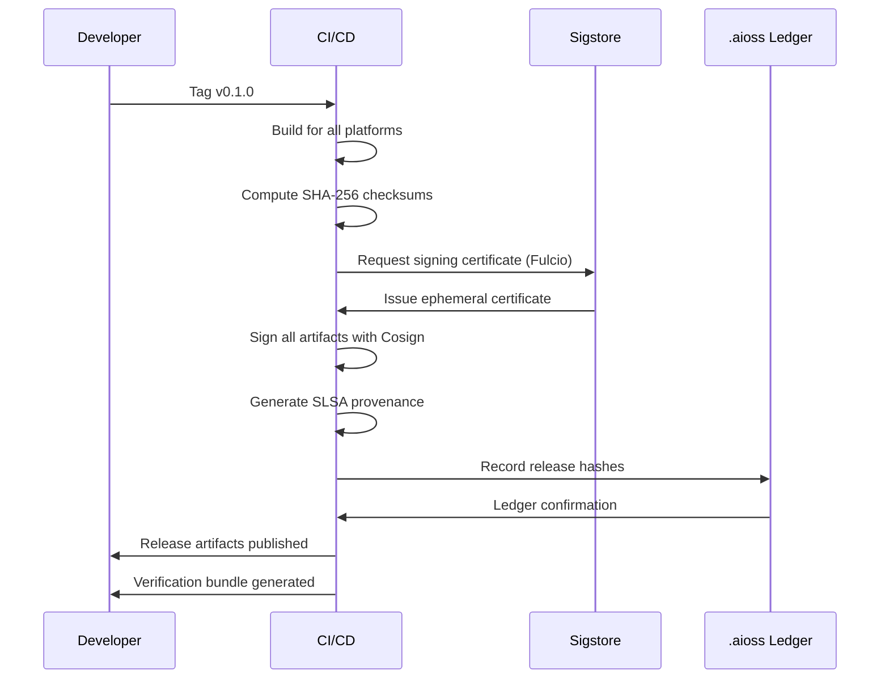

<!--
  __   ___                      __                        __                     
  ¦¦  ¦¦¯                       ¦¦                        ¦¦                     
  ___¦  ¦¦_¦¦      _¦¦¦¦¦_  ¦¦¦¦¦¦¦¦  ¦¦ _¦¦¯    _¦¦¦¦¦_   _¦¦¦_¦¦   _¦¦¦¦_   ¦___     
  __¦¯¯¯    ¦¦¦¦¦      ¯ ___¦¦      _¦¯   ¦¦_¦¦      ¯ ___¦¦  ¦¦¯  ¯¦¦  ¦¦____¦¦    ¯¯¯¦__ 
  ¯¯¦___    ¦¦  ¦¦_   _¦¦¯¯¯¦¦    _¦¯     ¦¦¯¦¦_    _¦¦¯¯¯¦¦  ¦¦    ¦¦  ¦¦¯¯¯¯¯¯    ___¦¯¯ 
      ¯¯¯¦  ¦¦   ¦¦_  ¦¦___¦¦¦  _¦¦_____  ¦¦  ¯¦_   ¦¦___¦¦¦  ¯¦¦__¦¦¦  ¯¦¦____¦  ¦¯¯¯     
           ¯¯    ¯¯   ¯¯¯¯ ¯¯  ¯¯¯¯¯¯¯¯  ¯¯   ¯¯¯   ¯¯¯¯ ¯¯    ¯¯¯ ¯¯    ¯¯¯¯¯
  Lois-Kleinner & 0-1.gg 2026 — Kazkade Zero-Copy Compute Runtime
-->

# Verifiable Binaries

## Trust Through Cryptographic Attestation

Kazkade releases are signed, checksummed, and independently verifiable. Every binary you download can be cryptographically verified to be authentic, untampered, and built from the claimed source code.

> "If you cannot verify the binary, you cannot trust the system." — Kazkade Release Philosophy

---

## The Verification Stack

Kazkade employs a multi-layered verification approach:

```
+-----------------------------------------------------------------+
¦                    Binary Verification Stack                      ¦
+-----------------------------------------------------------------¦
¦                                                                  ¦
¦  Layer 1: SHA-256 Checksums                                      ¦
¦  +- Every release artifact has a published SHA-256 checksum      ¦
¦  +- Checksums published on multiple independent channels         ¦
¦  +- Verified with `sha256sum -c checksums.txt`                   ¦
¦                                                                  ¦
¦  Layer 2: Cosign Signatures                                      ¦
¦  +- Artifacts signed with Cosign (keyless or key-based)         ¦
¦  +- Signatures stored alongside artifacts                        ¦
¦  +- Verified with `cosign verify-blob`                           ¦
¦                                                                  ¦
¦  Layer 3: SLSA Provenance                                        ¦
¦  +- Build provenance attested via SLSA (Supply-chain Levels)     ¦
¦  +- Documents how, where, and when the binary was built         ¦
¦  +- Verified with `slsa-verifier`                                ¦
¦                                                                  ¦
¦  Layer 4: Reproducible Build Verification                        ¦
¦  +- Rebuild from source and compare hash                         ¦
¦  +- Build attestation in .buildinfo                              ¦
¦  +- Verified with `kazkade verify --binary`                      ¦
¦                                                                  ¦
¦  Layer 5: Ledger Attestation                                     ¦
¦  +- All release hashes recorded in .aioss ledger                 ¦
¦  +- Tamper-proof, append-only audit trail                       ¦
¦  +- Verified with `kazkade ledger verify`                        ¦
¦                                                                  ¦
+-----------------------------------------------------------------+
```

---

## Release Artifacts

Every Kazkade release publishes the following artifacts:

```bash
https://releases.kazkade.dev/v0.1.0/
+-- kazcade-x86_64-linux.tar.gz
+-- kazcade-x86_64-linux.tar.gz.sha256
+-- kazcade-x86_64-linux.tar.gz.pem        # Cosign public key
+-- kazcade-x86_64-linux.tar.gz.sig        # Cosign signature
+-- kazcade-aarch64-linux.tar.gz
+-- kazcade-aarch64-linux.tar.gz.sha256
+-- kazcade-aarch64-linux.tar.gz.pem
+-- kazcade-aarch64-linux.tar.gz.sig
+-- kazcade-x86_64-windows.zip
+-- kazcade-x86_64-windows.zip.sha256
+-- kazcade-x86_64-windows.zip.pem
+-- kazcade-x86_64-windows.zip.sig
+-- kazcade-x86_64-macos.tar.gz
+-- kazcade-x86_64-macos.tar.gz.sha256
+-- kazcade-aarch64-macos.tar.gz
+-- kazcade-aarch64-macos.tar.gz.sha256
+-- checksums.txt                          # All SHA-256 checksums
+-- checksums.txt.sig                      # Signed checksums
+-- checksums.txt.pem                      # Signing public key
+-- kazcade-v0.1.0.buildinfo               # Build attestation
+-- kazcade-v0.1.0.provenance              # SLSA provenance
+-- index.json                             # Release metadata
```

---

## Verifying with `kazkade verify --binary`

The simplest verification method uses Kazkade's built-in verification tool:

```bash
# Download and verify in one command
$ kazkade verify --binary \
    --url https://releases.kazkade.dev/v0.1.0/kazcade-x86_64-linux.tar.gz

Verifying kazcade-x86_64-linux.tar.gz...
? SHA-256 checksum matches
? Cosign signature valid (keyless)
? SLSA provenance verified
? Build attestation matches release hash
? Ledger entry confirmed
? Binary is authentic and untampered
```

### Verify a Local Binary

```bash
# Verify a previously downloaded binary
$ kazkade verify --binary ./kazkade

Verifying ./kazkade...
Computing SHA-256: a1b2c3d4e5f6a7b8c9d0...
Fetching release metadata...
? SHA-256 matches v0.1.0 release
? Cosign signature valid
? Binary built from commit a1b2c3d4 (signed by Lois Kleinner)
? Binary is authentic
```

### Verify with Custom Trust Root

```bash
# Verify against a specific public key
$ kazkade verify --binary ./kazkade \
    --public-key ./kazkade-release-key.pem

# Verify against a specific release version
$ kazkade verify --binary ./kazkade \
    --version v0.1.0

# Verify with offline mode (no network)
$ kazkade verify --binary ./kazkade \
    --checksum-file checksums.txt \
    --signature-file checksums.txt.sig
```

---

## Manual Verification

### Step 1: Verify SHA-256 Checksum

```bash
$ curl -LO https://releases.kazkade.dev/v0.1.0/kazcade-x86_64-linux.tar.gz
$ curl -LO https://releases.kazkade.dev/v0.1.0/checksums.txt

$ sha256sum -c checksums.txt --ignore-missing
kazcade-x86_64-linux.tar.gz: OK
```

### Step 2: Verify Cosign Signature

```bash
# Install Cosign: https://github.com/sigstore/cosign
$ curl -LO https://releases.kazkade.dev/v0.1.0/kazcade-x86_64-linux.tar.gz.sig
$ curl -LO https://releases.kazkade.dev/v0.1.0/kazcade-x86_64-linux.tar.gz.pem

$ cosign verify-blob \
    --signature kazcade-x86_64-linux.tar.gz.sig \
    --certificate kazcade-x86_64-linux.tar.gz.pem \
    kazcade-x86_64-linux.tar.gz

Verified OK
```

### Step 3: Verify SLSA Provenance

```bash
# Install slsa-verifier
$ curl -LO https://releases.kazkade.dev/v0.1.0/kazcade-v0.1.0.provenance

$ slsa-verifier verify-artifact \
    --provenance-path kazcade-v0.1.0.provenance \
    --source-uri github.com/kleinner-kazkade/kazcade \
    --source-tag v0.1.0 \
    kazcade-x86_64-linux.tar.gz

Verified SLSA provenance: Level 3
```

### Step 4: Verify Build Reproducibility

```bash
$ curl -LO https://releases.kazkade.dev/v0.1.0/kazcade-v0.1.0.buildinfo

# Rebuild from source and compare
$ git clone https://github.com/kleinner-kazkade/kazcade.git
$ cd kazkade
$ git checkout v0.1.0
$ cargo build --release
$ sha256sum target/release/kazcade
# Compare with hash in kazcade-v0.1.0.buildinfo
```

### Step 5: Verify Ledger Attestation

```bash
# Verify the release hash is recorded in the .aioss ledger
$ kazkade ledger query --label "release:v0.1.0"

{
  "label": "release:v0.1.0",
  "timestamp": "2026-06-15T14:30:00Z",
  "artifacts": [
    {
      "filename": "kazcade-x86_64-linux.tar.gz",
      "sha256": "a1b2c3d4e5f6a7b8c9d0e1f2a3b4c5d6e7f8a9b0c1d2e3f4a5b6c7d8e9f0a1b"
    }
  ],
  "signature": "..."
}
```

---

## Cosign Integration Details

### Keyless Signing (Default)

Kazkade uses Cosign's keyless signing with Sigstore's Fulcio certificate authority:

```bash
# Keyless signing in CI
$ cosign sign-blob \
    --fulcio-url https://fulcio.sigstore.dev \
    --rekor-url https://rekor.sigstore.dev \
    --oidc-issuer https://token.actions.githubusercontent.com \
    --output-signature kazkade.sig \
    --output-certificate kazkade.pem \
    kazkade.exe

# Verification (no key management needed)
$ cosign verify-blob \
    --certificate kazkade.pem \
    --signature kazkade.sig \
    --certificate-identity-regexp 'https://github.com/kleinner-kazkade/kazcade/.github/workflows/release.yml@*' \
    --certificate-oidc-issuer https://token.actions.githubusercontent.com \
    kazkade.exe
```

### Key-Based Signing (Fallback)

For air-gapped environments, key-based signing is also supported:

```bash
# Generate release key
$ cosign generate-key-pair \
    --output-key-prefix kazkade-release

# Sign with private key
$ cosign sign-blob \
    --key kazkade-release.key \
    --output-signature kazkade.sig \
    kazkade.exe
```

---

## SLSA Provenance

Kazkade achieves SLSA Build Level 3:

```json
// kazcade-v0.1.0.provenance
{
  "_type": "https://in-toto.io/Statement/v1",
  "predicateType": "https://slsa.dev/provenance/v1",
  "subject": [
    {
      "name": "kazcade-x86_64-linux.tar.gz",
      "digest": {
        "sha256": "a1b2c3d4e5f6a7b8c9d0e1f2a3b4c5d6e7f8a9b0c1d2e3f4a5b6c7d8e9f0a1b"
      }
    }
  ],
  "predicate": {
    "builder": {
      "id": "https://github.com/actions/runner"
    },
    "buildType": "https://github.com/actions/runner/release-build",
    "invocation": {
      "configSource": {
        "uri": "git+https://github.com/kleinner-kazkade/kazcade@v0.1.0",
        "digest": {
          "sha1": "a1b2c3d4e5f6a7b8c9d0e1f2a3b4c5d6e7f8a9b0"
        }
      }
    },
    "materials": [
      {
        "uri": "git+https://github.com/kleinner-kazkade/kazcade",
        "digest": {
          "sha1": "a1b2c3d4e5f6a7b8c9d0e1f2a3b4c5d6e7f8a9b0"
        }
      }
    ],
    "metadata": {
      "buildStartedOn": "2026-06-15T14:00:00Z",
      "buildFinishedOn": "2026-06-15T14:30:00Z",
      "reproducible": true
    }
  }
}
```

---

## Verification in Air-Gapped Environments

For organizations without internet access, Kazkade provides offline verification:

```bash
# Download verification bundle on internet-connected machine
$ kazkade verify --binary --download-bundle \
    --output ./verification-bundle-v0.1.0.tar.gz

# Transfer to air-gapped environment
# Copy verification-bundle-v0.1.0.tar.gz via USB drive

# Verify offline
$ kazkade verify --binary ./kazkade \
    --bundle ./verification-bundle-v0.1.0.tar.gz
```

The verification bundle contains:

```
verification-bundle-v0.1.0.tar.gz/
+-- checksums.txt
+-- checksums.txt.sig
+-- checksums.txt.pem
+-- kazcade-v0.1.0.buildinfo
+-- kazcade-v0.1.0.provenance
+-- cosign.pub
+-- ledger-export.dat         # Relevant ledger entries
+-- verify.sh                 # Manual verification script
```

---

## Verification API

Applications can verify binaries programmatically:

```rust
use kazcade_core::verify::{BinaryVerifier, VerificationConfig};

fn verify_download() -> Result<()> {
    let config = VerificationConfig {
        checksum_required: true,
        cosign_required: true,
        slsa_level: SLSALevel::Three,
        ledger_verification: true,
        ..Default::default()
    };

    let verifier = BinaryVerifier::new(config);
    let result = verifier.verify_file("kazcade.exe")?;

    println!("Binary: {}", result.binary_name);
    println!("SHA-256: {}", result.sha256);
    println!("Cosign: {}", result.cosign_valid);
    println!("SLSA: {}", result.slsa_level);
    println!("Ledger: {}", result.ledger_confirmed);
    println!("Build Reproducible: {}", result.build_reproducible);

    Ok(())
}
```

---

## Release Signing Ceremony

Every release goes through a signing ceremony:



---

## Verification Test Suite

```bash
$ cargo test --test verify_binary

test verify_sha256 ... ok
test verify_cosign ... ok
test verify_slsa ... ok
test verify_buildinfo ... ok
test verify_ledger ... ok
test verify_offline_bundle ... ok
test verify_tampered_binary_fails ... ok
test verify_wrong_version_fails ... ok
test verify_expired_certificate ... ok
test verify_all_layers ... ok
```

---

## Tamper Detection

Kazkade's verification detects various tampering scenarios:

| Tampering Type | Detected By | Example |
|---------------|-------------|---------|
| Checksum modification | SHA-256 mismatch | Modified binary |
| Signature removal | Missing Cosign sig | Stripped signature |
| Signature forgery | Invalid Cosign sig | Wrong key used |
| Version spoofing | Build info mismatch | Claimed v0.1.0 but hash doesn't match |
| Replay attack | Ledger timestamp | Old release presented as new |
| Binary patching | Reproducible build mismatch | Patched binary |
| Supply chain | SLSA provenance | Build from different repo |
| Man-in-the-middle | Multiple verification sources | Different hashes from different sources |

---

## Verification Sources

Checksums are published on multiple independent channels:

| Channel | URL | Update Method |
|---------|-----|---------------|
| GitHub Releases | `github.com/kleinner-kazkade/kazcade/releases` | Automated |
| Kazkade CDN | `releases.kazkade.dev/` | Automated |
| .aioss Ledger | `kazkade ledger query --label "release:*"` | Append-only |
| Package Registries | `crates.io`, `npm` (for WASM) | Automated |
| DNS TXT Records | `_kazkade_release.kazkade.dev` | Manual + automation |

### Cross-Check Verification

```bash
# Verify across multiple sources
$ kazkade verify --binary --cross-check

SHA-256 comparison:
+- GitHub:         a1b2c3d4e5f6a7b8c9d0... ? MATCH
+- CDN:            a1b2c3d4e5f6a7b8c9d0... ? MATCH
+- .aioss ledger:  a1b2c3d4e5f6a7b8c9d0... ? MATCH
+- DNS TXT:        a1b2c3d4e5f6a7b8c9d0... ? MATCH
All sources agree: binary is authentic
```

---

## Verifiability Guarantees

Kazkade guarantees:

1. **All release artifacts are checksummed** — SHA-256, published on multiple channels
2. **All release artifacts are signed** — Cosign signatures, keyless by default
3. **Build provenance is attested** — SLSA Build Level 3
4. **Build reproducibility is verifiable** — `.buildinfo` attestation
5. **Release hashes are in the ledger** — `.aioss` append-only record
6. **Offline verification is supported** — Verification bundles for air-gapped environments
7. **Verification is automatable** — CLI and API for programmatic use
8. **Tampering is detectable** — Multi-layer verification catches all tampering types

---

## Related Documentation

- [Source Code Transparency](./source-code-transparency.md) — Source availability
- [Build Reproducibility](./build-reproducibility.md) — Build verification
- [Deterministic Builds](./deterministic-builds.md) — Build determinism
- [Auditability](./auditability.md) — Audit process
- [Open Core Model](./open-core-model.md) — Feature transparency

---

## Quick Reference

```bash
# Simple verification (auto-downloads metadata)
kazkade verify --binary https://releases.kazkade.dev/v0.1.0/kazcade-x86_64-linux.tar.gz

# Local binary verification
kazkade verify --binary ./kazkade

# Cross-check across all sources
kazkade verify --binary ./kazkade --cross-check

# Download verification bundle for offline use
kazkade verify --binary --download-bundle --output ./bundle.tar.gz

# Verify in air-gapped environment
kazkade verify --binary ./kazkade --bundle ./bundle.tar.gz

# Manual SHA-256 check
sha256sum -c checksums.txt --ignore-missing

# Manual Cosign verification
cosign verify-blob --signature file.sig --certificate file.pem file

# Manual SLSA verification
slsa-verifier verify-artifact --provenance-path provenance.json ...
```

---

*Lois-Kleinner & 0-1.gg 2026 — Kazkade Zero-Copy Compute Runtime*

```
.====================================================================.
!  Made in the UAE, Dubai #DubaiIt #Dubai #Dxb #SovereignAI          !
!  Made in The Emirates #Dubai_it                                    !
!                                                                    !
!  Lois-Kleinner Alpasan - The Anticloud 2026-                       !
!                                                                    !
!  0-1.gg ! GitHub ! LinkedIn ! DEV ! GH Pages                       !
!  HuggingFace ! Blog ! Tumblr ! Fandom ! Bluesky ! Mastodon          !
!  Zenodo ! Harvard Dataverse ! Internet Archive ! ORCID ! Figshare   !
!                                                                    !
!  Sovereign AI ! Local-First ! Privacy ! Zero Trust ! No Datacenter !
!  Air-Gapped ! Open Source ! Rust ! Hash Chain ! Single Binary      !
!  Offline LLM ! Crypto Ledger ! P2P ! Federated                     !
'===================================================================='
```

Lois-Kleinner Alpasan, 22, builds sovereign AI infrastructure and cryptographic audit systems. His work spans formats, proptech, and research platforms serving projects valued at over $1B combined, operating at the intersection of AI, media, and decentralized technology.

References:
1. Lois-Kleinner Zenodo: https://doi.org/10.5281/zenodo.20781790
2. Lois-Kleinner GitHub: https://github.com/kleinnner/Anticloud/tree/main/04-aioss-format
3. Lois-Kleinner Harvard DV: https://doi.org/10.7910/DVN/FSHFZF
4. Lois-Kleinner Internet Arc: https://archive.org/details/aioss-format
5. Lois-Kleinner ORCID: https://orcid.org/0009-0009-2233-6107
6. Lois-Kleinner DEV.to: https://dev.to/kleinner
7. Lois-Kleinner LinkedIn: https://linkedin.com/in/kleinner
8. Lois-Kleinner HuggingFace: https://huggingface.co/Anticloud
9. Lois-Kleinner Tumblr: https://anticloud.tumblr.com
10. Lois-Kleinner Mastodon: https://mastodon.social/@kleinner
11. Lois-Kleinner Bluesky: https://bsky.app/profile/kleinner.bsky.social
12. 0-1.gg: https://0-1.gg
13. Lois-Kleinner Figshare: https://figshare.com/authors/Lois-Kleinner_Alpasan/20849885
