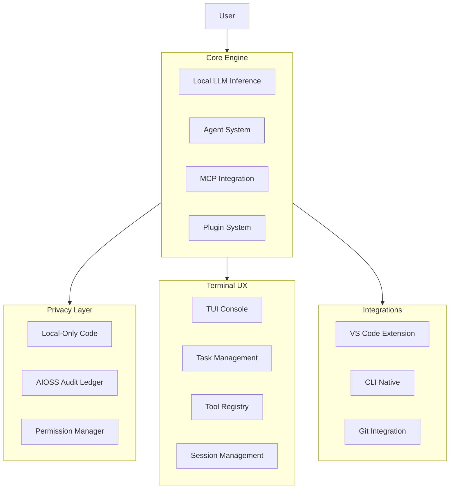

# 10 — Anticode AI Coding Engine

A terminal-native AI coding engine that runs fully locally, with all LLM inference on-device. Privacy-preserving code completion with cryptographic audit trails for all AI actions, and an optimized terminal developer experience.

## Documentation

| Category | Docs | Description |
|----------|------|-------------|
| [Research](./research/) | 4 | Papers on local LLM privacy, hash chain audit, terminal UX, OSS governance |
| [Features](./features/) | 12 | Feature documentation: core architecture through configuration |
| [Tutorials](./tutorials/) | 5 | Getting started guides |
| [No More Silicon](./no-more-silicon/) | 4 | Existing hardware, future-proof |
| [Privacy](./privacy/) | 3 | Data handling, third-party |
| [Compliance](./compliance/) | 4 | SOC2, GDPR, HIPAA, FedRAMP |
| [Data Safety](./data-safety/) | 4 | AIOSS ledger, sovereignty |
| [CSR](./csr/) | 4 | Environmental impact, sustainable AI |
| [FAQ](./faq/) | 5 | Frequently asked questions |
| [Why Use](./why-use/) | 3 | Problem statement, philosophy |
| [Help](./help/) | 5 | Error codes, MCP troubleshooting |
| [BDRs](./bdr/) | 5 | Business decision records |
| [How To Community](./how-to-use-community/) | 4 | Community usage guides |
| [How To Developers](./how-to-use-developers/) | 2 | Developer usage guides |
| [Developers](./developers/) | 6 | Developer documentation |
