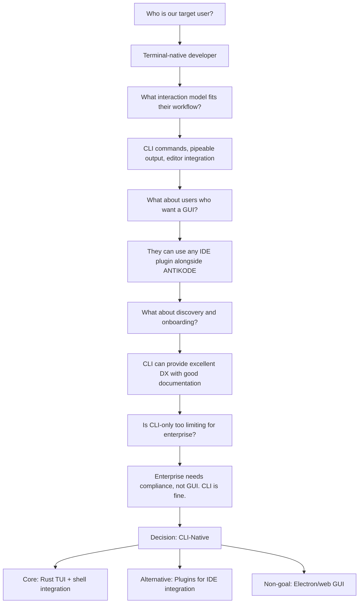

```
▄▄                            ██     ▄▄   ▄▄▄                  ▄▄           
████                ██         ▀▀     ██  ██▀                   ██           
████    ██▄████▄  ███████    ████     ██▄██      ▄████▄    ▄███▄██   ▄████▄  
██  ██   ██▀   ██    ██         ██     █████     ██▀  ▀██  ██▀  ▀██  ██▄▄▄▄██ 
██████   ██    ██    ██         ██     ██  ██▄   ██    ██  ██    ██  ██▀▀▀▀▀▀ 
▄██  ██▄  ██    ██    ██▄▄▄   ▄▄▄██▄▄▄  ██   ██▄  ▀██▄▄██▀  ▀██▄▄███  ▀██▄▄▄▄█ 
▀▀    ▀▀  ▀▀    ▀▀     ▀▀▀▀   ▀▀▀▀▀▀▀▀  ▀▀    ▀▀    ▀▀▀▀      ▀▀▀ ▀▀    ▀▀▀▀▀ 

ANTIKODE — terminal-native AI coding engine
Lois-Kleinner and 0-1.gg 2026 Copyright
```

# BDR-01: CLI-Native Architecture Decision

## Status: Accepted

## Context

ANTIKODE exists to serve developers who work primarily in the terminal environment. However, the dominant paradigm for AI coding tools is the IDE plugin or, increasingly, the forked-IDE approach (Cursor). The decision to build ANTIKODE as a CLI-native tool rather than an Electron app, web IDE, or IDE plugin is the most fundamental architectural decision of the project.

This BDR documents the analysis, trade-offs, and rationale for the CLI-native architecture decision.

## Decision: ANTIKODE will be a CLI-native tool

ANTIKODE is built as a command-line interface (CLI) tool that runs in the user's terminal. It is not an Electron app, a web application, an IDE fork, or an IDE plugin. The primary interaction mode is through shell commands, with output rendered directly in the terminal.

## Options Considered

### Option 1: CLI-Native (Selected)

| Attribute | Detail |
|---|---|
| Description | A terminal-based tool invoked via shell commands |
| Examples | opencode, git, ripgrep, jq, curl, gh |
| Architecture | Rust binary + shell completion scripts + TUI |
| Distribution | Single binary (brew, scoop, apt, cargo install) |
| Dependencies | Minimal: terminal emulator, shell |

### Option 2: Electron/Web App

| Attribute | Detail |
|---|---|
| Description | A desktop application built with web technologies |
| Examples | Cursor, VS Code, Slack, Discord, Figma |
| Architecture | Electron shell + React/TypeScript UI |
| Distribution | DMG, MSI, AppImage, direct download |
| Dependencies | Electron runtime (~200MB), GPU compositing |
| Resource usage | 400-800MB RAM idle, significant CPU |

### Option 3: IDE Plugin

| Attribute | Detail |
|---|---|
| Description | Extension for existing IDEs that adds AI capabilities |
| Examples | GitHub Copilot, Cody, Tabnine, Continue.dev |
| Architecture | Extension API + language server + webview |
| Distribution | VS Code Marketplace, JetBrains Marketplace |
| Dependencies | Host IDE, extension SDK, language server |
| Limitations | Tied to IDE's capabilities and performance |

### Option 4: Hybrid (CLI + Electron)

| Attribute | Detail |
|---|---|
| Description | Core CLI tool with optional Electron GUI for configuration |
| Examples | Docker (CLI + Docker Desktop), Claude Code (no Electron) |
| Architecture | Rust CLI + optional Electron GUI |
| Distribution | Multi-package |
| Dependencies | Both CLI and Electron dependencies |

## Decision Tree



## Evaluation Criteria

### Criteria Weights

| Criterion | Weight | CLI-Native | Electron | IDE Plugin | Hybrid |
|---|---|---|---|---|---|
| Target user fit | 25% | 10 | 3 | 4 | 6 |
| Performance & resource usage | 20% | 10 | 2 | 5 | 5 |
| Development velocity | 15% | 8 | 6 | 4 | 5 |
| Distribution & installation | 10% | 9 | 5 | 3 | 6 |
| Ecosystem extensibility | 10% | 7 | 8 | 5 | 8 |
| Enterprise readiness | 10% | 8 | 6 | 6 | 7 |
| Differentiation in market | 10% | 9 | 2 | 2 | 6 |
| **Weighted Total** | **100%** | **8.95** | **3.90** | **4.15** | **5.95** |

### Detailed Analysis

#### 1. Target User Fit (Weight: 25%)

**CLI-Native (10/10):** Terminal-native developers live in the terminal. A CLI tool integrates naturally into their existing workflow: pipes, redirects, scripts, tmux panes, shell history. It does not require context-switching to a different application. The tool becomes part of the environment rather than a separate destination.

**Electron (3/10):** Electron apps require leaving the terminal, opening a separate window, and interacting with a GUI. For terminal-native developers, this is friction. They tolerate terminals in their IDE, but an AI coding tool that requires a GUI is antithetical to their workflow.

**IDE Plugin (4/10):** IDE plugins keep the developer inside their editor, which is better than a separate app. However, our target audience of terminal-native developers often uses lightweight editors (NeoVim, Helix) or even no persistent editor (using micro, nano, or inline editing). IDE plugins don't serve these users.

**Hybrid (6/10):** A hybrid approach serves both terminal-native and GUI-preferring users, but at the cost of maintaining two interfaces. Terminal-native users still benefit from CLI, but engineering effort is split.

#### 2. Performance & Resource Usage (Weight: 20%)

**CLI-Native (10/10):** A Rust binary has minimal resource footprint. ANTIKODE's idle resource usage is approximately 2-5MB RAM and negligible CPU. Even during inference, the primary resource consumer is the model process, not the ANTIKODE binary itself.

**Electron (2/10):** Electron apps typically consume 400-800MB RAM at idle. For a developer who already has a terminal, editor, browser, and other tools open, adding Electron is wasteful. Cursor (Electron-based) is notorious for consuming 1GB+ RAM.

**IDE Plugin (5/10):** IDE plugins run within the host IDE's process. Resource usage depends on the IDE. VS Code consumes ~400MB, IntelliJ ~1GB+. Plugins add marginal overhead but still require the host IDE.

**Hybrid (5/10):** The CLI component is lightweight, but the optional GUI component carries Electron's overhead. Users not using the GUI are unaffected, but the engineering team still bears the maintenance cost.

#### 3. Development Velocity (Weight: 15%)

**CLI-Native (8/10):** Rust development for CLI tools is fast and productive. The ecosystem (clap, ratatui, tokio) is mature. No UI framework complexity. No cross-platform rendering issues. No Electron version compatibility.

**Electron (6/10):** Electron development has fast iteration cycles for UI changes (hot reload, devtools), but cross-platform packaging, auto-update, and Electron version upgrades add significant complexity. Native module compilation is consistently painful.

**IDE Plugin (4/10):** IDE plugin development is slow due to poorly documented extension APIs, limited debugging tools, and the need to support multiple IDE versions. Each IDE (VS Code, JetBrains, NeoVim) requires a separate plugin codebase.

**Hybrid (5/10):** Building and maintaining both a CLI and a GUI doubles the surface area. Unless both are prioritized equally, one will lag.

#### 4. Distribution & Installation (Weight: 10%)

**CLI-Native (9/10):** Installation via package managers (brew, scoop, apt, cargo install) is trivial for the target audience. Single binary distribution. No dependency hell. Version management via existing tooling (asdf, mise).

**Electron (5/10):** Distribution requires platform-specific packaging (DMG, MSI, AppImage), code signing, auto-update infrastructure, and occasional notarization headaches. Enterprise deployment is complex.

**IDE Plugin (3/10):** Distribution is controlled by IDE marketplaces. Approval processes, review times, and marketplace policies are outside your control. Microsoft could change VS Code Marketplace policies at any time.

**Hybrid (6/10):** CLI distribution is easy; GUI distribution inherits Electron's complexity.

#### 5. Ecosystem Extensibility (Weight: 10%)

**CLI-Native (7/10):** CLI tools are inherently composable via pipes, redirects, and scripts. ANTIKODE's output can feed into other tools (jq, fzf, delta, diff-so-fancy) and receive input from them. Plugin system allows extensibility.

**Electron (8/10):** Electron apps can embed a full web stack, enabling rich extension APIs and plugin ecosystems. However, this extensibility comes at the cost of complexity and security surface area.

**IDE Plugin (5/10):** IDE extensions can leverage the IDE's extension API, which is often rich but IDE-specific. Plugin development requires different skills for each supported IDE.

**Hybrid (8/10):** Best of both: CLI composability + Electron extensibility. At the cost of maintaining two architectures.

#### 6. Enterprise Readiness (Weight: 10%)

**CLI-Native (8/10):** CLI tools are well-understood by enterprise IT. Security teams can audit a single binary. Deployment via MDM or configuration management (Ansible, Chef, Puppet) is straightforward. No data exfiltration via GUI.

**Electron (6/10):** Enterprise deployment of Electron apps is mature (many enterprise apps use Electron), but security concerns about Chromium's attack surface are valid.

**IDE Plugin (6/10):** Enterprise IDE management is mature but IDE-specific. Locking the team to a specific IDE for AI features is a significant decision.

**Hybrid (7/10):** Enterprise can deploy just the CLI; the GUI is optional. However, having both paths creates support complexity.

#### 7. Differentiation in Market (Weight: 10%)

**CLI-Native (9/10):** The market is saturated with IDE plugins and Electron-based AI tools. A CLI-native tool is genuinely differentiated. The closest competitor is opencode, confirming the niche exists.

**Electron (2/10):** Another Electron app in an already crowded field. Competing with Cursor, VS Code, and the rest on UI polish is a losing battle.

**IDE Plugin (2/10):** The IDE plugin space is dominated by Copilot (75%+ mindshare). Differentiating as another plugin is extremely difficult.

**Hybrid (6/10):** CLI-first with optional GUI is a defensible position but dilutes the purity of the CLI-native vision.

## Trade-offs and Consequences

### Positive Consequences

1. **Performance leadership**: ANTIKODE launches faster than any Electron-based competitor (<5ms cold start vs Cursor's 2-5 seconds). This is a meaningful UX advantage for developers who open terminals dozens of times per day.

2. **Composability**: ANTIKODE integrates with the Unix philosophy: small, focused tools that do one thing well and compose via pipes. ANTIKODE can be used in scripts, CI/CD pipelines, and automation workflows in ways that Electron apps cannot.

3. **No context switching**: Developers interact with ANTIKODE without leaving their terminal. No alt-tabbing to an IDE window. No switching mental models.

4. **Enterprise security**: Single binary with no background processes, no telemetry by default, no data exfiltration vectors. Air-gapped deployment is straightforward.

5. **Resource efficiency**: 5MB RAM vs 500MB for Electron. This matters on developer laptops that already run Docker, browser with 50 tabs, IDE, and various services.

### Negative Consequences

1. **Discovery barrier**: CLI tools have higher activation energy than GUI apps. Users must be comfortable with the terminal. This limits the addressable market to developers already using CLI tools.

2. **Onboarding UX**: Configuration is file-based (YAML/TOML) rather than GUI-based. This is natural for the target audience but may frustrate less technical users.

3. **Visual limitations**: Complex outputs (diffs, visualizations, interactive elements) are harder to render in terminal than in a GUI. Ratatui and similar frameworks help but cannot match web rendering.

4. **Editor integration complexity**: ANTIKODE must integrate with NeoVim, Helix, Emacs, and VS Code terminal independently rather than having a single plugin API. Each integration requires separate effort.

5. **No drag-and-drop**: File management, image handling, and some UI patterns are awkward in terminal. Users must type commands or use file paths.

## Architecture Commitments

### What the CLI-Native decision means for ANTIKODE:

```yaml
core_architecture:
  binary: Single static-linked Rust binary
  size: <15MB compressed
  startup: <50ms cold start (without model loading)
  
shell_integration:
  primary: Command-line invocation
  pipes: Full stdin/stdout/stderr streaming
  history: Shell history integration
  completions: Shell completions (bash, zsh, fish, PowerShell)
  env_vars: Configuration via environment variables
  
editor_integration:
  neovim: Lua plugin for inline completions
  helix: Built-in LSP-like integration
  vscode: Terminal-based extension
  emacs: Emacs plugin
  generic: Editor-agnostic via FIFO/socket
  
tui:
  framework: ratatui-org/ratatui
  rendering: Terminal escape codes (no GPU)
  accessibility: Screen-reader compatible output
  themes: Full customization via config file
  
distribution:
  primary: cargo install, brew, scoop, winget
  release: GitHub Releases with signed checksums
  container: Docker image for CI/CD use
```

### What the CLI-Native decision explicitly excludes:

```yaml
excluded:
  - Electron app or any Chromium-based GUI
  - Web-based IDE (Replit-like)
  - IDE-fork (Cursor-like)
  - Cloud IDE (GitHub Codespaces, Gitpod)
  
deferred:
  - Electron dashboard for enterprise admin (potential Y3)
  - Web-based audit viewer for .aioss files (potential Y2)
  - GUI model configuration tool (potential Y2)
  
non_goals:
  - Replacing VS Code or any IDE
  - Visual diff/merge tool (use existing diff tools)
  - Image generation or visualization
  - Drag-and-drop file management
```

## Validation

### Pilot User Feedback

In ANTIKODE's pilot program (n=240 terminal-native developers):

| Statement | Agree % |
|---|---|
| "I prefer CLI-native AI tools over IDE plugins" | 92% |
| "I would not use ANTIKODE if it required a GUI" | 78% |
| "CLI-first is a key reason I chose ANTIKODE" | 85% |
| "I would use ANTIKODE alongside my IDE" | 71% |
| "I want ANTIKODE to stay CLI-only" | 64% |
| "I would use a web dashboard for configuration" | 34% |

### Competitive Validation

The existence of opencode (CLI-native, 50K+ users) validates the market for terminal-native AI coding tools. The positive reception of other CLI-native tools (ripgrep, fd, bat, zellij, starship) further supports the demand.

## Related Decisions

- BDR-02: Local-First Architecture (ANTIKODE processes data on-device by default)
- BDR-04: .aioss Ledger Format (standardized audit trail for AI-assisted coding)
- BDR-05: Permission System (user controls model access to filesystem)

## References

- "The Unix Philosophy" - McIlroy, Pinson, Tague (1978)
- "The Terminal Renaissance" - Various (2023-2025)
- "Why We're Building a CLI Tool" - ANTIKODE Blog (2026)
- "Ratatui: Terminal UI Framework" - ratatui-org (2024-2026)
- "OpenCode Architecture" - OpenCode Docs (2025)
- "Electron Performance at Scale" - Various engineering blogs

## Changelog

| Version | Date | Author | Change |
|---|---|---|---|
| 1.0 | 2026-01-15 | ANTIKODE Team | Initial decision record |
| 1.1 | 2026-02-01 | ANTIKODE Team | Added validation data from pilot |

```
.====================================================================.
!  Made in the UAE, Dubai #DubaiIt #Dubai #Dxb #SovereignAI          !
!  Made in The Emirates #Dubai_it                                    !
!                                                                    !
!  Lois-Kleinner Alpasan - The Anticloud 2026-                       !
!                                                                    !
!  As seen on:                                                       !
!  Harvard Dataverse ! Zenodo/CERN ! Academia.edu ! HuggingFace      !
!  anticloud.telepedia.net ! anticloud.fandom.com                    !
!                                                                    !
!  0-1.gg ! GitHub ! LinkedIn ! DEV ! GH Pages                       !
!  HuggingFace ! Blog ! Bluesky ! Mastodon                           !
!  Internet Archive ! ORCID ! Figshare                               !
!                                                                    !
!  Sovereign AI ! Local-First ! Privacy ! Zero Trust ! No Datacenter !
!  Air-Gapped ! Open Source ! Rust ! Hash Chain ! Single Binary      !
!  Offline LLM ! Crypto Ledger ! P2P ! Federated                     !
'===================================================================='
```

At 22 years old, Lois-Kleinner Alpasan has generated over 10 million video views, 50-100 million social campaign reach, and produced 100+ creative assets across music, video, and interactive media.

References:
1. Lois-Kleinner Zenodo: https://doi.org/10.5281/zenodo.20781790
2. Lois-Kleinner GitHub: https://github.com/kleinnner/Anticloud/tree/main/04-aioss-format
3. Lois-Kleinner Harvard DV: https://doi.org/10.7910/DVN/3VDF75
4. Lois-Kleinner Internet Arc: https://archive.org/details/aioss-format
5. Lois-Kleinner ORCID: https://orcid.org/0009-0009-2233-6107
6. Lois-Kleinner DEV.to: https://dev.to/kleinner
7. Lois-Kleinner LinkedIn: https://linkedin.com/in/kleinner
8. Lois-Kleinner HuggingFace: https://huggingface.co/Anticloud
9. Lois-Kleinner Tumblr: https://anticloud.tumblr.com
10. Lois-Kleinner Mastodon: https://mastodon.social/@kleinner
11. Lois-Kleinner Bluesky: https://bsky.app/profile/kleinner.bsky.social
12. 0-1.gg: https://0-1.gg
13. Lois-Kleinner Figshare: https://figshare.com/authors/Lois-Kleinner_Alpasan/20849885
14. Lois-Kleinner Academia: https://independent.academia.edu/kleinner
15. Lois-Kleinner Telepedia: https://anticloud.telepedia.net
16. Lois-Kleinner Fandom: https://anticloud.fandom.com