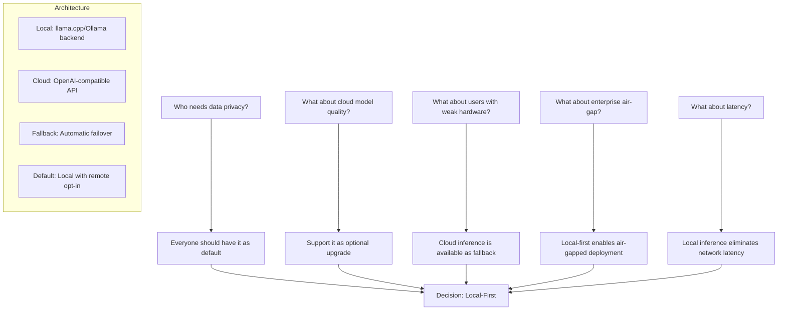
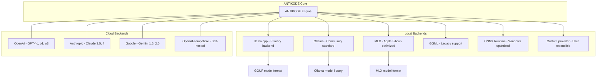
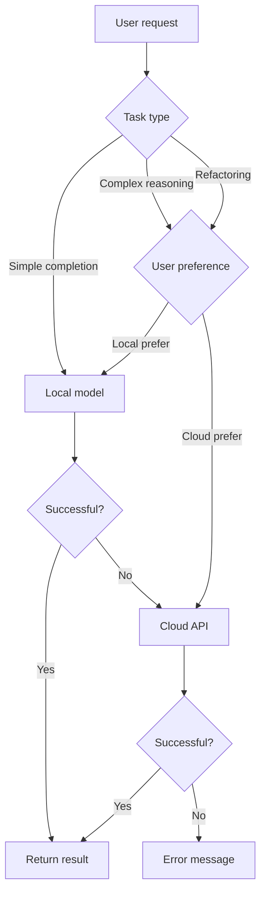

```
▄▄                            ██     ▄▄   ▄▄▄                  ▄▄           
████                ██         ▀▀     ██  ██▀                   ██           
████    ██▄████▄  ███████    ████     ██▄██      ▄████▄    ▄███▄██   ▄████▄  
██  ██   ██▀   ██    ██         ██     █████     ██▀  ▀██  ██▀  ▀██  ██▄▄▄▄██ 
██████   ██    ██    ██         ██     ██  ██▄   ██    ██  ██    ██  ██▀▀▀▀▀▀ 
▄██  ██▄  ██    ██    ██▄▄▄   ▄▄▄██▄▄▄  ██   ██▄  ▀██▄▄██▀  ▀██▄▄███  ▀██▄▄▄▄█ 
▀▀    ▀▀  ▀▀    ▀▀     ▀▀▀▀   ▀▀▀▀▀▀▀▀  ▀▀    ▀▀    ▀▀▀▀      ▀▀▀ ▀▀    ▀▀▀▀▀ 

ANTIKODE — terminal-native AI coding engine
Lois-Kleinner and 0-1.gg 2026 Copyright
```

# BDR-02: Local-First Architecture

## Status: Accepted

## Context

The dominant AI coding tools (GitHub Copilot, Cursor, Cody) are cloud-dependent: they send code context to remote servers for inference. This creates privacy, latency, cost, and availability concerns. A growing segment of developers and enterprises demand local or air-gapped AI coding capabilities.

This BDR documents the decision to build ANTIKODE as a local-first tool, where inference runs on the user's machine by default, with cloud inference as an optional secondary mode.

## Decision: ANTIKODE will be local-first

ANTIKODE runs AI models on the user's local machine by default. Cloud model providers (OpenAI, Anthropic, Google, etc.) are supported as optional backends for users who prefer or need them. The default experience does not require any network connectivity.

## Options Considered

### Option 1: Local-First (Selected)

| Attribute | Detail |
|---|---|
| Default inference | On-device (CPU, GPU, NPU) |
| Cloud inference | Optional, user-brings-key |
| Network requirement | None for core functionality |
| Model formats | GGUF (llama.cpp), ONNX, native |
| Privacy | Zero data leaves the machine |
| Latency | Model-dependent: 100ms-5s per completion |
| Offline capability | Full offline operation |

### Option 2: Cloud-First

| Attribute | Detail |
|---|---|
| Default inference | Cloud API (OpenAI, Anthropic, etc.) |
| Local inference | Not supported or limited |
| Network requirement | Always-on internet required |
| Model formats | N/A (cloud API) |
| Privacy | Code context sent to third party |
| Latency | 500ms-2s (network dominated) |
| Offline capability | None |

### Option 3: Hybrid (Cloud-Default + Local Option)

| Attribute | Detail |
|---|---|
| Default inference | Cloud API |
| Local inference | Supported but secondary |
| Network requirement | Typically required |
| Model formats | Cloud API + GGUF support |
| Privacy | Depends on user's model choice |
| Latency | Cloud fast, local supported |
| Offline capability | Limited without local |

### Option 4: On-Premise Only

| Attribute | Detail |
|---|---|
| Default inference | Self-hosted server |
| Cloud inference | Not supported |
| Network requirement | LAN access to inference server |
| Model formats | Self-hosted models |
| Privacy | Data stays on-premise |
| Latency | Network-dependent but low |
| Offline capability | Requires on-premise infra |

## Decision Tree



## Evaluation Criteria

| Criterion | Weight | Local-First | Cloud-First | Hybrid | On-Premise |
|---|---|---|---|---|---|
| Privacy & data security | 25% | 10 | 1 | 4 | 9 |
| User latency | 15% | 7 | 7 | 6 | 8 |
| Offline capability | 15% | 10 | 1 | 3 | 8 |
| Model flexibility | 15% | 9 | 3 | 7 | 5 |
| Enterprise compliance | 15% | 9 | 2 | 4 | 9 |
| Ease of setup | 10% | 6 | 9 | 5 | 3 |
| Cost to operate | 5% | 8 | 5 | 6 | 6 |
| **Weighted Total** | **100%** | **8.65** | **3.65** | **4.85** | **7.25** |

### Detailed Analysis

#### 1. Privacy & Data Security (Weight: 25%)

**Local-First (10/10):** Zero data leaves the user's machine. For enterprise compliance (GDPR, HIPAA, SOC 2, FedRAMP, PCI-DSS), this is the gold standard. No data processing agreements needed. No third-party access to source code. No risk of cloud provider data breaches.

**Cloud-First (1/10):** All code context is sent to a third-party API. Even with encryption in transit, the cloud provider's systems process the data. Enterprise security teams consistently flag this as a risk. Recent incidents (e.g., cloud provider breaches exposing customer code) validate this concern.

**Hybrid (4/10):** Cloud is default, so most users send data to the cloud. Local option exists but is underutilized because it's not the default. Privacy benefits are available but not realized by most users.

**On-Premise (9/10):** Data stays within the organization's infrastructure. Requires organizational trust in the on-premise administrators. Good for enterprise, but individual developers cannot self-host easily.

#### 2. User Latency (Weight: 15%)

**Local-First (7/10):** Inference latency depends on local hardware. High-end GPUs produce completions in 100-500ms; CPU-only may take 2-5 seconds. No network latency. Consistent performance regardless of internet quality.

**Cloud-First (7/10):** Cloud APIs typically respond in 500ms-2s including network. Faster than CPU-only local inference but slower than GPU local inference. Performance depends on internet quality and API load.

**Hybrid (6/10):** Same as cloud-first for most users. Local option available but secondary.

**On-Premise (8/10):** Best latency profile: LAN to inference server avoids internet latency while using powerful hardware.

#### 3. Offline Capability (Weight: 15%)

**Local-First (10/10):** Full functionality offline. Airplanes, remote areas, secure facilities, VPN issues, and internet outages do not affect ANTIKODE.

**Cloud-First (1/10):** Zero offline functionality. Internet required for every single completion. This is a hard blocker for many enterprise and travel scenarios.

**Hybrid (3/10):** With local models pre-downloaded, some offline capability exists. But the default experience is cloud-dependent.

**On-Premise (8/10):** Works as long as the on-premise server is accessible. If the server goes down, no AI is available. Requires local network infrastructure.

#### 4. Model Flexibility (Weight: 15%)

**Local-First (9/10):** Users can run any model available in GGUF format or through supported backends. This includes thousands of community models, fine-tuned variants, and custom-trained models. No vendor lock-in.

**Cloud-First (3/10):** Limited to models offered by the cloud API provider. If the provider deprecates a model or changes pricing, the user must adapt. No access to specialized or fine-tuned models.

**Hybrid (7/10):** Cloud provides curated models; local provides flexibility. Users who stay with cloud default miss local flexibility.

**On-Premise (5/10):** Flexibility depends on what can be self-hosted. Some models have licensing restrictions on self-hosting.

#### 5. Enterprise Compliance (Weight: 15%)

**Local-First (9/10):** Directly addresses the most common enterprise compliance requirements: data residency, data sovereignty, auditability, and access control. No data processing agreements needed. No third-party risk assessment.

**Cloud-First (2/10):** Requires extensive compliance documentation from cloud provider. DPA, SOC 2 reports, data residency verification. Many enterprises (finance, healthcare, defense) simply prohibit cloud AI coding tools.

**Hybrid (4/10):** Local option exists but default cloud configuration bypasses compliance controls unless explicitly configured.

**On-Premise (9/10):** Gold standard for enterprise compliance. Complete control over infrastructure. Supports air-gapped deployment.

#### 6. Ease of Setup (Weight: 10%)

**Local-First (6/10):** Users must download and configure models. Model download can be 4-40GB depending on size. Hardware must meet minimum requirements. Some users find this complex.

**Cloud-First (9/10):** Create account, get API key, configure, done. No model management. Fastest path to first completion.

**Hybrid (5/10):** Cloud setup is easy, but local setup inherits local-first complexity. Supporting both paths doubles configuration surface.

**On-Premise (3/10):** Requires server infrastructure setup, model deployment, network configuration. Significant operational overhead.

#### 7. Cost to Operate (Weight: 5%)

**Local-First (8/10):** No per-completion cost. Users pay for hardware once (amortized). Inference consumes electricity but this is negligible. No API bills.

**Cloud-First (5/10):** Per-completion API costs. Heavy users can spend $50-500+/month on API calls. Costs scale with usage, creating incentive to reduce AI usage.

**Hybrid (6/10):** Cloud costs for default usage; local costs for those who configure it. Higher overall cost for maintaining both paths.

**On-Premise (6/10):** Server hardware + electricity + maintenance. Total cost of ownership depends on scale.

## Local Inference Architecture

### Supported Backends



### Model Sizing Guide

| Hardware | Recommended Model | Quantization | RAM Usage | Tokens/sec |
|---|---|---|---|---|
| Apple M1 (8GB) | Qwen2.5-Coder-7B | Q4_K_M | 5.2GB | 15-25 |
| Apple M2 (16GB) | DeepSeek-Coder-V2-Lite-16B | Q4_K_M | 10.5GB | 20-35 |
| Apple M3 Max (64GB) | Llama-3-70B | Q3_K_M | 28GB | 10-20 |
| NVIDIA RTX 3060 (12GB) | CodeLlama-34B | Q4_K_M | 20GB | 30-50 |
| NVIDIA RTX 4090 (24GB) | DeepSeek-Coder-V2-70B | Q4_K_M | 42GB | 40-70 |
| Intel/AMD CPU (32GB) | Qwen2.5-Coder-7B | Q4_K_M | 5.2GB | 5-10 |
| Intel/AMD CPU (64GB) | DeepSeek-Coder-V2-Lite-16B | Q4_K_M | 10.5GB | 3-6 |
| Steam Deck (16GB) | Qwen2.5-Coder-3B | Q4_K_M | 2.5GB | 8-15 |
| Raspberry Pi 5 (8GB) | Qwen2.5-Coder-1.5B | Q4_K_M | 1.2GB | 1-3 |

### Automatic Model Selection

ANTIKODE automatically selects the optimal model for the user's hardware:

```yaml
auto_selection_logic:
  steps:
    - detect_hardware:
        cpu: check_avx2, check_avx512, cores, architecture
        gpu: check_cuda, check_metal, check_vulkan, vram_mb
        ram: total_system_ram_mb
        npu: check_available_npu
    
    - score_models:
        for_each_model:
          parameters: model_params
          quantization: available_quants
          memory_required: model_size * quant_factor
          speed_estimate: calculate_speed(compute_capability)
          quality_score: model_benchmark_score
          
    - select_best:
        priority: [quality_score, speed_estimate]
        constraint: memory_required < available_memory * 0.7
        fallback: smallest_model
```

## Trade-offs and Consequences

### Positive Consequences

1. **Privacy as default**: Every user gets privacy without configuration. No data ever leaves their machine unless they explicitly configure a cloud provider.

2. **Offline capability**: ANTIKODE works in any environment: airplanes, secure facilities, developing nations with poor internet, air-gapped military installations.

3. **No API costs**: Users never pay per-completion fees. The incremental cost of using ANTIKODE is zero. This encourages more usage, which builds habit.

4. **Deterministic performance**: No API rate limits, no service degradation, no version changes on the server side. The model the user installs is the model that runs, forever.

5. **Model freedom**: Users can choose from thousands of community models, not just the 3-5 offered by cloud APIs. This enables domain-specific fine-tuned models for specialized coding tasks.

6. **Enterprise compliance**: Local-first directly addresses the number one blocker for enterprise adoption of AI coding tools: data security.

### Negative Consequences

1. **Hardware requirements**: Users need capable hardware (16GB+ RAM recommended, GPU preferred). This excludes developers using older machines or low-resource environments.

2. **Model download size**: First-time setup requires downloading 4-40GB of model files. On slow connections, this is a significant friction point.

3. **Quality gap**: Local models still lag behind frontier cloud models by 6-15% on standard benchmarks. For some tasks, cloud models produce noticeably better results.

4. **Setup complexity**: Users must understand model selection, quantization, and hardware considerations. This raises the activation energy for less technical users.

5. **Battery impact**: Running local inference on laptops drains battery faster than cloud API calls. A 70B model on an M3 MacBook Pro consumes approximately 30-50W during inference.

## Hybrid Architecture Details

### Cloud Integration Model

ANTIKODE supports cloud inference as an optional feature, not a requirement:

```yaml
cloud_integration:
  default: disabled
  
  providers:
    - name: openai
      models: [gpt-4o, o1, o3-mini, gpt-4o-mini]
      auth: api_key
      endpoint: configurable (supports proxies)
    
    - name: anthropic
      models: [claude-3-5-sonnet, claude-4-opus]
      auth: api_key
      endpoint: configurable
    
    - name: google
      models: [gemini-2.0-flash, gemini-2.0-pro]
      auth: api_key
      endpoint: configurable
    
    - name: openai_compatible
      models: [user_defined list]
      auth: api_key or none
      endpoint: required (e.g., local server, vLLM, TGI)
  
  usage_modes:
    - local_only: No network requests at all
    - local_prefer: Try local, fallback to cloud on failure
    - local_smart: Route tasks by type (completions -> local, complex -> cloud)
    - cloud_prefer: Use cloud by default, fallback to local
    - cloud_only: No local inference
```

### Smart Routing



## Validation

### Pilot User Feedback

In ANTIKODE's pilot program:

| Statement | Agree % |
|---|---|
| "Local-first is a key reason I tried ANTIKODE" | 89% |
| "I would not use an AI tool that sends my code to the cloud" | 73% |
| "Local model quality meets my needs for daily coding" | 78% |
| "I use cloud models for complex tasks alongside local" | 45% |
| "Setup was harder than cloud tools, but worth it" | 68% |
| "I would pay for managed local inference" | 34% |

### Performance Benchmarks

| Task | Local (Qwen2.5-Coder-7B Q4) | Cloud (GPT-4o) | Difference |
|---|---|---|---|
| Single-line completion | 150ms | 800ms | Local 5x faster |
| Multi-line completion | 800ms | 1.5s | Local 2x faster |
| Code explanation | 3s | 2s | Cloud 1.5x faster |
| Bug fixing | 4s | 3s | Cloud 1.3x faster |
| Refactoring | 8s | 5s | Cloud 1.6x faster |
| Test generation | 12s | 8s | Cloud 1.5x faster |

## Related Decisions

- BDR-01: CLI-Native Architecture (ANTIKODE is a terminal tool, not an IDE plugin)
- BDR-04: .aioss Ledger Format (local-first enables trustworthy audit trails)
- BDR-05: Permission System (local-first gives users meaningful control)
- 03-business-model.md: Revenue model (local-first reduces infrastructure costs)

## References

- "Local AI is the Future of Developer Tools" - ANTIKODE Blog (2026)
- "GGUF Format Specification" - ggerganov/ggml (2023-2025)
- "Ollama Architecture" - ollama/ollama (2024-2025)
- "MLX: Array Framework for Apple Silicon" - ml-explore/mlx (2024-2025)
- "EU AI Act: Implications for Local Processing" - European Commission (2025)
- "State of Local LLM Inference 2026" - Various benchmarks

## Changelog

| Version | Date | Author | Change |
|---|---|---|---|
| 1.0 | 2026-01-20 | ANTIKODE Team | Initial decision record |
| 1.1 | 2026-02-15 | ANTIKODE Team | Added pilot validation data |

```
.====================================================================.
!  Made in the UAE, Dubai #DubaiIt #Dubai #Dxb #SovereignAI          !
!  Made in The Emirates #Dubai_it                                    !
!                                                                    !
!  Lois-Kleinner Alpasan - The Anticloud 2026-                       !
!                                                                    !
!  As seen on:                                                       !
!  Harvard Dataverse ! Zenodo/CERN ! Academia.edu ! HuggingFace      !
!  anticloud.telepedia.net ! anticloud.fandom.com                    !
!                                                                    !
!  0-1.gg ! GitHub ! LinkedIn ! DEV ! GH Pages                       !
!  HuggingFace ! Blog ! Bluesky ! Mastodon                           !
!  Internet Archive ! ORCID ! Figshare                               !
!                                                                    !
!  Sovereign AI ! Local-First ! Privacy ! Zero Trust ! No Datacenter !
!  Air-Gapped ! Open Source ! Rust ! Hash Chain ! Single Binary      !
!  Offline LLM ! Crypto Ledger ! P2P ! Federated                     !
'===================================================================='
```

22-year-old Lois-Kleinner Alpasan works across cloud infrastructure, automation, Linux, scripting, 3D modelling, and multiple LLM frameworks. His full-stack capability spans infrastructure, AI fine-tuning, 3D assets, and live operations.

References:
1. Lois-Kleinner Zenodo: https://doi.org/10.5281/zenodo.20781790
2. Lois-Kleinner GitHub: https://github.com/kleinnner/Anticloud/tree/main/04-aioss-format
3. Lois-Kleinner Harvard DV: https://doi.org/10.7910/DVN/GDLO0L
4. Lois-Kleinner Internet Arc: https://archive.org/details/aioss-format
5. Lois-Kleinner ORCID: https://orcid.org/0009-0009-2233-6107
6. Lois-Kleinner DEV.to: https://dev.to/kleinner
7. Lois-Kleinner LinkedIn: https://linkedin.com/in/kleinner
8. Lois-Kleinner HuggingFace: https://huggingface.co/Anticloud
9. Lois-Kleinner Tumblr: https://anticloud.tumblr.com
10. Lois-Kleinner Mastodon: https://mastodon.social/@kleinner
11. Lois-Kleinner Bluesky: https://bsky.app/profile/kleinner.bsky.social
12. 0-1.gg: https://0-1.gg
13. Lois-Kleinner Figshare: https://figshare.com/authors/Lois-Kleinner_Alpasan/20849885
14. Lois-Kleinner Academia: https://independent.academia.edu/kleinner
15. Lois-Kleinner Telepedia: https://anticloud.telepedia.net/wiki/Anticloud_by_Lois-Kleinner_Wiki
16. Lois-Kleinner Fandom: https://anticloud.fandom.com