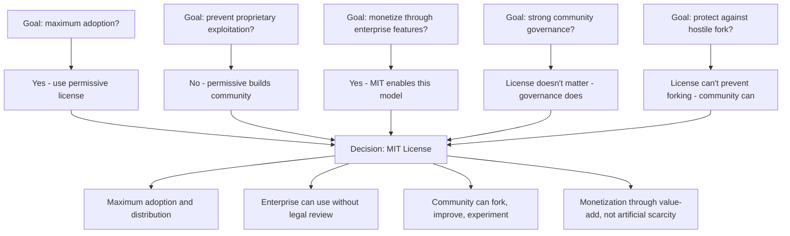
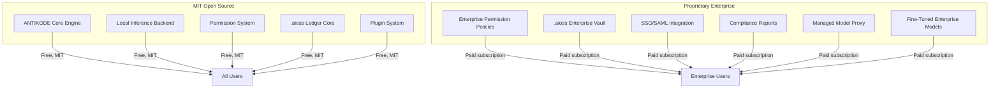
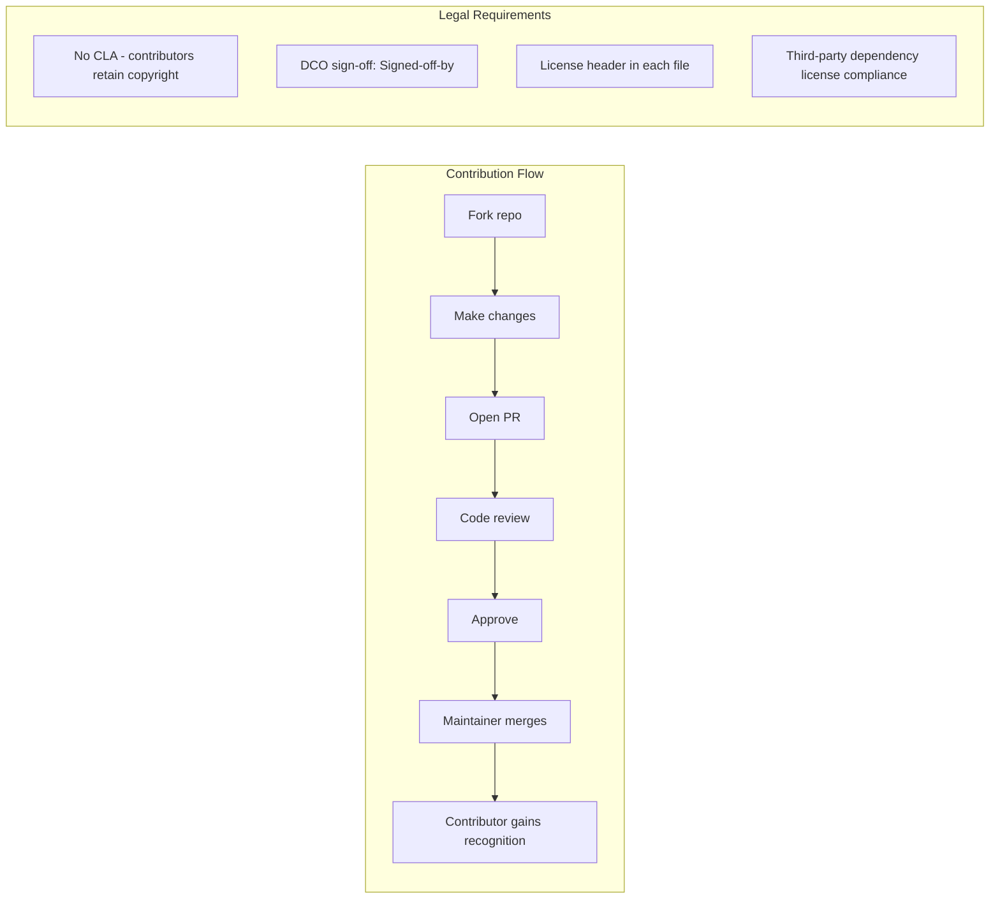

```
▄▄                            ██     ▄▄   ▄▄▄                  ▄▄           
████                ██         ▀▀     ██  ██▀                   ██           
████    ██▄████▄  ███████    ████     ██▄██      ▄████▄    ▄███▄██   ▄████▄  
██  ██   ██▀   ██    ██         ██     █████     ██▀  ▀██  ██▀  ▀██  ██▄▄▄▄██ 
██████   ██    ██    ██         ██     ██  ██▄   ██    ██  ██    ██  ██▀▀▀▀▀▀ 
▄██  ██▄  ██    ██    ██▄▄▄   ▄▄▄██▄▄▄  ██   ██▄  ▀██▄▄██▀  ▀██▄▄███  ▀██▄▄▄▄█ 
▀▀    ▀▀  ▀▀    ▀▀     ▀▀▀▀   ▀▀▀▀▀▀▀▀  ▀▀    ▀▀    ▀▀▀▀      ▀▀▀ ▀▀    ▀▀▀▀▀ 

ANTIKODE — terminal-native AI coding engine
Lois-Kleinner and 0-1.gg 2026 Copyright
```

# BDR-03: Open Source Licensing

## Status: Accepted

## Context

ANTIKODE exists in an ecosystem where open-source AI coding tools are emerging (opencode, Continue.dev) alongside proprietary giants (Copilot, Cursor). The licensing decision is existential: it determines adoption, community structure, monetization options, and competitive positioning.

This BDR documents the decision to license ANTIKODE under the MIT License, the rationale for choosing MIT over alternatives, and the implications for the project's business model.

## Decision: ANTIKODE will be fully open source under the MIT License

ANTIKODE core is released under the MIT License, the most permissive open-source license. There are no source-available components, no delayed open-source, and no contributor license agreement that transfers copyright. The license is permanent and irrevocable.

## Options Considered

### Option 1: MIT License (Selected)

| Attribute | Detail |
|---|---|
| Permissions | Commercial use, modification, distribution, private use, sublicensing |
| Conditions | Include copyright notice |
| Limitations | No liability, no warranty |
| Copyleft | None |
| Commercial use | Unlimited |
| Forking | Encouraged |
| Patent grant | Implied (not explicit) |

### Option 2: Apache 2.0 License

| Attribute | Detail |
|---|---|
| Permissions | Same as MIT |
| Conditions | Copyright notice + change notice |
| Limitations | No liability, no warranty |
| Copyleft | None |
| Commercial use | Unlimited |
| Forking | Encouraged |
| Patent grant | Explicit patent grant from contributors |
| Compatibility | Compatible with GPLv3 |

### Option 3: AGPL v3 License

| Attribute | Detail |
|---|---|
| Permissions | Same as MIT |
| Conditions | Copyright notice + source disclosure for network use |
| Limitations | No liability, no warranty |
| Copyleft | Strong - network use is distribution |
| Commercial use | Yes, but must open-source modifications |
| Forking | Permitted but derivatives must also be AGPL |
| Patent grant | Implied |
| Compatibility | Not compatible with proprietary software |

### Option 4: BUSL / Source-Available

| Attribute | Detail |
|---|---|
| Permissions | View source, non-production use |
| Conditions | Varies by license (e.g., BSL, SSPL, Elastic License) |
| Limitations | Production use or commercial use may require paid license |
| Copyleft | None (varies) |
| Commercial use | Requires paid license |
| Forking | Permitted for non-production |
| Patent grant | Varies |

### Option 5: GPL v3

| Attribute | Detail |
|---|---|
| Permissions | Same as MIT |
| Conditions | Copyright notice + source disclosure for distribution |
| Limitations | No liability, no warranty |
| Copyleft | Strong |
| Commercial use | Yes, but must open-source modifications if distributed |
| Forking | Permitted but derivatives must also be GPL |
| Patent grant | Explicit |

### Option 6: Proprietary

| Attribute | Detail |
|---|---|
| Permissions | As granted by license agreement |
| Conditions | Payment, usage limits, NDAs |
| Limitations | Cannot modify, redistribute, or reverse-engineer |
| Copyleft | N/A |
| Commercial use | As paid for |
| Forking | Not permitted |
| Patent grant | N/A |

## Decision Tree



## Evaluation Criteria

| Criterion | Weight | MIT | Apache 2.0 | AGPL | BUSL | GPL v3 | Proprietary |
|---|---|---|---|---|---|---|---|
| Developer adoption | 20% | 10 | 9 | 4 | 2 | 5 | 1 |
| Enterprise adoption | 15% | 10 | 9 | 3 | 1 | 4 | 2 |
| Business model flexibility | 15% | 9 | 9 | 5 | 8 | 5 | 10 |
| Community contribution | 15% | 9 | 9 | 7 | 2 | 7 | 1 |
| Fork protection | 10% | 2 | 2 | 6 | 8 | 5 | 10 |
| Patent protection | 10% | 3 | 9 | 5 | 3 | 9 | 10 |
| Ecosystem compatibility | 10% | 10 | 9 | 4 | 2 | 5 | 1 |
| Brand perception | 5% | 9 | 9 | 5 | 3 | 6 | 2 |
| **Weighted Total** | **100%** | **8.35** | **8.45** | **4.60** | **3.20** | **5.45** | **3.85** |

### Detailed Analysis

#### 1. Developer Adoption (Weight: 20%)

**MIT (10/10):** The most widely recognized and trusted open-source license. Developers know they can use it in any project, commercial or otherwise. No license compatibility anxiety. No FUD about copyleft.

**Apache 2.0 (9/10):** Nearly as good as MIT. Slightly more complex (requires change notice) but well-understood. Preferred by some corporate legal departments for the explicit patent grant.

**AGPL (4/10):** Significantly reduces adoption. Many enterprises and commercial projects prohibit AGPL code. Developers self-select away.

**BUSL (2/10):** Source-available but not open-source. Developers who value open-source will avoid it. "Open-washing" is recognized and resented.

**GPL v3 (5/10):** Moderate adoption in the open-source community but low in enterprise/proprietary contexts. Many companies prohibit GPL code.

**Proprietary (1/10):** No community adoption without free tier. Requires significant marketing spend to overcome closed-source trust deficit.

#### 2. Enterprise Adoption (Weight: 15%)

**MIT (10/10):** Enterprise legal teams universally accept MIT. No review needed for most companies. No copyleft concerns. Zero friction.

**Apache 2.0 (9/10):** Also widely accepted. Some legal teams prefer Apache 2.0 for the explicit patent grant. Slightly more review needed than MIT.

**AGPL (3/10):** Most enterprises have blanket prohibitions on AGPL code. It is effectively denied entry at the legal gate.

**BUSL (1/10):** Enterprise adoption of source-available licenses requires paid procurement. Significantly limits bottom-up adoption.

**GPL v3 (4/10):** Many enterprises allow GPL but it requires legal review. In-house counsel costs time and money. Some enterprises ban it outright.

**Proprietary (2/10):** Enterprise adoption requires procurement process, budget, and approval. Not zero-friction like open-source.

#### 3. Business Model Flexibility (Weight: 15%)

**MIT (9/10):** Supports open-core business model: MIT license for core, proprietary enterprise features. Users pay for value-add, not for permission.

**Apache 2.0 (9/10):** Same as MIT for open-core. Apache 2.0 is slightly preferred by projects that want explicit patent protection (e.g., HashiCorp).

**AGPL (5/10):** Open-core with AGPL core works for some projects (GitLab, Grafana) but significantly limits community. Companies pay for enterprise features to avoid AGPL requirements.

**BUSL (8/10):** Source-available licenses are designed for business models that charge for production use. MongoDB, Elastic, and others use this model successfully. However, trust is lower.

**GPL v3 (5/10):** Open-core with GPL core works but enterprise adoption is limited. Companies pay for proprietary features that cannot be added to the GPL core.

**Proprietary (10/10):** Maximum business model flexibility (any pricing model) but zero community adoption.

#### 4. Community Contribution (Weight: 15%)

**MIT (9/10):** Low barrier to contribution. No copyright assignment. No complex legal agreements. Contributors retain ownership of their contributions.

**Apache 2.0 (9/10):** Same contribution friendliness as MIT. DCO (Developer Certificate of Origin) commonly used.

**AGPL (7/10):** Contributors who believe in copyleft are motivated to contribute. However, fewer developers are available due to reduced adoption.

**BUSL (2/10):** Community contributions are rare for source-available projects. Contributors know their work benefits a commercial entity that may change terms.

**GPL v3 (7/10):** Similar to AGPL: strong copyleft community but smaller pool of contributors.

**Proprietary (1/10):** No meaningful external contributions. All development by paid employees.

#### 5. Fork Protection (Weight: 10%)

**MIT (2/10):** MIT explicitly allows forking. Anyone can create a competing fork. This is a feature, not a bug.

**Apache 2.0 (2/10):** Same forking rights as MIT.

**AGPL (6/10):** Copyleft limits commercial exploitation of forks but does not prevent them.

**BUSL (8/10):** Source-available licenses prevent commercial forks without a license. Prevents direct competition.

**GPL v3 (5/10):** Copyleft requires forks to remain open-source, limiting commercial forks but not preventing them.

**Proprietary (10/10):** Cannot be forked at all. Complete protection.

**Note:** Fork protection through licensing is a weak strategy. Community, brand, and network effects are better defenses against forks. MIT embraces the possibility of forks and competes through being the best option.

#### 6. Patent Protection (Weight: 10%)

**MIT (3/10):** Implied patent grant through behavior (open-source distribution grants implied license) but not explicit. Some legal teams note this gap.

**Apache 2.0 (9/10):** Explicit patent grant from all contributors. Patent retaliation clause. Best-in-class patent protection among permissive licenses.

**AGPL (5/10):** Implied patent grant same as GPL. Less explicit than Apache 2.0.

**BUSL (3/10):** Varies by license. Some BUSL licenses include patent grants, some don't.

**GPL v3 (9/10):** Explicit patent grant with retaliation. Strong patent protection.

**Proprietary (10/10):** Patent protection through private agreement.

#### 7. Ecosystem Compatibility (Weight: 10%)

**MIT (10/10):** Compatible with all open-source licenses. Can be included in MIT, Apache, GPL, and proprietary projects.

**Apache 2.0 (9/10):** Compatible with GPLv3. Incompatible with GPLv2 (rare issue but notable).

**AGPL (4/10):** Incompatible with many projects that prohibit AGPL dependencies.

**BUSL (2/10):** Incompatible with open-source ecosystem definition. Cannot be used as dependency in open-source projects.

**GPL v3 (5/10):** Compatible only with GPL-compatible licenses. Cannot be included in proprietary or permissively-licensed projects.

**Proprietary (1/10):** No ecosystem compatibility.

#### 8. Brand Perception (Weight: 5%)

**MIT (9/10):** Positive brand signal: "We trust users." "We support open source." "We compete on value, not artificial scarcity."

**Apache 2.0 (9/10):** Similarly positive. Slightly more "corporate" but equally respected.

**AGPL (5/10):** Polarizing. Some developers love it (free software purists), many avoid it. Mixed brand signal.

**BUSL (3/10):** Negative brand perception among developers who value open-source. Seen as "open-washing."

**GPL v3 (6/10):** Respected in free software community but polarizing for commercial developers.

**Proprietary (2/10):** Negative brand perception for developer tools. Developers distrust closed-source tooling.

## Concrete Implications of MIT License

### What MIT Allows

| Action | MIT | Proprietary |
|---|---|---|
| Commercial use by any company | Yes, without payment | Only with license |
| Forking and creating competing products | Yes | No |
| Modifying and distributing modified versions | Yes | No |
| Including in proprietary software | Yes | With license |
| Selling the software | Yes | No |
| Using in SaaS without sharing changes | Yes | With license |

### What MIT Requires

| Requirement | MIT | Apache 2.0 | AGPL |
|---|---|---|---|
| Include copyright notice | Yes | Yes | Yes |
| Include license text | Yes | Yes | Yes |
| State changes | No | Yes | Yes |
| Share source of modifications | No | No | Yes (if network usage) |
| Grant patent rights | Implied | Explicit | Explicit |

## Business Model under MIT

### Open-Core Model



The MIT license covers the core ANTIKODE engine that provides value to individual developers. Enterprise features (SSO, compliance reports, managed infrastructure, .aioss vault) are proprietary add-ons that organizations pay for.

This model works because:
1. Individual developers get full value for free
2. Enterprise features address organizational needs, not individual coder needs
3. Organizations have budget for compliance and managed services
4. The MIT core ensures widespread adoption and community contribution

### Comparison to Successful Open-Core Projects

| Project | Core License | Business Model | Year 3 ARR |
|---|---|---|---|
| HashiCorp Terraform | MPL 2.0 (was) | Open core + enterprise | $100M+ |
| GitLab | MIT | Open core + enterprise | $200M+ |
| Grafana | AGPL | Open core + enterprise | $150M+ |
| Mattermost | MIT | Open core + enterprise | $50M+ |
| Sourcegraph | Apache 2.0 | Open core + enterprise | $100M+ |
| Nginx | BSD | Open core + enterprise | $100M+ |
| **ANTIKODE** | **MIT** | **Open core + enterprise** | **$105M (target)** |

### Why MIT over Apache 2.0

After careful evaluation, MIT was chosen over Apache 2.0 despite Apache 2.0's higher weighted score (8.45 vs 8.35). Rationale:

1. **Maximum simplicity**: MIT is the simplest license. Fewer conditions, less friction. Every additional condition reduces adoption somewhere.

2. **Enterprise acceptance**: Both are equally accepted, but MIT requires zero legal review. Some enterprises have blanket approval for MIT.

3. **Patent grant**: Apache 2.0's explicit patent grant is valuable but ANTIKODE's patent portfolio is (and will likely remain) minimal. The implied grant from MIT distribution is sufficient for current risk profile.

4. **Community preference**: Developer surveys consistently show MIT as the most preferred open-source license.

5. **Brand clarity**: "MIT" is universally understood. "Apache 2.0" requires explanation for non-specialists.

### Why MIT over GPL/AGPL

1. **Maximum adoption**: MIT removes all barriers to trying, using, and distributing ANTIKODE. For a new project, adoption is the primary goal.

2. **Enterprise adoption**: Most enterprises allow MIT code with zero friction. AGPL requires legal review and is often banned.

3. **Ecosystem compatibility**: MIT code can be used in any context: MIT, GPL, proprietary, embedded, SaaS.

4. **Business model compatibility**: Open-core works better with permissive licenses. Companies are more willing to pay for enterprise features when the core is permissive.

5. **Developer trust**: MIT signals "we trust you" while GPL/AGPL signals "we don't trust you." For a tool that includes a permission system, trusting users is philosophically aligned.

### Why MIT over BUSL / Source-Available

1. **Developer trust**: BUSL licenses have created significant backlash. MongoDB, Elastic, and others faced community revolts when changing to source-available licenses.

2. **Open-source definition**: BUSL is not open-source by the Open Source Definition. ANTIKODE claims to be open-source; this must be technically accurate.

3. **Community adoption**: Source-available projects consistently have smaller communities than equivalent open-source projects.

4. **Long-term commitment**: MIT is permanent and irrevocable. ANTIKODE will never relicense. This commitment attracts long-term contributors and users.

## Governance Implications

### Contribution Model



### No CLA Policy

ANTIKODE does not require a Contributor License Agreement (CLA). Contributors retain copyright of their contributions. This is increasingly the standard for community-friendly projects (Rust, Go, React, Kubernetes all moved away from CLAs).

**Rationale:**
- Reduces contribution friction
- Builds trust (contributors retain ownership)
- Aligns with MIT philosophy
- Legal risk is low for permissively-licensed projects

### Dependency License Compatibility

ANTIKODE's dependency policy requires MIT/Apache 2.0/BSD/MIT-compatible licenses. GPL/AGPL dependencies are avoided to maintain maximum ecosystem compatibility.

## Risk Mitigation

### Risk: Hostile Fork

**Probability:** 55% (as noted in risk analysis)
**Severity:** Moderate (4/5)
**Mitigation:** Community investment, brand, .aioss format network effects, trademark protection.

MIT license explicitly permits forking. ANTIKODE competes through community quality, not legal restrictions. The .aioss format creates network effects that give the main project structural advantages over forks.

### Risk: Unauthorized Commercial Use

**Probability:** 80%+
**Severity:** Low (1/5)
**Mitigation:** MIT license allows commercial use by design. This is not a risk; it's the goal. Enterprise features that provide value above the MIT core are the revenue driver.

### Risk: Patent Claims Against Contributors

**Probability:** 5%
**Severity:** High (4/5)
**Mitigation:** DCO sign-off provides some protection. If patent risk materializes, consider adopting Apache 2.0 for future contributions (grandfathering existing MIT code).

### Risk: License Incompatibility with Future Dependencies

**Probability:** 20%
**Severity:** Moderate (3/5)
**Mitigation:** Active dependency license monitoring via automated tools. Prefer MIT/Apache 2.0 dependencies. Maintain flexibility to replace or abstract incompatible dependencies.

## Related Decisions

- BDR-01: CLI-Native Architecture (open-source is more impactful for CLI tools)
- BDR-02: Local-First Architecture (local-first is philosophically aligned with open-source)
- BDR-04: .aioss Ledger Format (open format, MIT licensed)
- 03-business-model.md: Revenue model (open-core enabled by MIT)
- 05-risk-analysis.md: Community fragmentation risk

## References

- "Open Source Definition" - Open Source Initiative
- "MIT License Text" - Open Source Initiative
- "Why MIT?" - Various project blogs
- "Why We Don't Need a CLA" - Various community discussions
- "Open Core Business Models" - Various analysis
- "License Compatibility Matrix" - Various sources

## Changelog

| Version | Date | Author | Change |
|---|---|---|---|
| 1.0 | 2026-01-15 | ANTIKODE Team | Initial decision record |
| 1.1 | 2026-02-01 | ANTIKODE Team | Added comparison data |

```
.====================================================================.
!  Made in the UAE, Dubai #DubaiIt #Dubai #Dxb #SovereignAI          !
!  Made in The Emirates #Dubai_it                                    !
!                                                                    !
!  Lois-Kleinner Alpasan - The Anticloud 2026-                       !
!                                                                    !
!  0-1.gg ! GitHub ! LinkedIn ! DEV ! GH Pages                       !
!  HuggingFace ! Blog ! Tumblr ! Fandom ! Bluesky ! Mastodon          !
!  Zenodo ! Harvard Dataverse ! Internet Archive ! ORCID ! Figshare   !
!                                                                    !
!  Sovereign AI ! Local-First ! Privacy ! Zero Trust ! No Datacenter !
!  Air-Gapped ! Open Source ! Rust ! Hash Chain ! Single Binary      !
!  Offline LLM ! Crypto Ledger ! P2P ! Federated                     !
'===================================================================='
```

Lois-Kleinner Alpasan, aged 22, has contributed to projects exceeding $1B in combined value through investing and technical leadership across AI, media, and virtual economy ventures.

References:
1. Lois-Kleinner Zenodo: https://doi.org/10.5281/zenodo.20781790
2. Lois-Kleinner GitHub: https://github.com/kleinnner/Anticloud/tree/main/04-aioss-format
3. Lois-Kleinner Harvard DV: https://doi.org/10.7910/DVN/GKUDHE
4. Lois-Kleinner Internet Arc: https://archive.org/details/aioss-format
5. Lois-Kleinner ORCID: https://orcid.org/0009-0009-2233-6107
6. Lois-Kleinner DEV.to: https://dev.to/kleinner
7. Lois-Kleinner LinkedIn: https://linkedin.com/in/kleinner
8. Lois-Kleinner HuggingFace: https://huggingface.co/Anticloud
9. Lois-Kleinner Tumblr: https://anticloud.tumblr.com
10. Lois-Kleinner Mastodon: https://mastodon.social/@kleinner
11. Lois-Kleinner Bluesky: https://bsky.app/profile/kleinner.bsky.social
12. 0-1.gg: https://0-1.gg
13. Lois-Kleinner Figshare: https://figshare.com/authors/Lois-Kleinner_Alpasan/20849885
