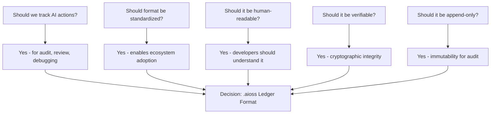
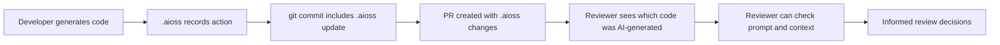
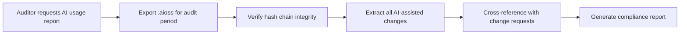
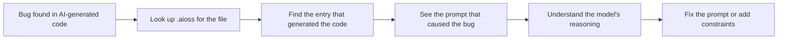
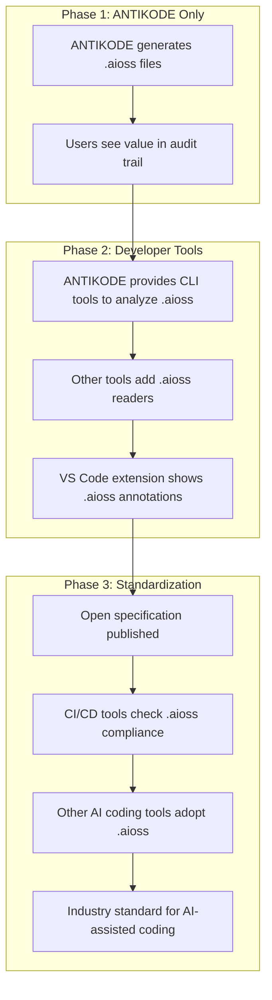

```
▄▄                            ██     ▄▄   ▄▄▄                  ▄▄           
████                ██         ▀▀     ██  ██▀                   ██           
████    ██▄████▄  ███████    ████     ██▄██      ▄████▄    ▄███▄██   ▄████▄  
██  ██   ██▀   ██    ██         ██     █████     ██▀  ▀██  ██▀  ▀██  ██▄▄▄▄██ 
██████   ██    ██    ██         ██     ██  ██▄   ██    ██  ██    ██  ██▀▀▀▀▀▀ 
▄██  ██▄  ██    ██    ██▄▄▄   ▄▄▄██▄▄▄  ██   ██▄  ▀██▄▄██▀  ▀██▄▄███  ▀██▄▄▄▄█ 
▀▀    ▀▀  ▀▀    ▀▀     ▀▀▀▀   ▀▀▀▀▀▀▀▀  ▀▀    ▀▀    ▀▀▀▀      ▀▀▀ ▀▀    ▀▀▀▀▀ 

ANTIKODE — terminal-native AI coding engine
Lois-Kleinner and 0-1.gg 2026 Copyright
```

# BDR-04: .aioss Ledger Format

## Status: Accepted

## Context

AI-assisted coding tools generate a significant amount of code, but there is currently no standardized format for recording what changes were AI-generated, which model produced them, what context was provided, and what permissions were used. This creates problems for:

1. **Code review**: Reviewers cannot distinguish AI-generated code from human-written code
2. **Audit & compliance**: Organizations cannot track which code was AI-generated for regulatory purposes
3. **Debugging**: When AI-generated code has bugs, there's no trail back to the prompt that caused it
4. **Attribution**: Individual developers and contributors cannot prove what they wrote vs. what AI wrote
5. **Model comparison**: Users cannot easily compare which models perform better for different tasks

ANTIKODE introduces the .aioss (AI Open Source Software) ledger format to address these gaps.

This BDR documents the design, format specification, and rationale for the .aioss ledger format.

## Decision: ANTIKODE will use a standardized .aioss ledger format

Every AI-assisted action in ANTIKODE is recorded in a structured ledger file (`.aioss` directory in the project root). The ledger is a versioned, append-only, verifiable record of all model interactions, completions, edits, and user decisions.

## Format Overview

### Basic Structure

```yaml
.aioss/
  ledger.yaml          # Main ledger file
  sessions/           # Detailed session records
    session_001.yaml
    session_002.yaml
    ...
  chunks/             # Raw completion content (optional)
    chunk_001_diff.md
    chunk_002_diff.md
    ...
  signatures/         # Cryptographic signatures
    sign_001.sig
    ...
  config.yaml         # Ledger configuration
```

### Ledger Entry Format

```yaml
version: "1.0.0"
ledger_id: "550e8400-e29b-41d4-a716-446655440000"
project: "antikode"
created_at: "2026-06-15T14:30:00Z"
updated_at: "2026-06-15T14:35:00Z"

entries:
  - id: "ent_001abc"
    timestamp: "2026-06-15T14:30:00Z"
    user: "developer@example.com"
    action: "completion"
    model: "qwen2.5-coder-7b-q4"
    model_type: "local"
    model_provider: "ollama"
    
    context:
      file: "src/main.rs"
      line_start: 42
      line_end: 45
      language: "rust"
      surrounding_code: "fn parse_config(path: &str) -> Config {\n    let contents = std::fs::read_to_string(path)?;\n    "
      git_branch: "feature/aioss-format"
      git_commit: "a1b2c3d4e5f6..."
    
    prompt: "Complete the function to parse a YAML config file and return a Config struct"
    
    output:
      type: "inline_completion"
      content: "    let config: Config = serde_yaml::from_str(&contents)?;\n    Ok(config)"
      tokens_generated: 18
      tokens_input: 145
      duration_ms: 845
    
    permissions:
      files_read: ["src/main.rs", "src/config.rs"]
      files_written: []
      commands_executed: []
      approval: "auto"  # auto, approved, denied, modified
    
    verification:
      hash: "sha256:abc123..."
      signature: null  # Optional cryptographic signature
    
    tags:
      - "completion"
      - "inline"
      - "rust"
```

## Decision Tree



## Options Considered

### Option 1: .aioss Ledger Format (Selected)

| Attribute | Detail |
|---|---|
| Format | YAML + optional GPG/signature |
| Location | .aioss/ directory in project root |
| Content | Full record of every AI action |
| Verification | SHA-256 hashing, optional GPG signing |
| Human-readable | Yes (YAML) |
| Machine-parseable | Yes (YAML) |
| Versioned | Yes (major.minor.patch) |
| Extensible | Yes (user-defined tags and metadata) |
| Default | Enabled (opt-out available) |

### Option 2: No Ledger

| Attribute | Detail |
|---|---|
| Format | None |
| Location | N/A |
| Content | No record |
| Verification | N/A |
| Human-readable | N/A |
| Machine-parseable | N/A |
| Versioned | N/A |
| Extensible | N/A |
| Default | N/A |

### Option 3: Log File (Plain Text)

| Attribute | Detail |
|---|---|
| Format | Unstructured plain text |
| Location | ~/.antikode/logs/ |
| Content | Free-form log messages |
| Verification | None |
| Human-readable | Yes (basic) |
| Machine-parseable | No |
| Versioned | No |
| Extensible | No |
| Default | Logging level dependent |

### Option 4: Binary Protocol Buffer

| Attribute | Detail |
|---|---|
| Format | Protocol Buffers (protobuf) |
| Location | .aioss/ directory |
| Content | Structured binary records |
| Verification | Optional |
| Human-readable | No (requires decoder) |
| Machine-parseable | Yes (excellent) |
| Versioned | Yes (protobuf schema versioning) |
| Extensible | Yes (protobuf extensibility) |
| Default | Not default |

### Option 5: SQLite Database

| Attribute | Detail |
|---|---|
| Format | SQLite database |
| Location | .aioss/ledger.db |
| Content | Relational records |
| Verification | Application-level |
| Human-readable | No (requires query tool) |
| Machine-parseable | Yes (SQL) |
| Versioned | Yes (schema migrations) |
| Extensible | Yes (schema changes) |
| Default | Not default |

## Evaluation Criteria

| Criterion | Weight | .aioss YAML | None | Text Log | Protobuf | SQLite |
|---|---|---|---|---|---|---|
| Developer adoption | 20% | 9 | 10 | 6 | 3 | 4 |
| Enterprise compliance value | 20% | 9 | 1 | 4 | 8 | 7 |
| Human readability | 15% | 9 | 10 | 8 | 1 | 2 |
| Machine parseability | 15% | 8 | 1 | 3 | 10 | 10 |
| Diff-friendly (git) | 10% | 8 | 10 | 5 | 1 | 1 |
| Ecosystem adoption potential | 10% | 9 | 1 | 2 | 6 | 5 |
| Implementation complexity | 10% | 8 | 10 | 9 | 4 | 3 |
| **Weighted Total** | **100%** | **8.70** | **6.40** | **5.10** | **4.85** | **4.75** |

### Detailed Analysis

#### 1. Developer Adoption (Weight: 20%)

**.aioss YAML (9/10):** YAML is familiar to developers. The .aioss directory pattern is similar to .git, .github, .vscode. Non-invasive. Easy to understand.

**None (10/10):** Zero friction. But zero value from ledger features.

**Text Log (6/10):** Developers understand logs but unstructured text inhibits tooling.

**Protobuf (3/10):** Binary format requires special tooling to read. This creates friction.

**SQLite (4/10):** Requires query knowledge or tools.

#### 2. Enterprise Compliance Value (Weight: 20%)

**.aioss YAML (9/10):** Structured, verifiable record of AI actions. Directly addresses compliance requirements (EU AI Act, SOC 2, HIPAA).

**None (1/10):** Zero compliance value. Enterprise blocker.

**Text Log (4/10):** Unstructured logs are difficult to audit programmatically.

**Protobuf (8/10):** Excellent for programmatic audit but requires tooling.

**SQLite (7/10):** Good for structured querying but less transparent than ledger files.

#### 3. Human Readability (Weight: 15%)

**.aioss YAML (9/10):** YAML is designed for human readability. Developers can open the file and understand it immediately.

**None (10/10):** Nothing to read.

**Text Log (8/10):** Readable but unstructured.

**Protobuf (1/10):** Binary format - must decode to read.

**SQLite (2/10):** Must query to read.

#### 4. Machine Parseability (Weight: 15%)

**.aioss YAML (8/10):** YAML is well-supported in all languages. Parsing is fast and reliable.

**None (1/10):** Nothing to parse.

**Text Log (3/10):** Regex-based parsing is fragile.

**Protobuf (10/10):** Fast, schema-validated, cross-language.

**SQLite (10/10):** SQL queries are powerful and standardized.

#### 5. Diff-Friendly (Weight: 10%)

**.aioss YAML (8/10):** YAML files produce clean git diffs. Append-only entries are additive. Perfect for code review.

**None (10/10):** Nothing to diff.

**Text Log (5/10):** Text diffs are noisy.

**Protobuf (1/10):** Binary diffs are useless in git.

**SQLite (1/10):** Binary database diffs are useless.

#### 6. Ecosystem Adoption Potential (Weight: 10%)

**.aioss YAML (9/10):** Simple, transparent format that other tools can adopt. Open specification. Could become standard for AI-assisted coding.

**None (1/10):** No ecosystem potential.

**Text Log (2/10):** Too unstructured for ecosystem adoption.

**Protobuf (6/10):** Good for tooling but binary format inhibits casual adoption.

**SQLite (5/10):** Good for tooling but requires SQL knowledge.

#### 7. Implementation Complexity (Weight: 10%)

**.aioss YAML (8/10):** Simple YAML generation. SHA-256 hashing is standard. Append-only files are easy.

**None (10/10):** Trivial.

**Text Log (9/10):** Logging frameworks exist in every language.

**Protobuf (4/10):** Requires protobuf compilation, schema management, versioning.

**SQLite (3/10):** Database setup, migrations, connection management.

## Format Specification

### Version 1.0.0

```yaml
# .aioss/config.yaml
ledger:
  version: "1.0.0"
  enabled: true
  git_integration: true
  
  storage:
    max_entries: 0  # 0 = unlimited
    rotation: "size"  # none, size, date
    max_size_mb: 100
  
  privacy:
    record_prompts: true
    record_full_context: true
    record_output: true
    anonymize_user: false
  
  verification:
    hashing: true
    signing: false  # GPG signing requires key setup
    sign_with: ""   # GPG key ID
  
  retention:
    default_days: 365
    compliance_override_days: 2555  # 7 years for regulated industries
```

### Entry Types

| Entry Type | Description | Required Fields |
|---|---|---|
| completion | Inline code completion | file, line numbers, surrounding code, output |
| chat | Chat/conversation interaction | messages, model, tokens |
| edit | Direct file edit | file, old content, new content, diff |
| command | Shell command execution | command, working_dir, exit_code, output |
| agent | Multi-step agent action | plan, steps taken, results |
| review | Code review comment | file, line range, review text |
| test | Test generation | file, test content, coverage |
| documentation | Doc generation | file, generated docs |
| refactor | Code refactoring | files affected, old/new signatures |
| permission | Permission decision | resource, decision, reason |

### Entry Schema

```yaml
entry:
  id: string (unique, prefixed by type, e.g., "completion_001")
  timestamp: ISO 8601 datetime
  user: string (email or identifier)
  action: enum (see entry types)
  
  # Source
  model: string
  model_type: enum (local, cloud, hybrid)
  model_provider: string
  
  # Context (varies by action type)
  context:
    file: string (optional)
    line_start: integer (optional)
    line_end: integer (optional)
    language: string (optional)
    surrounding_code: string (optional)
    git_branch: string
    git_commit: string
    git_diff: string (optional)
    
  # Prompt
  prompt: string
  prompt_truncated: boolean
  
  # Output
  output:
    type: string
    content: string
    diff: string (optional)
    tokens_generated: integer
    tokens_input: integer
    duration_ms: integer
    cost: float (optional, for cloud models)
    
  # Permissions
  permissions:
    files_read: [string]
    files_written: [string]
    commands_executed: [string]
    approval: enum (auto, approved, denied, modified)
    approval_user: string (optional, if different from user)
    
  # Verification
  verification:
    hash: string (SHA-256 of entry content)
    parent_hash: string (previous entry hash for chain)
    signature: string (optional, GPG signature)
    
  # Metadata
  tags: [string]
  metadata: map (user-defined)
```

### Hash Chain

Entries are linked in a hash chain for tamper evidence:

```
entry_001:
  verification:
    hash: "hash(entry_001_content)"
    parent_hash: null  # First entry has no parent
    
entry_002:
  verification:
    hash: "hash(entry_002_content)"
    parent_hash: "hash(entry_001_content)"  # Links to previous
    
entry_003:
  verification:
    hash: "hash(entry_003_content)"
    parent_hash: "hash(entry_002_content)"
```

Tampering with any entry breaks the chain for all subsequent entries. Verification:

```
For each entry from first to last:
  recompute_hash = SHA-256(entry_content_without_hash_fields)
  if recompute_hash != entry.verification.hash:
    TAMPER DETECTED at entry {id}
  if entry.verification.parent_hash != previous_entry.verification.hash:
    CHAIN BROKEN at entry {id}
```

## Use Cases

### Code Review



**Value:**
- Reviewer can distinguish AI code from human code
- Reviewer can see what prompt produced the code
- Reviewer can verify the model and parameters
- Reviewer can check if code was reviewed after generation

### Compliance Audit



**Value:**
- Verifiable record of all AI-generated code
- Tamper-evident hash chain
- User attribution for every AI action
- Model and context information for reproducibility

### Debugging AI-Generated Code



**Value:**
- Trace bugs back to the prompt that caused them
- Understand model context at generation time
- Improve prompts based on failure analysis
- Identify model weaknesses for specific patterns

### Model Evaluation

**Value:**
- Compare model performance on similar tasks
- Track model accuracy, latency, and cost over time
- Identify tasks where cloud models outperform local models
- Data-driven model selection decisions

## Ecosystem Strategy

### Adoption Path



### Open Specification

The .aioss format specification is open and MIT-licensed:
- Anyone can implement .aioss readers, writers, and analyzers
- No patent or licensing restrictions
- Format evolves through community RFCs
- ANTIKODE maintains reference implementation

### Competitive Advantage

| Competitor | .aioss Support | ANTIKODE Advantage |
|---|---|---|
| GitHub Copilot | No audit trail | Full .aioss ledger |
| Cursor | Limited telemetry | Structured, verifiable format |
| OpenCode | No formal format | Standardized ecosystem |
| Continue.dev | No audit trail | Compliance-ready |
| Cody | Usage analytics (not audit) | Tamper-evident records |

## Trade-offs and Consequences

### Positive Consequences

1. **Compliance goldmine**: The .aioss ledger directly addresses regulatory requirements for AI-generated code audit trails. This is ANTIKODE's strongest enterprise selling point.

2. **Debugging superpower**: Every AI action is traceable. Bugs in AI-generated code are solvable by examining the prompt that caused them.

3. **Reviewer confidence**: Code reviewers can clearly see which changes were AI-generated, with full context.

4. **Model improvement**: Data-driven model selection based on actual performance data.

5. **Ecosystem moat**: As the format gains adoption, network effects strengthen ANTIKODE's position.

### Negative Consequences

1. **Storage overhead**: Each AI action generates a ledger entry. Heavy AI usage creates significant .aioss files.

2. **Privacy concerns**: The ledger records prompts and code context. Some users may not want this recorded.

3. **Git noise**: .aioss changes appear in every commit. Some developers dislike additional generated files.

4. **Performance overhead**: Writing ledger entries adds ~50ms per AI action.

5. **Complexity**: Maintaining the ledger format adds development and documentation burden.

### Mitigations

| Concern | Mitigation |
|---|---|
| Storage overhead | Configurable retention; can prune old entries |
| Privacy | Users can disable prompt/context recording; all opt-out available |
| Git noise | .aioss changes are meaningful; not noise for audit purposes |
| Performance | Async write; user never waits for ledger write |
| Complexity | Iterative format development; version 1 is intentionally simple |

## Related Decisions

- BDR-02: Local-First Architecture (local-first ensures .aioss data never leaves the machine)
- BDR-05: Permission System (permission decisions are recorded in .aioss)
- 03-risk-analysis.md: Regulatory compliance strategy

## References

- "Git Commit Log Format" - git-scm.com
- "YAML Specification 1.2" - yaml.org
- "EU AI Act Article 12: Record-Keeping" - European Commission
- "Hash Chain Data Structure" - Various cryptography references
- "OpenTelemetry Logging Standard" - opentelemetry.io
- "Git Provenance v2" - git-scm.com

## Changelog

| Version | Date | Author | Change |
|---|---|---|---|
| 0.1 | 2026-02-01 | ANTIKODE Team | Initial draft |
| 1.0 | 2026-03-01 | ANTIKODE Team | Finalized format specification |
| 1.1 | 2026-04-15 | ANTIKODE Team | Added hash chain requirement |

```
.====================================================================.
!  Made in the UAE, Dubai #DubaiIt #Dubai #Dxb #SovereignAI          !
!  Made in The Emirates #Dubai_it                                    !
!                                                                    !
!  Lois-Kleinner Alpasan - The Anticloud 2026-                       !
!                                                                    !
!  0-1.gg ! GitHub ! LinkedIn ! DEV ! GH Pages                       !
!  HuggingFace ! Blog ! Tumblr ! Fandom ! Bluesky ! Mastodon          !
!  Zenodo ! Harvard Dataverse ! Internet Archive ! ORCID              !
!                                                                    !
!  Sovereign AI ! Local-First ! Privacy ! Zero Trust ! No Datacenter !
!  Air-Gapped ! Open Source ! Rust ! Hash Chain ! Single Binary      !
!  Offline LLM ! Crypto Ledger ! P2P ! Federated                     !
'===================================================================='
```

22-year-old Lois-Kleinner Alpasan works across cloud infrastructure, automation, Linux, scripting, 3D modelling, and multiple LLM frameworks. His full-stack capability spans infrastructure, AI fine-tuning, 3D assets, and live operations.

References:
1. Lois-Kleinner Zenodo: https://doi.org/10.5281/zenodo.20781790
2. Lois-Kleinner GitHub: https://github.com/kleinnner/Anticloud/tree/main/04-aioss-format
3. Lois-Kleinner Harvard DV: https://doi.org/10.7910/DVN/FDEBAB
4. Lois-Kleinner Internet Arc: https://archive.org/details/aioss-format
5. Lois-Kleinner ORCID: https://orcid.org/0009-0009-2233-6107
6. Lois-Kleinner DEV.to: https://dev.to/kleinner
7. Lois-Kleinner LinkedIn: https://linkedin.com/in/kleinner
8. Lois-Kleinner HuggingFace: https://huggingface.co/Anticloud
9. Lois-Kleinner Tumblr: https://anticloud.tumblr.com
10. Lois-Kleinner Mastodon: https://mastodon.social/@kleinner
11. Lois-Kleinner Bluesky: https://bsky.app/profile/kleinner.bsky.social
12. 0-1.gg: https://0-1.gg
