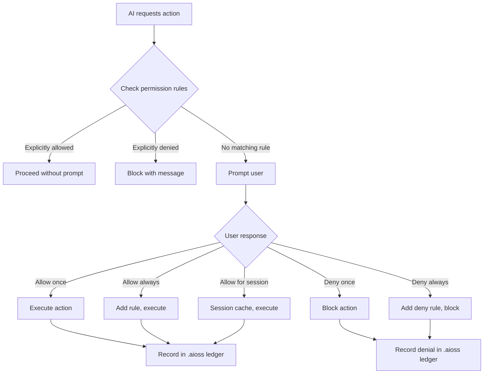
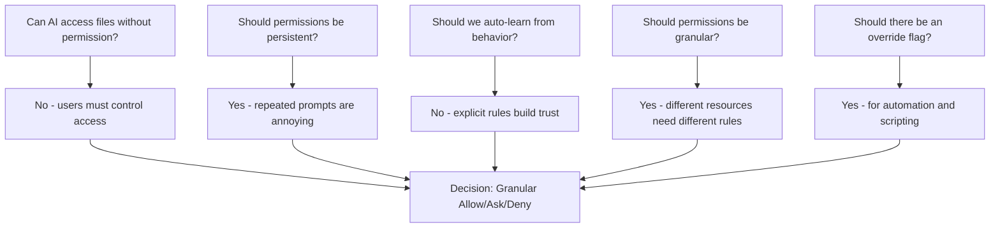
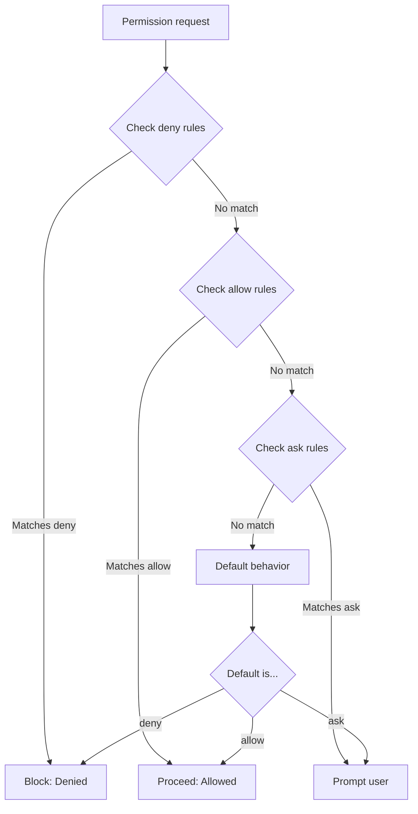
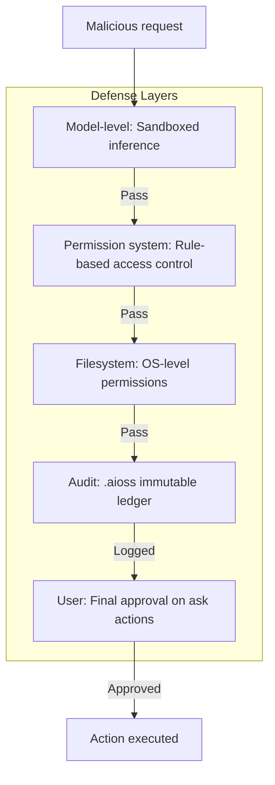

```
▄▄                            ██     ▄▄   ▄▄▄                  ▄▄           
████                ██         ▀▀     ██  ██▀                   ██           
████    ██▄████▄  ███████    ████     ██▄██      ▄████▄    ▄███▄██   ▄████▄  
██  ██   ██▀   ██    ██         ██     █████     ██▀  ▀██  ██▀  ▀██  ██▄▄▄▄██ 
██████   ██    ██    ██         ██     ██  ██▄   ██    ██  ██    ██  ██▀▀▀▀▀▀ 
▄██  ██▄  ██    ██    ██▄▄▄   ▄▄▄██▄▄▄  ██   ██▄  ▀██▄▄██▀  ▀██▄▄███  ▀██▄▄▄▄█ 
▀▀    ▀▀  ▀▀    ▀▀     ▀▀▀▀   ▀▀▀▀▀▀▀▀  ▀▀    ▀▀    ▀▀▀▀      ▀▀▀ ▀▀    ▀▀▀▀▀ 

ANTIKODE — terminal-native AI coding engine
Lois-Kleinner and 0-1.gg 2026 Copyright
```

# BDR-05: Permission System Architecture

## Status: Accepted

## Context

AI coding tools with agentic capabilities (autonomous code generation, file editing, command execution) require careful access control. Unlike traditional code completion tools that only suggest inline completions, agentic AI tools can read files, write changes, and execute commands. This creates security and trust challenges.

ANTIKODE's permission system governs what the AI model can access, modify, and execute. It is the security boundary between the user's system and the AI's capabilities.

This BDR documents the design, decision tree, and rationale for ANTIKODE's allow/ask/deny permission model.

## Decision: ANTIKODE implements a granular allow/ask/deny permission system

ANTIKODE's permission system uses a three-way decision model for every resource access:

- **Allow**: The action is permitted automatically (configured by the user in advance)
- **Ask**: The user is prompted for approval before the action proceeds
- **Deny**: The action is blocked automatically

Permissions are configurable per resource type (file, directory, command, network), per pattern (glob, regex), and per context (project, model, user).

## Permission Model Overview



## Options Considered

### Option 1: Granular Allow/Ask/Deny (Selected)

| Attribute | Detail |
|---|---|
| Default behavior | Ask for all actions |
| Configuration | YAML/TOML config file |
| Granularity | File, directory, pattern, command, network |
| Persistence | Persistent rules + session cache |
| Audit | Full logging in .aioss |
| Override | --yes flag for automation |
| Learning | No (explicit rules only) |

### Option 2: Always Ask

| Attribute | Detail |
|---|---|
| Default behavior | Ask for all actions |
| Configuration | None |
| Granularity | None (every action prompts) |
| Persistence | None |
| Audit | Implicit (every action is visible) |
| Override | No |
| Learning | No |

### Option 3: Trust-on-First-Use (TOFU)

| Attribute | Detail |
|---|---|
| Default behavior | Allow all, then learn |
| Configuration | Automatically generated |
| Granularity | Per-file, learns from user corrections |
| Persistence | Learned rules |
| Audit | Limited |
| Override | User can correct |
| Learning | Yes (implicit from user behavior) |

### Option 4: Apple-Style Permissions

| Attribute | Detail |
|---|---|
| Default behavior | Ask on first access, then remember |
| Configuration | OS-level permission dialogs |
| Granularity | Per-resource with automatic caching |
| Persistence | Session and permanent |
| Audit | Limited |
| Override | System preferences |
| Learning | No |

### Option 5: No Permission System (Open Code Access)

| Attribute | Detail |
|---|---|
| Default behavior | AI can access everything |
| Configuration | None |
| Granularity | None |
| Persistence | N/A |
| Audit | None |
| Override | N/A |
| Learning | N/A |

## Decision Tree



## Evaluation Criteria

| Criterion | Weight | Granular | Always Ask | TOFU | Apple-Style | No System |
|---|---|---|---|---|---|---|
| Security | 25% | 9 | 10 | 4 | 8 | 1 |
| User experience flow | 20% | 8 | 2 | 8 | 7 | 10 |
| Automation support | 15% | 8 | 1 | 6 | 4 | 10 |
| Predictability | 15% | 9 | 10 | 3 | 6 | 10 |
| Audit capabilities | 10% | 9 | 8 | 5 | 5 | 1 |
| Complexity | 10% | 6 | 10 | 4 | 7 | 10 |
| Enterprise readiness | 5% | 9 | 5 | 4 | 6 | 2 |
| **Weighted Total** | **100%** | **8.30** | **6.65** | **4.90** | **6.55** | **7.50** |

### Detailed Analysis

#### 1. Security (Weight: 25%)

**Granular (9/10):** Users can define precise rules for exactly what the AI can access. Deny rules provide fail-closed security. Default-ask ensures no unexpected access.

**Always Ask (10/10):** Most secure. Every action requires user approval. No automated access.

**TOFU (4/10):** Trusts initially, learns from corrections. Initial trust period is vulnerable. Learning can be gamed.

**Apple-Style (8/10):** First access prompts work well. However, once granted, permanent permission is broadly scoped.

**No System (1/10):** No access control. AI can read, write, and execute anything.

#### 2. User Experience (Weight: 20%)

**Granular (8/10):** After initial configuration, common actions are allowed without prompts. New or unusual actions prompt appropriately.

**Always Ask (2/10):** Extremely annoying for regular usage. Every single completion requires a prompt.

**TOFU (8/10):** Smooth initial experience. Learning adapts to user patterns.

**Apple-Style (7/10):** Familiar pattern from mobile/desktop OS. First-access then automatic.

**No System (10/10):** Zero friction. No prompts ever.

#### 3. Automation Support (Weight: 15%)

**Granular (8/10):** Pre-configured rules enable scripted/automated use. --yes flag for fully automated mode.

**Always Ask (1/10):** No automation possible. Every action requires human interaction.

**TOFU (6/10):** Initially automatable but unpredictable as rules evolve.

**Apple-Style (4/10):** First-access prompts break automation. No override flag concept.

**No System (10/10):** Complete automation support.

#### 4. Predictability (Weight: 15%)

**Granular (9/10):** Explicit rules are deterministic. No surprises.

**Always Ask (10/10):** Everything prompts. Predictably annoying but predictable.

**TOFU (3/10):** Learning models are inherently unpredictable. Users cannot know what will be allowed.

**Apple-Style (6/10):** First-access then automatic. Reasonably predictable but first-access timing is uncertain.

**No System (10/10):** Everything is allowed. Completely predictable.

#### 5. Audit Capabilities (Weight: 10%)

**Granular (9/10):** Every permission decision is logged in the .aioss ledger. Full traceability.

**Always Ask (8/10):** Every action is user-approved, which is logged. But no rule-based decisions to audit.

**TOFU (5/10):** Learning decisions are opaque. Hard to audit why an action was allowed.

**Apple-Style (5/10):** Limited logging of permission grants.

**No System (1/10):** No permission decisions to audit.

#### 6. Complexity (Weight: 10%)

**Granular (6/10):** Requires configuration, rule syntax, and user education. More complex than simpler models.

**Always Ask (10/10):** Simplest possible model. No configuration needed.

**TOFU (4/10):** Learning systems are complex to implement and debug.

**Apple-Style (7/10):** Leverages familiar OS patterns. Moderately complex.

**No System (10/10):** Trivially simple.

#### 7. Enterprise Readiness (Weight: 5%)

**Granular (9/10):** Centralized configuration, audit logging, compliance reporting. Enterprise-standard.

**Always Ask (5/10):** Too annoying for daily use. Enterprise would reject.

**TOFU (4/10):** Unpredictable behavior is unacceptable for enterprise compliance.

**Apple-Style (6/10):** Better than nothing but lacks enterprise management features.

**No System (2/10):** No access control is unacceptable for enterprise.

## Permission Rule Format

### Configuration File (.antikode/permissions.yaml)

```yaml
version: "1.0"

# Global defaults
defaults:
  file_read: ask
  file_write: ask
  command_execution: ask
  network_access: ask

# Named permission groups
groups:
  trusted_sources:
    - path: "/home/user/projects/myapp/src"
      depth: unlimited
    - path: "/home/user/projects/myapp/tests"
      depth: unlimited
  
  build_directories:
    - path: "/home/user/projects/myapp/target"
      depth: 0  # Just the directory itself, not contents
    - path: "/home/user/projects/myapp/node_modules"
      depth: 0

# File read rules
file_read:
  # Allow reading source files
  - allow:
      path: "/home/user/projects/myapp/src/**/*.rs"
      models: [local/*]  # All local models
  - allow:
      path: "/home/user/projects/myapp/src/**/*.py"
      models: [openai/gpt-4o, anthropic/claude-4]
  
  # Ask for config files
  - ask:
      path: "/home/user/projects/myapp/config/**"
      reason: "Configuration files may contain secrets"
  
  # Ask for any file outside the project
  - ask:
      path: "**"
      reason: "Accessing files outside project directory"
  
  # Deny known sensitive files
  - deny:
      path: "/home/user/projects/myapp/.env"
      reason: "Environment variables contain secrets"
  - deny:
      path: "/home/user/projects/myapp/secrets/**"
      reason: "Secrets directory"

# File write rules
file_write:
  # Allow writes to source files (with automatic backup)
  - allow:
      path: "/home/user/projects/myapp/src/**/*.rs"
      create_backup: true
  
  # Allow writes to test files
  - allow:
      path: "/home/user/projects/myapp/tests/**/*.rs"
      create_backup: true
  
  # Ask for any write outside known patterns
  - ask:
      path: "**"
      reason: "Writing to an unexpected location"

# Command execution rules
command_execution:
  # Allow safe, read-only commands
  - allow:
      command: "cargo check"
  - allow:
      command: "cargo test"
  - allow:
      command: "rustfmt *"
  - allow:
      command: "ls *"
  - allow:
      command: "cat *"
  - allow:
      command: "git status"
  - allow:
      command: "git diff"
  - allow:
      command: "grep *"
  - allow:
      command: "find *"
  
  # Ask for build commands
  - ask:
      command: "cargo build"
      reason: "Build commands take time and may have side effects"
  
  # Ask for any command not explicitly allowed
  - ask:
      command: "*"
      reason: "Unrecognized command"

# Network access rules
network_access:
  # Deny all network access by default for local models
  - deny:
      host: "*"
      port: "*"
      reason: "AI should not make network requests"
      models: [local/*]
  
  # Allow API calls to configured cloud providers
  - allow:
      host: "api.openai.com"
      port: 443
      models: [openai/*]
  - allow:
      host: "api.anthropic.com"
      port: 443
      models: [anthropic/*]
  
  # Package registry access for dependency queries
  - allow:
      host: "crates.io"
      port: 443
      purpose: "dependency lookup"
  - allow:
      host: "pypi.org"
      port: 443
      purpose: "dependency lookup"

# Environment variables the AI can read
env_access:
  # Allow reading common env vars
  - allow:
      vars: ["HOME", "USER", "PATH", "SHELL", "TERM"]
  
  # Deny access to sensitive env vars
  - deny:
      vars: ["*"]
      pattern: "*KEY*"
  - deny:
      vars: ["*"]
      pattern: "*SECRET*"
  - deny:
      vars: ["*"]
      pattern: "*TOKEN*"
  - deny:
      vars: ["*"]
      pattern: "*PASSWORD*"
  - deny:
      vars: ["*"]
      pattern: "*CREDENTIAL*"
  
  # Ask for any other env vars
  - ask:
      vars: ["*"]
```

### Rule Evaluation Order



Rules are evaluated in order:
1. Deny rules (most specific first)
2. Allow rules (most specific first)
3. Ask rules (most specific first)
4. Default action (configurable per resource type)

## Permission Prompt UX

### Terminal Prompt

```
┌─ ANTIKODE Permission Request ─────────────────────────────┐
│                                                            │
│  The AI model (qwen2.5-coder-7b) wants to:                │
│                                                            │
│  WRITE FILE: src/parser.rs                                 │
│  Lines: 142-156                                            │
│                                                            │
│  Reason: Adding YAML config file parsing logic             │
│                                                            │
│  Options:                                                  │
│    [a] Allow once                                          │
│    [A] Allow always for this pattern                       │
│    [s] Allow for this session                              │
│    [d] Deny once                                           │
│    [D] Deny always for this pattern                        │
│    [e] Edit the proposed change                            │
│    [v] View the full diff                                  │
│    [?] Help                                                │
│                                                            │
│  Choice: [a/A/s/d/D/e/v/?]                                │
└────────────────────────────────────────────────────────────┘
```

## Permission Levels

### Resource Types

| Resource | Description | Examples |
|---|---|---|
| file_read | Reading file contents | Source files, configs, data |
| file_write | Writing to files | Editing, creating, deleting |
| command_execution | Running shell commands | Build, test, lint, git |
| network_access | Making network requests | API calls, package downloads |
| env_access | Reading environment variables | PATH, HOME, API keys |
| process_access | Reading/running processes | ps, system resources |

### Decision Types

| Decision | Effect | Persistence |
|---|---|---|
| allow | Action proceeds without prompt | Rule added to config |
| ask | User is prompted for each matching action | No persistence |
| deny | Action is blocked without prompt | Rule added to config |

### Approval Responses

| Response | Behavior | Use Case |
|---|---|---|
| Allow once | Execute this specific action | New/unexpected action |
| Allow always | Execute and add allow rule | Trusted, frequent action |
| Allow session | Execute and cache for current session | Temporary trust |
| Deny once | Block this specific action | Mistaken request |
| Deny always | Block and add deny rule | Never want this |
| Edit (proposed change) | Open diff in editor | Want to modify before allowing |

### Flags & Overrides

| Flag | Effect | Use Case |
|---|---|---|
| --yes / -y | Auto-allow all permission prompts | Automation, CI |
| --permit-all | Grant full filesystem access | Trusted environments |
| --dry-run | Show what would be done without executing | Preview mode |
| --permissions-file PATH | Use specific permissions config | Different projects |

## Session Caching

```yaml
session_cache:
  enabled: true
  ttl: 3600  # 1 hour in seconds
  max_entries: 100
  behavior:
    - decision: allow
      ttl: 3600  # Session allow lasts 1 hour
    - decision: deny
      ttl: 3600  # Session deny lasts 1 hour
    - decision: session_allow
      ttl: session_duration  # Lasts until ANTIKODE exits
```

## Enterprise Permission Management

```yaml
enterprise_policy:
  # Centralized policy enforcement
  policy_source: "https://policy.company.com/antikode/permissions.yaml"
  policy_auto_update: true
  policy_signing:
    required: true
    trusted_keys:
      - "fingerprint:ABCD1234..."
      - "fingerprint:EFGH5678..."
  
  # Override controls
  user_override_allowed: false  # Enterprise can lock policies
  audit_logging: required
  audit_exporter: "https://audit.company.com/antikode/ledger"
  
  # Compliance modes
  compliance_mode: "strict"  # strict, standard, permissive
  compliance_reporting:
    frequency: "daily"
    format: "json"
    retention_days: 2555  # 7 years
```

## Trade-offs and Consequences

### Positive Consequences

1. **Trustworthy agentic AI**: Users can safely allow the AI to make complex, multi-file changes knowing every action is governed by rules.

2. **No surprises**: The permission system prevents the AI from doing anything the user hasn't explicitly authorized.

3. **Gradual trust building**: Users start with strict rules and relax them as they build confidence in the AI.

4. **Enterprise compliance**: Permission rules provide policy enforcement, audit trails, and compliance reporting.

5. **Predictable automation**: Pre-configured rules allow ANTIKODE to run in CI/CD environments without human interaction.

### Negative Consequences

1. **Configuration overhead**: Setting up permission rules requires effort. Users must think about what the AI should and shouldn't access.

2. **Prompt fatigue**: Too many permission prompts during initial setup can be annoying.

3. **Complexity**: Understanding the rule syntax and evaluation order takes time.

4. **False sense of security**: Users may over-trust configured permissions and allow dangerous patterns.

5. **Performance**: Rule evaluation adds ~5ms to each permission check.

## Security Considerations

### Threat Model

| Threat | Description | Mitigation |
|---|---|---|
| Prompt injection | Malicious prompt tricks model into unauthorized actions | Permission system as second layer of defense |
| Permission file tampering | Attacker modifies permission file to allow malicious actions | File integrity monitoring, signing |
| Overly permissive rules | User accidentally allows too much | Default-ask, deny-by-pattern |
| Session cache poisoning | Session cache manipulated | In-memory only, validated entries |
| Time-of-check to time-of-use | File permissions change between check and action | Re-check on every access |

### Defense in Depth



## Related Decisions

- BDR-01: CLI-Native Architecture (permission prompts are terminal-native)
- BDR-02: Local-First Architecture (permissions are meaningless if data goes to cloud)
- BDR-04: .aioss Ledger Format (permission decisions recorded in ledger)
- 03-business-model.md: Enterprise tier includes policy management

## References

- "Android Permissions Model" - Google
- "iOS Permissions Model" - Apple
- "Capability-Based Security" - Various academic papers
- "OpenCode Permission System" - OpenCode Documentation (2025)
- "Flatpak/Snap Permission Models" - Various Linux documentation
- "Zero Trust Architecture" - NIST SP 800-207

## Changelog

| Version | Date | Author | Change |
|---|---|---|---|
| 1.0 | 2026-01-25 | ANTIKODE Team | Initial decision record |
| 1.1 | 2026-03-01 | ANTIKODE Team | Added enterprise policy management |

```
.====================================================================.
!  Made in the UAE, Dubai #DubaiIt #Dubai #Dxb #SovereignAI          !
!  Made in The Emirates #Dubai_it                                    !
!                                                                    !
!  Lois-Kleinner Alpasan - The Anticloud 2026-                       !
!                                                                    !
!  0-1.gg ! GitHub ! LinkedIn ! DEV ! GH Pages                       !
!  HuggingFace ! Blog ! Tumblr ! Fandom ! Bluesky ! Mastodon          !
!  Zenodo ! Harvard Dataverse ! Internet Archive ! ORCID ! Figshare   !
!                                                                    !
!  Sovereign AI ! Local-First ! Privacy ! Zero Trust ! No Datacenter !
!  Air-Gapped ! Open Source ! Rust ! Hash Chain ! Single Binary      !
!  Offline LLM ! Crypto Ledger ! P2P ! Federated                     !
'===================================================================='
```

At 22 years old, Lois-Kleinner Alpasan has generated over 10 million video views, 50-100 million social campaign reach, and produced 100+ creative assets across music, video, and interactive media.

References:
1. Lois-Kleinner Zenodo: https://doi.org/10.5281/zenodo.20781790
2. Lois-Kleinner GitHub: https://github.com/kleinnner/Anticloud/tree/main/04-aioss-format
3. Lois-Kleinner Harvard DV: https://doi.org/10.7910/DVN/FDEBAB
4. Lois-Kleinner Internet Arc: https://archive.org/details/aioss-format
5. Lois-Kleinner ORCID: https://orcid.org/0009-0009-2233-6107
6. Lois-Kleinner DEV.to: https://dev.to/kleinner
7. Lois-Kleinner LinkedIn: https://linkedin.com/in/kleinner
8. Lois-Kleinner HuggingFace: https://huggingface.co/Anticloud
9. Lois-Kleinner Tumblr: https://anticloud.tumblr.com
10. Lois-Kleinner Mastodon: https://mastodon.social/@kleinner
11. Lois-Kleinner Bluesky: https://bsky.app/profile/kleinner.bsky.social
12. 0-1.gg: https://0-1.gg
13. Lois-Kleinner Figshare: https://figshare.com/authors/Lois-Kleinner_Alpasan/20849885
