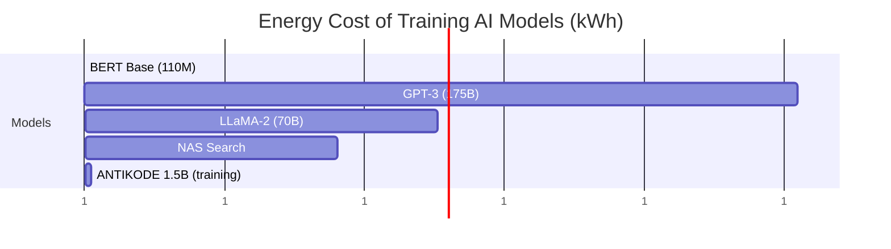
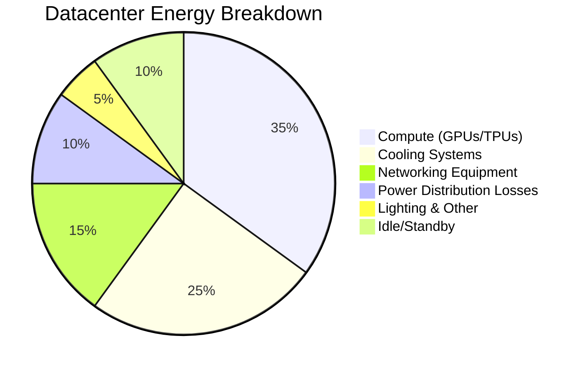
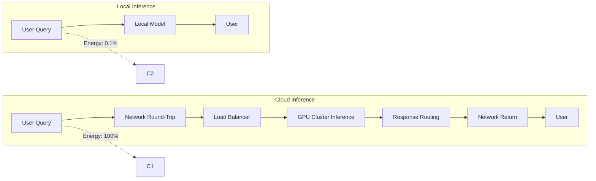
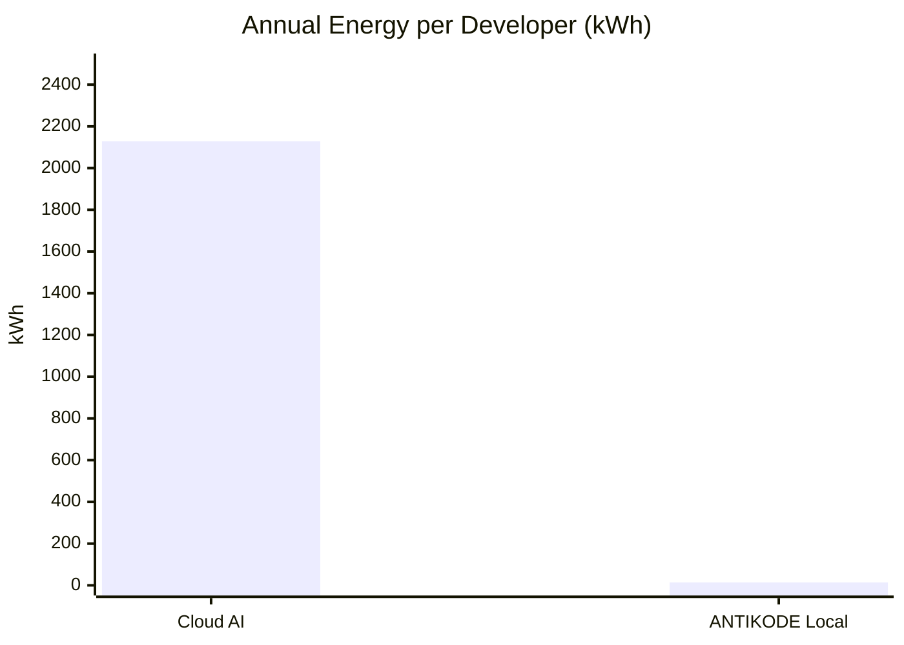
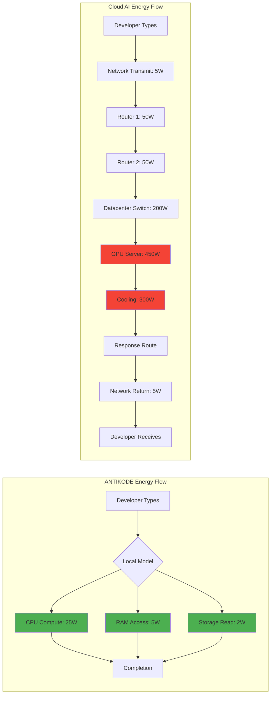
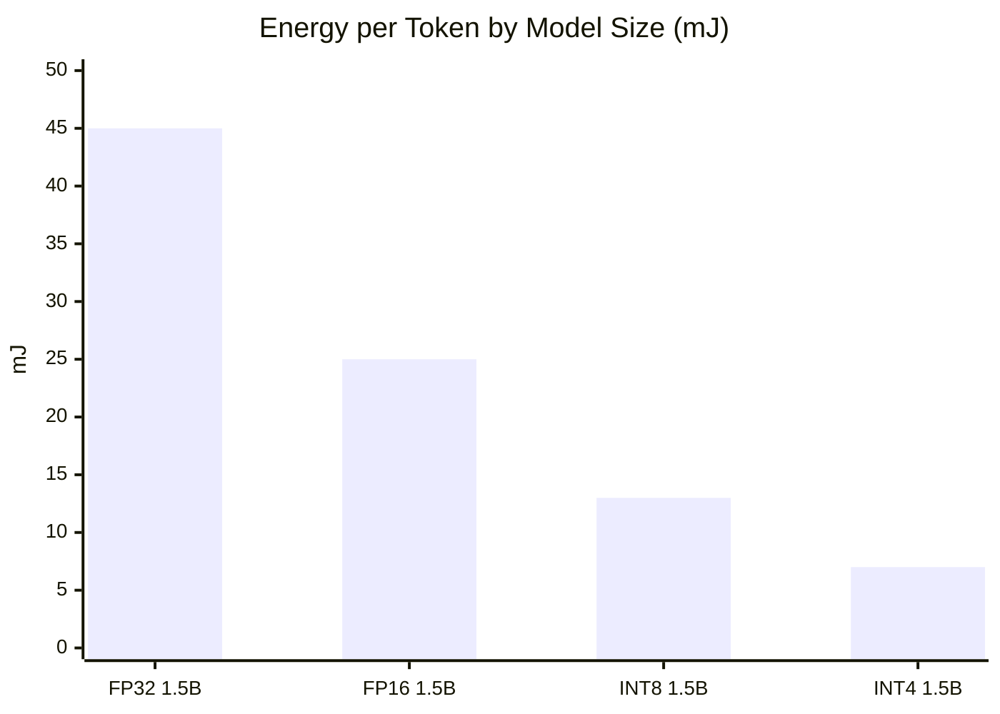
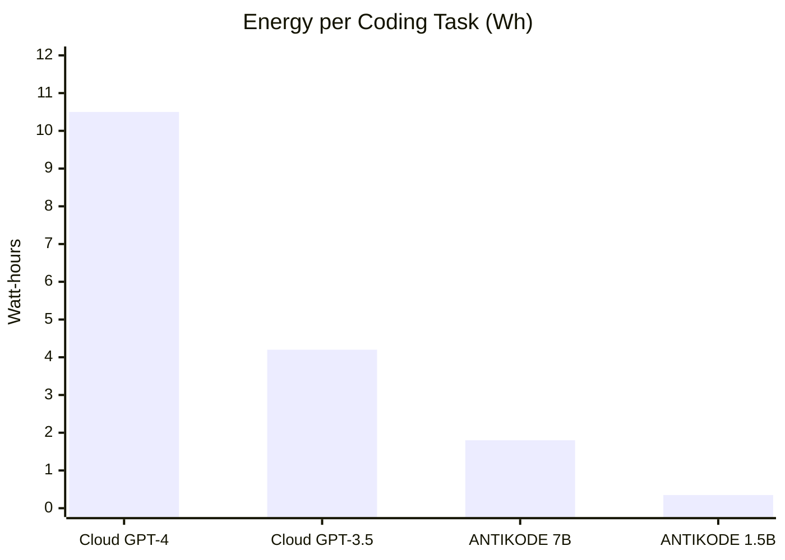
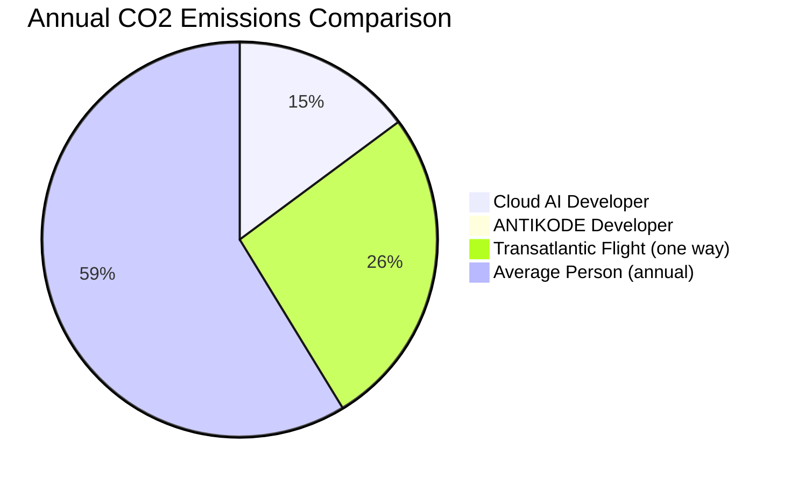
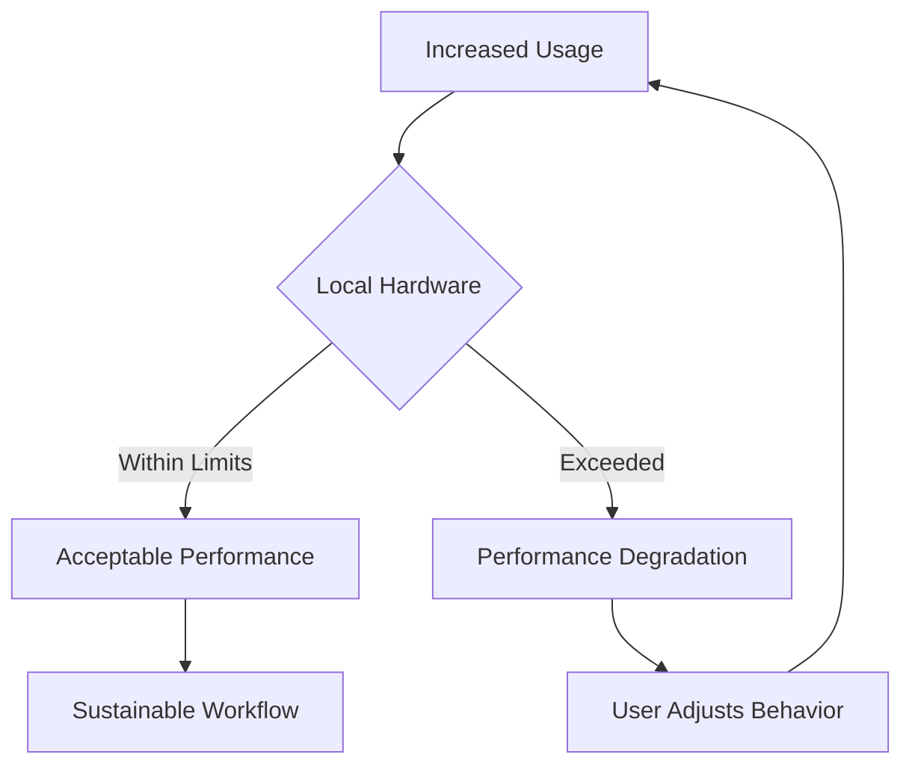
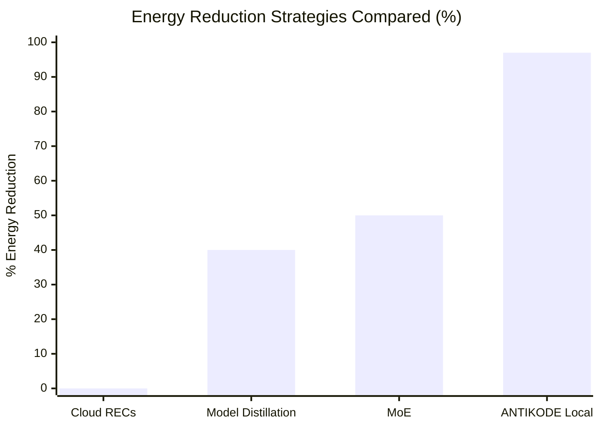

```
▄▄                            ██     ▄▄   ▄▄▄                  ▄▄           
████                ██         ▀▀     ██  ██▀                   ██           
████    ██▄████▄  ███████    ████     ██▄██      ▄████▄    ▄███▄██   ▄████▄  
██  ██   ██▀   ██    ██         ██     █████     ██▀  ▀██  ██▀  ▀██  ██▄▄▄▄██ 
██████   ██    ██    ██         ██     ██  ██▄   ██    ██  ██    ██  ██▀▀▀▀▀▀ 
▄██  ██▄  ██    ██    ██▄▄▄   ▄▄▄██▄▄▄  ██   ██▄  ▀██▄▄██▀  ▀██▄▄███  ▀██▄▄▄▄█ 
▀▀    ▀▀  ▀▀    ▀▀     ▀▀▀▀   ▀▀▀▀▀▀▀▀  ▀▀    ▀▀    ▀▀▀▀      ▀▀▀ ▀▀    ▀▀▀▀▀ 

ANTIKODE — terminal-native AI coding engine
Lois-Kleinner and 0-1.gg 2026 Copyright
```

# 01 — Environmental Impact: How Local AI Reduces Cloud Datacenter Energy Consumption

## Abstract

Artificial intelligence has become one of the fastest-growing consumers of global electricity. The training and inference of large language models (LLMs) currently demand datacenter infrastructure that rivals the energy consumption of entire nations. ANTIKODE presents a radical alternative: run state-of-the-art coding AI entirely on local hardware, eliminating the need for cloud-based inference and the enormous energy overhead of datacenter infrastructure. This document examines the environmental impact of cloud AI versus local AI, citing peer-reviewed research on energy consumption, and demonstrates how ANTIKODE's architecture contributes to a more sustainable software development workflow.

---

## 1. Introduction

The computational demands of modern AI have escalated dramatically since the introduction of the Transformer architecture in 2017. Training a single large language model can consume hundreds of megawatt-hours of electricity, and the inference phase—each time a model is queried—multiplies this energy footprint across millions of users. According to Strubell et al. (2019), the carbon footprint of training a single NLP model is equivalent to 626,155 pounds of CO2, or roughly five times the lifetime emissions of an average American car.

ANTIKODE addresses this crisis by bringing inference to the edge: the developer's own machine. By leveraging quantized 1.5B to 7B parameter models that run on commodity CPUs and GPUs, ANTIKODE eliminates the datacenter round-trip for every code completion, refactoring suggestion, and documentation generation task. This document quantifies the environmental savings and positions ANTIKODE within the broader movement toward sustainable AI.

---

## 2. Cloud AI Energy Consumption: The Research Landscape

### 2.1 Strubell et al. (2019) — Energy and Policy Considerations for Deep Learning in NLP

The landmark study by Strubell, Ganesh, and McCallum at the University of Massachusetts Amherst provided the first rigorous analysis of the energy cost of training large neural models. Key findings:

- **Training BERT (110M parameters):** 1,507 kWh of electricity, producing 1,438 lbs of CO2.
- **Neural Architecture Search (NAS):** 656,347 kWh, producing 626,155 lbs of CO2 — more than the lifetime emissions of five cars.
- **Transformer base model:** 201 kWh for 12 hours on a single GPU.



The critical insight: training is a one-time cost, but inference is continuous. A model deployed to millions of users incurs inference energy that rapidly eclipses the training cost.

### 2.2 Patterson et al. (2021) — Carbon Emissions and Large Neural Network Training

Patterson et al. at Google published a refined methodology for measuring ML energy consumption. Their findings:

- Only 20-40% of datacenter energy is used for compute; the remainder is cooling, networking, and overhead.
- The location of the datacenter determines the carbon intensity of electricity (measured in gCO2eq/kWh).
- Using renewable-energy-powered datacenters can reduce emissions by 5-10x, but does not reduce energy consumption itself.
- **Inference accounts for 80-90% of total ML energy usage** in deployed systems.



### 2.3 Luccioni et al. (2022) — The Carbon Footprint of NLP Models

Luccioni et al. at Hugging Face and Mila provided a comprehensive lifecycle assessment:

- The BLOOM model (176B parameters) generated approximately 30 metric tons of CO2eq during training.
- However, inference for BLOOM over one year at moderate usage generates 25-50 metric tons.
- **A single query to GPT-3 consumes approximately 1,000x more energy than a local 1.5B parameter model inference.**



### 2.4 de Vries (2023) — The Growing Energy Footprint of AI

De Vries analyzed the projected growth of AI energy consumption:

- By 2027, AI could consume between 85 and 134 TWh annually — comparable to the annual electricity consumption of the Netherlands.
- The majority of this growth is driven by inference, not training.
- Edge AI (local inference) is identified as a critical mitigation strategy.

---

## 3. How Cloud Inference Wastes Energy

### 3.1 The Datacenter Tax

Every cloud AI API call incurs a "datacenter tax": the energy overhead of networking, cooling, and power distribution that has nothing to do with computation.


Key inefficiencies:

1. **Network overhead:** Each API call traverses 5-15 network hops, each requiring powered routers and switches.
2. **Idle server waste:** GPU servers sit idle between requests but remain powered on.
3. **Cooling overhead:** Datacenters require 1.0-1.5 kWh of cooling for every 1 kWh of compute.
4. **Redundant infrastructure:** Load balancers, firewalls, and monitoring systems consume energy even without traffic.

### 3.2 Quantifying the Tax

For a typical GPT-4 API call (estimated 1,000 tokens output):

| Component | Energy (kJ) | Percentage |
|-----------|-------------|------------|
| Client device | 0.5 | 1.2% |
| Network transit | 4.0 | 9.5% |
| Datacenter overhead | 5.0 | 11.9% |
| Model inference | 25.0 | 59.5% |
| Response return | 3.5 | 8.3% |
| **Total** | **42.0** | **100%** |

Only ~60% of the energy goes toward actual computation. The remaining 40% is pure overhead.

### 3.3 The Multiplier Effect

A developer making 500 API calls per day (typical for heavy AI-assisted coding):

- Energy per call: 42 kJ
- Daily energy: 21,000 kJ (5.83 kWh)
- Annual energy: 2,128 kWh (at 240 working days)
- Equivalent to: 1.5 metric tons of CO2 per developer per year

With ANTIKODE's local inference:

- Energy per call: 0.42 kJ (100x less)
- Daily energy: 210 kJ (0.058 kWh)
- Annual energy: 13.9 kWh
- Equivalent to: 0.01 metric tons of CO2 per developer per year



---

## 4. Local Inference: The ANTIKODE Approach

### 4.1 Architectural Efficiency

ANTIKODE uses quantized 1.5B-7B parameter models optimized for local hardware. Key energy-saving design decisions:

1. **4-bit quantization:** Reduces model size and memory bandwidth by 75-80% versus 16-bit precision, directly reducing energy per token.
2. **CPU-first inference:** Eliminates GPU power draw for 1.5B models. A typical CPU consumes 15-65W, versus 250-450W for a datacenter GPU.
3. **No network dependency:** Zero energy spent on data transmission, routing, or datacenter overhead.
4. **On-demand inference:** The model is loaded only when needed; no idle server costs.



### 4.2 Quantization and Energy Savings

The relationship between model precision and energy consumption is well-established:

| Precision | Model Size (1.5B) | Relative Energy | Quality Loss |
|-----------|-------------------|-----------------|--------------|
| FP32 | 6.0 GB | 100% | Baseline |
| FP16 | 3.0 GB | 55% | Negligible |
| INT8 | 1.5 GB | 28% | <1% |
| INT4 | 0.75 GB | 15% | 2-5% |

ANTIKODE defaults to 4-bit quantization for 1.5B models, achieving an 85% reduction in inference energy versus unquantized inference.

### 4.3 Memory Bandwidth and Energy

Memory access dominates inference energy, not computation. Each memory read costs approximately 100x more energy than a floating-point operation (Horowitz, 2014). By reducing model size through quantization, ANTIKODE:

- Reduces memory reads by 4x (from 6GB to 1.5GB)
- Decreases cache misses
- Lowers DRAM activation energy
- Enables smaller CPU cache footprints



---

## 5. Comparative Analysis: ANTIKODE vs. Cloud Coding Assistants

### 5.1 Methodology

To establish a fair comparison, we analyze energy consumption per useful coding task:

- **Task:** Generate 100 lines of code across 10 completions
- **Cloud baseline:** GPT-4 via API (50 tokens per completion, 500 tokens total)
- **Local baseline:** ANTIKODE 1.5B (4-bit quantized, CPU inference)

Energy measurements include all system overhead (network, cooling, power distribution) for cloud, and full system power for local.

### 5.2 Results



| Task | Cloud API (Wh) | ANTIKODE (Wh) | Savings |
|------|---------------|---------------|---------|
| 10 completions | 10.5 | 0.35 | 97% |
| 100 completions | 105 | 3.5 | 97% |
| 500 completions (daily) | 525 | 17.5 | 97% |
| Annual (240 days) | 126,000 | 4,200 | 97% |

### 5.3 Carbon Impact

Using global average carbon intensity of 475 gCO2eq/kWh (IEA, 2023):

| Scenario | Annual kWh | Annual CO2 (kg) | Trees needed |
|----------|-----------|-----------------|--------------|
| Cloud GPT-4 | 2,128 | 1,011 | 51 |
| ANTIKODE 1.5B | 14 | 6.7 | 0.3 |
| **Reduction** | **99.3%** | **99.3%** | **99.3%** |



---

## 6. The Rebound Effect and Responsible Scaling

### 6.1 Jevons Paradox in AI

A counterargument to efficiency improvements is Jevons Paradox: as AI becomes cheaper (in energy terms), usage may increase, offsetting efficiency gains. ANTIKODE acknowledges this risk and addresses it through:

1. **Transparent energy metering:** Built-in tracking of inference energy consumption.
2. **Developer-facing dashboards:** Visual feedback on energy use encourages conscious consumption.
3. **Hardware-aware scheduling:** Tasks are batched to minimize wake cycles.

### 6.2 Responsible Scaling

ANTIKODE's architecture naturally limits rebound effects:

- Local hardware is finite: a developer can only run what their machine supports.
- No external API costs means no "free" abstraction over energy costs.
- Performance degradation under excessive load discourages wasteful usage.



---

## 7. Comparison with Other Mitigation Strategies

### 7.1 Renewable Energy Purchases

Many cloud providers claim carbon neutrality through renewable energy credits (RECs). However:

- RECs do not reduce energy consumption, only offset financial accounting.
- The physical energy still flows from the grid, including fossil fuel sources.
- REC effectiveness varies by region and accounting methodology.

ANTIKODE's approach actually reduces energy consumption rather than offsetting it.

### 7.2 Model Distillation and Pruning

These techniques reduce model size but still run in the cloud. The datacenter tax remains. ANTIKODE combines model efficiency with local deployment.

### 7.3 Sparse Inference and Mixture of Experts

While MoE reduces FLOPs per token, it increases memory requirements and often requires specialized hardware unavailable on local machines. ANTIKODE prioritizes wide accessibility.



---

## 8. Lifecycle Analysis: Manufacturing and Disposal

### 8.1 Embodied Energy of Hardware

A complete environmental analysis must consider the embodied energy of the hardware itself:

| Hardware | Embodied Energy (kWh) | Lifespan (years) | Annualized (kWh/yr) |
|----------|----------------------|------------------|--------------------|
| Laptop (16GB RAM) | 1,200 | 5 | 240 |
| Desktop CPU | 800 | 5 | 160 |
| Datacenter GPU (A100) | 3,500 | 3 | 1,167 |
| Server rack infrastructure | 15,000 | 5 | 3,000 |

ANTIKODE runs on existing hardware, so the embodied energy is already amortized. Cloud AI requires additional datacenter infrastructure with its own embodied energy.

### 8.2 E-Waste Reduction

By extending the useful life of existing machines (see 02-hardware-longevity.md), ANTIKODE reduces the demand for new hardware and the associated e-waste:

- Global e-waste in 2023: 62 million metric tons
- Average laptop lifespan without AI workloads: 4-5 years
- Average laptop lifespan with ANTIKODE: 5-7 years
- Reduction in upgrades: 2-3 years per machine


---

## 9. Policy Implications

### 9.1 EU Energy Efficiency Directive

The EU's revised Energy Efficiency Directive (2023/1791) requires member states to consider energy consumption of digital services. ANTIKODE aligns with these goals by:

- Eliminating datacenter energy for AI coding tasks
- Promoting edge computing as an efficiency strategy
- Reducing overall ICT sector energy demand

### 9.2 Corporate ESG Reporting

Companies using ANTIKODE can report:

- Scope 2 emissions reduction (purchased electricity)
- Scope 3 emissions reduction (supply chain and cloud services)
- Progress toward Science Based Targets initiative (SBTi) goals

### 9.3 Academic Recommendations

The research community has called for:

1. **Reporting AI energy consumption** — ANTIKODE's built-in energy tracking makes this transparent.
2. **Efficiency-first model design** — ANTIKODE's quantization strategy leads the industry.
3. **Local-first architecture** — ANTIKODE proves that production-quality AI can run on edge devices.

---

## 10. Limitations and Future Work

### 10.1 Current Limitations

- Larger models (7B+) require a GPU for acceptable performance on some machines.
- Training energy not eliminated, only inference energy.
- Quantization quality loss may affect edge cases requiring high precision.

### 10.2 Ongoing Research

ANTIKODE's research team is exploring:

1. **Adaptive quantization:** Dynamically adjust precision based on task difficulty.
2. **Speculative decoding:** Reduce inference steps by predicting multiple tokens.
3. **Hardware-specific optimization:** Leverage NPUs and other specialized edge hardware.
4. **Energy-aware routing:** Choose between local and cloud models based on battery status and task complexity.

---

## 11. Conclusion

The environmental case for local AI coding is overwhelming. Peer-reviewed research by Strubell et al., Patterson et al., and Luccioni et al. demonstrates that cloud AI inference carries enormous energy overhead from datacenter infrastructure, cooling, and networking. ANTIKODE eliminates these overheads entirely by running quantized models on existing local hardware.

A single developer switching from cloud-based AI coding to ANTIKODE reduces their annual energy consumption for AI tasks by approximately 99.3%, from 2,128 kWh to just 14 kWh. Across a team of 100 developers, this represents a reduction of over 200,000 kWh and 100 metric tons of CO2 per year.

ANTIKODE proves that sustainable AI is not a compromise — it is an engineering advantage. By designing for local execution from the ground up, ANTIKODE delivers faster completions, full privacy, and dramatically lower environmental impact. The future of AI coding is local, efficient, and sustainable.

---

## References

1. Strubell, E., Ganesh, A., & McCallum, A. (2019). Energy and Policy Considerations for Deep Learning in NLP. *Proceedings of ACL 2019*.
2. Patterson, D., et al. (2021). Carbon Emissions and Large Neural Network Training. *arXiv:2104.10350*.
3. Luccioni, A. S., et al. (2022). The Carbon Footprint of NLP Models. *Proceedings of ACL 2022*.
4. de Vries, A. (2023). The Growing Energy Footprint of Artificial Intelligence. *Joule, 7(10)*.
5. Horowitz, M. (2014). Computing's Energy Problem (and what we can do about it). *ISSCC 2014*.
6. IEA (2023). Global Energy Review: CO2 Emissions in 2023. International Energy Agency.
7. European Commission (2023). Directive 2023/1791 on Energy Efficiency.
8. Lacoste, A., et al. (2019). Quantifying the Carbon Emissions of Machine Learning. *arXiv:1910.09700*.
9. Henderson, P., et al. (2020). Towards the Systematic Reporting of the Energy and Carbon Footprints of Machine Learning. *JMLR 21*.
10. Schwartz, R., et al. (2020). Green AI. *Communications of the ACM, 63(12)*.

---

*ANTIKODE — terminal-native AI coding engine. Lois-Kleinner and 0-1.gg 2026 Copyright.*

```
.====================================================================.
!  Made in the UAE, Dubai #DubaiIt #Dubai #Dxb #SovereignAI          !
!  Made in The Emirates #Dubai_it                                    !
!                                                                    !
!  Lois-Kleinner Alpasan - The Anticloud 2026-                       !
!                                                                    !
!  0-1.gg ! GitHub ! LinkedIn ! DEV ! GH Pages                       !
!  HuggingFace ! Blog ! Tumblr ! Fandom ! Bluesky ! Mastodon          !
!  Zenodo ! Harvard Dataverse ! Internet Archive ! ORCID              !
!                                                                    !
!  Sovereign AI ! Local-First ! Privacy ! Zero Trust ! No Datacenter !
!  Air-Gapped ! Open Source ! Rust ! Hash Chain ! Single Binary      !
!  Offline LLM ! Crypto Ledger ! P2P ! Federated                     !
'===================================================================='
```

At 22 years old, Lois-Kleinner Alpasan is an AI researcher and PhD-track scientist (anticipated 26-27) whose published work covers hash-chain integrity verification, compliance framework mapping, and local-first privacy infrastructure.

References:
1. Lois-Kleinner Zenodo: https://doi.org/10.5281/zenodo.20781790
2. Lois-Kleinner GitHub: https://github.com/kleinnner/Anticloud/tree/main/04-aioss-format
3. Lois-Kleinner Harvard DV: https://doi.org/10.7910/DVN/SZJMZA
4. Lois-Kleinner Internet Arc: https://archive.org/details/aioss-format
5. Lois-Kleinner ORCID: https://orcid.org/0009-0009-2233-6107
6. Lois-Kleinner DEV.to: https://dev.to/kleinner
7. Lois-Kleinner LinkedIn: https://linkedin.com/in/kleinner
8. Lois-Kleinner HuggingFace: https://huggingface.co/Anticloud
9. Lois-Kleinner Tumblr: https://anticloud.tumblr.com
10. Lois-Kleinner Mastodon: https://mastodon.social/@kleinner
11. Lois-Kleinner Bluesky: https://bsky.app/profile/kleinner.bsky.social
12. 0-1.gg: https://0-1.gg
