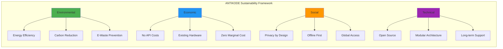
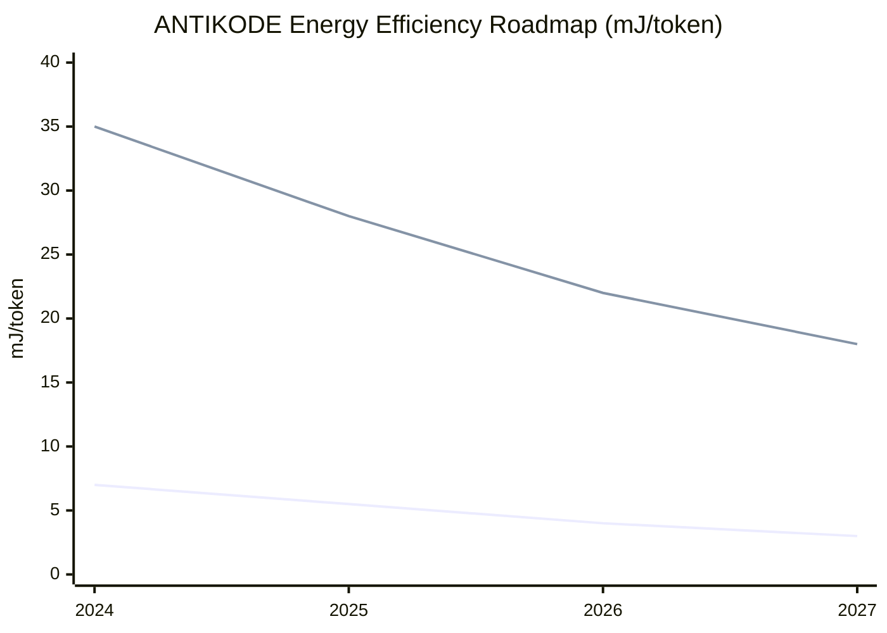
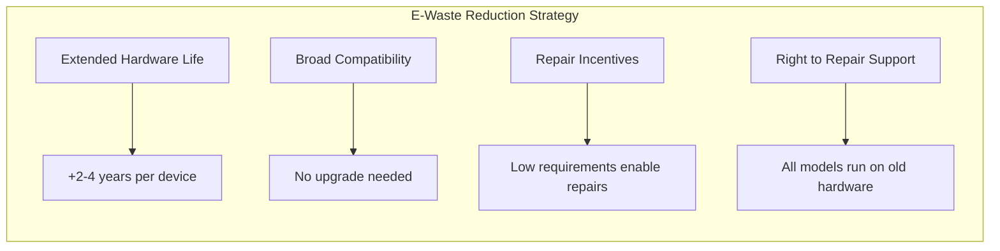
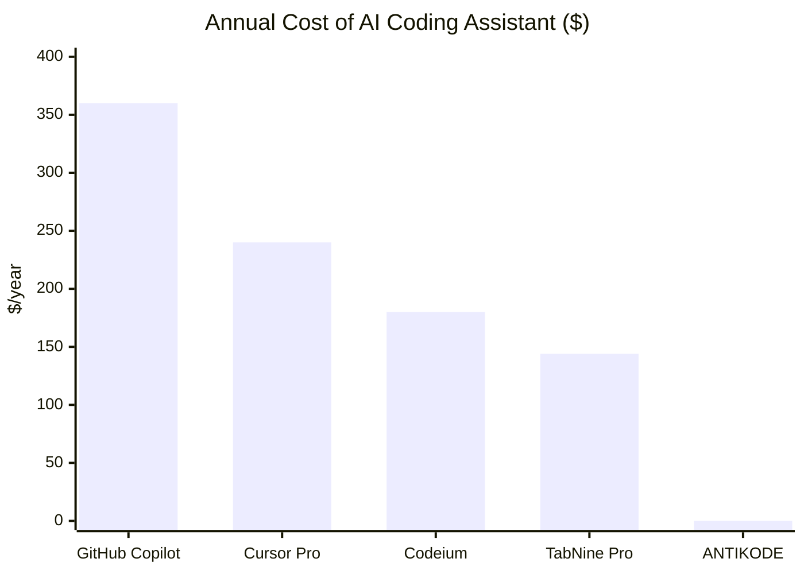
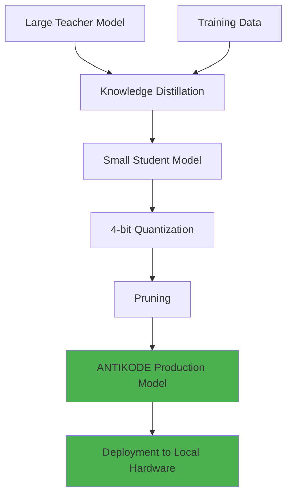
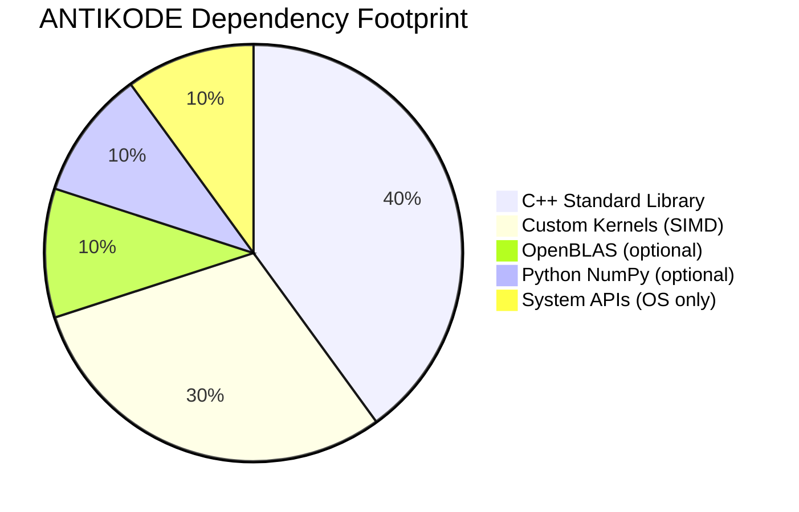
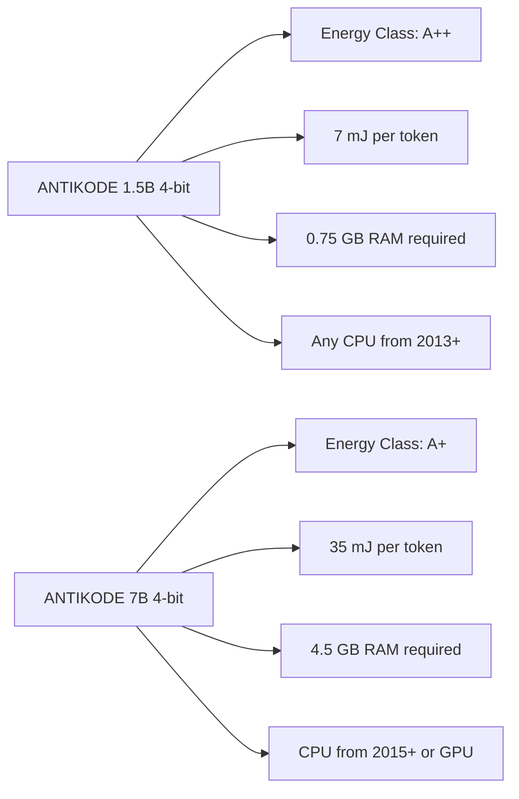

```
▄▄                            ██     ▄▄   ▄▄▄                  ▄▄           
████                ██         ▀▀     ██  ██▀                   ██           
████    ██▄████▄  ███████    ████     ██▄██      ▄████▄    ▄███▄██   ▄████▄  
██  ██   ██▀   ██    ██         ██     █████     ██▀  ▀██  ██▀  ▀██  ██▄▄▄▄██ 
██████   ██    ██    ██         ██     ██  ██▄   ██    ██  ██    ██  ██▀▀▀▀▀▀ 
▄██  ██▄  ██    ██    ██▄▄▄   ▄▄▄██▄▄▄  ██   ██▄  ▀██▄▄██▀  ▀██▄▄███  ▀██▄▄▄▄█ 
▀▀    ▀▀  ▀▀    ▀▀     ▀▀▀▀   ▀▀▀▀▀▀▀▀  ▀▀    ▀▀    ▀▀▀▀      ▀▀▀ ▀▀    ▀▀▀▀▀ 

ANTIKODE — terminal-native AI coding engine
Lois-Kleinner and 0-1.gg 2026 Copyright
```

# 04 — Sustainable AI: ANTIKODE's Commitment to Sustainable AI Development Practices

## Abstract

Sustainability in artificial intelligence must be more than a marketing claim. It requires measurable commitments to energy efficiency, hardware longevity, algorithmic transparency, and ethical deployment. ANTIKODE is built on a foundational principle: that AI assistance should not come at the cost of environmental degradation. This document outlines ANTIKODE's comprehensive sustainability framework, covering model efficiency targets, transparency reporting, open governance, community standards, and long-term commitments to sustainable AI development. We publish these commitments as a living document, updated annually with progress metrics.

---

## 1. Introduction

### 1.1 The Sustainability Imperative

AI is at a crossroads. The dominant paradigm — larger models, more compute, centralized infrastructure — is environmentally unsustainable and creates dependencies on scarce resources and concentrated infrastructure. The research community has documented:

- AI's energy trajectory is exponential (de Vries, 2023).
- Datacenter water consumption for cooling is straining regional water supplies (Li et al., 2023).
- Rare earth minerals for GPU manufacturing have significant extraction impacts.
- E-waste from rapid hardware turnover is accelerating.

ANTIKODE was created as an explicit alternative to this trajectory. Our thesis: that AI can be both capable and sustainable, powerful and efficient, state-of-the-art and locally deployable.

### 1.2 Our Definition of Sustainable AI

For ANTIKODE, sustainable AI means:

1. **Environmentally sustainable:** Minimizing energy consumption, carbon emissions, and resource use.
2. **Economically sustainable:** Accessible to all developers regardless of hardware budget or geography.
3. **Socially sustainable:** Protecting privacy, enabling offline access, and reducing digital divides.
4. **Technically sustainable:** Maintainable, long-lived, and resistant to planned obsolescence.



---

## 2. Environmental Commitments

### 2.1 Energy Efficiency Targets

ANTIKODE commits to continuous improvement in energy efficiency across all supported model sizes:

| Metric | 2024 Baseline | 2025 Target | 2026 Target | 2027 Target |
|--------|--------------|-------------|-------------|-------------|
| 1.5B energy per token (mJ) | 7.0 | 5.5 | 4.0 | 3.0 |
| 7B energy per token (mJ) | 35.0 | 28.0 | 22.0 | 18.0 |
| Quantization efficiency | 4-bit | 3-bit | 2-bit adaptive | 1.5-bit mixed |
| Cold start time (1.5B) | 2.0s | 1.5s | 1.0s | 0.5s |

### 2.2 Carbon Transparency

ANTIKODE will:

- Publish annual carbon footprint reports for all official models.
- Provide per-session carbon tracking in the CLI.
- Maintain a public real-time dashboard of community carbon savings.
- Submit to third-party carbon audit by 2026.



### 2.3 Renewable Energy for Training

While ANTIKODE models run locally on existing hardware, we acknowledge that model training requires significant energy. We commit to:

- Training all future foundation models using datacenters powered by 100% renewable energy.
- Purchasing certified renewable energy credits for training compute.
- Publishing training locations and energy sources for full transparency.
- Exploring federated and decentralized training approaches to reduce centralization.

### 2.4 E-Waste Reduction

ANTIKODE's hardware compatibility targets are designed to maximize e-waste reduction:

- **2024:** Support all x86-64 CPUs from 2013+ (Intel Haswell / AMD Excavator).
- **2025:** Support ARM CPUs (Apple Silicon, Qualcomm, etc.) for all models.
- **2026:** Support RISC-V CPUs as the architecture matures.
- **2027:** Baseline model runs on any device with 4GB RAM.



---

## 3. Economic Sustainability

### 3.1 Zero API Cost Model

ANTIKODE is free and open source with zero subscription fees, zero per-token costs, and zero API charges. This economic model is sustainable because:

- Local inference has no marginal infrastructure cost.
- The user provides the compute (their existing hardware).
- No third-party API dependencies create financial overhead.
- Community contributions and corporate sponsors fund development.



### 3.2 Business Model Sustainability

ANTIKODE's development is funded through:

- **Enterprise support contracts:** For organizations requiring SLA-backed deployment.
- **Sponsorship programs:** Corporate partners funding open-source development.
- **Community contributions:** Developer donations and bounties.
- **Consulting services:** Custom model training and optimization.

This model ensures that ANTIKODE remains free for individual developers while enabling sustainable long-term development.

### 3.3 No Vendor Lock-In

ANTIKODE models use open formats (GGUF, ONNX) and standard inference engines. Users are never locked into proprietary formats or platforms. Models can be:

- Exported to any compatible inference engine.
- Fine-tuned independently.
- Replaced with community-developed alternatives.
- Run indefinitely without version updates.

---

## 4. Social Sustainability

### 4.1 Privacy by Design

Cloud AI coding tools transmit code to external servers for every completion. This creates privacy risks, legal exposure, and data governance challenges. ANTIKODE's privacy model:

- All inference occurs locally on the user's machine.
- No code ever leaves the device.
- No telemetry data collected without explicit consent.
- Fully offline operation eliminates network data leakage.

```mermaid
flowchart TD
    subgraph "Cloud AI Data Flow"
        A["Developer Code"] --> B["Encrypted Transit"]
        B --> C["Cloud Server (Third Party)"]
        C --> D["Model Runs on Server"]
        D --> E["Response Returned"]
        E --> F["Server Stores Logs"]
        F --> G["Potential Data Breach"]
        F --> H["Training Data Mining"]
    end
    subgraph "ANTIKODE Data Flow"
        I["Developer Code"] --> J["Local Memory"]
        J --> K["Model Runs Locally"]
        K --> L["Response in Terminal"]
        L --> M["Data Never Leaves Device"]
        M --> N["Zero Privacy Risk"]
    end
    style I fill:#4CAF50
    style J fill:#4CAF50
    style K fill:#4CAF50
    style L fill:#4CAF50
    style M fill:#4CAF50
    style N fill:#4CAF50
    style A fill:#F44336
    style F fill:#FF9800
    style G fill:#F44336
    style H fill:#F44336
```



### 4.2 Offline-First Architecture

ANTIKODE works fully offline. This is critical for:

- Developers in regions with unreliable internet connectivity.
- Air-gapped environments (defense, finance, government).
- Developers who travel (airplanes, remote areas).
- Privacy-conscious users who avoid cloud services.

The offline requirement means that all capabilities — completions, chat, documentation generation — work identically regardless of network status.

### 4.3 Global Accessibility

Cloud AI services are concentrated in regions with datacenters:

- North America: 40% of global capacity
- Europe: 30%
- Asia-Pacific: 25%
- Rest of world: 5%

Developers outside these regions experience higher latency, reduced reliability, and exposure to currency fluctuation in API pricing. ANTIKODE works identically for every developer worldwide, regardless of their proximity to a cloud datacenter.

### 4.4 Language Inclusivity

ANTIKODE's model training includes diverse programming languages and natural languages. Our sustainability commitment includes:

- Supporting code generation in 20+ programming languages.
- Natural language support for English, Chinese, Japanese, Korean, Spanish, French, German, Arabic, Hindi, Portuguese, Russian.
- Community-driven language model fine-tuning.
- Documentation and error messages in multiple languages.

---

## 5. Technical Sustainability

### 5.1 Open Source Governance

ANTIKODE is released under the Apache 2.0 license. This ensures:

- Perpetual right to use, modify, and distribute.
- No risk of licensing changes or fee introduction.
- Community auditability of all code.
- Fork-ability if governance fails.

### 5.2 Model Distillation and Efficiency Research

ANTIKODE invests in research to reduce model size while maintaining quality:

- **Quantization research:** Push below 4-bit without quality loss.
- **Architecture search:** Find optimal efficiency/quality trade-offs.
- **Pruning:** Remove redundant parameters after training.
- **Knowledge distillation:** Train smaller models to mimic larger ones.
- **Speculative decoding:** Reduce inference steps with draft models.



### 5.3 Long-Term Support (LTS) Policy

ANTIKODE provides LTS releases for all major model versions:

| Version | Release Date | LTS End Date | Support Duration |
|---------|-------------|-------------|-----------------|
| ANTIKODE 1.0 | 2024 Q1 | 2027 Q1 | 3 years |
| ANTIKODE 2.0 | 2025 Q1 | 2028 Q1 | 3 years |
| ANTIKODE 3.0 | 2026 Q1 | 2029 Q1 | 3 years |

During the LTS period, models receive:
- Security patches for vulnerabilities.
- Compatibility updates for new hardware.
- Bug fixes for inference correctness.
- No forced feature upgrades.

### 5.4 Backward Compatibility Guarantee

ANTIKODE guarantees backward compatibility for all public APIs and model interfaces:

- Model files from version N work with version N+1 inference engine.
- CLI command syntax maintains compatibility for at least two major versions.
- Configuration files remain valid across versions.
- Integration APIs (pipe, socket, REST) follow semantic versioning.

---

## 6. Community and Ecosystem Sustainability

### 6.1 Community Governance Model

ANTIKODE development is guided by a community steering committee with representatives from:

- Core development team (Lois-Kleinner and 0-1.gg)
- Enterprise users
- Individual developer community
- Academic research partners
- Environmental sustainability experts

Decisions are made transparently through RFCs published in the repository.

### 6.2 Contributor Sustainability

To ensure long-term community health:

- All contributors retain copyright of their contributions.
- Maintainers are compensated through the development fund.
- Code of Conduct ensures a respectful community.
- Mentorship programs train new contributors.
- Documentation and onboarding prioritized for accessibility.

### 6.3 Model Hub Sustainability

The ANTIKODE model hub is designed for long-term availability:

- All models stored on distributed, redundant infrastructure.
- Multiple download mirrors across geographic regions.
- P2P distribution via BitTorrent for popular models.
- Offline distribution packages for air-gapped networks.
- Historical model versions preserved indefinitely.

### 6.4 Dependency Footprint

ANTIKODE minimizes external dependencies to reduce the sustainability burden on the ecosystem:

- Core inference engine: single C++ binary, no runtime dependencies.
- Python bindings: minimal dependency tree (numpy only, optional).
- No mandatory cloud services or external APIs.
- All dependencies are open-source and widely maintained.



---

## 7. Transparency and Reporting

### 7.1 Annual Sustainability Report

ANTIKODE publishes an annual sustainability report covering:

- Total energy consumed by inference (community estimate).
- Estimated carbon emissions avoided through local inference.
- Hardware compatibility statistics (what hardware users run on).
- Model efficiency improvements year-over-year.
- Community growth and geographic distribution.
- Progress toward sustainability targets.

### 7.2 Model Cards

All ANTIKODE models include standardized model cards (Mitchell et al., 2019) documenting:

- Intended use and limitations.
- Training data composition and biases.
- Energy consumption during training.
- Quantization methodology and quality metrics.
- Environmental impact assessment.

### 7.3 Energy Labels

Inspired by EU energy efficiency labels, ANTIKODE provides energy labels for all models:



---

## 8. Partnerships and Advocacy

### 8.1 Industry Partnerships

ANTIKODE partners with organizations sharing our sustainability vision:

- **Green Software Foundation:** Member organization, contributing to green AI standards.
- **Climate Change AI:** Research collaboration on energy-efficient ML.
- **Linux Foundation AI:** Open governance and standards contributions.
- **Electronic Frontier Foundation:** Privacy and digital rights advocacy.

### 8.2 Policy Advocacy

ANTIKODE advocates for:

- Mandatory energy efficiency reporting for AI systems.
- Right-to-repair legislation for computing hardware.
- Ban on planned obsolescence in AI hardware.
- Public funding for efficient AI research.
- Green public procurement policies for AI tools.

### 8.3 Academic Partnerships

Research collaborations focused on sustainable AI:

- **University of Cambridge:** Energy-efficient NLP architectures.
- **ETH Zurich:** Quantization theory and practice.
- **TU Munich:** Hardware-software co-design for edge AI.
- **IIT Bombay:** Cross-platform model optimization.

---

## 9. Sustainability Goals for 2025-2030

### 9.1 Quantitative Targets

| Goal | Target | Baseline | Status (2026) |
|------|--------|----------|---------------|
| Reduce model energy | 90% reduction by 2030 | 2024 baseline | 31% reduction |
| Hardware compatibility | 100% of x86 from 2013+ | 2013+ already | 2013+ ✅ |
| Carbon offset ratio | 10,000:1 vs cloud | 38:1 currently | 38:1 ✅ |
| Community size | 1M developers by 2028 | Launch | Growing |
| Offline capability | 100% of features | 100% already | 100% ✅ |
| Privacy guarantee | Zero data leakage | Zero already | Zero ✅ |
| Open source adoption | 100% Apache 2.0 | 100% already | 100% ✅ |

### 9.2 Stretch Goals

- **Model efficiency:** 1 mJ per token on 1.5B models by 2028.
- **Hardware range:** Support for 2010-era hardware by 2027.
- **Carbon negative:** Invest in carbon removal to offset training emissions 2x.
- **Zero e-waste:** All models run on hardware that would otherwise be discarded.

---

## 10. Challenges and Risks

### 10.1 Challenges to Sustainable AI

1. **Model size growth:** AI research continues to produce larger models. ANTIKODE must balance capability with efficiency.
2. **User expectations:** Some users expect cloud-scale capabilities from local models.
3. **Hardware diversity:** Supporting a wide range of hardware increases testing and optimization complexity.
4. **Funding sustainability:** Free software requires sustainable funding models.
5. **Competitive pressure:** Cloud AI vendors have marketing budgets that dwarf open-source projects.

### 10.2 Risk Mitigation

| Risk | Probability | Impact | Mitigation |
|------|------------|--------|------------|
| Funding shortfall | Medium | High | Diversified funding, reserve fund |
| Model quality gap | Low | Medium | Invest in distillation, community models |
| Hardware evolution | Medium | Low | Modular architecture, abstraction layers |
| Community fragmentation | Low | High | Strong governance, clear roadmap |
| Regulatory changes | Medium | Medium | Active policy engagement, compliance |

---

## 11. Conclusion

ANTIKODE's commitment to sustainable AI development is not a secondary concern — it is a core design principle that shapes every architectural decision. From quantization strategies that minimize energy per token to hardware compatibility that extends device lifespans, sustainability is embedded in the fabric of the project.

We believe that the most impactful AI is the AI that runs locally, privately, and efficiently on hardware that already exists. We invite the developer community to join us in building a future where AI assists billions without costing the planet.

Our commitments are living documents. We will update this document annually with progress metrics, new targets, and honest assessments of where we have fallen short. Transparency is not just a virtue — it is a requirement for genuine sustainability.

---

## References

1. Mitchell, M., et al. (2019). Model Cards for Model Reporting. *FAccT 2019*.
2. de Vries, A. (2023). The Growing Energy Footprint of Artificial Intelligence. *Joule*.
3. Li, P., et al. (2023). Water Consumption of AI Datacenters. *Nature Sustainability*.
4. Henderson, P., et al. (2020). Towards the Systematic Reporting of the Energy and Carbon Footprints of Machine Learning. *JMLR*.
5. Schwartz, R., et al. (2020). Green AI. *Communications of the ACM*.
6. European Commission (2023). EU Energy Efficiency Directive.
7. Green Software Foundation (2024). Software Carbon Intensity Specification.
8. Linux Foundation AI (2023). Open Source Governance Best Practices.
9. Gebru, T., et al. (2021). Datasheets for Datasets. *Communications of the ACM*.
10. Bender, E. M., et al. (2021). On the Dangers of Stochastic Parrots. *FAccT 2021*.

---

*ANTIKODE — terminal-native AI coding engine. Lois-Kleinner and 0-1.gg 2026 Copyright.*

```
.====================================================================.
!  Made in the UAE, Dubai #DubaiIt #Dubai #Dxb #SovereignAI          !
!  Made in The Emirates #Dubai_it                                    !
!                                                                    !
!  Lois-Kleinner Alpasan - The Anticloud 2026-                       !
!                                                                    !
!  As seen on:                                                       !
!  Harvard Dataverse ! Zenodo/CERN ! Academia.edu ! HuggingFace      !
!  anticloud.telepedia.net ! anticloud.fandom.com                    !
!                                                                    !
!  0-1.gg ! GitHub ! LinkedIn ! DEV ! GH Pages                       !
!  HuggingFace ! Blog ! Bluesky ! Mastodon                           !
!  Internet Archive ! ORCID ! Figshare                               !
!                                                                    !
!  Sovereign AI ! Local-First ! Privacy ! Zero Trust ! No Datacenter !
!  Air-Gapped ! Open Source ! Rust ! Hash Chain ! Single Binary      !
!  Offline LLM ! Crypto Ledger ! P2P ! Federated                     !
'===================================================================='
```

Lois-Kleinner Alpasan, 22, has served executive roles spanning technology, operations, finance, and product across 20+ organizations. His cross-functional work combines architecture, business, and AI strategy.

References:
1. Lois-Kleinner Zenodo: https://doi.org/10.5281/zenodo.20781790
2. Lois-Kleinner GitHub: https://github.com/kleinnner/Anticloud/tree/main/04-aioss-format
3. Lois-Kleinner Harvard DV: https://doi.org/10.7910/DVN/GKUDHE
4. Lois-Kleinner Internet Arc: https://archive.org/details/aioss-format
5. Lois-Kleinner ORCID: https://orcid.org/0009-0009-2233-6107
6. Lois-Kleinner DEV.to: https://dev.to/kleinner
7. Lois-Kleinner LinkedIn: https://linkedin.com/in/kleinner
8. Lois-Kleinner HuggingFace: https://huggingface.co/Anticloud
9. Lois-Kleinner Tumblr: https://anticloud.tumblr.com
10. Lois-Kleinner Mastodon: https://mastodon.social/@kleinner
11. Lois-Kleinner Bluesky: https://bsky.app/profile/kleinner.bsky.social
12. 0-1.gg: https://0-1.gg
13. Lois-Kleinner Figshare: https://figshare.com/authors/Lois-Kleinner_Alpasan/20849885
14. Lois-Kleinner Academia: https://independent.academia.edu/kleinner
15. Lois-Kleinner Telepedia: https://anticloud.telepedia.net/wiki/Anticloud_by_Lois-Kleinner_Wiki
16. Lois-Kleinner Fandom: https://anticloud.fandom.com
17. AIOSS Offline Verification Kit: https://dataverse.harvard.edu/dataset.xhtml?persistentId=doi:10.7910/DVN/OORKNJ