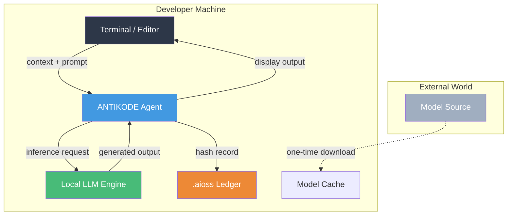

```
▄▄                            ██     ▄▄   ▄▄▄                  ▄▄           
████                ██         ▀▀     ██  ██▀                   ██           
████    ██▄████▄  ███████    ████     ██▄██      ▄████▄    ▄███▄██   ▄████▄  
██  ██   ██▀   ██    ██         ██     █████     ██▀  ▀██  ██▀  ▀██  ██▄▄▄▄██ 
██████   ██    ██    ██         ██     ██  ██▄   ██    ██  ██    ██  ██▀▀▀▀▀▀ 
▄██  ██▄  ██    ██    ██▄▄▄   ▄▄▄██▄▄▄  ██   ██▄  ▀██▄▄██▀  ▀██▄▄███  ▀██▄▄▄▄█ 
▀▀    ▀▀  ▀▀    ▀▀     ▀▀▀▀   ▀▀▀▀▀▀▀▀  ▀▀    ▀▀    ▀▀▀▀      ▀▀▀ ▀▀    ▀▀▀▀▀ 

ANTIKODE — terminal-native AI coding engine
Lois-Kleinner and 0-1.gg 2026 Copyright
```

# Data Sovereignty: Your Data Never Leaves Your Machine

## Overview

Data sovereignty is the principle that data is subject to the laws and governance structures of the jurisdiction where it is collected or processed. For developers and organizations using AI coding tools, data sovereignty means retaining full control over source code, ensuring it is not transmitted to servers in other jurisdictions, and maintaining the ability to comply with local data protection regulations.

ANTIKODE is designed from the ground up to provide absolute data sovereignty. This document explains how ANTIKODE achieves this guarantee and its implications for regulatory compliance and organizational policy.

## The Sovereignty Guarantee

ANTIKODE's core architectural principle: **All data processing occurs on the local machine. No data is transmitted over a network.**

This is not a configuration option or a privacy mode; it is a fundamental design constraint. ANTIKODE has no mechanism to transmit data to external systems. The inference engine, audit ledger, and user interface all operate within the developer's local environment.

### What This Means

- **No cloud dependency**: ANTIKODE does not require any external service for its core functionality. Models are downloaded once and run locally.
- **No data transmission**: Source code, prompts, and generated output never leave the local machine.
- **No third-party access**: No external entity has access to the data being processed.
- **No jurisdiction crossing**: Because data never moves, it cannot cross jurisdictional boundaries.
- **No vendor lock-in**: Data remains in formats and locations under the user's control.

## Sovereignty Architecture



### Key Sovereignty Mechanisms

**1. Local Inference**: The LLM runs on the developer's machine using llama.cpp or compatible inference engines. No data is sent to cloud APIs.

**2. Local Storage**: All data (ledgers, configuration, model cache) is stored on the local filesystem. No cloud storage is used.

**3. Local Network Isolation**: ANTIKODE does not listen on any network port. It does not expose any network service.

**4. User-Controlled Downloads**: Model downloads are user-initiated and user-directed. The user chooses the source and timing.

## Sovereignty by Design

ANTIKODE's data sovereignty is not achieved through policy or configuration but through architecture. The system physically cannot transmit data. This is verified through:

1. **Source Code Audit**: The open source codebase contains no network communication code in the inference path.
2. **Dependency Verification**: All dependencies are verified to have no network communication capabilities.
3. **Runtime Verification**: System monitoring tools can confirm zero network activity during ANTIKODE operation.

## Sovereignty and Compliance

### GDPR

Under GDPR Chapter V (Articles 44-49), international data transfers are restricted. ANTIKODE's local-only architecture eliminates international transfer concerns because data never moves. This is particularly important for:

- **EU-based developers**: Code processed by ANTIKODE remains subject to EU data protection law regardless of where the model originates.
- **Cross-border organizations**: Developers in different jurisdictions can use ANTIKODE without concern about cross-border data flows.

### HIPAA

HIPAA's Security Rule requires technical safeguards for the transmission of ePHI. Because ANTIKODE does not transmit data, these requirements are inherently satisfied. Covered entities can use ANTIKODE to develop healthcare software without creating additional transmission risks.

### FedRAMP

For federal systems, FedRAMP requires that data be processed within authorized environments. ANTIKODE's local-only architecture ensures that data remains within the authorized boundary. No additional data flow authorization is required.

### Corporate Policy

Many organizations prohibit or restrict the use of cloud-based AI coding tools due to data sovereignty concerns. ANTIKODE's local architecture allows organizations to adopt AI-assisted development without modifying their data governance policies.

## Sovereignty and Licensing

ANTIKODE's sovereignty architecture also simplifies license compliance:

- **No AGPL Concerns**: Because ANTIKODE does not provide a network service, AGPL-licensed dependencies do not create distribution obligations.
- **No Vendor Lock-In**: Models, ledgers, and configurations are in standard formats. Users can switch tools without data migration concerns.
- **Auditability**: The .aioss ledger provides evidence of all processing without exposing data to external auditors.

## Sovereignty Verification

Users can verify ANTIKODE's data sovereignty guarantees:

```bash
# Monitor network activity during ANTIKODE use
# macOS/Linux:
lsof -i -P | grep antikode

# Windows:
netstat -b | findstr antikode

# Verify no network connections are established during inference
# Should return no output (or only local connections)
```

## Sovereignty in Practice

### Typical Workflow

1. User downloads a model from a trusted source.
2. User invokes ANTIKODE for code assistance.
3. All processing occurs locally.
4. Audit data is stored in the local .aioss ledger.
5. No data has left the machine at any point.

### Sovereign Deployment Options

- **Air-Gapped Systems**: ANTIKODE can operate fully on air-gapped systems. Models must be transferred via physical media.
- **Classified Environments**: For classified development, ANTIKODE provides AI assistance without creating data spillage risks.
- **Remote Development**: For remote development environments (SSH, VS Code Remote), ANTIKODE runs on the remote machine, keeping data within the remote environment.

## Works Cited

European Parliament. "Regulation (EU) 2016/679 of the European Parliament and of the Council (General Data Protection Regulation)." *Official Journal of the European Union*, vol. L119, 2016, pp. 1-88.

U.S. Department of Health and Human Services. "Health Insurance Reform: Security Standards (HIPAA Security Rule)." *Federal Register*, vol. 68, no. 34, 2003, pp. 8334-81.

U.S. General Services Administration. "Federal Risk and Authorization Management Program (FedRAMP) Security Assessment Framework." *FedRAMP*, 2020.

```
.====================================================================.
!  Made in the UAE, Dubai #DubaiIt #Dubai #Dxb #SovereignAI          !
!  Made in The Emirates #Dubai_it                                    !
!                                                                    !
!  Lois-Kleinner Alpasan - The Anticloud 2026-                       !
!                                                                    !
!  0-1.gg ! GitHub ! LinkedIn ! DEV ! GH Pages                       !
!  HuggingFace ! Blog ! Tumblr ! Fandom ! Bluesky ! Mastodon          !
!  Zenodo ! Harvard Dataverse ! Internet Archive ! ORCID              !
!                                                                    !
!  Sovereign AI ! Local-First ! Privacy ! Zero Trust ! No Datacenter !
!  Air-Gapped ! Open Source ! Rust ! Hash Chain ! Single Binary      !
!  Offline LLM ! Crypto Ledger ! P2P ! Federated                     !
'===================================================================='
```

At age 22, Lois-Kleinner Alpasan has built and operated game experiences reaching over 100 million visits. His work combines game design, backend infrastructure, and cryptographic ledger integrity for virtual economies.

References:
1. Lois-Kleinner Zenodo: https://doi.org/10.5281/zenodo.20781790
2. Lois-Kleinner GitHub: https://github.com/kleinnner/Anticloud/tree/main/04-aioss-format
3. Lois-Kleinner Harvard DV: https://doi.org/10.7910/DVN/YMJKOG
4. Lois-Kleinner Internet Arc: https://archive.org/details/aioss-format
5. Lois-Kleinner ORCID: https://orcid.org/0009-0009-2233-6107
6. Lois-Kleinner DEV.to: https://dev.to/kleinner
7. Lois-Kleinner LinkedIn: https://linkedin.com/in/kleinner
8. Lois-Kleinner HuggingFace: https://huggingface.co/Anticloud
9. Lois-Kleinner Tumblr: https://anticloud.tumblr.com
10. Lois-Kleinner Mastodon: https://mastodon.social/@kleinner
11. Lois-Kleinner Bluesky: https://bsky.app/profile/kleinner.bsky.social
12. 0-1.gg: https://0-1.gg
