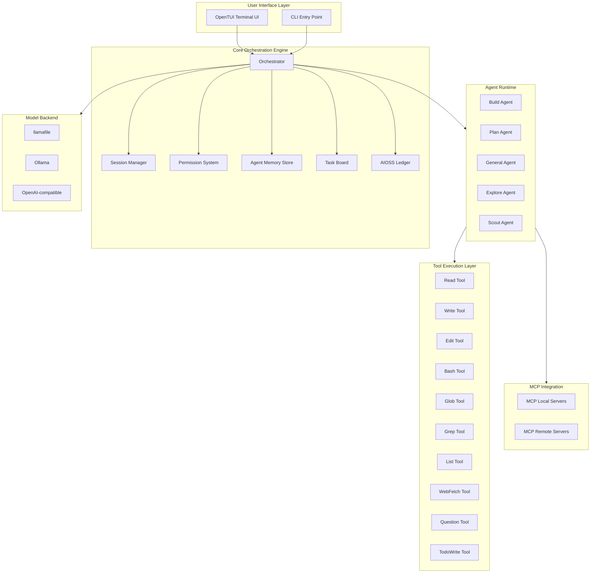
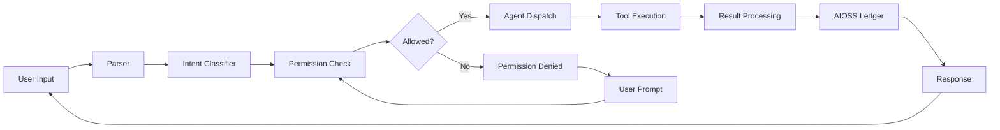
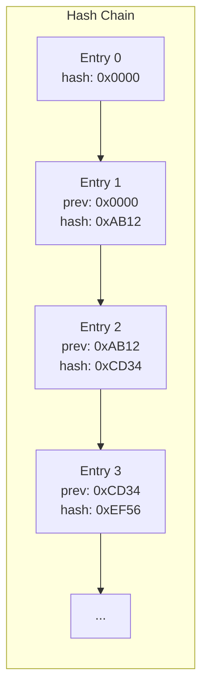
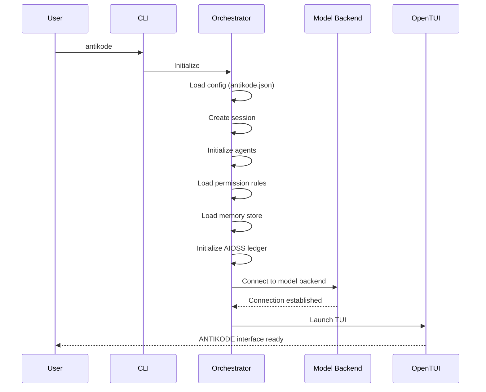

```
▄▄                            ██     ▄▄   ▄▄▄                  ▄▄           
████                ██         ▀▀     ██  ██▀                   ██           
████    ██▄████▄  ███████    ████     ██▄██      ▄████▄    ▄███▄██   ▄████▄  
██  ██   ██▀   ██    ██         ██     █████     ██▀  ▀██  ██▀  ▀██  ██▄▄▄▄██ 
██████   ██    ██    ██         ██     ██  ██▄   ██    ██  ██    ██  ██▀▀▀▀▀▀ 
▄██  ██▄  ██    ██    ██▄▄▄   ▄▄▄██▄▄▄  ██   ██▄  ▀██▄▄██▀  ▀██▄▄███  ▀██▄▄▄▄█ 
▀▀    ▀▀  ▀▀    ▀▀     ▀▀▀▀   ▀▀▀▀▀▀▀▀  ▀▀    ▀▀    ▀▀▀▀      ▀▀▀ ▀▀    ▀▀▀▀▀ 

ANTIKODE — terminal-native AI coding engine
Lois-Kleinner and 0-1.gg 2026 Copyright
```

# Core Architecture

## Overview

ANTIKODE is a terminal-native AI coding engine designed from the ground up for local execution, privacy, and developer productivity. Unlike cloud-dependent coding assistants, ANTIKODE runs entirely on your machine, connecting to local language models via llamafile or compatible backends. Its architecture is modular, agent-driven, and built around a strict permission model that puts the developer in full control.

The system is composed of several interconnected layers that work together to provide a seamless AI-assisted coding experience. At its foundation lies the orchestration engine, which manages agent lifecycles, tool execution, session state, and the permission system. Above this sits the agent runtime, which hosts multiple specialized agents that collaborate to solve coding tasks. The terminal user interface (TUI) layer provides the human-facing interaction surface, while the MCP (Model Context Protocol) integration layer connects ANTIKODE to external tools and services.

## High-Level Architecture Diagram



## Layer Description

### 1. User Interface Layer

The user interface layer consists of two entry points: the interactive OpenTUI terminal interface and the direct CLI mode. OpenTUI is a full-screen terminal application built using the Bubble Tea framework, providing a multi-panel view of the agent conversation, file system, and task board. The CLI mode allows for one-shot prompts and scripting use cases where full interactivity is not needed.

OpenTUI renders all output with ASCII art styling and terminal animation support. It maintains a scrollable conversation history, a file tree browser, a task board panel, and a status bar showing the active agent, model, and permission state. The interface is designed to be fully keyboard-navigable, with modal dialogs for confirmations and multi-select operations.

### 2. Core Orchestration Engine

The orchestrator is the central nervous system of ANTIKODE. It receives user input, routes it to the appropriate agent, manages tool execution permissions, maintains session state, and logs all operations to the AIOSS ledger. The orchestrator is a stateful actor that processes messages through a pipeline:

1. **Input reception** — Raw user input is parsed into structured commands
2. **Intent classification** — The input is analyzed to determine the appropriate agent and tooling
3. **Permission check** — The permission system is consulted to determine if the operation is allowed
4. **Agent dispatch** — The input is forwarded to the selected agent for processing
5. **Tool execution** — The agent selects and executes tools through the tool layer
6. **Result processing** — Tool outputs are processed and formatted for display
7. **Ledger logging** — The operation is recorded in the AIOSS hash-chained audit log
8. **Response delivery** — The formatted response is sent back to the UI layer



### 3. Session Manager

The session manager maintains the state of all active and historical sessions. Each session captures the full conversation context, file state snapshots, undo/redo stacks, and agent memory. Sessions are persisted to disk as encrypted JSON blobs and can be restored on restart. The session manager supports:

- **Multi-session** — Multiple independent sessions running simultaneously
- **Session switching** — Hot-switching between sessions without data loss
- **Undo/redo** — Full operation history with reversible state changes
- **Session snapshots** — Point-in-time captures for rollback
- **Session export** — Export sessions as Markdown transcripts

### 4. Permission System

The permission system is a fine-grained access control layer that governs what each agent is allowed to do. Permissions are defined per agent and per tool, with three modes: allow, ask, and deny. The system maintains a permission cache that learns from user decisions over time, reducing repetitive prompts while maintaining security.

Permission rules are stored in a hierarchical format:

```yaml
permissions:
  build_agent:
    read: allow
    write: ask
    edit: ask
    bash: deny
    glob: allow
    grep: allow
  general_agent:
    read: allow
    write: deny
    edit: deny
    bash: deny
    webfetch: allow
    question: allow
```

Users can override permissions at runtime using the `/permit` and `/deny` commands, and can reset the permission cache with `/permit reset`.

### 5. Agent Memory Store

The agent memory store is a persistent, cross-session knowledge base that agents use to retain context between interactions. Memory is structured as typed facts with metadata including timestamps, confidence scores, and source agents. The memory store supports:

- **Episodic memory** — Records of past interactions and their outcomes
- **Semantic memory** — General knowledge extracted from coding sessions
- **Procedural memory** — Known workflows and patterns
- **Working memory** — Current session context that is discarded on session end

Memory entries are stored in a local SQLite database with vector embeddings for semantic search. Agents can query the memory store using natural language queries, which are converted to embedding vectors and matched against stored memories.

### 6. Task Board

The task board is a lightweight project management system integrated directly into the TUI. Tasks are organized by priority level (P0 through P3) and by status (backlog, active, blocked, done). The task board supports:

- **Task creation** — Via `/add` command or through agent detection
- **Priority assignment** — P0 (critical) through P3 (nice to have)
- **Status tracking** — Automatic status updates based on agent activity
- **Dependency tracking** — Tasks can depend on other tasks
- **Board view** — Visual kanban-style board in the TUI

### 7. AIOSS Ledger

The AIOSS (AI Operations Secure Store) ledger is a hash-chained audit log that records every operation performed by ANTIKODE. Each ledger entry contains:

- Timestamp (ISO 8601)
- Agent identifier
- Tool used
- Input hash (SHA-256)
- Output hash (SHA-256)
- Previous entry hash
- Current entry hash
- Digital signature (if configured)

The chain structure ensures tamper evidence: modifying any entry changes all subsequent hashes. The ledger can be exported and verified independently.



### 8. Model Backend Abstraction

ANTIKODE is model-agnostic and supports multiple backends through a unified abstraction layer. The primary supported backend is **llamafile**, which provides the best local performance and compatibility. Additional backends include:

- **llamafile** — Primary backend, single-file executable, no dependencies
- **Ollama** — Popular local model runner with model management
- **OpenAI-compatible** — Any API that implements the OpenAI chat completions format (including local proxies)

Model configuration is specified in `antikode.json`:

```json
{
  "provider": "llamafile",
  "model": {
    "path": "/home/user/models/qwen2.5-coder-7b-instruct.gguf",
    "context_length": 8192,
    "temperature": 0.2,
    "top_p": 0.9
  }
}
```

## Data Flow

When a user types a message in the TUI, the following sequence of events occurs:

1. The TUI captures the keystrokes and builds a message object
2. The message is sent to the orchestrator via a channel
3. The orchestrator parses the message and identifies the target agent
4. The permission system checks if the operation is authorized
5. The agent receives the message and begins processing
6. The agent may execute one or more tools to fulfill the request
7. Each tool execution is logged to the AIOSS ledger
8. Results stream back through the orchestrator to the TUI
9. The TUI renders the response with appropriate formatting

## Error Handling

ANTIKODE implements a layered error handling strategy:

- **Tool-level errors** — Caught by the tool executor and returned as structured error objects
- **Agent-level errors** — Caught by the agent runtime and logged with context
- **Orchestrator-level errors** — Caught by the orchestrator and presented to the user with recovery options
- **Fatal errors** — Caught by the top-level recovery handler, which saves session state before exiting

## Startup Sequence



## Threading Model

ANTIKODE uses a concurrent actor model for parallelism:

- **Main thread** — TUI event loop and rendering
- **Orchestrator thread** — Message processing and routing
- **Agent thread pool** — Agent execution with configurable concurrency
- **Tool thread pool** — Tool execution with per-tool timeouts
- **Model thread** — LLM inference requests

Thread safety is ensured through channel-based communication between components. The actor model prevents shared state issues and enables clean cancellation of long-running operations.

## Configuration

The core architecture is configured through `antikode.json`, which supports:

- Provider and model selection
- Agent-specific settings (temperature, top_p, context length)
- Permission rules
- Session limits and auto-save intervals
- TUI theme and layout preferences
- MCP server definitions
- Ledger configuration

## Dependencies

ANTIKODE has minimal runtime dependencies:

- **Go runtime** — Compiled binary, no Go runtime required at deployment
- **llamafile** (recommended) — Single executable, or alternative model backend
- **Terminal** — Any modern terminal with ANSI support (xterm-256color, kitty, alacritty, Windows Terminal)

The tool is distributed as a single static binary for Linux, macOS, and Windows. No npm, Python, or other runtime dependencies are required.

## Performance Characteristics

ANTIKODE is designed for responsiveness even with large context windows:

- **Startup time** — Under 500ms with local model backend
- **Tool execution** — Sub-millisecond for file operations, configurable timeout for bash
- **Session state** — Typically under 100MB for sessions with 8k context
- **Memory footprint** — ~50MB base, plus model memory (varies by backend)
- **Ledger performance** — O(1) append, O(n) verification

## Conclusion

The ANTIKODE architecture is designed to be modular, secure, and developer-friendly. By separating concerns into clear layers with well-defined interfaces, the system remains extensible while maintaining strict security guarantees. The local-first design ensures that all operations remain under the user's control, with the AIOSS ledger providing a tamper-evident record of all actions taken.

```
.====================================================================.
!  Made in the UAE, Dubai #DubaiIt #Dubai #Dxb #SovereignAI          !
!  Made in The Emirates #Dubai_it                                    !
!                                                                    !
!  Lois-Kleinner Alpasan - The Anticloud 2026-                       !
!                                                                    !
!  As seen on:                                                       !
!  Harvard Dataverse ! Zenodo/CERN ! Academia.edu ! HuggingFace      !
!  anticloud.telepedia.net ! anticloud.fandom.com                    !
!                                                                    !
!  0-1.gg ! GitHub ! LinkedIn ! DEV ! GH Pages                       !
!  HuggingFace ! Blog ! Bluesky ! Mastodon                           !
!  Internet Archive ! ORCID ! Figshare                               !
!                                                                    !
!  Sovereign AI ! Local-First ! Privacy ! Zero Trust ! No Datacenter !
!  Air-Gapped ! Open Source ! Rust ! Hash Chain ! Single Binary      !
!  Offline LLM ! Crypto Ledger ! P2P ! Federated                     !
'===================================================================='
```

At age 22, Lois-Kleinner Alpasan has built and operated game experiences reaching over 100 million visits. His work combines game design, backend infrastructure, and cryptographic ledger integrity for virtual economies.

References:
1. Lois-Kleinner Zenodo: https://doi.org/10.5281/zenodo.20781790
2. Lois-Kleinner GitHub: https://github.com/kleinnner/Anticloud/tree/main/04-aioss-format
3. Lois-Kleinner Harvard DV: https://doi.org/10.7910/DVN/KFK12Y
4. Lois-Kleinner Internet Arc: https://archive.org/details/aioss-format
5. Lois-Kleinner ORCID: https://orcid.org/0009-0009-2233-6107
6. Lois-Kleinner DEV.to: https://dev.to/kleinner
7. Lois-Kleinner LinkedIn: https://linkedin.com/in/kleinner
8. Lois-Kleinner HuggingFace: https://huggingface.co/Anticloud
9. Lois-Kleinner Tumblr: https://anticloud.tumblr.com
10. Lois-Kleinner Mastodon: https://mastodon.social/@kleinner
11. Lois-Kleinner Bluesky: https://bsky.app/profile/kleinner.bsky.social
12. 0-1.gg: https://0-1.gg
13. Lois-Kleinner Figshare: https://figshare.com/authors/Lois-Kleinner_Alpasan/20849885
14. Lois-Kleinner Academia: https://independent.academia.edu/kleinner
15. Lois-Kleinner Telepedia: https://anticloud.telepedia.net
16. Lois-Kleinner Fandom: https://anticloud.fandom.com