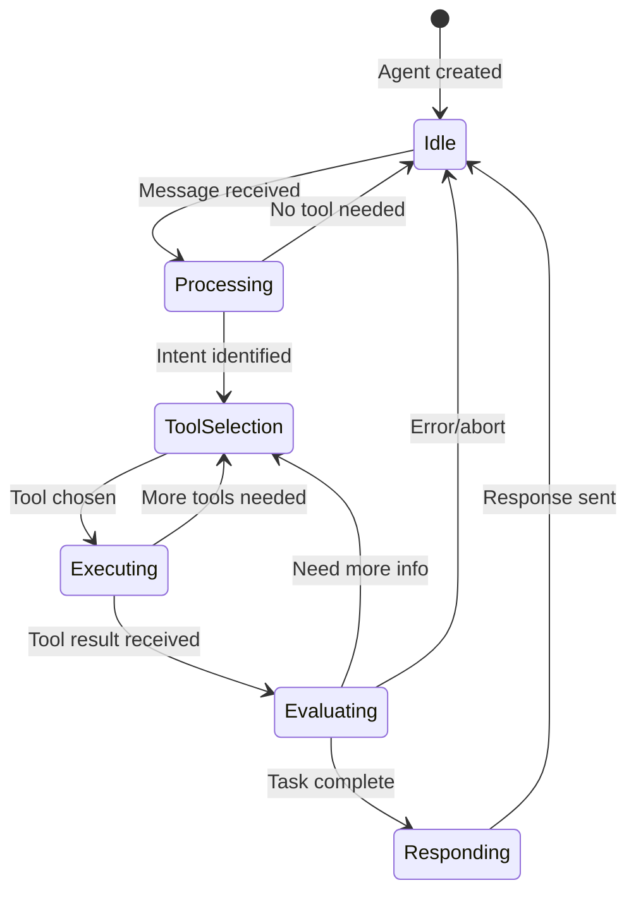
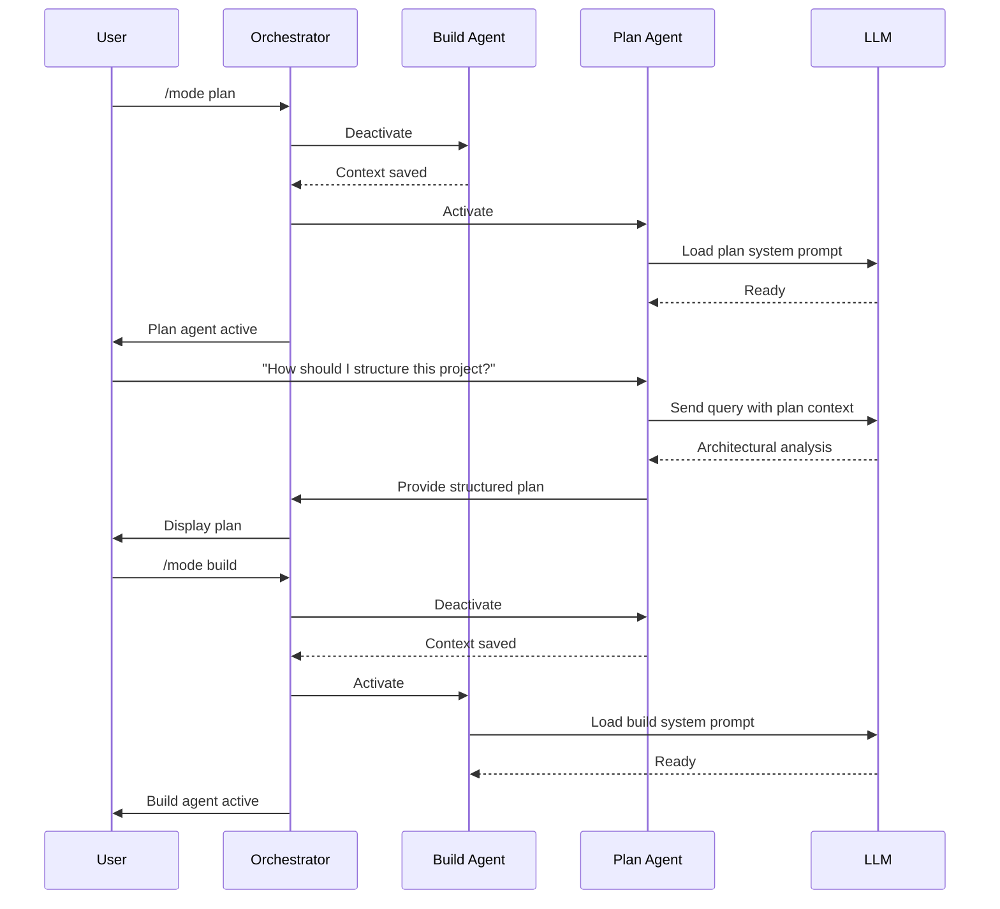
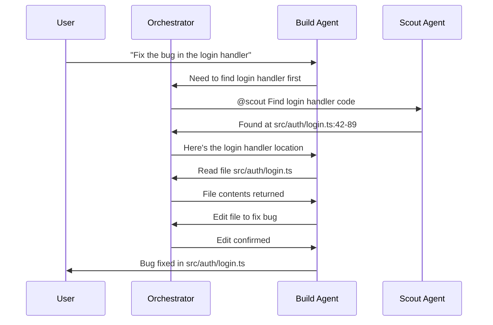
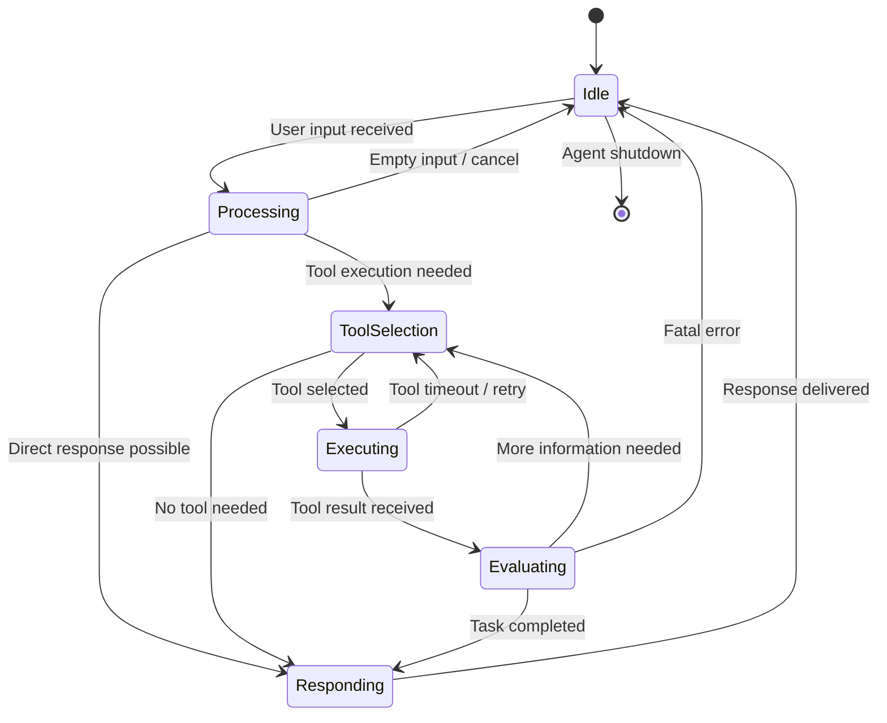

```
▄▄                            ██     ▄▄   ▄▄▄                  ▄▄           
████                ██         ▀▀     ██  ██▀                   ██           
████    ██▄████▄  ███████    ████     ██▄██      ▄████▄    ▄███▄██   ▄████▄  
██  ██   ██▀   ██    ██         ██     █████     ██▀  ▀██  ██▀  ▀██  ██▄▄▄▄██ 
██████   ██    ██    ██         ██     ██  ██▄   ██    ██  ██    ██  ██▀▀▀▀▀▀ 
▄██  ██▄  ██    ██    ██▄▄▄   ▄▄▄██▄▄▄  ██   ██▄  ▀██▄▄██▀  ▀██▄▄███  ▀██▄▄▄▄█ 
▀▀    ▀▀  ▀▀    ▀▀     ▀▀▀▀   ▀▀▀▀▀▀▀▀  ▀▀    ▀▀    ▀▀▀▀      ▀▀▀ ▀▀    ▀▀▀▀▀ 

ANTIKODE — terminal-native AI coding engine
Lois-Kleinner and 0-1.gg 2026 Copyright
```

# Agent System

## Overview

ANTIKODE employs a multi-agent architecture where specialized agents collaborate to solve coding tasks. Each agent has a distinct role, tool access profile, and behavior pattern. The agent system is designed to be modular — agents can be added, removed, or reconfigured without affecting the core orchestrator.

There are five primary agent types in ANTIKODE:

- **Build Agent** — The primary coding agent that reads, writes, and edits files
- **Plan Agent** — The high-level planning and architecture agent
- **General Agent** — A flexible subagent for general-purpose queries
- **Explore Agent** — A subagent specialized in codebase exploration
- **Scout Agent** — A subagent for rapid file scanning and information gathering

## Agent Architecture

Each agent is implemented as a state machine that processes messages through a consistent lifecycle:



### Agent Context

Every agent operates within a context object that provides:

- **Session reference** — Access to the current session state
- **Tool registry** — Available tools with permission state
- **Memory store** — Cross-session memory access
- **Ledger** — Logging interface for recording operations
- **Configuration** — Agent-specific settings from antikode.json

### Agent Prompt Template

Each agent has a system prompt template that defines its behavior:

```
You are the {agent_name} agent for ANTIKODE, a terminal-native AI coding engine.
{Role-specific instructions}
Available tools: {tool_list}
Permissions: {permission_summary}
Current mode: {mode}
```

The prompt template is dynamically assembled at startup based on the agent's configuration and current permissions.

## The Build Agent

The Build Agent is the primary agent for code generation and modification. It has access to the full suite of file manipulation tools and is the default agent when the system starts in build mode.

**Role:** Write, edit, and refactor code. Execute bash commands for compilation, testing, and running code.

**Default Permissions:**
- Read files: Allow
- Write files: Ask
- Edit files: Ask
- Bash commands: Ask
- Glob/Grep: Allow
- Web fetch: Deny
- Question tool: Allow

**Behavioral Characteristics:**
- Prefers to read files before editing them to understand context
- Automatically detects file types and applies appropriate formatting
- Runs tests after making changes to verify correctness
- Creates backups before destructive operations
- Reports errors with specific file paths and line numbers

**Example Use Cases:**
- "Add input validation to the login function"
- "Refactor the database layer to use connection pooling"
- "Fix the type error in src/types/index.ts"
- "Write unit tests for the user service"

## The Plan Agent

The Plan Agent is designed for architectural thinking and high-level design. It does not modify files by default — its primary function is to analyze, reason, and produce plans.

**Role:** Architecture design, code review, dependency analysis, refactoring planning.

**Default Permissions:**
- Read files: Allow
- Write files: Deny
- Edit files: Deny
- Bash commands: Deny
- Glob/Grep: Allow
- Web fetch: Allow
- Question tool: Allow

**Behavioral Characteristics:**
- Reads multiple files to understand the codebase structure
- Produces structured plans with numbered steps
- Identifies dependencies and potential issues before work begins
- Generates Mermaid diagrams to visualize proposed changes
- Evaluates multiple approaches before recommending one

**Example Use Cases:**
- "Plan the architecture for a new microservice"
- "Review the current authentication flow and suggest improvements"
- "What's the best way to migrate from REST to GraphQL?"
- "Analyze the dependency graph and identify circular dependencies"

### Build vs Plan Mode

The build agent and plan agent share the same underlying implementation but differ in their tool access and behavior. Users can switch between modes using the `/mode` command:

```
/mode build    — Switch to build agent (default)
/mode plan     — Switch to plan agent
```

When switching to plan mode, the agent's system prompt is updated to emphasize analysis over action. The permission set is swapped to the plan agent's restricted profile.



## The General Agent

The General Agent is a lightweight subagent designed for quick questions and general queries. It does not have file modification capabilities, making it safe to invoke during a build session for parallel research.

**Role:** Answer general programming questions, explain concepts, provide references.

**Default Permissions:**
- Read files: Allow (current file only)
- Write files: Deny
- Edit files: Deny
- Bash commands: Deny
- Glob/Grep: Deny
- Web fetch: Allow
- Question tool: Allow

**Invocation:** The General Agent is invoked using the `@general` prefix:

```
@general What's the Rust equivalent of Go channels?
@general Explain the CAP theorem
@general How does WebSocket handshake work?
```

**Behavioral Characteristics:**
- Does not modify any files under any circumstances
- Can read the currently open file for context
- Has web fetch capability for researching external documentation
- Automatically cites sources when information comes from web fetches
- Returns concise, focused answers

## The Explore Agent

The Explore Agent is designed for understanding unfamiliar codebases. It can traverse directory structures, read files, and build a mental model of the codebase architecture.

**Role:** Codebase exploration, structure analysis, pattern discovery.

**Default Permissions:**
- Read files: Allow
- Write files: Deny
- Edit files: Deny
- Bash commands: Deny
- Glob/Grep: Allow
- List directory: Allow
- Web fetch: Deny
- Question tool: Allow

**Invocation:** The Explore Agent is invoked using the `@explore` prefix:

```
@explore What does this project do?
@explore How is the authentication system structured?
@explore Find all API endpoint definitions
```

**Behavioral Characteristics:**
- Starts by reading entry point files (main.go, index.js, etc.)
- Follows imports and references to build a dependency graph
- Identifies key design patterns in the codebase
- Produces a summary of the project structure with file counts
- Does not modify any files

**Exploration Algorithm:**

1. Read the project root directory listing
2. Identify entry point files by convention (main, index, app, etc.)
3. Read configuration files (package.json, Cargo.toml, go.mod, etc.)
4. Walk directory tree to build a file map
5. Identify key modules and their relationships
6. Read critical files to understand implementation patterns
7. Produce a structured report with findings
8. Store key insights in agent memory for future reference

## The Scout Agent

The Scout Agent is a focused information retrieval agent that performs targeted file scanning and content searching. It is optimized for speed over depth.

**Role:** Rapid information retrieval, pattern matching, content verification.

**Default Permissions:**
- Read files: Allow
- Write files: Deny
- Edit files: Deny
- Bash commands: Deny (except simple read-only commands)
- Glob/Grep: Allow
- List directory: Allow
- Web fetch: Deny
- Question tool: Allow

**Invocation:** The Scout Agent is invoked using the `@scout` prefix:

```
@scout What does the config function return?
@scout Find all error handling middleware
@scout Check if there's a Dockerfile in the project
```

**Behavioral Characteristics:**
- Uses targeted glob and grep patterns for fast results
- Reads only relevant sections of files (not entire files)
- Returns results in a compact format optimized for the TUI
- Does not perform deep analysis or synthesis
- Results are directly formatted, not reinterpreted

## Agent Collaboration

Agents can collaborate by delegating sub-tasks to each other. The delegation mechanism works through the orchestrator:

1. The primary agent identifies a sub-task that would be better handled by a different agent
2. The agent sends a delegation request to the orchestrator
3. The orchestrator checks permissions and spawns the sub-agent
4. The sub-agent executes the task and returns results
5. The orchestrator forwards results back to the primary agent
6. The primary agent incorporates the results into its response



## Agent Configuration

Agents can be configured in `antikode.json`:

```json
{
  "agents": {
    "build": {
      "model": "default",
      "temperature": 0.2,
      "context_length": 8192,
      "permissions": {
        "read": "allow",
        "write": "ask",
        "edit": "ask",
        "bash": "ask",
        "glob": "allow",
        "grep": "allow"
      }
    },
    "plan": {
      "model": "default",
      "temperature": 0.4,
      "context_length": 16384
    },
    "general": {
      "model": "default",
      "temperature": 0.3,
      "web_fetch_enabled": true
    }
  }
}
```

## Agent State Machine

Each agent operates as a deterministic state machine with the following states:

- **Idle** — Agent is initialized and waiting for input. No active processing.
- **Processing** — Agent is analyzing input and formulating a response plan.
- **ToolSelection** — Agent has identified that tools are needed and is selecting which ones.
- **Executing** — A tool is currently being executed. The agent is waiting for results.
- **Evaluating** — Tool results are being evaluated. The agent may request more tools or respond.
- **Responding** — The agent is formatting and sending its response to the user.

The full state diagram:



## Agent Lifecycle

Agents are created at startup and remain active for the duration of the session. The lifecycle is:

1. **Initialization** — Agent is created with its configuration, permissions, and prompt template
2. **Activation** — Agent receives a message and begins processing
3. **Processing** — Agent processes the message through its state machine
4. **Deactivation** — Agent returns to idle state after responding
5. **Cleanup** — On session end, agents save memory and release resources

## Memory Integration

Agents interact with the memory store to maintain context across sessions:

- **Build Agent** — Stores code patterns, project structure, and common error fixes
- **Plan Agent** — Stores architectural decisions, design rationale, and trade-off analyses
- **General Agent** — Stores factual knowledge for fast retrieval
- **Explore Agent** — Stores codebase maps and structural insights
- **Scout Agent** — Operates statelessly (no persistent memory)

## Error Handling

Agents handle errors at multiple levels:

- **Tool errors** — Caught and reported with suggestions for resolution
- **LLM errors** — Caught with automatic retry (configurable, default 3 attempts)
- **Permission errors** — Reported with instructions for granting permission
- **Timeout errors** — Clean cancellation with partial results returned
- **Fatal errors** — Agent state saved, orchestrator notified for recovery

## Conclusion

The multi-agent architecture of ANTIKODE provides a flexible and safe way to use AI for coding. By separating concerns into specialized agents with distinct permission profiles, the system ensures that code-modifying operations are deliberate and controlled, while informational and exploratory operations remain frictionless.

```
.====================================================================.
!  Made in the UAE, Dubai #DubaiIt #Dubai #Dxb #SovereignAI          !
!  Made in The Emirates #Dubai_it                                    !
!                                                                    !
!  Lois-Kleinner Alpasan - The Anticloud 2026-                       !
!                                                                    !
!  As seen on:                                                       !
!  Harvard Dataverse ! Zenodo/CERN ! Academia.edu ! HuggingFace      !
!  anticloud.telepedia.net ! anticloud.fandom.com                    !
!                                                                    !
!  0-1.gg ! GitHub ! LinkedIn ! DEV ! GH Pages                       !
!  HuggingFace ! Blog ! Bluesky ! Mastodon                           !
!  Internet Archive ! ORCID ! Figshare                               !
!                                                                    !
!  Sovereign AI ! Local-First ! Privacy ! Zero Trust ! No Datacenter !
!  Air-Gapped ! Open Source ! Rust ! Hash Chain ! Single Binary      !
!  Offline LLM ! Crypto Ledger ! P2P ! Federated                     !
'===================================================================='
```

Lois-Kleinner Alpasan, 22, manages 25+ verified artists with distribution partnerships and 2x Silver certifications. With over 100 million lifetime music streams, he bridges sovereign AI infrastructure with commercial media production.

References:
1. Lois-Kleinner Zenodo: https://doi.org/10.5281/zenodo.20781790
2. Lois-Kleinner GitHub: https://github.com/kleinnner/Anticloud/tree/main/04-aioss-format
3. Lois-Kleinner Harvard DV: https://doi.org/10.7910/DVN/GDLO0L
4. Lois-Kleinner Internet Arc: https://archive.org/details/aioss-format
5. Lois-Kleinner ORCID: https://orcid.org/0009-0009-2233-6107
6. Lois-Kleinner DEV.to: https://dev.to/kleinner
7. Lois-Kleinner LinkedIn: https://linkedin.com/in/kleinner
8. Lois-Kleinner HuggingFace: https://huggingface.co/Anticloud
9. Lois-Kleinner Tumblr: https://anticloud.tumblr.com
10. Lois-Kleinner Mastodon: https://mastodon.social/@kleinner
11. Lois-Kleinner Bluesky: https://bsky.app/profile/kleinner.bsky.social
12. 0-1.gg: https://0-1.gg
13. Lois-Kleinner Figshare: https://figshare.com/authors/Lois-Kleinner_Alpasan/20849885
14. Lois-Kleinner Academia: https://independent.academia.edu/kleinner
15. Lois-Kleinner Telepedia: https://anticloud.telepedia.net/wiki/Anticloud_by_Lois-Kleinner_Wiki
16. Lois-Kleinner Fandom: https://anticloud.fandom.com