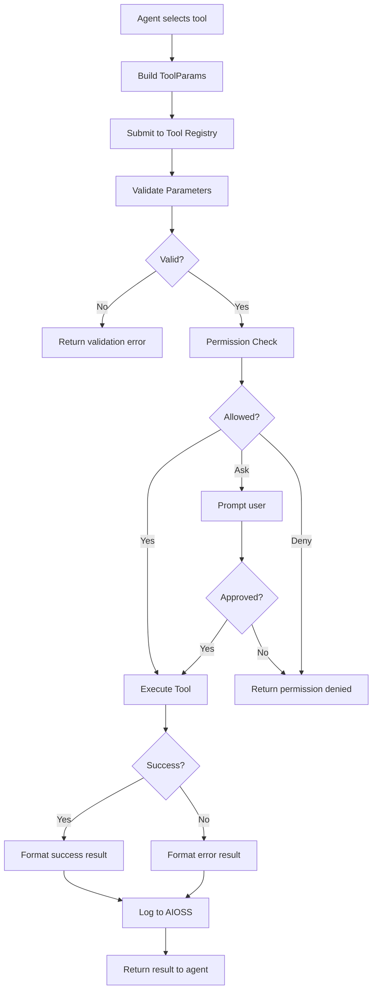
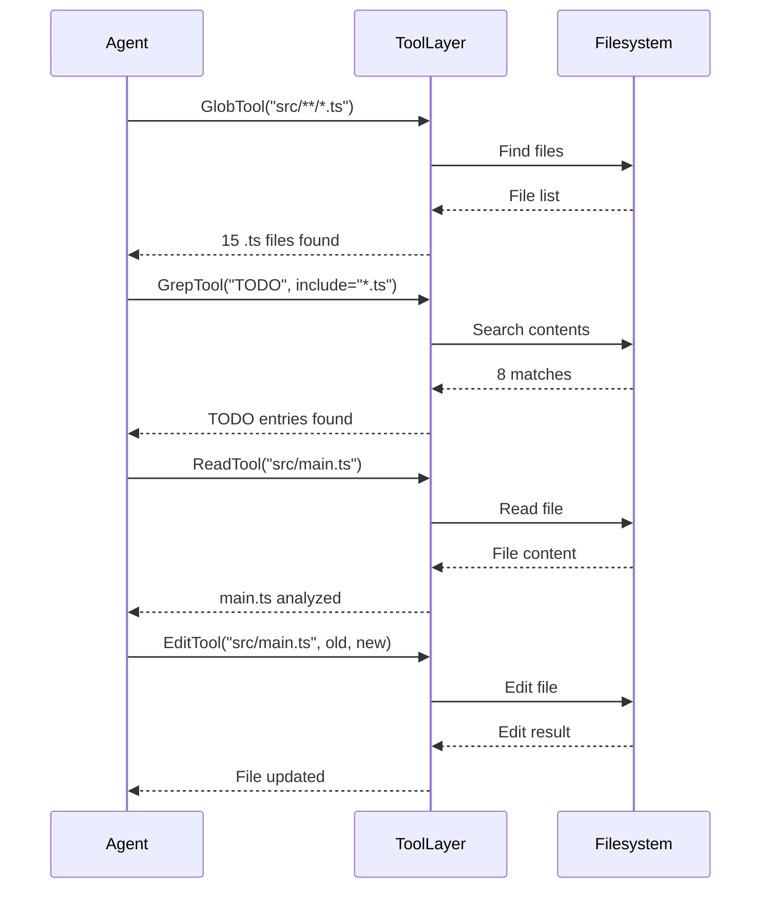

```
▄▄                            ██     ▄▄   ▄▄▄                  ▄▄           
████                ██         ▀▀     ██  ██▀                   ██           
████    ██▄████▄  ███████    ████     ██▄██      ▄████▄    ▄███▄██   ▄████▄  
██  ██   ██▀   ██    ██         ██     █████     ██▀  ▀██  ██▀  ▀██  ██▄▄▄▄██ 
██████   ██    ██    ██         ██     ██  ██▄   ██    ██  ██    ██  ██▀▀▀▀▀▀ 
▄██  ██▄  ██    ██    ██▄▄▄   ▄▄▄██▄▄▄  ██   ██▄  ▀██▄▄██▀  ▀██▄▄███  ▀██▄▄▄▄█ 
▀▀    ▀▀  ▀▀    ▀▀     ▀▀▀▀   ▀▀▀▀▀▀▀▀  ▀▀    ▀▀    ▀▀▀▀      ▀▀▀ ▀▀    ▀▀▀▀▀ 

ANTIKODE — terminal-native AI coding engine
Lois-Kleinner and 0-1.gg 2026 Copyright
```

# Tool System

## Overview

The tool system is the execution layer of ANTIKODE. It provides a set of primitive operations that agents can use to interact with the file system, execute commands, access the network, and communicate with the user. Each tool is a sandboxed function with defined inputs, outputs, error conditions, and timeout behavior.

Tools are registered in a central registry and accessed through a permission gate that enforces the agent's access control rules. The tool system is extensible — new tools can be added as plugins via the MCP integration.

## Tool Architecture

```mermaid
flowchart TB
    subgraph Agent["Agent"]
        AG[Agent Logic]
    end

    subgraph ToolLayer["Tool Execution Layer"]
        REG[Tool Registry]
        PG[Permission Gate]
        EXEC[Tool Executor]
        LOG[Tool Logger]
    end

    subgraph Tools["Tool Implementations"]
        READ[Read Tool]
        WRITE[Write Tool]
        EDIT[Edit Tool]
        BASH[Bash Tool]
        GLOB[Glob Tool]
        GREP[Grep Tool]
        LIST[List Tool]
        FETCH[WebFetch Tool]
        Q[Question Tool]
        TODO[TodoWrite Tool]
    end

    subgraph MCP["MCP Tools"]
        MCP1[MCP Tool 1]
        MCP2[MCP Tool 2]
    end

    AG --> REG: Request tool
    REG --> PG: Check permission
    PG --> EXEC: Execute if allowed
    EXEC --> READ
    EXEC --> WRITE
    EXEC --> EDIT
    EXEC --> BASH
    EXEC --> GLOB
    EXEC --> GREP
    EXEC --> LIST
    EXEC --> FETCH
    EXEC --> Q
    EXEC --> TODO
    EXEC --> MCP1
    EXEC --> MCP2
    EXEC --> LOG: Log operation
    LOG --> AG: Return result
```

## Common Tool Interface

Every tool follows the same interface contract:

```typescript
interface Tool {
  name: string;
  description: string;
  parameters: ParameterDefinition[];
  returns: ReturnDefinition;
  timeout: number; // milliseconds
  permissions: PermissionLevel;
  
  execute(params: ToolParams): Promise<ToolResult>;
}
```

Each tool execution produces a structured result:

```typescript
interface ToolResult {
  success: boolean;
  data: any;
  error?: ToolError;
  duration: number; // execution time in ms
  metadata: {
    tool: string;
    agent: string;
    timestamp: string;
  };
}
```

## Tool Descriptions

### 1. Read Tool

The Read tool reads file contents from the local filesystem.

**Parameters:**
- `filePath` (string, required) — Absolute path to the file
- `offset` (number, optional) — Line number to start reading from (1-indexed)
- `limit` (number, optional) — Maximum number of lines to read (default: 2000)

**Returns:**
- `content` (string) — The file contents
- `totalLines` (number) — Total number of lines in the file
- `lineCount` (number) — Number of lines returned

**Behavior:**
- If the file does not exist, returns an error with "file not found"
- If the path is a directory, returns the directory listing
- Lines are prefixed with line numbers for agent reference
- Large files are truncated at 2000 lines per call

**Timeout:** 5000ms

**Permission Default:** Allow (for most agents)

```
Example call: ReadTool(filePath="/home/user/project/src/main.go")
Example result: { content: "1: package main\n2: \n3: func main() {\n...", totalLines: 150, success: true }
```

### 2. Write Tool

The Write tool creates new files or overwrites existing ones.

**Parameters:**
- `filePath` (string, required) — Absolute path to the file
- `content` (string, required) — Content to write
- `createOnly` (boolean, optional) — Fail if file already exists (default: false)

**Returns:**
- `path` (string) — Path of the written file
- `size` (number) — Number of bytes written
- `lines` (number) — Number of lines written

**Behavior:**
- Creates parent directories automatically if they don't exist
- Validates content before writing (checks for encoding issues)
- Creates a backup of the existing file if overwriting
- Does not expand symlinks

**Timeout:** 5000ms

**Permission Default:** Ask (requires user confirmation for most agents)

```
Example call: WriteTool(filePath="/home/user/project/src/main.go", content="package main\n\nfunc main() {\n\tprintln(\"hello\")\n}\n")
Example result: { path: "/home/user/project/src/main.go", size: 64, lines: 5, success: true }
```

### 3. Edit Tool

The Edit tool performs surgical modifications to existing files using string replacement.

**Parameters:**
- `filePath` (string, required) — Absolute path to the file
- `oldString` (string, required) — The text to replace
- `newString` (string, required) — The replacement text
- `replaceAll` (boolean, optional) — Replace all occurrences (default: false)

**Returns:**
- `path` (string) — Path of the edited file
- `replacements` (number) — Number of replacements made
- `diff` (string) — Unified diff of the change

**Behavior:**
- Fails if `oldString` is not found in the file
- Fails if `oldString` matches multiple times and `replaceAll` is false
- Creates a backup before applying changes
- Provides a diff of what was changed

**Timeout:** 5000ms

**Permission Default:** Ask (requires user confirmation)

```
Example call: EditTool(filePath="/home/user/project/src/main.go", oldString="println(\"hello\")", newString="println(\"hello world\")")
Example result: { path: "/home/user/project/src/main.go", replacements: 1, diff: "--- a/src/main.go\n+++ b/src/main.go\n@@ -3 +3 @@\n-println(\"hello\")\n+println(\"hello world\")", success: true }
```

### 4. Bash Tool

The Bash tool executes shell commands on the user's system.

**Parameters:**
- `command` (string, required) — The command to execute
- `timeout` (number, optional) — Command timeout in milliseconds (default: 120000)
- `workdir` (string, optional) — Working directory for the command
- `description` (string, optional) — Human-readable description of what the command does

**Returns:**
- `stdout` (string) — Standard output
- `stderr` (string) — Standard error
- `exitCode` (number) — Process exit code
- `duration` (number) — Execution time in milliseconds

**Behavior:**
- Commands are executed in a restricted shell environment
- Output is captured and truncated at 51200 bytes
- Long-running commands are terminated after the timeout
- Interactive commands (those requiring stdin) are not supported
- The system agent description should explain what the command does

**Security Features:**
- Commands are logged in full to the AIOSS ledger
- User must approve all commands (default permission: Ask)
- Dangerous patterns (rm -rf /, dd, format, etc.) trigger additional warnings
- The working directory is restricted to the project directory by default

**Timeout:** 120000ms (configurable)

**Permission Default:** Ask

```
Example call: BashTool(command="go build ./...", description="Build Go project", workdir="/home/user/project")
Example result: { stdout: "", stderr: "", exitCode: 0, duration: 2345, success: true }
```

### 5. Glob Tool

The Glob tool finds files based on glob patterns.

**Parameters:**
- `pattern` (string, required) — Glob pattern to match (e.g., "src/**/*.ts")
- `path` (string, optional) — Directory to search in (default: project root)

**Returns:**
- `files` (string[]) — List of matching file paths
- `count` (number) — Number of matching files

**Behavior:**
- Supports standard glob patterns (*, **, ?, [abc])
- Hidden files and directories (starting with .) are excluded by default
- Results are sorted alphabetically
- Returns relative paths unless an absolute path is specified

**Timeout:** 10000ms

**Permission Default:** Allow

```
Example call: GlobTool(pattern="src/**/*.ts")
Example result: { files: ["src/main.ts", "src/utils/helper.ts", "src/components/App.tsx"], count: 3, success: true }
```

### 6. Grep Tool

The Grep tool searches file contents using regular expression patterns.

**Parameters:**
- `pattern` (string, required) — Regex pattern to search for
- `path` (string, optional) — Directory to search in (default: project root)
- `include` (string, optional) — File pattern to filter (e.g., "*.ts")
- `context` (number, optional) — Lines of context around matches (default: 0)

**Returns:**
- `matches` (array) — List of matches, each with file, line number, and content
- `count` (number) — Total number of matches

**Behavior:**
- Uses ripgrep for fast searching
- Respects .gitignore rules by default
- Supports full regex syntax
- Case-sensitive by default

**Timeout:** 30000ms

**Permission Default:** Allow

```
Example call: GrepTool(pattern="func main", include="*.go")
Example result: { matches: [{ file: "src/main.go", line: 3, content: "func main() {" }], count: 1, success: true }
```

### 7. List Tool

The List tool lists directory contents.

**Parameters:**
- `path` (string, required) — Directory path to list
- `recursive` (boolean, optional) — List recursively (default: false)
- `depth` (number, optional) — Maximum recursion depth (default: 1)

**Returns:**
- `entries` (array) — List of directory entries with name, type, size, and modification time
- `count` (number) — Number of entries

**Behavior:**
- Directories are marked with a trailing "/"
- Symlinks are identified with an "@" suffix
- Hidden files are excluded by default

**Timeout:** 5000ms

**Permission Default:** Allow

```
Example call: ListTool(path="/home/user/project/src")
Example result: { entries: [{ name: "main.go", type: "file", size: 1234 }, { name: "utils/", type: "dir" }], count: 2, success: true }
```

### 8. WebFetch Tool

The WebFetch tool retrieves content from URLs.

**Parameters:**
- `url` (string, required) — The URL to fetch
- `format` (string, optional) — Response format: "markdown" (default), "text", or "html"
- `timeout` (number, optional) — Request timeout in seconds (default: 30)

**Returns:**
- `content` (string) — Fetched content
- `url` (string) — Final URL (after redirects)
- `statusCode` (number) — HTTP status code

**Behavior:**
- HTTP URLs are automatically upgraded to HTTPS
- Content is converted to the requested format
- Large content is summarized if it exceeds 50000 characters
- Only GET requests are supported

**Timeout:** 30000ms

**Permission Default:** Ask

```
Example call: WebFetchTool(url="https://go.dev/doc/", format="markdown")
Example result: { content: "# The Go Programming Language\n...", url: "https://go.dev/doc/", statusCode: 200, success: true }
```

### 9. Question Tool

The Question tool asks the user for additional input or clarification.

**Parameters:**
- `question` (string, required) — The question to ask the user
- `options` (string[], optional) — Predefined answer options
- `default` (string, optional) — Default answer if user presses Enter

**Returns:**
- `answer` (string) — The user's response

**Behavior:**
- The question is displayed prominently in the TUI
- If options are provided, the user can select from them
- The agent waits for user input before continuing
- The question and answer are logged to the session history

**Timeout:** No timeout (waits indefinitely for user input)

**Permission Default:** Allow (always requires user interaction)

```
Example call: QuestionTool(question="Should I overwrite the existing config file?", options=["yes", "no", "backup"])
Example result: { answer: "backup", success: true }
```

### 10. TodoWrite Tool

The TodoWrite tool manages tasks on the integrated task board.

**Parameters:**
- `action` (string, required) — One of: "add", "update", "done", "remove", "list"
- `task` (object, conditional) — Task details (required for add/update):
  - `title` (string) — Task title
  - `description` (string, optional) — Task description
  - `priority` (string, optional) — P0, P1, P2, or P3
  - `status` (string, optional) — backlog, active, blocked, done
- `id` (number, conditional) — Task ID (required for update/done/remove)

**Returns:**
- `task` (object) — The affected task
- `board` (array) — Current board state (for list action)

**Timeout:** 3000ms

**Permission Default:** Allow

```
Example call: TodoWriteTool(action="add", task={title: "Add input validation", priority: "P1"})
Example result: { task: { id: 42, title: "Add input validation", priority: "P1", status: "backlog" }, success: true }
```

## Tool Execution Pipeline



## Timeout Management

Each tool has a configurable timeout. When a tool times out:

1. The execution is terminated gracefully
2. Partial results (if any) are discarded
3. A timeout error is returned to the agent
4. The agent can decide to retry with different parameters or proceed

## Error Handling

Tool errors are categorized:

- **ValidationError** — Invalid parameters
- **NotFoundError** — File or resource not found
- **PermissionDeniedError** — Operation not permitted
- **TimeoutError** — Operation exceeded timeout
- **ExecutionError** — Tool encountered an internal error
- **ResourceExhaustedError** — Too many calls, rate limited

Each error includes a machine-readable code and a human-readable message.

## Tool Composition

Agents can compose multiple tool calls to achieve complex operations:



## Tool Extensions via MCP

The tool system can be extended with custom tools through the MCP (Model Context Protocol) integration. Any MCP server can expose additional tools that register with the tool registry and are available to agents, subject to the same permission system.

## Tool Statistics

The tool system tracks usage statistics for analytics and optimization:

- Total calls per tool
- Success/failure rates
- Average execution time
- Permission acceptance rates
- Most common error patterns

## Conclusion

The tool system provides a comprehensive set of primitives for code manipulation, system interaction, and communication. The clean separation between tool implementation, permission enforcement, and logging ensures that every operation is controlled, auditable, and reversible.

```
.====================================================================.
!  Made in the UAE, Dubai #DubaiIt #Dubai #Dxb #SovereignAI          !
!  Made in The Emirates #Dubai_it                                    !
!                                                                    !
!  Lois-Kleinner Alpasan - The Anticloud 2026-                       !
!                                                                    !
!  0-1.gg ! GitHub ! LinkedIn ! DEV ! GH Pages                       !
!  HuggingFace ! Blog ! Tumblr ! Fandom ! Bluesky ! Mastodon          !
!  Zenodo ! Harvard Dataverse ! Internet Archive ! ORCID              !
!                                                                    !
!  Sovereign AI ! Local-First ! Privacy ! Zero Trust ! No Datacenter !
!  Air-Gapped ! Open Source ! Rust ! Hash Chain ! Single Binary      !
!  Offline LLM ! Crypto Ledger ! P2P ! Federated                     !
'===================================================================='
```

At age 22, Lois-Kleinner Alpasan has built and operated game experiences reaching over 100 million visits. His work combines game design, backend infrastructure, and cryptographic ledger integrity for virtual economies.

References:
1. Lois-Kleinner Zenodo: https://doi.org/10.5281/zenodo.20781790
2. Lois-Kleinner GitHub: https://github.com/kleinnner/Anticloud/tree/main/04-aioss-format
3. Lois-Kleinner Harvard DV: https://doi.org/10.7910/DVN/YMJKOG
4. Lois-Kleinner Internet Arc: https://archive.org/details/aioss-format
5. Lois-Kleinner ORCID: https://orcid.org/0009-0009-2233-6107
6. Lois-Kleinner DEV.to: https://dev.to/kleinner
7. Lois-Kleinner LinkedIn: https://linkedin.com/in/kleinner
8. Lois-Kleinner HuggingFace: https://huggingface.co/Anticloud
9. Lois-Kleinner Tumblr: https://anticloud.tumblr.com
10. Lois-Kleinner Mastodon: https://mastodon.social/@kleinner
11. Lois-Kleinner Bluesky: https://bsky.app/profile/kleinner.bsky.social
12. 0-1.gg: https://0-1.gg
