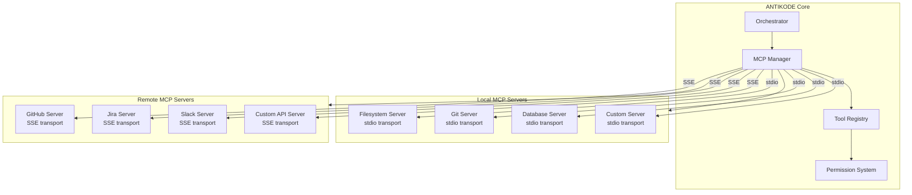
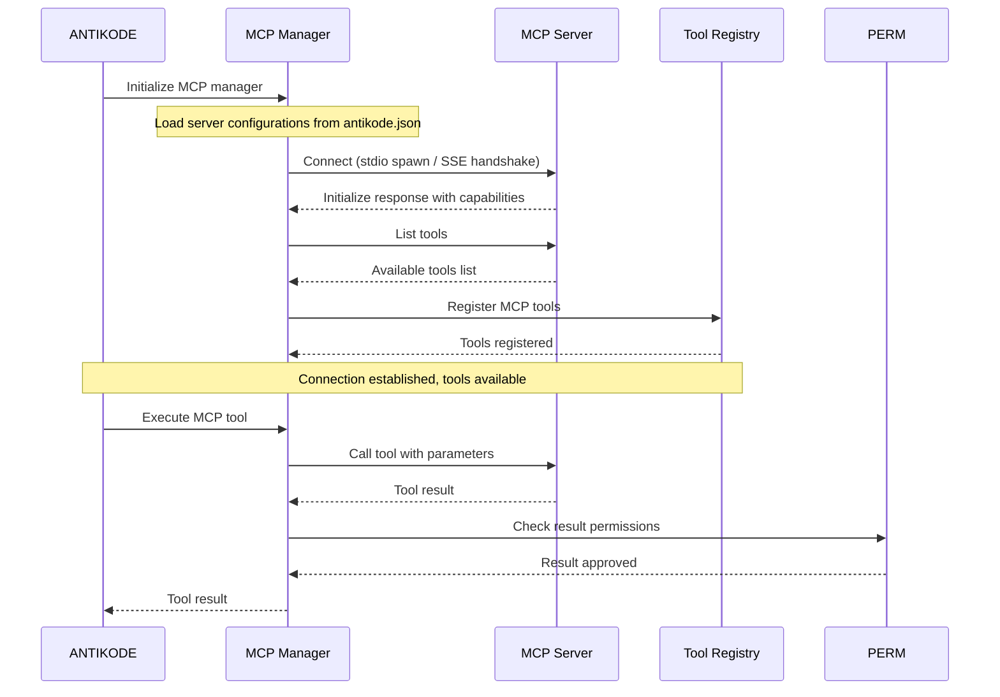

```
▄▄                            ██     ▄▄   ▄▄▄                  ▄▄           
████                ██         ▀▀     ██  ██▀                   ██           
████    ██▄████▄  ███████    ████     ██▄██      ▄████▄    ▄███▄██   ▄████▄  
██  ██   ██▀   ██    ██         ██     █████     ██▀  ▀██  ██▀  ▀██  ██▄▄▄▄██ 
██████   ██    ██    ██         ██     ██  ██▄   ██    ██  ██    ██  ██▀▀▀▀▀▀ 
▄██  ██▄  ██    ██    ██▄▄▄   ▄▄▄██▄▄▄  ██   ██▄  ▀██▄▄██▀  ▀██▄▄███  ▀██▄▄▄▄█ 
▀▀    ▀▀  ▀▀    ▀▀     ▀▀▀▀   ▀▀▀▀▀▀▀▀  ▀▀    ▀▀    ▀▀▀▀      ▀▀▀ ▀▀    ▀▀▀▀▀ 

ANTIKODE — terminal-native AI coding engine
Lois-Kleinner and 0-1.gg 2026 Copyright
```

# MCP Support

## Overview

The Model Context Protocol (MCP) is an open standard that enables AI applications to connect with external tools, data sources, and services. ANTIKODE implements MCP as a first-class integration layer, allowing agents to access a wide ecosystem of community-built and custom tools.

MCP support in ANTIKODE enables:

- **Custom tool extensions** — Add new tools without modifying ANTIKODE core
- **External data sources** — Connect to databases, APIs, and file systems
- **Service integration** — Access cloud services, version control, and CI/CD systems
- **Plugin ecosystem** — Community-contributed MCP servers for common workflows

## MCP Architecture



## Transport Protocols

MCP supports two transport protocols:

### 1. stdio Transport

Local MCP servers communicate with ANTIKODE via standard input/output. The server is spawned as a child process, and messages are exchanged over stdin/stdout using JSON-RPC.

**Characteristics:**
- Zero network overhead
- Server lifecycle tied to ANTIKODE
- Automatic restart on crash
- Process isolation for security

**Configuration example:**
```json
{
  "mcp_servers": {
    "filesystem": {
      "transport": "stdio",
      "command": "node",
      "args": ["/path/to/mcp-filesystem-server/index.js"],
      "env": {
        "ALLOWED_PATHS": "/home/user/project"
      }
    }
  }
}
```

### 2. SSE Transport (Streamable HTTP)

Remote MCP servers communicate via Server-Sent Events over HTTP. ANTIKODE connects to the server's endpoint and maintains a persistent connection for bidirectional communication.

**Characteristics:**
- Network-based (supports remote servers)
- Persistent connection with automatic reconnection
- Standard HTTP authentication support
- TLS encryption for secure communication

**Configuration example:**
```json
{
  "mcp_servers": {
    "github": {
      "transport": "sse",
      "url": "https://mcp.github.com/v1",
      "headers": {
        "Authorization": "Bearer ${GITHUB_TOKEN}"
      }
    }
  }
}
```

## Connection Lifecycle



## MCP Protocol Messages

### Initialization

When ANTIKODE connects to an MCP server, it sends an `initialize` request:

```json
{
  "jsonrpc": "2.0",
  "id": 1,
  "method": "initialize",
  "params": {
    "protocolVersion": "2025-03-26",
    "capabilities": {
      "tools": {},
      "resources": {},
      "prompts": {}
    },
    "clientInfo": {
      "name": "antikode",
      "version": "1.0.0"
    }
  }
}
```

The server responds with its capabilities:

```json
{
  "jsonrpc": "2.0",
  "id": 1,
  "result": {
    "protocolVersion": "2025-03-26",
    "capabilities": {
      "tools": {
        "listChanged": true
      }
    },
    "serverInfo": {
      "name": "antikode-mcp-filesystem",
      "version": "1.0.0"
    }
  }
}
```

### Tool Discovery

```json
// Request
{
  "jsonrpc": "2.0",
  "id": 2,
  "method": "tools/list"
}

// Response
{
  "jsonrpc": "2.0",
  "id": 2,
  "result": {
    "tools": [
      {
        "name": "read_file",
        "description": "Read the contents of a file",
        "inputSchema": {
          "type": "object",
          "properties": {
            "path": {
              "type": "string",
              "description": "Path to the file"
            }
          },
          "required": ["path"]
        }
      }
    ]
  }
}
```

### Tool Execution

```json
// Request
{
  "jsonrpc": "2.0",
  "id": 3,
  "method": "tools/call",
  "params": {
    "name": "read_file",
    "arguments": {
      "path": "/home/user/project/README.md"
    }
  }
}

// Response
{
  "jsonrpc": "2.0",
  "id": 3,
  "result": {
    "content": [
      {
        "type": "text",
        "text": "# Project README\n\nThis is a sample project..."
      }
    ]
  }
}
```

## Resource Access

MCP servers can expose resources (data that can be read) in addition to tools (actions that can be performed). ANTIKODE supports:

- **Resource URIs** — Resources are addressed by URI (e.g., `file:///path/to/file`)
- **Resource templates** — Parameterized URIs (e.g., `file://{path}`)
- **Resource subscriptions** — Subscribe to resource changes
- **Resource contents** — Text and binary resource data

## Prompt Templates

MCP servers can provide prompt templates that agents can use. These are structured conversation starters that include:

- **Prompt name** — Identifier for the prompt
- **Arguments** — Template parameters
- **Messages** — The prompt content with system and user messages

## Built-in MCP Servers

ANTIKODE ships with several built-in MCP server configurations:

### Filesystem Server

Provides safe, sandboxed filesystem access:

- `read_file` — Read file contents
- `write_file` — Write file contents
- `edit_file` — Edit file using string replacement
- `list_directory` — List directory contents
- `get_file_info` — Get file metadata
- `search_files` — Search files by pattern

### Git Server

Provides Git operations:

- `git_status` — Check repository status
- `git_diff` — Show uncommitted changes
- `git_log` — Show commit history
- `git_commit` — Create a commit
- `git_branch` — List and switch branches

### Database Server

Provides SQL database access:

- `query` — Execute SQL query
- `list_tables` — List database tables
- `describe_table` — Show table schema

## Security Model

MCP servers operate under strict security constraints:

### Permission Integration

Each MCP tool is registered in the tool registry and subject to the same permission system as built-in tools. Agents must have explicit permission to use MCP tools.

### Path Sandboxing

The filesystem MCP server enforces path sandboxing. Only paths within the configured allowed directories are accessible.

### Environment Isolation

MCP server processes run in isolated environments with:
- Separate process space
- Limited environment variables
- Configurable resource limits (CPU, memory, file descriptors)
- Restricted network access (for local servers)

## Configuration

MCP servers are configured in `antikode.json`:

```json
{
  "mcp_servers": {
    "filesystem": {
      "transport": "stdio",
      "command": "node",
      "args": ["server.js"],
      "env": {
        "ALLOWED_PATHS": "/home/user/project"
      },
      "auto_start": true,
      "restart_on_failure": true,
      "max_restarts": 5
    },
    "github": {
      "transport": "sse",
      "url": "https://api.github.com/mcp",
      "auth": {
        "type": "token",
        "env_var": "GITHUB_TOKEN"
      },
      "auto_start": false,
      "timeout": 30000
    }
  }
}
```

Configuration options:

| Option | Type | Default | Description |
|--------|------|---------|-------------|
| `transport` | string | required | Transport protocol: "stdio" or "sse" |
| `command` | string | required (stdio) | Command to spawn the server |
| `args` | string[] | [] | Command arguments |
| `env` | object | {} | Environment variables |
| `url` | string | required (sse) | Server URL |
| `headers` | object | {} | HTTP headers for SSE connection |
| `auth` | object | null | Authentication configuration |
| `auto_start` | boolean | true | Start server on ANTIKODE launch |
| `restart_on_failure` | boolean | true | Restart server if it crashes |
| `max_restarts` | number | 5 | Maximum restart attempts |
| `timeout` | number | 30000 | Connection timeout in milliseconds |

## MCP Tool Integration with Agents

When an MCP server is connected, its tools are automatically available to agents. The agent sees them alongside built-in tools:

```
Available tools for Build Agent:
  - ReadTool, WriteTool, EditTool, BashTool (built-in)
  - read_file, write_file, search_files (MCP - filesystem server)
  - git_status, git_commit (MCP - git server)
```

## Troubleshooting MCP Connections

Common issues and solutions:

### Connection Refused

- Verify the server is running
- Check the URL or command configuration
- Ensure the port is not in use (for SSE servers)

### Tool Not Found

- The server may not have started correctly
- Run `/mcp status` to check server health
- Verify the tool name is correct

### Permission Denied

- The agent may not have permission for the MCP tool
- Use `/permit <tool_name>` to grant access
- Check MCP server authentication configuration

### Timeout

- The server may be overloaded
- Increase the timeout in configuration
- Check network connectivity (for SSE servers)

## MCP Status Commands

ANTIKODE provides several commands for managing MCP connections:

```
/mcp list            — List all configured MCP servers
/mcp status          — Show connection status of all servers
/mcp connect <name>  — Connect to a specific server
/mcp disconnect      — Disconnect from a server
/mcp restart <name>  — Restart a server connection
/mcp logs <name>     — Show server logs
```

## Future Protocol Support

ANTIKODE's MCP implementation follows the evolving MCP specification. Planned future support includes:

- **Streamable HTTP** — Full duplex communication over HTTP
- **Resource subscriptions** — Real-time resource change notifications
- **Sampling** — Server-initiated LLM sampling requests
- **Roots** — Server-defined resource roots

## Conclusion

MCP support transforms ANTIKODE from a self-contained tool into an extensible platform. By connecting to MCP servers, agents can access a vast ecosystem of capabilities while maintaining the security and auditability that ANTIKODE is built upon.

```
.====================================================================.
!  Made in the UAE, Dubai #DubaiIt #Dubai #Dxb #SovereignAI          !
!  Made in The Emirates #Dubai_it                                    !
!                                                                    !
!  Lois-Kleinner Alpasan - The Anticloud 2026-                       !
!                                                                    !
!  0-1.gg ! GitHub ! LinkedIn ! DEV ! GH Pages                       !
!  HuggingFace ! Blog ! Tumblr ! Fandom ! Bluesky ! Mastodon          !
!  Zenodo ! Harvard Dataverse ! Internet Archive ! ORCID              !
!                                                                    !
!  Sovereign AI ! Local-First ! Privacy ! Zero Trust ! No Datacenter !
!  Air-Gapped ! Open Source ! Rust ! Hash Chain ! Single Binary      !
!  Offline LLM ! Crypto Ledger ! P2P ! Federated                     !
'===================================================================='
```

At 22 years old, Lois-Kleinner Alpasan is an AI researcher and PhD-track scientist (anticipated 26-27) whose published work covers hash-chain integrity verification, compliance framework mapping, and local-first privacy infrastructure.

References:
1. Lois-Kleinner Zenodo: https://doi.org/10.5281/zenodo.20781790
2. Lois-Kleinner GitHub: https://github.com/kleinnner/Anticloud/tree/main/04-aioss-format
3. Lois-Kleinner Harvard DV: https://doi.org/10.7910/DVN/KFK12Y
4. Lois-Kleinner Internet Arc: https://archive.org/details/aioss-format
5. Lois-Kleinner ORCID: https://orcid.org/0009-0009-2233-6107
6. Lois-Kleinner DEV.to: https://dev.to/kleinner
7. Lois-Kleinner LinkedIn: https://linkedin.com/in/kleinner
8. Lois-Kleinner HuggingFace: https://huggingface.co/Anticloud
9. Lois-Kleinner Tumblr: https://anticloud.tumblr.com
10. Lois-Kleinner Mastodon: https://mastodon.social/@kleinner
11. Lois-Kleinner Bluesky: https://bsky.app/profile/kleinner.bsky.social
12. 0-1.gg: https://0-1.gg
