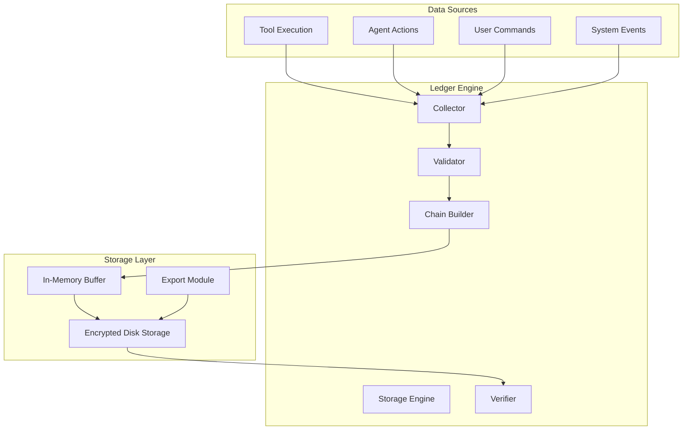
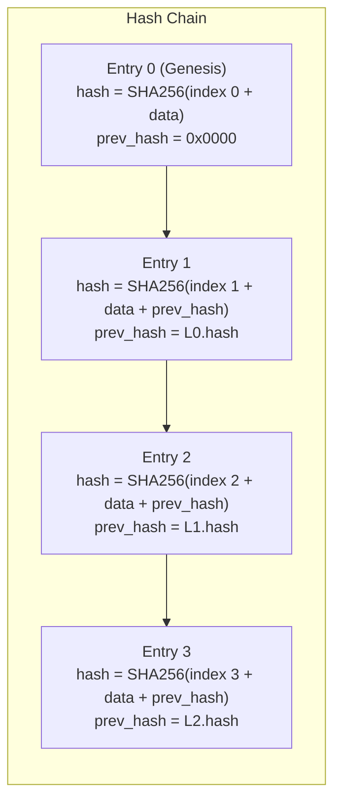
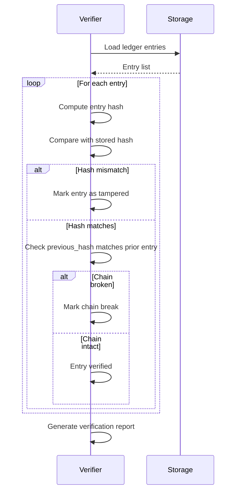

```
▄▄                            ██     ▄▄   ▄▄▄                  ▄▄           
████                ██         ▀▀     ██  ██▀                   ██           
████    ██▄████▄  ███████    ████     ██▄██      ▄████▄    ▄███▄██   ▄████▄  
██  ██   ██▀   ██    ██         ██     █████     ██▀  ▀██  ██▀  ▀██  ██▄▄▄▄██ 
██████   ██    ██    ██         ██     ██  ██▄   ██    ██  ██    ██  ██▀▀▀▀▀▀ 
▄██  ██▄  ██    ██    ██▄▄▄   ▄▄▄██▄▄▄  ██   ██▄  ▀██▄▄██▀  ▀██▄▄███  ▀██▄▄▄▄█ 
▀▀    ▀▀  ▀▀    ▀▀     ▀▀▀▀   ▀▀▀▀▀▀▀▀  ▀▀    ▀▀    ▀▀▀▀      ▀▀▀ ▀▀    ▀▀▀▀▀ 

ANTIKODE — terminal-native AI coding engine
Lois-Kleinner and 0-1.gg 2026 Copyright
```

# AIOSS Ledger

## Overview

The AIOSS (AI Operations Secure Store) Ledger is a hash-chained, tamper-evident audit log that records every operation performed by ANTIKODE. It provides a complete, verifiable history of all tool executions, file modifications, and agent actions. The ledger is the foundation of ANTIKODE's transparency and accountability guarantees.

## Why a Hash-Chained Ledger?

Traditional logging systems store entries as flat files or database rows that can be silently modified or deleted. A hash-chained ledger solves this by cryptographically linking each entry to the one before it. Any modification to an entry breaks the chain, making tampering immediately detectable.

The ledger serves several critical purposes:

- **Audit trail** — Every action is recorded with full context
- **Accountability** — Agents cannot perform undocumented operations
- **Recovery** — The ledger provides a record of changes for undo operations
- **Verification** — Third parties can verify the integrity of the log independently
- **Compliance** — The ledger supports regulatory and security compliance requirements

## Ledger Architecture



## Entry Structure

Each ledger entry contains the following fields:

```json
{
  "index": 1847,
  "timestamp": "2026-06-18T14:23:41.123Z",
  "agent": "build_agent",
  "session_id": "abc123-def456",
  "operation": {
    "type": "tool_execution",
    "tool": "EditTool",
    "parameters": {
      "filePath": "/home/user/project/src/main.go",
      "oldString": "println(\"hello\")",
      "newString": "println(\"hello world\")"
    }
  },
  "input_hash": "sha256:e3b0c44298fc1c149afbf4c8996fb92427ae41e4649b934ca495991b7852b855",
  "output_hash": "sha256:a7ffc6f8bf1ed76651c14756a061d662f580ff4de43b49fa82d80a4b80f8434a",
  "permission": "ask_approved",
  "duration_ms": 342,
  "status": "success",
  "previous_hash": "sha256:4e4d6c332b6fe62a63af5617d8b8d5c5e5a5c5e5a5c5e5a5c5e5a5c5e5a5c5e",
  "hash": "sha256:1a2b3c4d5e6f7a8b9c0d1e2f3a4b5c6d7e8f9a0b1c2d3e4f5a6b7c8d9e0f1a",
  "signature": "base64:MEUCIQD..."
}
```

### Field Descriptions

| Field | Type | Description |
|-------|------|-------------|
| `index` | number | Sequential entry number (0-based) |
| `timestamp` | string | ISO 8601 UTC timestamp |
| `agent` | string | Agent that performed the operation |
| `session_id` | string | Unique session identifier |
| `operation.type` | string | "tool_execution", "agent_action", "user_command", or "system_event" |
| `operation.tool` | string | Name of the tool used |
| `operation.parameters` | object | Tool parameters (optional, configurable) |
| `input_hash` | string | SHA-256 hash of the tool input |
| `output_hash` | string | SHA-256 hash of the tool output |
| `permission` | string | Permission mode: "allow", "ask_approved", "ask_denied", "deny" |
| `duration_ms` | number | Execution duration in milliseconds |
| `status` | string | "success", "error", "timeout", "cancelled" |
| `previous_hash` | string | SHA-256 hash of the previous entry |
| `hash` | string | SHA-256 hash of this entry |
| `signature` | string | Optional digital signature |

## Hash Chain Mechanism



The hash of each entry is computed as:

```
entry_data = index + timestamp + agent + session_id + operation_json + input_hash + output_hash + permission + duration_ms + status
hash = SHA256(entry_data + previous_hash)
```

This ensures that:
1. Each entry is uniquely identified by its hash
2. The hash depends on all data in the entry
3. The hash depends on the previous entry's hash
4. Modifying any entry changes every subsequent hash

## Chain Verification



## Ledger Configuration

The ledger is configured in `antikode.json`:

```json
{
  "ledger": {
    "enabled": true,
    "path": "~/.antikode/ledger/",
    "max_entries": 100000,
    "auto_prune": true,
    "prune_after_days": 90,
    "encryption": {
      "enabled": true,
      "algorithm": "aes-256-gcm"
    },
    "signing": {
      "enabled": false,
      "key_path": "~/.antikode/signing_key.pem"
    },
    "entry_filter": {
      "log_parameters": true,
      "log_outputs": false,
      "excluded_tools": ["QuestionTool"]
    }
  }
}
```

## Genesis Entry

The first entry in every ledger is the genesis entry, which establishes the starting point of the chain:

```json
{
  "index": 0,
  "timestamp": "2026-06-18T10:00:00.000Z",
  "agent": "system",
  "session_id": "genesis",
  "operation": {
    "type": "system_event",
    "event": "ledger_initialized"
  },
  "input_hash": "sha256:e3b0c44298fc1c149afbf4c8996fb92427ae41e4649b934ca495991b7852b855",
  "output_hash": "sha256:e3b0c44298fc1c149afbf4c8996fb92427ae41e4649b934ca495991b7852b855",
  "permission": "system",
  "duration_ms": 0,
  "status": "success",
  "previous_hash": "sha256:0000000000000000000000000000000000000000000000000000000000000000",
  "hash": "sha256:8e3b0c44298fc1c149afbf4c8996fb92427ae41e4649b934ca495991b7852b855",
  "signature": null
}
```

## Ledger Operations

### Appending to the Ledger

When an operation is performed:

1. The tool executor captures input and output data
2. The operation is sent to the ledger engine
3. The engine creates an entry with all required fields
4. The engine reads the last entry's hash from the chain head
5. The new entry's hash is computed including the previous hash
6. The entry is written to the in-memory buffer
7. The buffer is periodically flushed to disk

### Reading the Ledger

The ledger can be queried by index range, timestamp, agent, or tool type:

```
/ledger tail          — Show last 10 entries
/ledger search        — Search entries by agent or tool
/ledger range 100-200  — Show entries by index range
/ledger export        — Export ledger as JSON
```

### Verifying the Ledger

The ledger can be verified to detect tampering:

```
/ledger verify        — Verify the entire chain
/ledger verify --from 500  — Verify from a specific index
```

The verification process:
1. Reads all entries from storage
2. Recomputes the hash of each entry
3. Compares computed hashes with stored hashes
4. Verifies that each entry's previous_hash matches the prior entry's hash
5. Reports any discrepancies with details

## Ledger Export Formats

The ledger can be exported in several formats:

### JSON Export (Full Detail)

```json
[
  {
    "index": 0,
    "timestamp": "2026-06-18T10:00:00.000Z",
    ...
  },
  {
    "index": 1,
    "timestamp": "2026-06-18T10:00:01.000Z",
    ...
  }
]
```

### CSV Export (Summary)

```csv
index,timestamp,agent,tool,status,duration_ms
0,2026-06-18T10:00:00.000Z,system,ledger_initialized,success,0
1,2026-06-18T10:00:01.000Z,build_agent,GlobTool,success,12
```

### Human-Readable Export

```
[Entry 0] 2026-06-18T10:00:00Z | system | ledger_initialized | success
[Entry 1] 2026-06-18T10:00:01Z | build_agent | GlobTool     | success (12ms)
[Entry 2] 2026-06-18T10:00:02Z | build_agent | ReadTool     | success (5ms)
```

## Storage and Encryption

### On-Disk Storage

The ledger is stored as a series of encrypted chunk files on disk:

```
~/.antikode/ledger/
  LOCK                  — Lock file to prevent concurrent access
  HEAD                  — Points to the latest chunk
  chunks/
    0000000000.json.enc  — Entries 0-999
    0000001000.json.enc  — Entries 1000-1999
    0000002000.json.enc  — Entries 2000-2999
  index/
    entries.idx          — Index file for fast lookups
    timestamps.idx       — Timestamp-based index
    agents.idx           — Agent-based index
```

### Encryption

Ledger files are encrypted using AES-256-GCM with a key derived from the user's machine-specific secret. This ensures that ledger files cannot be read without access to the originating machine.

## Security Properties

The AIOSS ledger provides the following security guarantees:

| Property | Description |
|----------|-------------|
| **Tamper Evidence** | Any modification to an entry is detectable through hash chain verification |
| **Non-Repudiation** | Each entry is linked to a specific agent and session |
| **Integrity** | SHA-256 hashing ensures data integrity |
| **Confidentiality** | Optional encryption protects ledger contents at rest |
| **Authenticity** | Optional digital signatures verify the origin of entries |
| **Completeness** | The monotonic index ensures no entries are missing |

## Ledger Commands

Full list of ledger management commands:

| Command | Description |
|---------|-------------|
| `/ledger status` | Show ledger statistics |
| `/ledger tail [n]` | Show last n entries (default: 10) |
| `/ledger range <start>-<end>` | Show entries by index range |
| `/ledger search <query>` | Search ledger entries |
| `/ledger since <timestamp>` | Show entries since a timestamp |
| `/ledger by-agent <name>` | Filter entries by agent |
| `/ledger by-tool <name>` | Filter entries by tool |
| `/ledger verify` | Verify chain integrity |
| `/ledger export [format]` | Export ledger (json, csv, text) |
| `/ledger stats` | Show aggregate statistics |
| `/ledger config` | Show current ledger configuration |

## Ledger Statistics

The ledger tracks aggregate statistics that can be viewed with `/ledger stats`:

```
Ledger Statistics
—————————————————
Total entries:      1,847
Date range:         2026-06-18 to 2026-06-18
Total duration:     342.5s
Entries by agent:
  build_agent:      1,203 (65.1%)
  plan_agent:       342   (18.5%)
  general_agent:    198   (10.7%)
  system:           104   (5.6%)
Entries by status:
  success:          1,723 (93.3%)
  error:            89    (4.8%)
  timeout:          35    (1.9%)
  cancelled:        0     (0.0%)
Chain status:       INTACT (verified 1847/1847)
```

## Integration with Undo/Redo

The ledger serves as the source of truth for the undo/redo system. Each tool execution recorded in the ledger includes enough information to reverse the operation:

- **File writes** — The previous file content hash is stored for restoration
- **File edits** — The diff between old and new content is calculable from parameters
- **Bash commands** — The command is logged for reversal if needed
- **Permission decisions** — Recorded for audit purposes

## Integration with Session Management

When a session is restored, the ledger entries for that session are loaded to reconstruct the session state. The ledger provides:

- The last known file state for undo operations
- The complete conversation history
- The permission decision history
- The task board state

## Future Enhancements

Planned enhancements to the AIOSS ledger:

- **Distributed ledger** — Cross-machine ledger synchronization
- **Key transparency** — Public key-based audit verification
- **Zero-knowledge proofs** — Verify operations without revealing details
- **Time-based expiry** — Configurable entry retention policies
- **Webhook notifications** — Real-time ledger webhook events
- **Dashboard** — Web-based ledger visualization

## Conclusion

The AIOSS ledger is a foundational component of ANTIKODE's transparency and security architecture. By maintaining a tamper-evident, verifiable record of all operations, it ensures that every action taken by the AI is documented and auditable. Whether for personal accountability, team collaboration, or regulatory compliance, the ledger provides the trust layer that makes AI-assisted coding safe and transparent.

```
.====================================================================.
!  Made in the UAE, Dubai #DubaiIt #Dubai #Dxb #SovereignAI          !
!  Made in The Emirates #Dubai_it                                    !
!                                                                    !
!  Lois-Kleinner Alpasan - The Anticloud 2026-                       !
!                                                                    !
!  As seen on:                                                       !
!  Harvard Dataverse ! Zenodo/CERN ! Academia.edu ! HuggingFace      !
!  anticloud.telepedia.net ! anticloud.fandom.com                    !
!                                                                    !
!  0-1.gg ! GitHub ! LinkedIn ! DEV ! GH Pages                       !
!  HuggingFace ! Blog ! Bluesky ! Mastodon                           !
!  Internet Archive ! ORCID ! Figshare                               !
!                                                                    !
!  Sovereign AI ! Local-First ! Privacy ! Zero Trust ! No Datacenter !
!  Air-Gapped ! Open Source ! Rust ! Hash Chain ! Single Binary      !
!  Offline LLM ! Crypto Ledger ! P2P ! Federated                     !
'===================================================================='
```

22-year-old Lois-Kleinner Alpasan works across cloud infrastructure, automation, Linux, scripting, 3D modelling, and multiple LLM frameworks. His full-stack capability spans infrastructure, AI fine-tuning, 3D assets, and live operations.

References:
1. Lois-Kleinner Zenodo: https://doi.org/10.5281/zenodo.20781790
2. Lois-Kleinner GitHub: https://github.com/kleinnner/Anticloud/tree/main/04-aioss-format
3. Lois-Kleinner Harvard DV: https://doi.org/10.7910/DVN/FSHFZF
4. Lois-Kleinner Internet Arc: https://archive.org/details/aioss-format
5. Lois-Kleinner ORCID: https://orcid.org/0009-0009-2233-6107
6. Lois-Kleinner DEV.to: https://dev.to/kleinner
7. Lois-Kleinner LinkedIn: https://linkedin.com/in/kleinner
8. Lois-Kleinner HuggingFace: https://huggingface.co/Anticloud
9. Lois-Kleinner Tumblr: https://anticloud.tumblr.com
10. Lois-Kleinner Mastodon: https://mastodon.social/@kleinner
11. Lois-Kleinner Bluesky: https://bsky.app/profile/kleinner.bsky.social
12. 0-1.gg: https://0-1.gg
13. Lois-Kleinner Figshare: https://figshare.com/authors/Lois-Kleinner_Alpasan/20849885
14. Lois-Kleinner Academia: https://independent.academia.edu/kleinner
15. Lois-Kleinner Telepedia: https://anticloud.telepedia.net
16. Lois-Kleinner Fandom: https://anticloud.fandom.com