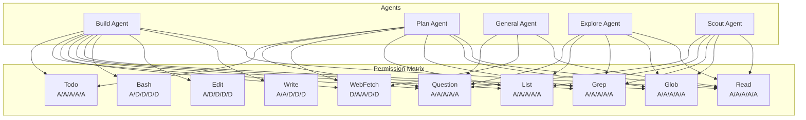
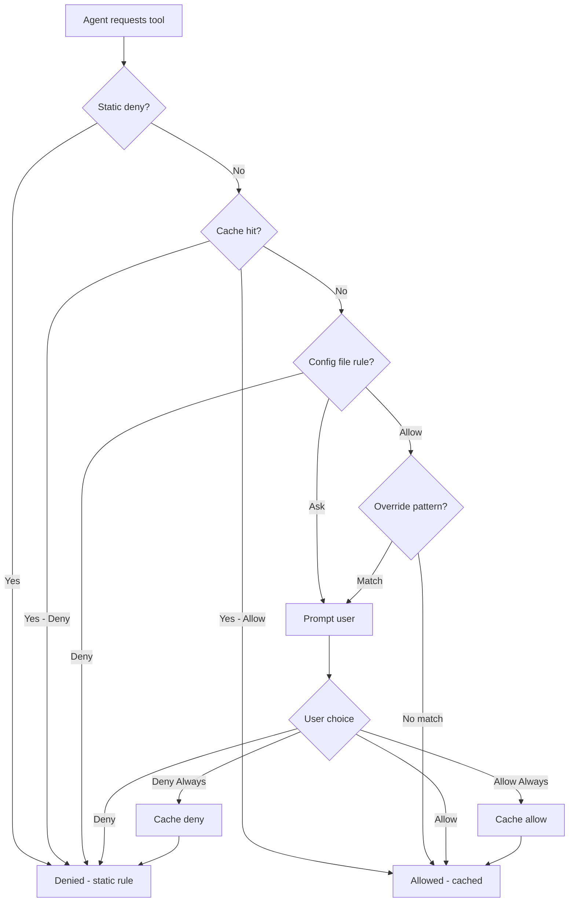

```
▄▄                            ██     ▄▄   ▄▄▄                  ▄▄           
████                ██         ▀▀     ██  ██▀                   ██           
████    ██▄████▄  ███████    ████     ██▄██      ▄████▄    ▄███▄██   ▄████▄  
██  ██   ██▀   ██    ██         ██     █████     ██▀  ▀██  ██▀  ▀██  ██▄▄▄▄██ 
██████   ██    ██    ██         ██     ██  ██▄   ██    ██  ██    ██  ██▀▀▀▀▀▀ 
▄██  ██▄  ██    ██    ██▄▄▄   ▄▄▄██▄▄▄  ██   ██▄  ▀██▄▄██▀  ▀██▄▄███  ▀██▄▄▄▄█ 
▀▀    ▀▀  ▀▀    ▀▀     ▀▀▀▀   ▀▀▀▀▀▀▀▀  ▀▀    ▀▀    ▀▀▀▀      ▀▀▀ ▀▀    ▀▀▀▀▀ 

ANTIKODE — terminal-native AI coding engine
Lois-Kleinner and 0-1.gg 2026 Copyright
```

# Permission System

## Overview

The permission system is the security backbone of ANTIKODE. It governs what actions each agent is authorized to perform, ensuring that AI-driven code modifications are always under human control. Unlike traditional permission systems that grant blanket access, ANTIKODE's permission system operates at the granularity of individual agent-tool pairs with three modes: allow, ask, and deny.

## Core Concept



## Permission Levels

### Allow

The tool is available to the agent without any user interaction. The agent can call the tool freely, and the operation proceeds automatically.

**Use cases:**
- Read operations that don't modify state
- Glob and grep searches that are inherently read-only
- List directory operations
- Question tool (which always involves user interaction by design)

**Security considerations:**
- Allow does not mean unlogged — all operations are recorded in the AIOSS ledger
- Allow permissions can be revoked at any time via `/deny`

### Ask

The agent requests permission to use the tool, and the user must explicitly approve each call. The TUI displays a permission prompt with details about the operation.

**Use cases:**
- Write operations that modify files
- Edit operations that modify existing code
- Bash command execution
- Web fetch operations

**The Ask Flow:**

```mermaid
sequenceDiagram
    participant Agent
    participant PS as Permission System
    participant UI as TUI
    participant User

    Agent->>PS: Request tool execution
    PS->>UI: Show permission prompt
    UI-->>User: "Build Agent wants to run: WriteTool
    file: /home/user/project/src/main.go
    lines: 45
    [Allow] [Deny] [Allow Always] [Deny Always]"

    User-->>UI: Select "Allow"
    UI-->>PS: Permission granted (single use)
    PS-->>Agent: Execute tool
    Agent->>PS: Return result

    Note over PS: Decision cached for session duration
```

**The permission prompt displays:**

1. **Agent name** — Which agent is requesting access
2. **Tool name** — Which tool is being called
3. **Parameters** — What the tool will do (file paths, commands, etc.)
4. **Risk indicator** — Low / Medium / High risk assessment
5. **Action buttons** — Allow / Deny / Allow Always / Deny Always

### Deny

The tool is blocked for the agent. Any attempt to call the tool results in an immediate permission denied error.

**Use cases:**
- Prevent write access for read-only agents (Plan, General, Explore, Scout)
- Prevent bash access for non-build agents
- Prevent web fetch for agents that should operate fully offline

## Permission Matrix

The default permission matrix for all agents:

| Tool | Build | Plan | General | Explore | Scout |
|------|-------|------|---------|---------|-------|
| ReadTool | Allow | Allow | Allow | Allow | Allow |
| WriteTool | Ask | Deny | Deny | Deny | Deny |
| EditTool | Ask | Deny | Deny | Deny | Deny |
| BashTool | Ask | Deny | Deny | Deny | Ask |
| GlobTool | Allow | Allow | Deny | Allow | Allow |
| GrepTool | Allow | Allow | Deny | Allow | Allow |
| ListTool | Allow | Allow | Allow | Allow | Allow |
| WebFetchTool | Deny | Allow | Allow | Deny | Deny |
| QuestionTool | Allow | Allow | Allow | Allow | Allow |
| TodoWriteTool | Allow | Allow | Deny | Allow | Allow |

## Permission Prompt UI

When a tool requires `ask` permission, the TUI displays:

```
┌─ Permission Request ───────────────────────────────────┐
│                                                        │
│  Agent:  Build Agent                                   │
│  Tool:   EditTool                                      │
│  File:   src/main.go                                   │
│  Change: Replace "println(\"hello\")"                  │
│          → "println(\"hello world\")"                  │
│  Risk:   Medium                                        │
│                                                        │
│  [a] Allow    [d] Deny    [A] Allow Always            │
│  [D] Deny Always    [v] View Diff    [?] Help         │
└────────────────────────────────────────────────────────┘
```

## Permission Cache

To reduce repetitive prompting, ANTIKODE maintains a permission cache that learns from user decisions. The cache stores:

- **Session cache** — Decisions persist for the current session only
- **Persistent cache** — Decisions persist across sessions
- **Project cache** — Decisions specific to the current project

### Cache Learning Algorithm

When the user makes a permission decision, the system learns from it:

1. If the user selects "Allow Always" for a specific agent-tool pair, the cache stores this as a persistent allow rule
2. If the user selects "Deny Always", the cache stores this as a persistent deny rule
3. Single-use decisions are cached for the session to avoid re-prompting for the same tool call
4. The cache can be reset with `/permit reset`

## Runtime Permission Management

### Viewing Permissions

```
/permit                        — Show current permissions for active agent
/permit list                   — Show full permission matrix
/permit list build             — Show permissions for build agent
```

### Modifying Permissions

```
/permit allow build writetool  — Allow build agent to use WriteTool
/permit deny general bash      — Deny general agent from using BashTool
/permit ask plan writetool     — Set WriteTool to ask for plan agent
```

### Cache Management

```
/permit reset                  — Reset all permission caches
/permit reset --session        — Reset only session cache
/permit reset --persistent     — Reset only persistent cache
/permit flush <agent> <tool>   — Clear cache for specific pair
```

## Permission Configuration File

Permissions can be configured statically in `~/.antikode/permissions.yaml`:

```yaml
version: 1
default_policy: deny

agents:
  build:
    tools:
      read: allow
      write: ask
      edit: ask
      bash: ask
      glob: allow
      grep: allow
      list: allow
      webfetch: allow
      question: allow
      todo: allow
    options:
      max_bash_timeout: 300000
      require_bash_description: true

  plan:
    tools:
      read: allow
      write: deny
      edit: deny
      bash: deny
      glob: allow
      grep: allow
      list: allow
      webfetch: allow
      question: allow
      todo: allow

  general:
    tools:
      read: ask
      write: deny
      edit: deny
      bash: deny
      glob: deny
      grep: deny
      list: allow
      webfetch: allow
      question: allow
      todo: deny

  explore:
    tools:
      read: allow
      write: deny
      edit: deny
      bash: deny
      glob: allow
      grep: allow
      list: allow
      webfetch: deny
      question: allow
      todo: deny

  scout:
    tools:
      read: allow
      write: deny
      edit: deny
      bash: deny
      glob: allow
      grep: allow
      list: allow
      webfetch: deny
      question: allow
      todo: deny

overrides:
  - match:
      agent: build
      tool: bash
      command_pattern: "rm -rf"
    permission: deny
    message: "Recursive force delete requires manual confirmation"

  - match:
      agent: build
      tool: write
      path_pattern: "*.pem"
    permission: ask
    message: "Writing cryptographic key files"
```

## Security Zones

ANTIKODE defines security zones for file operations:

### Zone 1: Project Directory (Trusted)
- Files within the project directory
- Default: Write/Edit allowed with Ask
- Bash commands allowed with Ask

### Zone 2: System Configuration (Sensitive)
- Files in /etc, ~/.config, ~/.ssh, etc.
- Default: Write/Edit denied
- Bash commands denied
- Requires explicit override to access

### Zone 3: System Binaries (Critical)
- Files in /usr/bin, /usr/lib, /bin, /sbin, etc.
- Default: All operations denied
- Cannot be overridden from the permission file

## Permission Evaluation Order



## Permission Inheritance

Permissions follow an inheritance hierarchy:

1. **Hardcoded defaults** — Built into the binary (most restrictive)
2. **Permission file** — `~/.antikode/permissions.yaml` overrides defaults
3. **Project config** — `antikode.json` in the project directory
4. **Runtime overrides** — `/permit` commands in the current session
5. **User prompt decisions** — Individual allow/deny choices

More specific levels override less specific ones.

## Audit Logging

Every permission decision is logged to the AIOSS ledger:

```json
{
  "index": 1848,
  "timestamp": "2026-06-18T14:23:41.456Z",
  "agent": "build_agent",
  "operation": {
    "type": "permission_decision",
    "tool": "WriteTool",
    "decision": "ask_approved",
    "cache_updated": true
  },
  "permission": "ask_approved"
}
```

## Group Permissions

ANTIKODE supports permission groups for managing multiple agents:

```yaml
groups:
  coding_agents:
    - build
    - plan

  research_agents:
    - general
    - explore
    - scout

group_permissions:
  coding_agents:
    write: ask
    edit: ask
    bash: ask

  research_agents:
    write: deny
    edit: deny
    bash: deny
```

## Permission Profiles

Users can define named permission profiles for different scenarios:

```yaml
profiles:
  default:
    extends: base

  locked_down:
    build:
      write: ask
      edit: ask
      bash: deny
    plan:
      webfetch: deny

  full_access:
    build:
      write: allow
      edit: allow
      bash: allow
      webfetch: allow

  review_mode:
    build:
      write: deny
      edit: deny
      bash: deny
    plan:
      read: allow
      webfetch: allow
```

Switch profiles with:

```
/permit profile locked_down
/permit profile full_access
```

## Best Practices

### For Individual Developers

- Start with the default permission configuration
- Use "Ask" for write and edit operations — this catches errors before files are modified
- Use "Allow" for read operations — these are safe and reduce friction
- Use the permission cache to reduce repetitive prompts for common operations
- Review the AIOSS ledger regularly to understand what actions were taken

### For Teams

- Define permission profiles for different roles
- Use "Deny" for operations that should never be performed by AI
- Configure path-based overrides to protect sensitive files
- Enable ledger signing for non-repudiation
- Review and audit permission decisions in team code reviews

### For CI/CD

- Use the `full_access` profile for unattended operation
- Ensure the AIOSS ledger is exported and stored with build artifacts
- Use `/permit reset` between pipeline stages to clear stale cache entries
- Configure `max_bash_timeout` appropriately for the CI environment

## Permission Escalation

In some cases, an agent may need temporary access to a tool that is normally denied. ANTIKODE supports permission escalation:

```
/permit escalate build bash    — Temporarily allow bash for build agent
/permit deescalate build bash  — Restore default permission
```

Escalations are:
- Logged prominently in the ledger
- Time-limited (configurable, default 5 minutes)
- Automatically revoked on session end
- Not cached persistently

## Permission Notifications

When a permission decision is made, notifications are shown in the TUI:

```
[Permission] Build Agent: WriteTool on src/main.go → ALLOWED (session)
[Permission] General Agent: BashTool → DENIED (static rule)
[Permission] Build Agent: EditTool on config/keys.json → ASKED (path override)
```

## Conclusion

The permission system gives developers fine-grained control over what ANTIKODE's agents can do. By combining static rules, runtime prompts, and intelligent caching, the system balances security with usability. Every decision is logged, every operation is auditable, and the developer always remains in control.
