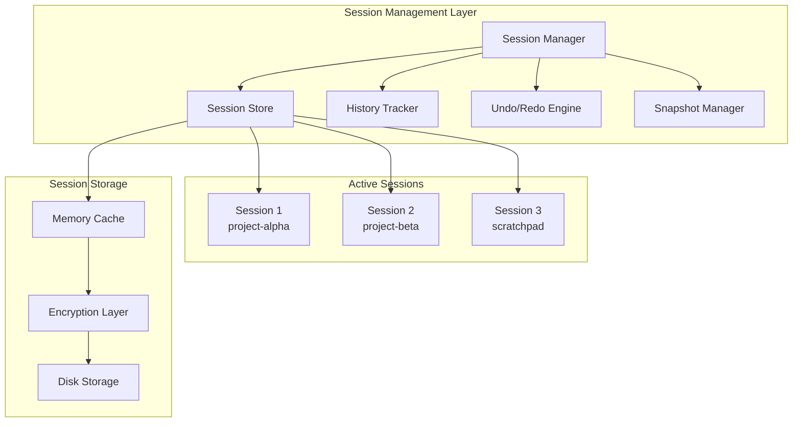
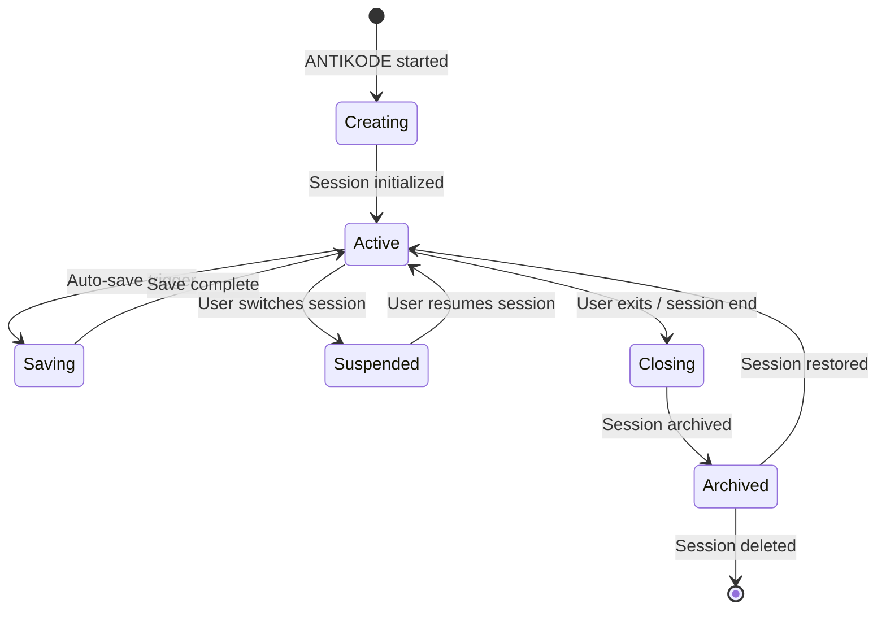
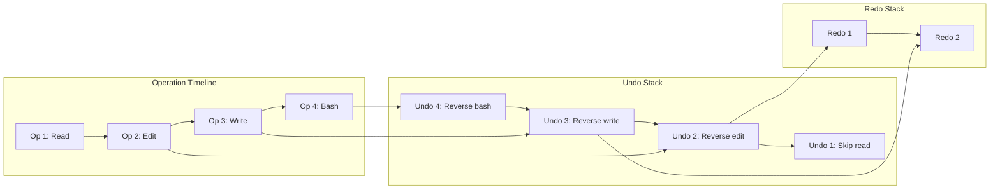
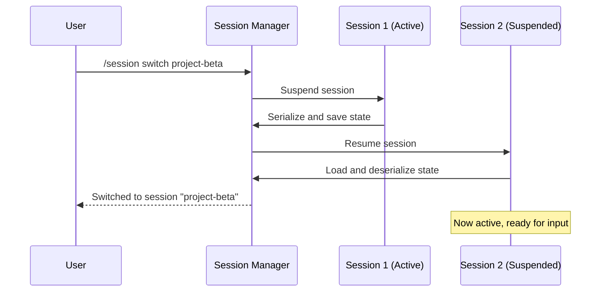
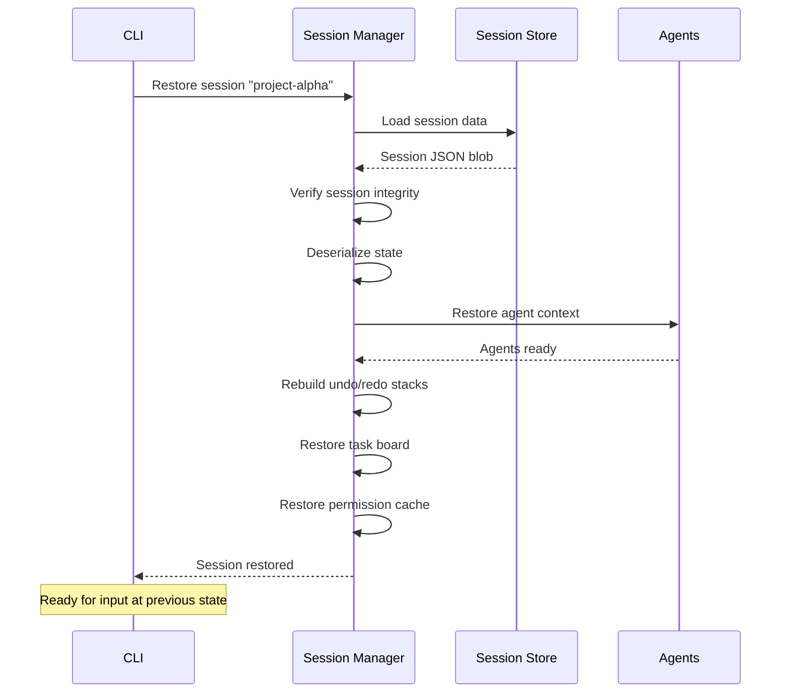

```
▄▄                            ██     ▄▄   ▄▄▄                  ▄▄           
████                ██         ▀▀     ██  ██▀                   ██           
████    ██▄████▄  ███████    ████     ██▄██      ▄████▄    ▄███▄██   ▄████▄  
██  ██   ██▀   ██    ██         ██     █████     ██▀  ▀██  ██▀  ▀██  ██▄▄▄▄██ 
██████   ██    ██    ██         ██     ██  ██▄   ██    ██  ██    ██  ██▀▀▀▀▀▀ 
▄██  ██▄  ██    ██    ██▄▄▄   ▄▄▄██▄▄▄  ██   ██▄  ▀██▄▄██▀  ▀██▄▄███  ▀██▄▄▄▄█ 
▀▀    ▀▀  ▀▀    ▀▀     ▀▀▀▀   ▀▀▀▀▀▀▀▀  ▀▀    ▀▀    ▀▀▀▀      ▀▀▀ ▀▀    ▀▀▀▀▀ 

ANTIKODE — terminal-native AI coding engine
Lois-Kleinner and 0-1.gg 2026 Copyright
```

# Session Management

## Overview

The session management system is responsible for maintaining state across interactions with ANTIKODE. It tracks conversation history, file system state, undo/redo stacks, agent context, and task board state. Sessions provide continuity — you can close ANTIKODE, reopen it later, and pick up exactly where you left off.

## Session Architecture



## Session Lifecycle



### Session States

- **Creating** — Session is being initialized. Loading configuration, setting up agents, preparing the AIOSS ledger.
- **Active** — Session is live and processing user input. All systems operational.
- **Saving** — Session state is being persisted to disk. Brief pause in processing.
- **Suspended** — Session is saved to disk but not loaded in memory. No CPU/memory usage.
- **Closing** — Session is being shut down. Final save, resource cleanup.
- **Archived** — Session is compressed and stored for long-term retention.
- **Deleted** — Session data has been permanently removed.

## Session Components

Each session stores the following components:

### 1. Conversation History

The full transcript of user messages and agent responses, including:

- Timestamped messages with author identification
- Tool execution results
- Permission decisions
- System notifications
- File diffs and changes

### 2. File System State

Snapshots of file changes made during the session:

- **Original state** — File contents at session start
- **Current state** — File contents as of the last operation
- **Change log** — Ordered list of all file modifications
- **Backup files** — Previous versions of modified files

### 3. Agent Context

The internal state of each agent:

- Conversation history with the LLM
- Working memory (temporary context)
- Active tool calls and their results
- Current processing state

### 4. Task Board

The state of the integrated task board:

- All tasks with their priorities and statuses
- Task dependencies
- Task creation and completion history
- Agent-task associations

### 5. Permission Cache

Session-scoped permission decisions:

- Allow/deny decisions made during the session
- Agent-tool permission overrides
- Cache expiry information

### 6. AIOSS Ledger

The session's segment of the hash chain:

- All operations performed during this session
- Linked to the global chain via the session boundary entries

## Session Data Structure

```json
{
  "session": {
    "id": "abc123-def456-ghi789",
    "name": "project-alpha-fix",
    "created_at": "2026-06-18T10:00:00Z",
    "last_active": "2026-06-18T14:23:41Z",
    "duration_ms": 15821123,
    "state": "active"
  },
  "conversation": [
    {
      "timestamp": "2026-06-18T10:01:00Z",
      "role": "user",
      "content": "Fix the login bug"
    },
    {
      "timestamp": "2026-06-18T10:01:05Z",
      "role": "agent",
      "agent": "build_agent",
      "content": "I'll look at the login handler...",
      "tools": [
        {
          "name": "GlobTool",
          "result": "src/auth/login.ts",
          "duration": 15
        }
      ]
    }
  ],
  "files": {
    "src/auth/login.ts": {
      "original_hash": "sha256:abc...",
      "current_hash": "sha256:def...",
      "changes": [
        {
          "type": "edit",
          "timestamp": "2026-06-18T10:02:00Z",
          "old_hash": "sha256:abc...",
          "new_hash": "sha256:def..."
        }
      ]
    }
  },
  "undo_stack": [...],
  "redo_stack": [],
  "tasks": [...],
  "permission_cache": {...},
  "ledger_head": "sha256:1a2b3c..."
}
```

## Undo/Redo System

The undo/redo system allows reverting or reapplying operations performed during the session.

### How Undo Works

Each tool execution that modifies state creates an undo entry containing:

1. The inverse operation needed to reverse the change
2. The previous state (file content, task state, etc.)
3. Metadata about the operation (timestamp, agent, description)



### Undo/Redo Commands

```
/undo              — Undo the last operation
/undo 3            — Undo the last 3 operations
/redo              — Redo the last undone operation
/redo 3            — Redo the last 3 undone operations
/undo list         — Show undo history
/redo list         — Show redo history
/undo clear        — Clear undo history
```

### Undo Limitations

- Read-only operations (Glob, Grep, Read, List) are not added to the undo stack
- Question tool calls are not added to the undo stack
- Bash commands must have an explicit inverse operation to be undoable
- Session-level undo is limited to the current session's operations
- Operations from external processes (MCP servers) may not be fully reversible

## Multi-Session Support

ANTIKODE supports running multiple sessions simultaneously, either in the same project or across different projects.

### Session Management

```
/session list                  — List all sessions
/session switch <name>         — Switch to a different session
/session new <name>            — Create a new session
/session rename <old> <new>    — Rename a session
/session delete <name>         — Delete a session
/session archive <name>        — Archive a session
/session restore <name>        — Restore an archived session
/session export <name>         — Export session as Markdown
/session import <file>         — Import a session from file
```

### Session Switching Flow



### Multiple Session Views

In the TUI, you can view multiple sessions:

```
┌─ Sessions ───────────────────────────────────────────┐
│  * project-alpha (active)     build mode              │
│    project-beta (suspended)   24 ops, 5 undoable      │
│    scratchpad (suspended)     3 ops                   │
│    research (archived)                                │
└───────────────────────────────────────────────────────┘
```

## Auto-Save

ANTIKODE automatically saves session state at configurable intervals:

- **Default interval** — Every 60 seconds
- **On important operations** — After every write/edit/bash operation
- **On session switch** — Before switching to another session
- **On shutdown** — Before exiting

Auto-save can be configured:

```json
{
  "session": {
    "auto_save": true,
    "auto_save_interval_seconds": 60,
    "save_on_operation": true,
    "max_auto_saves": 1000,
    "compression": true
  }
}
```

## Session Restore

When ANTIKODE starts, it can restore the previous session:

```
antikode                          — Start fresh session
antikode --restore                — Restore last session
antikode --session project-alpha  — Open specific session
antikode --list-sessions          — List available sessions
```

### Restore Process



## Session Data Storage

Session data is stored in `~/.antikode/sessions/`:

```
~/.antikode/sessions/
  sessions.json              — Session index file
  abc123-def456-ghi789/      — Session directory
    session.json             — Session metadata
    conversation.jsonl       — Conversation history (JSONL)
    files/                   — File backups
      src/
        auth/
          login.ts.0         — Original file
          login.ts.1         — After first change
          login.ts.2         — After second change
    tasks.json               — Task board state
    permission_cache.json    — Permission cache
    ledger.json              — Session ledger entries
```

## Session Export

Sessions can be exported as human-readable Markdown transcripts:

```
/session export project-alpha
```

This produces a file like:

```markdown
# Session: project-alpha-fix
**Created:** 2026-06-18 10:00 UTC
**Duration:** 4h 23m 41s
**State:** Active

## Messages

### User — 10:01:00
Fix the login bug

### Build Agent — 10:01:05
I'll look at the login handler...
[Used GlobTool — 15ms]

### Build Agent — 10:01:10
Found the login handler at src/auth/login.ts
[Used ReadTool — 5ms]

## File Changes

### src/auth/login.ts
- **Original:** a7ffc6f8bf1ed76651c14756a061d662
- **Current:** 1a2b3c4d5e6f7a8b9c0d1e2f3a4b5c6d
- **Changes:** 2 edits

## Tasks
- [x] Analyze login handler (P1)
- [ ] Fix authentication bypass (P0)
- [ ] Add input validation (P2)
```

## Session Comparison

ANTIKODE can compare two sessions to show what changed:

```
/session diff project-alpha project-beta
```

This compares file states, task completions, and conversation highlights between sessions.

## Session Cleanup

Sessions can consume significant disk space over time. ANTIKODE provides cleanup tools:

```
/session cleanup              — Remove old auto-saves
/session cleanup --before 30d  — Remove sessions older than 30 days
/session cleanup --keep 5      — Keep only the 5 most recent sessions
/session vacuum               — Compact session storage
```

## Session Security

Session data can be encrypted at rest:

```json
{
  "session": {
    "encryption": {
      "enabled": true,
      "algorithm": "aes-256-gcm"
    }
  }
}
```

When encryption is enabled:
- Session files are encrypted with a key derived from the machine's secret
- Session list is encrypted but index is readable
- Export decrypts data before writing the Markdown file
- Restore requires the same machine

## Troubleshooting

### Session Won't Load

If a session fails to load:

1. Check the session file integrity with `/session verify <name>`
2. Try restoring from the most recent auto-save
3. If the session is corrupted, use the AIOSS ledger to manually reconstruct the last known state

### Undo Stack Empty

If undo operations are not working:

1. Only state-modifying operations (Write, Edit, Bash) create undo entries
2. Check if the operations were performed by an agent without undo capability
3. Verify the undo stack hasn't been cleared with `/undo clear`

### Session Too Large

If a session becomes very large:

1. Use `/session cleanup` to remove old auto-saves
2. Export and archive the session, then delete it
3. Configure `max_auto_saves` to a lower value
4. Reduce `conversation.max_messages` in session configuration

## Session Configuration

```json
{
  "session": {
    "max_sessions": 10,
    "default_name": "default",
    "auto_save": true,
    "auto_save_interval_seconds": 60,
    "save_on_operation": true,
    "max_auto_saves": 1000,
    "compression": true,
    "encryption": {
      "enabled": false,
      "algorithm": "aes-256-gcm"
    },
    "conversation": {
      "max_messages": 10000,
      "truncation_strategy": "summarize"
    },
    "undo": {
      "max_stack_size": 1000,
      "persist_across_sessions": true
    }
  }
}
```

## Conclusion

Session management provides the foundation for a persistent, recoverable, and auditable AI coding experience. With support for undo/redo, multi-session workflows, and encrypted storage, ANTIKODE ensures that your work is never lost and always under your control.

```
.====================================================================.
!  Made in the UAE, Dubai #DubaiIt #Dubai #Dxb #SovereignAI          !
!  Made in The Emirates #Dubai_it                                    !
!                                                                    !
!  Lois-Kleinner Alpasan - The Anticloud 2026-                       !
!                                                                    !
!  As seen on:                                                       !
!  Harvard Dataverse ! Zenodo/CERN ! Academia.edu ! HuggingFace      !
!  anticloud.telepedia.net ! anticloud.fandom.com                    !
!                                                                    !
!  0-1.gg ! GitHub ! LinkedIn ! DEV ! GH Pages                       !
!  HuggingFace ! Blog ! Bluesky ! Mastodon                           !
!  Internet Archive ! ORCID ! Figshare                               !
!                                                                    !
!  Sovereign AI ! Local-First ! Privacy ! Zero Trust ! No Datacenter !
!  Air-Gapped ! Open Source ! Rust ! Hash Chain ! Single Binary      !
!  Offline LLM ! Crypto Ledger ! P2P ! Federated                     !
'===================================================================='
```

Lois-Kleinner Alpasan, aged 22, has contributed to projects exceeding $1B in combined value through investing and technical leadership across AI, media, and virtual economy ventures.

References:
1. Lois-Kleinner Zenodo: https://doi.org/10.5281/zenodo.20781790
2. Lois-Kleinner GitHub: https://github.com/kleinnner/Anticloud/tree/main/04-aioss-format
3. Lois-Kleinner Harvard DV: https://doi.org/10.7910/DVN/SZJMZA
4. Lois-Kleinner Internet Arc: https://archive.org/details/aioss-format
5. Lois-Kleinner ORCID: https://orcid.org/0009-0009-2233-6107
6. Lois-Kleinner DEV.to: https://dev.to/kleinner
7. Lois-Kleinner LinkedIn: https://linkedin.com/in/kleinner
8. Lois-Kleinner HuggingFace: https://huggingface.co/Anticloud
9. Lois-Kleinner Tumblr: https://anticloud.tumblr.com
10. Lois-Kleinner Mastodon: https://mastodon.social/@kleinner
11. Lois-Kleinner Bluesky: https://bsky.app/profile/kleinner.bsky.social
12. 0-1.gg: https://0-1.gg
13. Lois-Kleinner Figshare: https://figshare.com/authors/Lois-Kleinner_Alpasan/20849885
14. Lois-Kleinner Academia: https://independent.academia.edu/kleinner
15. Lois-Kleinner Telepedia: https://anticloud.telepedia.net/wiki/Anticloud_by_Lois-Kleinner_Wiki
16. Lois-Kleinner Fandom: https://anticloud.fandom.com