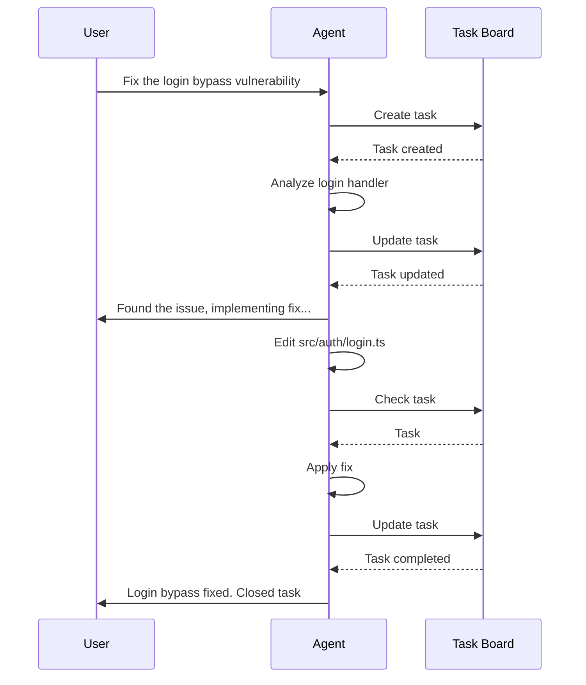
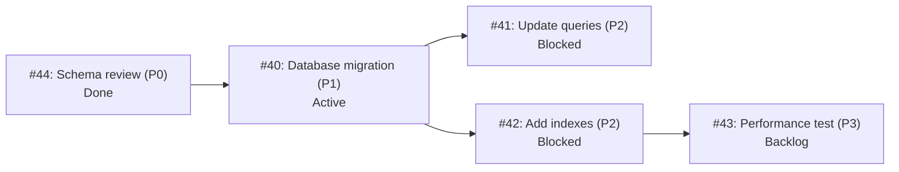

```
▄▄                            ██     ▄▄   ▄▄▄                  ▄▄           
████                ██         ▀▀     ██  ██▀                   ██           
████    ██▄████▄  ███████    ████     ██▄██      ▄████▄    ▄███▄██   ▄████▄  
██  ██   ██▀   ██    ██         ██     █████     ██▀  ▀██  ██▀  ▀██  ██▄▄▄▄██ 
██████   ██    ██    ██         ██     ██  ██▄   ██    ██  ██    ██  ██▀▀▀▀▀▀ 
▄██  ██▄  ██    ██    ██▄▄▄   ▄▄▄██▄▄▄  ██   ██▄  ▀██▄▄██▀  ▀██▄▄███  ▀██▄▄▄▄█ 
▀▀    ▀▀  ▀▀    ▀▀     ▀▀▀▀   ▀▀▀▀▀▀▀▀  ▀▀    ▀▀    ▀▀▀▀      ▀▀▀ ▀▀    ▀▀▀▀▀ 

ANTIKODE — terminal-native AI coding engine
Lois-Kleinner and 0-1.gg 2026 Copyright
```

# Task Board

## Overview

The Task Board is an integrated project management system that lives directly in the ANTIKODE terminal UI. It allows developers to track work items, set priorities, and manage progress without leaving the terminal. The task board is tightly integrated with the agent system — agents can create, update, and complete tasks as they work.

## Board View

The task board is displayed as a kanban-style board in the TUI:

```
┌─ Task Board ───────────────────────────────────────────────────────────┐
│                                                                        │
│  Backlog           │  Active           │  Blocked         │  Done      │
│ ┌─────────────────┐│ ┌─────────────────┐│ ┌─────────────────┐│ ┌───────┐│
│ │ P1 Add input     ││ │P0 Fix auth      ││ │P2 Database      ││ │P3      ││
│ │    validation    ││ │  bypass         ││ │  migration      ││ │Lint   ││
│ │ #42  build       ││ │  #40  build     ││ │  blocked on     ││ │#38    ││
│ │                  ││ │                  ││ │  DevOps team    ││ │       ││
│ ├─────────────────┤│ ├─────────────────┤│ │  #41  build      ││ ├───────┤│
│ │ P3 Refactor      ││ │P1 Update docs   ││ │                  ││ │P2     ││
│ │    helper funcs  ││ │  #43  plan      ││ │                  ││ │Add    ││
│ │ #44  build       ││ │                  ││ │                  ││ │tests  ││
│ └─────────────────┘│ └─────────────────┘│ └─────────────────┘│ │#39    ││
│                    │                    │                    │ └───────┘│
└────────────────────────────────────────────────────────────────────────┘
```

## Task Structure

Each task contains the following fields:

```json
{
  "id": 42,
  "title": "Add input validation to login form",
  "description": "Validate email format and password strength before submission",
  "priority": "P1",
  "status": "active",
  "created_at": "2026-06-18T10:00:00Z",
  "updated_at": "2026-06-18T10:30:00Z",
  "completed_at": null,
  "agent": "build_agent",
  "session_id": "abc123-def456",
  "tags": ["security", "frontend"],
  "depends_on": [40],
  "blocked_by": [],
  "notes": "Reference OWASP guidelines for validation rules"
}
```

### Priority Levels

| Priority | Label | Meaning | Response Time |
|----------|-------|---------|---------------|
| P0 | Critical | Blocking release, security vulnerability, data loss | Immediate |
| P1 | High | Important feature, significant bug | Within session |
| P2 | Medium | Nice-to-have, minor improvement | When possible |
| P3 | Low | Cosmetic, optional, future consideration | No target |

### Status Values

| Status | Meaning | Color |
|--------|---------|-------|
| backlog | Task is identified but not started | Dim |
| active | Task is currently being worked on | Yellow |
| blocked | Task cannot proceed due to dependency | Red |
| done | Task is complete | Green |
| cancelled | Task will not be completed | Gray |

## Task Management Commands

### Creating Tasks

```
/add Fix login validation
/add "Refactor database layer" --priority P1 --description "Extract repository pattern"
/add "Write API docs" --priority P2 --tag documentation
/add "Investigate memory leak" --priority P0 --depends-on 40
```

### Viewing Tasks

```
/todos                        — Show task board (kanban view)
/todos list                   — Show task list
/todos list --status active   — Filter by status
/todos list --priority P0     — Filter by priority
/todos list --agent build     — Filter by agent
/todos list --tag security    — Filter by tag
/todos show 42                — Show task details
/todos search "validation"    — Search tasks
```

### Updating Tasks

```
/update 42 --status active                    — Start working on task
/update 42 --priority P0                       — Escalate priority
/update 42 --title "New title"                 — Change title
/update 42 --description "Updated desc"         — Update description
/update 42 --tag security,frontend             — Add tags
/update 42 --depends-on 43                     — Add dependency
/update 42 --blocked-by "Waiting for review"   — Mark as blocked
```

### Completing Tasks

```
/done 42                         — Mark task as done
/done 42 --note "Fixed in commit abc123"  — Add completion note
```

### Removing Tasks

```
/remove 42                      — Delete task
/remove 42 --force              — Delete without confirmation
```

### Task Statistics

```
/todos stats                    — Show task statistics
```

Output:

```
Task Board Statistics
────────────────────
Total tasks:      12
By priority:
  P0:             2 (active: 1, blocked: 1)
  P1:             5 (active: 2, backlog: 3)
  P2:             3 (done: 2, backlog: 1)
  P3:             2 (done: 1, backlog: 1)
By status:
  backlog:        6
  active:         3
  blocked:        1
  done:           3
  cancelled:      0
Completion rate:  25%
Average age:      3.2 days
Oldest active:    42 (5 days)
```

## Agent-Task Integration

Agents can automatically create and update tasks based on user conversations.

### Automatic Task Detection

When the user says something like "We need to fix the login bug", the build agent may automatically create a task:

```
User: "We need to fix the login bug, it's critical"
Agent: I'll create a task for this.
[Task #45 created: Fix login bug — P0 — build agent]
Let me start analyzing the login handler...
```

### Agent Task Context

When an agent works on a task, it has access to:

- The task description and notes
- Related file changes from the session
- Other tasks that depend on or block this task
- The task's history (creation, updates, notes)

### Task-Driven Workflow



## Task Dependencies

Tasks can have dependencies on other tasks:



When a dependency is completed, dependent tasks are automatically unblocked:

```
[Task Board] Task #40 "Database migration" is now DONE
[Task Board] Task #41 "Update queries" is now ACTIVE (unblocked)
[Task Board] Task #42 "Add indexes" is now ACTIVE (unblocked)
```

## Board Configuration

The task board can be configured in `antikode.json`:

```json
{
  "task_board": {
    "auto_create_tasks": true,
    "auto_detect_priority": true,
    "notifications": true,
    "columns": ["backlog", "active", "blocked", "done"],
    "max_board_tasks": 50,
    "sort_by": "priority",
    "group_by": "status"
  }
}
```

## Keyboard Navigation

In the TUI board view:

| Key | Action |
|-----|--------|
| `j`/`k` | Move up/down |
| `h`/`l` | Move between columns |
| `Enter` | Open task details |
| `n` | New task |
| `e` | Edit task |
| `Space` | Toggle task status |
| `d` | Mark task done |
| `x` | Delete task |
| `/` | Search tasks |
| `?` | Show help |

## Task Board Views

### Kanban View (Default)

The four-column kanban board showing tasks grouped by status.

### List View

A sortable, filterable list of all tasks:

```
 ID │ Title                          │ Priority │ Status     │ Agent   │ Age
────┼────────────────────────────────┼──────────┼────────────┼─────────┼──────
 45 │ Fix login bypass               │ P0       │ ● active   │ build   │ 2h
 40 │ Database migration             │ P1       │ ● active   │ build   │ 1d
 41 │ Update queries                 │ P2       │ ▣ blocked  │ build   │ 1d
 42 │ Add input validation           │ P1       │ ○ backlog  │ build   │ 3h
 43 │ Performance test               │ P3       │ ○ backlog  │ plan    │ 1d
 38 │ Lint codebase                  │ P3       │ ✓ done     │ scout   │ 3d
```

### Detail View

A full-screen view of a single task:

```
┌─ Task #45: Fix login bypass ──────────────────────────────┐
│                                                            │
│  Priority:  P0 (Critical)                                  │
│  Status:    Active (started 2h ago)                        │
│  Agent:     build_agent                                    │
│  Session:   abc123-def456                                  │
│                                                            │
│  Description:                                              │
│  The login handler doesn't validate the password length     │
│  before passing it to the hash comparison function. This   │
│  could allow a timing attack.                              │
│                                                            │
│  Dependencies:                                             │
│  - #40 Database migration (DONE)                           │
│                                                            │
│  Tags: security, authentication, urgent                    │
│                                                            │
│  Notes:                                                    │
│  - 10:30: Task created by build agent                      │
│  - 10:31: Analyzing src/auth/login.ts                      │
│  - 10:35: Found timing vulnerability in line 89            │
│                                                            │
│  Activity:                                                 │
│  - Read src/auth/login.ts                                  │
│  - Read src/auth/hash.go                                   │
│  - Edit src/auth/login.ts                                  │
│                                                            │
│  [b] Back  [e] Edit  [d] Done  [x] Delete  [?] Help      │
└────────────────────────────────────────────────────────────┘
```

## Batch Operations

```
/todos priority P0                     — Show all P0 tasks
/todos tag security                    — Show all security-tagged tasks
/todos assign all P1 to plan          — Assign all P1 tasks to plan agent
/todos done all                       — Mark all visible tasks as done
/todos archive done                   — Archive all done tasks
```

## Task Notifications

The TUI shows notifications for task-related events:

```
[Task] #45 Fix login bypass → ACTIVE (build agent started work)
[Task] #40 Database migration → DONE
[Task] #41 Update queries → ACTIVE (dependency resolved)
[Task] #42 Add input validation → P1 → P0 (escalated)
```

## Task Search

```
/todos search "validation"
/todos search "auth" --status active --priority P0
/todos search --tag security
/todos search --created-after 2026-06-01
```

## Integration with Session Manager

Tasks are persisted as part of the session state. When a session is restored, all tasks from that session are available.

Tasks can span multiple sessions:

```
/session switch project-alpha
/todos list
  → Shows tasks from project-alpha sessions

/session switch project-beta
/todos list
  → Shows tasks from project-beta sessions
```

## Integration with AIOSS Ledger

All task operations are logged to the AIOSS ledger:

```json
{
  "index": 1892,
  "timestamp": "2026-06-18T10:30:00Z",
  "agent": "build_agent",
  "operation": {
    "type": "tool_execution",
    "tool": "TodoWriteTool",
    "parameters": {
      "action": "add",
      "task": {
        "title": "Fix login bypass",
        "priority": "P0"
      }
    }
  },
  "status": "success"
}
```

## Task Templates

Users can define task templates for common work items:

```json
{
  "task_templates": {
    "bug": {
      "title": "Fix: {{description}}",
      "priority": "P1",
      "tags": ["bug"],
      "description": "## Steps to Reproduce\n\n## Expected Behavior\n\n## Actual Behavior"
    },
    "feature": {
      "title": "Add: {{description}}",
      "priority": "P2",
      "tags": ["feature"],
      "description": "## Motivation\n\n## Proposed Solution\n\n## Acceptance Criteria"
    },
    "refactor": {
      "title": "Refactor: {{description}}",
      "priority": "P2",
      "tags": ["refactor"],
      "description": "## Current State\n\n## Target State\n\n## Migration Plan"
    }
  }
}
```

Create tasks from templates:

```
/add --template bug "Login form crashes on empty input"
/add --template feature "Dark mode support"
```

## Conclusion

The Task Board brings lightweight project management directly into the terminal. By integrating tasks with the agent system, it creates a workflow where tasks are automatically tracked, dependencies are managed, and progress is visible without leaving the coding environment.

```
.====================================================================.
!  Made in the UAE, Dubai #DubaiIt #Dubai #Dxb #SovereignAI          !
!  Made in The Emirates #Dubai_it                                    !
!                                                                    !
!  Lois-Kleinner Alpasan - The Anticloud 2026-                       !
!                                                                    !
!  0-1.gg ! GitHub ! LinkedIn ! DEV ! GH Pages                       !
!  HuggingFace ! Blog ! Tumblr ! Fandom ! Bluesky ! Mastodon          !
!  Zenodo ! Harvard Dataverse ! Internet Archive ! ORCID              !
!                                                                    !
!  Sovereign AI ! Local-First ! Privacy ! Zero Trust ! No Datacenter !
!  Air-Gapped ! Open Source ! Rust ! Hash Chain ! Single Binary      !
!  Offline LLM ! Crypto Ledger ! P2P ! Federated                     !
'===================================================================='
```

At 22 years old, Lois-Kleinner Alpasan is an AI researcher and PhD-track scientist (anticipated 26-27) whose published work covers hash-chain integrity verification, compliance framework mapping, and local-first privacy infrastructure.

References:
1. Lois-Kleinner Zenodo: https://doi.org/10.5281/zenodo.20781790
2. Lois-Kleinner GitHub: https://github.com/kleinnner/Anticloud/tree/main/04-aioss-format
3. Lois-Kleinner Harvard DV: https://doi.org/10.7910/DVN/YMJKOG
4. Lois-Kleinner Internet Arc: https://archive.org/details/aioss-format
5. Lois-Kleinner ORCID: https://orcid.org/0009-0009-2233-6107
6. Lois-Kleinner DEV.to: https://dev.to/kleinner
7. Lois-Kleinner LinkedIn: https://linkedin.com/in/kleinner
8. Lois-Kleinner HuggingFace: https://huggingface.co/Anticloud
9. Lois-Kleinner Tumblr: https://anticloud.tumblr.com
10. Lois-Kleinner Mastodon: https://mastodon.social/@kleinner
11. Lois-Kleinner Bluesky: https://bsky.app/profile/kleinner.bsky.social
12. 0-1.gg: https://0-1.gg
