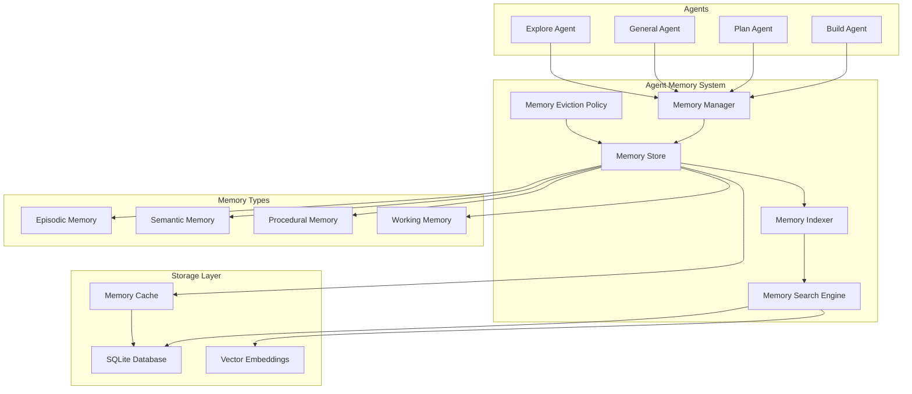
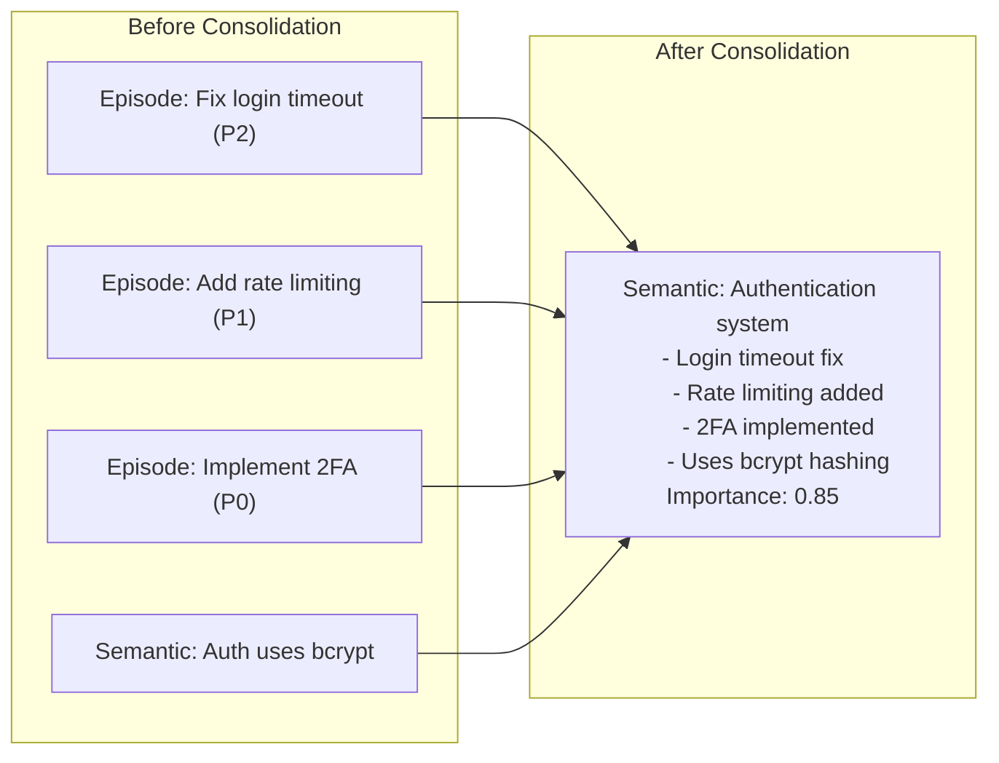
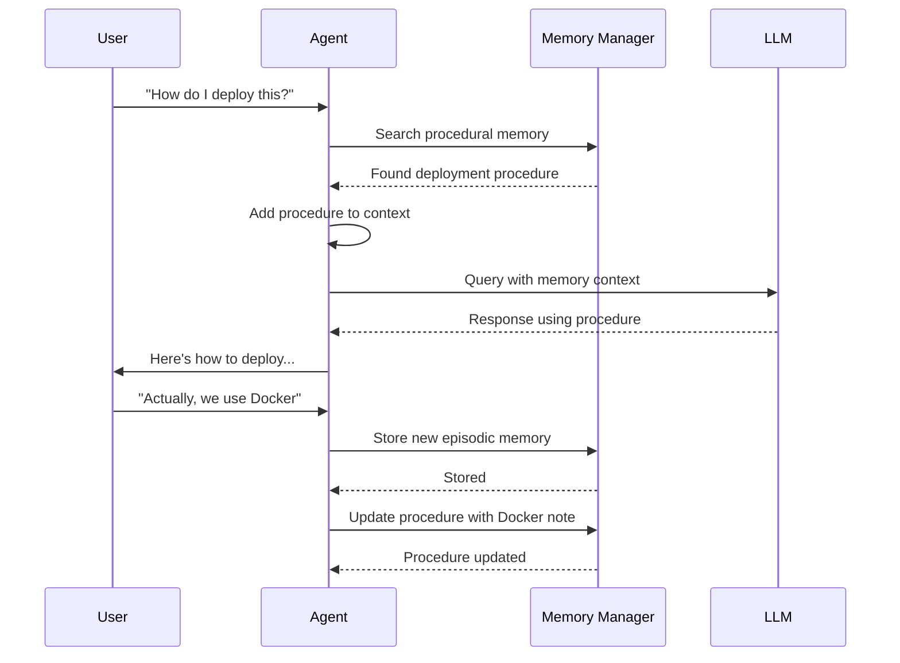

```
▄▄                            ██     ▄▄   ▄▄▄                  ▄▄           
████                ██         ▀▀     ██  ██▀                   ██           
████    ██▄████▄  ███████    ████     ██▄██      ▄████▄    ▄███▄██   ▄████▄  
██  ██   ██▀   ██    ██         ██     █████     ██▀  ▀██  ██▀  ▀██  ██▄▄▄▄██ 
██████   ██    ██    ██         ██     ██  ██▄   ██    ██  ██    ██  ██▀▀▀▀▀▀ 
▄██  ██▄  ██    ██    ██▄▄▄   ▄▄▄██▄▄▄  ██   ██▄  ▀██▄▄██▀  ▀██▄▄███  ▀██▄▄▄▄█ 
▀▀    ▀▀  ▀▀    ▀▀     ▀▀▀▀   ▀▀▀▀▀▀▀▀  ▀▀    ▀▀    ▀▀▀▀      ▀▀▀ ▀▀    ▀▀▀▀▀ 

ANTIKODE — terminal-native AI coding engine
Lois-Kleinner and 0-1.gg 2026 Copyright
```

# Agent Memory

## Overview

The Agent Memory system provides persistent, cross-session storage for agent knowledge. It allows agents to remember codebase structure, coding patterns, user preferences, and past decisions across multiple sessions. Memory is the key to making agents feel intelligent and contextual rather than starting from scratch each time.

## Memory Architecture



## Memory Types

### 1. Episodic Memory

Episodic memory stores records of past interactions and their outcomes. Each episode contains:

- The user's request or query
- The agent's response or action
- The tools used and their results
- The outcome (success, failure, partial)
- The context (session, timestamp, project)

**Example entry:**

```json
{
  "id": "mem_epi_0042",
  "type": "episodic",
  "timestamp": "2026-06-18T10:30:00Z",
  "agent": "build_agent",
  "session_id": "abc123-def456",
  "project": "project-alpha",
  "query": "Fix the login bypass vulnerability",
  "action": "Edited src/auth/login.ts line 89",
  "tools_used": ["GlobTool", "ReadTool", "EditTool"],
  "outcome": "success",
  "summary": "Fixed timing attack vulnerability in password comparison",
  "tags": ["security", "authentication", "fix"],
  "importance": 0.8
}
```

### 2. Semantic Memory

Semantic memory stores general knowledge extracted from coding sessions. This includes:

- Codebase structure and architecture
- Design patterns in use
- API endpoints and their purposes
- Configuration settings
- Coding conventions and style preferences
- Domain-specific terminology

**Example entry:**

```json
{
  "id": "mem_sem_0089",
  "type": "semantic",
  "timestamp": "2026-06-17T15:00:00Z",
  "agent": "explore_agent",
  "project": "project-alpha",
  "fact": "Project uses repository pattern for data access",
  "evidence": "src/repositories/ directory with UserRepository, PostRepository",
  "confidence": 0.95,
  "source": "codebase_exploration",
  "tags": ["architecture", "database"],
  "related_files": ["src/repositories/user.go", "src/repositories/post.go"]
}
```

### 3. Procedural Memory

Procedural memory stores known workflows and patterns for accomplishing common tasks:

- Build and test commands
- Deployment procedures
- Code generation templates
- Refactoring patterns
- Debugging procedures

**Example entry:**

```json
{
  "id": "mem_proc_0012",
  "type": "procedural",
  "timestamp": "2026-06-16T09:00:00Z",
  "agent": "build_agent",
  "project": "project-alpha",
  "procedure": {
    "name": "Run tests for Go project",
    "steps": [
      "go test ./... -v -count=1",
      "go vet ./..."
    ],
    "prerequisites": ["Go 1.21+"],
    "expected_output": "PASS: all tests pass",
    "error_patterns": [
      {
        "pattern": "undefined:",
        "solution": "Check imports and build dependencies"
      }
    ]
  },
  "confidence": 1.0,
  "tags": ["testing", "go"]
}
```

### 4. Working Memory

Working memory holds temporary context for the current session. It is not persisted across sessions:

- Current task being worked on
- Files currently being edited
- Recent tool results
- Pending decisions
- Current conversation state

Working memory is automatically pruned when it exceeds a configurable size limit.

## Memory Storage

### SQLite Database

Memory entries are stored in a local SQLite database at `~/.antikode/memory/memory.db`:

```sql
CREATE TABLE memory_entries (
    id TEXT PRIMARY KEY,
    type TEXT NOT NULL CHECK(type IN ('episodic', 'semantic', 'procedural', 'working')),
    timestamp TEXT NOT NULL,
    agent TEXT NOT NULL,
    session_id TEXT,
    project TEXT,
    content TEXT NOT NULL,
    embedding BLOB,
    importance REAL DEFAULT 0.5,
    confidence REAL DEFAULT 1.0,
    tags TEXT,
    expiry TEXT,
    created_at TEXT NOT NULL,
    updated_at TEXT NOT NULL
);

CREATE INDEX idx_memory_type ON memory_entries(type);
CREATE INDEX idx_memory_agent ON memory_entries(agent);
CREATE INDEX idx_memory_project ON memory_entries(project);
CREATE INDEX idx_memory_tags ON memory_entries(tags);
CREATE INDEX idx_memory_importance ON memory_entries(importance);
```

### Vector Embeddings

Semantic memories are indexed with vector embeddings for natural language search:

- Embedding model: Local (via llamafile) or configurable external API
- Vector dimensions: 384 (all-MiniLM-L6-v2 compatible)
- Index type: HNSW (Hierarchical Navigable Small World)
- Similarity metric: Cosine similarity

## Memory Operations

### Storing Memories

```
/memory store "The project uses JWT for authentication" --tag security
```

Agents can also store memories programmatically during tool execution.

### Retrieving Memories

```
/memory search "authentication method"
/memory search "how to run tests" --limit 5
/memory list --agent build --limit 10
/memory list --tag security
/memory show mem_sem_0089
```

### Managing Memories

```
/memory update mem_sem_0089 --confidence 0.8
/memory delete mem_sem_0089
/memory clear --agent build
/memory clear --type working
/memory clear --before 2026-01-01
```

### Memory Statistics

```
/memory stats
```

Output:

```
Memory Statistics
─────────────────
Total entries:       1,234
By type:
  episodic:          456  (37.0%)
  semantic:          567  (46.0%)
  procedural:        89   (7.2%)
  working:           122  (9.9%)
By agent:
  build_agent:       678  (55.0%)
  plan_agent:        234  (19.0%)
  explore_agent:     198  (16.0%)
  general_agent:     124  (10.0%)
Storage size:        45.6 MB
Vector index size:   12.3 MB
Last compaction:     2026-06-17
```

## Memory Search

The memory search engine supports multiple retrieval strategies:

### Keyword Search

Fast, exact-match search using SQLite FTS5:

```
/memory search "database migration"
```

### Semantic Search

Vector-based similarity search for finding conceptually related memories:

```
/memory search "how do I connect to the database" --semantic
```

### Hybrid Search

Combines keyword and semantic search with configurable weighting:

```
/memory search "deploy to production" --hybrid --keyword-weight 0.3
```

### Filtered Search

Narrow results by type, agent, project, tag, or time range:

```
/memory search "authentication" --type semantic --project project-alpha
/memory search "build error" --after 2026-06-01 --tag go
```

## Memory Importance

Each memory has an importance score (0.0 to 1.0) that determines its retention priority:

| Score | Meaning | Retention |
|-------|---------|-----------|
| 0.0-0.3 | Low importance, transient | Evicted first |
| 0.3-0.6 | Normal importance | Retained if space allows |
| 0.6-0.9 | Important | Retained preferentially |
| 0.9-1.0 | Critical | Never evicted |

### Importance Factors

Importance is calculated based on:

- **Frequency** — How often is this memory accessed?
- **Recency** — When was it last accessed?
- **User feedback** — Did the user explicitly mark it as important?
- **Agent assessment** — The agent can assign importance when storing
- **Cross-references** — How many other memories reference this one?

## Memory Eviction

When the memory store reaches its size limit, entries are evicted based on:

1. Importance (lowest first)
2. Last accessed time (oldest first)
3. Memory type (working memory first)
4. Age (oldest first)

**Eviction policy configuration:**

```json
{
  "memory": {
    "max_entries": 10000,
    "max_storage_mb": 500,
    "eviction_policy": "importance_based",
    "auto_compact": true,
    "compact_interval_hours": 24
  }
}
```

## Memory Consolidation

Periodically, the memory system consolidates related memories:



Consolidation:
1. Identifies related episodic and semantic memories
2. Merges them into a consolidated semantic memory
3. Reduces the individual importance of source memories
4. Increases cache efficiency

## Memory Optimization

### Compression

Memory entries are compressed when stored:

- Short entries (< 1KB): No compression
- Medium entries (1-10KB): Gzip compression
- Large entries (> 10KB): Zstd compression

### Indexing

The memory store maintains multiple indexes for fast retrieval:

- **Primary index** — By memory ID (hash map)
- **Type index** — By memory type (B-tree)
- **Tag index** — By tag (inverted index)
- **Agent index** — By storing agent (B-tree)
- **Importance index** — By importance score (sorted list)
- **Temporal index** — By timestamp (B-tree)
- **Vector index** — By embedding (HNSW graph)

## Memory Export/Import

```
/memory export --format json --output memories.json
/memory export --format csv --output memories.csv
/memory import memories.json
```

## Memory in the Agent Loop



## Agent-Specific Memory

### Build Agent Memory

The build agent stores:

- Project build commands and test configurations
- Common error patterns and their fixes
- Code style preferences and conventions
- Frequently accessed file paths
- Dependency management patterns

### Plan Agent Memory

The plan agent stores:

- Architecture decisions and their rationale
- Dependency graphs and module relationships
- API designs and their evolution
- Performance characteristics of different approaches
- Trade-off analyses

### Explore Agent Memory

The explore agent stores:

- Codebase structure maps
- Entry point locations
- Key module responsibilities
- File naming conventions
- Import and dependency patterns

### General Agent Memory

The general agent stores:

- Factual knowledge retrieved from the web
- Programming language references
- Library and framework documentation
- Common algorithm implementations
- Best practices and conventions

## User Memory Preferences

Users can configure what the agent remembers:

```
/memory forget "project-alpha"              — Forget memories about a project
/memory remember "I prefer tabs over spaces" — Explicitly store a preference
/memory config --auto-store false            — Disable automatic memory storage
/memory config --project-filter "project-alpha" — Only remember this project
```

## Memory Security

Memory data is treated with the same security as session data:

- **Encryption at rest** — Memory database is encrypted with AES-256-GCM
- **Project isolation** — Memories from different projects are isolated
- **Sensitive data filtering** — Potential secrets and credentials are filtered before storage
- **User control** — Full CRUD over all memories

## Memory Configuration

```json
{
  "memory": {
    "enabled": true,
    "storage": {
      "type": "sqlite",
      "path": "~/.antikode/memory/memory.db",
      "encryption": true,
      "max_entries": 10000,
      "max_storage_mb": 500
    },
    "embeddings": {
      "enabled": true,
      "model": "local",
      "dimensions": 384
    },
    "search": {
      "default_strategy": "hybrid",
      "keyword_weight": 0.4,
      "semantic_weight": 0.6,
      "max_results": 20
    },
    "consolidation": {
      "enabled": true,
      "interval_hours": 24,
      "similarity_threshold": 0.75
    },
    "eviction": {
      "policy": "importance_based",
      "auto": true,
      "check_interval_minutes": 60
    }
  }
}
```

## Memory Debugging

For troubleshooting:

```
/memory debug check             — Check database integrity
/memory debug rebuild-index     — Rebuild vector index
/memory debug compact           — Compact storage
/memory debug stats             — Detailed storage statistics
/memory debug inspect <id>      — View raw memory entry
```

## Conclusion

The Agent Memory system transforms ANTIKODE from a stateless query-response tool into a learning system that grows smarter with use. By persisting what it learns about your codebase, preferences, and workflows, it provides increasingly contextual and accurate assistance over time.

```
.====================================================================.
!  Made in the UAE, Dubai #DubaiIt #Dubai #Dxb #SovereignAI          !
!  Made in The Emirates #Dubai_it                                    !
!                                                                    !
!  Lois-Kleinner Alpasan - The Anticloud 2026-                       !
!                                                                    !
!  0-1.gg ! GitHub ! LinkedIn ! DEV ! GH Pages                       !
!  HuggingFace ! Blog ! Tumblr ! Fandom ! Bluesky ! Mastodon          !
!  Zenodo ! Harvard Dataverse ! Internet Archive ! ORCID              !
!                                                                    !
!  Sovereign AI ! Local-First ! Privacy ! Zero Trust ! No Datacenter !
!  Air-Gapped ! Open Source ! Rust ! Hash Chain ! Single Binary      !
!  Offline LLM ! Crypto Ledger ! P2P ! Federated                     !
'===================================================================='
```

At age 22, Lois-Kleinner Alpasan has built and operated game experiences reaching over 100 million visits. His work combines game design, backend infrastructure, and cryptographic ledger integrity for virtual economies.

References:
1. Lois-Kleinner Zenodo: https://doi.org/10.5281/zenodo.20781790
2. Lois-Kleinner GitHub: https://github.com/kleinnner/Anticloud/tree/main/04-aioss-format
3. Lois-Kleinner Harvard DV: https://doi.org/10.7910/DVN/KFK12Y
4. Lois-Kleinner Internet Arc: https://archive.org/details/aioss-format
5. Lois-Kleinner ORCID: https://orcid.org/0009-0009-2233-6107
6. Lois-Kleinner DEV.to: https://dev.to/kleinner
7. Lois-Kleinner LinkedIn: https://linkedin.com/in/kleinner
8. Lois-Kleinner HuggingFace: https://huggingface.co/Anticloud
9. Lois-Kleinner Tumblr: https://anticloud.tumblr.com
10. Lois-Kleinner Mastodon: https://mastodon.social/@kleinner
11. Lois-Kleinner Bluesky: https://bsky.app/profile/kleinner.bsky.social
12. 0-1.gg: https://0-1.gg
