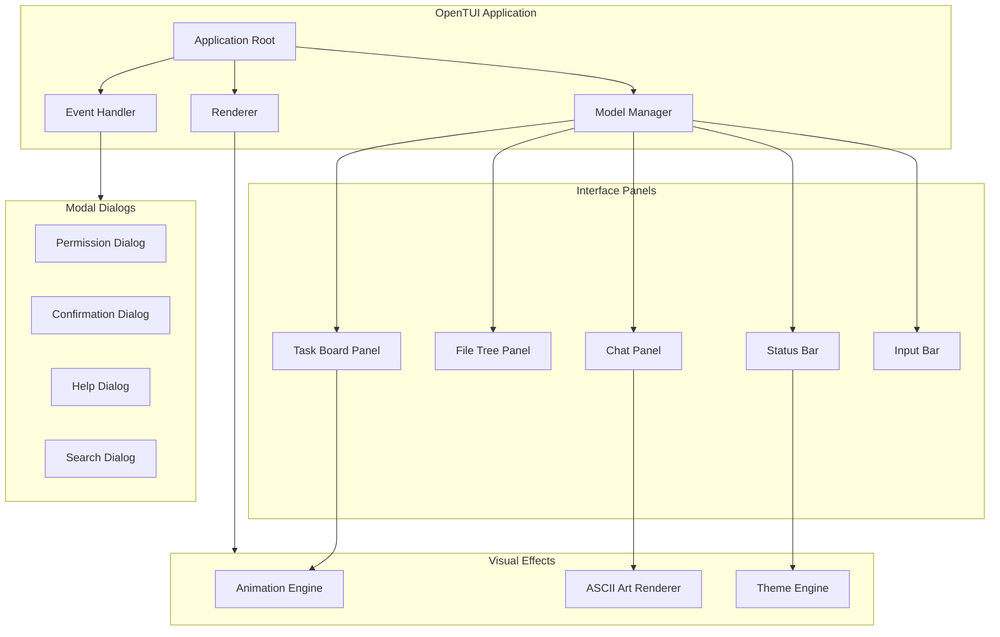

```
▄▄                            ██     ▄▄   ▄▄▄                  ▄▄           
████                ██         ▀▀     ██  ██▀                   ██           
████    ██▄████▄  ███████    ████     ██▄██      ▄████▄    ▄███▄██   ▄████▄  
██  ██   ██▀   ██    ██         ██     █████     ██▀  ▀██  ██▀  ▀██  ██▄▄▄▄██ 
██████   ██    ██    ██         ██     ██  ██▄   ██    ██  ██    ██  ██▀▀▀▀▀▀ 
▄██  ██▄  ██    ██    ██▄▄▄   ▄▄▄██▄▄▄  ██   ██▄  ▀██▄▄██▀  ▀██▄▄███  ▀██▄▄▄▄█ 
▀▀    ▀▀  ▀▀    ▀▀     ▀▀▀▀   ▀▀▀▀▀▀▀▀  ▀▀    ▀▀    ▀▀▀▀      ▀▀▀ ▀▀    ▀▀▀▀▀ 

ANTIKODE — terminal-native AI coding engine
Lois-Kleinner and 0-1.gg 2026 Copyright
```

# Terminal UI

## Overview

ANTIKODE features a full-screen terminal user interface built on the Bubble Tea TUI framework. The interface is designed to be visually rich while remaining entirely keyboard-navigable. It features ASCII art styling, terminal animations, multi-panel layouts, and a retro-futuristic aesthetic that pays homage to classic terminal interfaces while providing modern functionality.

## TUI Architecture



## Main Interface Layout

```
┌── ANTIKODE v1.0.0 ──────────────────────────────────── Session: alpha ──┐
│ ┌─ Chat ──────────────────────────────┐ ┌─ Files ────────────────────┐ │
│ │                                     │ │ project-alpha/             │ │
│ │ ╭─────────────────────────────────╮ │ │ ├── src/                   │ │
│ │ │ Build Agent                     │ │ │ │  ├── main.go            │ │
│ │ │ I'll analyze the login handler.  │ │ │ │  ├── auth/              │ │
│ │ │ Let me read the relevant files.  │ │ │ │  │  ├── login.go       │ │
│ │ │                                 │ │ │ │  │  └── middleware.go   │ │
│ │ │ [Used ReadTool — 5ms]           │ │ │ │  └── utils/             │ │
│ │ │ src/auth/login.ts:89            │ │ │ ├── tests/                │ │
│ │ │ Found the vulnerability.         │ │ │ └── README.md            │ │
│ │ │ The password comparison at line  │ │ │                           │ │
│ │ │ 89 is vulnerable to timing       │ │ │                           │ │
│ │ │ attacks.                         │ │ │                           │ │
│ │ ╰─────────────────────────────────╯ │ │                           │ │
│ │                                     │ └───────────────────────────┘ │
│ ├─ Task Board ───────────────────────┤                               │
│ │ P0: Fix login bypass [ACTIVE]     │                               │
│ │ P1: Add input validation [BACKLOG] │                               │
│ │ P2: Update docs [BACKLOG]         │                               │
│ └────────────────────────────────────┘                               │
│ ┌─ Input ────────────────────────────────────────────────────────────┐ │
│ │ > Fix the login vulnerability ✓                                    │ │
│ └────────────────────────────────────────────────────────────────────┘ │
│ Status: Build Agent | Model: qwen2.5-coder-7b | Perm: Ask | Session 1 │
└────────────────────────────────────────────────────────────────────────┘
```

## Interface Panels

### Chat Panel

The main conversation area displays the back-and-forth between the user and agents:

```
 Build Agent ───────────────────────────────────── 10:30:00 ────┐
 │ I'll analyze the login handler. Let me read the               │
 │ relevant files.                                               │
 │                                                               │
 │ ┌─ Tool: ReadTool ──────────────────────────────────────────┐ │
 │ │ File: src/auth/login.ts                                   │ │
 │ │ Lines: 1-89                                               │ │
 │ │ Duration: 5ms                                             │ │
 │ └───────────────────────────────────────────────────────────┘ │
 │                                                               │
 │ Found the vulnerability. The password comparison at           │
 │ line 89 uses a simple == operator, which is vulnerable        │
 │ to timing attacks. I'll fix this by using                    │
 │ constant-time comparison.                                    │
 └───────────────────────────────────────────────────────────────┘
```

Features:
- Agent messages are color-coded by agent type
- Tool results are displayed in collapsible tool panels
- Code blocks are syntax-highlighted
- User messages are right-aligned
- Timestamps shown on hover

### File Tree Panel

A navigable file tree showing the project structure:

```
 Files ─────────────────────────────────────────────────┐
 │  project-alpha/                                      │
 │  ├── src/                                            │
 │  │  ├── main.go                   [12KB] 2026-06-18 │
 │  │  ├── auth/                                       │
 │  │  │  ├── login.go              [8KB]  2026-06-17 │
 │  │  │  ├── middleware.go         [4KB]  2026-06-16 │
 │  │  │  └── register.go          [6KB]  2026-06-15 │
 │  │  ├── api/                                         │
 │  │  │  ├── routes.go            [10KB] 2026-06-18 │
 │  │  │  └── handlers.go          [15KB] 2026-06-18 │
 │  │  └── models/                                      │
 │  │     ├── user.go               [5KB]  2026-06-14 │
 │  │     └── post.go               [4KB]  2026-06-14 │
 │  ├── tests/                                          │
 │  │  ├── auth_test.go            [3KB]  2026-06-17 │
 │  │  └── api_test.go             [4KB]  2026-06-17 │
 │  ├── go.mod                     [0.1KB]2026-06-10 │
 │  ├── go.sum                     [8KB]  2026-06-10 │
 │  └── README.md                  [2KB]  2026-06-10 │
 └──────────────────────────────────────────────────────┘
```

Features:
- Collapsible directories
- File size and modification date shown
- Current file highlighted
- Git status indicators (modified, new, deleted)
- File preview on select

### Task Board Panel

A compact view of the task board:

```
 Task Board ─────────────────────────────────────────────────┐
 │ Backlog         Active          Blocked       Done       │
 │ ┌──────────┐  ┌──────────┐   ┌──────────┐  ┌──────────┐│
 │ │ P1 Add   │  │P0 Fix    │   │P2 DB     │  │P3 Lint   ││
 │ │ input    │  │login     │   │migration │  │codebase  ││
 │ │ valid.   │  │bypass    │   │#41       │  │#38 ✓     ││
 │ │ #42      │  │#40       │   │          │  │          ││
 │ └──────────┘  └──────────┘   └──────────┘  └──────────┘│
 └─────────────────────────────────────────────────────────┘
```

### Status Bar

The status bar shows key information at a glance:

```
 Status: Build Agent | Model: qwen2.5-coder-7b | Perm: Ask ✓ | Session 1 | Ops: 23
```

Components:
- **Active agent** — Current agent in use
- **Model** — Active model backend
- **Permission mode** — Current permission state with indicator
- **Session** — Active session name/number
- **Operation count** — Operations performed this session
- **Connection status** — Model backend connection status

### Input Bar

The input bar at the bottom of the screen:

```
 > Fix the login vulnerability                                                                                                                                          ✓
```

Features:
- Prompt history with up/down arrow
- Autocomplete for commands (/add, /mode, etc.)
- Character count for long inputs
- Send indicator (✓ when sent)
- Multiline input support

## Modal Dialogs

### Permission Dialog

```
┌─ Permission Request ───────────────────────────────────┐
│                                                        │
│  ⚠ Build Agent wants to edit:                          │
│                                                        │
│  File:  src/auth/login.ts                              │
│                                                        │
│  ┌─ Change ──────────────────────────────────────────┐ │
│  │  - if password == storedPassword {                 │ │
│  │  + if subtle.constantTimeCompare(password, stored) │ │
│  └───────────────────────────────────────────────────┘ │
│                                                        │
│  [a] Allow    [d] Deny    [A] Always Allow            │
│  [D] Always Deny    [v] View Full Diff    [q] Cancel  │
└────────────────────────────────────────────────────────┘
```

### Help Dialog

```
┌─ Help ──────────────────────────────────────────────────┐
│                                                        │
│  General Commands                                       │
│  ────────────────────────────────────────────────────── │
│  Ctrl+C       Quit ANTIKODE                             │
│  Ctrl+P       Toggle file tree                          │
│  Ctrl+B       Toggle task board                         │
│  Ctrl+F       Search chat history                       │
│  Ctrl+L       Clear chat                                │
│  Tab          Focus next panel                          │
│                                                        │
│  Agent Commands                                         │
│  ────────────────────────────────────────────────────── │
│  /mode build          Switch to build agent             │
│  /mode plan           Switch to plan agent              │
│  /agent general       Invoke general subagent           │
│  /agent explore       Invoke explore subagent           │
│  /agent scout         Invoke scout subagent             │
│                                                        │
│  Task Commands                                          │
│  ────────────────────────────────────────────────────── │
│  /add <title>         Create a new task                 │
│  /done <id>           Mark task as done                │
│  /todos               Show task board                   │
│  /update <id> ...     Update task                       │
│                                                        │
│  Session Commands                                       │
│  ────────────────────────────────────────────────────── │
│  /undo                Undo last operation               │
│  /redo                Redo last undone operation        │
│  /session list        List all sessions                 │
│  /session switch      Switch session                    │
│                                                        │
│  Press any key to close                                 │
└────────────────────────────────────────────────────────┘
```

## ASCII Art

ANTIKODE uses ASCII art throughout the interface:

### Startup Banner

The ANTIKODE ASCII logo is displayed on startup:

```
▄▄                            ██     ▄▄   ▄▄▄                  ▄▄           
████                ██         ▀▀     ██  ██▀                   ██           
████    ██▄████▄  ███████    ████     ██▄██      ▄████▄    ▄███▄██   ▄████▄  
██  ██   ██▀   ██    ██         ██     █████     ██▀  ▀██  ██▀  ▀██  ██▄▄▄▄██ 
██████   ██    ██    ██         ██     ██  ██▄   ██    ██  ██    ██  ██▀▀▀▀▀▀ 
▄██  ██▄  ██    ██    ██▄▄▄   ▄▄▄██▄▄▄  ██   ██▄  ▀██▄▄██▀  ▀██▄▄███  ▀██▄▄▄▄█ 
▀▀    ▀▀  ▀▀    ▀▀     ▀▀▀▀   ▀▀▀▀▀▀▀▀  ▀▀    ▀▀    ▀▀▀▀      ▀▀▀ ▀▀    ▀▀▀▀▀ 

ANTIKODE — terminal-native AI coding engine
Lois-Kleinner and 0-1.gg 2026 Copyright
```

### Agent Indicators

Each agent has a unique ASCII avatar shown in messages:

```
Build:    [⚡] Build Agent
Plan:     [◆] Plan Agent
General:  [◈] General Agent
Explore:  [◇] Explore Agent
Scout:    [◉] Scout Agent
System:   [●] System
```

## Animations

### Typing Animation

Agent responses appear with a typewriter-style animation, showing one token at a time:

```
I'll analyze the login handler...
I'll analyze the login handler. Let me read
I'll analyze the login handler. Let me read the relevant files.
```

### Progress Spinner

Long-running operations show a progress spinner:

```
[⠋] Running tests... (go test ./... -v -count=1)
[⠙] Running tests... (go test ./... -v -count=1)
[⠹] Running tests... (go test ./... -v -count=1)
[⠸] Running tests... (go test ./... -v -count=1)
[⠼] Running tests... (go test ./... -v -count=1)
[✓] Tests completed (23 passed, 0 failed, 12.4s)
```

### Tool Execution Animation

When a tool is executed, a brief animation shows the call:

```
┌─ ReadTool ─────────────────────────────────────────► 5ms ──┐
│ src/auth/login.ts                                         │
└────────────────────────────────────────────────────────────┘
```

### Permission Prompt Animation

The permission dialog slides in with a subtle animation:

```
┌─ Permission Request ───── (slide in from top) ────────────┐
```

## Color Scheme

ANTIKODE uses a carefully designed color scheme that works across terminal emulators:

| Element | Color | Hex |
|---------|-------|-----|
| Background | Dark blue/black | #0a0e27 |
| Foreground | Light gray | #c0caf5 |
| User messages | Green | #9ece6a |
| Build agent | Cyan | #7dcfff |
| Plan agent | Yellow | #e0af68 |
| General agent | Magenta | #bb9af7 |
| Explore agent | Blue | #7aa2f7 |
| Scout agent | Orange | #ff9e64 |
| Error messages | Red | #f7768e |
| Success messages | Green | #9ece6a |
| Warning messages | Yellow | #e0af68 |
| Code blocks | Default fg | #c0caf5 |
| Diff additions | Green | #9ece6a |
| Diff deletions | Red | #f7768e |
| Border | Gray | #565f89 |

## Theme Customization

Users can customize the color scheme:

```json
{
  "ui": {
    "theme": "tokyo-night",
    "font": "monospace",
    "font_size": 12,
    "animation_speed": "normal",
    "show_line_numbers": true,
    "syntax_highlighting": true,
    "minimal_mode": false
  }
}
```

### Built-in Themes

```
/theme list              — List available themes
/theme tokyo-night       — Tokyo Night theme (default)
/theme dracula           — Dracula theme
/theme nord              — Nord theme
/theme solarized-dark    — Solarized Dark theme
/theme monokai           — Monokai theme
/theme custom            — Custom theme from config
```

## Keyboard Navigation

### Global Shortcuts

| Key | Action |
|-----|--------|
| `Ctrl+C` | Quit ANTIKODE |
| `Ctrl+P` | Toggle file tree panel |
| `Ctrl+B` | Toggle task board panel |
| `Ctrl+F` | Search chat history |
| `Ctrl+L` | Clear current chat |
| `Ctrl+S` | Save session |
| `Ctrl+Z` | Undo last operation |
| `Ctrl+Shift+Z` | Redo last undone |
| `Tab` | Cycle focus through panels |
| `Shift+Tab` | Reverse cycle focus |
| `Escape` | Close dialog / cancel |
| `Enter` | Send message / confirm |
| `?` | Open help dialog |

### Chat Panel

| Key | Action |
|-----|--------|
| `Up/Down` | Navigate message history |
| `Home/End` | Jump to start/end of chat |
| `PageUp/PageDown` | Scroll by page |
| `r` | Rerun last tool execution |
| `c` | Copy selected message |

### File Tree Panel

| Key | Action |
|-----|--------|
| `Up/Down` | Navigate files |
| `Left/Right` | Collapse/expand directory |
| `Enter` | Open file in preview |
| `o` | Open file in external editor |
| `/` | Search files |

### Task Board Panel

| Key | Action |
|-----|--------|
| `j/k` | Navigate tasks |
| `h/l` | Move between columns |
| `Enter` | Open task details |
| `n` | Create new task |
| `Space` | Toggle task status |
| `d` | Mark task done |
| `x` | Delete task |

## Configuration

```json
{
  "ui": {
    "layout": {
      "show_file_tree": true,
      "show_task_board": true,
      "file_tree_width_ratio": 0.25,
      "task_board_height_ratio": 0.3
    },
    "chat": {
      "show_timestamps": true,
      "show_tool_panels": true,
      "max_messages": 500,
      "collapse_tool_results": true
    },
    "animations": {
      "enabled": true,
      "typing_speed": 50,
      "spinner_fps": 15
    },
    "theme": {
      "name": "tokyo-night",
      "dark_mode": true,
      "high_contrast": false
    }
  }
}
```

## Minimal Mode

For users who prefer a simpler interface:

```
/theme minimal
```

In minimal mode:
- Single panel (chat only)
- No file tree or task board
- Simplified status bar
- No animations
- Compact message format

## Accessibility

ANTIKODE supports accessibility features:

- **High contrast mode** — `/theme high-contrast`
- **Large text** — Configurable font size
- **Screen reader support** — ARIA-like labels for terminal
- **Color-blind friendly** — Patterns as well as colors for indicators
- **Reduced motion** — `/animation off`

## Terminal Compatibility

ANTIKODE works with any modern terminal emulator:

| Terminal | Support | Notes |
|----------|---------|-------|
| iTerm2 | Full | Best experience on macOS |
| Kitty | Full | GPU-accelerated rendering |
| Alacritty | Full | Fast, minimal |
| Windows Terminal | Full | Windows 11 recommended |
| tmux | Full | Session persistence |
| screen | Full | Basic features |
| xterm | Partial | No true color |
| VS Code terminal | Full | Embedded support |

## Startup Animation

On launch, ANTIKODE displays a startup sequence:

```
$ antikode

  ╔══════════════════════════════════════════════════╗
  ║  INITIALIZING ANTIKODE...                        ║
  ╚══════════════════════════════════════════════════╝

  [✓] Configuration loaded     (antikode.json)
  [✓] Session created          (default)
  [✓] Agents initialized       (5 agents)
  [✓] Permission system ready  (50 rules)
  [✓] Memory store loaded      (1,234 memories)
  [✓] AIOSS ledger opened      (entry 0)
  [→] Connecting to model backend... (llamafile)

  [✓] Model backend connected  (qwen2.5-coder-7b, 8K context)

  ▄▄                            ██     ▄▄   ▄▄▄                  ▄▄           
  ████                ██         ▀▀     ██  ██▀                   ██           
  ████    ██▄████▄  ███████    ████     ██▄██      ▄████▄    ▄███▄██   ▄████▄  
  ██  ██   ██▀   ██    ██         ██     █████     ██▀  ▀██  ██▀  ▀██  ██▄▄▄▄██ 
  ██████   ██    ██    ██         ██     ██  ██▄   ██    ██  ██    ██  ██▀▀▀▀▀▀ 
  ▄██  ██▄  ██    ██    ██▄▄▄   ▄▄▄██▄▄▄  ██   ██▄  ▀██▄▄██▀  ▀██▄▄███  ▀██▄▄▄▄█ 
  ▀▀    ▀▀  ▀▀    ▀▀     ▀▀▀▀   ▀▀▀▀▀▀▀▀  ▀▀    ▀▀    ▀▀▀▀      ▀▀▀ ▀▀    ▀▀▀▀▀ 

  ANTIKODE v1.0.0 — Ready for input
  Type /help for commands, or just start coding!
```

## Conclusion

The ANTIKODE terminal UI combines retro ASCII aesthetics with modern TUI functionality to create a unique, productive coding environment. It proves that a command-line interface can be both beautiful and functional, providing all the information a developer needs at a glance without leaving the terminal.
