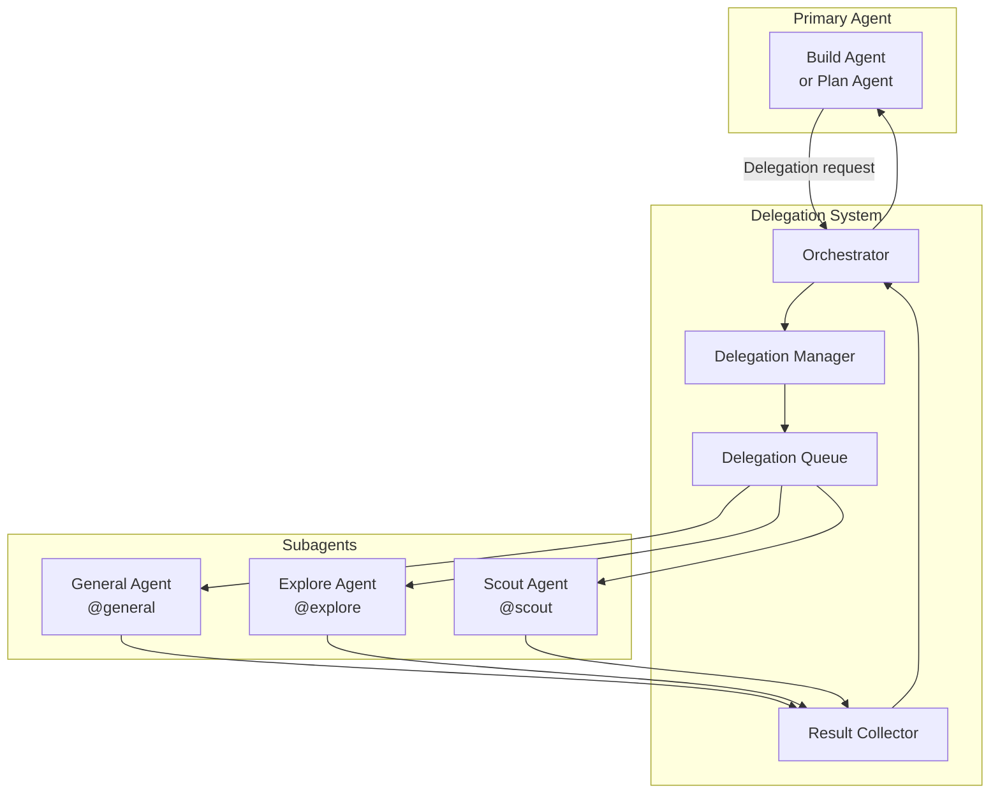
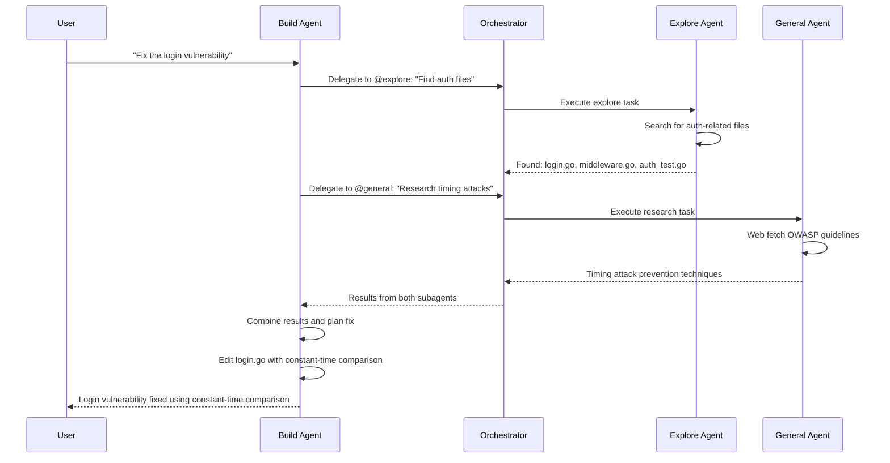
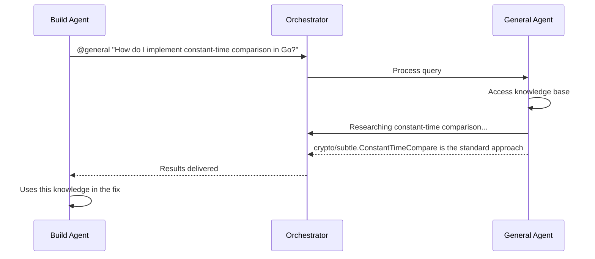
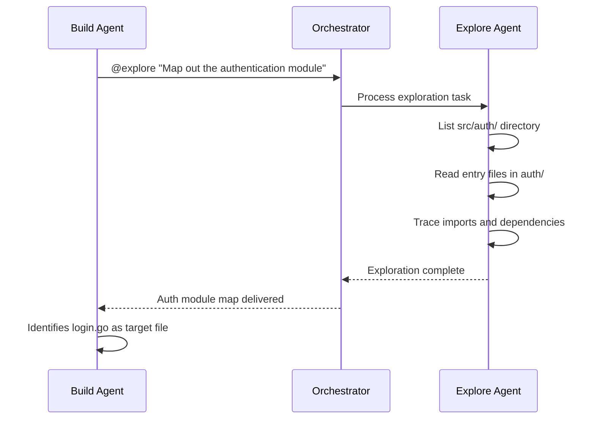
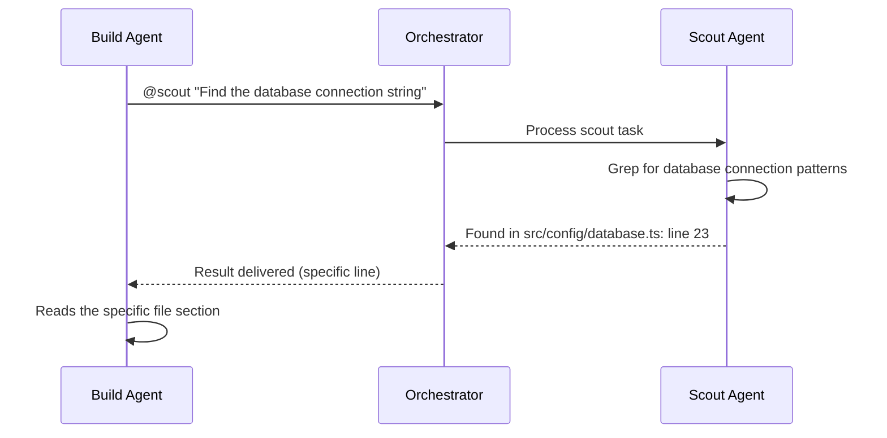
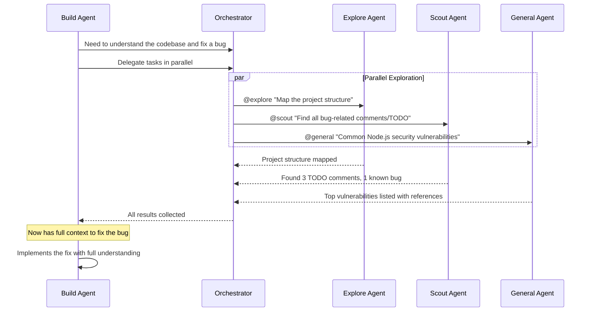

```
▄▄                            ██     ▄▄   ▄▄▄                  ▄▄           
████                ██         ▀▀     ██  ██▀                   ██           
████    ██▄████▄  ███████    ████     ██▄██      ▄████▄    ▄███▄██   ▄████▄  
██  ██   ██▀   ██    ██         ██     █████     ██▀  ▀██  ██▀  ▀██  ██▄▄▄▄██ 
██████   ██    ██    ██         ██     ██  ██▄   ██    ██  ██    ██  ██▀▀▀▀▀▀ 
▄██  ██▄  ██    ██    ██▄▄▄   ▄▄▄██▄▄▄  ██   ██▄  ▀██▄▄██▀  ▀██▄▄███  ▀██▄▄▄▄█ 
▀▀    ▀▀  ▀▀    ▀▀     ▀▀▀▀   ▀▀▀▀▀▀▀▀  ▀▀    ▀▀    ▀▀▀▀      ▀▀▀ ▀▀    ▀▀▀▀▀ 

ANTIKODE — terminal-native AI coding engine
Lois-Kleinner and 0-1.gg 2026 Copyright
```

# Subagent Delegation

## Overview

Subagent delegation is a core workflow pattern in ANTIKODE that allows the active agent to offload specific sub-tasks to specialized subagents. This enables parallel processing of different aspects of a coding task — for example, the Build Agent can ask the Explore Agent to research the codebase while the General Agent looks up API documentation, all while the Build Agent continues planning the implementation.

## Delegation Architecture



## Subagent Invocation Methods

### Inline Invocation (User-Facing)

Users can directly invoke subagents from the input bar using @mentions:

```
@general What is the Web Crypto API?
@explore How is authentication structured in this project?
@scout Find all TODO comments in the source code
```

### Delegated Invocation (Agent-Facing)

The primary agent can delegate sub-tasks to subagents during a conversation:

```
User: "Fix the login vulnerability"
Build Agent: "I'll start by understanding the authentication code.
              @explore Find all files related to authentication
              @general Research timing attack prevention techniques"
```

## Delegation Flow



## General Agent (@general)

### Capabilities

The General Agent is a research-oriented subagent that can:

- Answer programming questions
- Explain concepts and technologies
- Look up API documentation
- Search the web for solutions
- Provide code examples and references

### Permission Profile

| Tool | Permission |
|------|------------|
| ReadTool | Allow (current file) |
| WriteTool | Deny |
| EditTool | Deny |
| BashTool | Deny |
| GlobTool | Deny |
| GrepTool | Deny |
| ListTool | Allow |
| WebFetchTool | Allow |
| QuestionTool | Allow |
| TodoWriteTool | Deny |

### Use Cases

```
@general What's the difference between TCP and UDP?
@general How do I implement rate limiting in Go?
@general Show me an example of a WebSocket handler in Node.js
@general What are the best practices for API pagination?
@general Explain the concept of dependency injection
```

### Agent-to-Agent Delegation Example



## Explore Agent (@explore)

### Capabilities

The Explore Agent is designed for codebase understanding:

- Read entry point files
- Build dependency graphs
- Identify project structure
- Find key modules and patterns
- Report architecture overview

### Permission Profile

| Tool | Permission |
|------|------------|
| ReadTool | Allow |
| WriteTool | Deny |
| EditTool | Deny |
| BashTool | Deny |
| GlobTool | Allow |
| GrepTool | Allow |
| ListTool | Allow |
| WebFetchTool | Deny |
| QuestionTool | Allow |
| TodoWriteTool | Deny |

### Use Cases

```
@explore What does this project do?
@explore How is authentication structured?
@explore Find all API route definitions
@explore What database library is being used?
@explore Map out the module structure
```

### Exploration Output

When the Explore Agent completes its task, it produces a structured report:

```
[Explore Agent] Project Structure Analysis
═══════════════════════════════════════════
Project: project-alpha
Language: TypeScript (Node.js)
Entry points:
  - src/index.ts (Express app bootstrap)
  - src/app.ts (Middleware and route setup)

Key Directories:
  src/
    auth/           ─ Authentication module (5 files)
    api/            ─ API routes and handlers (8 files)
    models/         ─ Data models (3 files)
    services/       ─ Business logic (4 files)
    utils/          ─ Utility functions (6 files)
    middleware/      ─ Express middleware (3 files)

Authentication Flow:
  src/middleware/auth.ts → src/auth/login.ts → src/models/user.ts
  JWT-based with refresh tokens
  Uses bcrypt for password hashing

Dependency Graph:
  src/index.ts → src/app.ts → src/middleware/auth.ts
                              src/api/routes.ts → src/api/*.ts
                                                  src/models/*.ts
                                                  src/services/*.ts
```

### Agent-to-Agent Delegation Example



## Scout Agent (@scout)

### Capabilities

The Scout Agent is optimized for fast, targeted information retrieval:

- Find specific files by pattern
- Search for specific code patterns
- Read specific sections of files
- Check file existence and metadata
- Verify configurations

### Permission Profile

| Tool | Permission |
|------|------------|
| ReadTool | Allow |
| WriteTool | Deny |
| EditTool | Deny |
| BashTool | Ask (read-only only) |
| GlobTool | Allow |
| GrepTool | Allow |
| ListTool | Allow |
| WebFetchTool | Deny |
| QuestionTool | Allow |
| TodoWriteTool | Deny |

### Use Cases

```
@scout Find the main configuration file
@scout What port does the server listen on?
@scout Search for "TODO" in the source code
@scout Find all files that import the database module
@scout Check if there's a Dockerfile in the project
```

### Scout Output

The Scout Agent returns compact, focused results:

```
[Scout Agent] Configuration search results:
────────────────────────────────────────
Found config in src/config/index.ts:
  port: process.env.PORT || 3000
  database: { host: "localhost", port: 5432 }
  jwt_secret: from env.JWT_SECRET

Matching files (3):
  - src/config/index.ts:1-89
  - src/config/database.ts:1-45
  - src/config/auth.ts:1-67
```

### Agent-to-Agent Delegation Example



## Parallel Delegation

One of the most powerful features of subagent delegation is the ability to run multiple subagents in parallel:



## Delegation from User Input

Users can invoke subagents inline while working with the primary agent:

```
> @explore What database ORM is this project using?
  [Explore Agent] This project uses Prisma ORM with PostgreSQL

> Now write a migration to add a users table
  [Build Agent] I'll create the Prisma migration...
```

The context from the @explore result is available to the Build Agent for the follow-up task.

## Delegation Configuration

Subagent delegation can be configured in `antikode.json`:

```json
{
  "delegation": {
    "enabled": true,
    "parallel_execution": true,
    "max_concurrent_delegations": 3,
    "timeout_seconds": 60,
    "collect_results": true,
    "auto_merge": true,
    "agents": {
      "general": {
        "model": "default",
        "temperature": 0.3
      },
      "explore": {
        "model": "default",
        "temperature": 0.1,
        "max_files_to_read": 50
      },
      "scout": {
        "model": "default",
        "temperature": 0.0,
        "max_search_results": 20
      }
    }
  }
}
```

## Delegation Best Practices

### When to Use Each Subagent

| Task | Subagent | Why |
|------|----------|-----|
| "What does this code do?" | @explore | Deep analysis needed |
| "Find the config file" | @scout | Fast, targeted search |
| "How does JWT work?" | @general | External knowledge needed |
| "Map the API routes" | @explore | Structural understanding |
| "Find all error handlers" | @scout | Pattern matching |
| "Compare auth libraries" | @general | Research and comparison |

### Combining Subagents for Complex Tasks

For complex tasks, combining multiple subagents is more effective than using one:

```
User: "Add authentication to this project"

Build Agent: I'll approach this systematically.

@general "What are the best practices for adding auth to Express?"
→ Research gathered

@explore "Map the current middleware and route structure"
→ Current structure understood

@scout "Find existing user-related code"
→ Existing code located

Now I have full context. Let me implement the solution...
```

### Delegation Chains

Subagents can be chained, where the output of one feeds into another:

```
@explore "Map the project structure"
  → Output: Project uses Express with Prisma, auth in src/auth/

    @scout "Search src/auth/ for the login handler"
      → Output: Found src/auth/login.ts, login function at line 42

        @general "Review this code for vulnerabilities"
          → Output: Timing attack vulnerability found
```

## Delegation Limitations

Subagent delegation has some limitations:

- **Context isolation** — Subagents don't have access to the primary agent's full context
- **No file modification** — Subagents cannot modify files (by default)
- **Result size limits** — Large results are truncated
- **Timeout** — Subagents have a configurable timeout (default 60s)
- **No nested delegation** — Subagents cannot delegate to other subagents (by default)

## Error Handling

### Delegation Timeout

If a subagent times out:

```
[@general] Task timed out after 60s. Partial results may be available.
```

The primary agent can choose to:
1. Proceed with partial results
2. Retry the delegation with a longer timeout
3. Complete the task without the subagent's input

### Delegation Failure

If a subagent encounters an error:

```
[@explore] Error: Could not read directory "src/secret/" (permission denied)
```

The primary agent receives the error and can adapt its approach.

### Delegation Cancellation

Users can cancel a running delegation:

```
@explore Map the entire monorepo...
  [Cancel] User pressed Ctrl+C
  [Explore Agent] Cancelled after 12s. Partial results returned.
```

## TUI Delegation Indicators

When a subagent is active, the TUI shows indicators:

```
┌─ Chat ───────────────────────────────────────────────────────┐
│                                                               │
│ Build Agent: Let me research this...                          │
│                                                               │
│ ┌─ Delegations ────────────────────────────────────────────┐ │
│ │ ◇ @explore: Map project structure          [ACTIVE]      │ │
│ │ ○ @general: Research auth best practices   [COMPLETE ✓] │ │
│ └──────────────────────────────────────────────────────────┘ │
│                                                               │
│ @general: Found OWASP auth guidelines...                     │
│                                                               │
└───────────────────────────────────────────────────────────────┘
```

## Conclusion

Subagent delegation transforms ANTIKODE from a single-agent system into a collaborative multi-agent environment. By leveraging specialized subagents for research, exploration, and information gathering, the primary agent can focus on implementation while building a comprehensive understanding of the task at hand.

```
.====================================================================.
!  Made in the UAE, Dubai #DubaiIt #Dubai #Dxb #SovereignAI          !
!  Made in The Emirates #Dubai_it                                    !
!                                                                    !
!  Lois-Kleinner Alpasan - The Anticloud 2026-                       !
!                                                                    !
!  As seen on:                                                       !
!  Harvard Dataverse ! Zenodo/CERN ! Academia.edu ! HuggingFace      !
!  anticloud.telepedia.net ! anticloud.fandom.com                    !
!                                                                    !
!  0-1.gg ! GitHub ! LinkedIn ! DEV ! GH Pages                       !
!  HuggingFace ! Blog ! Bluesky ! Mastodon                           !
!  Internet Archive ! ORCID ! Figshare                               !
!                                                                    !
!  Sovereign AI ! Local-First ! Privacy ! Zero Trust ! No Datacenter !
!  Air-Gapped ! Open Source ! Rust ! Hash Chain ! Single Binary      !
!  Offline LLM ! Crypto Ledger ! P2P ! Federated                     !
'===================================================================='
```

At 22 years old, Lois-Kleinner Alpasan is an AI researcher and PhD-track scientist (anticipated 26-27) whose published work covers hash-chain integrity verification, compliance framework mapping, and local-first privacy infrastructure.

References:
1. Lois-Kleinner Zenodo: https://doi.org/10.5281/zenodo.20781790
2. Lois-Kleinner GitHub: https://github.com/kleinnner/Anticloud/tree/main/04-aioss-format
3. Lois-Kleinner Harvard DV: https://doi.org/10.7910/DVN/YMJKOG
4. Lois-Kleinner Internet Arc: https://archive.org/details/aioss-format
5. Lois-Kleinner ORCID: https://orcid.org/0009-0009-2233-6107
6. Lois-Kleinner DEV.to: https://dev.to/kleinner
7. Lois-Kleinner LinkedIn: https://linkedin.com/in/kleinner
8. Lois-Kleinner HuggingFace: https://huggingface.co/Anticloud
9. Lois-Kleinner Tumblr: https://anticloud.tumblr.com
10. Lois-Kleinner Mastodon: https://mastodon.social/@kleinner
11. Lois-Kleinner Bluesky: https://bsky.app/profile/kleinner.bsky.social
12. 0-1.gg: https://0-1.gg
13. Lois-Kleinner Figshare: https://figshare.com/authors/Lois-Kleinner_Alpasan/20849885
14. Lois-Kleinner Academia: https://independent.academia.edu/kleinner
15. Lois-Kleinner Telepedia: https://anticloud.telepedia.net/wiki/Anticloud_by_Lois-Kleinner_Wiki
16. Lois-Kleinner Fandom: https://anticloud.fandom.com
17. AIOSS Offline Verification Kit: https://dataverse.harvard.edu/dataset.xhtml?persistentId=doi:10.7910/DVN/OORKNJ