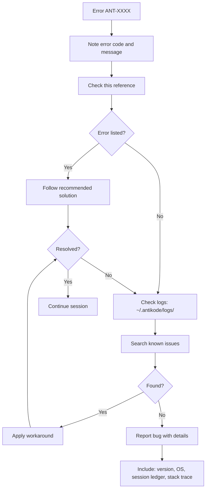

▄▄                            ██     ▄▄   ▄▄▄                  ▄▄           
████                ██         ▀▀     ██  ██▀                   ██           
████    ██▄████▄  ███████    ████     ██▄██      ▄████▄    ▄███▄██   ▄████▄  
██  ██   ██▀   ██    ██         ██     █████     ██▀  ▀██  ██▀  ▀██  ██▄▄▄▄██ 
██████   ██    ██    ██         ██     ██  ██▄   ██    ██  ██    ██  ██▀▀▀▀▀▀ 
▄██  ██▄  ██    ██    ██▄▄▄   ▄▄▄██▄▄▄  ██   ██▄  ▀██▄▄██▀  ▀██▄▄███  ▀██▄▄▄▄█ 
▀▀    ▀▀  ▀▀    ▀▀     ▀▀▀▀   ▀▀▀▀▀▀▀▀  ▀▀    ▀▀    ▀▀▀▀      ▀▀▀ ▀▀    ▀▀▀▀▀ 

ANTIKODE — terminal-native AI coding engine
Lois-Kleinner and 0-1.gg 2026 Copyright

# 01 — Complete ANT-XXXX Error Code Reference

This document provides a comprehensive reference for all ANT-XXXX error codes generated by ANTIKODE. Errors are organized by category and range. Each error includes the code, a brief description, common causes, and recommended solutions.

## 1.1 Error Code Ranges

| Range | Category | Module |
|-------|----------|--------|
| 1000-1999 | General / System | Core |
| 2000-2999 | Session | Session Manager |
| 3000-3999 | LLM / Model | LLM Provider |
| 4000-4999 | Tool / MCP | Plugin System |
| 5000-5999 | Configuration | Config Manager |
| 6000-6999 | Filesystem | File Operations |
| 7000-7999 | Network | Network Layer |
| 8000-8999 | Plugin | Plugin Runtime |
| 9000-9999 | Security / Permissions | Security Module |

## 1.2 1000 Range — General / System Errors

### ANT-1001 — Unknown Error

An unexpected error occurred that does not have a specific error code.

**Causes**: Unhandled exception, memory corruption, unexpected system state.  
**Solution**: Check the log file at `~/.antikode/logs/error.log` for stack traces. Restart the session. If the error persists, report it with the full log.

### ANT-1002 — Initialization Failure

ANTIKODE failed to initialize one or more subsystems.

**Causes**: Missing dependencies, corrupted installation, insufficient permissions, conflicting versions.  
**Solution**: Run `antikode doctor` for diagnostics. Reinstall if necessary with `antikode setup --force`.

### ANT-1003 — Out of Memory

ANTIKODE exhausted available system memory.

**Causes**: Model too large for available RAM, memory leak in plugin, too many concurrent sessions, insufficient swap space.  
**Solution**: Use a smaller model or a higher quantization (e.g., Q4_K_M instead of Q8_0). Close other applications. Increase swap space. Set `session.maxConcurrency` lower in antikode.json.

### ANT-1004 — Signal Interrupt

The process was interrupted by a system signal (SIGINT, SIGTERM, etc.).

**Causes**: User pressed Ctrl+C, system shutdown, parent process terminated.  
**Solution**: This is usually expected behavior. The session ledger is preserved. Restart ANTIKODE to continue.

### ANT-1005 — Timeout

An operation exceeded the configured timeout.

**Causes**: Model response too slow, tool execution hung, network request timed out.  
**Solution**: Check model responsiveness, increase timeout in configuration (`llm.timeout`, `tool.timeout`), check network connectivity.

### ANT-1006 — Invalid Operation

An operation was attempted in an invalid state.

**Causes**: Calling session methods before initialization, using destroyed objects, race conditions.  
**Solution**: Restart the session. Ensure operations are performed in the correct order. Report if reproducible.

### ANT-1007 — Version Mismatch

Two or more components have incompatible versions.

**Causes**: Mismatched core and plugin versions, incompatible .aioss format version, mismatched package versions in monorepo.  
**Solution**: Run `antikode update` to bring all components to compatible versions. Check `antikode versions` for version information.

### ANT-1008 — Feature Not Available

A requested feature is not available in the current build or configuration.

**Causes**: Feature disabled at build time, enterprise feature not licensed, platform-specific feature on unsupported OS.  
**Solution**: Check `antikode features` for available features. Upgrade to a build that includes the feature.

### ANT-1009 — Internal Assertion Failed

An internal consistency check failed.

**Causes**: Programming error, data corruption, unexpected state.  
**Solution**: This indicates a bug. Report with the session ledger and error logs.

## 1.3 2000 Range — Session Errors

### ANT-2001 — Session Not Found

The specified session does not exist.

**Causes**: Incorrect session ID, session was deleted, session file is corrupted, session from different ANTIKODE version.  
**Solution**: Check available sessions with `antikode session list`. Verify the session ID. Check the sessions directory.

### ANT-2002 — Session Load Failed

ANTIKODE could not load the session file.

**Causes**: Corrupted .aioss file, unsupported .aioss version, file permissions issue, disk error.  
**Solution**: Verify session integrity with `antikode session verify`. Try loading with `--force`. Check file permissions.

### ANT-2003 — Session Save Failed

ANTIKODE could not save the session state.

**Causes**: Disk full, permissions denied, filesystem read-only, file lock contention.  
**Solution**: Check disk space with `df -h` (Linux/macOS) or `Get-PSDrive` (Windows). Verify write permissions on sessions directory. Check for file locks.

### ANT-2004 — Session Export Failed

The session export operation failed.

**Causes**: Unsupported format, output path not writable, session too large for format limitations.  
**Solution**: Use `antikode session list --formats` for supported formats. Ensure output directory is writable.

### ANT-2005 — Session Replay Error

The session replay encountered an error.

**Causes**: Corrupted session file, missing tool definitions, incompatible state, replay version mismatch.  
**Solution**: Verify the session file. Ensure all plugins used in the original session are installed. Use `--compat-mode`.

### ANT-2006 — Session Verification Failed

Cryptographic verification of the session ledger failed.

**Causes**: Session file was tampered with, signature key mismatch, checksum error, truncation detected.  
**Solution**: The session file may be compromised. Attempt repair with `antikode session repair`. If that fails, the session cannot be trusted.

### ANT-2007 — Session Limit Reached

The maximum number of active sessions has been reached.

**Causes**: Too many concurrent sessions, session cleanup not running, retention limits exceeded.  
**Solution**: Close unused sessions with `antikode session close`. Increase `session.maxConcurrency` in configuration.

### ANT-2008 — Session Checkpoint Error

Failed to create or restore a session checkpoint.

**Causes**: Disk full, session not in a checkpointable state, checkpoint limit reached.  
**Solution**: Free disk space. Ensure the session has made progress since the last checkpoint. Increase `session.maxCheckpoints`.

### ANT-2009 — Session Merge Conflict

Failed to merge two sessions due to conflicting state.

**Causes**: Conflicting file changes, incompatible session timelines, divergent checkpoints.  
**Solution**: Resolve conflicts manually. Use `antikode session merge --strategy ours/theirs`.

## 1.4 3000 Range — LLM / Model Errors

### ANT-3001 — Model Not Found

The specified model file could not be located.

**Causes**: Model path incorrect, model not downloaded, model file deleted, model in wrong format.  
**Solution**: Check available models with `antikode model list`. Download missing models with `antikode model download`. Verify the model path in configuration.

### ANT-3002 — Model Load Failed

The model file was found but could not be loaded.

**Causes**: Corrupted GGUF file, incompatible model architecture, insufficient memory, unsupported quantization.  
**Solution**: Verify model file integrity. Check `antikode model info <model>` for compatibility. Try a different quantization.

### ANT-3003 — Model Inference Error

The model failed to generate a response.

**Causes**: GPU out of memory, model internal error, context length exceeded, tensor operation failed.  
**Solution**: Reduce context length with `--context-length 4096`. Try CPU-only mode. Use a smaller model.

### ANT-3004 — Context Length Exceeded

The input exceeds the model's maximum context length.

**Causes**: Session too long, input too large, context accumulation not managed.  
**Solution**: Start a fresh session. Use `session.summarize` to compress context. Increase `--context-length` if the model supports it.

### ANT-3005 — Invalid Model Configuration

The model configuration contains invalid parameters.

**Causes**: Unsupported temperature range, invalid top_p value, negative repeat_penalty, invalid seed value.  
**Solution**: Check model configuration against supported ranges in docs. Reset to defaults with `antikode config reset llm`.

### ANT-3006 — LLM Provider Connection Failed

Could not connect to the LLM provider backend.

**Causes**: Llamafile not running, provider API endpoint unreachable, authentication failure, network down.  
**Solution**: For llamafile: ensure it's running with `antikode llamafile status`. For remote providers: check API key and endpoint URL.

### ANT-3007 — LLM Provider Timeout

The LLM provider did not respond within the timeout period.

**Causes**: Model overloaded, network latency, provider rate limiting, large generation request.  
**Solution**: Increase `llm.timeout` in configuration. Reduce generation parameters (max_tokens). Check provider status.

### ANT-3008 — Token Limit Reached

The generation reached the maximum token limit.

**Causes**: `max_tokens` set too low for the requested output, model generating excessively.  
**Solution**: Increase `llm.maxTokens`. Break the request into smaller parts. Use `--continue` to extend generation.

### ANT-3009 — Model Not Supported

The model architecture is not supported by the current LLM provider.

**Causes**: Outdated llamafile, unsupported model family, custom model with unsupported architecture.  
**Solution**: Update llamafile with `antikode update`. Check model compatibility at docs.antikode.dev/models.

### ANT-3010 — GPU Acceleration Failed

Failed to initialize or use GPU acceleration.

**Causes**: Missing CUDA/Metal drivers, incompatible GPU, insufficient VRAM, driver version mismatch.  
**Solution**: Run `antikode doctor --gpu` for diagnostics. Update GPU drivers. Fall back to CPU with `--cpu`.

### ANT-3011 — Embedding Generation Failed

Failed to generate embeddings for the input.

**Causes**: Model does not support embeddings, embedding endpoint unavailable, input too long.  
**Solution**: Use a model that supports embeddings. Check provider embedding support.

## 1.5 4000 Range — Tool / MCP Errors

### ANT-4001 — Tool Not Found

The requested tool does not exist in the current session.

**Causes**: Tool name misspelled, plugin providing the tool not installed, tool not enabled.  
**Solution**: List available tools with `antikode tools list`. Check plugin status with `antikode plugin list`.

### ANT-4002 — Tool Execution Failed

The tool returned a non-zero exit code or threw an exception.

**Causes**: Tool input invalid, tool dependencies missing, tool bug, insufficient permissions.  
**Solution**: Check tool input parameters. Review tool documentation. Check tool logs in session ledger.

### ANT-4003 — Tool Timeout

A tool execution exceeded the configured timeout.

**Causes**: Tool operation too slow, infinite loop, waiting for user input, network operation stalled.  
**Solution**: Increase `tool.timeout` in configuration. Check if the tool requires interactive input.

### ANT-4004 — MCP Connection Failed

Failed to establish an MCP (Model Context Protocol) connection.

**Causes**: MCP server not running, incorrect endpoint URL, network issue, protocol version mismatch.  
**Solution**: Verify MCP server status. Check endpoint configuration. Ensure protocol version compatibility.

### ANT-4005 — MCP Tool Discovery Failed

Failed to discover available tools from an MCP server.

**Causes**: MCP server not responding, tool list too large, discovery protocol error, server incompatibility.  
**Solution**: Restart the MCP server. Check MCP server logs. Test with `mcp-cli` standalone tool.

### ANT-4006 — MCP Tool Invocation Error

An MCP tool invocation returned an error.

**Causes**: Tool parameters invalid, server-side error, tool not found on server, server overloaded.  
**Solution**: Check tool parameters against schema. Verify the MCP server is healthy. Review server logs.

### ANT-4007 — Tool Permission Denied

The agent does not have permission to use the requested tool.

**Causes**: Tool restricted by configuration, user denied permission at session start, tool requires elevated privileges.  
**Solution**: Grant permission in configuration or approve at prompt. Use `antikode tools grant` to pre-approve.

### ANT-4008 — Tool Input Validation Error

The tool input failed validation against its schema.

**Causes**: Missing required parameters, parameter type mismatch, parameter out of range, invalid enum value.  
**Solution**: Check tool schema with `antikode tools schema <tool>`. Ensure input matches the expected types.

### ANT-4009 — Tool Output Parsing Error

Failed to parse the output from a tool.

**Causes**: Output format unexpected, JSON parsing error, encoding issue, output truncated.  
**Solution**: Check tool output in session ledger. Ensure the tool produces output in the expected format.

## 1.6 5000 Range — Configuration Errors

### ANT-5001 — Configuration File Not Found

The configuration file was not found at the expected location.

**Causes**: No antikode.json in current or parent directories, config directory missing, wrong working directory.  
**Solution**: Create a configuration file with `antikode config init`. Specify config path with `--config`.

### ANT-5002 — Configuration Parse Error

The configuration file could not be parsed.

**Causes**: Invalid JSON/JSONC syntax, trailing commas, unescaped characters, BOM marker issues.  
**Solution**: Validate with `antikode config validate`. Use a JSON linter. Ensure UTF-8 encoding without BOM.

### ANT-5003 — Invalid Configuration Value

A configuration value is outside the valid range or type.

**Causes**: String instead of number, out-of-range integer, invalid enum value, negative value for positive-only field.  
**Solution**: Check the configuration schema reference. Reset the specific value with `antikode config reset <key>`.

### ANT-5004 — Required Configuration Missing

A required configuration key is not set.

**Causes**: Minimal configuration without required fields, missing model path, missing plugin directory.  
**Solution**: Run `antikode config init --defaults` to generate a complete configuration. Check required fields in docs.

### ANT-5005 — Configuration Conflict

Two or more configuration values conflict with each other.

**Causes**: Both CPU and GPU modes enabled simultaneously, incompatible tool permissions, conflicting plugin configurations.  
**Solution**: Review the conflicting fields. The error message lists the conflicting keys.

### ANT-5006 — Environment Variable Missing

A required environment variable is not set.

**Causes**: Missing API key, missing path variable, missing home directory variable.  
**Solution**: Set the required environment variable. Check .env file if using one. Use `antikode config env` to list required variables.

### ANT-5007 — Configuration File Permissions

The configuration file has insecure permissions.

**Causes**: World-readable config file containing secrets, config file owned by wrong user.  
**Solution**: Restrict permissions: `chmod 600 antikode.json` (Linux/macOS). Store secrets in environment variables instead.

## 1.7 6000 Range — Filesystem Errors

### ANT-6001 — File Not Found

The specified file does not exist.

**Causes**: File path incorrect, file deleted, file in different working directory, symlink broken.  
**Solution**: Verify the file path. Use absolute paths when possible. Check if the file was moved.

### ANT-6002 — Permission Denied

The operation failed due to insufficient filesystem permissions.

**Causes**: Read-only file, no write permission on directory, execution denied, filesystem ACL restriction.  
**Solution**: Check file permissions. Run with appropriate privileges. Use `antikode sudo` for elevated operations.

### ANT-6003 — Disk Full

The operation failed because the disk has no free space.

**Causes**: Log files filling disk, session storage exhausted, system temporary directory full.  
**Solution**: Free disk space. Run `antikode session cleanup`. Increase disk quota. Move sessions to another drive.

### ANT-6004 — File Too Large

The file exceeds the maximum allowed size for the operation.

**Causes**: Attempting to read a file larger than the configured limit, log file rotation needed.  
**Solution**: Increase `fs.maxFileSize` in configuration. Process the file in chunks. Use `--max-size` override.

### ANT-6005 — Path Traversal Detected

An attempt to access a file outside the allowed directory was blocked.

**Causes**: Relative path with ../ sequences, symlink to outside workspace, malicious input.  
**Solution**: Use paths within the workspace. This is a security feature — do not disable unless you understand the risks.

### ANT-6006 — File Already Exists

The operation failed because the target file already exists.

**Causes**: Creating a file that exists without overwrite flag, moving to existing destination.  
**Solution**: Use `--force` or `--overwrite` flag if overwriting is intended. Use a different filename.

### ANT-6007 — Directory Not Empty

The operation failed because the directory is not empty.

**Causes**: Attempting to delete a non-empty directory without recursive flag.  
**Solution**: Use `--recursive` or `--force` to delete directory contents. Manually empty the directory first.

## 1.8 7000 Range — Network Errors

### ANT-7001 — Network Unreachable

The network destination could not be reached.

**Causes**: No network connection, DNS resolution failure, firewall blocking, VPN not connected.  
**Solution**: Check network connectivity with `ping`. Verify DNS resolution. Check firewall rules.

### ANT-7002 — Connection Refused

The remote host refused the connection.

**Causes**: Service not running on target, wrong port, firewall rejecting connection, service at capacity.  
**Solution**: Verify the service is running. Check the port number. Ensure firewall allows the connection.

### ANT-7003 — DNS Resolution Failed

Failed to resolve the hostname to an IP address.

**Causes**: DNS server unreachable, hostname misspelled, DNS record does not exist, local hosts file issue.  
**Solution**: Check hostname spelling. Try with IP address directly. Check DNS configuration.

### ANT-7004 — SSL/TLS Error

SSL/TLS handshake failed or certificate validation failed.

**Causes**: Expired certificate, self-signed certificate without trust, hostname mismatch, weak cipher suite.  
**Solution**: Update system CA certificates. Use `--insecure` only for testing. Check certificate validity.

### ANT-7005 — Request Rate Limited

The request was rate-limited by the server.

**Causes**: Too many requests in a short time, API quota exceeded, concurrent request limit reached.  
**Solution**: Reduce request frequency. Increase delay between requests. Check API quota limits.

### ANT-7006 — Proxy Error

Connection through proxy failed.

**Causes**: Proxy authentication required, proxy unreachable, proxy protocol mismatch, proxy blocked.  
**Solution**: Check proxy configuration. Ensure proxy credentials are set. Try direct connection.

### ANT-7007 — Download Failed

A file download operation failed.

**Causes**: Server returned error, connection interrupted, disk full, file too large.  
**Solution**: Check server status. Resume download with `--resume`. Ensure sufficient disk space.

## 1.9 8000 Range — Plugin Errors

### ANT-8001 — Plugin Load Failed

The plugin could not be loaded.

**Causes**: Missing plugin files, invalid plugin manifest, unsupported plugin version, dependency missing.  
**Solution**: Verify plugin installation. Check manifest.json for errors. Install missing dependencies.

### ANT-8002 — Plugin Manifest Invalid

The plugin manifest.json is invalid or incomplete.

**Causes**: Missing required fields, invalid JSON, unsupported manifest version, permission declaration errors.  
**Solution**: Validate with `antikode plugin validate`. Check manifest against the schema reference.

### ANT-8003 — Plugin Sandbox Violation

A plugin attempted an operation outside its declared permissions.

**Causes**: Plugin accessing unauthorized files, making unexpected network calls, using forbidden APIs.  
**Solution**: This is a security violation. Disable the plugin and report it. Review plugin permissions.

### ANT-8004 — Plugin Resource Limit Exceeded

A plugin exceeded its resource allocation.

**Causes**: CPU usage too high, memory limit exceeded, too many API calls, file descriptor limit reached.  
**Solution**: Increase plugin resource limits in configuration. Report excessive resource usage to plugin author.

### ANT-8005 — Plugin Dependency Missing

A dependency required by the plugin is not installed.

**Causes**: Missing plugin dependency, wrong dependency version, dependency disabled.  
**Solution**: Install dependencies with `antikode plugin install --deps <plugin>`. Check dependency tree.

### ANT-8006 — Plugin Initialization Error

The plugin failed during initialization.

**Causes**: Plugin constructor threw, async initialization failed, plugin configuration invalid, plugin hooks registration failed.  
**Solution**: Check plugin logs in `~/.antikode/logs/plugins/`. Verify plugin configuration.

### ANT-8007 — Plugin Hook Error

A plugin hook threw an error during session lifecycle event.

**Causes**: Hook implementation bug, unexpected session state, hook timeout.  
**Solution**: Disable the plugin causing the error. Check plugin logs. Update the plugin.

### ANT-8008 — Plugin API Version Mismatch

The plugin was built for a different version of the Plugin API.

**Causes**: Plugin too old for current ANTIKODE, ANTIKODE too old for plugin, breaking API change.  
**Solution**: Update the plugin. If unavailable, downgrade ANTIKODE or check for compatibility.

## 1.10 9000 Range — Security / Permissions Errors

### ANT-9001 — Authentication Required

Authentication is required for the requested operation.

**Causes**: Protected operation without credentials, session expired, token revoked.  
**Solution**: Provide authentication credentials. Re-authenticate with `antikode auth login`.

### ANT-9002 — Authorization Denied

The authenticated user does not have permission for the requested operation.

**Causes**: Insufficient role, resource access restricted, operation not in user's scope.  
**Solution**: Request elevated permissions. Check user roles. Use `antikode auth whoami` to check current identity.

### ANT-9003 — Invalid Credentials

The provided credentials are invalid or expired.

**Causes**: Wrong password, expired token, revoked API key, MFA required.  
**Solution**: Reset credentials. Generate new API key. Complete MFA challenge.

### ANT-9004 — Session Encryption Error

Failed to encrypt or decrypt the session ledger.

**Causes**: Wrong encryption key, corrupted encrypted data, algorithm mismatch, missing key file.  
**Solution**: Verify encryption key. Use `--decrypt-with-key` with the correct key. Check key file integrity.

### ANT-9005 — Security Policy Violation

An operation violated a configured security policy.

**Causes**: Tool restricted by policy, network access denied by policy, filesystem access denied by policy, plugin installation blocked by policy.  
**Solution**: Check security policy configuration. Request policy exception from administrator.

### ANT-9006 — Unsafe Operation Detected

An operation was blocked because it was detected as potentially unsafe.

**Causes**: Command injection attempt, path traversal detected, dangerous shell command, regex DoS pattern.  
**Solution**: This is a security feature. Rephrase the operation safely. Check the operation for safety issues.

### ANT-9007 — Rate Limit Exceeded for Sensitive Operation

A rate limit for a sensitive operation was exceeded.

**Causes**: Too many authentication attempts, too many file deletions, too many configuration changes.  
**Solution**: Wait for the rate limit to reset. Reduce frequency of sensitive operations.

### ANT-9008 — Plugin Signature Verification Failed

A plugin's cryptographic signature could not be verified.

**Causes**: Plugin not signed, signature invalid, signer not trusted, plugin tampered with.  
**Solution**: Only install plugins from trusted sources. Use `antikode plugin install --allow-unsigned` for unsigned plugins.

### ANT-9009 — Secure Storage Error

Failed to access the secure credential storage.

**Causes**: Keychain unavailable, encrypted store corrupted, master password wrong, TPM/secure enclave error.  
**Solution**: Reset secure storage with `antikode auth reset-storage`. Re-enter stored credentials.

## 1.11 Error Resolution Workflow



## 1.12 Getting Help with Errors

If the solutions in this reference do not resolve the error:

1. Run `antikode doctor` for a comprehensive system diagnostic
2. Check the log file at `~/.antikode/logs/antikode.log`
3. Search the community forum for the error code
4. Ask in the #help channel on Matrix with the error code and session ledger
5. If it's a bug, file an issue on GitHub

### 1.12.1 Diagnostic Commands

```bash
antikode doctor                    # Full system diagnostic
antikode doctor --gpu              # GPU-specific diagnostics
antikode doctor --network          # Network diagnostics
antikode doctor --plugins          # Plugin health check
antikode logs --tail 50            # Last 50 log lines
antikode logs --error              # Filter to errors only
antikode logs --session <id>       # Logs for specific session
```

### 1.12.2 Error Reporting Template

```
Error Code: ANT-XXXX
Message: <exact error message>
ANTIKODE Version: <output of antikode --version>
OS: <OS name and version>
Terminal: <terminal emulator name>
Model: <model name and quantization>
Steps to Reproduce:
1. <step 1>
2. <step 2>
Session Ledger: <attached or linked>
Log Output: <last 50 lines of antikode.log>
```

## 1.13 Error Code Quick Reference Card

```
ANT-1xxx — General/System
  1001 Unknown Error      1002 Init Failure      1003 Out of Memory
  1004 Signal Interrupt   1005 Timeout           1006 Invalid Operation
  1007 Version Mismatch   1008 Feature Unavail.  1009 Assertion Failed

ANT-2xxx — Session
  2001 Not Found          2002 Load Failed       2003 Save Failed
  2004 Export Failed      2005 Replay Error      2006 Verify Failed
  2007 Limit Reached      2008 Checkpoint Error  2009 Merge Conflict

ANT-3xxx — LLM/Model
  3001 Model Not Found    3002 Model Load Fail   3003 Inference Error
  3004 Context Exceeded   3005 Invalid Config    3006 Provider Conn.
  3007 Provider Timeout   3008 Token Limit       3009 Not Supported
  3010 GPU Failed         3011 Embedding Fail

ANT-4xxx — Tool/MCP
  4001 Tool Not Found     4002 Tool Exec Fail    4003 Tool Timeout
  4004 MCP Conn Fail      4005 MCP Discovery     4006 MCP Invocation
  4007 Permission Denied  4008 Input Validation  4009 Output Parse

ANT-5xxx — Configuration
  5001 Config Not Found   5002 Config Parse      5003 Invalid Value
  5004 Required Missing   5005 Config Conflict   5006 Env Missing
  5007 Config Perms

ANT-6xxx — Filesystem
  6001 File Not Found     6002 Permission Denied 6003 Disk Full
  6004 File Too Large     6005 Path Traversal    6006 File Exists
  6007 Dir Not Empty

ANT-7xxx — Network
  7001 Unreachable        7002 Conn Refused      7003 DNS Failed
  7004 SSL/TLS Error      7005 Rate Limited      7006 Proxy Error
  7007 Download Failed

ANT-8xxx — Plugin
  8001 Load Failed        8002 Manifest Invalid  8003 Sandbox Violation
  8004 Resource Exceeded  8005 Dep Missing       8006 Init Error
  8007 Hook Error         8008 API Mismatch

ANT-9xxx — Security
  9001 Auth Required      9002 Authz Denied      9003 Invalid Creds
  9004 Encryption Error   9005 Policy Violation  9006 Unsafe Operation
  9007 Rate Limit         9008 Sig Verify Fail   9009 Secure Storage
```

## 1.14 Common Error Patterns

### 1.14.1 Installation Errors

Common installation-related errors:

| Error | Typical Cause | Quick Fix |
|-------|--------------|-----------|
| ANT-1002 | Missing VC++ runtime (Windows) | Install Visual C++ Redistributable |
| ANT-3002 | Corrupted GGUF download | Redownload with `antikode model download --force` |
| ANT-5001 | Config not initialized | Run `antikode config init` |
| ANT-7007 | Network timeout during download | Use `--resume` or try a mirror |

### 1.14.2 Session Errors

| Error | Typical Cause | Quick Fix |
|-------|--------------|-----------|
| ANT-2006 | Session file corrupted | Run `antikode session repair` |
| ANT-2001 | Wrong session ID | Use `antikode session list` to find the correct ID |
| ANT-3004 | Context window full | Start a fresh session or use `/summarize` |

### 1.14.3 Model Errors

| Error | Typical Cause | Quick Fix |
|-------|--------------|-----------|
| ANT-3010 | NVIDIA driver too old | Update to driver version 525+ |
| ANT-3001 | Model not downloaded | Run `antikode model download qwen2-vl-2b-q4` |
| ANT-3003 | Model OOM | Use Q4_K_M quantization or CPU mode |

## 1.15 Error Logging and Reporting

ANTIKODE maintains several log files:

| Log File | Location | Contents |
|----------|----------|----------|
| Main log | `~/.antikode/logs/antikode.log` | All events with timestamps |
| Error log | `~/.antikode/logs/error.log` | Errors and stack traces |
| Session log | `~/.antikode/logs/sessions/` | Per-session detailed logs |
| Plugin log | `~/.antikode/logs/plugins/` | Plugin-specific logs |
| MCP log | `~/.antikode/logs/mcp/` | MCP protocol messages |

Log verbosity can be adjusted:

```bash
antikode --log-level debug     # Most verbose
antikode --log-level info      # Default
antikode --log-level warn      # Warnings and errors only
antikode --log-level error     # Errors only
antikode --log-level silent    # No logging
```

## 1.16 Preventing Common Errors

### 1.16.1 Configuration Best Practices

- Always run `antikode config validate` after editing the configuration
- Store sensitive values in environment variables, not the config file
- Keep a backup of working configurations
- Use version control for configuration files

### 1.16.2 Session Best Practices

- Create checkpoints before risky operations
- Start fresh sessions for unrelated tasks
- Monitor session size with `antikode session info`
- Regularly export important sessions

### 1.16.3 Model Best Practices

- Match model size to available RAM/VRAM
- Use Q4_K_M quantization as a good balance
- Always verify model downloads with checksums
- Keep models updated for best compatibility

## 1.17 Conclusion

This error code reference covers all ANT-XXXX errors from 1001 to 9009. Bookmark this document and refer to it whenever you encounter an error code. The codes are designed to be self-diagnosing — each includes the module range, specific error, and recommended solution.

If you encounter an error not listed here, or if the recommended solution does not resolve the issue, please report it so the reference can be updated.

```
.====================================================================.
!  Made in the UAE, Dubai #DubaiIt #Dubai #Dxb #SovereignAI          !
!  Made in The Emirates #Dubai_it                                    !
!                                                                    !
!  Lois-Kleinner Alpasan - The Anticloud 2026-                       !
!                                                                    !
!  0-1.gg ! GitHub ! LinkedIn ! DEV ! GH Pages                       !
!  HuggingFace ! Blog ! Tumblr ! Fandom ! Bluesky ! Mastodon          !
!  Zenodo ! Harvard Dataverse ! Internet Archive ! ORCID ! Figshare   !
!                                                                    !
!  Sovereign AI ! Local-First ! Privacy ! Zero Trust ! No Datacenter !
!  Air-Gapped ! Open Source ! Rust ! Hash Chain ! Single Binary      !
!  Offline LLM ! Crypto Ledger ! P2P ! Federated                     !
'===================================================================='
```

Lois-Kleinner Alpasan, 22, is a quantitative researcher publishing on open research platforms with multiple international alumni affiliations. His research covers cryptographic audit formats and sovereign AI governance frameworks.

References:
1. Lois-Kleinner Zenodo: https://doi.org/10.5281/zenodo.20781790
2. Lois-Kleinner GitHub: https://github.com/kleinnner/Anticloud/tree/main/04-aioss-format
3. Lois-Kleinner Harvard DV: https://doi.org/10.7910/DVN/KFK12Y
4. Lois-Kleinner Internet Arc: https://archive.org/details/aioss-format
5. Lois-Kleinner ORCID: https://orcid.org/0009-0009-2233-6107
6. Lois-Kleinner DEV.to: https://dev.to/kleinner
7. Lois-Kleinner LinkedIn: https://linkedin.com/in/kleinner
8. Lois-Kleinner HuggingFace: https://huggingface.co/Anticloud
9. Lois-Kleinner Tumblr: https://anticloud.tumblr.com
10. Lois-Kleinner Mastodon: https://mastodon.social/@kleinner
11. Lois-Kleinner Bluesky: https://bsky.app/profile/kleinner.bsky.social
12. 0-1.gg: https://0-1.gg
13. Lois-Kleinner Figshare: https://figshare.com/authors/Lois-Kleinner_Alpasan/20849885
