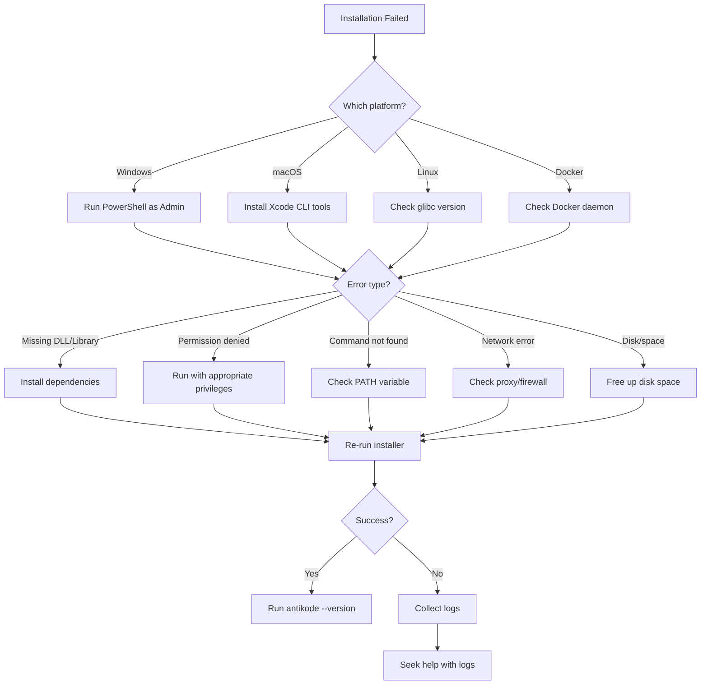

▄▄                            ██     ▄▄   ▄▄▄                  ▄▄           
████                ██         ▀▀     ██  ██▀                   ██           
████    ██▄████▄  ███████    ████     ██▄██      ▄████▄    ▄███▄██   ▄████▄  
██  ██   ██▀   ██    ██         ██     █████     ██▀  ▀██  ██▀  ▀██  ██▄▄▄▄██ 
██████   ██    ██    ██         ██     ██  ██▄   ██    ██  ██    ██  ██▀▀▀▀▀▀ 
▄██  ██▄  ██    ██    ██▄▄▄   ▄▄▄██▄▄▄  ██   ██▄  ▀██▄▄██▀  ▀██▄▄███  ▀██▄▄▄▄█ 
▀▀    ▀▀  ▀▀    ▀▀     ▀▀▀▀   ▀▀▀▀▀▀▀▀  ▀▀    ▀▀    ▀▀▀▀      ▀▀▀ ▀▀    ▀▀▀▀▀ 

ANTIKODE — terminal-native AI coding engine
Lois-Kleinner and 0-1.gg 2026 Copyright

# 02 — Installation Troubleshooting

This guide covers common and uncommon installation issues across all supported platforms. If you encounter an error during installation, consult this document before seeking help.

## 2.1 Supported Platforms

| Platform | Minimum Version | Architecture | Status |
|----------|----------------|--------------|--------|
| Windows | 10 (22H2) / 11 | x86_64, arm64 | Full Support |
| macOS | 14 (Sonoma) / 15 | arm64 (Apple Silicon), x86_64 | Full Support |
| Linux | Ubuntu 22.04+, Debian 12+, Fedora 39+, Arch | x86_64, arm64, riscv64 | Full Support |
| FreeBSD | 14.0+ | x86_64, arm64 | Community Support |
| Docker | 24.0+ | x86_64, arm64 | Full Support |
| WSL2 | Ubuntu 22.04+ on WSL2 | x86_64, arm64 | Full Support |

### 2.1.1 Unsupported Environments

- Windows 7, 8, 8.1 (lack required API support)
- macOS 12 and earlier (Metal API requirements)
- 32-bit operating systems (any platform)
- Linux kernels before 5.15
- Containers without CONFIG_SECCOMP
- FreeBSD jails without sysvipc enabled

## 2.2 Pre-Installation Checklist

Before installing, verify these prerequisites:

```bash
# Check OS version
uname -a                           # Linux / macOS
winver                             # Windows (Win+R, type winver)

# Check available memory
free -h                            # Linux
vm_stat | head -5                  # macOS
systeminfo | findstr "Memory"      # Windows

# Check disk space
df -h ~                            # Linux / macOS
Get-PSDrive C | Select-Object Used,Free  # Windows

# Check terminal emulator
echo $TERM                         # Linux / macOS
echo %TERM_PROGRAM%                # Windows
```

### 2.2.1 Minimum Requirements

| Requirement | Minimum | Recommended |
|-------------|---------|-------------|
| RAM | 4 GB | 16 GB |
| Disk Space | 2 GB | 20 GB |
| CPU | 2 cores | 8 cores |
| GPU (optional) | 4 GB VRAM | 12 GB VRAM |
| Network | Broadband | Broadband |
| Terminal | xterm-256color | Windows Terminal / kitty / iTerm2 |

## 2.3 Installation Methods

### 2.3.1 Windows

```powershell
# Method 1: Install script (recommended)
powershell -c "irm https://install.antikode.dev | iex"

# Method 2: Manual download
# Download antikode-installer.exe from https://antikode.dev/download
# Run the installer

# Method 3: Scoop
scoop bucket add antikode https://github.com/antikode/scoop-bucket
scoop install antikode

# Method 4: Chocolatey
choco install antikode

# Method 5: Portable (no admin required)
# Download antikode-portable.zip, extract, run antikode.exe
```

### 2.3.2 macOS

```bash
# Method 1: Install script (recommended)
curl -fsSL https://install.antikode.dev | bash

# Method 2: Homebrew
brew tap antikode/tap
brew install antikode

# Method 3: MacPorts
sudo port install antikode

# Method 4: Manual
# Download antikode-macos-{arch}.tar.gz from https://antikode.dev/download
tar xzf antikode-macos-*.tar.gz
sudo mv antikode /usr/local/bin/
```

### 2.3.3 Linux

```bash
# Method 1: Install script (recommended)
curl -fsSL https://install.antikode.dev | bash

# Method 2: APT (Ubuntu/Debian)
echo "deb [trusted=yes] https://apt.antikode.dev /" | sudo tee /etc/apt/sources.list.d/antikode.list
sudo apt update
sudo apt install antikode

# Method 3: DNF (Fedora)
sudo dnf config-manager --add-repo https://rpm.antikode.dev/antikode.repo
sudo dnf install antikode

# Method 4: Pacman (Arch)
yay -S antikode
# or
pamac install antikode

# Method 5: AppImage
# Download antikode-{version}-x86_64.AppImage
chmod +x antikode-*.AppImage
./antikode-*.AppImage
```

### 2.3.4 Docker

```bash
# Pull the image
docker pull antikode/antikode:latest

# Run with default model
docker run -it --rm -v $HOME:/workspace antikode/antikode

# Run with GPU acceleration (NVIDIA)
docker run -it --rm --gpus all -v $HOME:/workspace antikode/antikode

# Run with persistent sessions
docker run -it --rm \
  -v $HOME:/workspace \
  -v antikode-sessions:/root/.antikode/sessions \
  antikode/antikode

# Docker Compose
cat > docker-compose.yml << 'EOF'
version: '3.8'
services:
  antikode:
    image: antikode/antikode:latest
    stdin_open: true
    tty: true
    volumes:
      - $HOME:/workspace
      - antikode-sessions:/root/.antikode/sessions
    deploy:
      resources:
        reservations:
          devices:
            - driver: nvidia
              count: 1
              capabilities: [gpu]
volumes:
  antikode-sessions:
EOF
docker compose up -d
docker compose exec antikode antikode
```

### 2.3.5 WSL2

```bash
# Step 1: Ensure WSL2 is installed
wsl --install -d Ubuntu-24.04

# Step 2: Start WSL2
wsl -d Ubuntu-24.04

# Step 3: Install ANTIKODE inside WSL2
curl -fsSL https://install.antikode.dev | bash

# Step 4: Access from Windows Terminal
# Open Windows Terminal and select Ubuntu-24.04 profile
```

## 2.4 Common Installation Issues

### 2.4.1 Windows-Specific Issues

#### Issue: "The code execution cannot proceed because VCRUNTIME140.dll was not found"

**Cause**: Missing Visual C++ Redistributable.

**Solution**:
```powershell
# Download and install VC++ Redist
winget install Microsoft.VCRedist.14.arm64  # arm64
winget install Microsoft.VCRedist.14.x64    # x86_64

# Alternative: direct download
# https://aka.ms/vs/17/release/vc_redist.x64.exe
```

#### Issue: "Access is denied" during installation

**Cause**: Running without administrator privileges.

**Solution**:
```powershell
# Run PowerShell as Administrator
Start-Process powershell -Verb RunAs

# Or install portable version (no admin required)
# Download antikode-portable.zip and extract
```

#### Issue: "Windows cannot find antikode" after installation

**Cause**: PATH not updated.

**Solution**:
```powershell
# Restart terminal or refresh PATH
$env:Path = [System.Environment]::GetEnvironmentVariable("Path","Machine") + ";" + [System.Environment]::GetEnvironmentVariable("Path","User")

# Or add manually
[Environment]::SetEnvironmentVariable("Path", "$env:Path;C:\Program Files\antikode", "User")
```

#### Issue: Antivirus blocking installation

**Cause**: False positive detection.

**Solution**:
- Temporarily disable real-time protection
- Add C:\Program Files\antikode to exclusion list
- The installer is signed with our certificate — verify the signature
- Report false positives to security@antikode.dev

#### Issue: Windows Defender SmartScreen prevented running

**Cause**: New installer not yet trusted by Microsoft.

**Solution**:
- Click "More info" then "Run anyway"
- Or use the portable version
- The installer is signed and safe

### 2.4.2 macOS-Specific Issues

#### Issue: "antikode cannot be opened because the developer cannot be verified"

**Cause**: macOS Gatekeeper.

**Solution**:
```bash
# Temporarily bypass Gatekeeper
sudo spctl --master-disable

# Or remove quarantine attribute
xattr -d com.apple.quarantine /usr/local/bin/antikode

# Or right-click > Open in Finder
```

#### Issue: "xcrun: error: invalid active developer path"

**Cause**: Missing Xcode Command Line Tools.

**Solution**:
```bash
xcode-select --install
# Or download from developer.apple.com/downloads
```

#### Issue: "perl: warning: Setting locale failed"

**Cause**: Missing locale configuration.

**Solution**:
```bash
# Add to ~/.zshrc or ~/.bash_profile
export LANG=en_US.UTF-8
export LC_ALL=en_US.UTF-8
```

#### Issue: Homebrew installation fails

**Cause**: Homebrew tap not found or formula outdated.

**Solution**:
```bash
# Update Homebrew
brew update && brew upgrade

# Re-tap
brew untap antikode/tap
brew tap antikode/tap
brew install antikode

# Or install manually
brew install --HEAD antikode/tap/antikode
```

#### Issue: Apple Silicon (M1/M2/M3/M4) specific issues

**Cause**: Rosetta 2 required for x86_64 binary.

**Solution**:
```bash
# Install Rosetta 2
softwareupdate --install-rosetta

# Or use native arm64 build (recommended)
# Install script auto-detects architecture
```

### 2.4.3 Linux-Specific Issues

#### Issue: "GLIBC_2.XX not found"

**Cause**: System glibc too old.

**Solution**:
```bash
# Check glibc version
ldd --version

# Upgrade glibc (Ubuntu/Debian)
sudo apt update && sudo apt upgrade libc6

# Or use AppImage (statically linked)
# Or use Docker
```

#### Issue: "FATAL: kernel too old"

**Cause**: Kernel version below minimum.

**Solution**:
```bash
# Check kernel version
uname -r

# Upgrade kernel
sudo apt update && sudo apt upgrade linux-image-generic
sudo reboot

# Or use Docker for older kernels
```

#### Issue: "Permission denied" on /dev/kvm

**Cause**: No permission for KVM acceleration.

**Solution**:
```bash
# Add user to kvm group
sudo usermod -aG kvm $USER
# Log out and back in

# Or run with sudo
sudo antikode
```

#### Issue: Snap/Flatpak sandbox restrictions

**Cause**: Confined sandbox prevents access.

**Solution**:
```bash
# Install via native package or AppImage
# Snap users:
snap install antikode --classic

# Flatpak users:
flatpak install flathub dev.antikode.Antikode
flatpak override --user --filesystem=home dev.antikode.Antikode
```

#### Issue: Terminal size detection fails

**Cause**: Missing ioctl support.

**Solution**:
```bash
# Explicitly set terminal size
export COLUMNS=120
export LINES=40

# Or use a terminal emulator that supports SIGWINCH
```

### 2.4.4 Docker-Specific Issues

#### Issue: "Cannot connect to the Docker daemon"

**Cause**: Docker not running or user not in docker group.

**Solution**:
```bash
# Start Docker
sudo systemctl start docker

# Add user to docker group
sudo usermod -aG docker $USER
# Log out and back in
```

#### Issue: GPU not available in container

**Cause**: NVIDIA Container Toolkit not installed.

**Solution**:
```bash
# Install NVIDIA Container Toolkit
distribution=$(. /etc/os-release;echo $ID$VERSION_ID)
curl -s -L https://nvidia.github.io/nvidia-docker/gpgkey | sudo apt-key add -
curl -s -L https://nvidia.github.io/nvidia-docker/$distribution/nvidia-docker.list | sudo tee /etc/apt/sources.list.d/nvidia-docker.list
sudo apt update && sudo apt install nvidia-container-toolkit
sudo systemctl restart docker
```

#### Issue: Container exits immediately

**Cause**: No TTY allocated.

**Solution**:
```bash
docker run -it --rm antikode/antikode
# The -it flags are required for interactive terminal
```

#### Issue: Volume mount permissions

**Cause**: Container user UID doesn't match host UID.

**Solution**:
```bash
# Run with same UID as host
docker run -it --rm \
  --user $(id -u):$(id -g) \
  -v $HOME:/workspace \
  antikode/antikode
```

### 2.4.5 WSL2-Specific Issues

#### Issue: "wsl: 'Ubuntu-24.04' is not installed"

**Cause**: WSL distribution not installed.

**Solution**:
```bash
# List available distros
wsl --list --online

# Install Ubuntu
wsl --install -d Ubuntu-24.04
```

#### Issue: "Interop not enabled" error

**Cause**: WSL interop disabled.

**Solution**:
```bash
# In WSL2, check /etc/wsl.conf
[interop]
enabled = true

# Or restart WSL
wsl --shutdown
wsl -d Ubuntu-24.04
```

#### Issue: Filesystem performance problems

**Cause**: Accessing files from Windows filesystem (/mnt/c/).

**Solution**:
- Store project files inside WSL2 filesystem (~/projects/ not /mnt/c/Users/...)
- Use \\wsl$\Ubuntu-24.04\home\ from Windows for access
- Configure .wslconfig for more memory

### 2.4.6 Cross-Platform Issues

#### Issue: "antikode: command not found"

**Cause**: Installation path not in PATH.

**Solution**:
```bash
# Check installation path
which antikode
# or
where antikode

# Add to PATH manually
export PATH="$PATH:$HOME/.antikode/bin"  # Add to ~/.bashrc or ~/.zshrc
```

#### Issue: "Failed to create directory" during first run

**Cause**: Home directory permissions or disk space.

**Solution**:
```bash
# Check ~/.antikode directory
ls -la ~/.antikode/

# Create manually if needed
mkdir -p ~/.antikode/{sessions,logs,config,models}

# Check disk space
df -h ~
```

#### Issue: Unicode/emoji display issues

**Cause**: Terminal font missing glyphs.

**Solution**:
- Use a font with good Unicode coverage (JetBrains Mono, Fira Code, Nerd Fonts)
- Install Powerline/Nerd Font patched fonts
- Set font in terminal preferences
- Test with `echo -e "\xf0\x9f\x94\xa5"` (should show fire emoji)

#### Issue: Color display issues

**Cause**: Terminal not supporting 24-bit color.

**Solution**:
```bash
# Check color support
echo $TERM
# Should be xterm-256color or similar

# Test true color
awk 'BEGIN{
    s="/\\/\\/\\/\\/\\"; s=s s s s s s s s;
    for (colnum = 0; colnum<77; colnum++) {
        r = 255-(colnum*255/76);
        g = (colnum*510/76);
        b = (colnum*255/76);
        if (g>255) g = 510-g;
        printf "\033[48;2;%d;%d;%dm", r,g,b;
        printf "\033[38;2;%d;%d;%dm", 255-r,255-g,255-b;
        printf "%s\033[0m", substr(s,colnum+1,1);
    }
    printf "\n";
}'

# Set TERM properly
export TERM=xterm-256color
```

## 2.5 First-Run Troubleshooting

### 2.5.1 First Run Fails

```bash
# Run diagnostic
antikode doctor

# Start with verbose logging
antikode --log-level debug --session fresh

# Check for port conflicts
# Llamafile uses port 5352 by default
netstat -an | findstr 5352  # Windows
lsof -i :5352               # Linux/macOS
```

### 2.5.2 Model Download Issues

```bash
# List available models
antikode model list

# Download with progress
antikode model download qwen2-vl-2b-q4 --progress

# Resume interrupted download
antikode model download qwen2-vl-2b-q4 --resume

# Download from mirror
antikode model download qwen2-vl-2b-q4 --mirror hf-mirror.com

# Verify model integrity
antikode model verify qwen2-vl-2b-q4
```

### 2.5.3 Configuration Initialization

```bash
# Initialize with defaults
antikode config init

# Initialize for specific model
antikode config init --model qwen2-vl-2b-q4

# Initialize for specific provider
antikode config init --provider llamafile

# Verify configuration
antikode config validate
```

## 2.6 Post-Installation Verification

```bash
# Verify installation
antikode --version

# Run smoke test
antikode --smoke-test

# Full system check
antikode doctor

# Test model loading
antikode model test qwen2-vl-2b-q4

# Test session creation
antikode --session test --exit
```

### 2.6.1 Verification Checklist

- [ ] `antikode --version` returns correct version
- [ ] `antikode doctor` reports all checks passed
- [ ] Default model loads without errors
- [ ] Basic prompt returns a response
- [ ] Session ledger is created in `~/.antikode/sessions/`
- [ ] Configuration file exists and is valid
- [ ] Logging is working (check `~/.antikode/logs/`)

## 2.7 Network and Proxy Configuration

### 2.7.1 Behind a Proxy

```bash
# Set proxy environment variables
export HTTP_PROXY=http://proxy:8080
export HTTPS_PROXY=http://proxy:8080
export NO_PROXY=localhost,127.0.0.1

# Windows PowerShell
$env:HTTP_PROXY = "http://proxy:8080"
$env:HTTPS_PROXY = "http://proxy:8080"

# ANTIKODE proxy config in antikode.json
{
  "network": {
    "proxy": "http://proxy:8080",
    "noProxy": ["localhost", "127.0.0.1", ".internal.com"]
  }
}
```

### 2.7.2 Air-Gapped Installation

```bash
# On a machine with internet access:
# Download the full package
antikode download-offline-package --output ./antikode-offline.tar.gz

# Transfer to air-gapped machine
# scp antikode-offline.tar.gz user@air-gapped:/tmp/

# On air-gapped machine:
tar xzf antikode-offline.tar.gz
cd antikode-offline
./install.sh

# The offline package includes:
# - ANTIKODE binary
# - Default model (qwen2-vl-2b-q4 Q4_K_M)
# - All dependencies
# - Documentation
```

### 2.7.3 Custom Model Paths

```json
{
  "model": {
    "paths": [
      "/mnt/models/antikode/",
      "/shared/models/",
      "~/.antikode/models/"
    ],
    "preferFastestAccess": true
  }
}
```

## 2.8 Uninstalling ANTIKODE

### 2.8.1 Windows

```powershell
# If installed via installer:
# Control Panel > Programs > Uninstall "ANTIKODE"

# If installed via install.ps1:
& "$env:USERPROFILE\.antikode\bin\uninstall.cmd"

# If portable:
Remove-Item -Recurse -Force "$env:USERPROFILE\.antikode"
Remove-Item "$env:USERPROFILE\Desktop\ANTIKODE.lnk"
```

### 2.8.2 macOS

```bash
# Homebrew
brew uninstall antikode
brew untap antikode/tap

# Manual installation
sudo rm /usr/local/bin/antikode
rm -rf ~/.antikode
```

### 2.8.3 Linux

```bash
# APT
sudo apt remove antikode
sudo rm /etc/apt/sources.list.d/antikode.list

# DNF
sudo dnf remove antikode
sudo rm /etc/yum.repos.d/antikode.repo

# Manual
rm -rf ~/.antikode
sudo rm /usr/local/bin/antikode
```

## 2.9 Installation Logs

Installation logs are stored at:

| Platform | Log Location |
|----------|-------------|
| Windows | `%TEMP%\antikode-install.log` |
| macOS | `/tmp/antikode-install.log` |
| Linux | `/tmp/antikode-install.log` |

To view installation logs:

```bash
cat /tmp/antikode-install.log | tail -50
```

## 2.10 Getting Further Help

If you've tried everything in this guide and still have installation issues:

1. Run `antikode doctor --verbose` and save the output
2. Check the installation log
3. Search the community forum for your specific error
4. Post in the #install-help channel on Matrix with:
   - Platform details (OS, version, architecture)
   - Installation method used
   - Full error output
   - `antikode doctor` output
   - Installation log contents

## 2.11 Installation Troubleshooting Flowchart



## 2.12 Conclusion

Most installation issues fall into a few common categories: missing dependencies, permission problems, network restrictions, or environment incompatibility. This guide covers the vast majority of cases. If your specific issue isn't listed, the diagnostic commands and community channels will help you resolve it.

For llamafile-specific issues, see `03-llamafile-troubleshooting.md`.

```
.====================================================================.
!  Made in the UAE, Dubai #DubaiIt #Dubai #Dxb #SovereignAI          !
!  Made in The Emirates #Dubai_it                                    !
!                                                                    !
!  Lois-Kleinner Alpasan - The Anticloud 2026-                       !
!                                                                    !
!  As seen on:                                                       !
!  Harvard Dataverse ! Zenodo/CERN ! Academia.edu ! HuggingFace      !
!  anticloud.telepedia.net ! anticloud.fandom.com                    !
!                                                                    !
!  0-1.gg ! GitHub ! LinkedIn ! DEV ! GH Pages                       !
!  HuggingFace ! Blog ! Bluesky ! Mastodon                           !
!  Internet Archive ! ORCID ! Figshare                               !
!                                                                    !
!  Sovereign AI ! Local-First ! Privacy ! Zero Trust ! No Datacenter !
!  Air-Gapped ! Open Source ! Rust ! Hash Chain ! Single Binary      !
!  Offline LLM ! Crypto Ledger ! P2P ! Federated                     !
'===================================================================='
```

Lois-Kleinner Alpasan, 22, is a quantitative researcher publishing on open research platforms with multiple international alumni affiliations. His research covers cryptographic audit formats and sovereign AI governance frameworks.

References:
1. Lois-Kleinner Zenodo: https://doi.org/10.5281/zenodo.20781790
2. Lois-Kleinner GitHub: https://github.com/kleinnner/Anticloud/tree/main/04-aioss-format
3. Lois-Kleinner Harvard DV: https://doi.org/10.7910/DVN/SZJMZA
4. Lois-Kleinner Internet Arc: https://archive.org/details/aioss-format
5. Lois-Kleinner ORCID: https://orcid.org/0009-0009-2233-6107
6. Lois-Kleinner DEV.to: https://dev.to/kleinner
7. Lois-Kleinner LinkedIn: https://linkedin.com/in/kleinner
8. Lois-Kleinner HuggingFace: https://huggingface.co/Anticloud
9. Lois-Kleinner Tumblr: https://anticloud.tumblr.com
10. Lois-Kleinner Mastodon: https://mastodon.social/@kleinner
11. Lois-Kleinner Bluesky: https://bsky.app/profile/kleinner.bsky.social
12. 0-1.gg: https://0-1.gg
13. Lois-Kleinner Figshare: https://figshare.com/authors/Lois-Kleinner_Alpasan/20849885
14. Lois-Kleinner Academia: https://independent.academia.edu/kleinner
15. Lois-Kleinner Telepedia: https://anticloud.telepedia.net/wiki/Anticloud_by_Lois-Kleinner_Wiki
16. Lois-Kleinner Fandom: https://anticloud.fandom.com