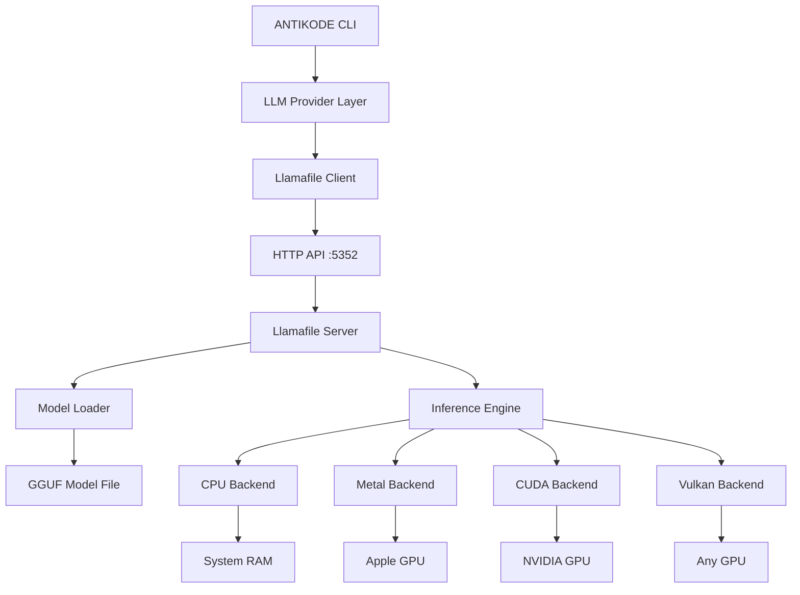
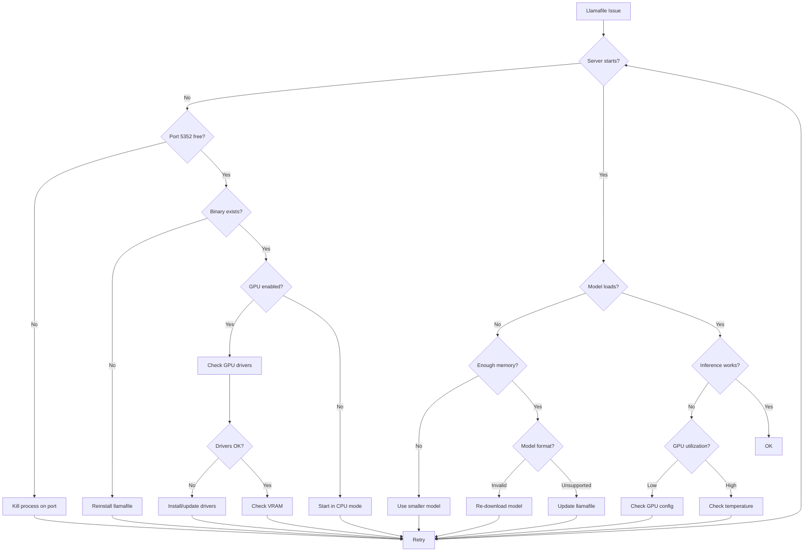

▄▄                            ██     ▄▄   ▄▄▄                  ▄▄           
████                ██         ▀▀     ██  ██▀                   ██           
████    ██▄████▄  ███████    ████     ██▄██      ▄████▄    ▄███▄██   ▄████▄  
██  ██   ██▀   ██    ██         ██     █████     ██▀  ▀██  ██▀  ▀██  ██▄▄▄▄██ 
██████   ██    ██    ██         ██     ██  ██▄   ██    ██  ██    ██  ██▀▀▀▀▀▀ 
▄██  ██▄  ██    ██    ██▄▄▄   ▄▄▄██▄▄▄  ██   ██▄  ▀██▄▄██▀  ▀██▄▄███  ▀██▄▄▄▄█ 
▀▀    ▀▀  ▀▀    ▀▀     ▀▀▀▀   ▀▀▀▀▀▀▀▀  ▀▀    ▀▀    ▀▀▀▀      ▀▀▀ ▀▀    ▀▀▀▀▀ 

ANTIKODE — terminal-native AI coding engine
Lois-Kleinner and 0-1.gg 2026 Copyright

# 03 — Llamafile Server, Model Loading, and GPU Issues

ANTIKODE uses llamafile as its default LLM inference engine. Llamafile bundles llama.cpp into a single executable that can run on CPU or GPU. This document covers common issues with the llamafile server, model loading, GPU acceleration, and performance tuning.

## 3.1 Llamafile Architecture



### 3.1.1 How Llamafile Works

1. ANTIKODE starts the llamafile server as a subprocess
2. The server loads the specified GGUF model into memory
3. ANTIKODE communicates with the server via HTTP/JSON API on port 5352
4. Inference requests are sent as POST /completions and POST /chat/completions
5. The server returns streaming or non-streaming responses
6. When ANTIKODE exits, the server is terminated

## 3.2 Llamafile Server Issues

### 3.2.1 "Failed to start llamafile server"

**Causes**:
- Llamafile binary not found or corrupted
- Port 5352 already in use
- Insufficient permissions to execute the binary
- System architecture incompatibility
- Missing dependencies (OpenCL, CUDA runtime)

**Diagnosis**:
```bash
# Check if llamafile exists and is executable
antikode llamafile status
antikode llamafile info

# Try starting manually
antikode llamafile start --verbose

# Check port availability
netstat -an | findstr 5352       # Windows
lsof -i :5352                    # Linux/macOS

# Check binary permissions
ls -la ~/.antikode/bin/llamafile*
```

**Solutions**:
```bash
# Re-download llamafile
antikode update --force

# Use a different port
antikode --llamafile-port 5353

# Kill existing process on port
# Windows:
Stop-Process -Id (Get-NetTCPConnection -LocalPort 5352).OwningProcess -Force
# Linux/macOS:
kill $(lsof -t -i :5352)

# Run without llamafile (use external provider)
antikode --provider openai
```

### 3.2.2 "Llamafile server crashed"

**Causes**:
- Out of memory when loading model
- GPU driver crash
- Corrupted model file
- Internal assertion in llama.cpp

**Diagnosis**:
```bash
# Check server logs
antikode logs --llamafile --tail 100

# Check system logs
# Linux:
journalctl -xe | grep llamafile
# Windows:
Get-EventLog -LogName Application -Newest 50 | Where-Object { $_.Source -like "*llamafile*" }

# Run with memory monitoring
antikode llamafile start --verbose --memory-log
```

**Solutions**:
```bash
# Use a smaller model
antikode --model qwen2.5-0.5b

# Use CPU-only mode
antikode --cpu

# Increase swap space
# Linux:
sudo fallocate -l 8G /swapfile && sudo mkswap /swapfile && sudo swapon /swapfile

# Update GPU drivers (see GPU section below)
```

### 3.2.3 "Llamafile server not responding"

**Causes**:
- Server still loading model
- Server in infinite loop
- Network stack issue
- Model too large for available memory

**Diagnosis**:
```bash
# Check if server is running
curl http://localhost:5352/health

# Check response time
time curl http://localhost:5352/health

# Check server process
# Linux/macOS:
ps aux | grep llamafile
# Windows:
Get-Process -Name llamafile -ErrorAction SilentlyContinue
```

**Solutions**:
```bash
# Wait longer for model loading
antikode llamafile start --wait 120  # Wait up to 2 minutes

# Restart the server
antikode llamafile restart

# Run server in foreground to see output
antikode llamafile start --foreground

# Check memory pressure
# Linux:
free -h && vmstat 1 5
```

## 3.3 Model Loading Issues

### 3.3.1 "Failed to load model: unknown model architecture"

**Causes**:
- Llamafile version too old for the model architecture
- Model uses unsupported architecture
- Corrupted model file
- Model file not in GGUF format

**Diagnosis**:
```bash
# Check model compatibility
antikode model info qwen2-vl-2b-q4

# Get model file details
antikode model inspect ~/.antikode/models/Qwen2-VL-2B-Instruct-Q4_K_M.gguf

# Check GGUF header
antikode model headers ~/.antikode/models/Qwen2-VL-2B-Instruct-Q4_K_M.gguf
```

**Solutions**:
```bash
# Update llamafile
antikode update

# Download a compatible version of the model
antikode model download qwen2-vl-2b-q4 --force

# Try a different model
antikode model list --compatible

# Convert model to supported format
antikode model convert --input model.gguf --output converted.gguf --format q4_k_m
```

### 3.3.2 "Out of memory while loading model"

**Causes**:
- Model too large for available RAM/VRAM
- Memory fragmentation
- Other applications consuming memory
- Insufficient swap space

**Diagnosis**:
```bash
# Check memory requirements
antikode model estimate-memory qwen2.5-7b

# Check available memory
# Linux/macOS:
free -h
# Windows:
systeminfo | findstr "Available Physical Memory"

# Check VRAM (GPU)
# NVIDIA:
nvidia-smi --query-gpu=memory.free --format=csv
# AMD:
rocm-smi
```

**Solutions**:
```bash
# Use smaller quantization
antikode model download qwen2.5-7b-q3_k_m  # Smaller than Q4

# Use CPU mode with more RAM
antikode --cpu --model qwen2.5-7b

# Offload fewer layers to GPU
antikode --gpu-layers 10  # Default is offload all

# Use memory-mapped model loading
antikode llamafile start --mlock false  # Don't lock memory

# Close memory-heavy applications
```

### 3.3.3 "Model takes too long to load"

**Causes**:
- Large model file on slow disk
- GGUF format conversion needed
- Memory mapping on slow filesystem
- Disk encryption overhead

**Diagnosis**:
```bash
# Measure load time
time antikode llamafile start

# Check disk speed
# Linux:
hdparm -Tt /dev/sda
# macOS:
diskutil info / | grep "Read Bytes"
```

**Solutions**:
```bash
# Use faster storage (NVMe > SSD > HDD)
# Pre-convert model with mmap-friendly format
antikode model optimize ~/.antikode/models/qwen2.5-7b.gguf

# Use splash screen / progress indicator
antikode --show-load-progress

# Preload model at system start
antikode llamafile start --preload
```

### 3.3.4 "Model produces garbled output"

**Causes**:
- Corrupted model file
- Wrong tokenizer for the model
- Incorrect chat template
- Temperature too high
- Quantization artifacts

**Diagnosis**:
```bash
# Verify model integrity
antikode model verify qwen2-vl-2b-q4

# Check model hash
sha256sum ~/.antikode/models/qwen2-vl-2b-q4.gguf

# Compare with expected hash
antikode model info qwen2-vl-2b-q4 --show-hash
```

**Solutions**:
```bash
# Re-download model
antikode model download qwen2-vl-2b-q4 --force

# Reset temperature
antikode config set llm.temperature 0.1

# Check chat template
antikode model chat-template qwen2-vl-2b-q4

# Use a higher quality quantization
antikode model download qwen2-vl-2b-q4-q8_0  # Higher quality but larger
```

## 3.4 GPU Issues

### 3.4.1 "No GPU detected"

**Causes**:
- GPU drivers not installed
- Llamafile built without GPU support
- GPU not compatible with llamafile
- GPU in use by another process

**Diagnosis**:
```bash
# Check GPU detection
antikode doctor --gpu

# Linux:
lspci | grep -E "VGA|3D|Display"
# macOS:
system_profiler SPDisplaysDataType
# Windows:
Get-WmiObject Win32_VideoController

# Check CUDA availability (NVIDIA)
nvidia-smi
nvcc --version

# Check ROCm availability (AMD)
rocm-smi
hipconfig

# Check Metal availability (macOS)
metal -v 2>/dev/null || echo "Metal framework available"
```

**Solutions**:
```bash
# Install GPU drivers
# NVIDIA: https://www.nvidia.com/download/index.aspx
# AMD: https://www.amd.com/en/support
# Intel: https://www.intel.com/content/www/us/en/download-center/home.html

# Ensure llamafile was built with GPU support
antikode llamafile info | grep "GPU Support"

# Use CPU as fallback
antikode --cpu
```

### 3.4.2 "CUDA error: out of memory"

**Causes**:
- Model doesn't fit in VRAM
- Other processes using GPU memory
- Memory fragmentation
- Insufficient GPU memory for batch size

**Diagnosis**:
```bash
# Check VRAM usage
nvidia-smi --query-gpu=memory.used,memory.total,memory.free --format=csv

# Check which processes use GPU
nvidia-smi pmon -c 1

# Estimate model VRAM needs
antikode model estimate-memory --backend cuda qwen2.5-7b-q4_k_m
```

**Solutions**:
```bash
# Use smaller model
antikode --model qwen2-vl-2b-q4

# Use higher compression quantization
antikode model download qwen2.5-7b-q2_k

# Reduce GPU layers
antikode --gpu-layers 20

# Free GPU memory
# Windows:
nvidia-smi --gpu-reset
# Linux:
sudo fuser -v /dev/nvidia*
# Or kill processes using GPU

# Use CPU offloading for some layers
antikode --gpu-layers 24 --cpu-layers 8
```

### 3.4.3 "Metal device not found" (macOS)

**Causes**:
- macOS version doesn't support Metal
- Apple Silicon vs Intel compatibility
- Missing Metal framework
- GPU not supported by Metal

**Diagnosis**:
```bash
# Check Metal support
system_profiler SPDisplaysDataType | grep "Metal"

# Check macOS version
sw_vers -productVersion

# Check if running on Apple Silicon
uname -m  # Should be arm64
```

**Solutions**:
```bash
# Update macOS to 14+ for full Metal support
# Use CPU mode if Metal is unavailable
antikode --cpu

# For Intel Macs with AMD GPU:
antikode llamafile start --metal

# Try Vulkan backend instead
antikode llamafile start --vulkan
```

### 3.4.4 "GPU driver crashed and recovered"

**Causes**:
- Unstable GPU driver
- GPU overheating
- Power supply insufficient
- Overclocking instability

**Diagnosis**:
```bash
# Check GPU temperature
nvidia-smi --query-gpu=temperature.gpu --format=csv

# Check GPU power
nvidia-smi --query-gpu=power.draw,power.limit --format=csv

# Check for GPU crashes in system logs
# Linux:
dmesg | grep -i nvidia
# Windows:
Get-EventLog -LogName System -Newest 100 | Where-Object { $_.Message -like "*display*" }
```

**Solutions**:
```bash
# Reduce GPU clock speed (MSI Afterburner on Windows)
# Ensure adequate cooling
# Check PSU wattage
# Update GPU drivers
# Lower power target
nvidia-smi --power-limit=200  # Reduce from default

# Fall back to CPU
antikode --cpu

# For developers: report GPU driver crashes to NVIDIA/AMD
```

### 3.4.5 "Intel ARC / AMD GPU not working" (Linux)

**Causes**:
- Missing Vulkan drivers
- AMD ROCm not installed
- GPU not in llamafile's supported list
- Kernel driver issues

**Diagnosis**:
```bash
# Check GPU is detected
lspci -nn | grep -E "VGA|3D"

# Check kernel driver
lsmod | grep amdgpu  # AMD
lsmod | grep xe       # Intel ARC

# Check Vulkan support
vulkaninfo --summary

# Check ROCm support
rocm-smi
```

**Solutions**:
```bash
# Install Vulkan drivers
# AMD:
sudo apt install mesa-vulkan-drivers

# Intel ARC:
sudo apt install intel-opencl-icd intel-level-zero-gpu

# Install ROCm (AMD):
# Follow instructions at rocm.docs.amd.com

# Use Vulkan backend
antikode llamafile start --vulkan

# Fall back to CPU
antikode --cpu
```

## 3.5 Performance Issues

### 3.5.1 "Inference is too slow"

**Causes**:
- Using CPU instead of GPU
- Low-end GPU
- High quantization overhead
- Model too large for hardware
- Thermal throttling
- Power saving mode active

**Diagnosis**:
```bash
# Check generation speed
antikode benchmark --model qwen2-vl-2b-q4 --prompt "Hello" --tokens 100

# Check if GPU is being used
# NVIDIA:
nvidia-smi | grep llamafile
# Check GPU utilization during inference
nvidia-smi dmon -s pucvmet -d 1

# Check CPU usage
# Linux/macOS:
top -o %CPU
# Windows:
Get-Process -Name llamafile | Select-Object CPU, WorkingSet64

# Check thermal status
# NVIDIA:
nvidia-smi --query-gpu=temperature.gpu,clocks_throttle_reasons.active --format=csv
```

**Solutions**:
```bash
# Ensure GPU acceleration is enabled
antikode --gpu

# Use smaller model or higher quantization
antikode --model qwen2.5-0.5b

# Reduce context length
antikode --context-length 2048

# Increase batch size (for GPU)
antikode llamafile start --batch-size 512

# Disable power saving
# NVIDIA:
nvidia-smi -pm 1
nvidia-smi -pl 250  # Increase power limit if cooling allows

# Use Flash Attention
antikode llamafile start --flash-attn

# Reduce model size with pruning
antikode model prune ~/.antikode/models/qwen2.5-7b.gguf --output pruned.gguf
```

### 3.5.2 "High memory usage"

**Causes**:
- Model fully loaded in RAM/VRAM
- KV cache consuming memory
- Multiple model instances
- Memory leak in llamafile

**Diagnosis**:
```bash
# Check memory usage of llamafile
# Linux/macOS:
ps -o pid,rss,vsz,command -p $(pgrep llamafile)
# Windows:
Get-Process -Name llamafile | Select-Object WorkingSet64,PrivateMemorySize64

# Check KV cache size
curl -s http://localhost:5352/status | jq .cache_size
```

**Solutions**:
```bash
# Reduce KV cache size
antikode llamafile start --cache-size 512

# Use smaller context
antikode --context-length 2048

# Share KV cache across requests
antikode llamafile start --cache-type k

# Monitor for memory leaks
antikode llamafile start --memory-log --memory-log-interval 30
```

### 3.5.3 "High CPU usage when idle"

**Causes**:
- Server polling for requests
- Continuous context processing
- Background model warmup

**Solutions**:
```bash
# Stop server when not in use
antikode llamafile stop

# Set idle timeout
antikode llamafile start --idle-timeout 300  # 5 minutes

# Reduce CPU usage
antikode llamafile start --low-cpu-mode
```

## 3.6 Multi-GPU Configuration

### 3.6.1 Setting Up Multi-GPU

```bash
# List available GPUs
antikode llamafile list-gpus

# Split model across GPUs
antikode llamafile start --gpu-split 0,1  # Use GPU 0 and 1

# Specify layer distribution
antikode llamafile start --gpu-layers 0:20 --gpu-layers 1:20

# Check multi-GPU performance
antikode benchmark --multi-gpu
```

### 3.6.2 Multi-GPU Issues

**Symptom**: Both GPUs not fully utilized.  
**Solution**: Adjust layer split ratio based on GPU memory.

**Symptom**: One GPU runs out of memory.  
**Solution**: Move more layers to the GPU with more VRAM.

**Symptom**: SLI/NVLink not detected.  
**Solution**: Llamafile doesn't use SLI; it splits layers independently.

## 3.7 Advanced Llamafile Configuration

### 3.7.1 Server Configuration Options

```json
{
  "llamafile": {
    "port": 5352,
    "host": "127.0.0.1",
    "gpuLayers": 999,
    "batchSize": 512,
    "contextLength": 8192,
    "cacheSize": 2048,
    "flashAttn": true,
    "mlock": true,
    "numThreads": 0,
    "lowCpuMode": false,
    "idleTimeout": 0,
    "memoryLog": false,
    "verbose": false
  }
}
```

### 3.7.2 Environment Variables

| Variable | Description |
|----------|-------------|
| `GGML_CUDA_ENABLE` | Force CUDA backend |
| `GGML_METAL_ENABLE` | Force Metal backend |
| `GGML_VULKAN_ENABLE` | Force Vulkan backend |
| `GGML_CUDA_DISABLE` | Disable CUDA backend |
| `CUDA_VISIBLE_DEVICES` | Select specific GPUs |
| `ROCR_VISIBLE_DEVICES` | Select specific AMD GPUs |
| `GGML_NUM_THREADS` | Override thread count |
| `LLAMAFILE_PORT` | Override server port |

### 3.7.3 Command-Line Flags

```bash
antikode llamafile start -- \
  --no-mmap \
  --cont-batching \
  --rope-freq-base 10000 \
  --rope-freq-scale 1.0 \
  --temp 0.1 \
  --repeat-penalty 1.1
```

## 3.8 Llamafile Update and Version Management

```bash
# Check current version
antikode llamafile version

# List available versions
antikode llamafile list-versions

# Update to latest
antikode llamafile update

# Use specific version
antikode llamafile update --version 0.8.6

# Rollback
antikode llamafile update --version 0.8.4

# Test specific version
antikode llamafile test --version 0.8.6 --model qwen2-vl-2b-q4
```

## 3.9 Alternative LLM Providers

If llamafile continues to have issues, you can use alternative providers:

```bash
# OpenAI compatible API
antikode --provider openai --api-key $OPENAI_API_KEY --model gpt-4o

# Anthropic
antikode --provider anthropic --api-key $ANTHROPIC_API_KEY --model claude-sonnet-4-20250514

# Ollama
antikode --provider ollama --model llama3.2

# Custom provider
antikode --provider custom --api-url http://localhost:8000/v1
```

## 3.10 Llamafile Troubleshooting Flowchart



## 3.11 Benchmarking for Performance

```bash
# Quick benchmark
antikode benchmark --model qwen2-vl-2b-q4 --tokens 100

# Comprehensive benchmark
antikode benchmark --model qwen2-vl-2b-q4 --tokens 1000 --runs 3 --output benchmark.json

# Compare backends
antikode benchmark --cpu
antikode benchmark --gpu
antikode benchmark --vulkan

# Compare models
antikode benchmark --model qwen2-vl-2b-q4 --model qwen2.5-7b --model llama-3.2-3b
```

### 3.11.1 Understanding Benchmark Results

| Metric | What It Measures | Good | Poor |
|--------|-----------------|------|------|
| Tokens/second | Generation speed | >30 t/s (GPU), >10 t/s (CPU) | <5 t/s |
| Time to first token | Latency | <500ms | >2s |
| Peak memory | Resource usage | <80% of available | >95% of available |
| GPU utilization | GPU usage | >80% | <20% |

## 3.12 Logs and Diagnostics

```bash
# View llamafile logs
antikode logs --llamafile --tail 200

# Export full llamafile log
antikode logs --llamafile --output llamafile.log

# Generate diagnostic report
antikode doctor --gpu --output diagnostics.txt

# Check system limits
# Linux:
ulimit -a
# Run antikode with increased limits
ulimit -n 65536 && antikode
```

## 3.13 Conclusion

Llamafile issues generally fall into a few categories: server startup problems, model loading failures, GPU configuration errors, or performance bottlenecks. Most problems are resolved by checking driver versions, available memory, model compatibility, and configuration settings.

For persistent issues, refer to the error codes reference (`01-error-codes.md`) for ANT-3xxx and ANT-7xxx ranges. Community help is available in the #llamafile channel on Matrix.
