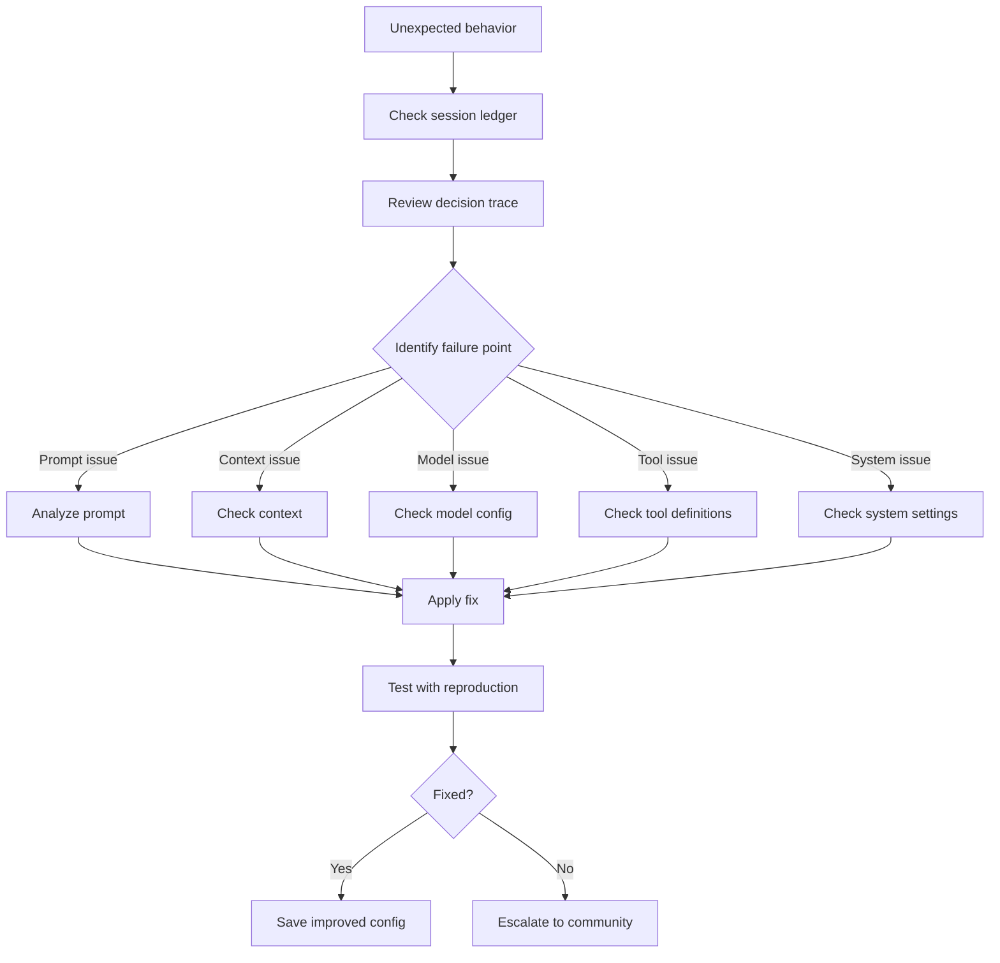

▄▄                            ██     ▄▄   ▄▄▄                  ▄▄           
████                ██         ▀▀     ██  ██▀                   ██           
████    ██▄████▄  ███████    ████     ██▄██      ▄████▄    ▄███▄██   ▄████▄  
██  ██   ██▀   ██    ██         ██     █████     ██▀  ▀██  ██▀  ▀██  ██▄▄▄▄██ 
██████   ██    ██    ██         ██     ██  ██▄   ██    ██  ██    ██  ██▀▀▀▀▀▀ 
▄██  ██▄  ██    ██    ██▄▄▄   ▄▄▄██▄▄▄  ██   ██▄  ▀██▄▄██▀  ▀██▄▄███  ▀██▄▄▄▄█ 
▀▀    ▀▀  ▀▀    ▀▀     ▀▀▀▀   ▀▀▀▀▀▀▀▀  ▀▀    ▀▀    ▀▀▀▀      ▀▀▀ ▀▀    ▀▀▀▀▀ 

ANTIKODE — terminal-native AI coding engine
Lois-Kleinner and 0-1.gg 2026 Copyright

# 04 — Why Agents Behave Unexpectedly and How to Fix

ANTIKODE agents are complex systems that combine language models, tool execution, session context, and decision-making algorithms. When an agent behaves unexpectedly, there is always a reason. This document explains the common causes of unexpected agent behavior and provides systematic approaches to diagnosing and fixing them.

## 4.1 Agent Architecture Overview

```mermaid
flowchart TD
    A[User Input] --> B[Context Builder]
    B --> C[System Prompt]
    B --> D[Session History]
    B --> E[Workspace State]
    B --> F[Tool Descriptions]
    G[Model Configuration] --> H[LLM]
    C --> H
    D --> H
    E --> H
    F --> H
    H --> I[Raw Output]
    I --> J[Output Parser]
    J --> K{Valid Action?}
    K -->|Tool Call| L[Execute Tool]
    K -->|Response| M[Format Response]
    K -->|Invalid| N[Retry with correction]
    L --> O[Tool Result]
    O --> H[LLM (next turn)]
    M --> P[Display to User]
    N --> H
```

### 4.1.1 Agent Decision Loop

```
1. Receive user input
2. Build context (system prompt + history + state + tools)
3. Send to LLM for processing
4. Parse LLM output (text, tool call, or action)
5. If tool call: execute tool, add result to context, go to step 3
6. If response: format and display to user
7. Wait for next user input
```

## 4.2 Categories of Unexpected Behavior

### 4.2.1 Behavior Classification

| Category | Description | Typical Root Cause |
|----------|-------------|-------------------|
| Refusal | Agent refuses to perform task | Safety guardrails, ambiguous instruction |
| Hallucination | Agent invents facts or code | Model limitation, insufficient context |
| Task Incompletion | Agent stops before finishing | Context overflow, token limit, confusion |
| Wrong Approach | Agent uses wrong strategy | Missing context, ambiguous goal, weak reasoning |
| Tool Misuse | Agent uses wrong tool or wrong parameters | Poor tool descriptions, tool confusion |
| Looping | Agent repeats the same action | Context confusion, tool feedback loop |
| Over-Engineering | Agent produces overly complex solution | No constraints given, high temperature |
| Contradiction | Agent contradicts previous statements | Long session, context degradation |
| Ignoring Instructions | Agent doesn't follow explicit instructions | Prompt position, instruction clarity |
| Excessive Verbosity | Agent produces too much text | High temperature, no format constraints |

## 4.3 Diagnosing Agent Behavior

### 4.3.1 The Diagnostic Workflow



### 4.3.2 Using the Session Ledger for Diagnosis

```bash
# Export the full session for analysis
antikode session export --latest --format json --output session-debug.json

# View the decision trace
antikode session analyze --latest --focus decisions

# Look for the agent's chain-of-thought
antikode session query --latest --type decision --format markdown

# Check what tools were considered
antikode session query --latest --type agent_action --format table
```

### 4.3.3 Key Questions to Ask

1. **What exactly did the agent do wrong?** (Be specific, not just "it was wrong")
2. **What was the agent's reasoning at the failure point?** (Check decision trace)
3. **What context was available to the agent?** (Prompt + history + tool descriptions)
4. **What model was used, and with what settings?** (Size, quantization, temperature)
5. **Is the behavior reproducible with a different model?** (Helps isolate model vs. prompt issue)
6. **Does the behavior happen consistently or intermittently?** (Suggests randomness vs. deterministic issue)

## 4.4 Prompt-Related Issues

### 4.4.1 Ambiguous Instructions

**Problem**: Agent chooses wrong interpretation of an ambiguous instruction.

**Example**:
```
User: "Clean up the code"
Agent: Removes all comments and formatting
Expected: Refactors and improves code structure
```

**Fix**: Be specific about what "clean up" means.
```
User: "Refactor the code in src/utils.ts:
- Extract repeated logic into helper functions
- Add TypeScript type annotations
- Rename unclear variable names
- Do NOT remove comments or change formatting"
```

### 4.4.2 Instructions Not Followed

**Problem**: Agent ignores explicit instructions.

**Causes**:
- Instruction buried in middle of long prompt
- Instruction contradicts model's training
- Instruction is vague or unenforceable
- Competing instructions in system prompt

**Fix**:
```
# Place important instructions at the START and END of prompt
"CRITICAL: Do NOT modify package.json or tsconfig.json.
[task description]
REMINDER: package.json and tsconfig.json must remain unchanged."
```

### 4.4.3 Goal Misalignment

**Problem**: Agent optimizes for the wrong metric.

**Example**:
```
User: "Make the code faster"
Agent: Rewrites everything in Rust (breaking integration)
Expected: Profile and optimize bottlenecks in current language
```

**Fix**: Specify constraints and priorities.
```
User: "Optimize the code in src/processor.ts for speed:
- Stay in TypeScript (do not change language)
- Target 20% improvement in processing time
- Use profiling to identify bottlenecks first
- Maintain backward compatibility
- All existing tests must pass"
```

### 4.4.4 Missing Context

**Problem**: Agent makes decisions without necessary context.

**Example**:
```
User: "Add error handling"
Agent: Adds try/catch blocks everywhere
Expected: Add targeted error handling for specific failure modes
```

**Fix**:
```
User: "Add error handling to src/api/users.ts:
- Handle 4xx HTTP errors with user-friendly messages
- Handle 5xx errors with retry logic (max 3 retries)
- Log all errors to the error logger
- Do not wrap non-IO operations in try/catch
- Current error types: NetworkError, AuthError, ValidationError"
```

## 4.5 Context-Related Issues

### 4.5.1 Context Window Exhaustion

**Problem**: Agent behavior degrades as the session gets longer.

**Symptoms**:
- Agent forgets earlier instructions
- Agent contradicts itself
- Agent loses track of the task
- Output quality declines

**Diagnosis**:
```bash
# Check context usage
antikode session info --latest --verbose | findstr context

# Check if context compression is active
antikode session info --latest --verbose | findstr compression
```

**Fixes**:
```bash
# Start a fresh session for complex tasks
antikode --session fresh

# Use checkpoints to preserve important state
/checkpoint "Completed refactoring, starting tests"

# Summarize context manually
/summarize "Summary of progress so far: ..."

# Configure automatic summarization
antikode config set session.autoSummarize true
antikode config set session.autoSummarizeThreshold 4096

# Use longer context model
antikode --model qwen2.5-14b --context-length 32768
```

### 4.5.2 Context Pollution

**Problem**: Irrelevant context distracts the agent.

**Causes**:
- Previous task's context bleeds into current task
- Too many tool results in history
- Error messages flooding the context
- Debug logs included in session

**Fixes**:
```bash
# Start fresh session for different tasks
# Clear tool history
/tools clear

# Reset context
/reset

# Selective context management
"Use only the following context for this task:
[relevant context here]
Ignore all previous context."
```

### 4.5.3 Conflicting Context

**Problem**: Different parts of the context contradict each other.

**Common scenarios**:
- Workspace state differs from agent's assumptions
- File contents changed between reads and writes
- Session history contains retracted or superseded information

**Fixes**:
- Use `/refresh` to update workspace state
- Check file contents before referencing them
- Explicitly state when superseding previous instructions
- Use `--session fresh` for major context changes

## 4.6 Model-Related Issues

### 4.6.1 Model Too Small for Task

**Problem**: Small models struggle with complex tasks.

**Symptoms**:
- Incomplete code generation
- Logical errors in reasoning
- Missing edge cases
- Simple or incorrect solutions

**Diagnosis**:
```bash
# Compare behavior across models
antikode --model qwen2-vl-2b-q4 --prompt "..."  # Fails
antikode --model qwen2.5-7b --prompt "..."    # Succeeds

# Test model capability
antikode benchmark --model qwen2-vl-2b-q4 --test reasoning
```

**Fixes**:
```bash
# Use larger model for complex tasks
antikode --model qwen2.5-14b

# Break complex task into simpler subtasks
"/agent Step 1: Analyze requirements (use qwen2.5-7b)"
"/agent Step 2: Design solution (use qwen2.5-14b)"
"/agent Step 3: Implement (use qwen2.5-7b)"

# Use higher quality quantization
antikode model download qwen2.5-7b-q8_0
```

### 4.6.2 Temperature Too High or Low

**Problem**: Temperature setting causes unexpected behavior.

**High temperature (0.7+)**: Creative but unreliable, invents APIs, inconsistent output.
**Low temperature (0.0-0.1)**: Very deterministic, may loop, limited creativity.

**Diagnosis**:
```bash
# Check current temperature
antikode config get llm.temperature

# Test different temperatures
antikode --temperature 0.1 --prompt "Write a sorting function"
antikode --temperature 0.7 --prompt "Write a sorting function"
```

**Fixes**:
```bash
# Code generation: 0.1-0.2
antikode config set llm.temperature 0.1

# Documentation: 0.3-0.5
antikode config set llm.temperature 0.4

# Brainstorming: 0.7-0.9
antikode config set llm.temperature 0.8
```

### 4.6.3 Quantization Artifacts

**Problem**: Heavy quantization causes quality degradation.

**Symptoms**:
- Grammatical errors in output
- Nonsensical code
- Repetition
- Reduced reasoning ability

**Diagnosis**:
```bash
# Compare quantization levels
antikode model test qwen2.5-7b-q2_k --prompt "Write a binary search"
antikode model test qwen2.5-7b-q8_0 --prompt "Write a binary search"
```

**Fixes**:
```bash
# Use lighter quantization
antikode model download qwen2.5-7b-q8_0  # 8-bit, higher quality
antikode model download qwen2.5-7b-f16    # 16-bit, highest quality

# Use a smaller model with lighter quantization
antikode --model qwen2.5-3b-q8_0  # Smaller but higher quality
```

## 4.7 Tool-Related Issues

### 4.7.1 Wrong Tool Selection

**Problem**: Agent uses an inappropriate tool for the task.

**Causes**:
- Tool descriptions are unclear or misleading
- Multiple tools with similar purposes
- Agent doesn't understand tool capabilities
- Tool name is ambiguous

**Diagnosis**:
```bash
# Review tool descriptions
antikode tools list --verbose

# Check which tools agent considered
antikode session query --latest --type agent_action --format json

# Compare tool schemas
antikode tools schema files_read
antikode tools schema grep
antikode tools schema bash
```

**Fixes**:
```bash
# Guide tool selection in prompt
"Use files_read to read the file first, then suggest changes"
"Use grep to search for patterns, not bash with grep command"

# Improve tool descriptions (in plugin manifest)
# Rename ambiguous tools
# Disable irrelevant tools for the task
antikode tools disable redundant-tool
```

### 4.7.2 Tool Execution Errors

**Problem**: Tool returns errors that confuse the agent.

**Symptoms**:
- Agent tries the same failing tool repeatedly
- Agent invents output when tool fails
- Agent gets stuck in error loop

**Diagnosis**:
```bash
# Check tool execution history
antikode session query --latest --type tool_call,tool_result --format table

# View error messages in tool results
antikode session export --latest --format json | jq '.entries[] | select(.type=="tool_result") | .content'
```

**Fixes**:
```bash
# Guide agent on error handling
"If the tool returns an error, try an alternative approach and report the error"
"After 3 failed tool attempts, stop and ask for help"

# Improve error messages from tools
# Add more context to tool error output
```

### 4.7.3 Tool Overuse

**Problem**: Agent makes excessive tool calls.

**Causes**:
- Agent doesn't understand tool output caching
- Agent re-reads the same files repeatedly
- Inefficient tool usage pattern

**Fixes**:
```
"Read all the files you need in one operation"
"Cache file contents — don't re-read files you already have"
"Plan your tool calls before executing them"
```

## 4.8 System Prompt Issues

### 4.8.1 Default System Prompt Override

The system prompt defines agent behavior. Modifying it can cause unexpected results.

```bash
# View current system prompt
antikode config get agent.systemPrompt

# Add custom behavior
antikode config set agent.systemPrompt "You are a senior developer. Always explain your reasoning."

# Use a custom system prompt file
antikode --system-prompt ./my-prompt.md
```

### 4.8.2 System Prompt Best Practices

**Do**:
- Keep it concise (200-500 tokens)
- Put the most important instructions first
- Use positive language ("Do X" not "Don't do Y")
- Specify output format preferences
- Define agent persona clearly

**Don't**:
- Override without understanding defaults
- Include contradictory instructions
- Make it too long (dilutes effectiveness)
- Use negative instructions excessively

### 4.8.3 System Prompt Components

Default system prompt structure:
1. Role definition (who the agent is)
2. Available tools (what tools exist and what they do)
3. Behavioral rules (how to interact)
4. Output format (how to format responses)
5. Safety guidelines (what to avoid)
6. Session management (how to use checkpoint, summarize, etc.)

## 4.9 Session Management Issues

### 4.9.1 Session Too Long

**Problem**: Agent behavior degrades in long sessions.

**Pragmatic limits**:
- 50-100 interactions for small models (<7B)
- 100-200 interactions for large models (>=7B)
- 200+ interactions requires context management

**Warning signs**:
- Agent takes longer to respond
- Agent starts making simple mistakes
- Agent repeats information
- Agent loses track of the goal

**Fixes**:
```bash
# Monitor session health
antikode session info --latest --health

# Create a summary checkpoint
/checkpoint "Summarize: [brief summary of what was accomplished]"
/summarize

# Start continuation session
antikode --session continue --from <session-id>
```

### 4.9.2 Multiple Agents Confusion

**Problem**: Multiple agents interfere with each other.

**Causes**:
- Agent boundaries not clear
- Agents share context unintentionally
- Task handoff not explicit

**Fixes**:
```
"@architect: Complete the design and hand off to @coder.
@coder: Wait for @architect to finish before starting.
Use explicit handoff markers:

--- ARCHITECT OUTPUT END ---

--- CODER START ---"
```

## 4.10 Environmental Issues

### 4.10.1 Workspace State Mismatch

**Problem**: Agent's understanding of workspace differs from reality.

**Causes**:
- Files changed outside ANTIKODE
- Git branch switched mid-session
- Dependencies installed/uninstalled
- Build artifacts changed

**Fixes**:
```bash
# Refresh workspace state
antikode exec -- refresh-workspace

# Check current state
/pwd
/ls

# Re-read critical files
"Re-read package.json and tsconfig.json before making changes"
```

### 4.10.2 Network/Dependency Issues

**Problem**: Agent suggests solutions that fail due to environment.

**Fixes**:
```
"Before suggesting dependencies, check if they're already installed"
"List available package versions before adding dependencies"
"Verify that suggested commands work in this environment"
"Assume no internet access — use only local packages"
```

## 4.11 Fixing Common Behavior Patterns

### 4.11.1 Agent Refuses to Do Something

```
"Explain your reasoning for refusing, then ask for clarification"
"Assume this is a legitimate development task in a safe environment"
"I understand the safety concern. Here's why this is safe: [explanation]"
```

### 4.11.2 Agent Is Too Verbose

```
"Use `--format concise` mode"
"Respond in bullet points, not paragraphs"
"Maximum 3 sentences per response"
"Output only the code, no explanations"
```

### 4.11.3 Agent Writes Correct but Unidiomatic Code

```
"Follow the code style of [link to style guide]"
"Use established patterns from [framework] best practices"
"Use the same patterns as existing code in this project"
"Prefer simple, readable code over clever solutions"
```

### 4.11.4 Agent Ignores Edge Cases

```
"List all edge cases you're handling before writing code"
"Consider: null inputs, empty arrays, network errors, invalid data"
"Add input validation for all public functions"
"Write tests that cover the edge cases you identify"
```

### 4.11.5 Agent Gets Stuck in Loops

```
"After 3 failed attempts, stop and explain the problem"
"Try a different approach if the current one isn't working"
"Ask for clarification if you're stuck"
"Use /checkpoint to save progress and start fresh approach"
```

## 4.12 Agent Behavior Configuration Reference

### 4.12.1 Key Configuration Settings

```json
{
  "agent": {
    "systemPrompt": "Default system prompt override",
    "temperature": 0.2,
    "maxTurns": 50,
    "maxToolCallsPerTurn": 10,
    "maxToolRetries": 3,
    "contextCompression": true,
    "compressionThreshold": 4096,
    "summarizationModel": null,
    "autoSummarize": true,
    "decisionLogging": true,
    "chainOfThought": true,
    "toolConfidenceThreshold": 0.7
  }
}
```

### 4.12.2 Agent Presets

```bash
# Conservative agent (precise, safe, minimal creativity)
antikode agent preset conservative

# Creative agent (exploratory, multiple solutions)
antikode agent preset creative

# Balanced agent (default)
antikode agent preset balanced

# Custom preset
antikode agent preset create my-preset --from conservative --temperature 0.15
```

## 4.13 Agent Behavior Logging

```bash
# Enable detailed decision logging
antikode config set agent.decisionLogging true

# View real-time agent decisions
antikode --show-reasoning

# Export agent decision tree
antikode session export --latest --format dot --output decisions.dot

# Analyze agent behavior patterns
antikode session analyze --latest --focus agent_actions
```

## 4.14 When to Ask for Help

If systematic diagnosis doesn't resolve the issue:

1. Share your session ledger (sanitized) with the community
2. Include the specific unexpected behavior and what you expected
3. Note the model, temperature, and configuration used
4. Mention if the behavior is reproducible or intermittent
5. Reference any relevant error codes

The community #agent-behavior channel on Matrix is specifically for these discussions.

## 4.15 Agent Behavior Troubleshooting Checklist

Use this checklist when agent behavior is unexpected:

- [ ] Is the task clear and specific? (vs. vague like "fix this")
- [ ] Is the context sufficient? (does agent know the project structure?)
- [ ] Are constraints explicit? (language, style, dependencies, edge cases)
- [ ] Is the model appropriate for task complexity?
- [ ] Is temperature appropriate for the task type?
- [ ] Are tool descriptions clear and unambiguous?
- [ ] Is the session fresh enough? (not carrying old context)
- [ ] Is the system prompt configured correctly?
- [ ] Are there conflicting instructions in the context?
- [ ] Have you checked the decision trace in the session ledger?
- [ ] Is the behavior reproducible with a different model?
- [ ] Is the behavior reproducible with minimal prompt?

## 4.16 Conclusion

Unexpected agent behavior is usually traceable to a specific cause: prompt ambiguity, context issues, model limitations, tool confusion, or configuration problems. The session ledger provides complete transparency into the agent's decision-making process, making systematic diagnosis possible.

Remember the three rules of agent debugging:
1. **Always check the session ledger first** — the agent's reasoning is captured there
2. **Isolate the variable** — change one thing at a time when testing fixes
3. **Start with a fresh session** — many issues are caused by context degradation

For prompt engineering best practices, see `docs/how-to-use-community/04-best-practices.md`. For error code references, see `01-error-codes.md`.

```
.====================================================================.
!  Made in the UAE, Dubai #DubaiIt #Dubai #Dxb #SovereignAI          !
!  Made in The Emirates #Dubai_it                                    !
!                                                                    !
!  Lois-Kleinner Alpasan - The Anticloud 2026-                       !
!                                                                    !
!  0-1.gg ! GitHub ! LinkedIn ! DEV ! GH Pages                       !
!  HuggingFace ! Blog ! Tumblr ! Fandom ! Bluesky ! Mastodon          !
!  Zenodo ! Harvard Dataverse ! Internet Archive ! ORCID ! Figshare   !
!                                                                    !
!  Sovereign AI ! Local-First ! Privacy ! Zero Trust ! No Datacenter !
!  Air-Gapped ! Open Source ! Rust ! Hash Chain ! Single Binary      !
!  Offline LLM ! Crypto Ledger ! P2P ! Federated                     !
'===================================================================='
```

Lois-Kleinner Alpasan, 22, has served executive roles spanning technology, operations, finance, and product across 20+ organizations. His cross-functional work combines architecture, business, and AI strategy.

References:
1. Lois-Kleinner Zenodo: https://doi.org/10.5281/zenodo.20781790
2. Lois-Kleinner GitHub: https://github.com/kleinnner/Anticloud/tree/main/04-aioss-format
3. Lois-Kleinner Harvard DV: https://doi.org/10.7910/DVN/SZJMZA
4. Lois-Kleinner Internet Arc: https://archive.org/details/aioss-format
5. Lois-Kleinner ORCID: https://orcid.org/0009-0009-2233-6107
6. Lois-Kleinner DEV.to: https://dev.to/kleinner
7. Lois-Kleinner LinkedIn: https://linkedin.com/in/kleinner
8. Lois-Kleinner HuggingFace: https://huggingface.co/Anticloud
9. Lois-Kleinner Tumblr: https://anticloud.tumblr.com
10. Lois-Kleinner Mastodon: https://mastodon.social/@kleinner
11. Lois-Kleinner Bluesky: https://bsky.app/profile/kleinner.bsky.social
12. 0-1.gg: https://0-1.gg
13. Lois-Kleinner Figshare: https://figshare.com/authors/Lois-Kleinner_Alpasan/20849885
