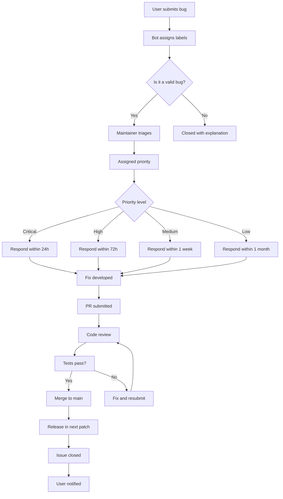
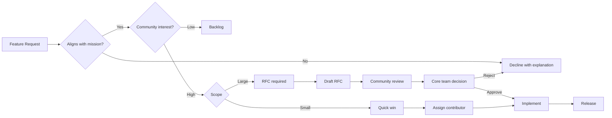
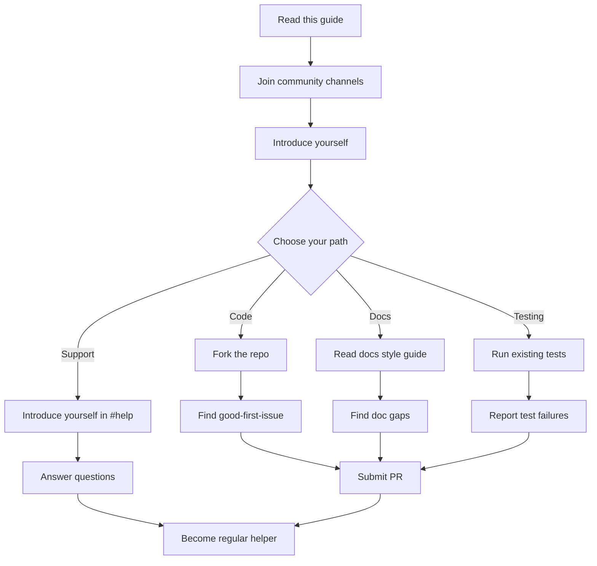

▄▄                            ██     ▄▄   ▄▄▄                  ▄▄           
████                ██         ▀▀     ██  ██▀                   ██           
████    ██▄████▄  ███████    ████     ██▄██      ▄████▄    ▄███▄██   ▄████▄  
██  ██   ██▀   ██    ██         ██     █████     ██▀  ▀██  ██▀  ▀██  ██▄▄▄▄██ 
██████   ██    ██    ██         ██     ██  ██▄   ██    ██  ██    ██  ██▀▀▀▀▀▀ 
▄██  ██▄  ██    ██    ██▄▄▄   ▄▄▄██▄▄▄  ██   ██▄  ▀██▄▄██▀  ▀██▄▄███  ▀██▄▄▄▄█ 
▀▀    ▀▀  ▀▀    ▀▀     ▀▀▀▀   ▀▀▀▀▀▀▀▀  ▀▀    ▀▀    ▀▀▀▀      ▀▀▀ ▀▀    ▀▀▀▀▀ 

ANTIKODE — terminal-native AI coding engine
Lois-Kleinner and 0-1.gg 2026 Copyright

# 01 — Getting Involved in the ANTIKODE Community

Welcome to ANTIKODE. This document explains how to join the community, contribute to the project, and report bugs effectively. ANTIKODE is built in the open — every line of code, every session ledger, every decision trace is visible to the public. Community participation is not just welcome; it is essential to the project's mission of transparent, auditable AI-assisted development.

## 1.1 Where the Community Lives

ANTIKODE community spaces are organized around transparency and accessibility. All channels are public and archived.

| Channel | Purpose | Access |
|---------|---------|--------|
| GitHub Discussions | Feature requests, Q&A, show and tell | github.com/antikode/community |
| Matrix Space | Real-time chat, support, collaboration | matrix.to/#/antikode-community |
| Discord Bridge | Discord users bridged to Matrix | discord.gg/antikode |
| GitHub Issues | Bug reports, feature proposals | github.com/antikode/antikode/issues |
| Mailing List | Monthly updates, security announcements | lists.antikode.dev |
| IRC (Libera.Chat) | #antikode — text-only bridge | irc.libera.chat |

## 1.2 Code of Conduct

ANTIKODE enforces a strict Code of Conduct based on the Contributor Covenant v2.1. All participants agree to:

- **Be respectful** — Disagreement is healthy; personal attacks are not.
- **Assume good faith** — Most contributors are volunteering their time.
- **Prioritize transparency** — Share reasoning, sources, and alternatives.
- **Avoid harassment** — This includes unwanted attention, intimidation, and exclusionary behavior.
- **Protect privacy** — Do not share others' personal information without consent.

Reports of Code of Conduct violations should be sent to conduct@antikode.dev. All reports are reviewed by a three-person committee.

## 1.3 Ways to Contribute

There are many ways to contribute beyond writing code.

### 1.3.1 Code Contributions

ANTIKODE's core is written in TypeScript and runs on Bun. The repository is organized as a monorepo:

```
antikode/
├── packages/
│   ├── cli/        — Terminal UI and command parsing
│   ├── console/    — Terminal rendering engine (OpenTUI)
│   ├── core/       — Session management, .aioss ledger engine
│   ├── llm/        — LLM provider abstraction layer
│   └── plugin/     — Plugin system and MCP integration
├── scripts/        — Build, install, and setup scripts
├── docs/           — Documentation tree
└── models/         — Bundled GGUF model files
```

To contribute code:

1. Fork the repository at github.com/antikode/antikode
2. Create a feature branch from `main`
3. Make changes following the coding conventions in CONTRIBUTING.md
4. Run tests with `bun test`
5. Run the linter with `bun run lint`
6. Submit a pull request with a clear description and linked issue

### 1.3.2 Documentation Contributions

Documentation lives alongside code in the `docs/` directory. Each topic has a corresponding plain-text mirror in `docs-txt/`. To contribute documentation:

1. Identify gaps or inaccuracies in the existing docs
2. Open an issue describing what you want to change
3. Submit a PR with your changes to both the `.md` and `.txt` files

All documentation is written in GitHub-Flavored Markdown with Mermaid diagrams. Plain-text mirrors omit diagrams but preserve all prose.

### 1.3.3 Testing and Bug Reporting

Testing is one of the most valuable contributions. ANTIKODE includes:

- **Unit tests** with `bun test` (Vitest-compatible)
- **Integration tests** with `bun test --integration`
- **Session replay tests** that verify .aioss ledger integrity
- **Model compatibility tests** that validate GGUF loading across quantizations

When reporting bugs, always include:

- ANTIKODE version (`antikode --version`)
- Operating system and terminal emulator
- The exact command sequence that triggered the bug
- The full error output (including ANT-XXXX error codes)
- Your .aioss session ledger (find in `~/.antikode/sessions/`)
- Whether the bug is reproducible with a clean model

### 1.3.4 Plugin Development

The plugin ecosystem is extensible via the Plugin API documented in `packages/plugin/README.md`. Plugins can:

- Add custom tools (MCP-compatible)
- Modify the terminal UI theme
- Add new LLM provider adapters
- Implement custom session hooks
- Create new agent behaviors

See the Plugin Ecosystem guide (`03-plugin-ecosystem.md`) for details.

### 1.3.5 Translation and Localization

ANTIKODE's CLI interface supports i18n. We maintain translations for:

- English (en) — primary
- Japanese (ja)
- Simplified Chinese (zh-CN)
- German (de)
- French (fr)
- Spanish (es)

Translation files are in `packages/cli/src/i18n/`. If your language is not listed, you can start a new translation by copying `en.json`.

### 1.3.6 Community Support

Help other users in the community channels. Answer questions, review session ledgers, share prompt engineering tips. Active community helpers are recognized in our monthly community spotlight.

## 1.4 Reporting Bugs

A good bug report is the difference between a fix in hours and a fix in weeks.

### 1.4.1 Before You Report

1. Search existing issues (both open and closed) for your problem
2. Update to the latest version: `antikode update`
3. Test with a different model to rule out model-specific issues
4. Check if the issue is environment-specific (try a different terminal)
5. Review the error code reference in `docs/help/01-error-codes.md`

### 1.4.2 Writing a Bug Report

Use the following template:

```
**Summary**: [One-line description]

**Version**: antikode X.Y.Z (run `antikode --version`)
**OS**: Windows 11 / macOS 14 / Ubuntu 24.04
**Terminal**: Windows Terminal / iTerm2 / kitty / GNOME Terminal
**Model**: qwen2-vl-2b-q4_K_M / Llama-3.2-3B-Q4_K_M / Custom

**Steps to reproduce**:
1. Run `antikode --model qwen2-vl-2b-q4`
2. Type `/agent build`
3. Observe error ANT-2301

**Expected behavior**: [What should happen]

**Actual behavior**: [What actually happens]

**Session ledger**: [Attach or link to .aioss file]

**Additional context**: [Screenshots, terminal logs, workarounds tried]
```

### 1.4.3 Bug Report Lifecycle



### 1.4.4 Security Vulnerabilities

Security vulnerabilities must **not** be reported through public channels. Instead:

1. Email security@antikode.dev with full details
2. Optionally encrypt with our published GPG key (available on keyservers, fingerprint `A1B2 C3D4 E5F6 7890`)
3. You will receive an acknowledgment within 48 hours
4. We aim to have a fix within 7 days for critical vulnerabilities
5. After the fix is released, we publish a security advisory

Our security team follows responsible disclosure: we will coordinate with you on timing before public disclosure.

## 1.5 Feature Requests

Feature requests follow a similar process to bug reports but use the "Feature Request" issue template.

### 1.5.1 Good Feature Requests

A good feature request:

- Describes the **problem**, not just a solution
- Explains why existing features are insufficient
- Includes use cases and expected workflows
- Considers backward compatibility
- Suggests implementation approach (optional)

### 1.5.2 Feature Evaluation Criteria



### 1.5.3 Request for Comments (RFC)

Large features require an RFC (Request for Comments) process:

1. Write a detailed proposal in `docs/rfc/` following the RFC template
2. Submit as a pull request
3. Community discussion period: 2 weeks minimum
4. Core team votes: approval, changes requested, or rejection
5. Approved RFCs are implemented per the project roadmap

## 1.6 Community Governance

ANTIKODE is governed by a three-tier model:

### 1.6.1 Core Team

The core team has commit access and makes final decisions on the project direction. Members are appointed based on sustained, high-quality contributions. Current core team members are listed in `TEAM.md` in the repository root.

### 1.6.2 Maintainers

Maintainers have merge access to specific packages or areas. They review PRs, triage issues, and mentor new contributors. Maintainers are appointed by the core team.

### 1.6.3 Contributors

Anyone who submits a PR, files a useful bug report, writes documentation, or helps in community channels is a contributor. Contributors who demonstrate sustained activity may be invited to become maintainers.

## 1.7 Community Events

ANTIKODE hosts regular community events:

| Event | Frequency | Format |
|-------|-----------|--------|
| Community Call | Monthly | Video + text chat |
| Hackathon | Quarterly | Virtual, 48 hours |
| Plugin Jam | Bi-annual | Build a plugin in 1 week |
| Docs Sprint | Monthly | Collaborative docs improvement |
| Bug Bash | Monthly | Focused bug hunting |

Event announcements are made in all community channels and on the ANTIKODE blog at antikode.dev/blog.

## 1.8 Mentorship

ANTIKODE participates in mentorship programs to onboard new contributors:

- **First-timer Friday**: Every Friday, maintainers pair with first-time contributors
- **Good First Issues**: Issues tagged `good-first-issue` are reserved for newcomers
- **Mentorship matches**: Experienced contributors volunteer to mentor specific topics
- **Office hours**: Weekly office hours on Matrix for drop-in questions

To participate, join the #mentorship channel on Matrix.

## 1.9 Recognition

Contributors are recognized through:

- **CONTRIBUTORS.md**: All contributors listed alphabetically
- **Release notes**: Notable contributions highlighted in each release
- **Community spotlight**: Monthly feature on the blog
- **Swag**: Core contributors receive ANTIKODE-branded merchandise
- **Conference travel**: Speaking opportunities sponsored by the project

## 1.10 Getting Started Checklist



## 1.11 Communication Best Practices

When communicating in community channels:

- **Search before asking**: Your question may have been answered before
- **Provide context**: Share your goal, not just your immediate problem
- **Be patient**: Community members are volunteers in different time zones
- **Use threads**: Keep conversations organized with Matrix threads
- **Share ledgers**: When debugging, share your .aioss session ledger
- **Format code**: Use code blocks with language tags for terminal output

### 1.11.1 Asking Technical Questions

Bad question: "ANTIKODE doesn't work help"

Good question: "I'm running ANTIKODE v1.2.3 on Windows Terminal with qwen2-vl-2b-q4. When I run `/agent build`, I get error ANT-2301. My session ledger is attached. Has anyone seen this before?"

### 1.11.2 Providing Help

When helping others:

- Point to documentation rather than repeating answers
- Explain the reasoning, not just the solution
- Ask clarifying questions before suggesting fixes
- Share relevant parts of your own configuration
- Follow up to ensure the solution worked

## 1.12 Project Roadmap

ANTIKODE's current and planned development is tracked in `ROADMAP.md`. Major themes:

- **Q3 2026**: Plugin API v1.0, MCP protocol stability, multi-model routing
- **Q4 2026**: Distributed session ledgers, collaborative coding, CLI v2
- **Q1 2027**: IDE integration protocol, visual debugging, model fine-tuning hooks
- **Q2 2027**: Enterprise SSO, audit compliance, SLA-backed deployments

Community input shapes the roadmap. Feature requests with broad community support are prioritized.

## 1.13 Legal and Licensing

ANTIKODE is licensed under the GNU Affero General Public License v3.0 (AGPL-3.0). This means:

- You can use, modify, and distribute ANTIKODE freely
- If you modify ANTIKODE and offer it as a network service, you must distribute your modifications
- All contributions to ANTIKODE must be licensed under AGPL-3.0
- Documentation is licensed under Creative Commons Attribution-ShareAlike 4.0 (CC BY-SA 4.0)

Contributors must sign a Developer Certificate of Origin (DCO) asserting they have the right to contribute their changes. The DCO is checked automatically on pull requests.

## 1.14 Frequently Asked Questions

**Q: Do I need to know TypeScript to contribute?**  
A: Not necessarily. Documentation, testing, translations, and community support are all valuable non-code contributions.

**Q: Can I use ANTIKODE commercially?**  
A: Yes, AGPL-3.0 allows commercial use. If you modify ANTIKODE for internal use, you do not need to share your changes. If you offer modified ANTIKODE as a service, you must distribute your modifications.

**Q: How do I become a maintainer?**  
A: Maintainers are appointed based on consistent, high-quality contributions over time. There is no formal application process.

**Q: What is the response time for issues?**  
A: Critical security issues: 48 hours. Bug reports: 1 week for initial triage. Feature requests: 2 weeks for initial evaluation.

**Q: Can I start a local ANTIKODE meetup?**  
A: Absolutely. We provide resources for local community organizers, including presentation materials and swag. Contact community@antikode.dev.

## 1.15 Appendix: Community Resources

| Resource | URL |
|----------|-----|
| Repository | github.com/antikode/antikode |
| Documentation | docs.antikode.dev |
| Community Forum | github.com/antikode/community |
| Blog | antikode.dev/blog |
| Status Page | status.antikode.dev |
| Security | security@antikode.dev |
| Conduct | conduct@antikode.dev |
| Twitter / X | @antikode_dev |
| YouTube | youtube.com/@antikode |

## 1.16 Glossary

| Term | Definition |
|------|------------|
| .aioss | Audit Intelligence Open Session Standard — the ledger format for recording all ANTIKODE sessions |
| Agent | An AI-driven coding assistant that operates within ANTIKODE |
| GGUF | GPT-Generated Unified Format — the model file format used by llama.cpp |
| Ledger | An encrypted, verifiable record of all actions in a session |
| MCP | Model Context Protocol — standard for tool discovery and invocation |
| Plugin | Extensions that add tools, themes, or providers to ANTIKODE |
| Session | A single interaction timeline from ANTIKODE launch to exit |
| TUI | Terminal User Interface |

## 1.17 Quick Reference

```mermaid
flowchart TD
    subgraph "New User Journey"
        A[Install ANTIKODE] --> B[Run first session]
        B --> C[Explore help with /help]
        C --> D[Try /agent build]
    end
    subgraph "Contributor Journey"
        E[Fork repo] --> F[Find issue]
        F --> G[Write code/docs]
        G --> H[Run tests]
        H --> I[Submit PR]
    end
    subgraph "Community Journey"
        J[Join Matrix] --> K[Introduce yourself]
        K --> L[Help others]
        L --> M[Become regular]
        M --> N[Mentor newcomers]
    end
```



## 1.18 Version Compatibility

ANTIKODE maintains compatibility across the following matrix:

| Antikode Version | API Stability | Session Format | Plugin API |
|------------------|---------------|----------------|------------|
| 1.x (current) | Stable | .aioss v1 | v0.9 (beta) |
| 2.x (planned) | Stable | .aioss v2 | v1.0 |
| 3.x (future) | Stable | .aioss v2+ | v1.x |

Breaking changes are announced at least two releases in advance via the deprecation notice system.

## 1.19 Conclusion

The ANTIKODE community is built on transparency, collaboration, and mutual respect. Every contribution — whether a bug report, a documentation fix, a code patch, or a helping hand in chat — strengthens the project. We look forward to having you join us.

For a quick start, see the installation guide in `docs/help/02-installation-troubleshooting.md` and the best practices guide at `04-best-practices.md`.
