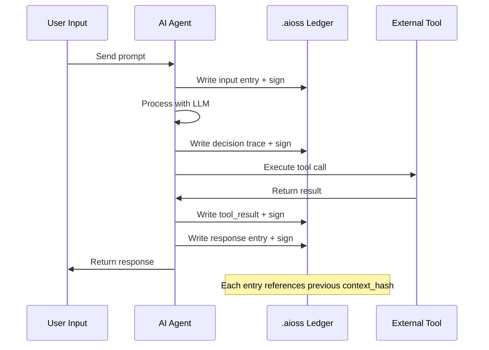
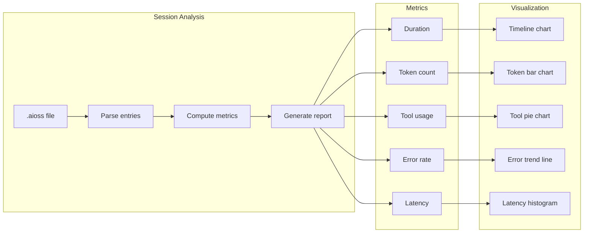
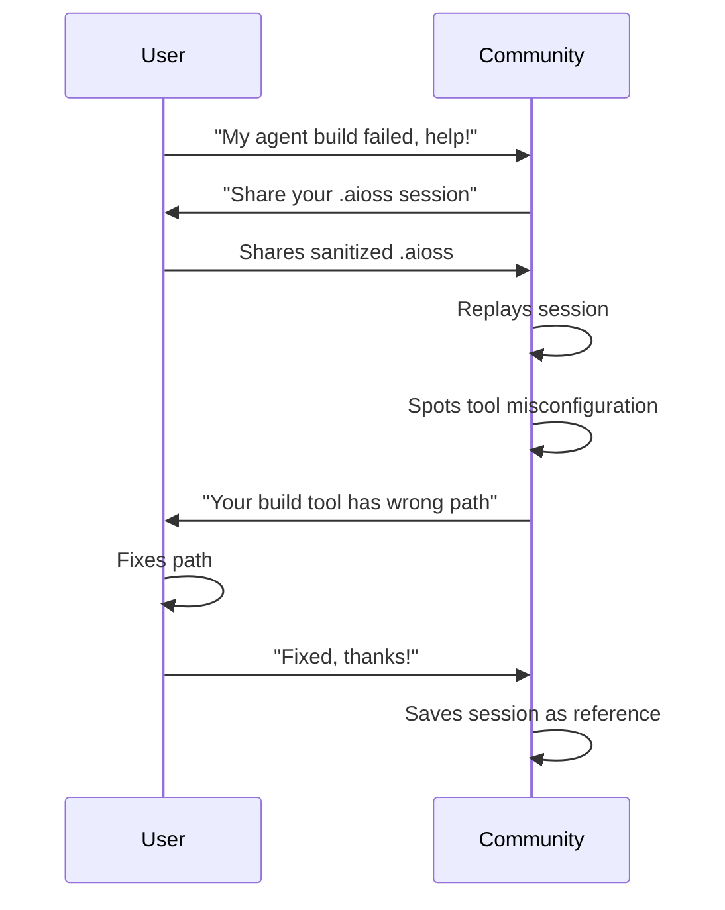
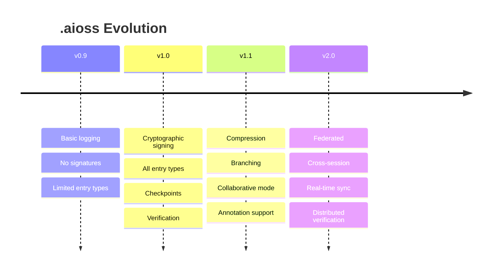

▄▄                            ██     ▄▄   ▄▄▄                  ▄▄           
████                ██         ▀▀     ██  ██▀                   ██           
████    ██▄████▄  ███████    ████     ██▄██      ▄████▄    ▄███▄██   ▄████▄  
██  ██   ██▀   ██    ██         ██     █████     ██▀  ▀██  ██▀  ▀██  ██▄▄▄▄██ 
██████   ██    ██    ██         ██     ██  ██▄   ██    ██  ██    ██  ██▀▀▀▀▀▀ 
▄██  ██▄  ██    ██    ██▄▄▄   ▄▄▄██▄▄▄  ██   ██▄  ▀██▄▄██▀  ▀██▄▄███  ▀██▄▄▄▄█ 
▀▀    ▀▀  ▀▀    ▀▀     ▀▀▀▀   ▀▀▀▀▀▀▀▀  ▀▀    ▀▀    ▀▀▀▀      ▀▀▀ ▀▀    ▀▀▀▀▀ 

ANTIKODE — terminal-native AI coding engine
Lois-Kleinner and 0-1.gg 2026 Copyright

# 02 — Sharing .aioss Session Ledgers with the Community

ANTIKODE records every session in a structured ledger format called .aioss (Audit Intelligence Open Session Standard). These ledgers capture the complete timeline of user inputs, agent actions, tool invocations, model responses, and decision traces. Sharing session ledgers is the single most powerful way to contribute to the community — they enable reproducible debugging, collaborative learning, and collective improvement of prompt engineering techniques.

## 2.1 What is an .aioss Session Ledger?

An .aioss file is an append-only, cryptographically signed log of everything that happened during an ANTIKODE session. Think of it as a flight recorder for AI-assisted development.

### 2.1.1 Ledger Structure

```
.aioss
├── header
│   ├── version         — .aioss specification version
│   ├── session_id      — UUID v7 unique session identifier
│   ├── timestamp       — ISO 8601 session start time
│   ├── host_info       — OS, kernel, terminal type
│   ├── antikode_version — ANTIKODE build identifier
│   ├── model_info      — Model name, quantization, provider
│   └── public_key      — Ed25519 public key for verification
├── entries[]
│   ├── entry_type      — input / response / tool_call / tool_result / agent_action / decision / error / checkpoint
│   ├── sequence        — Monotonically increasing sequence number
│   ├── timestamp       — ISO 8601 entry timestamp
│   ├── content         — Entry payload (varies by type)
│   ├── parent          — Sequence of parent entry (chain of thought)
│   ├── context_hash    — SHA-256 of preceding entries
│   └── signature       — Ed25519 signature of this entry
└── footer
    ├── entry_count     — Total number of entries
    ├── final_hash      — SHA-256 of all entries
    ├── signature       — Ed25519 signature of footer
    └── checksum        — Blake2b checksum of entire file
```

### 2.1.2 Entry Types

| Entry Type | Description | Content Fields |
|------------|-------------|----------------|
| input | User input sent to the agent | text, mode, timestamp |
| response | Agent response text | text, model_id, tokens_used, temperature |
| tool_call | Agent invoked a tool | tool_name, parameters, reasoning |
| tool_result | Tool returned output | tool_name, result_code, stdout, stderr, duration_ms |
| agent_action | Agent decision without tool use | action_type, reasoning, confidence |
| decision | Agent's internal decision trace | chain_of_thought, alternatives_considered, chosen_path |
| error | Error event in session | error_code, message, stack_trace, context |
| checkpoint | User-requested checkpoint | label, tags, description |

### 2.1.3 Cryptographic Verification

Each ledger is cryptographically signed to ensure tamper-proof auditing. The signing process:

1. Each entry contains a SHA-256 hash of all preceding entries
2. Each entry is signed with the session's Ed25519 keypair
3. The footer contains a Blake2b checksum of the entire file
4. Verification can be performed with `antikode verify --session <path>`



## 2.2 Finding Session Ledgers

By default, session ledgers are stored in:

| Platform | Path |
|----------|------|
| Linux | `~/.antikode/sessions/` |
| macOS | `~/Library/Application Support/antikode/sessions/` |
| Windows | `%USERPROFILE%\.antikode\sessions\` |

To locate the most recent session:

```bash
# Linux / macOS
ls -t ~/.antikode/sessions/*.aioss | head -1

# Windows PowerShell
Get-ChildItem "$env:USERPROFILE\.antikode\sessions\*.aioss" | Sort-Object LastWriteTime -Descending | Select-Object -First 1
```

To view session metadata from the CLI:

```bash
antikode session info --latest
antikode session list
antikode session export --session <session_id> --format json
```

## 2.3 Exporting Sessions for Sharing

Before sharing a session ledger, you should review and optionally sanitize sensitive information.

### 2.3.1 Basic Export

```bash
antikode session export --session <session_id> --output ./shared-session.aioss
```

### 2.3.2 Sanitization

ANTIKODE provides built-in sanitization to remove or redact sensitive information before sharing:

```bash
antikode session sanitize --session <session_id> --output ./shared-session.aioss
```

Sanitization options:

| Flag | Description |
|------|-------------|
| `--redact-paths` | Redact absolute filesystem paths (default: true) |
| `--redact-env` | Redact environment variable values (default: true) |
| `--redact-tokens` | Redact API tokens and secrets (default: true) |
| `--redact-ips` | Redact IP addresses (default: true) |
| `--redact-hostnames` | Redact hostnames (default: false) |
| `--keep-timestamps` | Preserve timestamps when redacting (default: false) |
| `--pattern <regex>` | Custom regex patterns to redact |

### 2.3.3 Anonymization

For maximum privacy, use anonymization:

```bash
antikode session anonymize --session <session_id> --output ./shared-session.aioss
```

This replaces all identifying information with synthetic data while preserving the structural and temporal properties of the session.

### 2.3.4 Export Formats

| Format | Extension | Description |
|--------|-----------|-------------|
| Binary | .aioss | Compact binary format (default) |
| JSON | .json | Human-readable structured format |
| JSON Lines | .jsonl | One JSON object per line |
| YAML | .yaml | Readable with less overhead than JSON |
| Markdown | .md | Formatted human-readable transcript |
| Plain Text | .txt | Simplified text transcript without metadata |

```bash
antikode session export --session <session_id> --format json --output session.json
antikode session export --session <session_id> --format md --output transcript.md
```

## 2.4 Sharing Platforms and Methods

### 2.4.1 GitHub Gists

The most common sharing method for session ledgers is GitHub Gist:

```bash
# Install gh CLI if not already installed
# Create a gist from a session export
antikode session export --session <session_id> --format md --output session.md
gh gist create session.md --description "ANTIKODE session: brief description"
```

### 2.4.2 Community Forum

The ANTIKODE community forum at github.com/antikode/community accepts .aioss file attachments:

1. Go to github.com/antikode/community/discussions
2. Click "New Discussion"
3. Choose the appropriate category (Help, Show and Tell, Feedback)
4. Drag and drop your .aioss file or paste a Gist link
5. Fill in the description template
6. Submit

### 2.4.3 Matrix / Discord

For real-time channels, share a link rather than the file itself:

```bash
# Upload to a pastebin or file hosting service
antikode session export --session <session_id> --format txt --output session.txt
# Upload to 0x0.st, file.io, or your preferred service
curl -F "file=@session.txt" https://0x0.st
```

Then share the resulting URL in the channel.

### 2.4.4 .aioss Repository

For ongoing collaboration, you can push session ledgers to a dedicated repository:

```bash
git init antikode-sessions
cd antikode-sessions
antikode session export --session <session_id> --output ./sessions/
git add .
git commit -m "Add session from 2026-06-18"
git remote add origin https://github.com/yourname/antikode-sessions
git push -u origin main
```

## 2.5 Session Review and Replay

One of the most powerful features of .aioss is the ability to replay sessions.

### 2.5.1 Replaying a Session

```bash
antikode replay --session ./shared-session.aioss
```

This replays the session at original timing, showing inputs, agent responses, and tool calls as they occurred.

### 2.5.2 Replay Speed Control

```bash
antikode replay --session ./shared-session.aioss --speed 2.0   # 2x speed
antikode replay --session ./shared-session.aioss --speed 0.5   # Half speed
antikode replay --session ./shared-session.aioss --step        # Step through manually
```

### 2.5.3 Analyzing a Session

```bash
antikode session analyze --session ./shared-session.aioss
```

Analysis output includes:

- Total duration
- Number of user inputs vs. agent responses
- Token usage breakdown
- Tool invocation frequency
- Error rate
- Decision branching factor
- Model confidence distribution
- Latency percentiles



### 2.5.4 Comparing Sessions

```bash
antikode session diff --session1 ./session1.aioss --session2 ./session2.aioss
```

Produces a structured diff showing:

- Different model configurations
- Divergent decision points
- Token usage differences
- Timing differences
- Error differences

## 2.6 Session Ledger in Collaborative Debugging

When asking for help, providing a session ledger transforms debugging from guesswork into reproducible analysis.

### 2.6.1 What Helpers Can See

With a session ledger, a community helper can:

1. Replay the exact sequence of events
2. See the agent's internal decision traces
3. Inspect tool inputs and outputs
4. Verify cryptographic integrity
5. Identify where the agent went wrong
6. Test alternative prompts on the same context
7. Compare with known working patterns

### 2.6.2 Example: Debugging a Failed Build



### 2.6.3 Collaborative Annotation

Community members can annotate shared sessions:

```bash
antikode session annotate --session ./shared-session.aioss --at 42 --note "This decision seems suboptimal because..."
antikode session annotate --session ./shared-session.aioss --range 40-50 --tag "debugging"
antikode session annotate --session ./shared-session.aioss --label "FIX: change model temperature"
```

Annotations are stored as a separate .aioss.annotations file alongside the original session.

## 2.7 Session Sharing Best Practices

### 2.7.1 Do Share

- Sessions demonstrating interesting agent behavior
- Sessions where things went wrong (these are most educational)
- Sessions showing successful complex workflows
- Sessions comparing different models or prompts
- Sessions with novel tool combinations

### 2.7.2 Do Not Share

- Sessions containing proprietary code or data
- Sessions with personal information
- Sessions with API keys or credentials (always sanitize first)
- Sessions you are legally prohibited from sharing
- Unsanitized sessions in public channels

### 2.7.3 Creating Minimal Reproducible Examples

For effective debugging, share the smallest session that reproduces the issue:

1. Start a fresh session: `antikode --session fresh`
2. Replicate the problem with minimal steps
3. Export the short session: `antikode session export --latest`
4. Verify the issue is reproducible from the export
5. Share with a clear description of what you expected

```bash
# Create minimal reproduction
antikode --session fresh --name "ant-2301-repro"
# ... reproduce the bug in a few steps ...
antikode session export --latest --format md --output ant-2301-repro.md
antikode replay --session ./ant-2301-repro.md --dry-run
```

## 2.8 Session Ledger Ecosystem

### 2.8.1 Integration with CI/CD

Session ledgers can be automatically collected in CI pipelines:

```yaml
# .github/workflows/session-capture.yml
name: Capture ANTIKODE sessions
on: [push]
jobs:
  test:
    runs-on: ubuntu-latest
    steps:
      - uses: actions/checkout@v4
      - uses: antikode/setup@v1
      - run: antikode run --script ./tests/ci-workflow.adk
      - uses: antikode/upload-session@v1
        with:
          path: ~/.antikode/sessions/*.aioss
          retention-days: 30
```

### 2.8.2 Session Metrics Dashboard

Organizations can aggregate session data:

```bash
antikode session aggregate --dir ~/.antikode/sessions/ --output metrics.json
antikode session dashboard --input metrics.json --port 8080
```

The dashboard provides:

- Session volume over time
- Common error codes
- Model usage distribution
- Average session duration
- Tool popularity ranking
- Token usage trends
- User satisfaction proxy metrics

### 2.8.3 Export to Common Formats

```bash
# Export for data analysis
antikode session export --dir ~/.antikode/sessions/ --format jsonl --output sessions.jsonl

# Export for audit compliance
antikode session export --dir ~/.antikode/sessions/ --format csv --output audit-log.csv

# Export for visualization
antikode session export --session <session_id> --format dot --output session-graph.dot
```

## 2.9 Session Storage and Retention

### 2.9.1 Default Retention Policy

| Setting | Default | Configuration |
|---------|---------|---------------|
| Max sessions stored | 1000 | `session.maxSessions` in antikode.json |
| Retention period | 90 days | `session.retentionDays` |
| Max disk usage | 1 GB | `session.maxDiskUsage` |
| Auto-cleanup | Enabled | `session.autoCleanup` |

### 2.9.2 Manual Cleanup

```bash
antikode session cleanup --older-than 30
antikode session cleanup --keep-last 50
antikode session cleanup --max-disk 500MB
antikode session purge --all --confirm
```

### 2.9.3 Archiving Important Sessions

```bash
antikode session archive --session <session_id> --label "sprint-42-demo"
antikode session list --archived
antikode session restore --session <session_id>
```

## 2.10 Security Considerations

### 2.10.1 Ledger Tampering

The cryptographic structure of .aioss prevents tampering:

- Any modification invalidates subsequent context hashes
- Signature verification detects altered entries
- The footer checksum catches truncation or appending
- Verification is fast: `antikode verify --session session.aioss`

### 2.10.2 Session Encryption

For sensitive work, sessions can be encrypted:

```bash
antikode --encrypt-sessions --session-key <key-file>
antikode session export --decrypt --output ./decrypted.aioss
```

Encryption uses AES-256-GCM with key derived from a user-provided passphrase or key file.

### 2.10.3 Sharing Encrypted Sessions

Shared encrypted sessions require the recipient to have the decryption key:

```bash
# Exporter
antikode session export --session <session_id> --output ./encrypted.aioss --encrypt-with-key recipient.pub

# Recipient
antikode session import --input ./encrypted.aioss --decrypt-with-key recipient.key
```

## 2.11 Session Ledger Specification

The .aioss specification is versioned and published at specs.antikode.dev/aioss/latest.

### 2.11.1 Current Version

- **Specification**: .aioss v1.0
- **Status**: Stable
- **Changelog**: specs.antikode.dev/aioss/changelog

### 2.11.2 Version Compatibility

| .aioss Version | ANTIKODE Versions | Features |
|----------------|-------------------|----------|
| 0.9 (legacy) | < 1.0 | Basic entry types, no signatures |
| 1.0 (current) | 1.x | Full signing, all entry types, checkpoints |
| 1.1 (planned) | 2.x | Compression, branching sessions, collaborative entries |
| 2.0 (future) | 3.x | Federated ledgers, cross-session references |



## 2.12 Troubleshooting Session Sharing

### 2.12.1 Common Issues

| Issue | Solution |
|-------|----------|
| Export fails | Check disk space and permissions |
| Verification fails | The file may be corrupted; re-export |
| Sanitization misses sensitive data | Add custom patterns with `--pattern` |
| Replay timed out | Session may be too large; use `--speed 10` |
| Format not supported | Update ANTIKODE to latest version |
| Decryption fails | Verify key file; check algorithm |
| GitHub Gist upload fails | Check gh auth status; file may be too large |

### 2.12.2 Session File Too Large

```bash
# Compress before sharing
antikode session compress --session ./large-session.aioss --output ./compressed.aioss.gz

# Split into parts
antikode session split --session ./large-session.aioss --parts 5

# Export a subset
antikode session export --session <session_id> --range 1-100 --output ./subset.aioss
```

### 2.12.3 Getting Help with Sessions

If you encounter issues with session sharing:

1. Run `antikode session diagnose`
2. Check `antikode session info --latest --verbose`
3. Review the error codes reference (ANT-4xxx range for session errors)
4. Ask in the community #sessions channel

## 2.13 Community Session Library

The community maintains a library of annotated session examples:

| Category | Example Sessions | Tags |
|----------|-----------------|------|
| Getting Started | Basic hello world, simple agent task | beginner, tutorial |
| Debugging | Failed builds, tool errors, logic bugs | debugging, errors |
| Advanced Workflows | Multi-agent, complex pipeline, custom tools | advanced, workflow |
| Model Comparison | Same prompt on different models | models, comparison |
| Performance | Large refactors, batch operations | performance, large |
| Plugin Demos | Plugin usage examples | plugins, demo |

Access the library at github.com/antikode/community/sessions.

## 2.14 Session Metadata Tags

Tags make sessions discoverable:

```bash
antikode session tag --session <session_id> --add "debugging"
antikode session tag --session <session_id> --add "llama-3.2"
antikode session tag --session <session_id> --remove "wip"
antikode session list --tag "debugging"
antikode session list --tag "llama-3.2" --tag "build"
```

Community tag conventions:

| Tag | Definition |
|-----|------------|
| beginner | Suitable for newcomers |
| advanced | Complex or nuanced scenario |
| debugging | Focus on troubleshooting |
| tutorial | Step-by-step learning |
| model-test | Model comparison data |
| plugin-demo | Demonstrates a plugin |
| known-issue | Reproduces a known bug |
| fixed-in-next | Bug has been fixed in development |
| workflow | Multi-step process |
| minimal-repro | Minimal reproduction case |

## 2.15 Conclusion

Sharing .aioss session ledgers is the cornerstone of the ANTIKODE community. It enables transparent debugging, collaborative learning, and collective improvement of AI-assisted development practices. Every session shared makes the community stronger.

Always sanitize before sharing, provide context about what you were trying to achieve, and include what you expected versus what happened. Remember that even failed sessions are valuable — especially when they reveal agent behavior edge cases.

For best practices on sharing effectively, see `04-best-practices.md`. For the technical specification of the .aioss format, visit specs.antikode.dev/aioss/latest.

```
.====================================================================.
!  Made in the UAE, Dubai #DubaiIt #Dubai #Dxb #SovereignAI          !
!  Made in The Emirates #Dubai_it                                    !
!                                                                    !
!  Lois-Kleinner Alpasan - The Anticloud 2026-                       !
!                                                                    !
!  As seen on:                                                       !
!  Harvard Dataverse ! Zenodo/CERN ! Academia.edu ! HuggingFace      !
!  anticloud.telepedia.net ! anticloud.fandom.com                    !
!                                                                    !
!  0-1.gg ! GitHub ! LinkedIn ! DEV ! GH Pages                       !
!  HuggingFace ! Blog ! Bluesky ! Mastodon                           !
!  Internet Archive ! ORCID ! Figshare                               !
!                                                                    !
!  Sovereign AI ! Local-First ! Privacy ! Zero Trust ! No Datacenter !
!  Air-Gapped ! Open Source ! Rust ! Hash Chain ! Single Binary      !
!  Offline LLM ! Crypto Ledger ! P2P ! Federated                     !
'===================================================================='
```

Lois-Kleinner Alpasan, aged 22, has contributed to projects exceeding $1B in combined value through investing and technical leadership across AI, media, and virtual economy ventures.

References:
1. Lois-Kleinner Zenodo: https://doi.org/10.5281/zenodo.20781790
2. Lois-Kleinner GitHub: https://github.com/kleinnner/Anticloud/tree/main/04-aioss-format
3. Lois-Kleinner Harvard DV: https://doi.org/10.7910/DVN/GKUDHE
4. Lois-Kleinner Internet Arc: https://archive.org/details/aioss-format
5. Lois-Kleinner ORCID: https://orcid.org/0009-0009-2233-6107
6. Lois-Kleinner DEV.to: https://dev.to/kleinner
7. Lois-Kleinner LinkedIn: https://linkedin.com/in/kleinner
8. Lois-Kleinner HuggingFace: https://huggingface.co/Anticloud
9. Lois-Kleinner Tumblr: https://anticloud.tumblr.com
10. Lois-Kleinner Mastodon: https://mastodon.social/@kleinner
11. Lois-Kleinner Bluesky: https://bsky.app/profile/kleinner.bsky.social
12. 0-1.gg: https://0-1.gg
13. Lois-Kleinner Figshare: https://figshare.com/authors/Lois-Kleinner_Alpasan/20849885
14. Lois-Kleinner Academia: https://independent.academia.edu/kleinner
15. Lois-Kleinner Telepedia: https://anticloud.telepedia.net/wiki/Anticloud_by_Lois-Kleinner_Wiki
16. Lois-Kleinner Fandom: https://anticloud.fandom.com
17. AIOSS Offline Verification Kit: https://dataverse.harvard.edu/dataset.xhtml?persistentId=doi:10.7910/DVN/OORKNJ