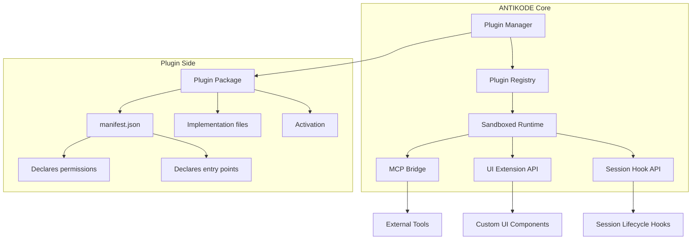
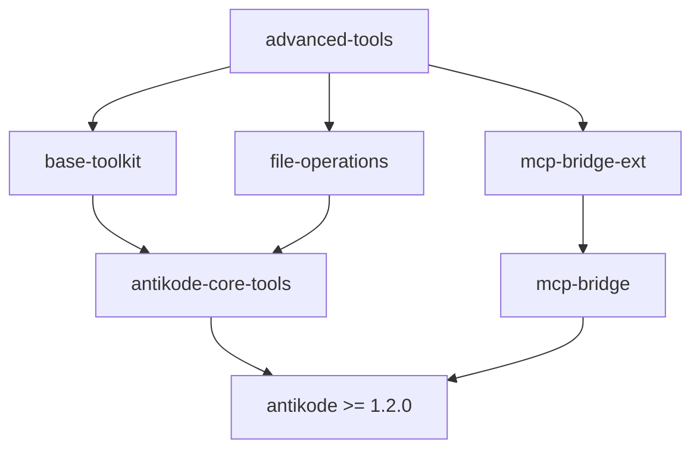
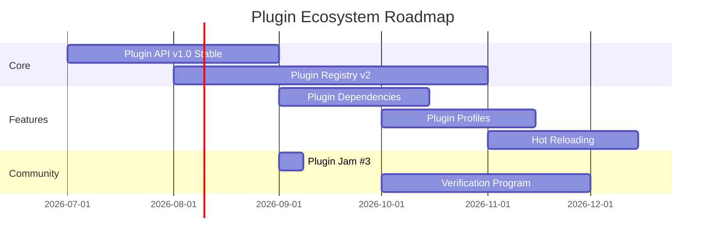

▄▄                            ██     ▄▄   ▄▄▄                  ▄▄           
████                ██         ▀▀     ██  ██▀                   ██           
████    ██▄████▄  ███████    ████     ██▄██      ▄████▄    ▄███▄██   ▄████▄  
██  ██   ██▀   ██    ██         ██     █████     ██▀  ▀██  ██▀  ▀██  ██▄▄▄▄██ 
██████   ██    ██    ██         ██     ██  ██▄   ██    ██  ██    ██  ██▀▀▀▀▀▀ 
▄██  ██▄  ██    ██    ██▄▄▄   ▄▄▄██▄▄▄  ██   ██▄  ▀██▄▄██▀  ▀██▄▄███  ▀██▄▄▄▄█ 
▀▀    ▀▀  ▀▀    ▀▀     ▀▀▀▀   ▀▀▀▀▀▀▀▀  ▀▀    ▀▀    ▀▀▀▀      ▀▀▀ ▀▀    ▀▀▀▀▀ 

ANTIKODE — terminal-native AI coding engine
Lois-Kleinner and 0-1.gg 2026 Copyright

# 03 — Community Plugin Ecosystem

ANTIKODE's plugin system allows the community to extend functionality without modifying the core codebase. Plugins can add new tools, modify the terminal UI, integrate additional LLM providers, and create entirely new agent behaviors. This document explains how plugins work, how to use community plugins, and how to create and publish your own.

## 3.1 Plugin System Architecture



### 3.1.1 Architecture Overview

The plugin system has three layers:

1. **Plugin Manager** — Discovers, validates, and loads plugins from configured directories. Manages dependencies and versioning.
2. **Sandboxed Runtime** — Each plugin runs in a restricted environment with declared permissions. The runtime enforces security boundaries between plugins and the core.
3. **API Bridges** — Plugins interact with ANTIKODE through well-defined APIs:
   - MCP Bridge: Tool registration and invocation via Model Context Protocol
   - UI Extension API: Custom terminal UI components and themes
   - Session Hook API: Lifecycle hooks for session events

### 3.1.2 Plugin Runtime Security

| Security Feature | Description |
|-----------------|-------------|
| Sandboxing | Plugins run in isolated contexts with no filesystem access by default |
| Permission Model | Plugins must declare required permissions in manifest.json |
| Capability Masking | Permissions can be denied or restricted by the user at load time |
| Resource Limits | CPU time, memory, and API call frequency limits enforced |
| Audit Logging | All plugin actions are recorded in the session ledger |
| Cryptographic Verification | Plugin packages can be signed for authenticity |

## 3.2 Finding Community Plugins

### 3.2.1 Plugin Registry

The official plugin registry is at plugins.antikode.dev. Browse, search, and discover plugins:

```bash
# Search for plugins from the CLI
antikode plugin search "code review"
antikode plugin search --category tools
antikode plugin search --author "community-member"

# List trending plugins
antikode plugin trending
antikode plugin trending --period week

# Get plugin details
antikode plugin info antikode-code-review
```

### 3.2.2 Plugin Categories

| Category | Description | Examples |
|----------|-------------|----------|
| Tools | Custom MCP tools for specific tasks | code-review, docker-manager, db-query |
| Themes | Custom terminal UI color schemes and layouts | catppuccin, dracula, nord |
| Providers | Additional LLM provider adapters | openai-adapter, anthropic-adapter |
| Agents | Specialized agent behaviors | debug-agent, refactor-agent, doc-agent |
| Hooks | Session lifecycle modifications | auto-tagger, metrics-collector |
| Integrations | External service integrations | jira-connector, slack-notifier |

### 3.2.3 Plugin Quality Signals

When evaluating community plugins, check:

- **Downloads**: Higher download counts indicate community trust
- **Version**: Stable releases (v1.0+) are preferred over pre-release
- **Verified**: Plugins verified by the core team have a verified badge
- **Open Source**: Plugin source code should be publicly available
- **Documentation**: Well-documented plugins include usage examples
- **Tests**: Plugins with test suites are more reliable
- **Maintenance**: Recent updates indicate active maintenance

## 3.3 Installing Community Plugins

### 3.3.1 Basic Installation

```bash
# Install from the registry
antikode plugin install code-review
antikode plugin install docker-manager@1.2.3

# Install from a local directory
antikode plugin install --path ./my-plugin/

# Install from a URL
antikode plugin install --url https://github.com/user/antikode-plugin

# Install from a Git repository
antikode plugin install --git https://github.com/user/antikode-plugin.git --branch main
```

### 3.3.2 Managing Plugins

```bash
# List installed plugins
antikode plugin list
antikode plugin list --enabled
antikode plugin list --disabled

# Enable / disable plugins
antikode plugin enable code-review
antikode plugin disable code-review

# Update a plugin
antikode plugin update code-review

# Update all plugins
antikode plugin update --all

# Remove a plugin
antikode plugin remove code-review
```

### 3.3.3 Plugin Dependencies

Some plugins depend on other plugins. The plugin manager handles dependency resolution automatically:

```bash
# Install with dependencies
antikode plugin install advanced-tools
# Output: Installed advanced-tools v2.1.0 + 3 dependencies

# View dependency tree
antikode plugin deps advanced-tools
```



### 3.3.4 Permission Prompts

When installing a plugin that requires permissions, you will see a prompt:

```
Plugin "code-review" requires the following permissions:
  [x] Read files in workspace
  [ ] Write files in workspace  
  [ ] Execute shell commands
  [x] Network access to github.com
  [x] Access to session ledger

Allow these permissions? (y/N/details) 
```

You can pre-approve or deny permissions:

```bash
antikode plugin install code-review --allow-read --deny-write
antikode plugin install code-review --permissions-file ./perms.json
```

## 3.4 Configuring Plugins

### 3.4.1 Plugin Configuration File

Plugins are configured in `antikode.json` under the `plugins` key:

```json
{
  "plugins": {
    "code-review": {
      "enabled": true,
      "config": {
        "reviewStyle": "conservative",
        "maxComments": 10,
        "autoApprovePatterns": ["*.test.ts", "*.spec.ts"],
        "ignoredPatterns": ["*.generated.ts", "dist/**"],
        "severity": ["error", "warning", "suggestion"]
      }
    },
    "docker-manager": {
      "enabled": true,
      "config": {
        "defaultRegistry": "docker.io",
        "composeFile": "./docker-compose.yml"
      }
    }
  }
}
```

### 3.4.2 Runtime Configuration

Some plugins support runtime configuration via the CLI:

```bash
antikode plugin config code-review --set reviewStyle=aggressive
antikode plugin config code-review --get maxComments
antikode plugin config code-review --reset
```

### 3.4.3 Interactive Configuration

Plugins can export an interactive configuration wizard:

```bash
antikode plugin configure code-review
```

This launches a TUI wizard that guides through available options.

## 3.5 Using Plugin Features

### 3.5.1 Tool Plugins

Plugins that register MCP tools make them available to agents:

```bash
# Available tools include those from plugins
antikode tools list
# Output: built-in/files_read, built-in/bash, code-review/review, docker/ps, docker/compose

# Use a plugin tool in an agent session
/agent "Run code review on src/index.ts"
# Agent can now use code-review/review tool
```

### 3.5.2 Theme Plugins

Theme plugins modify the terminal UI appearance:

```bash
# List available themes
antikode theme list
# Output: default, catppuccin-mocha, dracula, nord, solarized-dark

# Apply a theme
antikode theme set catppuccin-mocha

# Preview a theme
antikode theme preview nord

# Create a custom theme from a base
antikode theme create my-theme --base default
```

Custom themes can also be created without a plugin by editing the theme file.

### 3.5.3 Provider Plugins

Provider plugins add LLM backend support:

```bash
# List available providers
antikode provider list
# Output: llamafile (built-in), openai, anthropic, ollama, custom-provider

# Use a community provider
antikode --provider openai --model gpt-4o
antikode --provider anthropic --model claude-sonnet-4-20250514
```

### 3.5.4 Agent Plugins

Agent plugins add specialized agent behaviors:

```bash
# List available agent types
antikode agent list
# Output: default, debug-agent, refactor-agent, doc-agent, test-agent

# Use a specialized agent
/agent debug-agent "Why is this test failing?"
```

## 3.6 Creating Community Plugins

### 3.6.1 Plugin Manifest

Every plugin requires a `manifest.json`:

```json
{
  "name": "antikode-code-review",
  "version": "1.2.3",
  "description": "Automated code review tool for ANTIKODE",
  "author": "Your Name",
  "license": "MIT",
  "repository": "https://github.com/yourname/antikode-code-review",
  "antikode": {
    "minVersion": "1.2.0",
    "maxVersion": "2.0.0"
  },
  "permissions": [
    "fs.read",
    "network:github.com"
  ],
  "entryPoints": {
    "tools": "./src/tools.js",
    "ui": "./src/ui.js"
  },
  "categories": ["tools"],
  "keywords": ["code-review", "linting", "quality"]
}
```

### 3.6.2 Plugin Entry Points

| Entry Point | Description | Module Exports |
|-------------|-------------|----------------|
| tools | Register MCP tools | `{ tools: ToolDefinition[], activate: function }` |
| ui | Register UI components | `{ components: UIComponent[], theme: ThemeDefinition }` |
| providers | Register LLM providers | `{ providers: ProviderDefinition[] }` |
| agents | Register agent types | `{ agents: AgentDefinition[] }` |
| hooks | Register session hooks | `{ hooks: HookDefinition[] }` |
| config | Configuration schema | `{ schema: JSONSchema, defaults: object }` |

### 3.6.3 Tool Plugin Example

```javascript
// src/tools.js
export const tools = [
  {
    name: "code-review/review",
    description: "Review a file for code quality issues",
    parameters: {
      type: "object",
      properties: {
        filePath: { type: "string", description: "Path to the file to review" },
        severity: { type: "string", enum: ["all", "error", "warning"] }
      },
      required: ["filePath"]
    },
    execute: async ({ filePath, severity }, context) => {
      // Implementation
      return {
        result: "success",
        issues: [{ line: 42, severity: "warning", message: "..." }]
      };
    }
  }
];
```

### 3.6.4 UI Theme Plugin Example

```javascript
// src/theme.js
export const theme = {
  name: "catppuccin-mocha",
  extends: "default",
  colors: {
    background: "#1e1e2e",
    foreground: "#cdd6f4",
    primary: "#89b4fa",
    secondary: "#a6e3a1",
    error: "#f38ba8",
    warning: "#fab387",
    success: "#a6e3a1",
    muted: "#6c7086",
    border: "#45475a",
    selection: "#585b70"
  },
  fonts: {
    normal: "JetBrains Mono",
    bold: "JetBrains Mono Bold",
    italic: "JetBrains Mono Italic"
  },
  spacing: {
    padding: 1,
    margin: 1,
    borderRadius: 0
  }
};
```

### 3.6.5 Session Hook Plugin Example

```javascript
// src/hooks.js
export const hooks = {
  onSessionStart: async (session) => {
    console.log(`Session started: ${session.id}`);
  },
  onEntryCreated: async (entry, session) => {
    if (entry.type === "error") {
      await notifyMetricsServer(entry);
    }
  },
  onSessionEnd: async (session) => {
    console.log(`Session ended: ${session.id}`);
  }
};
```

### 3.6.6 Plugin Testing

```bash
# Test plugin in development mode
antikode plugin dev --path ./my-plugin

# Run plugin tests
cd my-plugin && antikode plugin test

# Validate plugin manifest
antikode plugin validate ./my-plugin

# Check for compatibility issues
antikode plugin check ./my-plugin
```

## 3.7 Publishing Plugins

### 3.7.1 Publishing to the Registry

```bash
# Package the plugin
antikode plugin pack ./my-plugin --output ./dist/

# Publish to the registry
antikode plugin publish ./dist/antikode-code-review-1.2.3.akp

# Update an existing plugin
antikode plugin publish ./dist/antikode-code-review-1.3.0.akp --update

# Unpublish (only within 24 hours of publishing)
antikode plugin unpublish antikode-code-review@1.2.3
```

### 3.7.2 Plugin Package Format

Plugins are distributed as `.akp` files (ANTIKODE Plugin Package):

```
antikode-code-review-1.2.3.akp/
├── manifest.json
├── package.json
├── README.md
├── LICENSE
├── src/
│   ├── tools.js
│   └── ui.js
├── assets/
│   └── icon.png
└── dist/
    └── bundle.js
```

### 3.7.3 Versioning

ANTIKODE plugins follow Semantic Versioning (SemVer 2.0):

| Version Change | When |
|----------------|------|
| Major (1.x → 2.x) | Breaking API changes, permission changes |
| Minor (1.1 → 1.2) | New features, new tools, backward compatible |
| Patch (1.1.0 → 1.1.1) | Bug fixes, performance improvements |

### 3.7.4 Verified Plugin Status

To get verified status, plugins must:

1. Be open source under an approved license
2. Pass the plugin validation suite
3. Have a security review by the core team
4. Include tests with >80% coverage
5. Have documentation in the standard format
6. Be maintained (updated within the last 6 months)

## 3.8 Plugin Security Best Practices

### 3.8.1 For Plugin Users

- Review permissions before installing
- Prefer verified plugins
- Keep plugins updated
- Audit plugin behavior in session ledgers
- Use `antikode plugin audit` for security reports
- Run untrusted plugins in isolated sessions

```bash
# Audit plugin permissions
antikode plugin audit antikode-code-review

# Run a session with plugin monitoring
antikode --plugin-monitor --session fresh
```

### 3.8.2 For Plugin Developers

- Request minimum necessary permissions
- Never hardcode credentials in plugins
- Use the permissions API for runtime auth
- Sanitize all inputs from tools
- Log all sensitive operations
- Use environment variables for configuration
- Follow least-privilege principle

### 3.8.3 Permission Reference

| Permission | Description | Risk Level |
|------------|-------------|------------|
| `fs.read` | Read files in workspace | Low |
| `fs.write` | Write files in workspace | Medium |
| `fs.delete` | Delete files in workspace | High |
| `shell.exec` | Execute arbitrary shell commands | High |
| `network.all` | Unrestricted network access | High |
| `network:<host>` | Network access to specific hosts | Medium |
| `session.read` | Read session ledger data | Low |
| `session.write` | Write session ledger entries | Medium |
| `env.read` | Read environment variables | Medium |
| `ui.override` | Override UI components | Low |

## 3.9 Community Plugin Showcase

### 3.9.1 Featured Plugins

| Plugin | Category | Description | Downloads |
|--------|----------|-------------|-----------|
| Code Review | Tools | AI-powered code review with pattern detection | 12,000+ |
| Docker Manager | Tools | Docker container and compose management | 8,500+ |
| DB Query | Tools | SQL database querying and schema exploration | 6,200+ |
| Catppuccin | Themes | Catppuccin Mocha, Latte, Frappé themes | 15,000+ |
| Debug Agent | Agents | Specialized debugging agent with step-through | 5,100+ |
| Jira Connector | Integrations | Jira issue management from the terminal | 3,400+ |
| Metrics Collector | Hooks | Session metrics aggregation and reporting | 2,800+ |
| OpenAI Provider | Providers | OpenAI API integration | 9,000+ |

### 3.9.2 Plugin of the Month

Each month, the community votes on the featured plugin. Nominate plugins in the #plugin-showcase channel.

## 3.10 Plugin Development Resources

### 3.10.1 SDK and Templates

```bash
# Scaffold a new plugin
antikode plugin create my-plugin --template tools
antikode plugin create my-theme --template theme

# Available templates
antikode plugin list-templates
# Output: tools, theme, provider, agent, hooks, hybrid
```

### 3.10.2 API Documentation

Full API documentation is available:

- Plugin API Reference: docs.antikode.dev/plugins/api
- MCP Integration Guide: docs.antikode.dev/plugins/mcp
- UI Component Reference: docs.antikode.dev/plugins/ui
- Session Hooks Reference: docs.antikode.dev/plugins/hooks

### 3.10.3 Plugin Testing Framework

```bash
# Run plugin tests
antikode plugin test ./my-plugin

# Test with specific ANTIKODE version
antikode plugin test ./my-plugin --antikode-version 1.2.0

# Generate coverage report
antikode plugin test ./my-plugin --coverage

# Integration test
antikode plugin test ./my-plugin --integration
```

### 3.10.4 Community Support for Developers

- #plugin-dev channel on Matrix
- Plugin Developer Office Hours (bi-weekly)
- Plugin Jam competitions with prizes
- Peer review program for new plugins

## 3.11 Plugin Ecosystem Roadmap



## 3.12 Troubleshooting Plugins

### 3.12.1 Plugin Won't Install

```bash
# Check compatibility
antikode plugin check ./my-plugin

# View installation logs
antikode plugin install code-review --verbose

# Common fixes
antikode plugin install code-review --force
antikode plugin install code-review --ignore-dependencies
```

### 3.12.2 Plugin Causing Errors

```bash
# Disable the plugin
antikode plugin disable code-review

# Run session without plugins
antikode --no-plugins

# Get diagnostic info
antikode plugin diagnose code-review

# Reset plugin configuration
antikode plugin config code-review --reset
```

### 3.12.3 Plugin Not Loading

| Symptom | Likely Cause | Solution |
|---------|--------------|----------|
| Plugin not in list | Not installed or disabled | Check with `antikode plugin list --all` |
| Manifest errors | Invalid manifest.json | Run `antikode plugin validate` |
| Version mismatch | Incompatible ANTIKODE version | Update ANTIKODE or use older plugin version |
| Missing dependencies | Dependencies not installed | Run `antikode plugin install --deps` |
| Permission denied | Required permission not granted | Reinstall with `--allow-permissions` |
| Runtime error | Bug in plugin | Check plugin logs in `~/.antikode/logs/plugins/` |

### 3.12.4 Performance Issues

```bash
# Profile plugin performance
antikode plugin profile code-review

# Set resource limits per plugin
antikode plugin config code-review --set maxCpu=50% --set maxMemory=256MB

# Disable unused plugins
antikode plugin disable unused-plugin
```

## 3.13 Uninstalling and Cleaning Up

```bash
# Remove plugin and its configuration
antikode plugin remove code-review

# Remove plugin but keep configuration
antikode plugin remove code-review --keep-config

# Clean up orphaned plugin data
antikode plugin cleanup

# List plugins with leftover data
antikode plugin list --orphaned
```

## 3.14 Enterprise Plugin Management

For enterprise deployments, plugins can be centrally managed:

```json
{
  "plugins": {
    "allowInstall": false,
    "allowList": ["code-review", "docker-manager"],
    "blockList": [],
    "requireVerification": true,
    "autoUpdate": true,
    "auditLogPath": "/var/log/antikode/plugins.log"
  }
}
```

```bash
# Enterprise plugin policy
antikode plugin policy set --allow-list code-review,docker-manager
antikode plugin policy set --require-signing true
antikode plugin policy export --output policy.json
antikode plugin policy import --input policy.json
```

## 3.15 Conclusion

The plugin ecosystem empowers the ANTIKODE community to extend, customize, and enhance the platform. Whether you're using existing plugins, contributing improvements, or creating something entirely new, plugins provide a safe, well-defined path for innovation.

Remember the three principles of plugin development:

1. **Security first** — Request only needed permissions, never trust user input
2. **Good documentation** — Every plugin needs a clear README and usage examples
3. **Community engagement** — Share your plugin, respond to issues, accept contributions

For community best practices around using plugins effectively, see `04-best-practices.md`. For the complete plugin API reference, visit docs.antikode.dev/plugins/api.
