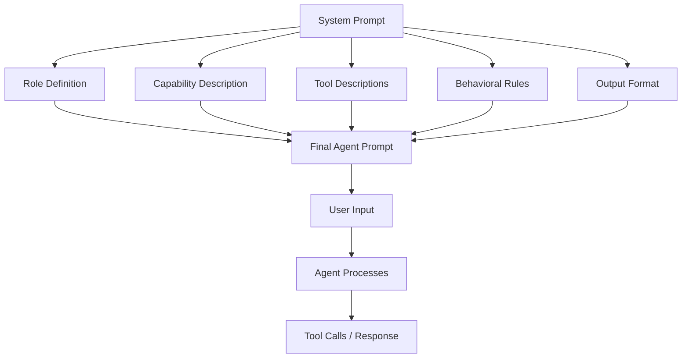
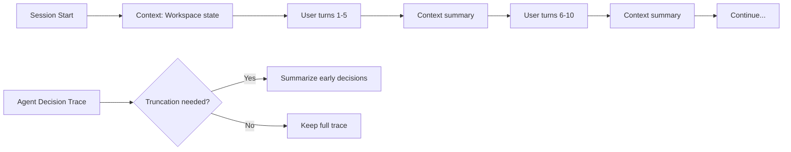
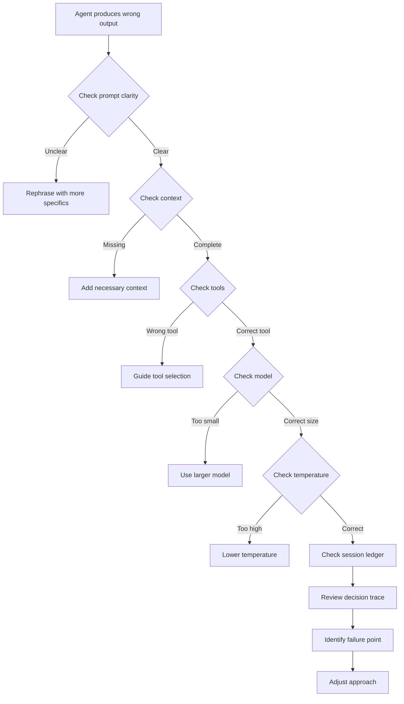
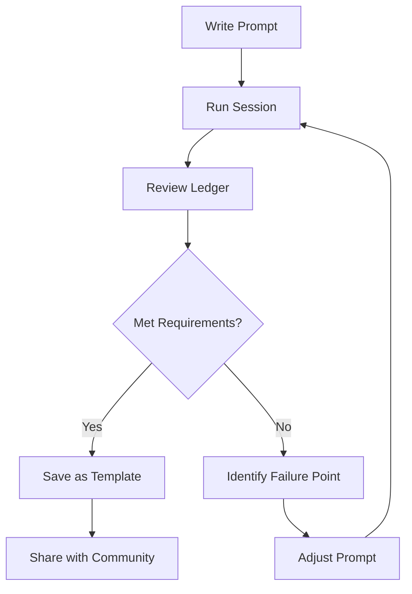

▄▄                            ██     ▄▄   ▄▄▄                  ▄▄           
████                ██         ▀▀     ██  ██▀                   ██           
████    ██▄████▄  ███████    ████     ██▄██      ▄████▄    ▄███▄██   ▄████▄  
██  ██   ██▀   ██    ██         ██     █████     ██▀  ▀██  ██▀  ▀██  ██▄▄▄▄██ 
██████   ██    ██    ██         ██     ██  ██▄   ██    ██  ██    ██  ██▀▀▀▀▀▀ 
▄██  ██▄  ██    ██    ██▄▄▄   ▄▄▄██▄▄▄  ██   ██▄  ▀██▄▄██▀  ▀██▄▄███  ▀██▄▄▄▄█ 
▀▀    ▀▀  ▀▀    ▀▀     ▀▀▀▀   ▀▀▀▀▀▀▀▀  ▀▀    ▀▀    ▀▀▀▀      ▀▀▀ ▀▀    ▀▀▀▀▀ 

ANTIKODE — terminal-native AI coding engine
Lois-Kleinner and 0-1.gg 2026 Copyright

# 04 — Community Best Practices for Prompt Engineering

Prompt engineering is both art and science. In ANTIKODE, prompts are not just text — they are structured interactions with an agent that has access to tools, session context, and decision-making capabilities. This document collects community-vetted best practices for getting the most out of ANTIKODE's AI agents.

## 4.1 The ANTIKODE Prompting Model

ANTIKODE agents differ from chat-based LLMs in several important ways:

| Aspect | Chat LLM | ANTIKODE Agent |
|--------|----------|----------------|
| Interaction | Single-turn Q&A | Multi-turn with tool access |
| Context | Conversation history | Session ledger + workspace state |
| Actions | Text generation | Text + tool calls + decisions |
| Memory | Limited context window | Persistent session with checkpoints |
| Feedback | User rates output | User approves/rejects actions |
| Transparency | Black box | Full decision trace in .aioss |

### 4.1.1 Agent System Prompt Architecture



## 4.2 Prompt Structure Guidelines

### 4.2.1 The CARE Framework

Community consensus recommends the CARE framework for structuring prompts:

**C** — Context: Provide background and environment state
**A** — Action: Specify what you want done
**R** — Requirements: List constraints and quality criteria
**E** — Example: Show expected output format (optional)

```
C: I'm working on a React component that renders a data table.
   The component is in src/components/DataTable.tsx.
   It currently accepts an array of objects and renders rows.
   The project uses TypeScript with strict mode.

A: Add sortable columns to the DataTable component.
   Clicking a column header should sort by that column.
   Clicking again should reverse the sort order.
   Show a visual indicator for the current sort column and direction.

R: - Use React useState for sort state
   - Support all data types (string, number, date, boolean)
   - String sorting should be locale-aware
   - Performance: handle 10,000+ rows without lag
   - TypeScript strict mode compliant
   - Add unit tests for each sorting scenario

E: The sorted table should display like:
   Name ▲ | Age | Date Joined ▼
   Alice  | 30  | 2024-01-15
   Bob    | 25  | 2023-06-20
```

### 4.2.2 Length and Specificity

- **Be specific**: "Create a React hook that debounces API calls" beats "Improve performance"
- **Be concise**: Essential information only. Extra context adds noise.
- **Be complete**: Include all requirements upfront. Changing requirements mid-conversation confuses agents.
- **Use examples**: One example is worth ten sentences of description.
- **Prefer positive instructions**: "Do X" rather than "Don't do Y"

### 4.2.3 Avoiding Ambiguity

| Ambiguous | Specific |
|-----------|----------|
| "Make it look better" | "Use the primary color (#4A90D9) for headings, add 16px padding, use system font stack" |
| "Fix the bug" | "When user submits empty form, show validation error 'Name is required' below the name field" |
| "Optimize performance" | "Reduce render time: memoize the filtered list, virtualize rows, debounce search input by 300ms" |
| "Add error handling" | "Wrap API call in try/catch, show error toast with message from server, log to console in dev mode" |

## 4.3 Tool Usage Best Practices

### 4.3.1 Implicit vs. Explicit Tool Guidance

You can let the agent decide which tools to use, or guide it explicitly:

```
# Implicit — agent chooses tools
"Refactor the authentication module to use JWT"

# Explicit — you specify tools
"Use files_read to read src/auth/*.ts, then use files_write to create src/auth/jwt.ts with JWT implementation"
```

### 4.3.2 Tool Selection Guidance

Guide the agent on tool choice:

```
"Read the current test files first, then suggest improvements"
"Before making changes, run the existing tests to understand the current state"
"After each change, run the linter and fix any issues"
```

### 4.3.3 Batch Operations

For batch operations, guide the agent on order and grouping:

```
"First, create a branch 'feature/add-search'. Then:
1. Create src/hooks/useSearch.ts with debounced search logic
2. Create src/components/SearchBar.tsx with input and results dropdown
3. Update src/App.tsx to include SearchBar
4. Run tests and fix any failures
5. Commit each change separately
Use conventional commit messages."
```

## 4.4 Session Management Best Practices

### 4.4.1 Starting a New Session

```bash
# Start fresh for unrelated tasks
antikode --session fresh

# Start with a specific context
antikode --session fresh --context "Refactoring payment module"

# Resume a previous session
antikode --session resume --last

# Fork a session for experimentation
antikode --session fork --from <session-id> --name "experiment"
```

### 4.4.2 Checkpointing

Use checkpoints to mark progress:

```bash
/checkpoint "Before major refactor"
/checkpoint "Unit tests passing"
/checkpoint "Integration tests passing"
# Or within a prompt:
"Save a checkpoint after each successful step"
```

### 4.4.3 Session Size Management

Long sessions degrade performance. Best practices:

- Limit sessions to 50-100 interactions
- Start fresh sessions for major new tasks
- Use checkpoints for long-running tasks
- Export and archive completed sessions

### 4.4.4 Context Window Optimization



ANTIKODE automatically manages the context window by summarizing early interactions. You can control this:

```
"Keep the full context for the last 10 interactions"
"Summarize everything before the checkpoint"
```

## 4.5 Prompt Engineering Patterns

### 4.5.1 Chain of Thought

Encourage step-by-step reasoning:

```
"Walk through your approach step by step before writing code.
1. Analyze the requirements
2. Identify the files that need changes
3. Design the solution
4. Implement each change
5. Verify correctness"

/agent "I need to add pagination to the user list. Walk through your approach."
```

### 4.5.2 Persona Assignment

Assign a specific role to focus the agent:

```
"As a security expert, review this authentication code for vulnerabilities"
"As a performance engineer, optimize this database query"
"As a senior developer, code review this PR and suggest improvements"
"As a documentation writer, create comprehensive JSDoc comments"
```

### 4.5.3 Iterative Refinement

Start broad, then refine:

```
Pass 1: "Write the basic structure of a REST API client"
Pass 2: "Add error handling for network failures and HTTP errors"
Pass 3: "Add request retry with exponential backoff"
Pass 4: "Add request cancellation support"
Pass 5: "Add TypeScript generics for typed responses"
```

### 4.5.4 Constraint Specification

Make constraints explicit:

```
"Use only the standard library, no external dependencies"
"Must work in Node.js 18 LTS and later"
"Follow the existing code style in this project"
"Maximum function length: 20 lines"
"Zero tolerance for any or unknown types"
"100% test coverage required"
```

### 4.5.5 Output Format Control

Specify the exact output format:

```
"Output the changes as a unified diff format"
"List the files to create and modify in this format:
📁 src/components/DataTable.tsx — Modify to add sorting
📁 src/components/TableHeader.tsx — Create new component
📁 src/hooks/useSort.ts — Create new hook"

"Format the response as a Markdown table"
"Provide the solution in two parts: explanation and code"
```

## 4.6 Model Selection Strategies

### 4.6.1 Model Sizing Guidelines

| Task Type | Recommended Model | Why |
|-----------|-------------------|-----|
| Simple Q&A | qwen2-vl-2b-q4 | Fast, low resource usage |
| Code generation | Qwen2.5-7B / Llama-3.2-3B | Good code quality |
| Complex reasoning | Llama-3.2-8B / Qwen2.5-14B | Better reasoning |
| Refactoring | Qwen2.5-7B | Balances quality and speed |
| Documentation | qwen2-vl-2b-q4 | Fast, adequate for prose |
| Debugging | Llama-3.2-8B | Better at finding subtle bugs |

### 4.6.2 Temperature and Sampling

```bash
# Precise, deterministic tasks (code generation)
antikode --temperature 0.1

# Creative tasks (documentation, brainstorming)
antikode --temperature 0.7

# Balanced
antikode --temperature 0.3
```

Guidelines:
- **temperature 0.0–0.2**: Code generation, factual Q&A, data transformation
- **temperature 0.3–0.5**: General problem-solving, refactoring
- **temperature 0.6–0.8**: Creative writing, brainstorming, documentation
- **temperature 0.9–1.0**: Exploration, diverse alternatives

### 4.6.3 Multi-Model Workflows

Use different models for different phases:

```bash
# Phase 1: Planning (powerful model)
antikode --model qwen2.5-14b --temperature 0.1 \
  --prompt "Design the architecture for a microservice"

# Phase 2: Implementation (balanced model)
antikode --model qwen2.5-7b --temperature 0.2 \
  --prompt "Implement the design from the previous phase"

# Phase 3: Review (fast model)
antikode --model qwen2-vl-2b-q4 --temperature 0.0 \
  --prompt "Review the implementation for bugs"
```

## 4.7 Debugging Agent Behavior

### 4.7.1 When the Agent Goes Wrong



### 4.7.2 Common Failure Modes

| Symptom | Likely Cause | Solution |
|---------|--------------|----------|
| Agent is too verbose | High temperature, no format constraint | Lower temperature, specify output format |
| Agent stops early | Context window exceeded | Start fresh session, use checkpoints |
| Agent ignores instructions | Prompt buried in context | Put instructions at the beginning and end |
| Agent uses wrong tools | Ambiguous task description | Be explicit about which tools to use |
| Agent creates incorrect code | Model too small for complexity | Use larger model, break task into smaller steps |
| Agent loops on same action | Confused by context | Clear context with fresh session |
| Agent refuses task | Safety guardrails triggered | Rephrase instruction, explain legitimate use case |
| Agent contradicts itself | Long session with degraded context | Use checkpoints, summarize context |

### 4.7.3 Prompt Debugging Checklist

When a prompt doesn't produce the expected result:

1. Is the task clearly defined? (Be specific about what "done" looks like)
2. Is the context sufficient? (Does the agent know what files exist?)
3. Are constraints explicit? (Format, style, dependencies, edge cases)
4. Is the model appropriate for the task? (Size, quantization)
5. Is the temperature appropriate? (Lower for precision)
6. Is the instruction at the right position? (Start and end of prompt)
7. Are there conflicting instructions? (Check the full prompt)
8. Does the agent have the right tools? (Check tool availability)
9. Is the session too long? (Consider a fresh session)
10. Have you checked the decision trace? (What did the agent think?)

## 4.8 Advanced Prompt Engineering

### 4.8.1 Prompt Templates

Create reusable prompt templates:

```bash
antikode prompt create code-review --template "
As a senior developer, review the following code for:
1. Security vulnerabilities
2. Performance issues
3. Code style violations
4. Missing edge case handling
5. Test coverage gaps

Code:
{{code}}
"

antikode prompt run code-review --param code "`cat src/app.ts`"
```

### 4.8.2 Dynamic Prompts with Variables

```
"Review the file {{filepath}} with focus on {{focus_area}}"
"Generate a {{test_type}} test for {{component_name}}"
"Refactor {{module_name}} to use {{pattern_name}} pattern"
```

### 4.8.3 Prompt Chaining

Chain multiple prompts together:

```bash
antikode run --steps "
1. Read all files in src/utils/
2. Summarize the current architecture
3. Suggest refactoring opportunities
4. Implement the top-priority refactoring
5. Verify the changes compile
6. Run existing tests
"
```

### 4.8.4 Few-Shot Prompting

Provide examples of desired output:

```
"Convert these Python functions to TypeScript. Follow this example:

Python:
def add(a, b):
    return a + b

TypeScript:
function add(a: number, b: number): number {
    return a + b;
}

Now convert:
Python:
def get_user(user_id):
    return db.query('SELECT * FROM users WHERE id = ?', user_id)

TypeScript:
[your response]"
```

## 4.9 Community-Proven Patterns

### 4.9.1 The Sandwich Pattern

Place the most important instruction at the beginning and end:

```
"IMPORTANT: Do not modify any configuration files.
[main instructions]
Remember: configuration files must remain unchanged."
```

### 4.9.2 The Checklist Pattern

Use checklists for complex tasks:

```
"Complete the following checklist in order:
[x] Read the requirements file
[ ] Design the database schema
[ ] Create migration files
[ ] Implement models
[ ] Create API endpoints
[ ] Write integration tests
[ ] Run full test suite
Check off each item as you complete it."
```

### 4.9.3 The Interview Pattern

Ask the agent to ask clarifying questions:

```
"Before implementing anything, ask me clarifying questions about:
- Target environment
- Performance requirements
- Security constraints
- Integration points
Once you have answers, proceed with implementation."
```

### 4.9.4 The Teaching Pattern

Ask the agent to explain as it goes:

```
"As you refactor the code, explain your reasoning for each change.
For each change, state:
1. What you changed
2. Why you changed it
3. What risks you considered
4. What alternatives you rejected and why"
```

### 4.9.5 The Guardian Pattern

Set guardrails for safety:

```
"Before any destructive operation (delete, overwrite, rename):
1. Pause and confirm with me
2. Show me the exact command
3. Wait for my approval
Do not proceed without confirmation."
```

## 4.10 Session Ledger Analysis for Prompt Improvement

### 4.10.1 Analyzing Prompt Effectiveness

```bash
# Compare prompt variants
antikode session compare --session1 prompt-v1.aioss --session2 prompt-v2.aioss

# Analyze decision quality
antikode session analyze --session session.aioss --focus decisions

# Export decision trace for review
antikode session export --session session.aioss --format json --output decisions.json
```

### 4.10.2 Iterative Prompt Improvement Cycle



### 4.10.3 Metrics to Track

| Metric | What It Measures | Target |
|--------|-----------------|--------|
| First-attempt success | Prompt produces correct output on first try | >60% |
| Tool accuracy | Agent uses correct tool for task | >90% |
| Decision efficiency | Number of agent decisions per completed task | <10 |
| User corrections | Number of times user corrects agent | <3 |
| Token efficiency | Tokens used per useful output unit | Minimize |
| Session length | Total interactions to complete task | <20 |

## 4.11 Environment-Specific Best Practices

### 4.11.1 Web Development

```
"I'm building a React app with Vite and TypeScript.
Package manager: bun
State management: Zustand
Styling: Tailwind CSS v4
API client: ky (destructive: true)
Test framework: Vitest with testing-library

[task description]"
```

### 4.11.2 Backend Development

```
"I'm building a Node.js API with Express.
Database: PostgreSQL via Drizzle ORM
Auth: JWT with HTTP-only cookies
Validation: Zod
Runtime: Bun
Testing: Vitest with supertest
Deployment: Docker + Fly.io

[task description]"
```

### 4.11.3 Data Science / Scripting

```
"Python 3.12 environment with:
- pandas 2.2
- numpy 1.26
- matplotlib 3.8
- scikit-learn 1.5
Data file: ./data/transactions.csv
Memory limit: 8GB

[task description]"
```

## 4.12 Prompt Engineering Anti-Patterns

### 4.12.1 What to Avoid

| Anti-Pattern | Why It Fails | Better Approach |
|--------------|--------------|-----------------|
| Vague instructions | Agent guesses incorrectly | Be specific about expected output |
| Multiple tasks in one prompt | Agent focuses on wrong part | Break into sequential steps |
| Negative instructions | "Don't use X" often triggers X | "Use Y instead of X" |
| Assumed knowledge | Agent doesn't know your stack | State your tech stack explicitly |
| Over-constrained | Too many rules paralyze the agent | Prioritize: must-have vs nice-to-have |
| No feedback mechanism | Agent doesn't know it's wrong | Ask agent to verify its own output |
| Emotional language | "This is urgent!" adds no information | Specify timeline: "Complete within 10 turns" |

### 4.12.2 Common Mistakes

```
# BAD: Vague
"Fix my code"  

# GOOD: Specific
"Fix the TypeScript error in src/utils/validate.ts at line 42:
Type 'string | undefined' is not assignable to type 'string'.
Add a type guard to handle the undefined case."

# BAD: Multiple tasks
"Create a login form, connect it to the API, write tests, and deploy"

# GOOD: Sequential
"Step 1: Create a login form component with email and password fields.
Step 2: [Next prompt] Connect the form to the auth API endpoint."
```

## 4.13 Collaboration Best Practices

### 4.13.1 Working with Multiple Agents

```bash
# Deploy multiple specialized agents
antikode --agent-multiplex \
  --agents "architect:qwen2.5-14b, coder:qwen2.5-7b, reviewer:qwen2-vl-2b-q4"
```

```
"Architect: Design the solution
Coder: Implement the solution  
Reviewer: Review the implementation
Each agent should work in sequence. Output the design first, then implementation."
```

### 4.13.2 Agent Handoff Protocol

```
"@architect: Complete the design document and output it.
@coder: Use the architect's design to implement the solution.
@reviewer: Review @coder's implementation against @architect's design.

Use the format:
@agent_name: message

Proceed step by step."
```

## 4.14 Prompt Library

### 4.14.1 Community Templates

| Template | Description | Usage Count |
|----------|-------------|-------------|
| code-review | Comprehensive code review | 2,500+ |
| test-generator | Generate tests with mocks | 1,800+ |
| refactor-safely | Refactor with verification steps | 1,400+ |
| api-client | Generate typed API client | 1,200+ |
| migration-gen | Generate database migrations | 900+ |
| component-generator | Generate React components | 800+ |

```bash
antikode prompt search "code review"
antikode prompt use code-review --file src/index.ts
```

## 4.15 Prompt Version Control

### 4.15.1 Saving and Versioning Prompts

```bash
# Save a prompt
antikode prompt save my-code-review --prompt "As a senior developer..."

# List saved prompts
antikode prompt list

# Version a prompt
antikode prompt save my-code-review --version 2 --prompt "[updated prompt]"

# Diff prompt versions
antikode prompt diff my-code-review --v1 1 --v2 2

# Export prompts
antikode prompt export --output prompts.json
```

## 4.16 Conclusion

Prompt engineering in ANTIKODE is an evolving practice shaped by community experience. The patterns and practices in this guide represent the collective knowledge of thousands of users. As the platform evolves and models improve, so too will the best practices.

Key takeaways:

1. **Be specific and structured** — Use the CARE framework
2. **Choose the right model** — Match model capability to task complexity
3. **Manage the session** — Use checkpoints, fresh sessions, and context summaries
4. **Leverage the ledger** — Analyze decision traces to improve prompts
5. **Share and learn** — The community grows stronger through shared experience

For real-time help with prompt engineering, join the #prompt-engineering channel on Matrix. To share your own proven patterns, submit them to the community forum with tag `prompt-pattern`.

See also:
- `01-getting-involved.md` — How to contribute to the community
- `02-sharing-sessions.md` — How to share .aioss ledgers effectively
- `docs/help/04-agent-behavior.md` — Understanding agent behavior
- `docs/no-black-boxes/03-decision-transparency.md` — How decisions are traced
