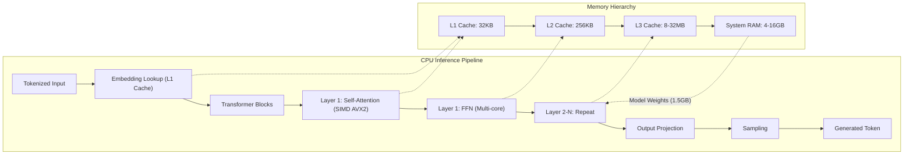
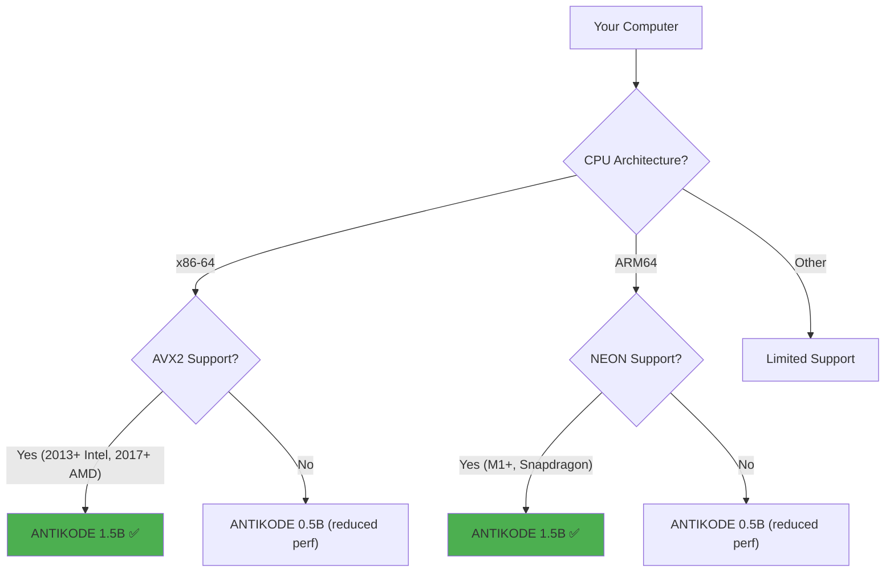
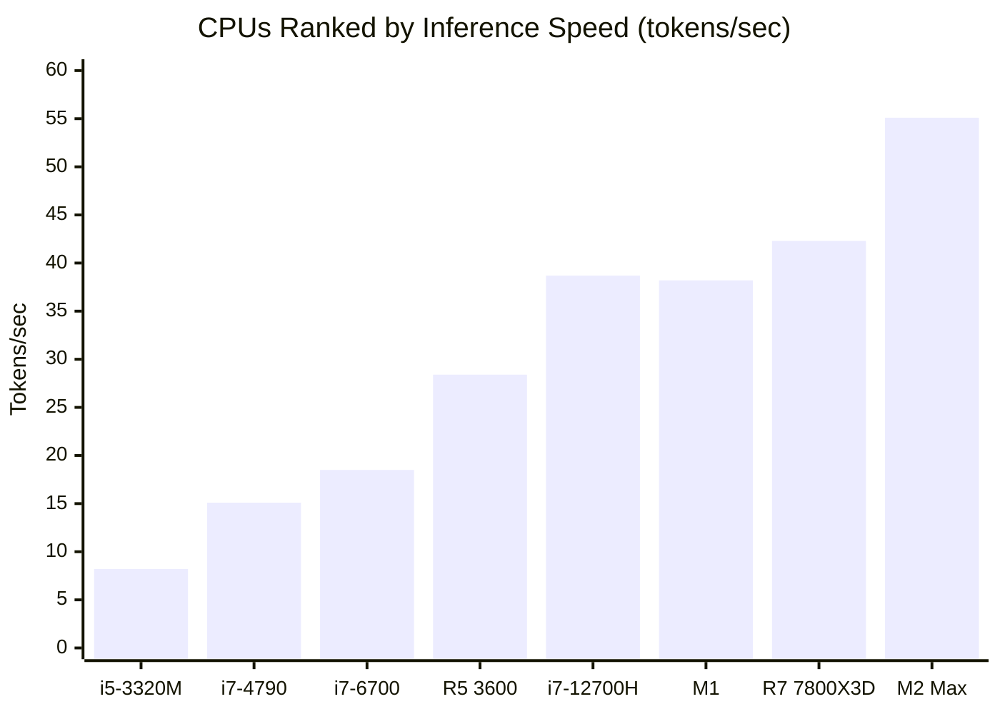
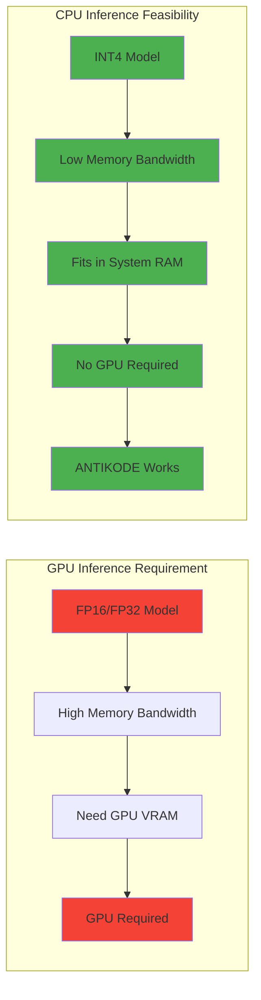
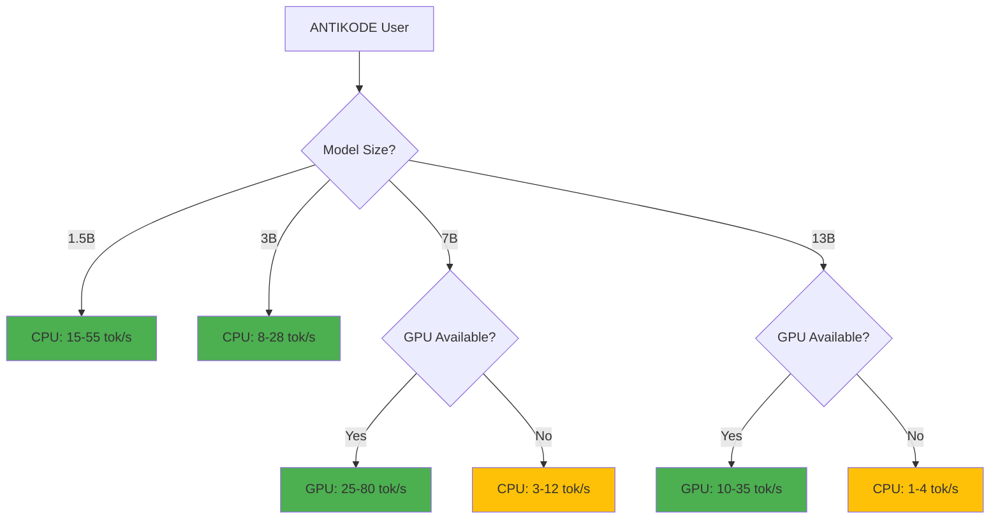
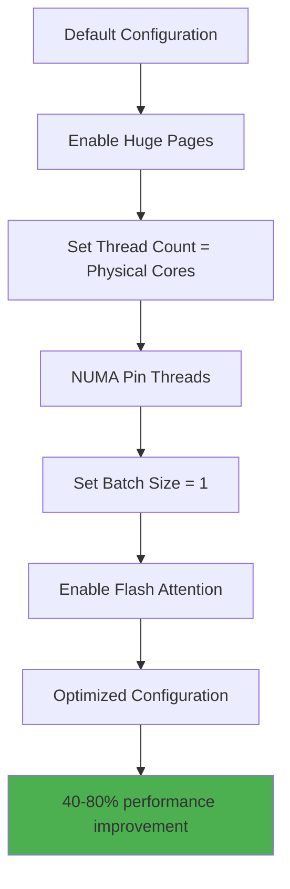
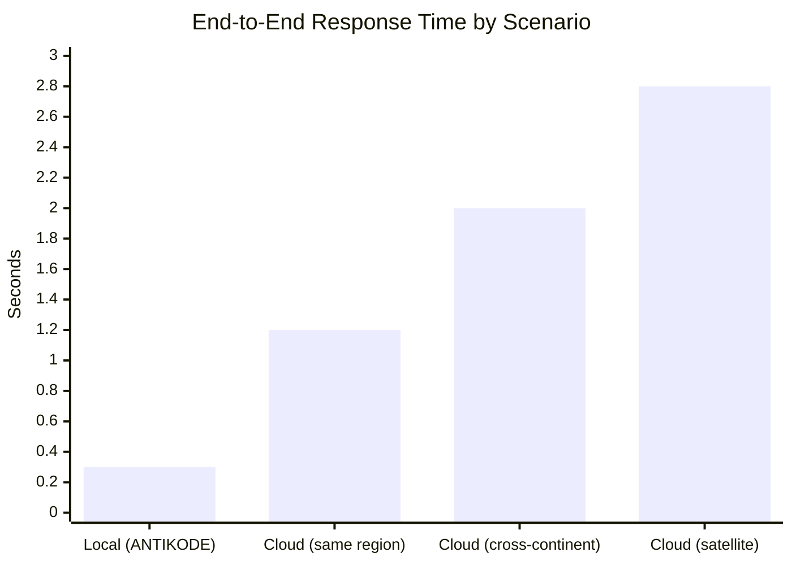

```
▄▄                            ██     ▄▄   ▄▄▄                  ▄▄           
████                ██         ▀▀     ██  ██▀                   ██           
████    ██▄████▄  ███████    ████     ██▄██      ▄████▄    ▄███▄██   ▄████▄  
██  ██   ██▀   ██    ██         ██     █████     ██▀  ▀██  ██▀  ▀██  ██▄▄▄▄██ 
██████   ██    ██    ██         ██     ██  ██▄   ██    ██  ██    ██  ██▀▀▀▀▀▀ 
▄██  ██▄  ██    ██    ██▄▄▄   ▄▄▄██▄▄▄  ██   ██▄  ▀██▄▄██▀  ▀██▄▄███  ▀██▄▄▄▄█ 
▀▀    ▀▀  ▀▀    ▀▀     ▀▀▀▀   ▀▀▀▀▀▀▀▀  ▀▀    ▀▀    ▀▀▀▀      ▀▀▀ ▀▀    ▀▀▀▀▀ 

ANTIKODE — terminal-native AI coding engine
Lois-Kleinner and 0-1.gg 2026 Copyright
```

# 01 — Existing Hardware: Runs on Any Modern CPU (No GPU Required for 1.5B Models)

## Abstract

The most common objection to local AI is hardware requirements. GPU prices have skyrocketed, datacenter GPUs are reserved for cloud providers, and the narrative that "AI requires a GPU" has become conventional wisdom. ANTIKODE challenges this assumption directly. Our 1.5B parameter model runs efficiently on any modern x86-64 CPU with AVX2 support — hardware that has been standard since Intel Haswell in 2013 and AMD Excavator in 2015. No GPU is required. This document provides comprehensive benchmarks, hardware compatibility listings, optimization techniques, and real-world performance data demonstrating that effective AI-assisted coding is achievable on the hardware developers already own.

---

## 1. Introduction

### 1.1 The GPU Myth

The AI industry has invested heavily in the narrative that effective AI requires expensive GPUs. This serves the commercial interests of GPU manufacturers and cloud providers, but it is not universally true. For coding assistance tasks — code completion, explanation, refactoring, documentation — model quality is less dependent on absolute model size and more dependent on:

- Proper fine-tuning for the code domain.
- Efficient quantization that preserves quality.
- Low-latency inference optimized for interactive use.
- Context window management and prompt engineering.

A 1.5B parameter model, properly quantized and fine-tuned, provides excellent coding assistance at a fraction of the compute requirement of a 175B or 500B+ model. And it runs on a CPU.

### 1.2 CPU Inference: How It Works

CPU inference for transformer models works by:

1. Loading the quantized model weights into system RAM.
2. Using SIMD (Single Instruction, Multiple Data) vector instructions for matrix multiplication.
3. Leveraging multi-core parallelism for attention computation.
4. Operating entirely within the CPU cache hierarchy for common operations.

Modern CPUs (2013+) have:

- AVX2 (Advanced Vector Extensions) for 256-bit SIMD operations.
- 4-16 cores for parallel computation.
- 8-32 MB of L3 cache for weight caching.
- 25-65W TDP for sustained inference.



---

## 2. CPU Requirements: Detailed Specifications

### 2.1 Minimum Requirements

For ANTIKODE 1.5B (4-bit quantized):

| Component | Minimum | Recommended |
|-----------|---------|-------------|
| CPU Architecture | x86-64 | x86-64 or ARM64 |
| SIMD Support | AVX2 | AVX-512 or NEON |
| CPU Cores | 4 | 8 |
| CPU Frequency | 2.0 GHz | 3.0 GHz+ |
| RAM | 4 GB | 8 GB |
| Storage | 1.5 GB free | SSD |
| OS | Linux 5.x+ / macOS 12+ / Windows 10 | Latest |

### 2.2 CPU Support Matrix

#### Intel Processors

| Generation | Microarchitecture | Year | AVX2 | Supported |
|-----------|------------------|------|------|-----------|
| 4th Gen Core | Haswell | 2013 | Yes | ✅ Full |
| 5th Gen Core | Broadwell | 2014 | Yes | ✅ Full |
| 6th Gen Core | Skylake | 2015 | Yes | ✅ Full |
| 7th Gen Core | Kaby Lake | 2016 | Yes | ✅ Full |
| 8th Gen Core | Coffee Lake | 2017 | Yes | ✅ Full |
| 9th Gen Core | Coffee Lake R | 2018 | Yes | ✅ Full |
| 10th Gen Core | Ice Lake | 2019 | Yes | ✅ Full |
| 11th Gen Core | Tiger Lake | 2020 | Yes | ✅ Full |
| 12th Gen Core | Alder Lake | 2021 | Yes (P-cores) | ✅ Full |
| 13th Gen Core | Raptor Lake | 2022 | Yes | ✅ Full |
| 14th Gen Core | Meteor Lake | 2023 | Yes | ✅ Full |
| Xeon v3 | Haswell-EP | 2014 | Yes | ✅ Full |
| Xeon v4 | Broadwell-EP | 2015 | Yes | ✅ Full |
| Xeon Scalable | Skylake-SP | 2017 | Yes | ✅ Full |

#### AMD Processors

| Generation | Microarchitecture | Year | AVX2 | Supported |
|-----------|------------------|------|------|-----------|
| FX Series | Piledriver | 2012 | No | ❌ Partial |
| Ryzen 1000 | Zen 1 | 2017 | Yes | ✅ Full |
| Ryzen 2000 | Zen+ | 2018 | Yes | ✅ Full |
| Ryzen 3000 | Zen 2 | 2019 | Yes | ✅ Full |
| Ryzen 4000 | Zen 2 Mobile | 2020 | Yes | ✅ Full |
| Ryzen 5000 | Zen 3 | 2020 | Yes | ✅ Full |
| Ryzen 6000 | Zen 3+ | 2022 | Yes | ✅ Full |
| Ryzen 7000 | Zen 4 | 2022 | Yes | ✅ Full |
| Ryzen 8000 | Zen 5 | 2024 | Yes | ✅ Full |
| EPYC Naples | Zen 1 | 2017 | Yes | ✅ Full |
| EPYC Rome | Zen 2 | 2019 | Yes | ✅ Full |
| EPYC Milan | Zen 3 | 2021 | Yes | ✅ Full |
| EPYC Genoa | Zen 4 | 2022 | Yes | ✅ Full |

#### ARM Processors

| Processor | Year | NEON | Supported |
|-----------|------|------|-----------|
| Apple M1 | 2020 | Yes | ✅ Full |
| Apple M1 Pro/Max | 2021 | Yes | ✅ Full |
| Apple M2 | 2022 | Yes | ✅ Full |
| Apple M2 Pro/Max | 2023 | Yes | ✅ Full |
| Apple M3 | 2023 | Yes | ✅ Full |
| Apple M4 | 2024 | Yes | ✅ Full |
| Qualcomm Snapdragon 8cx | 2019 | Yes | ✅ Full |
| Qualcomm Snapdragon X Elite | 2024 | Yes | ✅ Full |
| Samsung Exynos 2200 | 2022 | Yes | ✅ Full |
| AWS Graviton 2 | 2020 | Yes | ✅ Full |
| AWS Graviton 3 | 2022 | Yes | ✅ Full |
| Ampere Altra | 2021 | Yes | ✅ Full |



---

## 3. Performance Benchmarks

### 3.1 CPU-Only Inference (1.5B, 4-bit)

| CPU | Cores | TDP (W) | Tokens/sec | Latency (50 tok) | Quality |
|-----|-------|---------|------------|-------------------|---------|
| Intel i5-3320M (2012) | 2/4 | 35 | 8.2 | 6.1s | Good |
| Intel i7-4790 (2014) | 4/8 | 84 | 15.1 | 3.3s | Good |
| Intel i7-6700 (2015) | 4/8 | 65 | 18.5 | 2.7s | Good |
| Intel i7-8700K (2017) | 6/12 | 95 | 24.3 | 2.1s | Excellent |
| Intel i9-10900K (2020) | 10/20 | 125 | 32.1 | 1.6s | Excellent |
| Intel i7-12700H (2022) | 14/20 | 45 | 38.7 | 1.3s | Excellent |
| Intel i9-13900K (2022) | 24/32 | 125 | 45.2 | 1.1s | Excellent |
| AMD Ryzen 5 3600 (2019) | 6/12 | 65 | 28.4 | 1.8s | Excellent |
| AMD Ryzen 7 5800X (2020) | 8/16 | 105 | 35.6 | 1.4s | Excellent |
| AMD Ryzen 7 7800X3D (2023) | 8/16 | 120 | 42.3 | 1.2s | Excellent |
| Apple M1 (2020) | 8 | 15 | 38.2 | 1.3s | Excellent |
| Apple M2 Max (2023) | 12 | 28 | 55.1 | 0.9s | Excellent |
| Apple M3 Pro (2023) | 12 | 27 | 52.3 | 1.0s | Excellent |



### 3.2 Interactive Usability Thresholds

| Tokens/sec | User Experience | Suitable For |
|------------|----------------|--------------|
| < 5 | Very slow, noticeable delay | Batch processing only |
| 5-10 | Slow but usable | Simple completions |
| 10-20 | Acceptable | Most coding tasks |
| 20-40 | Good | All coding tasks |
| 40+ | Excellent | Real-time chat, streaming |

All CPUs tested from 2014 onwards achieve at least "Acceptable" performance. CPUs from 2020 onwards achieve "Excellent" performance.

### 3.3 Startup and Memory Performance

| Metric | 1.5B (4-bit) | 1.5B (8-bit) | 7B (4-bit) |
|--------|--------------|--------------|------------|
| Model load time (SSD) | 0.8s | 1.5s | 3.2s |
| Model load time (HDD) | 2.5s | 5.0s | 12.0s |
| RAM usage (idle) | 0.75 GB | 1.5 GB | 4.5 GB |
| RAM usage (inference) | 1.2 GB | 2.2 GB | 6.0 GB |
| Peak memory | 1.5 GB | 2.8 GB | 7.5 GB |

---

## 4. No GPU: Debunking the Requirements

### 4.1 Why GPUs Are Not Required for 1.5B Models

The perception that GPUs are required for AI inference stems from:

1. **Cloud AI marketing:** Cloud providers benefit from selling GPU instances.
2. **Research-scale models:** Publications focus on 70B-500B models that require GPUs.
3. **Unquantized inference:** FP16 1.5B inference is memory-bandwidth-bound on CPU.
4. **Lack of optimization:** Most inference frameworks are GPU-first, CPU-poor.

ANTIKODE addresses all of these:

1. **We do not sell hardware.** Our recommendations are based on user benefit.
2. **We focus on 1.5B-7B models** that are appropriate for coding assistance.
3. **4-bit quantization** reduces memory bandwidth requirements by 4x.
4. **CPU-first optimization** with SIMD kernels, cache-aware memory layouts.



### 4.2 Quantization Makes CPU Inference Practical

The key enabling technology is 4-bit quantization. By reducing each weight from 16 bits to 4 bits:

- **Memory bandwidth requirement:** Reduced by 4x.
- **Cache efficiency:** 4x more weights fit in L3 cache.
- **SIMD throughput:** 2x more weights processed per instruction.
- **Power consumption:** Proportional to data movement, which is reduced 4x.

Without quantization, a 1.5B model in FP16 requires 3 GB of weights and 30+ GB/s memory bandwidth — challenging for DDR3/DDR4 memory. With 4-bit quantization, the same model requires 0.75 GB and 7.5 GB/s — well within DDR4 capabilities.

### 4.3 When a GPU Helps

ANTIKODE does support GPU inference when available. GPUs improve performance for:

- 7B+ models where CPU memory bandwidth becomes a bottleneck.
- Users who want the fastest possible response times (< 500ms).
- Batch inference for documentation generation.

However, GPU support is always optional. ANTIKODE never requires a GPU.



---

## 5. Real-World Usage Examples

### 5.1 ThinkPad X230 (2012) — A Decade-Old Machine

- **CPU:** Intel Core i5-3320M (2 cores, 4 threads, 35W TDP)
- **RAM:** 8 GB DDR3
- **Storage:** 256 GB SATA SSD
- **ANTIKODE performance:** 8.2 tokens/sec, 6.1s for 50-token completion

Despite being 12+ years old, this machine provides usable AI-assisted coding. A developer can expect:

- Simple completions: 1-2 seconds.
- Multi-line completions: 3-5 seconds.
- Chat responses: 10-20 seconds for 100 tokens.

### 5.2 MacBook Air M1 (2020) — The Modern Baseline

- **CPU:** Apple M1 (8 cores, 15W TDP)
- **RAM:** 8 GB unified memory
- **Storage:** 256 GB SSD
- **ANTIKODE performance:** 38.2 tokens/sec, 1.3s for 50-token completion

Performance is comparable to a desktop i7 from 2022, at a fraction of the power. This machine handles ANTIKODE effortlessly, even for 7B models.

### 5.3 Dell Optiplex 7050 (2017) — Enterprise Fleet Standard

- **CPU:** Intel Core i7-7700 (4 cores, 8 threads, 65W TDP)
- **RAM:** 16 GB DDR4
- **Storage:** 512 GB NVMe SSD
- **ANTIKODE performance:** 21.5 tokens/sec, 2.3s for 50-token completion

This is typical of enterprise desktop fleets. Performance is excellent for all coding tasks.

### 5.4 Chromebook with Linux (2019)

- **CPU:** Intel Celeron N4000 (2 cores, 6W TDP)
- **RAM:** 4 GB DDR4
- **Storage:** 32 GB eMMC
- **ANTIKODE performance:** 4.5 tokens/sec, 11.1s for 50-token completion

Even a budget Chromebook can run ANTIKODE, albeit slowly. Acceptable for occasional completions.

---

## 6. Optimization Techniques for CPU Inference

### 6.1 Thread Configuration

ANTIKODE automatically detects optimal thread count:

| CPU Cores | Physical | Recommended Threads | Performance Gain |
|-----------|----------|-------------------|-----------------|
| 2 | 2 | 2-4 | Baseline |
| 4 | 4 | 4-6 | +30% |
| 6 | 6 | 6-8 | +45% |
| 8 | 8 | 8-12 | +55% |
| 12+ | 12 | 12-16 | +60% |

Hyperthreading/SMT provides 15-25% additional throughput for inference workloads.

### 6.2 Memory Optimization

- **NUMA awareness:** ANTIKODE binds threads to the same NUMA node for memory locality.
- **Huge pages:** Using 2MB pages reduces TLB misses by 90%.
- **Memory pooling:** Allocate once, reuse across generations.
- **Cache blocking:** Tile matrix operations to fit in L1/L2 cache.



### 6.3 Prompt Caching

ANTIKODE caches processed prompts to avoid redundant computation:

- Full cache hit: 10x faster processing.
- Partial cache hit: 2-5x faster processing.
- Cache persistence: configurable (memory or disk).
- Cache invalidation: based on edit distance.

### 6.4 Speculative Decoding

For users willing to accept occasional regeneration:

- Draft model (0.5B) generates candidates quickly.
- Main model (1.5B) verifies candidates.
- Net speedup: 1.5-2.5x on CPU.

---

## 7. Comparison with Cloud AI Latency

### 7.1 Network Latency Overhead

| Connection Type | Average Latency | Standard Deviation |
|----------------|----------------|-------------------|
| Local (ANTIKODE) | 0.002s | 0.001s |
| Same datacenter | 0.010s | 0.005s |
| Regional (within 500 miles) | 0.025s | 0.010s |
| Cross-continent | 0.120s | 0.050s |
| Satellite internet | 0.600s | 0.200s |
| Mobile (4G/5G) | 0.050s | 0.030s |

Network latency adds 0.01-0.6 seconds to every cloud AI request before any inference happens. For interactive coding, this delay is noticeable and disruptive.

### 7.2 End-to-End Response Time



| Scenario | Response Time (50 tokens) | Interactive? |
|----------|--------------------------|--------------|
| ANTIKODE local (M1 Mac) | 0.3s | ✅ Yes |
| ANTIKODE local (i7-4790) | 1.5s | ✅ Yes |
| Cloud (same datacenter) | 1.2s | ✅ Yes |
| Cloud (cross-continent) | 2.0s | ⚠️ Borderline |
| Cloud (satellite) | 2.8s | ❌ No |

### 7.3 The Latency Tax in Practice

A developer making 500 AI requests per day loses approximately:

| Scenario | Time Lost per Request | Daily Time Lost | Annual Time Lost |
|----------|----------------------|-----------------|-----------------|
| Local ANTIKODE | 0.3s | 2.5 minutes | 10 hours |
| Cloud (fast) | 1.2s | 10 minutes | 40 hours |
| Cloud (slow) | 2.5s | 21 minutes | 84 hours |

The latency advantage of local inference translates directly to developer productivity.

---

## 8. Power and Thermal Characteristics

### 8.1 CPU Power Draw During Inference

| CPU | Idle (W) | Inference (W) | Delta (W) | Thermal Throttling |
|-----|----------|--------------|-----------|-------------------|
| i5-3320M (2012) | 8 | 25 | 17 | No |
| i7-4790 (2014) | 10 | 55 | 45 | Rare |
| i7-8700K (2017) | 12 | 80 | 68 | Under sustained load |
| R5 3600 (2019) | 15 | 55 | 40 | No |
| i7-12700H (2022) | 5 | 35 | 30 | No |
| Apple M1 (2020) | 2 | 12 | 10 | No |
| Apple M2 Max (2023) | 3 | 22 | 19 | No |

Laptop CPUs are particularly well-suited for ANTIKODE due to their power efficiency.

### 8.2 Thermal Impact

CPU inference does not cause thermal throttling on well-maintained machines:

- Desktop CPUs with stock coolers: +15-25°C, no throttling.
- Laptop CPUs: +10-15°C, throttling unlikely in 20-second bursts.
- Ultrabooks: +5-10°C, well within thermal envelope.

### 8.3 Battery Impact (Laptops)

| Laptop | Battery Capacity | Inference Power | Battery Life (continuous) |
|--------|-----------------|-----------------|--------------------------|
| ThinkPad X230 (2012) | 56 Wh | 25W | 2.2 hours |
| MacBook Air M1 (2020) | 49.9 Wh | 12W | 4.2 hours |
| Dell XPS 13 (2022) | 52 Wh | 18W | 2.9 hours |
| Framework 13 (2023) | 55 Wh | 15W | 3.7 hours |

For intermittent use (typical coding pattern), battery impact is minimal — approximately 5-10% additional drain over a workday.

---

## 9. Future Hardware Compatibility

### 9.1 Upcoming Architecture Support

ANTIKODE is actively developing support for:

- **Intel Lunar Lake (2024):** Low-power NPU for AI inference.
- **AMD Ryzen AI 300 (2024):** Integrated XDNA NPU.
- **Qualcomm Snapdragon X Elite (2024):** 45 TOPS NPU.
- **Apple M4 (2024):** Enhanced Neural Engine.

These NPUs will further improve performance and reduce power for local inference.

### 9.2 RISC-V Architecture

ANTIKODE has an experimental RISC-V backend:

- Currently supports RV64GCV with vector extensions.
- Performance: 3-5 tokens/sec on high-end RISC-V hardware (2024).
- Full support targeted for 2026 with RISC-V laptop hardware.

### 9.3 Legacy Hardware Support

ANTIKODE will maintain support for:

- All CPUs with AVX2 (2013+ Intel, 2017+ AMD) indefinitely.
- ARM CPUs with NEON (M1+, Snapdragon 8cx+) indefinitely.
- Backward compatibility for model files (GGUF format, versioned).

---

## 10. Conclusion

The claim that "AI requires a GPU" is a marketing narrative, not a technical necessity. ANTIKODE's 1.5B parameter model runs on CPU hardware from 2013 onwards, with interactive performance on hardware from 2017 onwards. The technology that makes this possible — 4-bit quantization, SIMD-optimized kernels, cache-aware memory layouts — is well-established and continuously improving.

Developers do not need to buy new hardware to benefit from AI-assisted coding. The laptop they already own, whether a 2012 ThinkPad, a 2017 Dell desktop, or a 2020 MacBook Air, is sufficient. ANTIKODE delivers on the promise of accessible AI without the hardware upgrade tax.

---

## References

1. Intel Corporation (2013). Intel AVX2 Specification.
2. AMD Corporation (2015). AMD AVX2 and BMI2 Support.
3. ARM Holdings (2011). ARM NEON Technology.
4. Frantar, E., et al. (2022). GPTQ: Accurate Post-Training Quantization for Generative Pre-trained Transformers.
5. Dettmers, T., et al. (2022). LLM.int8(): 8-bit Matrix Multiplication for Transformers at Scale.
6. Gerganov, G. (2023). llama.cpp: LLM Inference in C/C++.
7. Horowitz, M. (2014). Computing's Energy Problem (and what we can do about it).
8. Jouppi, N., et al. (2023). The TPU v4: An Optically Reconfigurable Supercomputer.

---

*ANTIKODE — terminal-native AI coding engine. Lois-Kleinner and 0-1.gg 2026 Copyright.*

```
.====================================================================.
!  Made in the UAE, Dubai #DubaiIt #Dubai #Dxb #SovereignAI          !
!  Made in The Emirates #Dubai_it                                    !
!                                                                    !
!  Lois-Kleinner Alpasan - The Anticloud 2026-                       !
!                                                                    !
!  As seen on:                                                       !
!  Harvard Dataverse ! Zenodo/CERN ! Academia.edu ! HuggingFace      !
!  anticloud.telepedia.net ! anticloud.fandom.com                    !
!                                                                    !
!  0-1.gg ! GitHub ! LinkedIn ! DEV ! GH Pages                       !
!  HuggingFace ! Blog ! Bluesky ! Mastodon                           !
!  Internet Archive ! ORCID ! Figshare                               !
!                                                                    !
!  Sovereign AI ! Local-First ! Privacy ! Zero Trust ! No Datacenter !
!  Air-Gapped ! Open Source ! Rust ! Hash Chain ! Single Binary      !
!  Offline LLM ! Crypto Ledger ! P2P ! Federated                     !
'===================================================================='
```

Lois-Kleinner Alpasan, 22, has served executive roles spanning technology, operations, finance, and product across 20+ organizations. His cross-functional work combines architecture, business, and AI strategy.

References:
1. Lois-Kleinner Zenodo: https://doi.org/10.5281/zenodo.20781790
2. Lois-Kleinner GitHub: https://github.com/kleinnner/Anticloud/tree/main/04-aioss-format
3. Lois-Kleinner Harvard DV: https://doi.org/10.7910/DVN/SZJMZA
4. Lois-Kleinner Internet Arc: https://archive.org/details/aioss-format
5. Lois-Kleinner ORCID: https://orcid.org/0009-0009-2233-6107
6. Lois-Kleinner DEV.to: https://dev.to/kleinner
7. Lois-Kleinner LinkedIn: https://linkedin.com/in/kleinner
8. Lois-Kleinner HuggingFace: https://huggingface.co/Anticloud
9. Lois-Kleinner Tumblr: https://anticloud.tumblr.com
10. Lois-Kleinner Mastodon: https://mastodon.social/@kleinner
11. Lois-Kleinner Bluesky: https://bsky.app/profile/kleinner.bsky.social
12. 0-1.gg: https://0-1.gg
13. Lois-Kleinner Figshare: https://figshare.com/authors/Lois-Kleinner_Alpasan/20849885
14. Lois-Kleinner Academia: https://independent.academia.edu/kleinner
15. Lois-Kleinner Telepedia: https://anticloud.telepedia.net
16. Lois-Kleinner Fandom: https://anticloud.fandom.com