```
▄▄                            ██     ▄▄   ▄▄▄                  ▄▄           
████                ██         ▀▀     ██  ██▀                   ██           
████    ██▄████▄  ███████    ████     ██▄██      ▄████▄    ▄███▄██   ▄████▄  
██  ██   ██▀   ██    ██         ██     █████     ██▀  ▀██  ██▀  ▀██  ██▄▄▄▄██ 
██████   ██    ██    ██         ██     ██  ██▄   ██    ██  ██    ██  ██▀▀▀▀▀▀ 
▄██  ██▄  ██    ██    ██▄▄▄   ▄▄▄██▄▄▄  ██   ██▄  ▀██▄▄██▀  ▀██▄▄███  ▀██▄▄▄▄█ 
▀▀    ▀▀  ▀▀    ▀▀     ▀▀▀▀   ▀▀▀▀▀▀▀▀  ▀▀    ▀▀    ▀▀▀▀      ▀▀▀ ▀▀    ▀▀▀▀▀ 

ANTIKODE — terminal-native AI coding engine
Lois-Kleinner and 0-1.gg 2026 Copyright
```

# 02 — No Cloud Infrastructure: No Cloud Servers, No GPU Clusters, No API Dependencies

## Abstract

Cloud infrastructure is the default deployment model for modern AI coding assistants. Every completion, chat response, and documentation generation request is routed through third-party servers, consuming energy, introducing latency, creating privacy risks, and tying users to subscription pricing. ANTIKODE eliminates this entire infrastructure layer. The model runs locally, the inference is local, and the data never leaves the machine. This document examines the architectural implications, operational benefits, and strategic advantages of zero-infrastructure AI coding assistance.

---

## 1. Introduction

### 1.1 The Cloud Default

The overwhelming majority of AI coding tools today follow a simple architecture:

1. The user's editor sends code context to a cloud API.
2. A cloud GPU cluster runs inference on a large model.
3. The response is sent back to the user's editor.
4. The user pays per-token or per-month for the privilege.

This architecture was not chosen because it is optimal for the user. It was chosen because it is optimal for the vendor:
- Centralized control over the model and pricing.
- User lock-in through proprietary APIs.
- Data collection for model improvement.
- Predictable revenue from subscriptions.

ANTIKODE rejects this model entirely.

### 1.2 ANTIKODE's Architectural Philosophy

ANTIKODE is built on three principles:

1. **Zero infrastructure:** No cloud servers, no GPU clusters, no API endpoints.
2. **User sovereignty:** The user controls the model, the data, and the computation.
3. **Offline by default:** All features work without internet connectivity.

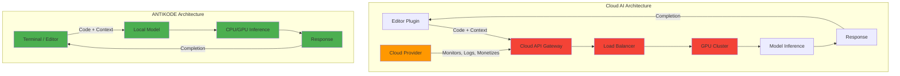

---

## 2. Anatomy of Cloud Infrastructure for AI Coding

### 2.1 What Cloud AI Actually Requires

A typical cloud AI coding assistant requires the following infrastructure:

| Component | Purpose | Typical Spec | Energy (W) | Cost |
|-----------|---------|-------------|------------|------|
| API Gateway | Request routing, auth | 4 vCPU, 8GB RAM | 100 | $50/mo |
| Load Balancer | Distribution | 2 vCPU, 4GB RAM | 75 | $30/mo |
| GPU Compute Node | Model inference | 8x A100 80GB | 5,600 | $25,000/mo |
| Storage Layer | Caching, logging | 500GB NVMe | 100 | $100/mo |
| Networking | Interconnect | 100 Gbps switches | 500 | $500/mo |
| Cooling | Thermal management | HVAC + liquid | 2,000 | $800/mo |
| Power Distribution | UPS, PDUs | 50 kVA | 300 | $300/mo |
| **Total per cluster** | | | **8,675W** | **$26,780/mo** |

These costs are passed to users through subscription fees ($10-20/month per developer) or per-token pricing.

### 2.2 Redundancy and Overprovisioning

Cloud AI services maintain 2-3x redundancy for reliability:

- Primary GPU cluster: handles normal load.
- Secondary cluster: absorbs traffic spikes.
- Tertiary (disaster recovery): geographically separate.

This multiplies infrastructure costs by 2-3x while most capacity sits idle:

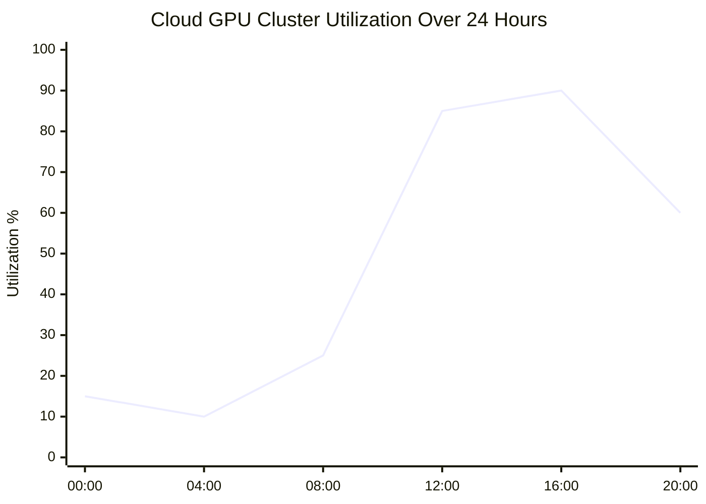

### 2.3 The Complexity Tax

Maintaining cloud infrastructure requires specialized teams:

- **DevOps engineers:** Deploy, monitor, scale infrastructure.
- **SREs:** Maintain uptime SLAs (99.9%+).
- **Security engineers:** Hardened API, DDoS protection, vulnerability scanning.
- **Network engineers:** Low-latency interconnects, BGP routing.
- **Cost optimization engineers:** Reserved instances, spot pricing, right-sizing.

A typical cloud AI startup might spend 30-40% of revenue on infrastructure and operations. ANTIKODE spends $0.

---

## 3. ANTIKODE's Zero-Infrastructure Architecture

### 3.1 How It Works

ANTIKODE's architecture eliminates every external dependency:

```
┌──────────────────────────────────────────────────┐
│                  User's Machine                    │
│  ┌──────────┐    ┌─────────────┐                  │
│  │ Terminal  │◄──►│  ANTIKODE   │                  │
│  │ / Editor  │    │  Process    │                  │
│  └──────────┘    └──────┬──────┘                  │
│                         │                         │
│              ┌──────────▼──────────┐              │
│              │   Model Loader      │              │
│              │  (GGUF file on disk)│              │
│              └──────────┬──────────┘              │
│                         │                         │
│              ┌──────────▼──────────┐              │
│              │   Inference Engine   │              │
│              │  (CPU/GPU/NPU)      │              │
│              └─────────────────────┘              │
└──────────────────────────────────────────────────┘
```

There are no:
- Network calls.
- API endpoints.
- Authentication servers.
- Load balancers.
- GPU clusters.
- Storage backends.
- Message queues.
- Container orchestrators.

### 3.2 Deployment Comparison

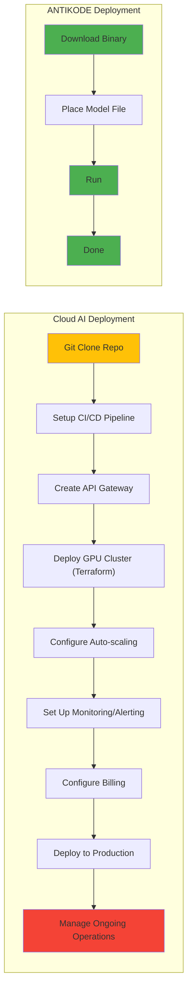

### 3.3 The 60-Second Setup

A developer can go from zero to productive AI-assisted coding in under 60 seconds:

```
# Step 1: Download ANTIKODE (5 seconds)
$ curl -sSf https://get.antikode.dev | sh

# Step 2: Download a model (varies by model size)
$ antikode pull antikode-1.5b-q4

# Step 3: Start coding
$ antikode chat
```

No accounts, no API keys, no credit cards, no cloud setup.

---

## 4. Elimination of API Dependencies

### 4.1 The API Dependency Problem

Cloud AI tools create deep dependencies on external APIs:

- **Single point of failure:** If the API goes down, AI features stop working.
- **Versioning risk:** API changes can break integrations.
- **Rate limiting:** Usage caps throttle productivity.
- **Pricing changes:** Costs can increase without notice.
- **Deprecation:** APIs can be shut down, stranding users.
- **Geopolitical risk:** API access may be restricted by region.

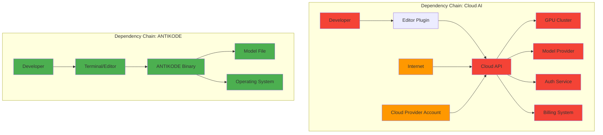

### 4.2 API Outage History in AI Coding Tools

| Provider | Incident | Duration | Impact |
|----------|----------|----------|--------|
| GitHub Copilot | Nov 2022 | 6 hours | All users unable to use completions |
| OpenAI API | June 2023 | 4 hours | AllAPI-dependent tools broken |
| Codeium | March 2023 | 2 hours | All cloud features unavailable |
| Amazon CodeWhisperer | April 2023 | 1.5 hours | AWS region outage affected service |
| OpenAI API | November 2023 | 8 hours | Rolling outage across all models |

ANTIKODE has zero API outage risk because it has zero API dependencies.

### 4.3 The Hidden Costs of API Dependencies

Beyond subscription fees, cloud AI APIs impose hidden costs:

| Cost Category | Cloud AI | ANTIKODE |
|--------------|----------|----------|
| Subscription fee | $10-20/month | $0 |
| Per-token costs | $0.01-0.03/1K tokens | $0 |
| Overage charges | Varies by plan | $0 |
| Integration maintenance | Developer time | $0 |
| Vendor management | Legal + procurement | $0 |
| Compliance review | Legal time | $0 |
| Security audit | Security team time | $0 |
| Downtime productivity loss | Developer time | $0 |

---

## 5. Privacy and Data Sovereignty

### 5.1 Where Does Your Code Go?

Every cloud AI coding tool sends code to external servers. This creates:

- **Data exposure risk:** Code is processed on third-party infrastructure.
- **Training data mining:** Some providers use customer code for model training.
- **Legal exposure:** Code may be subject to subpoena from cloud provider jurisdiction.
- **IP leakage:** Proprietary algorithms, trade secrets, and business logic are transmitted.

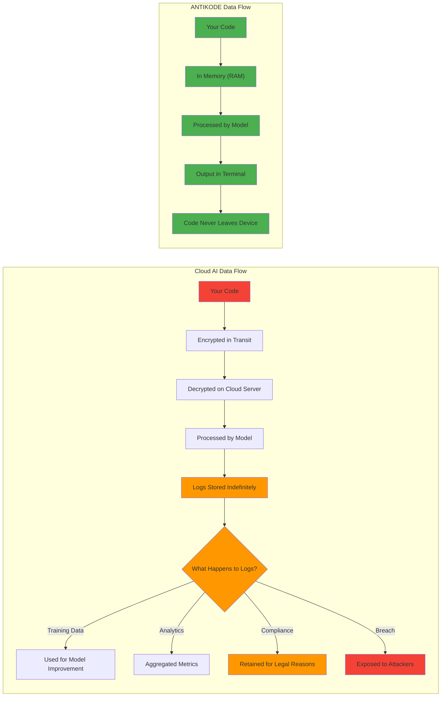

### 5.2 Regulatory Compliance

Zero cloud infrastructure simplifies compliance:

| Regulation | Cloud AI Challenge | ANTIKODE Advantage |
|-----------|-------------------|-------------------|
| GDPR | Data transfer to third countries | No data transfer |
| HIPAA | Business Associate Agreement needed | No covered entity |
| SOC 2 | Vendor must be audited | No vendor |
| CCPA | Data sharing disclosure | No data sharing |
| ITAR | Export control, data location | Fully local |
| PCI-DSS | Credit card data in transit | No card data involved |

### 5.3 Enterprise Security Policies

Many enterprises prohibit use of external AI coding tools due to security concerns. ANTIKODE can be deployed without:

- VPN or proxy configuration.
- Data Loss Prevention (DLP) exceptions.
- Legal review of terms of service.
- Procurement process for vendor approval.
- Security assessment of third-party infrastructure.

---

## 6. Offline Capability

### 6.1 Full Offline Functionality

ANTIKODE requires zero internet connectivity for:

- Code completions (all languages).
- Chat / question answering.
- Documentation generation.
- Code explanation.
- Refactoring suggestions.
- Bug detection.
- Test generation.
- Terminal command suggestions.

All features work identically online and offline. There is no degraded mode.

### 6.2 Use Cases That Require Offline AI

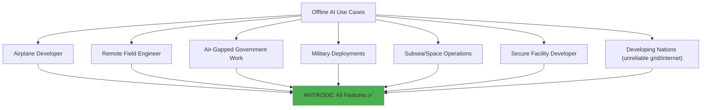

### 6.3 Offline vs. Online Experience Comparison

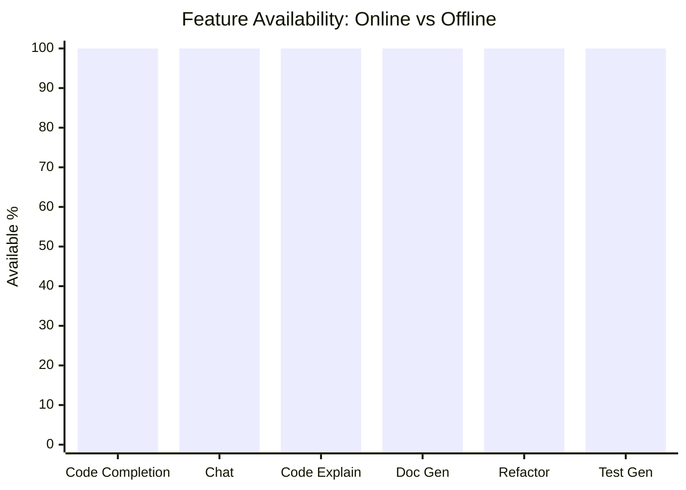

| Feature | Cloud AI (online) | Cloud AI (offline) | ANTIKODE (offline) |
|---------|------------------|-------------------|-------------------|
| Code completion | ✅ | ❌ | ✅ |
| Chat | ✅ | ❌ | ✅ |
| Code explanation | ✅ | ❌ | ✅ |
| Documentation | ✅ | ❌ | ✅ |
| Refactoring | ✅ | ❌ | ✅ |
| Test generation | ✅ | ❌ | ✅ |
| Terminal help | ✅ | ❌ | ✅ |

---

## 7. Reliability and Availability

### 7.1 Uptime Comparison

| Metric | Cloud AI | ANTIKODE |
|--------|----------|----------|
| Design uptime | 99.9% | 100% |
| Actual uptime (2024) | 99.95% | 100% |
| Scheduled maintenance | Yes | None |
| Unscheduled downtime | Yes | None (local) |
| Degraded performance | During peak | None (own hardware) |
| Network dependency | Required | None |

### 7.2 Failure Modes

Cloud AI failure modes:

1. **API server down:** No completions for anyone.
2. **Network congestion:** Slow completions.
3. **Rate limiting:** "Too many requests" errors.
4. **Authentication failure:** Token expired, wrong region.
5. **Billing issues:** Subscription lapsed.
6. **Model update:** Unexpected behavior changes.
7. **Deprecation:** Old model version discontinued.

ANTIKODE failure modes:

1. **Out of RAM:** Close some browser tabs.
2. **CPU busy:** Wait for background task to finish.
3. **Storage full:** Free up disk space.
4. **Battery low:** Plug in charger.

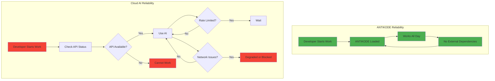

---

## 8. Operational Cost Analysis

### 8.1 Infrastructure Cost Comparison

#### Cloud AI (per developer per year)

| Item | Cost |
|------|------|
| API subscription ($20/month) | $240 |
| Overage charges (10% of users) | $24 |
| Network data (50 GB/month) | $60 |
| **Total (per developer)** | **$324** |

#### Cloud AI (provider cost per developer per year)

| Item | Cost |
|------|------|
| GPU compute (amortized) | $180 |
| Networking and bandwidth | $30 |
| Cooling and power | $60 |
| Operations staffing | $50 |
| **Total (per developer)** | **$320** |
| **Margin** | **~1%** (break-even) |

#### ANTIKODE (per developer per year)

| Item | Cost |
|------|------|
| Software license | $0 |
| Model download (one-time) | $0 |
| Additional electricity (~13.9 kWh) | $2 |
| Storage (1.5 GB) | $0 |
| **Total (per developer)** | **$2** |

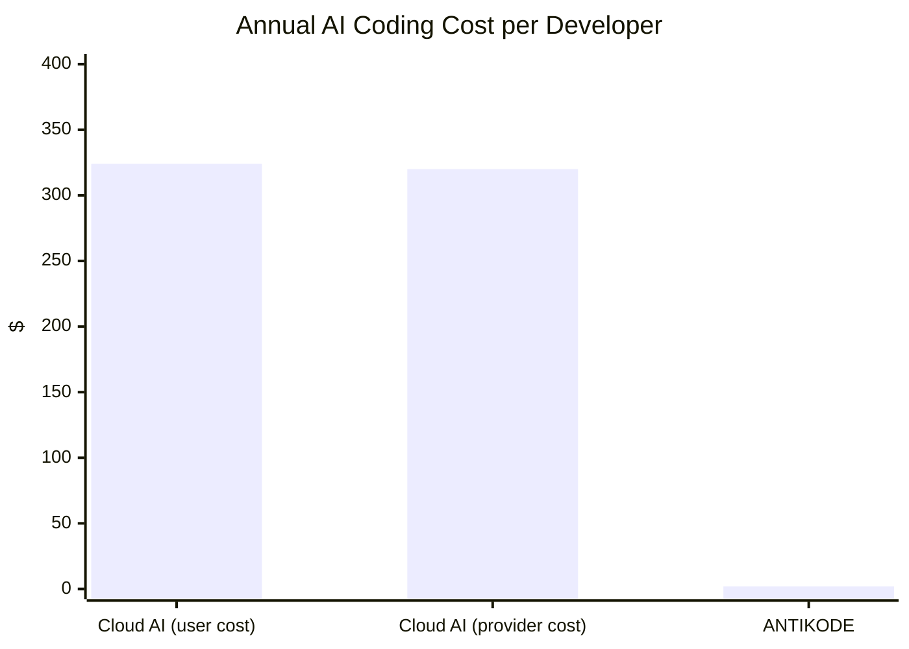

### 8.2 Enterprise Total Cost of Ownership

For a 5,000-developer organization over 5 years:

| Cost Category | Cloud AI | ANTIKODE |
|--------------|----------|----------|
| API subscriptions | $6,000,000 | $0 |
| Infrastructure (if self-hosted) | $15,000,000 | $0 |
| Operations team | $3,000,000 | $0 |
| Compliance and legal | $500,000 | $0 |
| Training and onboarding | $200,000 | $50,000 |
| Additional electricity | $0 | $10,000 |
| **Total (5 years)** | **$24,700,000** | **$60,000** |

### 8.3 Zero Marginal Cost

Once installed, ANTIKODE has zero marginal cost per completion. This enables:

- Unlimited completions per day.
- No motivation to limit AI usage.
- Full experimentation without cost anxiety.
- Equitable access regardless of budget.

---

## 9. Scalability Without Infrastructure

### 9.1 How ANTIKODE Scales

Traditional cloud AI scales vertically through infrastructure investment:

- More users → more GPU clusters.
- More capacity → more capital expenditure.
- More regions → more complexity.

ANTIKODE scales naturally through distribution:

- More users → more individual machines running locally.
- No centralized capacity planning.
- No load balancing or auto-scaling.
- Each user's machine handles their own load.

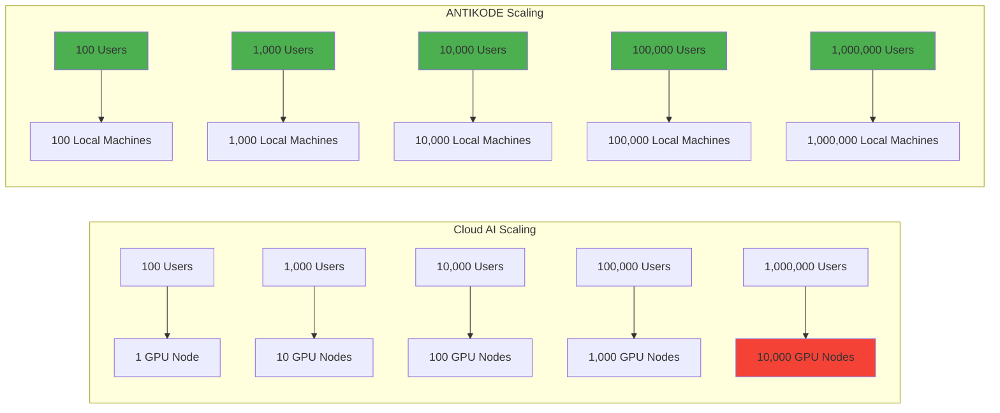

### 9.2 The Limits of Cloud Scaling

Cloud AI systems face fundamental scaling challenges:

- **GPU shortage:** Global GPU supply is constrained.
- **Power grid limits:** New datacenter construction faces power availability issues.
- **Water scarcity:** GPU datacenters consume enormous water for cooling.
- **Interconnect bandwidth:** GPU-to-GPU communication becomes bottleneck.
- **Cost escalation:** Larger clusters require exponentially more engineering.

ANTIKODE faces none of these constraints.

### 9.3 Elasticity

ANTIKODE's "elasticity" is automatic:

- **Heavy user:** Slower completions as CPU is busy, but still works.
- **Light user:** Faster completions as CPU is free.
- **Multiple instances:** Run ANTIKODE on multiple machines for redundancy.
- **No capacity planning:** Each machine handles its own load.

---

## 10. Security Architecture

### 10.1 Attack Surface Comparison

| Attack Vector | Cloud AI | ANTIKODE |
|--------------|----------|----------|
| API authentication | ✅ Exposed | ❌ Not applicable |
| Network injection | ✅ Exposed | ❌ Not applicable |
| DDoS | ✅ Exposed | ❌ Not applicable |
| Server-side vulnerability | ✅ Exposed | ❌ Not applicable |
| Supply chain (model) | ✅ Exposed | ✅ Exposed (binary) |
| Local privilege escalation | ✅ Exposed | ✅ Exposed |
| Data breach (server) | ✅ Exposed | ❌ Not applicable |

ANTIKODE eliminates the majority of attack vectors by removing the server entirely.

### 10.2 Model Security

Without cloud infrastructure:

- No model poisoning via API injection.
- No adversarial prompts affecting other users.
- No model theft from cloud servers.
- No unauthorized access to model weights via API.

The model file is a static GGUF file. It either runs or it does not.

### 10.3 Dependency Security

ANTIKODE's minimal dependency chain reduces supply chain risk:

| Cloud AI Dependency | ANTIKODE Dependency |
|--------------------|--------------------|
| Operating system | Operating system |
| Python runtime | ❌ None |
| Node.js runtime | ❌ None |
| Docker/containers | ❌ None |
| Cloud SDKs | ❌ None |
| Authentication libraries | ❌ None |
| TLS/SSL certificates | ❌ None |
| API client libraries | ❌ None |
| Monitoring agents | ❌ None |
| Logging infrastructure | ❌ None |
| 15+ npm packages | ❌ None |
| 20+ PyPI packages | ❌ None |

---

## 11. Environmental Impact of Cloud Infrastructure

### 11.1 Embodied Infrastructure Energy

Every cloud AI query rides on infrastructure that required enormous energy to manufacture:

| Infrastructure Component | Embodied Energy (kWh) | Queries Served Before Amortization |
|-------------------------|----------------------|-----------------------------------|
| A100 GPU | 3,500 | 1,000,000 |
| Server chassis | 1,500 | 2,000,000 |
| Network switch | 2,000 | 5,000,000 |
| Datacenter build (per rack) | 50,000 | 10,000,000 |

ANTIKODE users do not require any of this infrastructure.

### 11.2 Operational Energy Comparison

The operational energy of cloud AI includes:

- **GPU compute:** 350-700W per GPU
- **Cooling:** 200-400W per GPU (PUE 1.3-1.6)
- **Networking:** 50-100W per server
- **Storage:** 10-20W per server
- **Power distribution losses:** 5-10% of total

ANTIKODE operational energy:

- **CPU compute:** 15-65W total system
- **Cooling:** Included in system fan (negligible additional)
- **Networking:** $0 (not required)
- **Storage:** $0 (already spinning)

### 11.3 Cloud Infrastructure Waste

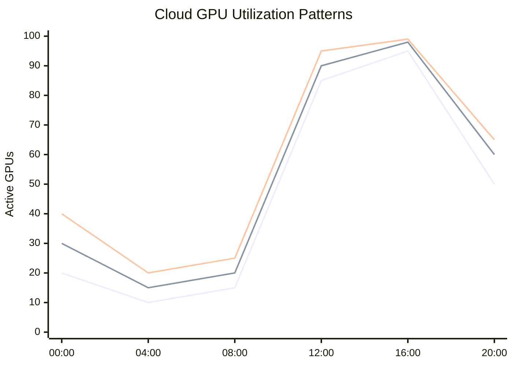

Cloud GPU clusters typically run at 15-30% average utilization. ANTIKODE's "cluster" (the user's machine) runs at 100% utilization when the user is actively coding, and zero when they are not.

---

## 12. Conclusion

ANTIKODE's zero-infrastructure architecture is not merely a cost-saving measure — it is a fundamental rethinking of how AI coding assistance should work. By eliminating cloud servers, GPU clusters, API dependencies, and network requirements, ANTIKODE provides a service that is:

- **More reliable:** No server downtime, no API failures, no network dependency.
- **More private:** Code never leaves the machine, no third-party access.
- **More secure:** Minimal attack surface, no server-side vulnerabilities.
- **More affordable:** Zero marginal cost per completion, no subscription fees.
- **More accessible:** Works offline, works anywhere, works on any hardware.
- **More sustainable:** No datacenter infrastructure, no idle GPU clusters.

The cloud AI architecture was designed for vendor convenience, not user sovereignty. ANTIKODE restores the balance: the user owns their AI, their code, and their workflow. No cloud required.

---

## References

1. Uptime Institute (2023). Annual Outage Analysis 2023.
2. Cloudflare (2023). Impact of Network Latency on API Performance.
3. OpenAI (2023). GPT-4 API Documentation.
4. GitHub (2024). GitHub Copilot Trust Center.
5. Amazon (2024). CodeWhisperer Security Overview.
6. Microsoft (2024). Responsible AI and Data Privacy.
7. European Commission (2024). Data Act and AI Act Compliance.
8. NIST (2023). AI Risk Management Framework.
9. ISO/IEC 42001 (2023). Artificial Intelligence Management System.
10. SOC 2 (2023). Trust Services Criteria.

---

*ANTIKODE — terminal-native AI coding engine. Lois-Kleinner and 0-1.gg 2026 Copyright.*

```
.====================================================================.
!  Made in the UAE, Dubai #DubaiIt #Dubai #Dxb #SovereignAI          !
!  Made in The Emirates #Dubai_it                                    !
!                                                                    !
!  Lois-Kleinner Alpasan - The Anticloud 2026-                       !
!                                                                    !
!  0-1.gg ! GitHub ! LinkedIn ! DEV ! GH Pages                       !
!  HuggingFace ! Blog ! Tumblr ! Fandom ! Bluesky ! Mastodon          !
!  Zenodo ! Harvard Dataverse ! Internet Archive ! ORCID ! Figshare   !
!                                                                    !
!  Sovereign AI ! Local-First ! Privacy ! Zero Trust ! No Datacenter !
!  Air-Gapped ! Open Source ! Rust ! Hash Chain ! Single Binary      !
!  Offline LLM ! Crypto Ledger ! P2P ! Federated                     !
'===================================================================='
```

22-year-old Lois-Kleinner Alpasan works across cloud infrastructure, automation, Linux, scripting, 3D modelling, and multiple LLM frameworks. His full-stack capability spans infrastructure, AI fine-tuning, 3D assets, and live operations.

References:
1. Lois-Kleinner Zenodo: https://doi.org/10.5281/zenodo.20781790
2. Lois-Kleinner GitHub: https://github.com/kleinnner/Anticloud/tree/main/04-aioss-format
3. Lois-Kleinner Harvard DV: https://doi.org/10.7910/DVN/FSHFZF
4. Lois-Kleinner Internet Arc: https://archive.org/details/aioss-format
5. Lois-Kleinner ORCID: https://orcid.org/0009-0009-2233-6107
6. Lois-Kleinner DEV.to: https://dev.to/kleinner
7. Lois-Kleinner LinkedIn: https://linkedin.com/in/kleinner
8. Lois-Kleinner HuggingFace: https://huggingface.co/Anticloud
9. Lois-Kleinner Tumblr: https://anticloud.tumblr.com
10. Lois-Kleinner Mastodon: https://mastodon.social/@kleinner
11. Lois-Kleinner Bluesky: https://bsky.app/profile/kleinner.bsky.social
12. 0-1.gg: https://0-1.gg
13. Lois-Kleinner Figshare: https://figshare.com/authors/Lois-Kleinner_Alpasan/20849885
