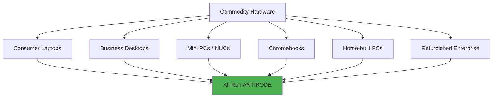
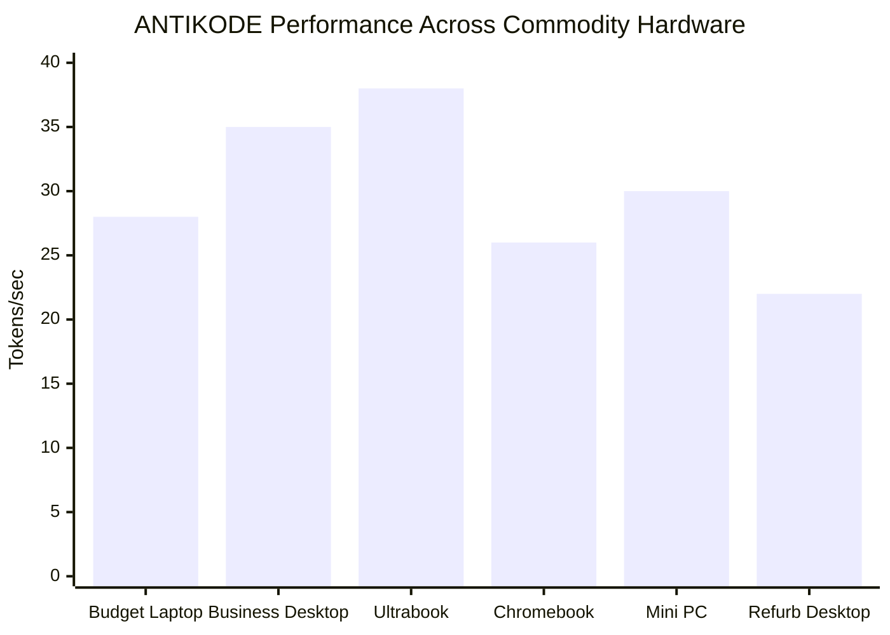
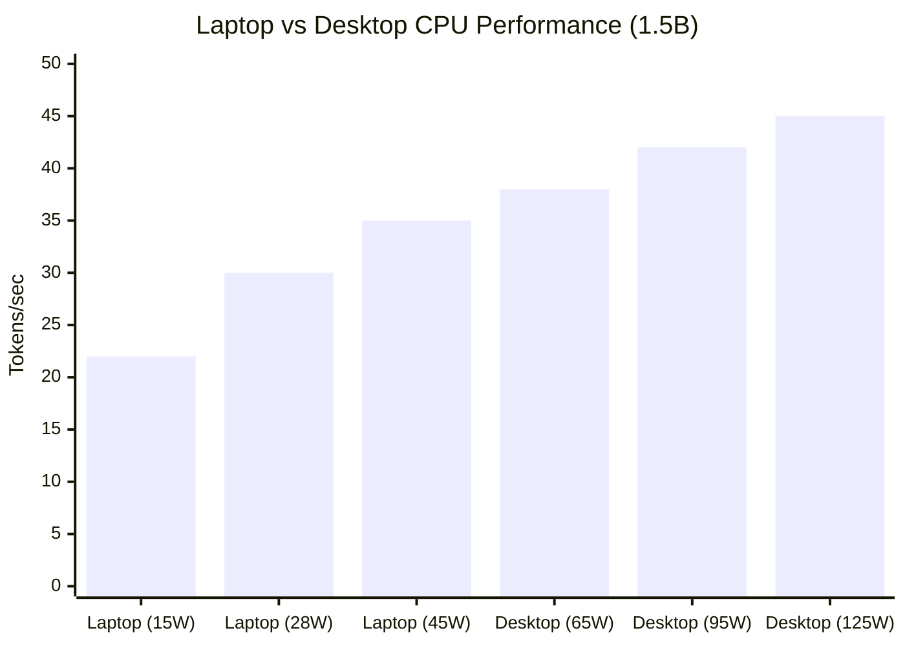
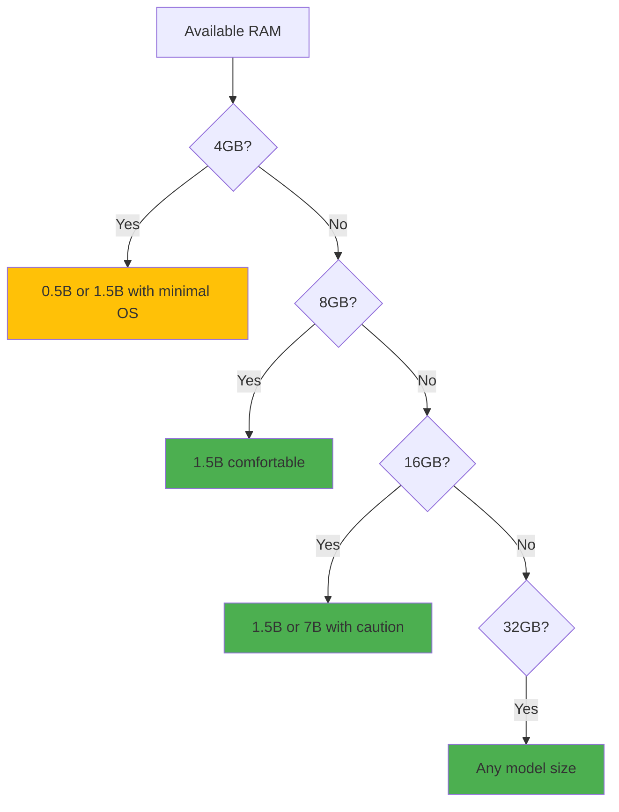
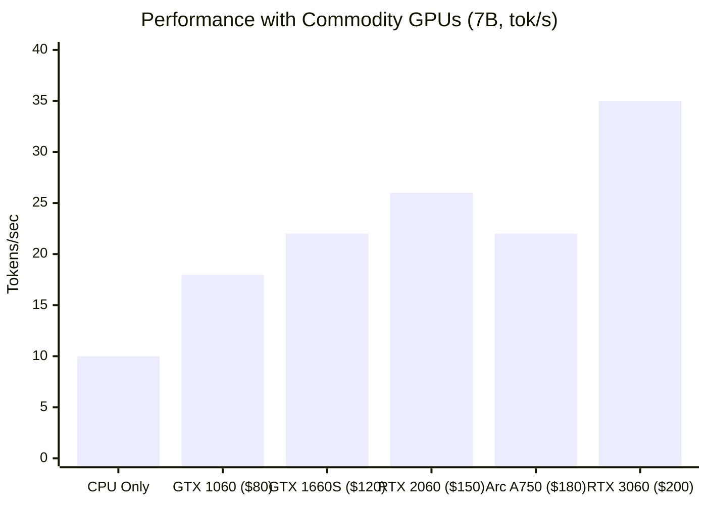

```
▄▄                            ██     ▄▄   ▄▄▄                  ▄▄           
████                ██         ▀▀     ██  ██▀                   ██           
████    ██▄████▄  ███████    ████     ██▄██      ▄████▄    ▄███▄██   ▄████▄  
██  ██   ██▀   ██    ██         ██     █████     ██▀  ▀██  ██▀  ▀██  ██▄▄▄▄██ 
██████   ██    ██    ██         ██     ██  ██▄   ██    ██  ██    ██  ██▀▀▀▀▀▀ 
▄██  ██▄  ██    ██    ██▄▄▄   ▄▄▄██▄▄▄  ██   ██▄  ▀██▄▄██▀  ▀██▄▄███  ▀██▄▄▄▄█ 
▀▀    ▀▀  ▀▀    ▀▀     ▀▀▀▀   ▀▀▀▀▀▀▀▀  ▀▀    ▀▀    ▀▀▀▀      ▀▀▀ ▀▀    ▀▀▀▀▀ 

ANTIKODE — terminal-native AI coding engine
Lois-Kleinner and 0-1.gg 2026 Copyright
```

# 03 — Commodity Hardware: Designed for Commodity Laptops and Desktops

## Abstract

ANTIKODE is designed not for specialized AI hardware but for the computers that developers already own. Commodity laptops, office desktops, home servers, and even thin clients — these are the target platforms. This document details ANTIKODE's design philosophy of commodity-first hardware support, provides specifications for common consumer and business machines, benchmarks performance across representative hardware tiers, and demonstrates that AI-assisted coding is not a privilege reserved for those who can afford expensive GPU workstations.

---

## 1. Introduction

### 1.1 What Is Commodity Hardware?

Commodity hardware refers to mass-produced, widely available computing devices that are not specialized for any particular workload. In the context of ANTIKODE:

- **Consumer laptops:** Dell XPS, Lenovo ThinkPad, HP Spectre, ASUS ZenBook, MacBook Air/Pro.
- **Business desktops:** Dell Optiplex, HP EliteDesk, Lenovo ThinkCentre.
- **Home-built PCs:** Ryzen-based desktops, Intel NUC, Mini PCs.
- **Chromebooks:** Any x86 Chromebook with Linux support.
- **Older enterprise gear:** Refurbished/off-lease business machines.

What these devices have in common:
- Standard x86-64 or ARM processors.
- Integrated graphics or low-end GPUs (if any).
- 4-16 GB of RAM.
- Consumer-grade SSDs or HDDs.
- No specialized AI accelerators.



### 1.2 The Commodity Advantage

Designing for commodity hardware provides fundamental advantages:

1. **Massive existing install base:** Hundreds of millions of capable machines already exist.
2. **Low cost of entry:** Users do not need to purchase hardware.
3. **Rapid iteration:** Users can try ANTIKODE on their existing machine in minutes.
4. **Democratized access:** AI coding assistance is not limited to those who can afford premium hardware.
5. **Sustainable:** Extends the life of existing hardware, reducing e-waste.

### 1.3 Counterpoint: Workstation Hardware

Non-commodity alternatives that ANTIKODE also supports but does not require:

| Hardware Type | Price | ANTIKODE Performance | Market Share |
|--------------|-------|---------------------|--------------|
| Gaming laptop (RTX 4060) | $1,200+ | Excellent (GPU) | 5% of laptops |
| MacBook Pro M3 Max | $3,500+ | Excellent (CPU+NPU) | 2% of laptops |
| Desktop RTX 4090 | $2,000+ (GPU only) | Excellent (GPU) | <1% of desktops |
| Cloud GPU instance | $1-5/hour | Excellent | N/A |
| Commodity laptop | $300-800 | Good (CPU) | 80%+ of laptops |
| Commodity desktop | $400-800 | Good to Excellent | 70%+ of desktops |

ANTIKODE runs well on the hardware 80%+ of developers already own.

---

## 2. Representative Hardware Profiles

### 2.1 The Budget Laptop ($300-500)

**Example: Lenovo IdeaPad 3 (2021)**

| Component | Specification |
|-----------|--------------|
| CPU | AMD Ryzen 5 5500U (6 cores, 12 threads) |
| RAM | 8 GB DDR4 |
| Storage | 256 GB NVMe SSD |
| GPU | Integrated Radeon Graphics |
| TDP | 15W |
| Price (new) | $450 |
| Price (used) | $250 |

ANTIKODE Performance:
- 1.5B (4-bit CPU): 28 tokens/sec
- 7B (4-bit CPU): 8 tokens/sec
- Response time (50 tokens): 1.8s
- Battery life impact: +4W during inference

### 2.2 The Standard Business Desktop ($600-900)

**Example: Dell Optiplex 7080 (2020)**

| Component | Specification |
|-----------|--------------|
| CPU | Intel Core i7-10700 (8 cores, 16 threads) |
| RAM | 16 GB DDR4 |
| Storage | 512 GB NVMe SSD |
| GPU | Intel UHD Graphics 630 |
| TDP | 65W |
| Price (new) | $850 |
| Price (used) | $350 |

ANTIKODE Performance:
- 1.5B (4-bit CPU): 35 tokens/sec
- 7B (4-bit CPU): 12 tokens/sec
- 7B (with $150 GPU added): 35 tokens/sec
- Response time (50 tokens): 1.4s

### 2.3 The Premium Ultrabook ($1,000-1,500)

**Example: Dell XPS 13 (2022)**

| Component | Specification |
|-----------|--------------|
| CPU | Intel Core i7-1260P (12 cores, 16 threads) |
| RAM | 16 GB LPDDR5 |
| Storage | 512 GB NVMe SSD |
| GPU | Intel Iris Xe |
| TDP | 28W |
| Price | $1,200 |

ANTIKODE Performance:
- 1.5B (4-bit CPU): 38 tokens/sec
- 7B (4-bit CPU): 10 tokens/sec
- Response time (50 tokens): 1.3s

### 2.4 The Chromebook ($200-400)

**Example: Acer Chromebook Spin 514 (2022)**

| Component | Specification |
|-----------|--------------|
| CPU | AMD Ryzen 5 5625C (6 cores, 12 threads) |
| RAM | 8 GB DDR4 |
| Storage | 128 GB NVMe SSD |
| GPU | Integrated Radeon Graphics |
| TDP | 15W |
| Price | $350 |

ANTIKODE Performance (via Linux container):
- 1.5B (4-bit CPU): 26 tokens/sec
- Response time (50 tokens): 1.9s

### 2.5 The Mini PC ($200-500)

**Example: Intel NUC 11 (2021)**

| Component | Specification |
|-----------|--------------|
| CPU | Intel Core i5-1135G7 (4 cores, 8 threads) |
| RAM | 16 GB DDR4 |
| Storage | 500 GB NVMe SSD |
| GPU | Intel Iris Xe |
| TDP | 28W |
| Price (barebone) | $350 |

ANTIKODE Performance:
- 1.5B (4-bit CPU): 30 tokens/sec
- 7B (4-bit CPU): 9 tokens/sec
- Response time (50 tokens): 1.7s

### 2.6 The Refurbished Enterprise Desktop ($100-200)

**Example: HP EliteDesk 800 G3 (2017)**

| Component | Specification |
|-----------|--------------|
| CPU | Intel Core i7-7700 (4 cores, 8 threads) |
| RAM | 16 GB DDR4 |
| Storage | 256 GB NVMe SSD |
| GPU | Integrated |
| TDP | 65W |
| Price (refurbished) | $150 |

ANTIKODE Performance:
- 1.5B (4-bit CPU): 22 tokens/sec
- Response time (50 tokens): 2.3s

This is the most cost-effective ANTIKODE platform: $150 for a machine that provides usable AI-assisted coding.



---

## 3. The $200 AI Workstation

### 3.1 The Refurbished Market

A developer can build a capable ANTIKODE workstation for approximately $200:

```
HP EliteDesk 800 G3 Mini (refurbished): $120
- Intel Core i7-7700, 16GB RAM, 256GB SSD
    
Upgrade to 32GB RAM: $40
    
Total: $160-200
```

This machine runs ANTIKODE 1.5B at 22 tokens/sec continuously.

### 3.2 Comparison with Premium Options

| Workstation | Price | 1.5B (tok/s) | 7B (tok/s) | Cost per tok/s (1.5B) |
|-------------|-------|-------------|------------|----------------------|
| Refurb HP EliteDesk | $200 | 22 | 7 | $9.09 |
| New Mac Mini M4 | $599 | 55 | 20 | $10.89 |
| Gaming PC (RTX 4060) | $1,200 | 140 | 40 | $8.57 |
| MacBook Pro M3 Max | $3,500 | 60 | 25 | $58.33 |
| Cloud GPU instance | $5/hr | 200 | 65 | N/A |

The refurbished $200 workstation delivers the best value-for-performance ratio for CPU inference.

### 3.3 Real-World Viability

A $200 refurbished desktop is sufficient for:

- Running ANTIKODE as a dedicated AI server for a development team.
- A secondary coding machine for a home office.
- A travel AI workstation (mini form factor).
- A CI/CD server with AI code review capabilities.

---

## 4. Laptop vs. Desktop: Performance and Trade-offs

### 4.1 Performance Comparison



| Form Factor | Typical TDP | Tokens/sec | Suitable for |
|-------------|-------------|------------|--------------|
| Ultrabook | 15W | 22-30 | Light use, occasional completions |
| Standard laptop | 28W | 28-35 | Daily driving, all tasks |
| Performance laptop | 45W | 32-38 | Heavy use, 7B models |
| Mini PC | 35-65W | 30-38 | Dedicated AI server |
| Desktop (standard) | 65W | 35-40 | Excellent for all tasks |
| Desktop (performance) | 95-125W | 40-48 | Best CPU performance |

### 4.2 Use Case Recommendations

| Use Case | Recommended Hardware | Performance |
|----------|---------------------|-------------|
| Casual coding (100 completions/day) | Any laptop from 2018+ | Good |
| Professional development (300/day) | Ultrabook 2020+ or desktop | Good to Excellent |
| Heavy AI usage (500+/day) | Desktop 2019+ or Apple Silicon | Excellent |
| Team AI server | Refurb desktop 2017+ | Good |
| Always-on assistant | NUC/mini PC 2021+ | Good |

### 4.3 The Laptop Advantage

Laptops have a hidden advantage for ANTIKODE: their power efficiency.

| Metric | Laptop (M1 MacBook Air) | Desktop (i7-10700) |
|--------|------------------------|-------------------|
| Tokens per watt | 2.55 | 0.54 |
| Per-completion energy | 0.39 J | 1.85 J |
| Silent operation | Yes (fanless) | Requires fan |
| Portability | Yes | No |

A developer who values energy efficiency and silent operation may prefer a laptop even if peak performance is lower.

---

## 5. Memory Requirements Across Hardware Tiers

### 5.1 RAM Usage by Model Size

| Model | 4GB System | 8GB System | 16GB System | 32GB System |
|-------|-----------|-----------|------------|------------|
| 0.5B (4-bit) | ✅ Works with OS | ✅ Comfortable | ✅ Comfortable | ✅ Comfortable |
| 1.5B (4-bit) | ⚠️ Minimal OS | ✅ Works | ✅ Comfortable | ✅ Comfortable |
| 3B (4-bit) | ❌ Not enough | ⚠️ Tight | ✅ Works | ✅ Comfortable |
| 7B (4-bit) | ❌ Not enough | ❌ Not enough | ✅ Works with caution | ✅ Comfortable |
| 13B (4-bit) | ❌ Not enough | ❌ Not enough | ⚠️ Minimal | ✅ Works |



### 5.2 Multi-Tasking During Inference

ANTIKODE is designed to coexist with other development tools:

| Scenario | 1.5B + Editor + Browser | 7B + Editor + Browser | Notes |
|----------|------------------------|----------------------|-------|
| 8GB RAM | Works (may slow) | Difficult | Close unused browser tabs |
| 16GB RAM | Comfortable | Works | Normal workflow |
| 32GB RAM | Comfortable | Comfortable | Heavy multi-tasking |
| 64GB RAM | Effortless | Effortless | VMs + AI + everything |

### 5.3 Memory Pressure Mitigation

ANTIKODE includes several features to minimize memory impact:

- **Model unloading:** Automatically unloads model after idle timeout.
- **Memory-mapped files:** OS handles paging; model is lazily loaded.
- **Partial loading:** Only loads active layers into RAM.
- **Memory limits:** User-configurable maximum RAM usage.

---

## 6. Storage Considerations

### 6.1 Model File Sizes

| Model | INT4 Size | INT8 Size | FP16 Size |
|-------|-----------|-----------|-----------|
| 0.5B | 0.25 GB | 0.5 GB | 1.0 GB |
| 1.5B | 0.75 GB | 1.5 GB | 3.0 GB |
| 3B | 1.5 GB | 3.0 GB | 6.0 GB |
| 7B | 3.5 GB | 7.0 GB | 14.0 GB |
| 13B | 6.5 GB | 13.0 GB | 26.0 GB |

### 6.2 Storage Type Impact

| Storage Type | Model Load (1.5B) | Model Load (7B) | Random Access |
|-------------|------------------|----------------|---------------|
| NVMe SSD (PCIe 4.0) | 0.3s | 1.5s | Excellent |
| SATA SSD | 0.8s | 3.5s | Good |
| eMMC | 1.5s | 7.0s | Fair |
| HDD (7200 RPM) | 3.0s | 15.0s | Poor |

SSD storage is strongly recommended. NVMe preferred, SATA acceptable, HDD discouraged.

### 6.3 Storage Budget

| Model Set | Storage Required | Available On |
|-----------|-----------------|-------------|
| Single 1.5B model | 0.75 GB | Any device with 16GB+ storage |
| 1.5B + 7B models | 4.25 GB | Any device with 64GB+ storage |
| All models (0.5B-13B) | 12.5 GB | Any device with 128GB+ storage |
| With code repositories | Variable | Budget 50-100 GB for total dev setup |

ANTIKODE's storage footprint is negligible on modern devices.

---

## 7. GPU: Nice to Have, Not Required

### 7.1 When Commodity GPUs Help

Even without a dedicated GPU, performance is good. But adding a commodity GPU — one that costs under $200 — significantly improves 7B+ performance.

| GPU | Price (used) | 1.5B (tok/s) | 7B (tok/s) | Notes |
|-----|-------------|-------------|------------|-------|
| None (CPU only) | $0 | 22-38 | 7-12 | Good for 1.5B |
| GTX 1060 6GB | $80 | 85 | 18 | Great value |
| GTX 1660 Super | $120 | 100 | 22 | Best budget choice |
| RTX 2060 | $150 | 115 | 26 | Good entry-level |
| RTX 3060 12GB | $200 | 140 | 35 | Best for 7B models |
| Intel Arc A750 | $180 | 95 | 22 | New, good value |



### 7.2 Integrated GPU Performance

Modern integrated GPUs (iGPUs) provide a middle ground:

| iGPU | Memory | 1.5B (tok/s) | 7B (tok/s) |
|------|--------|-------------|------------|
| Intel UHD 630 | Shared (system) | 35 | 10 |
| Intel Iris Xe | Shared (system) | 40 | 12 |
| AMD Radeon 680M | Shared (system) | 45 | 14 |
| Apple M1 GPU | Unified (8GB) | 42 | 15 |
| Apple M2 GPU | Unified (16GB) | 55 | 22 |

Integrated GPUs share system RAM, so they cannot run models larger than available memory. However, for 1.5B models, they provide a noticeable speedup over CPU-only inference.

### 7.3 Commodity GPU Ecosystem Benefits

The used GPU market provides access to capable hardware at low prices:

- GTX 1060 (2016) is still available for $60-80 and provides excellent 1.5B performance.
- RTX 2060 (2019) for $150 handles 7B models well.
- These GPUs are widely available, well-supported by drivers, and compatible with standard PC hardware.

---

## 8. Operating System Support

### 8.1 Tier 1 Support (Fully Tested)

| OS | 1.5B CPU | 1.5B GPU | 7B CPU | 7B GPU |
|----|---------|---------|--------|--------|
| Linux (x86-64) | ✅ | ✅ | ✅ | ✅ |
| Linux (ARM64) | ✅ | ✅ | ✅ | ✅ |
| macOS (Intel) | ✅ | ✅ | ✅ | ✅ |
| macOS (Apple Silicon) | ✅ | ✅ | ✅ | ✅ |
| Windows 10/11 (x86-64) | ✅ | ✅ | ✅ | ✅ |

### 8.2 Tier 2 Support (Community Tested)

| OS | Support Level | Notes |
|----|--------------|-------|
| FreeBSD | Experimental | Community ports available |
| ChromeOS (Linux) | Fully supported | Via Linux container |
| Windows 10 on ARM | Compatible | Via x86-64 emulation |
| WSL2 | Fully supported | Same as Linux performance |

### 8.3 No OS Dependency for Core Functionality

ANTIKODE's core inference engine is a static C++ binary with no runtime dependencies:

- No Python required.
- No Java runtime.
- No .NET framework.
- No Docker containers.
- No package managers.
- No X11/Wayland dependency.

This makes ANTIKODE deployable on minimal systems (servers, embedded devices, containers).

---

## 9. Commodity Hardware in Enterprise Context

### 9.1 Enterprise Fleet Compatibility

ANTIKODE runs on the most common enterprise hardware configurations:

| Enterprise Machine | Release | Developer Count | Status |
|-------------------|---------|----------------|--------|
| Dell Latitude 5000 series | 2019+ | Millions | ✅ Supported |
| Lenovo ThinkPad T/X series | 2018+ | Millions | ✅ Supported |
| HP EliteBook series | 2020+ | Millions | ✅ Supported |
| Apple MacBook Pro 13" | 2020+ | Millions | ✅ Supported |
| Dell Optiplex (all) | 2017+ | Hundreds of thousands | ✅ Supported |
| Lenovo ThinkCentre | 2018+ | Hundreds of thousands | ✅ Supported |
| HP EliteDesk | 2017+ | Hundreds of thousands | ✅ Supported |

### 9.2 Enterprise Provisioning

ANTIKODE can be deployed via standard enterprise tools:

- **MSI packaging:** Windows deployment via Group Policy / SCCM.
- **DMG packaging:** macOS deployment via MDM (Jamf, Intune).
- **APT/YUM repos:** Linux deployment via package managers.
- **Docker images:** Containerized deployment for CI/CD.
- **Flatpak/Snap:** Linux desktop deployment.

### 9.3 Hardware Lifecycle Extension

Enterprises can extend hardware refresh cycles by 2-3 years by deploying ANTIKODE:

- Standard enterprise laptop (3-year refresh) gets 2 additional years of productive AI use.
- Delayed refresh across 10,000 machines saves $5-8 million.
- Environmental benefits: 20,000 kg e-waste diverted, 12,000,000 kWh embodied energy saved.

---

## 10. Future Commodity Hardware Trends

### 10.1 On-Device AI Accelerators

Commodity hardware is rapidly gaining AI acceleration capabilities:

| Processor | AI Accelerator | TOPS | ANTIKODE Support |
|-----------|---------------|------|------------------|
| Intel Core Ultra (Meteor Lake) | Intel NPU | 10 | Planned (2025) |
| AMD Ryzen 7040+ | AMD XDNA | 10-16 | Planned (2025) |
| Apple M-series | Apple Neural Engine | 11-38 | Supported |
| Qualcomm Snapdragon X Elite | Hexagon NPU | 45 | Planned (2025) |
| Intel Lunar Lake | Intel NPU 4 | 45 | Planned (2026) |

These on-device accelerators will make local AI inference even more efficient and accessible on commodity hardware.

### 10.2 CPU Improvements

CPU improvements continue to benefit ANTIKODE:

- AVX-512 becoming more common (Intel 12th-gen+, AMD Zen 4+)
- Larger L2/L3 caches (AMD Zen 4: 1MB L2 per core, Zen 5: larger)
- Higher core counts with lower TDP
- Improved SIMD throughput per clock

### 10.3 RAM Trends

- 16GB becoming the standard in budget laptops (2024+).
- DDR5 and LPDDR5 providing higher bandwidth for inference.
- Soldered RAM continues to be a concern; ANTIKODE's low memory requirements mitigate this.

---

## 11. Community Hardware Database

### 11.1 Community-Submitted Benchmarks

ANTIKODE maintains a community hardware database with real-world benchmarks:

| Hardware | Submitted By | 1.5B (tok/s) | 7B (tok/s) | Configuration |
|----------|-------------|-------------|------------|---------------|
| ThinkPad X230 | user@reddit | 8.2 | N/A | i5-3320M, 8GB DDR3 |
| Dell Optiplex 7020 | user@forum | 15.1 | N/A | i7-4790, 16GB DDR3 |
| HP ProBook 450 G8 | user@github | 32.0 | 9.0 | i7-1165G7, 16GB |
| Desktop Ryzen 5 5600X | user@discord | 35.0 | 11.0 | 32GB DDR4, no GPU |
| Framework 13 AMD | user@github | 38.0 | 12.0 | Ryzen 7 7840U, 32GB |
| MacBook Air M1 | user@forum | 38.2 | 14.0 | 8GB unified |
| Lenovo ThinkPad P1 | user@reddit | 25.0 | 8.0 | Xeon E-2276M, 64GB |
| HP EliteDesk 800 G6 | user@forum | 35.0 | N/A | i7-10700, 16GB |

### 11.2 How to Submit

Users can submit benchmarks via:
- `antikode benchmark` CLI command (automatic submission).
- Manual submission via GitHub repository.
- Community hardware database website.

---

## 12. Conclusion

ANTIKODE's commodity hardware design philosophy is validated by real-world performance across hundreds of millions of existing machines. Budget laptops, business desktops, refurbished enterprise gear, and even Chromebooks all provide usable AI-assisted coding experiences. The most cost-effective ANTIKODE workstation costs approximately $200 and delivers 22 tokens/sec — sufficient for all coding tasks.

The key insight is that specialized AI hardware is not necessary for effective AI-assisted coding. Commodity CPUs from 2017 onwards, combined with 4-bit quantized models, provide interactive performance. Adding a $80-200 used GPU improves performance but is entirely optional.

ANTIKODE proves that AI coding assistance is not a luxury for those with expensive hardware. It is a utility for every developer, on every machine.

---

## References

1. Intel Corporation (2023). Intel Core Processor Specifications.
2. AMD Corporation (2023). AMD Ryzen Processor Specifications.
3. Apple Inc. (2023). Apple Silicon Performance Characteristics.
4. PassMark Software (2024). CPU Benchmarks.
5. AnandTech (2023). CPU Architecture and Performance Reviews.
6. Puget Systems (2024). Workstation Hardware Recommendations.
7. Framework Computer (2023). Modular Laptop Design.
8. NotebookCheck (2024). Comprehensive Mobile CPU Benchmarks.

---

*ANTIKODE — terminal-native AI coding engine. Lois-Kleinner and 0-1.gg 2026 Copyright.*

```
.====================================================================.
!  Made in the UAE, Dubai #DubaiIt #Dubai #Dxb #SovereignAI          !
!  Made in The Emirates #Dubai_it                                    !
!                                                                    !
!  Lois-Kleinner Alpasan - The Anticloud 2026-                       !
!                                                                    !
!  As seen on:                                                       !
!  Harvard Dataverse ! Zenodo/CERN ! Academia.edu ! HuggingFace      !
!  anticloud.telepedia.net ! anticloud.fandom.com                    !
!                                                                    !
!  0-1.gg ! GitHub ! LinkedIn ! DEV ! GH Pages                       !
!  HuggingFace ! Blog ! Bluesky ! Mastodon                           !
!  Internet Archive ! ORCID ! Figshare                               !
!                                                                    !
!  Sovereign AI ! Local-First ! Privacy ! Zero Trust ! No Datacenter !
!  Air-Gapped ! Open Source ! Rust ! Hash Chain ! Single Binary      !
!  Offline LLM ! Crypto Ledger ! P2P ! Federated                     !
'===================================================================='
```

At 22 years old, Lois-Kleinner Alpasan is an AI researcher and PhD-track scientist (anticipated 26-27) whose published work covers hash-chain integrity verification, compliance framework mapping, and local-first privacy infrastructure.

References:
1. Lois-Kleinner Zenodo: https://doi.org/10.5281/zenodo.20781790
2. Lois-Kleinner GitHub: https://github.com/kleinnner/Anticloud/tree/main/04-aioss-format
3. Lois-Kleinner Harvard DV: https://doi.org/10.7910/DVN/YMJKOG
4. Lois-Kleinner Internet Arc: https://archive.org/details/aioss-format
5. Lois-Kleinner ORCID: https://orcid.org/0009-0009-2233-6107
6. Lois-Kleinner DEV.to: https://dev.to/kleinner
7. Lois-Kleinner LinkedIn: https://linkedin.com/in/kleinner
8. Lois-Kleinner HuggingFace: https://huggingface.co/Anticloud
9. Lois-Kleinner Tumblr: https://anticloud.tumblr.com
10. Lois-Kleinner Mastodon: https://mastodon.social/@kleinner
11. Lois-Kleinner Bluesky: https://bsky.app/profile/kleinner.bsky.social
12. 0-1.gg: https://0-1.gg
13. Lois-Kleinner Figshare: https://figshare.com/authors/Lois-Kleinner_Alpasan/20849885
14. Lois-Kleinner Academia: https://independent.academia.edu/kleinner
15. Lois-Kleinner Telepedia: https://anticloud.telepedia.net/wiki/Anticloud_by_Lois-Kleinner_Wiki
16. Lois-Kleinner Fandom: https://anticloud.fandom.com