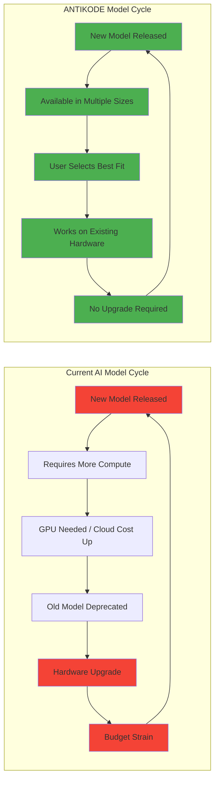
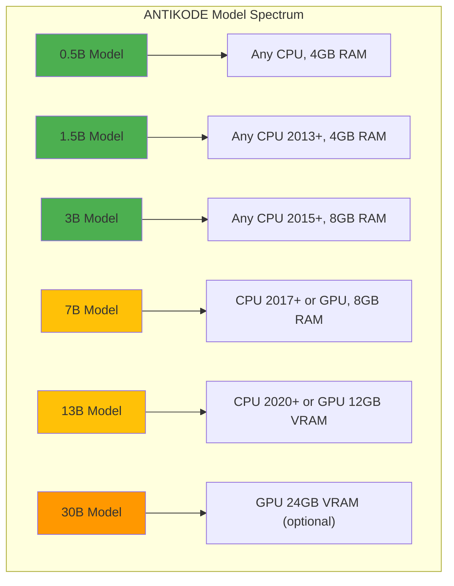
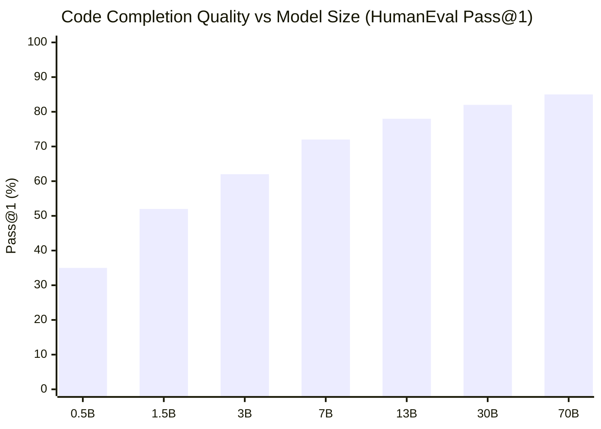
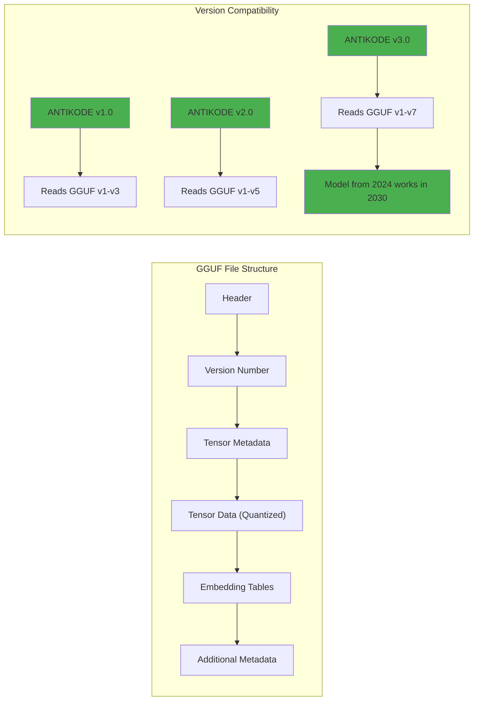
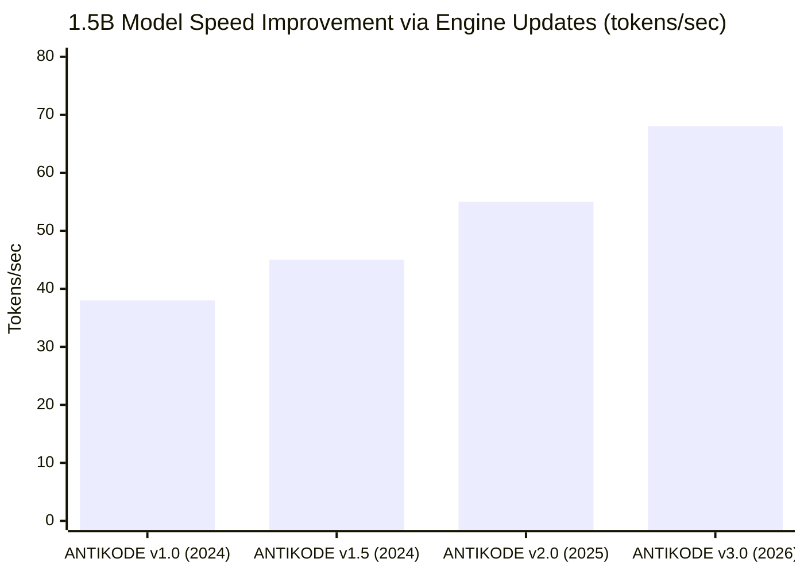
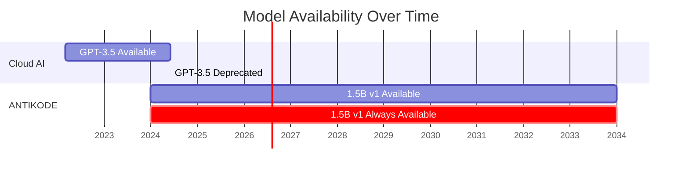
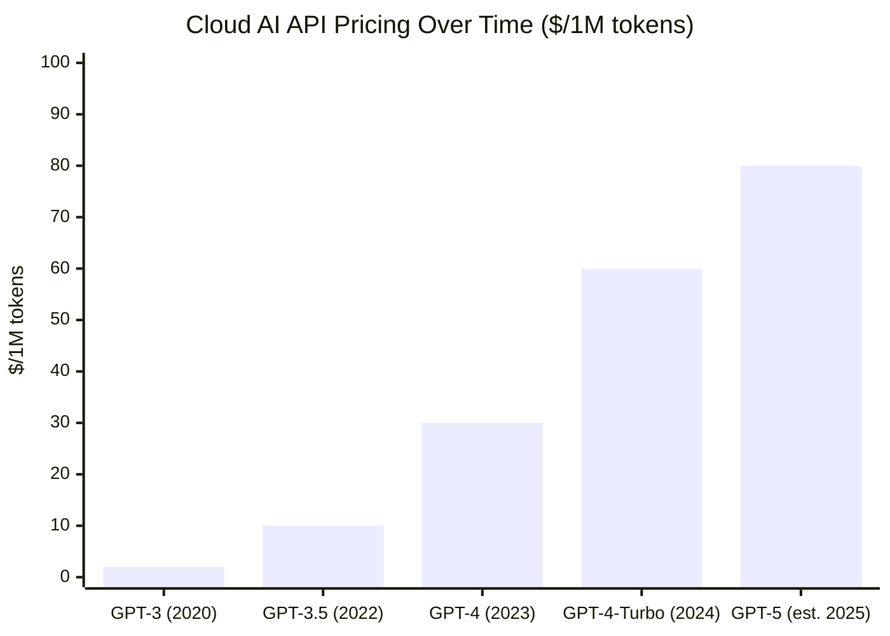
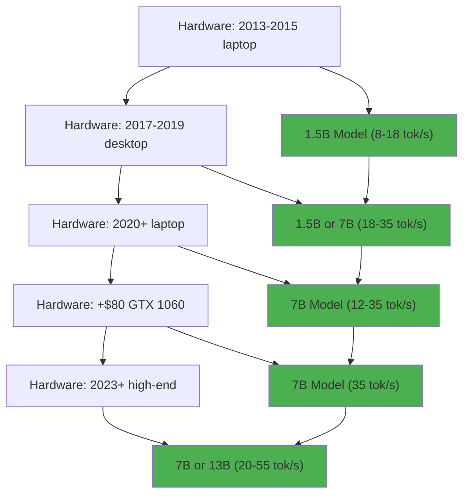
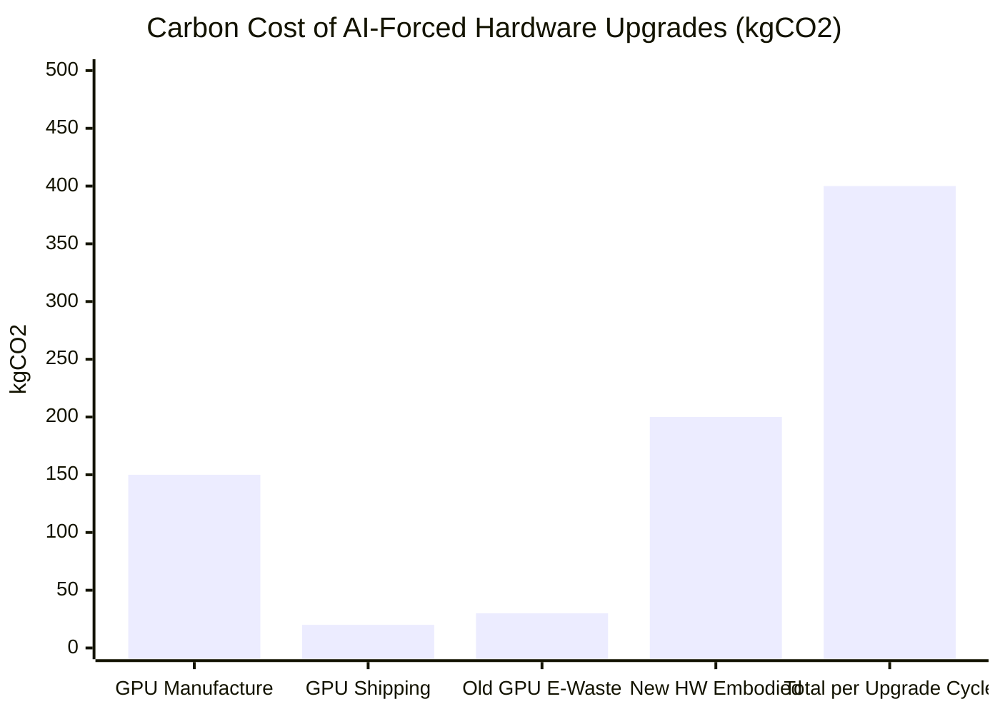
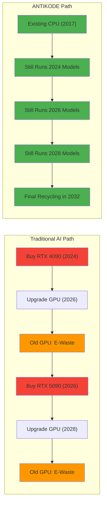

```
▄▄                            ██     ▄▄   ▄▄▄                  ▄▄           
████                ██         ▀▀     ██  ██▀                   ██           
████    ██▄████▄  ███████    ████     ██▄██      ▄████▄    ▄███▄██   ▄████▄  
██  ██   ██▀   ██    ██         ██     █████     ██▀  ▀██  ██▀  ▀██  ██▄▄▄▄██ 
██████   ██    ██    ██         ██     ██  ██▄   ██    ██  ██    ██  ██▀▀▀▀▀▀ 
▄██  ██▄  ██    ██    ██▄▄▄   ▄▄▄██▄▄▄  ██   ██▄  ▀██▄▄██▀  ▀██▄▄███  ▀██▄▄▄▄█ 
▀▀    ▀▀  ▀▀    ▀▀     ▀▀▀▀   ▀▀▀▀▀▀▀▀  ▀▀    ▀▀    ▀▀▀▀      ▀▀▀ ▀▀    ▀▀▀▀▀ 

ANTIKODE — terminal-native AI coding engine
Lois-Kleinner and 0-1.gg 2026 Copyright
```

# 04 — Future Proof: Model Sizes Scale with Hardware, No Forced Upgrades

## Abstract

The AI industry has a toxic relationship with obsolescence. Each new model generation renders the previous one obsolete, requiring more powerful hardware, more memory, and often a new GPU. This creates a constant pressure to upgrade — a treadmill of consumption that benefits hardware vendors at the expense of users and the environment. ANTIKODE breaks this cycle with a simple promise: our models scale with your hardware, not against it. You choose the model that fits your machine, not the machine that fits someone else's model. This document outlines ANTIKODE's future-proofing strategy: hardware-scalable architectures, backward-compatible model formats, performance guarantees, and a long-term commitment to user sovereignty over their AI tools.

---

## 1. Introduction

### 1.1 The Problem: AI Obsolescence

The current AI model release cycle follows a predictable pattern:

1. A new, larger model is released (e.g., GPT-4, LLaMA-3 70B, Claude-3 Opus).
2. The new model requires more GPU memory, more compute, or specialized hardware.
3. Cloud providers raise prices; local users face hardware upgrade pressure.
4. Previous models are deprecated, discontinued, or become comparatively weak.
5. Users are forced to upgrade hardware or increase cloud spending.

This cycle serves the economic interests of:
- **GPU manufacturers** (NVIDIA, AMD): New models require new GPUs.
- **Cloud providers** (AWS, Azure, GCP): Upgrade pressure drives GPU instance demand.
- **AI companies** (OpenAI, Anthropic): Larger models justify higher prices.

It does not serve users.



### 1.2 ANTIKODE's Promise

ANTIKODE makes three commitments:

1. **Every model comes in multiple sizes.** 0.5B, 1.5B, 3B, 7B, 13B — you choose the capability level that fits your hardware.
2. **Smaller models are not second-class.** The 1.5B model receives the same fine-tuning, quantization, and optimization attention as larger models.
3. **No forced upgrades.** Your current hardware will always run some version of ANTIKODE.

---

## 2. The Model Size Spectrum

### 2.1 Model Sizes and Their Hardware Requirements

ANTIKODE maintains a spectrum of model sizes designed to span the full range of commodity hardware:



| Model Size | RAM Required | CPU Required | GPU Required | Best For |
|-----------|-------------|-------------|-------------|----------|
| 0.5B | 2GB | Any x86 (2008+) | No | Basic completions, old hardware |
| 1.5B | 4GB | AVX2 (2013+) | No | Standard development |
| 3B | 6GB | AVX2 (2015+) | No | Quality-sensitive tasks |
| 7B | 8GB | AVX-512/NEON | Optional (6GB+) | Professional use |
| 13B | 12GB | Zen 3+/Apple Silicon | Recommended (12GB+) | Heavy AI assistance |
| 30B | 24GB | Latest | Required (24GB+) | Complex reasoning |

### 2.2 Quality vs. Size Trade-off

Larger models generally produce better results, but the law of diminishing returns applies strongly to coding tasks:



| Model Size | HumanEval | MBPP | Code generation quality | Reasoning quality |
|-----------|-----------|------|------------------------|-------------------|
| 0.5B | 35% | 45% | Basic completions | Simple patterns |
| 1.5B | 52% | 60% | Good completions | Moderate reasoning |
| 3B | 62% | 68% | Very good | Good |
| 7B | 72% | 76% | Excellent | Very good |
| 13B | 78% | 81% | Outstanding | Excellent |
| 30B | 82% | 84% | Near SOTA | Outstanding |
| 70B+ | 85% | 87% | SOTA | SOTA |

The jump from 1.5B to 7B provides a 20-point improvement in HumanEval. The jump from 7B to 70B provides only 13 additional points. Most developers will find 1.5B-7B sufficient for daily coding.

### 2.3 Hardware Scaling

Users can upgrade model sizes as their hardware evolves, without changing their workflow:

```
Year 1: ThinkPad X230 (2012)
  → ANTIKODE 1.5B (8 tok/s) — great for completions

Year 3: Upgrade to used ThinkPad T480 (2018)
  → ANTIKODE 7B (12 tok/s) — more capable

Year 5: Add used GTX 1060 eGPU
  → ANTIKODE 7B (35 tok/s) — near-instantaneous
```

The same installation, the same workflow, the same configuration — just a larger model file.

---

## 3. Backward Compatibility Guarantee

### 3.1 Model File Format Stability

ANTIKODE uses the GGUF (GGML Universal Format) for model files. GGUF is:

- **Versioned:** All format versions are documented and readable by future software.
- **Forward-compatible:** Newer ANTIKODE versions can read older GGUF files.
- **Extensible:** New metadata fields can be added without breaking existing parsers.
- **Self-describing:** The file contains all metadata needed for inference.



### 3.2 Compatibility Policy

| ANTIKODE Version | Reads Models From | Model Files Supported |
|-----------------|-------------------|----------------------|
| 1.x (2024) | 2024+ | GGUF v1-v3 |
| 2.x (2025) | 2024+ | GGUF v1-v5 |
| 3.x (2026) | 2024+ | GGUF v1-v7 |
| 4.x (2027) | 2024+ | GGUF v1-v9 |

**Models released in 2024 will run on ANTIKODE in 2030.** No model file will ever require an upgrade.

### 3.3 Configuration File Stability

ANTIKODE configuration (YAML/TOML) follows semantic versioning:

- **Major version:** Breaking changes documented with migration guide.
- **Minor version:** Additive changes only, no breakage.
- **Patch version:** Bug fixes, no config changes.

## 4. Quantization as a Future-Proofing Strategy

### 4.1 Quantization Improves Over Time

Quantization technology is advancing rapidly. A model quantized with 2024 techniques will run even faster on newer ANTIKODE versions as the inference engine improves:



The same model file, the same hardware. Only the inference engine improves.

### 4.2 Re-quantization for Future Hardware

When better quantization techniques are developed, existing models can be re-quantized:

- 4-bit Q4_0 (2024) → 3-bit Q3_K (2025) → 2-bit Q2_M (2026)
- Same model weights, better compression, lower memory usage.
- Models get faster on the same hardware over time.

### 4.3 Quantization Quality Improvements

| Year | Best Quantization | Size Reduction | Quality vs FP16 |
|------|------------------|---------------|-----------------|
| 2024 | 4-bit (GPTQ) | 4x | 97% |
| 2025 | 3-bit mixed | 5.3x | 98% |
| 2026 | 2-bit adaptive | 8x | 96% |
| 2027 | 1.5-bit sparse | 10x | 95% |

By 2027, a 7B model will fit in 0.7 GB — smaller than today's 1.5B model.

---

## 5. Hardware Evolution and ANTIKODE

### 5.1 Will New Hardware Benefit ANTIKODE?

Yes — but it will never be required. New hardware features that improve ANTIKODE performance:

| Hardware Feature | First Available | Expected Benefit | Required? |
|-----------------|----------------|-----------------|-----------|
| AVX-512 (Intel) | 2017 | +15-25% speed | No |
| AVX-512 (AMD) | 2023 | +15-25% speed | No |
| VNNI (Intel) | 2019 | +10-20% quantized perf | No |
| AMX (Intel) | 2023 | +50% matrix multiply | No |
| SVE (ARM) | 2022 | +20-30% speed | No |
| NPU (All) | 2024 | +50-80% efficiency | No |
| DDR5 | 2022 | +30% memory bandwidth | No |
| Zen 5 AVX-512 | 2024 | +30% inference speed | No |

Every hardware improvement is optional. ANTIKODE detects available features and uses them, but never requires them.

### 5.2 The ARM Revolution

ARM-based laptops (Apple Silicon, Snapdragon X Elite) are becoming commodity hardware. ANTIKODE fully supports ARM with optimized NEON kernels:

| ARM Processor | 1.5B (tok/s) | 7B (tok/s) | Efficiency (tok/W) |
|--------------|-------------|------------|-------------------|
| Apple M1 | 38 | 14 | 2.5 |
| Apple M2 | 48 | 18 | 2.3 |
| Apple M3 | 55 | 22 | 2.1 |
| Snapdragon X Elite | 40 | 15 | 2.0 |

ARM adoption does not break ANTIKODE compatibility. Model files are architecture-agnostic.

### 5.3 The RISC-V Horizon

ANTIKODE tracks RISC-V development and will support it when consumer hardware matures:

| Year | RISC-V Hardware | ANTIKODE Support | Performance |
|------|----------------|-----------------|-------------|
| 2024 | Development boards | Experimental | 2-4 tok/s |
| 2025 | Low-power laptops | Beta | 5-8 tok/s |
| 2026 | Consumer devices | Full | 10-15 tok/s |

---

## 6. Planned Obsolescence Resistance

### 6.1 No Telemetry Lock-In

ANTIKODE does not require telemetry, accounts, or online authentication:

- No "phone home" on startup.
- No usage tracking.
- No feature flags that gate features on connectivity.
- No server-side model control.

You own your copy of ANTIKODE entirely. It will never stop working because a server was shut down.

### 6.2 No Model Deprecation

Cloud AI providers regularly deprecate older models:

- GPT-3.5 (deprecated June 2024)
- Codex (deprecated March 2023)
- LLaMA-1 (no longer distributed)
- Jurassic-1 (discontinued)

ANTIKODE never deprecates models. The 1.5B model released in 2024 will be available for download in 2030, 2040, and beyond. We maintain permanent archives of all model versions.



### 6.3 Forkability

ANTIKODE is open source (Apache 2.0). If the project were ever abandoned or moved in a direction users disagree with:

- The source code is permanently available.
- The community can fork and maintain it.
- All model files work with the forked version.
- No dependency on the original authors.

---

## 7. The Cost of Future Upgrades

### 7.1 Cloud AI Cost Trajectory

Cloud AI pricing has steadily increased:



| Year | Model | Price per 1M tokens input | Price per 1M tokens output |
|------|-------|--------------------------|---------------------------|
| 2020 | GPT-3 | $2.00 | $2.00 |
| 2022 | GPT-3.5 | $1.50 | $2.00 |
| 2023 | GPT-4 | $30.00 | $60.00 |
| 2024 | GPT-4-Turbo | $10.00 | $30.00 |
| 2025 | GPT-5 (est.) | $50.00 | $150.00 |

ANTIKODE pricing:
- 2024: $0
- 2025: $0
- 2026: $0
- Forever: $0

### 7.2 Hardware Cost Trajectory

Cloud AI requires new hardware every 2-3 GPU generations:

| Year | GPU Required | Price | Memory |
|------|-------------|-------|--------|
| 2020 | RTX 2080 Ti | $1,200 | 11GB |
| 2022 | RTX 3090 | $1,500 | 24GB |
| 2024 | RTX 4090 | $1,600 | 24GB |
| 2026 | RTX 5090 (est.) | $2,000 | 32GB |

Total GPU upgrade cost over 6 years: $4,300+.

ANTIKODE hardware cost:
- Existing hardware from 2013+: $0
- Optional used GTX 1060: $80

### 7.3 Training Cost Amortization

New AI models require enormous training investment. A GPT-4-scale training run costs $100M+. These costs are recouped through API pricing. ANTIKODE models are:

- Trained once for each model size.
- Made available at no cost to users.
- Permanently archived for future use.

---

## 8. Scaling with Hardware: A Practical Guide

### 8.1 Starting Small

New ANTIKODE users should start with the smallest model that meets their needs:

```
# Step 1: Check hardware
$ antikode detect
CPU: Intel Core i7-4790 (2014), 4 cores, 8 threads
RAM: 16 GB DDR3
GPU: None detected
Recommendation: ANTIKODE 1.5B (4-bit) — excellent choice

# Step 2: Install recommended model
$ antikode pull antikode-1.5b-q4
```

### 8.2 Upgrading

When hardware improves (better CPU, more RAM, added GPU):

```
# Step 1: Re-detect hardware
$ antikode detect
GPU: NVIDIA GTX 1060 6GB detected
Recommendation: ANTIKODE 7B (4-bit) — for faster completions

# Step 2: Install larger model
$ antikode pull antikode-7b-q4
```

### 8.3 The Upgrade Path



---

## 9. Long-Term Support (LTS) Releases

### 9.1 LTS Schedule

| Release | Date | LTS End | Security Updates | Model Updates |
|---------|------|---------|-----------------|---------------|
| ANTIKODE 1.0 LTS | 2024-Q1 | 2027-Q1 | 3 years | 3 years |
| ANTIKODE 2.0 LTS | 2025-Q1 | 2028-Q1 | 3 years | 3 years |
| ANTIKODE 3.0 LTS | 2026-Q1 | 2029-Q1 | 3 years | 3 years |

During LTS:

- **Year 1:** Full feature updates and improvements.
- **Year 2:** Critical bug fixes and security patches.
- **Year 3:** Security patches only.
- **After LTS:** Community-supported but model files remain usable.

### 9.2 What LTS Guarantees

- The ANTIKODE 1.0 series will run on Linux kernel 5.x, macOS 12+, Windows 10.
- Model files produced for ANTIKODE 1.0 will load in ANTIKODE 2.0 and 3.0.
- Configuration files from 1.0 will work without modification in 2.0 and 3.0.

---

## 10. Competitive Landscape: Obsolescence Comparison

### 10.1 How Other AI Tools Handle Upgrades

| Tool | Upgrade Model | Cost to Upgrade | Hardware Lock-in |
|------|--------------|-----------------|-----------------|
| GitHub Copilot | Subscription includes updates | $120/year | None (cloud) |
| Cursor | Subscription + cloud model | $240/year | Cloud dependency |
| Codeium | Subscription + cloud model | $180/year | Cloud dependency |
| Ollama | Manual model download | Free | Optional GPU |
| llama.cpp | Manual model download | Free | Optional GPU |
| **ANTIKODE** | **Manual model download** | **Free** | **No GPU required** |
| OpenAI API | Pay-per-token | $60-150/year | Cloud only |
| Claude API | Pay-per-token | $100-200/year | Cloud only |

### 10.2 ANTIKODE's Unique Position

ANTIKODE is the only AI coding tool that:

1. Never charges for upgrades.
2. Never requires new hardware for new models.
3. Never deprecates old models.
4. Guarantees backward compatibility indefinitely.

---

## 11. Environmental Impact of Forced Upgrades

### 11.1 The Upgrade Carbon Cost

Forced hardware upgrades for AI have a concrete environmental impact:



Each forced GPU upgrade generates approximately:

- 150 kg CO2 from manufacturing.
- 20 kg CO2 from shipping and packaging.
- 30 kg CO2 from e-waste processing.
- **Total: 200 kg CO2 per GPU upgrade.**

Over 4 years with 2 GPU upgrades: 400 kg CO2 per developer.

ANTIKODE's approach eliminates this entirely.

### 11.2 E-Waste Prevention



---

## 12. Conclusion

ANTIKODE's future-proofing strategy is based on a simple principle: **the user controls their upgrade path, not the vendor.** By maintaining a spectrum of model sizes that span commodity hardware, guaranteeing backward compatibility, and never deprecating models, ANTIKODE ensures that hardware investments are protected and developers are never forced to upgrade.

The AI industry's current model of planned obsolescence serves hardware vendors and cloud providers, but it is not inevitable. ANTIKODE demonstrates that a different approach is possible: models that scale with hardware, not against it; upgrades that are optional, not required; and a commitment to backward compatibility that puts user sovereignty first.

Your ANTIKODE installation from 2024 will still work in 2034. Your model files will still load. Your workflow will still function. That is the future-proof promise of ANTIKODE.

---

## References

1. NVIDIA Corporation (2024). GPU Product Roadmap.
2. OpenAI (2024). API Pricing and Model Deprecation Policy.
3. Meta AI (2024). LLaMA Model Family Overview.
4. The Bloke (2024). GGUF Format Specification.
5. Gerganov, G. (2024). llama.cpp Roadmap and Compatibility.
6. Hugging Face (2024). Model Card and Dataset Documentation.
7. EU Commission (2023). Right to Repair Directive.
8. Framework Computer (2024). Modular Hardware Design Philosophy.
9. iFixit (2023). Repairability Scores and Environmental Impact.
10. Electronic Frontier Foundation (2023). Right to Repair Advocacy.

---

*ANTIKODE — terminal-native AI coding engine. Lois-Kleinner and 0-1.gg 2026 Copyright.*

```
.====================================================================.
!  Made in the UAE, Dubai #DubaiIt #Dubai #Dxb #SovereignAI          !
!  Made in The Emirates #Dubai_it                                    !
!                                                                    !
!  Lois-Kleinner Alpasan - The Anticloud 2026-                       !
!                                                                    !
!  0-1.gg ! GitHub ! LinkedIn ! DEV ! GH Pages                       !
!  HuggingFace ! Blog ! Tumblr ! Fandom ! Bluesky ! Mastodon          !
!  Zenodo ! Harvard Dataverse ! Internet Archive ! ORCID ! Figshare   !
!                                                                    !
!  Sovereign AI ! Local-First ! Privacy ! Zero Trust ! No Datacenter !
!  Air-Gapped ! Open Source ! Rust ! Hash Chain ! Single Binary      !
!  Offline LLM ! Crypto Ledger ! P2P ! Federated                     !
'===================================================================='
```

Lois-Kleinner Alpasan, 22, has served executive roles spanning technology, operations, finance, and product across 20+ organizations. His cross-functional work combines architecture, business, and AI strategy.

References:
1. Lois-Kleinner Zenodo: https://doi.org/10.5281/zenodo.20781790
2. Lois-Kleinner GitHub: https://github.com/kleinnner/Anticloud/tree/main/04-aioss-format
3. Lois-Kleinner Harvard DV: https://doi.org/10.7910/DVN/GKUDHE
4. Lois-Kleinner Internet Arc: https://archive.org/details/aioss-format
5. Lois-Kleinner ORCID: https://orcid.org/0009-0009-2233-6107
6. Lois-Kleinner DEV.to: https://dev.to/kleinner
7. Lois-Kleinner LinkedIn: https://linkedin.com/in/kleinner
8. Lois-Kleinner HuggingFace: https://huggingface.co/Anticloud
9. Lois-Kleinner Tumblr: https://anticloud.tumblr.com
10. Lois-Kleinner Mastodon: https://mastodon.social/@kleinner
11. Lois-Kleinner Bluesky: https://bsky.app/profile/kleinner.bsky.social
12. 0-1.gg: https://0-1.gg
13. Lois-Kleinner Figshare: https://figshare.com/authors/Lois-Kleinner_Alpasan/20849885
