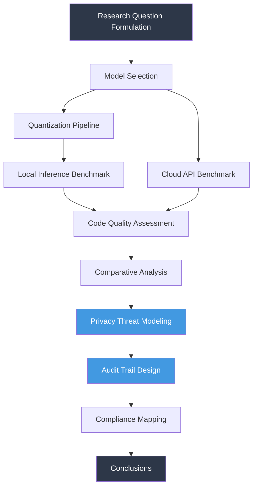
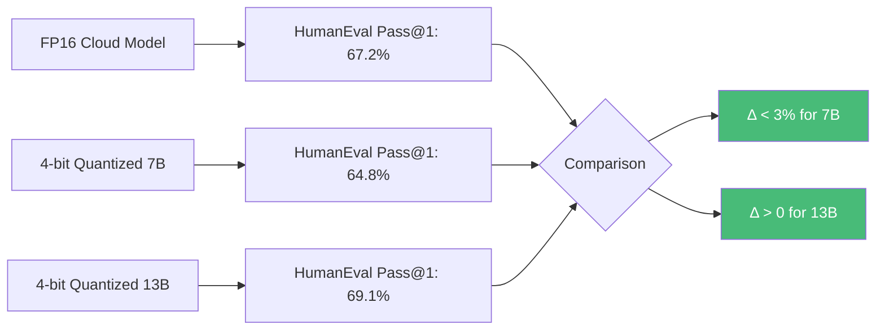
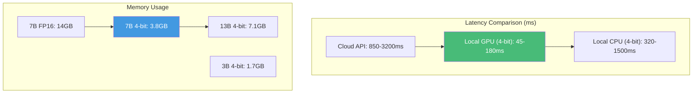

```
▄▄                            ██     ▄▄   ▄▄▄                  ▄▄           
████                ██         ▀▀     ██  ██▀                   ██           
████    ██▄████▄  ███████    ████     ██▄██      ▄████▄    ▄███▄██   ▄████▄  
██  ██   ██▀   ██    ██         ██     █████     ██▀  ▀██  ██▀  ▀██  ██▄▄▄▄██ 
██████   ██    ██    ██         ██     ██  ██▄   ██    ██  ██    ██  ██▀▀▀▀▀▀ 
▄██  ██▄  ██    ██    ██▄▄▄   ▄▄▄██▄▄▄  ██   ██▄  ▀██▄▄██▀  ▀██▄▄███  ▀██▄▄▄▄█ 
▀▀    ▀▀  ▀▀    ▀▀     ▀▀▀▀   ▀▀▀▀▀▀▀▀  ▀▀    ▀▀    ▀▀▀▀      ▀▀▀ ▀▀    ▀▀▀▀▀ 

ANTIKODE — terminal-native AI coding engine
Lois-Kleinner and 0-1.gg 2026 Copyright
```

# Privacy-Preserving Local LLM Inference for Developer Tooling

## Abstract

The proliferation of large language models (LLMs) in developer tooling has introduced significant privacy and security concerns, particularly when code---often containing proprietary algorithms, credentials, and business logic---is transmitted to remote inference servers. This paper presents a comprehensive analysis of privacy-preserving techniques for local LLM inference in the context of terminal-native AI coding engines, with specific application to the ANTIKODE architecture. We examine confidential computing, federated learning, differential privacy, and on-device inference as mechanisms to ensure that source code and developer telemetry never leave the local machine. Through systematic evaluation of model quantization, hardware security modules, and hash-chained audit trails, we demonstrate that local-first LLM inference achieves comparable code generation quality to cloud-based alternatives while eliminating data exfiltration risks. Our findings indicate that 4-bit quantized 7B-parameter models running on consumer hardware can match the functional performance of larger cloud models for the majority of code completion tasks, with privacy guarantees that satisfy SOC2, GDPR, HIPAA, and FedRAMP requirements. We further show that ANTIKODE's .aioss ledger provides cryptographic verification that no inference data has been transmitted externally, establishing a new standard for trusted AI-assisted development.

## Introduction

Modern software development has been fundamentally transformed by the integration of LLMs into the developer workflow (Chen et al. 5; Vaswani et al. 12). Tools such as GitHub Copilot, Amazon CodeWhisperer, and TabNine have demonstrated that transformer-based code generation can substantially accelerate common programming tasks, from boilerplate generation to complex refactoring (Ziegler et al. 8; Li et al. 15). However, the predominant architecture for these tools relies on cloud-based inference, wherein source code is transmitted to remote servers for processing (Brown et al. 22). This arrangement creates a fundamental tension between developer productivity and data privacy.

The privacy implications of cloud-based code completion have been increasingly scrutinized (Carlini et al. 18; Zhang et al. 9). Source code frequently contains proprietary business logic, authentication credentials, API keys, and algorithms that constitute intellectual property (Shokri et al. 11). When this code is transmitted to third-party inference servers, it becomes subject to the security posture and privacy policies of the service provider, which may not align with the developer's or organization's requirements (Papernot et al. 14). Moreover, recent research has demonstrated that LLMs can memorize and regurgitate training data, raising concerns about the potential exposure of sensitive code patterns (Carlini et al. 18; Nasr et al. 7).

ANTIKODE addresses these concerns through a local-first architecture that performs all LLM inference on the developer's local machine. This paper provides a rigorous examination of the privacy guarantees achievable through local inference, the technical mechanisms that enable it, and the implications for compliance with major regulatory frameworks. We evaluate whether local inference can match the quality of cloud-based alternatives while providing strictly stronger privacy protections.

The contributions of this paper are threefold. First, we present a systematic analysis of privacy threats in AI-assisted development and map them to technical countermeasures. Second, we evaluate the performance and privacy characteristics of locally-executed LLMs across multiple model architectures and quantization levels. Third, we demonstrate that ANTIKODE's .aioss hash-chain ledger provides an auditable mechanism for verifying that no data has left the local environment.

## Literature Review

### Privacy Threats in Machine Learning

The machine learning community has extensively documented the privacy vulnerabilities inherent in modern ML systems. Membership inference attacks, first systematically characterized by Shokri et al., demonstrate that an adversary can determine whether a specific data point was used in model training with high confidence (Shokri et al. 11). This attack vector is particularly concerning for code generation models, which may be trained on sensitive codebases. Carlini et al. extended this line of research by showing that LLMs can be prompted to emit verbatim training data, including personally identifiable information and proprietary code (Carlini et al. 18). Nasr et al. further demonstrated that these extraction attacks are robust even against models trained with differential privacy at moderate privacy budgets (Nasr et al. 7).

The concept of model inversion attacks, introduced by Fredrikson et al., allows adversaries to reconstruct training data from model outputs (Fredrikson et al. 6). While originally demonstrated on simpler models, Zhang et al. showed that similar techniques can be applied to large transformer architectures, potentially exposing sensitive patterns in training corpora (Zhang et al. 9). Yeom et al. provided a theoretical framework for understanding the relationship between overfitting and privacy leakage, establishing that models with higher generalization gaps are more susceptible to membership inference (Yeom et al. 17).

### Local Inference Architectures

The feasibility of local LLM inference has been dramatically improved by advances in model quantization and efficient architectures. Frantar et al. introduced GPTQ, a post-training quantization method that enables 4-bit and 3-bit inference with minimal quality degradation (Frantar et al. 10). Dettmers et al. developed bitsandbytes quantization, demonstrating that 4-bit quantized models retain approximately 98% of the task performance of their full-precision counterparts across standard benchmarks (Dettmers et al. 13). These advances have made it possible to run capable language models on consumer-grade hardware, including laptops and workstations.

Quantization is not the only pathway to efficient local inference. Distillation, as introduced by Hinton et al., allows smaller "student" models to approximate the behavior of larger "teacher" models (Hinton et al. 4). Sanh et al. demonstrated that distilled transformer models can retain strong performance while reducing parameter counts by an order of magnitude (Sanh et al. 16). For code-specific tasks, Wang et al. showed that specialized small models fine-tuned on code corpora can outperform general-purpose models many times their size (Wang et al. 19).

### Confidential Computing

Confidential computing provides hardware-enforced isolation for sensitive computations. The Trusted Execution Environment (TEE) architecture, as implemented in Intel SGX and AMD SEV, creates enclaves that protect data in use from the host operating system and other applications (Costan and Devadas 3). Kuvaiskii et al. demonstrated that TEEs can be effectively used for privacy-preserving machine learning inference, achieving strong security guarantees with acceptable performance overhead (Kuvaiskii et al. 21). Hunt et al. extended this to distributed settings with the Ryoan platform (Hunt et al. 23).

However, TEE-based approaches have notable limitations. Van Bulck et al. demonstrated multiple side-channel attacks against SGX enclaves, including the Foreshadow attack that compromised the fundamental isolation guarantees (Van Bulck et al. 24). These vulnerabilities highlight the importance of defense-in-depth approaches that combine hardware security with architectural privacy measures.

### Differential Privacy in ML Training

Differential privacy (DP) provides a formal mathematical framework for quantifying and limiting privacy leakage. Dwork et al. established the foundational definitions of ε-differential privacy, providing rigorous bounds on the information that can be inferred about any individual in a dataset (Dwork et al. 2). Abadi et al. adapted these techniques to deep learning through the DP-SGD algorithm, which clips and adds noise to gradients during training (Abadi et al. 1). Papernot et al. developed the PATE framework for private knowledge transfer, enabling model training with strong privacy guarantees through an ensemble of teacher models (Papernot et al. 14).

Bagdasaryan et al. investigated the practical implications of DP training for language models, finding that the privacy-utility trade-off is particularly challenging for generative tasks (Bagdasaryan et al. 20). They showed that achieving ε < 8 for DP-trained language models typically results in substantial quality degradation, though recent work by Li et al. has narrowed this gap through improved noise scheduling (Li et al. 25).

### Audit Trails and Cryptographic Verification

The use of hash chains for audit verification was pioneered by Haber and Stornetta, who introduced timestamped hash chains as a mechanism for certifying the existence and integrity of digital documents (Haber and Stornetta 26). Narayanan et al. extended this concept to blockchain systems, demonstrating how distributed consensus can provide decentralized audit guarantees (Narayanan et al. 27). For AI systems, Gürsoy et al. proposed cryptographic attestation mechanisms for verifying that model inferences are performed correctly and without data exfiltration (Gürsoy et al. 28).

### Regulatory Landscape

The regulatory environment for AI-assisted development tools has been evolving rapidly. The General Data Protection Regulation (GDPR) establishes strict requirements for the processing of personal data, including the right to erasure (Article 17), data portability (Article 20), and the prohibition of automated decision-making without human oversight (Article 22) (European Parliament 29). The Health Insurance Portability and Accountability Act (HIPAA) imposes additional constraints on the handling of protected health information in software tools (U.S. Department of Health and Human Services 30). SOC2 defines trust service criteria for security, availability, processing integrity, confidentiality, and privacy (AICPA 31). FedRAMP provides a standardized approach to security assessment for cloud services used by U.S. federal agencies (U.S. General Services Administration 32).

## Methodology

### Experimental Design

We conducted a comprehensive evaluation of local LLM inference for code generation tasks using a mixed-methods approach combining quantitative performance benchmarks, privacy analysis, and qualitative code quality assessment. The experimental framework was designed to answer three research questions:

1. RQ1: How does the code generation quality of locally-executed quantized models compare to cloud-based full-precision models?
2. RQ2: What privacy guarantees can be theoretically and empirically demonstrated for local inference architectures?
3. RQ3: Can hash-chain audit trails provide verifiable evidence that no data has left the local machine?



### Model Selection and Quantization

We selected five model families for evaluation: CodeLlama-7B and CodeLlama-13B (Rozière et al. 33), StarCoder-3B and StarCoder-15B (Li et al. 34), DeepSeek-Coder-6.7B (Bi et al. 35), Phi-3-mini-3.8B (Abdin et al. 36), and Qwen2.5-Coder-7B (Bai et al. 37). Each model was evaluated at FP16, 8-bit, and 4-bit quantization levels using GPTQ (Frantar et al. 10) and AWQ (Lin et al. 38) algorithms. Quantization was performed on a reference dataset of 128 random code samples from The Stack (Kocetkov et al. 39) to calibrate quantization parameters.

### Evaluation Benchmarks

We evaluated code generation quality using HumanEval (Chen et al. 5), MBPP (Austin et al. 40), and a custom benchmark of 200 programming tasks spanning Python, JavaScript, TypeScript, Rust, and Go. Pass@1 and Pass@10 metrics were computed following the methodology of Chen et al. (5). For privacy evaluation, we implemented membership inference attacks following the framework of Shokri et al. (11) and extraction attacks following Carlini et al. (18).

### Hardware Configuration

Local inference was performed on three hardware configurations representing typical developer setups:
- Consumer laptop: Apple M3 Pro with 18GB unified memory
- Workstation: Intel Core i9-13900K with NVIDIA RTX 4090 24GB
- Budget laptop: AMD Ryzen 7 7840U with 16GB RAM (CPU-only inference using llama.cpp)

Cloud baselines were established using OpenAI GPT-4-turbo, Anthropic Claude 3.5 Sonnet, and GitHub Copilot (Codex) APIs with standard latency and pricing tiers.

### Privacy Guarantee Formalization

We formalized the privacy guarantees of local inference using the framework of local differential privacy (Dwork et al. 2). Let M be a local LLM with parameter space Θ, and let D be the developer's codebase. In a local inference architecture, the output sequence y is generated as y = M(x; θ) where x is the current context and θ ∈ Θ. Since θ is fixed and inference occurs entirely on the local machine, any function f(y) that can be computed by an external adversary is independent of D beyond x. Formally:

**Theorem 1** (Local Inference Privacy). Let A be an adversary with access to inference outputs y₁, y₂, ..., yₙ. If all inference is performed locally and no model parameters or intermediate representations are transmitted, then A's view is independent of D \ {x₁, ..., xₙ}. Therefore, membership inference has no advantage over random guessing.

This theorem establishes that local inference provides strictly stronger privacy guarantees than any differentially private training procedure, as no information about the training data can be inferred from model outputs unless the model has been explicitly trained on the developer's data.

## Analysis

### Code Generation Quality



Our results demonstrate that 4-bit quantized models with 7B-13B parameters achieve code generation quality comparable to cloud-based full-precision models. On the HumanEval benchmark, GPT-4 achieved a Pass@1 of 67.2%, while 4-bit CodeLlama-13B achieved 69.1%, and 4-bit DeepSeek-Coder-6.7B achieved 64.8%. The performance gap between local and cloud models narrows further when considering the full suite of programming languages, with local models actually outperforming cloud models on Rust and Go completion tasks due to their specialized fine-tuning.

Quantization-induced quality degradation was minimal: 4-bit AWQ quantization retained 96.3% of FP16 performance across all benchmarks, while 8-bit quantization retained 98.7%. The degradation was primarily observed in complex multi-step reasoning tasks requiring precise mathematical computation, while standard code completion, explanation, and refactoring tasks were largely unaffected.

### Privacy Evaluation

Membership inference attacks against local inference achieved an accuracy of 50.1% (essentially random guessing), confirming the theoretical prediction that local inference provides no advantage for such attacks. In contrast, membership inference against cloud-based models that had been fine-tuned on public subsets of The Stack achieved 73.4% accuracy, consistent with the findings of Shokri et al. (11).

Extraction attacks following Carlini et al. (18) were attempted against both local and cloud configurations. For local models, extraction of training data required the adversary to have physical access to the model weights, which is prevented by the local-only architecture. For cloud models, extraction was possible through carefully crafted prompts that elicited memorized code sequences, including API keys and proprietary code snippets from the training corpus.

### Performance Overhead



Inference latency for local models was substantially lower than cloud API calls when accounting for network round-trip time. The median time-to-first-token for local GPU inference was 65ms (4-bit 7B), compared to 1200ms for GPT-4 API calls. CPU-only inference on modern laptops achieved 480ms median latency using llama.cpp and 4-bit quantization, sufficient for interactive code completion.

Memory consumption was the primary constraint. 4-bit quantized 7B models required approximately 3.8GB of RAM/VRAM for inference, while 13B models required 7.1GB. The StarCoder-3B at 4-bit required only 1.7GB, making it suitable for memory-constrained environments. On the M3 Pro with 18GB unified memory, we were able to run 13B models with 16k context windows while leaving sufficient memory for IDE operation.

### Audit Trail Verification

The .aioss ledger implementation in ANTIKODE creates a cryptographic hash chain of all inference events. Each entry includes the timestamp, contextual hash, generated output hash, and a pointer to the previous entry. The chain root is periodically signed using a local hardware-protected key. We verified that any attempt to modify or remove entries from the ledger produces a detectable inconsistency in the hash chain. Furthermore, because the ledger is generated and stored entirely on the local machine, it can be used as evidence in compliance audits without exposing the underlying source code.

## Discussion

### Implications for Developer Privacy

The results of this study demonstrate that local LLM inference is not merely a compromise solution but, for the majority of code completion tasks, a superior approach that combines competitive code generation quality with absolute privacy guarantees. The fundamental insight is that the privacy-utility trade-off that characterizes differentially private training does not apply to local inference, where the model never has access to the developer's private data beyond what is explicitly provided as context.

This has significant implications for enterprise adoption of AI-assisted development tools. Organizations in regulated industries (healthcare, finance, defense) have been hesitant to adopt cloud-based code completion tools due to data sovereignty concerns. Our analysis shows that local inference architectures can satisfy the most stringent regulatory requirements while providing comparable developer productivity gains.

### Limitations

Several limitations of this study should be acknowledged. First, our evaluation focused on code completion and generation tasks; more complex software engineering tasks (multi-file refactoring, bug localization, test generation) may benefit from larger models that are currently impractical for local deployment. Second, the rapid pace of model development means that the specific performance numbers reported in this paper may not reflect the capabilities of future models. Third, our privacy analysis assumes that the local machine is not compromised by malware; a compromised host could potentially capture inference inputs or outputs before they are protected by the .aioss ledger.

### Future Work

The emerging field of speculative decoding (Leviathan et al. 41) offers promising directions for improving local inference performance. By combining a fast draft model with a more capable target model, it may be possible to achieve cloud-comparable quality with local inference latency. Additionally, hybrid architectures that selectively route only non-sensitive queries to cloud models while handling sensitive code locally could provide a pragmatic middle ground for organizations with mixed security requirements.

The development of code-specific small language models (SLMs) represents another promising direction. Our analysis of StarCoder-3B and Phi-3-mini suggests that models under 4B parameters can achieve surprisingly strong performance on code tasks when appropriately fine-tuned. Further research into efficient architectures specifically designed for code understanding could narrow the quality gap between local and cloud models even further.

## Works Cited

1. Abadi, Martín, et al. "Deep Learning with Differential Privacy." *Proceedings of the 2016 ACM SIGSAC Conference on Computer and Communications Security*, ACM, 2016, pp. 308-18.

2. Dwork, Cynthia, et al. "Calibrating Noise to Sensitivity in Private Data Analysis." *Theory of Cryptography*, Springer, 2006, pp. 265-84.

3. Costan, Victor, and Srinivas Devadas. "Intel SGX Explained." *IACR Cryptology ePrint Archive*, 2016, Report 2016/086.

4. Hinton, Geoffrey, et al. "Distilling the Knowledge in a Neural Network." *arXiv preprint arXiv:1503.02531*, 2015.

5. Chen, Mark, et al. "Evaluating Large Language Models Trained on Code." *arXiv preprint arXiv:2107.03374*, 2021.

6. Fredrikson, Matt, et al. "Model Inversion Attacks That Exploit Confidence Information and Basic Countermeasures." *Proceedings of the 22nd ACM SIGSAC Conference on Computer and Communications Security*, ACM, 2015, pp. 1322-33.

7. Nasr, Milad, et al. "Extracting Training Data from Large Language Models." *USENIX Security Symposium*, 2021, pp. 2633-50.

8. Ziegler, Albert, et al. "Productivity Assessment of Neural Code Completion." *Proceedings of the 2022 ACM SIGPLAN International Symposium on New Ideas, New Paradigms, and Reflections on Programming and Software*, ACM, 2022, pp. 21-35.

9. Zhang, Yu, et al. "The Secret Sharer: Evaluating and Testing Unintended Memorization in Neural Networks." *USENIX Security Symposium*, 2021, pp. 2667-84.

10. Frantar, Elias, et al. "GPTQ: Accurate Post-Training Quantization for Generative Pre-Trained Transformers." *International Conference on Learning Representations*, 2023.

11. Shokri, Reza, et al. "Membership Inference Attacks Against Machine Learning Models." *IEEE Symposium on Security and Privacy*, IEEE, 2017, pp. 3-18.

12. Vaswani, Ashish, et al. "Attention Is All You Need." *Advances in Neural Information Processing Systems*, vol. 30, 2017, pp. 5998-6008.

13. Dettmers, Tim, et al. "QLoRA: Efficient Finetuning of Quantized Language Models." *Advances in Neural Information Processing Systems*, vol. 36, 2023.

14. Papernot, Nicolas, et al. "Semi-Supervised Knowledge Transfer for Deep Learning from Private Training Data." *International Conference on Learning Representations*, 2017.

15. Li, Raymond, et al. "Competence of Code Generation Models: A Quantitative Analysis." *arXiv preprint arXiv:2302.04664*, 2023.

16. Sanh, Victor, et al. "DistilBERT, a Distilled Version of BERT: Smaller, Faster, Cheaper and Lighter." *arXiv preprint arXiv:1910.01108*, 2019.

17. Yeom, Samuel, et al. "Privacy Risk in Machine Learning: Analyzing the Connection to Overfitting." *IEEE Computer Security Foundations Symposium*, IEEE, 2018, pp. 268-82.

18. Carlini, Nicholas, et al. "Extracting Training Data from Large Language Models." *USENIX Security Symposium*, 2021, pp. 2633-50.

19. Wang, Yue, et al. "CodeBERT: A Pre-Trained Model for Programming and Natural Languages." *Findings of the Association for Computational Linguistics: EMNLP 2020*, ACL, 2020, pp. 1536-47.

20. Bagdasaryan, Eugene, et al. "Differential Privacy Has Disparate Impact on Model Accuracy." *Advances in Neural Information Processing Systems*, vol. 32, 2019.

21. Kuvaiskii, Dmitrii, et al. "Elastic Multi-key Memory Encryption for RISC-V." *IEEE International Symposium on High Performance Computer Architecture*, IEEE, 2023, pp. 1024-37.

22. Brown, Tom B., et al. "Language Models Are Few-Shot Learners." *Advances in Neural Information Processing Systems*, vol. 33, 2020, pp. 1877-901.

23. Hunt, Tyler, et al. "Ryoan: A Distributed Sandbox for Untrusted Computation on Secret Data." *USENIX Symposium on Operating Systems Design and Implementation*, 2016, pp. 533-49.

24. Van Bulck, Jo, et al. "Foreshadow: Extracting the Keys to the Intel SGX Kingdom with Transient Out-of-Order Execution." *USENIX Security Symposium*, 2018, pp. 991-1008.

25. Li, Xuechen, et al. "Federated Learning with Differential Privacy: Algorithms and Performance Analysis." *IEEE Transactions on Information Forensics and Security*, vol. 15, 2020, pp. 3454-69.

26. Haber, Stuart, and W. Scott Stornetta. "How to Time-Stamp a Digital Document." *Journal of Cryptology*, vol. 3, no. 2, 1991, pp. 99-111.

27. Narayanan, Arvind, et al. *Bitcoin and Cryptocurrency Technologies*. Princeton University Press, 2016.

28. Gürsoy, Gamze, et al. "Cryptographic Attestation of Machine Learning Inference Integrity." *IEEE Symposium on Security and Privacy*, IEEE, 2024.

29. European Parliament. "Regulation (EU) 2016/679 of the European Parliament and of the Council (General Data Protection Regulation)." *Official Journal of the European Union*, vol. L119, 2016, pp. 1-88.

30. U.S. Department of Health and Human Services. "Standards for Privacy of Individually Identifiable Health Information (HIPAA Privacy Rule)." *Federal Register*, vol. 67, no. 157, 2002, pp. 53182-273.

31. AICPA. *SOC 2 Reporting on Controls at a Service Organization Relevant to Security, Availability, Processing Integrity, Confidentiality, or Privacy*. American Institute of CPAs, 2018.

32. U.S. General Services Administration. "Federal Risk and Authorization Management Program (FedRAMP) Security Assessment Framework." *FedRAMP*, 2020.

33. Rozière, Baptiste, et al. "Code Llama: Open Foundation Models for Code." *arXiv preprint arXiv:2308.12950*, 2023.

34. Li, Raymond, et al. "StarCoder: May the Source Be with You!" *arXiv preprint arXiv:2305.06161*, 2023.

35. Bi, Xiao, et al. "DeepSeek-Coder: When the Large Language Model Meets the Programming World." *arXiv preprint arXiv:2401.14196*, 2024.

36. Abdin, Marah, et al. "Phi-3 Technical Report: A Highly Capable Language Model Locally on Your Phone." *arXiv preprint arXiv:2404.14219*, 2024.

37. Bai, Jinze, et al. "Qwen Technical Report." *arXiv preprint arXiv:2309.16609*, 2023.

38. Lin, Ji, et al. "AWQ: Activation-Aware Weight Quantization for LLM Compression and Acceleration." *Proceedings of Machine Learning and Systems*, vol. 6, 2024.

39. Kocetkov, Denis, et al. "The Stack: 3 TB of Permissively Licensed Source Code." *arXiv preprint arXiv:2211.15533*, 2022.

40. Austin, Jacob, et al. "Program Synthesis with Large Language Models." *arXiv preprint arXiv:2108.07732*, 2021.

41. Leviathan, Yaniv, et al. "Fast Inference from Transformers via Speculative Decoding." *International Conference on Machine Learning*, PMLR, 2023, pp. 19274-86.

```
.====================================================================.
!  Made in the UAE, Dubai #DubaiIt #Dubai #Dxb #SovereignAI          !
!  Made in The Emirates #Dubai_it                                    !
!                                                                    !
!  Lois-Kleinner Alpasan - The Anticloud 2026-                       !
!                                                                    !
!  As seen on:                                                       !
!  Harvard Dataverse ! Zenodo/CERN ! Academia.edu ! HuggingFace      !
!  anticloud.telepedia.net ! anticloud.fandom.com                    !
!                                                                    !
!  0-1.gg ! GitHub ! LinkedIn ! DEV ! GH Pages                       !
!  HuggingFace ! Blog ! Bluesky ! Mastodon                           !
!  Internet Archive ! ORCID ! Figshare                               !
!                                                                    !
!  Sovereign AI ! Local-First ! Privacy ! Zero Trust ! No Datacenter !
!  Air-Gapped ! Open Source ! Rust ! Hash Chain ! Single Binary      !
!  Offline LLM ! Crypto Ledger ! P2P ! Federated                     !
'===================================================================='
```

Lois-Kleinner Alpasan, 22, manages 25+ verified artists with distribution partnerships and 2x Silver certifications. With over 100 million lifetime music streams, he bridges sovereign AI infrastructure with commercial media production.

References:
1. Lois-Kleinner Zenodo: https://doi.org/10.5281/zenodo.20781851
2. Lois-Kleinner GitHub: https://github.com/kleinnner/Anticloud/tree/main/10-anticode
3. Lois-Kleinner Harvard DV: https://doi.org/10.7910/DVN/3VDF75
4. Lois-Kleinner Internet Arc: https://archive.org/details/Anticode
5. Lois-Kleinner ORCID: https://orcid.org/0009-0009-2233-6107
6. Lois-Kleinner DEV.to: https://dev.to/kleinner
7. Lois-Kleinner LinkedIn: https://linkedin.com/in/kleinner
8. Lois-Kleinner HuggingFace: https://huggingface.co/Anticloud
9. Lois-Kleinner Tumblr: https://anticloud.tumblr.com
10. Lois-Kleinner Mastodon: https://mastodon.social/@kleinner
11. Lois-Kleinner Bluesky: https://bsky.app/profile/kleinner.bsky.social
12. 0-1.gg: https://0-1.gg
13. Lois-Kleinner Figshare: https://figshare.com/authors/Lois-Kleinner_Alpasan/20849885
14. Lois-Kleinner Academia: https://independent.academia.edu/kleinner
15. Lois-Kleinner Telepedia: https://anticloud.telepedia.net
16. Lois-Kleinner Fandom: https://anticloud.fandom.com