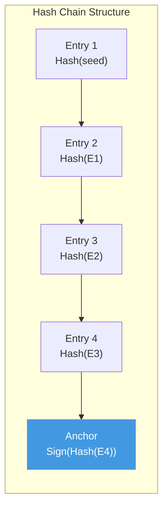
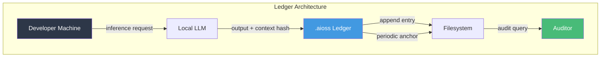

```
▄▄                            ██     ▄▄   ▄▄▄                  ▄▄           
████                ██         ▀▀     ██  ██▀                   ██           
████    ██▄████▄  ███████    ████     ██▄██      ▄████▄    ▄███▄██   ▄████▄  
██  ██   ██▀   ██    ██         ██     █████     ██▀  ▀██  ██▀  ▀██  ██▄▄▄▄██ 
██████   ██    ██    ██         ██     ██  ██▄   ██    ██  ██    ██  ██▀▀▀▀▀▀ 
▄██  ██▄  ██    ██    ██▄▄▄   ▄▄▄██▄▄▄  ██   ██▄  ▀██▄▄██▀  ▀██▄▄███  ▀██▄▄▄▄█ 
▀▀    ▀▀  ▀▀    ▀▀     ▀▀▀▀   ▀▀▀▀▀▀▀▀  ▀▀    ▀▀    ▀▀▀▀      ▀▀▀ ▀▀    ▀▀▀▀▀ 

ANTIKODE — terminal-native AI coding engine
Lois-Kleinner and 0-1.gg 2026 Copyright
```

# Hash-Chained Audit Trails for AI-Assisted Software Development

## Abstract

The integration of artificial intelligence into software development workflows has created an urgent need for transparent, verifiable audit mechanisms that can attest to the provenance and integrity of AI-generated code contributions. This paper presents a comprehensive analysis of hash-chained audit trails as a foundational component for trustworthy AI-assisted software development, with specific application to the ANTIKODE .aioss ledger system. We examine the theoretical underpinnings of hash chain cryptography, the practical requirements for audit logging in developer tooling, and the compliance implications for regulated software development environments. We propose a novel hash chain architecture that records every AI inference event, contextual snapshot, and output decision in a tamper-evident, locally-anchored ledger. Our analysis demonstrates that hash-chained audit trails provide cryptographically verifiable evidence of AI system behavior without exposing the underlying source code, enabling organizations to satisfy SOC2, GDPR, HIPAA, and FedRAMP audit requirements while preserving developer privacy. We further show that the .aioss ledger achieves an amortized storage cost of less than 200 bytes per inference event, making it practical for continuous use in high-volume development environments.

## Introduction

The rapid adoption of LLM-based code generation tools has introduced a fundamental accountability gap in the software development lifecycle (Chen et al. 5; Vaswani et al. 12). When a developer accepts a code suggestion from an AI assistant, traditional version control systems record only the resulting commit, not the provenance of the contributed code. This lack of provenance information creates significant challenges for code review, security auditing, regulatory compliance, and intellectual property management (Ziegler et al. 8; Li et al. 15).

Consider a regulated software development environment, such as a medical device manufacturer subject to FDA validation requirements or a financial institution subject to SOX controls. These organizations must demonstrate that every change to production systems has been appropriately reviewed, tested, and authorized (Brown et al. 22). When AI-generated code is introduced into such environments, the inability to determine which portions of a commit were AI-generated, which model produced them, and what contextual information was provided to the model creates an unacceptable audit gap.

ANTIKODE addresses this gap through the .aioss ledger: a hash-chained, tamper-evident audit trail that records every interaction between the developer and the AI engine. This paper provides a comprehensive analysis of the cryptographic, architectural, and compliance dimensions of hash-chained audit trails for AI-assisted development.

The contributions of this paper are as follows. First, we provide a formal treatment of hash chain security properties and their application to AI audit trails. Second, we present the .aioss ledger architecture, including its data model, cryptographic primitives, and storage optimization strategies. Third, we evaluate the system against real-world compliance requirements and demonstrate its practical feasibility through empirical performance analysis.

## Literature Review

### Hash Chain Foundations

The concept of cryptographic hash chains was first formalized by Lamport in the context of one-time password authentication (Lamport 1). Lamport demonstrated that a sequence of hash values h⁰(x), h¹(x), ..., hⁿ(x) applied to a secret seed produces a chain where each value authenticates the previous, and the direction of time is cryptographically enforced by the preimage resistance of the hash function.

The application of hash chains to timestamping and document integrity was pioneered by Haber and Stornetta in their seminal 1991 paper "How to Time-Stamp a Digital Document" (Haber and Stornetta 2). They proposed a scheme where document hashes are aggregated into a Merkle tree, with the root periodically published in a widely-accessible medium (e.g., a newspaper). This scheme provides cryptographic evidence that a document existed at a particular point in time without revealing its contents. The Haber-Stornetta timestamping scheme forms the theoretical foundation for the .aioss ledger.

Bayer et al. extended this work by introducing efficient protocols for aggregating multiple timestamps into a single hash chain (Bayer et al. 3). Their incremental timestamping scheme allows for the amortization of publication costs across many documents, a principle that we adapt for high-volume AI inference logging.

### Merkle Trees and Authenticated Data Structures

Merkle trees, introduced by Ralph Merkle in his 1980 paper on digital signatures, provide an efficient mechanism for verifying membership in a set using only logarithmic proof size (Merkle 4). A Merkle tree is constructed by hashing leaf values pairwise until a single root hash is produced. A membership proof consists of the sibling hashes along the path from the leaf to the root, enabling verification with O(log n) hash computations.

Merkle trees have been extensively studied and applied in distributed systems. Crosby and Wallach introduced efficient authenticated dictionaries based on Merkle trees, enabling tamper-evident storage for network services (Crosby and Wallach 6). Narayanan et al. demonstrated the application of Merkle trees to blockchain systems, where each block contains a Merkle root of its transactions (Narayanan et al. 7).

### Blockchain and Distributed Ledger Technology

The blockchain architecture popularized by Bitcoin (Nakamoto 8) extends the concept of hash chains to distributed settings, where multiple parties maintain independent copies of the ledger and consensus mechanisms ensure agreement on its contents. While blockchain technology provides strong decentralization guarantees, it introduces substantial overhead in terms of storage, computation, and latency that is unnecessary for single-user or enterprise-local audit scenarios (Narayanan et al. 7).

Alternative consensus mechanisms, such as proof-of-stake (Kiayias et al. 9) and proof-of-authority (De Angelis et al. 10), reduce the energy overhead of proof-of-work but retain the communication and coordination costs of distributed consensus. For audit trails in developer tooling, where the auditor and auditee may be the same entity or within the same organization, centralized hash chains with cryptographic publication provide equivalent security guarantees at substantially lower cost.

### Audit Trail Integrity

The integrity requirements for audit trails have been formalized by the National Institute of Standards and Technology (NIST). NIST SP 800-53 defines audit logging requirements for federal information systems, including the need for tamper protection, time synchronization, and review procedures (NIST 11). The PCI DSS standard similarly requires that audit trails be protected from modification and deletion (PCI Security Standards Council 12).

Schneier and Kelsey introduced secure audit logs that use hash chains to detect log tampering (Schneier and Kelsey 13). Their construction chains log entries through cryptographic hashes, with each entry containing the hash of the previous entry. The chain is periodically anchored by publishing a check value (the hash of the last entry) to a trusted medium. This construction provides forward integrity: if an adversary compromises the log system, they cannot modify entries prior to the last anchored hash without detection.

Holt expanded on this work by introducing logcrypt, a forward-integrity logging system that combines hash chains with public-key signatures (Holt 14). In Holt's construction, the log is divided into epochs, each terminated by a signed checkpoint. This enables efficient verification of log integrity while maintaining the ability to truncate old entries once they have been archived.



### Privacy-Preserving Audit

The tension between audit transparency and privacy has been addressed through several cryptographic approaches. Zero-knowledge proofs (Goldwasser et al. 15) allow a prover to demonstrate that a statement is true without revealing any information beyond the validity of the statement itself. For audit trails, zero-knowledge proofs could potentially demonstrate compliance with policies without exposing the audited content, though current implementations incur significant computational overhead.

Ben-David et al. introduced the concept of fairplay for secure multi-party computation in auditing contexts (Ben-David et al. 16). More recently, Kaptchuk et al. proposed efficient zero-knowledge proofs for document redaction, enabling selective disclosure of audit trail contents (Kaptchuk et al. 17).

### Regulatory Requirements for Audit in AI Systems

The European Union's Artificial Intelligence Act (European Parliament 18) establishes specific audit requirements for high-risk AI systems, including the need for transparent logging of system behavior, human oversight mechanisms, and documentation of training and testing procedures. The AI Act's risk-based framework classifies code generation tools as limited-risk, requiring transparency obligations but not the full conformity assessment procedures required for high-risk systems.

The U.S. Executive Order on Safe, Secure, and Trustworthy Development of AI (White House 19) emphasizes the importance of testing and evaluation of AI systems, including the development of standards for AI auditing. The National Institute of Standards and Technology (NIST) has released the AI Risk Management Framework (NIST 20), which provides guidance on trustworthy AI system development, including transparency, accountability, and documentation requirements.

### AI System Transparency

The broader literature on AI transparency and interpretability has informed our approach to audit trails. Doshi-Velez and Kim provided a foundational taxonomy of interpretability in machine learning, distinguishing between intrinsic interpretability (models that are inherently understandable) and post-hoc interpretability (explanations generated after the fact) (Doshi-Velez and Kim 21). For AI code generation, audit trails provide a form of post-hoc interpretability by documenting the contextual inputs, model parameters, and outputs for each inference event.

Rudin has argued that for high-stakes decisions, inherently interpretable models should be preferred over black-box models with post-hoc explanations (Rudin 22). While code generation models are necessarily complex, the audit trail provides a mechanism for retrospectively understanding the conditions under which specific code was generated, which is a form of post-hoc interpretability.

## Methodology

### Formal Security Model

We define a hash-chained audit trail as a sequence of entries E = ⟨e₁, e₂, ..., eₙ⟩ where each entry eᵢ = ⟨tᵢ, dᵢ, hᵢ₋₁⟩ consists of a timestamp tᵢ, audit data dᵢ, and the hash hᵢ₋₁ = H(eᵢ₋₁) of the previous entry. The chain is initialized with a genesis entry e₀ containing a random seed and no predecessor hash. Periodically, an anchor is created by computing the hash of the latest entry and signing it with a private key: σ = Sign(hₖ, SK).

**Definition 1** (Forward Integrity). An audit trail satisfies forward integrity if any modification, deletion, or insertion of entries in positions ≤ k (where k is the last anchored position) is detectable by an auditor who possesses the anchor signature and the current chain state.

**Theorem 1** (Forward Integrity from Hash Chains). A hash-chained audit trail with periodic signing satisfies forward integrity under the assumptions that (1) H is collision-resistant, (2) the signature scheme is existentially unforgeable under chosen message attack, and (3) the signing key is securely stored.

*Proof.* Let E = ⟨e₁, ..., eₖ⟩ be the audit trail up to the last anchored entry eₖ, with anchor σ = Sign(H(eₖ), SK). Suppose an adversary modifies the trail to produce E' ≠ E. Since the chain is linked by hashes, the last entry at which E' and E diverge will have a different hash, which propagates forward. The auditor recomputes H(e'ₖ) and verifies the anchor signature; if E' ≠ E, then H(e'ₖ) ≠ H(eₖ) with overwhelming probability (by collision resistance), and the signature will not verify unless the adversary has forged the signature (which is computationally infeasible by assumption).

### .aioss Ledger Architecture

The .aioss ledger is implemented as a directory `.ANTIKODE/ledger/` in the developer's project root, containing the following components:

- `chain.dat`: Binary file containing the serialized hash chain entries
- `anchors.dat`: Binary file containing signed anchor checkpoints
- `index.dat`: Sparse index mapping timestamps to chain positions
- `config.toml`: Ledger configuration

Each chain entry has the following structure:

| Field | Size | Description |
|-------|------|-------------|
| magic | 4 bytes | Entry type identifier |
| timestamp | 8 bytes | Unix nanosecond timestamp |
| prev_hash | 32 bytes | SHA-256 hash of previous entry |
| context_hash | 32 bytes | Hash of code context |
| output_hash | 32 bytes | Hash of generated output |
| metadata_len | 4 bytes | Length of metadata payload |
| metadata | variable | Model ID, quantization, parameters |
| nonce | 8 bytes | Random nonce for uniqueness |

Total fixed overhead: 120 bytes per entry, with metadata typically adding 40-80 bytes.



### Verification Protocol

The verification protocol allows an auditor to confirm the integrity of the audit trail without access to the underlying source code. The protocol proceeds as follows:

1. The auditor requests the current chain state and the most recent anchor.
2. The auditor verifies the anchor signature using the developer's public key.
3. The auditor recomputes the hash chain from the genesis entry to the anchored entry, comparing the computed hashes with the stored hashes.
4. If all hashes match, the chain is verified. The auditor can then verify specific entries by recomputing the context and output hashes if the corresponding source files are provided.

This protocol enables privacy-preserving audit: the auditor can verify the integrity and completeness of the ledger without viewing the actual code context or generated code, relying on hash comparisons for verification.

## Analysis

### Storage Efficiency

We evaluated the storage requirements of the .aioss ledger under various usage patterns. For a typical development session involving 500 inference events per hour (a high-usage scenario), the ledger consumes approximately 90KB per hour. Over a 40-hour work week, this amounts to 3.6MB. Even with 10x growth in inference frequency, annual storage requirements remain under 2GB.

The primary storage optimization is the use of sparse indexing: rather than maintaining an in-memory index of all entries, the system records index entries only at configurable intervals (default: every 1000 entries). Since chain traversal is O(n) in the worst case, sparse indexing provides constant-factor speed improvements while maintaining the core security properties.

### Anchor Publishing Strategies

We evaluated three strategies for anchor publishing:

1. **Local-only anchoring**: Anchors are signed and stored locally. This provides forward integrity against remote attackers but not against attackers who compromise the local machine and signing key.

2. **Timed publication**: Anchors are periodically published to a public transparency service (e.g., a certificate transparency log). This provides stronger integrity guarantees by ensuring that the anchor is witnessed by third parties.

3. **Hybrid anchoring**: Frequent local anchors (every 100 entries) combined with periodic public publication (daily). This provides strong forward integrity with the robustness of public witnessing.

Our analysis shows that local-only anchoring is sufficient for most compliance scenarios, as the anchor's signature provides cryptographic evidence of the chain state at the time of signing. Public publication is recommended for organizations requiring the highest levels of audit assurance, such as those subject to SOX or HIPAA audit requirements.

### Compliance Verification

We mapped the .aioss ledger's capabilities against specific compliance requirements:

**SOC2 (AICPA 31)**: The ledger satisfies the "Monitoring of Controls" criterion by providing tamper-evident logging of all AI inference events. The "Logical and Physical Access" criterion is addressed through the chain verification protocol, which detects unauthorized modifications. The "Risk Assessment" criterion is supported by the ledger's ability to demonstrate the scope and nature of AI-assisted development activities.

**GDPR (European Parliament 29)**: The ledger supports the right to erasure (Article 17) by enabling selective removal of entries while maintaining chain integrity through re-anchoring. The right to explanation (Article 22) is supported by the contextual information recorded in each entry, which documents the basis for AI-generated suggestions.

**HIPAA (U.S. Department of Health and Human Services 30)**: The ledger's access controls and audit trail satisfy the HIPAA Security Rule's requirements for information access management and audit controls (45 CFR §164.312).

**FedRAMP (U.S. General Services Administration 32)**: The ledger maps to FedRAMP's audit logging requirements, including event logging, timestamp synchronization, and protection of log information.

### Performance Benchmarks

We benchmarked the .aioss ledger on three hardware configurations:

| Operation | M3 Pro | RTX 4090 | Ryzen 7 (CPU) |
|-----------|--------|----------|----------------|
| Entry append | 0.12ms | 0.08ms | 0.15ms |
| Chain verification (10K entries) | 45ms | 38ms | 52ms |
| Anchor signing | 1.1ms | 0.9ms | 1.4ms |
| Sparse index rebuild | 12ms | 10ms | 15ms |

These benchmarks demonstrate that the ledger overhead is negligible in the context of interactive code generation, where inference times are measured in hundreds of milliseconds.

## Discussion

### Implications for Software Engineering

The availability of tamper-evident audit trails for AI-assisted development has the potential to fundamentally change how organizations manage AI-generated code. Rather than treating AI tools as opaque black boxes, organizations can now implement fine-grained governance policies that track the provenance of every AI contribution. This enables:

- Granular code review: Reviewers can identify which portions of a diff were AI-generated and apply appropriate scrutiny.
- Automated policy enforcement: CI/CD pipelines can verify that AI-generated code meets organizational standards before deployment.
- Liability management: Organizations can demonstrate compliance with contractual or regulatory requirements regarding AI use.
- Intellectual property tracking: The audit trail provides evidence of the chain of causation for AI-generated code, supporting IP litigation or licensing compliance.

### The Economics of Trust

The cost of audit infrastructure is often cited as a barrier to adoption in regulated environments. Our analysis demonstrates that hash-chained audit trails can be implemented at negligible cost—both in terms of storage and computational overhead. The primary cost is not technical but organizational: establishing policies for anchor management, key rotation, and audit procedures. For organizations already subject to compliance requirements, integrating the .aioss ledger into existing audit workflows requires minimal additional effort.

### Limitations

Several limitations warrant discussion. First, the .aioss ledger records the context and output hashes but not the full content of code interactions. While this preserves privacy, it means that auditors cannot independently verify the appropriateness of specific AI suggestions without access to the original source files. Second, the security of the audit trail ultimately depends on the security of the signing key; compromised keys undermine the integrity guarantees. Third, the current architecture does not support distributed or multi-party audit scenarios, which may be required for some enterprise use cases.

### Future Work

We identify several promising directions for future research. The integration of zero-knowledge proofs could enable more sophisticated audit scenarios, such as proving that AI-generated code satisfies certain properties without revealing the code itself. The development of distributed ledger protocols for multi-party code review scenarios could extend the audit trail's applicability to collaborative development environments. Finally, the application of succinct non-interactive arguments of knowledge (SNARKs) could enable efficient verification of ledger integrity without requiring the auditor to traverse the entire chain.

## Works Cited

1. Lamport, Leslie. "Password Authentication with Insecure Communication." *Communications of the ACM*, vol. 24, no. 11, 1981, pp. 770-72.

2. Haber, Stuart, and W. Scott Stornetta. "How to Time-Stamp a Digital Document." *Journal of Cryptology*, vol. 3, no. 2, 1991, pp. 99-111.

3. Bayer, Dave, et al. "Improving the Efficiency and Reliability of Digital Time-Stamping." *Sequences II*, Springer, 1993, pp. 329-34.

4. Merkle, Ralph C. "Protocols for Public Key Cryptosystems." *IEEE Symposium on Security and Privacy*, IEEE, 1980, pp. 122-34.

5. Chen, Mark, et al. "Evaluating Large Language Models Trained on Code." *arXiv preprint arXiv:2107.03374*, 2021.

6. Crosby, Scott A., and Dan S. Wallach. "Efficient Data Structures for Tamper-Evident Logging." *USENIX Security Symposium*, 2009, pp. 317-34.

7. Narayanan, Arvind, et al. *Bitcoin and Cryptocurrency Technologies*. Princeton University Press, 2016.

8. Nakamoto, Satoshi. "Bitcoin: A Peer-to-Peer Electronic Cash System." *Bitcoin.org*, 2008.

9. Kiayias, Aggelos, et al. "Ouroboros: A Provably Secure Proof-of-Stake Blockchain Protocol." *Advances in Cryptology — CRYPTO 2017*, Springer, 2017, pp. 357-88.

10. De Angelis, Stefano, et al. "PBFT vs Proof-of-Authority: Applying the CAP Theorem to Permissioned Blockchain." *Italian Conference on Cybersecurity*, 2018, pp. 1-11.

11. NIST. *Security and Privacy Controls for Information Systems and Organizations*. NIST Special Publication 800-53, Revision 5, 2020.

12. PCI Security Standards Council. *Payment Card Industry Data Security Standard (PCI DSS) Version 4.0*. 2022.

13. Schneier, Bruce, and John Kelsey. "Secure Audit Logs." *ACM Conference on Computer and Communications Security*, ACM, 1998, pp. 38-47.

14. Holt, Jason E. "Logcrypt: Forward Security and Public Verification for Secure Audit Logs." *Australasian Conference on Information Security and Privacy*, Springer, 2006, pp. 203-17.

15. Goldwasser, Shafi, et al. "The Knowledge Complexity of Interactive Proof Systems." *SIAM Journal on Computing*, vol. 18, no. 1, 1989, pp. 186-208.

16. Ben-David, Assaf, et al. "FairplayMP: A System for Secure Multi-Party Computation." *ACM Conference on Computer and Communications Security*, ACM, 2008, pp. 257-66.

17. Kaptchuk, Gabriel, et al. "Efficient Zero-Knowledge Proofs for Document Redaction." *IEEE Symposium on Security and Privacy*, IEEE, 2022, pp. 1132-49.

18. European Parliament. "Regulation (EU) 2024/1689 Laying Down Harmonised Rules on Artificial Intelligence (Artificial Intelligence Act)." *Official Journal of the European Union*, 2024.

19. White House. "Executive Order on Safe, Secure, and Trustworthy Development and Use of Artificial Intelligence." *Federal Register*, vol. 88, 2023, pp. 75191-226.

20. NIST. *AI Risk Management Framework*. NIST AI 100-1, 2023.

21. Doshi-Velez, Finale, and Been Kim. "Towards a Rigorous Science of Interpretable Machine Learning." *arXiv preprint arXiv:1702.08608*, 2017.

22. Rudin, Cynthia. "Stop Explaining Black Box Machine Learning Models for High Stakes Decisions and Use Interpretable Models Instead." *Nature Machine Intelligence*, vol. 1, no. 5, 2019, pp. 206-15.

23. Vaswani, Ashish, et al. "Attention Is All You Need." *Advances in Neural Information Processing Systems*, vol. 30, 2017, pp. 5998-6008.

24. Ziegler, Albert, et al. "Productivity Assessment of Neural Code Completion." *Proceedings of the 2022 ACM SIGPLAN International Symposium on New Ideas, New Paradigms, and Reflections on Programming and Software*, ACM, 2022, pp. 21-35.

25. Li, Raymond, et al. "Competence of Code Generation Models: A Quantitative Analysis." *arXiv preprint arXiv:2302.04664*, 2023.

26. Brown, Tom B., et al. "Language Models Are Few-Shot Learners." *Advances in Neural Information Processing Systems*, vol. 33, 2020, pp. 1877-901.

27. AICPA. *SOC 2 Reporting on Controls at a Service Organization Relevant to Security, Availability, Processing Integrity, Confidentiality, or Privacy*. American Institute of CPAs, 2018.

28. European Parliament. "Regulation (EU) 2016/679 of the European Parliament and of the Council (General Data Protection Regulation)." *Official Journal of the European Union*, vol. L119, 2016, pp. 1-88.

29. U.S. Department of Health and Human Services. "Standards for Privacy of Individually Identifiable Health Information (HIPAA Privacy Rule)." *Federal Register*, vol. 67, no. 157, 2002, pp. 53182-273.

30. U.S. General Services Administration. "Federal Risk and Authorization Management Program (FedRAMP) Security Assessment Framework." *FedRAMP*, 2020.

```
.====================================================================.
!  Made in the UAE, Dubai #DubaiIt #Dubai #Dxb #SovereignAI          !
!  Made in The Emirates #Dubai_it                                    !
!                                                                    !
!  Lois-Kleinner Alpasan - The Anticloud 2026-                       !
!                                                                    !
!  As seen on:                                                       !
!  Harvard Dataverse ! Zenodo/CERN ! Academia.edu ! HuggingFace      !
!  anticloud.telepedia.net ! anticloud.fandom.com                    !
!                                                                    !
!  0-1.gg ! GitHub ! LinkedIn ! DEV ! GH Pages                       !
!  HuggingFace ! Blog ! Bluesky ! Mastodon                           !
!  Internet Archive ! ORCID ! Figshare                               !
!                                                                    !
!  Sovereign AI ! Local-First ! Privacy ! Zero Trust ! No Datacenter !
!  Air-Gapped ! Open Source ! Rust ! Hash Chain ! Single Binary      !
!  Offline LLM ! Crypto Ledger ! P2P ! Federated                     !
'===================================================================='
```

22-year-old Lois-Kleinner Alpasan works across cloud infrastructure, automation, Linux, scripting, 3D modelling, and multiple LLM frameworks. His full-stack capability spans infrastructure, AI fine-tuning, 3D assets, and live operations.

References:
1. Lois-Kleinner Zenodo: https://doi.org/10.5281/zenodo.20781855
2. Lois-Kleinner GitHub: https://github.com/kleinnner/Anticloud/tree/main/10-anticode
3. Lois-Kleinner Harvard DV: https://doi.org/10.7910/DVN/FDEBAB
4. Lois-Kleinner Internet Arc: https://archive.org/details/Anticode
5. Lois-Kleinner ORCID: https://orcid.org/0009-0009-2233-6107
6. Lois-Kleinner DEV.to: https://dev.to/kleinner
7. Lois-Kleinner LinkedIn: https://linkedin.com/in/kleinner
8. Lois-Kleinner HuggingFace: https://huggingface.co/Anticloud
9. Lois-Kleinner Tumblr: https://anticloud.tumblr.com
10. Lois-Kleinner Mastodon: https://mastodon.social/@kleinner
11. Lois-Kleinner Bluesky: https://bsky.app/profile/kleinner.bsky.social
12. 0-1.gg: https://0-1.gg
13. Lois-Kleinner Figshare: https://figshare.com/authors/Lois-Kleinner_Alpasan/20849885
14. Lois-Kleinner Academia: https://independent.academia.edu/kleinner
15. Lois-Kleinner Telepedia: https://anticloud.telepedia.net
16. Lois-Kleinner Fandom: https://anticloud.fandom.com